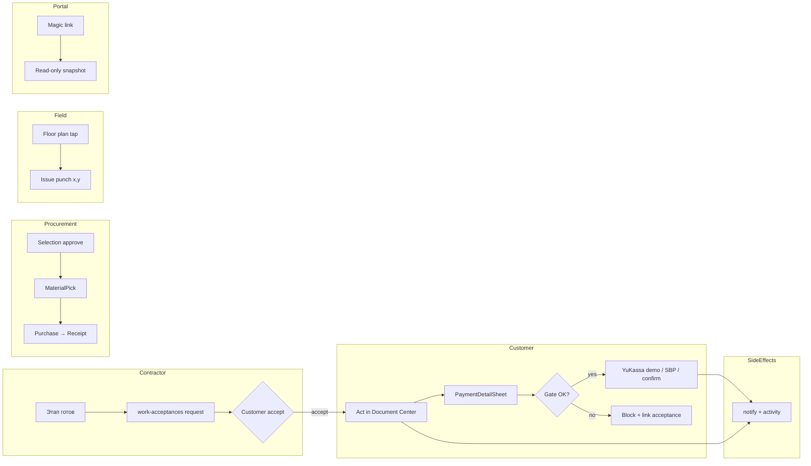
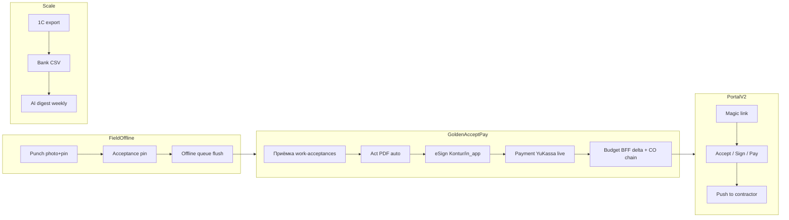

# Renova — master competitive gap + improvement plan

**Дата:** 2026-07-17  
**Репозиторий:** https://github.com/PetrFedin/renova  
**Ветка:** `develop` (после P0–P2.5)  
**Основание:** `MARKET-COMPETITIVE-AUDIT-2026-07-15.md`, `PRODUCT-REMEDIATION-PLAN-2026-07-15.md`, UI/UX audit (9265fc99), competitor analysis (a7f9cd42), волны P0–P2.5

**Связанные артефакты:**

| Документ | Роль |
|----------|------|
| `MARKET-COMPETITIVE-AUDIT-2026-07-15.md` | Исходный рыночный срез (pre-P0) |
| `DEAD-ENDS-INVENTORY-2026-07-15.md` | Быстрый реестр тупиков (обновлён post-P2.5) |
| `PRODUCT-REMEDIATION-PLAN-2026-07-15.md` | Фазы P0–P3, DoD |
| `P0-ACCEPTANCE-UNIFY-2026-07-16.md` … `P2-WAVE5-PLAN-PUNCH-2026-07-17.md` | Детали волн |

---

## 1. Executive summary (RU)

Renova — **dual-role B2B платформа ремонта квартир** (заказчик + исполнитель) с сильным ядром: calc-engine сметы, Document Center, золотой путь **приёмка → gate → оплата → акт**, offline-очередь на критичных мутациях, 4-столпная IA.

**За 2 дня (P0–P2.5) закрыто:** единый канон приёмки (`work-acceptances`), Finance Center → `PaymentDetailSheet`, cross-domain notify (CO/pay/doc), dead ends batch 1, ACL, automation cron, schedule SoT, route registry v2, procurement hub UI, ЮKassa scaffold + deep link, Kontur sandbox + polling, native download/ICS, budget BFF, web portal v1 (magic link), selections → MaterialPick, plan-punch MVP.

**Стратегические оценки (perceived completeness, post-P2.5):**

| Сегмент | Было (15.07) | Сейчас | Δ |
|---------|--------------|--------|---|
| RU B2B renovation | ~70% | **~82%** | +12 |
| Global remodel PM | ~55% | **~72%** | +17 |
| Field QA / punch | ~50% | **~65%** | +15 |
| Offline поле | ~40% | **~48%** | +8 |
| RU scale (1C/банк) | ~25% | **~28%** | +3 |

**Главный вывод:** продукт **вышел из зоны «dev-прототип с дублями»** в зону **«staging-ready RU B2B MVP+»**. До «улучшенного аналога» (Vition/Smetter + Buildertrend client + Fieldwire приёмка) остаётся **3 блока**:

1. **Trust layer (P3):** live ЮKassa staging, Kontur webhook → signed_at, portal v2 (sign/pay), CO→eSign→budget chain.
2. **IA cleanup (P3):** убрать finance-center как отдельный центр, слить 3 schedule UX, удалить 15 legacy tabs, registry ≈ screens.
3. **Scale (P4–P5):** offline расширение, 1C/bank import, AI digest, warranty.

**Не строить:** Procore RFIs/BIM, marketplace внутри project chat, enterprise multi-tenant до product-market fit.

---

## 2. Competitor matrix (condensed)

Легенда: ✅ паритет · 🟡 частично · ❌ gap · 🔴 дубль/конфликт · **🟢 закрыто post-P2.5**

| Область | Fieldwire | PlanRadar | Procore | Buildertrend | Houzz Pro | Smetter | Gectaro | Vition | Renova (17.07) |
|---------|-----------|-----------|---------|--------------|-----------|---------|---------|--------|----------------|
| Dual roles | — | — | ✅ | ✅ | ✅ | ✅ | ✅ | ✅ | ✅ |
| Смета / calc-engine | — | — | — | ✅ | 🟡 | ✅ | ✅ | 🟡 | ✅ |
| Этапы + график | 🟡 | ✅ | ✅ | ✅ | ✅ | ✅ | ✅ | ✅ | 🟡 (3 UX) |
| Приёмка этапа | ✅ | ✅ | ✅ | ✅ | 🟡 | ✅ | 🟡 | ✅ | **🟢** 1 API |
| Punch на плане | ✅ | ✅ | ✅ | 🟡 | — | — | — | 🟡 | **🟢** MVP |
| Change orders | — | 🟡 | ✅ | ✅ | 🟡 | 🟡 | 🟡 | 🟡 | 🟡 (нет eSign chain) |
| Платежи + acquiring | — | — | ✅ | ✅ | ✅ | 🟡 | 🟡 | 🟡 | 🟡 (demo + scaffold) |
| Budget plan-fact | — | — | ✅ | ✅ | 🟡 | ✅ | ✅ | 🟡 | **🟢** BFF |
| Закупки / снабжение | — | 🟡 | 🟡 | ✅ | 🟡 | ✅ | ✅ | 🟡 | **🟢** hub |
| Selections | — | — | — | ✅ | ✅ | — | — | — | **🟢** + pick link |
| Document center | 🟡 | ✅ | ✅ | ✅ | 🟡 | ✅ | 🟡 | ✅ | ✅ strong |
| eSign legal (RU) | — | 🟡 | — | — | — | ✅ | ✅ | ✅ | 🟡 sandbox |
| Branded web ЛК | — | 🟡 | ✅ | ✅ | ✅ | 🟡 | 🟡 | ✅ | **🟢** v1 read-only |
| Offline поле | ✅ | ✅ | 🟡 | 🟡 | — | 🟡 | 🟡 | 🟡 | 🟡 ~10 мутаций |
| 1C / банк | — | — | — | — | — | ✅ | ✅ | 🟡 | ❌ |
| Чат по объекту | 🟡 | ✅ | ✅ | ✅ | ✅ | ✅ | 🟡 | ✅ | ✅ |
| ФНС / чеки | — | — | — | — | — | 🟡 | 🟡 | — | 🟡 stub |

**Позиционирование:** Renova = **Smetter/Vition (RU ядро) + Buildertrend selections/portal + Fieldwire punch** — без enterprise overhead Procore.

---

## 3. What we have / competitors have / gap severity

### 3.1 Сильные стороны (moat)

| # | Capability | vs конкуренты | Файлы / якорь |
|---|------------|---------------|---------------|
| 1 | Dual-role iOS (customer + contractor) | Редко в одном app у RU | `apps/mobile/app/(customer|contractor)/` |
| 2 | Calc-engine сметы (комнаты × работы) | ≈ Smetter | `backend/app/services/estimate/` |
| 3 | Golden path accept→act→pay | Прозрачнее многих RU «чат+фото» | `work_acceptances.py`, e2e-smoke |
| 4 | Document Center (версии, ACL, OCR flags) | Strong vs RU MVP | `project_document_service.py`, `DocumentsHub.tsx` |
| 5 | Environment profiles (staging guards) | Редкость у MVP | `environment.py` |
| 6 | Procurement loop scaffold | ≈ Gectaro path | `OsMaterialsScreen`, P1-WAVE3 |
| 7 | Selections → MaterialPick | ≈ Houzz/BT | P2-WAVE3/4 |
| 8 | Plan-punch MVP | ≈ Fieldwire lite | `FloorPlanPanel`, P2-WAVE5 |
| 9 | Web portal magic link | ≈ BT client portal v0 | `portal_token_service.py`, `portal.tsx` |
| 10 | Budget BFF (1 call) | UX win vs 6 parallel calls | `budget_service.budget_hub()` |

### 3.2 Gaps по severity

| Severity | Gap | У кого must-have | Статус post-P2.5 |
|----------|-----|------------------|------------------|
| **P0** | Live ЮKassa (не demo) | RU PM | 🟡 scaffold + webhook; нужны staging keys |
| **P0** | CO → notify → eSign → budget delta | Buildertrend | 🟡 notify ✅; eSign chain ❌ |
| **P0** | Portal sign/pay (не только read) | Houzz/BT/Vition | 🟡 v1 read-only |
| **P1** | Kontur live webhook | Smetter, ПРОРАБ | 🟡 sandbox + dev simulate |
| **P1** | Offline: documents, issues, schedule | Fieldwire | 🟡 partial |
| **P1** | IA: finance-center dup, 3 schedule, legacy tabs | Internal | 🔴 частично |
| **P1** | Punch photo on tap | Fieldwire | 🟡 coords only |
| **P2** | 1C export / bank CSV | Smetter, Gectaro | ❌ |
| **P2** | ФНС verify live | RU diff | 🟡 stub |
| **P2** | AI weekly digest | Emerging 2026 | ❌ |
| **P3** | Warranty post-closeout | BT heritage | ❌ |

---

## 4. Dead ends, broken links, demos, duplicates

> Полный быстрый справочник: `DEAD-ENDS-INVENTORY-2026-07-15.md` (обновлён 17.07).

### 4.1 По столпам IA

| Столп | P0 (закрыто) | P1 (остаток) | P2 (остаток) |
|-------|--------------|--------------|--------------|
| **Главная** | Banner → work-acceptance ✅ | Дубли CTA в «Ещё» | Единая action queue |
| **Объект** | — | Floor plan punch без фото | Acceptance pin на плане |
| **Ремонт** | Control → work-acceptances ✅ | QC vs control vs issues | Punch photo picker |
| **Бюджет** | Finance → PaymentDetailSheet ✅ | finance-center entry остаётся | CO visual in budget hub |
| **Ещё** | Kontur hide, notify router ✅ | 87 routes vs 20 registry | Удалить legacy tabs |

### 4.2 Mobile dead ends — статус

| ID | Экран | Было | Статус 17.07 | Приоритет |
|----|-------|------|--------------|-----------|
| M1 | Finance Center | Confirm без sheet | **✅ P0.2** sheet + redirect | — |
| M2 | Home banner | → control | **✅ P0.1** → work-acceptance | — |
| M3 | Repair Control | старый API | **✅ P0.1** workAcceptancesApi | P3: удалить control tab |
| M4 | Work Acceptance | нет offline UI | **🟡** queue есть; UI partial | P3.2 |
| M5 | Documents Kontur | alert 501 | **✅ P0.4** hide + poll P2.1 | P3.1 live |
| M6 | Doc без файла | alert без upload | **✅ P0.4** CTA upload | — |
| M7 | Design PDF | «только web» | **✅ P0.4** native picker | — |
| M8 | downloadFile | «браузер» | **✅ P2.4** expo-sharing | — |
| M9 | Ical import | «только web» | **✅ P2.4** DocumentPicker | — |
| M10 | Notifications | mark read only | **✅ P0.4** resolveNotificationLink | P3: 100% coverage |
| M11 | SBP pay | alert text | **🟡** openSbp + requisites | P3.1 clipboard deeplink |
| M12 | project-analytics | WIP redirect | **🔴** wip | P4 или delete |
| M13 | Contractor empty | wrong role | **✅ P0.4** | — |

### 4.3 Backend — разорванные цепочки

| ID | Действие | Статус 17.07 |
|----|----------|--------------|
| B1 | legacy stages/accept | **✅ 410** |
| B2 | os/acceptances | **✅ proxy** |
| B3 | change orders notify | **✅ P0.3** |
| B4 | payment confirm notify | **✅ P0.3** |
| B5 | document sign activity | **✅ P0.3** |
| B6 | stage → calendar write | **🟡** docstrings SoT; auto-write partial |
| B7 | scan_project_reminders | **✅ P1.6** cron worker |
| B8 | waste reminders | **✅ P1.6** cron worker |
| B9 | CO approve → budget line | **❌** P3.3 |
| B10 | Selection approve → pick | **✅ P2.4** |
| B11 | YuKassa webhook → confirm | **🟡** demo instant; live keys pending |
| B12 | Kontur webhook → signed_at | **🟡** dev simulate only |

### 4.4 Demo / stub (не prod)

| Компонент | Prod-safe? | Wave |
|-----------|------------|------|
| Demo auth phones | dev only | guard ENV |
| ЮKassa instant demo | dev/test без keys | P3.1 staging keys |
| SMS demo_code | no Twilio | OK MVP |
| OCR keyword heuristic | always | P4 optional ML |
| Kontur 501 when off | **✅ hidden** | P3.1 live |
| FNS receipt verify stub | stub | P4 |
| EXPO_PUBLIC_DEMO=1 | dev | hide prod |

### 4.5 Duplicates (redundancy map)

| Зона | Дубли (count) | Целевое состояние | Wave |
|------|---------------|-------------------|------|
| Приёмка | 5 entry → 2 осталось | 1 screen + 1 API | P3.4 |
| Schedule | 3 (calendar, work-schedule, OS) | Hub «Сроки» | P3.4 |
| Payments | 4 (budget, finance-center, stage, legacy money) | Budget › Payments only | P3.4 |
| Documents | 2–3 entry | Home.more + os.menu deduped ✅ | P3.4 |
| QC / control / issues | 3 surfaces | QC = issues; control deprecated | P3.4 |
| Routes | **87 files / 20 registry** | registry = user-facing | P3.5 |

---

## 5. UI/UX optimization plan

### 5.1 Топ-10 оптимизаций (prioritized)

| # | Оптимизация | Impact | Effort | Wave |
|---|-------------|--------|--------|------|
| 1 | **Action contract** на каждой кнопке (state + owner + side effect) | 10 | M | P3 |
| 2 | Единая **Next Action** очередь на Home (не banner/inbox/notif раздельно) | 9 | M | P3 |
| 3 | Убить **finance-center** как отдельный центр → redirect only | 9 | S | P3.4 |
| 4 | Hub **«Сроки»**: calendar + work-schedule без 3 входов | 8 | M | P3.4 |
| 5 | Portal **v2**: accept stage + sign act + pay pending | 9 | L | P3.2 |
| 6 | **PaymentDetailSheet** everywhere (stage block reuse) | 8 | S | P3 |
| 7 | Offline badge + retry **единый паттерн** (`offlineUi.ts` everywhere) | 7 | M | P3.2 |
| 8 | Punch: **фото при tap** на плане | 8 | M | P3.2 |
| 9 | Registry v3: **promote GA, delete wip** (analytics, reports) | 6 | S | P3.5 |
| 10 | Empty states с **role-aware CTA** (contractor vs customer) | 7 | S | P3 |

### 5.2 IA target (без смены URL)

```
Dock: Главная | Объект | Ремонт | Бюджет
Menu: Чат, Календарь (→ Сроки hub)
More (свернуть): Документы · Приёмка · График · QC · Manager · Portal share
Удалить из More: finance-center (redirect), legacy tabs (plan/works/control/money)
```

### 5.3 UX patterns vs конкуренты

| Паттерн | Smetter/Vition | Buildertrend | Renova target |
|---------|----------------|--------------|---------------|
| Next action | Dashboard card | Client portal todo | Home action queue P3 |
| Pay | Счёт + bank | Invoice drawer | PaymentDetailSheet ✅ |
| Accept | Checklist + act | CO + sign | work-acceptance ✅ + portal sign P3 |
| Field defect | Фото | Pin on plan | punch MVP ✅ + photo P3 |
| Materials | Заявка→закупка | Selections | Selections ✅ + procurement ✅ |

---

## 6. Golden path — current vs target

### 6.1 Current (post-P2.5)



### 6.2 Target (P3–P5)



**Gap между current и target:** trust layer (live pay/eSign), portal actions, CO→budget, offline expansion, scale integrations.

---

## 7. Phased roadmap P3–P5

### Wave map overview

| Phase | Horizon | Theme | Key deliverables |
|-------|---------|-------|------------------|
| **P3** | 4–8 нед | Trust + IA cleanup | Live YuKassa staging, Kontur webhook, portal v2, IA dedup, offline+ |
| **P4** | 8–14 нед | RU scale + field | 1C/bank, ФНС live, punch photo, acceptance pin, cron hardening |
| **P5** | 14–20 нед | Premium + retention | AI digest, warranty, marketplace→project, registry=screens |

---

### P3-WAVE1 — Live payments + Kontur completion

| Task | Files | Effort | Success criteria |
|------|-------|--------|------------------|
| P3.1a YuKassa staging keys | `yookassa_service.py`, `eas.json`, `.env.staging` | M | Real test payment E2E; no auto-demo in staging |
| P3.1b Webhook idempotency audit | `payments.py`, `test_yookassa_project_payment.py` | S | Duplicate webhook → single confirm |
| P3.1c SBP clipboard deeplink | `PaymentDetailSheet.tsx` | S | Copy amount + open bank app |
| P3.1d Kontur webhook | `esign/kontur.py`, `documents.py` | L | sandbox e2e: sign → webhook → signed_at |
| P3.1e Hide demo Pro in staging | `config.py`, subscription routes | S | No instant Pro without billing |

---

### P3-WAVE2 — Portal v2 + CO chain

| Task | Files | Effort | Success criteria |
|------|-------|--------|------------------|
| P3.2a Portal accept/sign | `portal.py` routes, `portal.tsx` | L | Viewer accepts stage via token |
| P3.2b Portal pay pending | `portal snapshot`, YuKassa return | M | Pay from browser magic link |
| P3.2c CO → budget line | `change_order_service.py`, `budget_service.py` | M | Approved CO updates plan-fact |
| P3.2d CO → eSign act | `documents.py`, CO template | L | CO approval generates signable doc |
| P3.2e Branded theme | `portal.tsx`, CSS tokens | S | Logo + project name in header |

---

### P3-WAVE3 — Field + offline parity

| Task | Files | Effort | Success criteria |
|------|-------|--------|------------------|
| P3.3a Punch photo on tap | `FloorPlanPanel.tsx`, `mediaUpload.ts` | M | Issue with photo_key from plan tap |
| P3.3b Acceptance plan pin | `work_acceptances.py`, mobile | L | Accept with floor_plan x,y |
| P3.3c Offline: issues create | `offlineQueue.ts`, issues API | M | Queued punch offline |
| P3.3d Offline: doc metadata | `documents.ts` | M | Clear block OR queue sign request |
| P3.3e Work acceptance offline UI | `WorkAcceptanceScreen.tsx`, `offlineUi.ts` | S | Badge + retry on all actions |

---

### P3-WAVE4 — IA consolidation

| Task | Files | Effort | Success criteria |
|------|-------|--------|------------------|
| P3.4a finance-center → redirect only | `finance-center.tsx`, `routeRegistry.ts` | S | No standalone screen; budget tab |
| P3.4b Schedule hub | `calendar.tsx`, `WorkScheduleScreen.tsx`, Home CTA | M | 1 entry «Сроки» |
| P3.4c Deprecate control tab | `control.tsx`, `LegacyTabRedirect` | M | All → work-acceptance |
| P3.4d QC = issues only | `QualityControlScreen.tsx`, repair tabs | M | Single issues surface |
| P3.4e Home action queue | `HomeScreen`, `buildHomeKpiDetail` | M | 1 prioritized todo list |

---

### P3-WAVE5 — Registry v3 + test hardening

| Task | Files | Effort | Success criteria |
|------|-------|--------|------------------|
| P3.5a Delete 5 legacy tabs/sprint | `LegacyTabRedirect.tsx`, tab files | M | −5 routes per sprint |
| P3.5b Promote or delete wip routes | `project-analytics.tsx`, `reports.tsx` | S | No wip in menu |
| P3.5c `test:routes` full coverage | `routeRegistry.test.mjs` | M | All GA entryPoints tested |
| P3.5d E2E: OS acceptances regression | `e2e-smoke.sh` | S | Proxy path covered |
| P3.5e E2E: procurement chain | new e2e script | M | pick → purchase → receipt |

---

### P4-WAVE1 — RU integrations

| Task | Files | Effort | Success criteria |
|------|-------|--------|------------------|
| P4.1a 1C export (XML/CSV) | new `integrations/onec/` | L | Export payments + acts |
| P4.1b Bank statement CSV import | `receipts.py`, import service | L | Match to expenses |
| P4.1c FNS verify live | `fns/receipt_verify.py` | M | Staging verify PASS |
| P4.1d Stage → calendar auto-write | `stage_service.py`, `calendar_service.py` | M | Start stage → event |

---

### P4-WAVE2 — Automation + AI optional

| Task | Files | Effort | Success criteria |
|------|-------|--------|------------------|
| P4.2a Cron hardening | `automation_reminders_worker.py` | S | Metrics + alert on failure |
| P4.2b Email budget alerts | `email_stub.py` → real SMTP | M | Overrun → email |
| P4.2c AI weekly digest | `kpi-weekly.pdf`, Ollama | M | Push summary RU |

---

### P5 — Retention + scale

| Task | Files | Effort | Success criteria |
|------|-------|--------|------------------|
| P5.1 Warranty tickets | new model + screen | L | Post-closeout defects |
| P5.2 Job-lead → project convert | marketplace routes | M | 1-click project spawn |
| P5.3 Registry = screens (87→~25) | delete dead routes | L | grep audit clean |
| P5.4 TestFlight full checklist | `TESTFLIGHT-NOTES-v0.2.md` | M | All PASS staging |

---

## 8. What NOT to build (anti-patterns)

| Anti-pattern | Почему не сейчас | Альтернатива |
|--------------|------------------|--------------|
| Procore RFIs / submittals / BIM | Overkill для квартиры | Issues + punch + documents |
| Second acceptance API | Был боль — закрыто P0 | Только `work-acceptances` |
| Finance Center as product surface | Дубль Budget | Redirect → budget?tab=payments |
| Marketplace chat = project chat | Domain confusion | Separate job-leads flow |
| MongoDB / Kafka / microservices | Stack rule | PostgreSQL + FastAPI monolith |
| Full offline-first CRDT | Effort >> value MVP | Expand queue selectively P3 |
| Stripe before RU PMF | RU market first | YuKassa live → Stripe later |
| AI chatbot on every screen | Noise | AI digest P4 optional |
| Admin/articles in core IA | Marketing ≠ ops | Hidden routes OK |
| Enterprise multi-org ACL now | Premature | `require_project` ✅ sufficient |

---

## 9. Definition of Done — «улучшенный аналог» (target Dec 2026)

1. **M1 Consistent core** — 1 acceptance, 1 finance flow, registry ≈ screens → **~90%** (сейчас ~75%)
2. **M2 Trustworthy ops** — live pay staging, eSign chain, notify all money → **~85%** (сейчас ~70%)
3. **M3 RU parity** — procurement ✅, ФНС live, 1C export → **~80%** (сейчас ~65%)
4. **M4 Premium remodel** — selections ✅, punch+photo, portal v2 → **~75%** (сейчас ~60%)
5. **M5 Scale** — cron ✅, AI digest, warranty → **~50%** (сейчас ~35%)

**Perceived completeness для RU B2B reno:** target **~85%** при закрытии P3 + P4.1.

---

## 10. Tracking

После каждой волны обновлять:

- `docs/PRIORITY-EXECUTION-PLAN.md` — статус
- `docs/DEAD-ENDS-INVENTORY-2026-07-15.md` — закрытые ID
- `docs/MARKET-COMPETITIVE-AUDIT-2026-07-15.md` — колонка post-P2.5
- Этот документ — §3 scores + §4 dead ends

**Commits волны P0–P2.5:** см. `P0-ACCEPTANCE-UNIFY-2026-07-16.md` … `P2-WAVE5-PLAN-PUNCH-2026-07-17.md`.

---

*Сгенерировано: competitive synthesis 2026-07-17 · agent inputs a7f9cd42 + 9265fc99*
