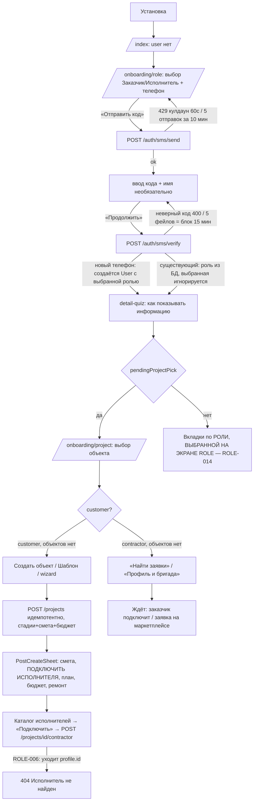
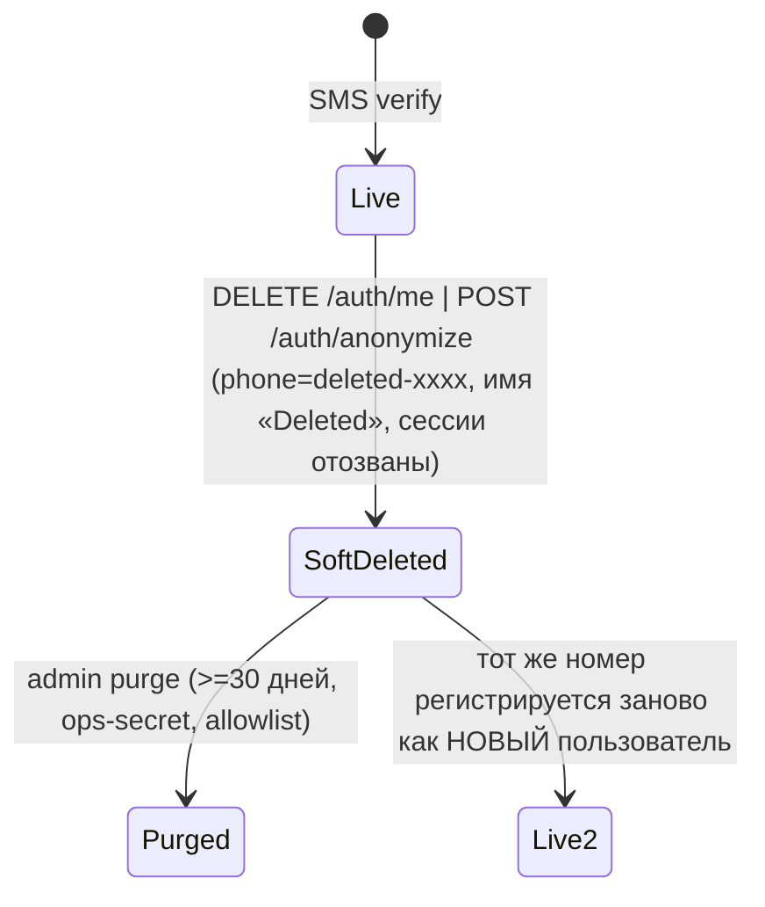

# Срез 01 — Роли, доступ, онбординг, создание проекта

Дата аудита: 2026-09-30. Код: `main` @ `fbe5082f`. Продуктовый код не менялся.
Метод: чтение кода; прогон существующих тестов среза (51 passed: `test_unassigned_project_acl`, `test_project_lifecycle`, `test_project_participant_management`, `test_project_create_atomicity`, `test_team_lifecycle_integrity`, `test_subscription_trial`, `test_account_lifecycle_integrity`, `test_project_viewer_idempotency`, `test_project_profile_persistence_integrity`); три временных in-process ASGI-пробы (вне репозитория, SQLite, заголовок `X-User-Id`) — результаты помечены «ПРОБА». Живой backend не использовался для записи.

Обозначения: «ПРОБА» — воспроизведено запуском; «КОД» — доказано чтением кода (grep/цепочка вызовов), в UI не запускалось; «ГИПОТЕЗА» — не проверено.

---

## 1. Инвентарь среза

### 1.1 Backend

| Что | Где |
|---|---|
| Сборка роутеров, подмена старых маршрутов новыми (`_remove_replaced_routes`) | `backend/app/api/v1/router.py:44-49, 107-112, 129-137` |
| JWT/`X-User-Id`, `get_current_user` (проверка `deleted_at`, `tokens_invalid_before`) | `backend/app/api/deps.py:60-109` |
| `require_project(db, id, user, write)` — единый шлюз доступа к проекту; supervisor только read | `backend/app/api/deps.py:112-148` |
| Режим доступа owner/contractor/guest/none | `backend/app/services/team_service.py:472-515` (`project_access_mode`, `can_access_project`) |
| Capability внутри проекта (`field_write`, `escalate`, `schedule`, `estimate_lock`) | `team_service.py:518-552` |
| Admin = роль contractor + allowlist `ADMIN_USER_IDS` (в dev/test — любой contractor) | `backend/app/api/admin_access.py:18-51` |
| Технадзор: `SUPERVISOR_CAPABILITIES`, `project_access_descriptor` | `services/technical_supervision_service.py:17-19, 404-414` |
| Вход/регистрация: `/auth/register` (только dev/test), `/auth/demo`, `/auth/demo/guest`, `/auth/refresh`, `/auth/logout`, `/auth/me`, `/auth/export` | `api/v1/auth.py:52-291` (часть маршрутов заменена, см. ниже) |
| OTP (канонический): `/auth/sms/send`, `/auth/sms/verify` (лимиты: send 5/тел, 20/IP, 10/устр; verify 20/60/30; кулдаун 60 с, TTL 300 с, блок 900 с) | `api/v1/otp_auth.py:82-153`; `services/otp_service.py:23-28,599+`; `services/otp_abuse_service.py:14-15`; `services/otp_login_service.py:22-89` |
| Жизненный цикл аккаунта: `DELETE /auth/me`, `POST /auth/anonymize` (= soft-delete), `POST /auth/sessions/revoke-all`, `POST /auth/admin/purge-deleted-accounts` | `api/v1/account_lifecycle.py:32-98`; `services/account_lifecycle_service.py:20-59`; `services/account_purge_guard.py`; `services/account_purge_service.py:17-38` |
| Создание проекта (канон): `POST /projects`, `POST /projects/from-template` (только customer, идемпотентность через `client_request_id`) | `api/v1/project_creation.py:68-117`; `services/project_create_service.py:288-411` |
| Проекты: список (`bucket=active/archived/trashed`), детали, PATCH профиля, archive/unarchive/trash/restore/purge/empty-trash, viewers, dashboard | `api/v1/projects.py:157-469`; `services/project_service.py:184-360` |
| Назначение исполнителя (канон): `POST /projects/{id}/assign` (самозахват), `POST /projects/{id}/contractor` (заказчик) | `api/v1/project_assignment_integrity.py:41-73`; `services/project_assignment_service.py:43-111` |
| Участники multi-contractor: `GET/POST /projects/{id}/participants`, `PATCH .../{pid}/scopes`, `DELETE .../{pid}` (только владелец) | `api/v1/project_participants.py:108-164`; `services/project_participant_service.py:113-420` |
| Бригады: `GET /teams/me`, `POST /teams`, `/teams/invite`, `/teams/invite-sms`, `/teams/invite-link`, `PATCH /teams/member-role`, `POST /teams/join` | `api/v1/teams.py:63-199`; `services/team_service.py`; `services/team_invite_join_service.py` |
| Подписка: `/subscription/me`, `/start-trial`, `/checkout` (канон в `subscription_integrity`), `/webhook` | `api/v1/subscription.py:41-56`; `api/v1/subscription_integrity.py:190-463`; `services/subscription_service.py` |
| Лимит free-тарифа: `settings.contractor_free_project_limit = 1` | `core/config.py:52`; применение `project_assignment_service.py:94-98` |
| Каталог исполнителей для заказчика | `api/v1/marketplace.py:136-167` (`/contractors`), `345-376` (`/contractors/match`) |
| Режим «без исполнителя» (self-managed) — заказчик сам исполняет и принимает этапы | `services/accept_orchestrator.py:51-52`; `stage_mutation_service.py:29-93`; `stage_review_service.py:41-107` |

Заменённые (мёртвые) обработчики, остающиеся в файлах: `auth.py` (`/anonymize`, `/me DELETE`, `/sessions/revoke-all`, `/admin/purge-deleted-accounts`, `/sms/*`), `projects.py` (`POST ""`, `/from-template`, `/assign`, `/contractor`, `/stages/*/submit|reject`), `project_service.assign_contractor` / `create_project`, `subscription.py` (`/checkout`, `/webhook`).

### 1.2 Mobile (`apps/mobile`)

| Что | Где |
|---|---|
| Корневой стек, группы `(customer)`, `(contractor)`, `wizard`, `onboarding` | `app/_layout.tsx:74-104` |
| Стартовая маршрутизация (нет user → `/onboarding/role`; `pendingProjectPick` → выбор объекта; иначе вкладки по `user.role`) | `app/index.tsx:12-42` |
| Онбординг: `role` / `project` / `detail-quiz` | `app/onboarding/[step].tsx`, `_screens/role.tsx:19-173`, `_screens/project.tsx`, `_screens/detail-quiz.tsx` |
| Навигация после входа | `lib/osEntry.ts:23-37` |
| Сессия: `demoLogin`, `loginWithSms`, `loadProject`, `logout`, `createProjectFromWizard` | `lib/context/RenovaContext.tsx:530-596, 296-337, 731, 598-660` |
| Wizard создания проекта: `type` → `rooms` → `confirm` | `app/wizard/[step].tsx`, `_screens/type.tsx`, `rooms.tsx`, `confirm.tsx` |
| После создания: «Что дальше?» | `components/renova/os/home/PostCreateSheet.tsx:16-92` |
| Подключение исполнителя (заказчик) | `components/renova/ContractorInvitePanel.tsx`, `ContractorDirectory.tsx:54-77` |
| Исполнитель без объектов | `components/renova/ProjectEmptyState.tsx:412-436` |
| Wizard исполнителя из заявки | `app/contractor-wizard/[leadId].tsx` |
| Бригада: QR, invite-link, сканер | `app/(contractor)/_screens/team-qr.tsx` |
| Подписка / paywall | `app/(contractor)/_screens/subscription.tsx`; `RenovaContext.tsx:811` |
| Смена роли = выход | `components/renova/RoleSwitchButton.tsx`; `detail-quiz.tsx:34-37` |
| Профиль: экспорт данных, «Выйти на всех устройствах» (кнопки удаления аккаунта нет) | `components/screens/profile/CustomerProfileScreen.tsx:130-150`, `ContractorProfileScreen.tsx:305-324` |

---

## 2. Матрица «кто что может»

Роли БД: `customer`, `contractor` (`UserRole`). Остальное — производное: «исполнитель-лид» = `project.contractor_id`; «команда» = `TeamMember` в бригаде лида (`owner/foreman/member/viewer`); «гость» = `ProjectViewer`; «технадзор» = активное `ProjectTechnicalSupervisorAssignment`; «admin» = contractor из allowlist (в dev/test — любой contractor). Отдельной роли viewer/admin в `UserRole` нет.

Условные обозначения: ✓ можно, ✗ 403/404, R — только чтение, (!) — расхождение/дефект (см. реестр).

| Действие | Владелец-заказчик | Лид-исполнитель | Команда: owner/foreman/member | Команда: viewer | Гость (`ProjectViewer`) | Участник (`ProjectParticipant`, не лид) | Технадзор | Посторонний contractor | Где проверяется |
|---|---|---|---|---|---|---|---|---|---|
| Создать проект | ✓ | ✗ | ✗ | ✗ | ✓ если сам customer (своё) | ✗ | ✗ | ✗ | `project_creation.py:74,103` |
| Список `/projects` | свои + где гость | где `contractor_id ∈ {я}∪владельцы моих бригад` (в т.ч. viewer!) | то же | то же (R) | только свои/гостевые | **не видит** (!ROLE-008) | + `list_supervised_projects` | пусто | `project_service.py:426-455`; `projects.py:157-176` |
| `GET /projects/{id}` | ✓ | ✓ | ✓ | R | R | **403** (!ROLE-008) | R | 403 | `deps.py:112-135`, `team_service.py:472-506` |
| `customer_budget` в ответе | ✓ | **виден** (!ROLE-001) | виден | виден | **виден** | — | виден | — | `projects.py:42,51` |
| `PATCH /projects/{id}` (имя, адрес, даты, vat, `customer_budget`, тип ремонта) | ✓ | **✓ (!ROLE-004)** | **✓ (!)** | ✗ | ✗ | ✗ | ✗ (write закрыт) | ✗ | `projects.py:288-293` (`write=True`, роль не проверяется) |
| Archive / unarchive / trash / restore / purge | ✓ (только владелец) | ✗ | ✗ | ✗ | ✗ | ✗ | ✗ | ✗ | `project_service.py:413-419, 456-505`; `projects.py:229-285` |
| Purge с платежами | ✓ **без проверки платежей** (!ROLE-005) | — | — | — | — | — | — | — | `project_service.py:519-526` |
| Empty trash | ✓ (нужен ≥1 проект) | ✗ | ✗ | ✗ | ✗ | ✗ | ✗ | ✗ | `projects.py:265-272` |
| Назначить лида («Подключить») | ✓ (`POST /contractor`, любого contractor по user_id) | самозахват `POST /assign` любого проекта без лида (!ROLE-002) | ✗ (только role=contractor и `actor.id==contractor_id` → 409/403) | ✗ | ✗ | ✗ | ✗ | самозахват ✓ (!) | `project_assignment_integrity.py:47,64`; `project_assignment_service.py:70-82` |
| Заменить/снять лида | ✗ нет такой функции (!ROLE-003) | ✗ | ✗ | ✗ | ✗ | ✗ | ✗ | ✗ | `project_assignment_service.py:84-87`; `project_participant_service.py:361-362` |
| Участники: list/add/scopes/remove | ✓ (только владелец) | ✗ | ✗ | ✗ | ✗ | ✗ | ✗ | ✗ | `project_participants.py:77-83` |
| Доступ самого участника | — | — | — | — | — | ✗ везде (`scope_allows` нигде не вызывается) (!ROLE-008) | — | — | grep по `backend/app` |
| Гости: list/share/remove | ✓ | ✗ | ✗ | ✗ | ✗ | ✗ | ✗ | ✗ | `projects.py:410-469` |
| Технадзор: назначить/снять | ✓ (`PUT/DELETE /projects/{id}/technical-supervision`) | ✗ | ✗ | ✗ | ✗ | ✗ | — | ✗ | `technical_supervision.py:152,184` |
| Бригада: создать/пригласить/роль | — | ✓ (`role==contractor`, владелец бригады) | ✗ | ✗ | — | — | — | ✓ для своей бригады | `teams.py:58-61,80-189`; `team_service.py:362-398,721-731` |
| Вступить в бригаду по токену | ✗ (403) | ✓ | ✓ | ✓ | ✗ | ✓ | ✗ | ✓ | `teams.py:192-199`; `team_invite_join_service.py` |
| График (`can_manage_schedule`) | только если нет лида | ✓ | owner/foreman | ✗ | ✗ | ✗ | review | ✗ | `project_work_schedule_service.py:31-39` |
| Стадия: старт/сдача/отклонение | заказчик: reject; сам исполняет если лида нет | сдача | owner/foreman (schedule), member (field_write) | ✗ | ✗ | ✗ | — | ✗ | `stage_mutation_service.py:65-93`; `stage_review_service.py:97-118` |
| Подписка: trial/checkout | ✗ 403 | ✓ | ✓ (своя, не наследуется владельцем) | ✓ | ✗ | ✓ | ✗ | ✓ | `subscription.py:49`, `subscription_integrity.py:196` |
| Admin-эндпоинты | ✗ | ✓ только если allowlist (в dev/test — любой contractor) | то же | то же | ✗ | то же | ✗ | то же | `admin_access.py:18-51` |
| Удалить свой аккаунт | ✓ без проверок активных проектов (!ROLE-016) | ✓ без проверок | ✓ | ✓ | ✓ | ✓ | ✓ | ✓ | `account_lifecycle.py:41-46`; `account_lifecycle_service.py:20-59` |

Лимит free-тарифа: 1 проект в роли лида на исполнителя; проверяется только при смене лида (`project_assignment_service.py:94-98`); `is_pro` не используется больше нигде (`grep is_pro` — только подписка и назначение). То есть Pro = «можно быть лидом на >1 проекте»; командные/QR-функции сервер на Pro не завязывает.

---

## 3. Последовательности и состояния

### 3.1 Путь нового пользователя (заказчик и исполнитель)



Где застревает новый пользователь:
- Заказчик: последний шаг «Подключить исполнителя» из каталога всегда падает 404 (ROLE-006); шаринг «Кода объекта» бесполезен (ROLE-007); подписка для 402 недоступна заказчику (ROLE-011).
- Исполнитель: попасть на объект можно только через заявку/маркетплейс (`contractor-wizard`), через ссылку-приглашение в бригаду (диплинк не обработан, ROLE-009) или если заказчик выберет его в каталоге (нужна заполненная карточка компании, иначе он невидим — `marketplace.py:136-150`, ПРОБА: «directory before profile: []»).
- Роль выбирается один раз при первом SMS-входе и потом не меняется; «Выбор роли» = выход из аккаунта (`RoleSwitchButton.tsx`, `detail-quiz.tsx:34-37`).

### 3.2 Подключение исполнителя к проекту

```mermaid
sequenceDiagram
  participant C as Заказчик
  participant S as Backend
  participant X as Исполнитель
  Note over C,X: Проект создан, contractor_id=NULL → режим self-managed (заказчик сам исполняет и принимает этапы)
  C->>S: POST /projects/{id}/contractor {contractor_id=USER_ID}
  S->>S: FOR UPDATE, актор=владелец, target=contractor не удалён
  alt у контрагента уже >= 1 проекта и нет Pro
    S-->>C: 402 subscription_required «Нужен Pro для нового объекта» (заказчик исправить не может)
  else другой лид уже назначен
    S-->>C: 409 already_assigned (снять/заменить лида нельзя)
  else ok
    S->>S: project.contractor_id=X; ProjectParticipant(lead, all_scope) + событие
    S-->>C: 200 ProjectDetail (уведомления X нет, согласия X не запрашивается)
  end
  X->>S: POST /projects/{id}/assign (самозахват, без приглашения)
  S-->>X: 200 если лида нет / 409 если есть / 402 если лимит free
```

Нет состояний «приглашён / принял / отклонил»: назначение мгновенное и односторонее (ROLE-002, ROLE-018). Отказа/таймаута нет: приглашения не существует.

### 3.3 Состояния проекта

```mermaid
stateDiagram-v2
  [*] --> Active: POST /projects
  Active --> Archived: /archive (только владелец)
  Archived --> Active: /unarchive
  Active --> Trashed: /trash (лид и гости теряют доступ: 404 «Проект в корзине»)
  Archived --> Trashed: /trash
  Trashed --> Active: /restore
  Trashed --> [*]: DELETE /projects/{id} или /trash/empty (hard delete; каскад платежей; блок только legal_hold документов)
  note right of Trashed
    Лид продолжает считать проект в лимите free (ПРОБА ROLE-012)
    Уведомлений участникам нет
  end note
```



### 3.4 Аккаунт


Проекты удалённого пользователя остаются (`project.contractor_id` указывает на «Deleted»); заменить такого лида нельзя (ПРОБА ROLE-003).

### 3.5 Лимит и Pro

`free`: 1 проект-лид. `start-trial` (только contractor, один раз, 14 дней) → `active/trial` → по истечении `trial_used/free`. `checkout` → ЮKassa (demo в dev). Пока Pro активен и не trial, кнопки оплаты в UI нет (`subscription.tsx:126-135`), продлить заранее нельзя.

---

## 4. Кнопки, функции, опции по экранам

| Экран | Кнопка/элемент | Обработчик → API → серверная проверка → результат/ошибки |
|---|---|---|
| `onboarding/role` | «Заказчик/Исполнитель» | `setRole`; при первом SMS-входе уходит как `role`; для существующего аккаунта сервер роль игнорирует (`otp_login_service.py:43-55`), а UI переходит по выбранной (`role.tsx:63`, `osEntry.ts:23`) — ROLE-014 |
| | «Демо-стенд/SMS» | `setMode`, `setCodeSent(false)` — единственный способ вернуться к вводу телефона после «Отправить код» (ROLE-015). Демо только при `EXPO_PUBLIC_DEMO=1` (`role.tsx:17`); сервер `/auth/demo` 404 если демо выключено (`auth.py:206`) |
| | «Отправить код» | `api.sendSmsCode` → `POST /auth/sms/send` → abuse-guard + `otp_service.send_otp`; 429/503/400; сервер подменяет точные сообщения («Повторная отправка через N с») на общее «Слишком много попыток» (`otp_auth.py:94-95`) |
| | «Продолжить» (после кода) | `loginWithSms` → `POST /auth/sms/verify` → создание/вход, сессия, активация phone-приглашений в чаты; ошибки 400/403 `account_deleted`(недостижима, ROLE-030)/429/503 |
| | «Повторить вступление» / «Продолжить без вступления» | `api.joinTeam(token)` → `POST /teams/join`; только если экран открыт с `teamToken` (никем не подаётся, ROLE-009) |
| `onboarding/detail-quiz` | «Продолжить» | пишет `renova_detail_level`, `renova_detail_quiz_done` в AsyncStorage (глобально, не по пользователю), `navigateAfterLogin` |
| | «← Выбор роли» | `logout()` + `/onboarding/role` |
| `onboarding/project` | выбор объекта | `loadProject(id)`; для contractor дополнительно вызывает `POST /projects/{id}/assign` при КАЖДОМ открытии (`RenovaContext.tsx:306`; для членов бригады это 409, глотается) — ROLE-028 |
| `wizard/type` | «Далее: комнаты» / «К смете» | валидация имени/площади локально; `router.navigate` |
| `wizard/confirm` | «Создать» | `createProjectFromWizard` → `POST /projects` (без `client_request_id`, ROLE-022), затем `PATCH customer_budget`, затем (если галка) `PATCH budget_planned` — сервер игнорирует поле (ROLE-020); ошибки в `showActionConfirm` с «Повторить» |
| `PostCreateSheet` | «Подключить исполнителя» | ведёт в профиль заказчика → `ContractorInvitePanel`; подпись «Телефон или ссылка-приглашение», но таких полей нет (ROLE-026) |
| `ContractorInvitePanel` | «Поделиться кодом» | `Share.share("Код объекта Renova: XXXXXXXX")` (8 симв. UUID); принять код негде (ROLE-007) |
| `ContractorDirectory` | «Подключить» | `api.linkContractor(projectId, c.id)` → `POST /projects/{id}/contractor`; отправляет `profile.id` вместо `user_id` → 404 (ROLE-006); при 402 показывает «Нужна подписка Pro» заказчику (ROLE-011) |
| `ProjectEmptyState` (customer) | «Создать объект», «Шаблон: 2-комн./Студия/Дом», «Обновить проекты» | `POST /projects/from-template` (канон, идемпотентен), 402 → `showPaywall` (для заказчика неверно, ROLE-011) |
| `ProjectEmptyState` (contractor) | «Найти заявки», «Профиль и бригада» | навигация; исполнитель без объектов зависит от заказчика/маркетплейса |
| `team-qr` | выбор роли, «Копировать», «Поделиться», «Обновить QR» | при каждом входе на экран и смене роли создаётся новый одноразовый токен 72 ч (`team-qr.tsx:63-65`; `team_service.py:555-591`), ссылка `renova://team/join/…` не открывается приложением (ROLE-009, ROLE-025) |
| | «Сканировать invite» | `api.joinTeam` без try/catch и без проверки `ok` → всегда «Вы в бригаде» (ROLE-010) |
| `subscription` | «Попробовать 14 дней», «Pro 990/мес» | `POST /subscription/start-trial`, `/checkout`; 409 `trial_used`; в prod без ключей ЮKassa 503 |
| Профиль | «Выйти на всех устройствах» | `POST /auth/sessions/revoke-all` |
| Профиль | «Экспорт данных» | `GET /auth/export` — только id+название проектов, где пользователь customer/lead (ROLE-032) |
| Профиль | **удаление аккаунта** | **отсутствует в UI** (`anonymizeMe` нигде не вызывается) — ROLE-016 |

---

## 5. Реестр дефектов

Серьёзность: P0 потеря денег/данных/безопасность; P1 функция не работает/тупик; P2 неудобство/рассинхрон; P3 косметика.

| ID | Сер. | Тип | Доказательство | Кого затрагивает | Предложение | Верифицировано |
|---|---|---|---|---|---|---|
| ROLE-001 | P0 | нет ACL / утечка | `projects.py:42,51` — `customer_budget` (приватный лимит заказчика) отдаётся в `ProjectOut` любому с доступом. ПРОБА: заказчик ставит 500000 → `GET /projects/{id}` от исполнителя вернул `500000.0`; гость (`ProjectViewer`) тоже видит | заказчик (страдает), исполнитель/бригада/гость/технадзор (видят) | Отдавать поле только владельцу (`access_mode=="owner"`), для остальных `null` | да (ПРОБА) |
| ROLE-002 | P1 | нет ACL / нет согласия | `project_assignment_integrity.py:47`, `project_assignment_service.py:76-82` (`is_self_claim`): любой contractor при известном UUID проекта без лида становится лидом без приглашения/акцепта заказчика. ПРОБА: `POST /assign` от постороннего → 200. Мобильный клиент сам зовёт `/assign` при открытии (`RenovaContext.tsx:306`). Захват необратим (ROLE-003) | заказчик | Убрать самозахват; ввести сущность «приглашение/заявка» (invite → accept/decline) либо требовать одобрения заказчика | да (ПРОБА) |
| ROLE-003 | P1 | тупик | `project_assignment_service.py:84-87` (`already_assigned` для любого другого), `project_participant_service.py:361-362` (лида удалить нельзя), нет эндпоинта снятия. ПРОБА: лид удалил аккаунт → `POST /contractor` с новым исполнителем → 409; заказчик не может заменить/убрать ни ошибочного, ни удалённого, ни неактивного лида | заказчик | Эндпоинт «сменить/снять лида» (владелец), авто-освобождение при удалении аккаунта лида; событие + уведомление | да (ПРОБА) |
| ROLE-004 | P1 | нет ACL | `projects.py:288-293` — `PATCH /projects/{id}` требует лишь `write=True` без проверки роли. ПРОБА: лид сменил `name`, `planned_end_date`, `vat_rate=20`, `customer_budget=1`; `foreman` и `member` бригады тоже 200; viewer 403 | заказчик | Разрешить PATCH профиля только владельцу; для исполнителя выделить безопасное подмножество | да (ПРОБА) |
| ROLE-005 | P0 | потеря данных | `project_service.py:519-526` (`purge_project`), `entities.py:225` (Payment `ondelete=CASCADE`). ПРОБА: проект с подтверждённым платежом → trash → `DELETE` → 200, платежей в БД 0. Блок только для документов с legal_hold. Исполнитель не уведомляется, хотя мог ждать оплату | заказчик, исполнитель (потеря платёжной истории) | Запрещать purge при наличии платежей/актов; предупреждение с перечнем; мягкое хранение | да (ПРОБА) |
| ROLE-006 | P1 | не работает / рассинхрон UI↔backend | `marketplace.py:152,361` каталог отдаёт `id=profile.id` (+`user_id`); `ContractorDirectory.tsx:65` шлёт `c.id` в `POST /contractor`, где ждётся `users.id` (`project_assignment_service.py:89`). ПРОБА: `link with directory row.id` → 404 `contractor_not_found`, с `user_id` → 200. Единственный UI-путь «Подключить» ломается | заказчик | В клиенте использовать `user_id` (тип `C` его не содержит) или принимать оба id на сервере | да (ПРОБА) |
| ROLE-007 | P1 | тупик / мёртвая функция | `ContractorInvitePanel.tsx:18-57` — «Код объекта» = 8 первых символов UUID; ни на сервере (grep `startswith`/`link_code`), ни в мобильном нет ввода/разрешения кода | заказчик, исполнитель | Реализовать `POST /projects/join-by-code` c акцептом либо убрать кнопку | да (grep) |
| ROLE-008 | P1 | тупик / мёртвая функция | `project_participants.py` пишет участников, но `scope_allows`, `active_participant`, `stage_assignee_allowed` не вызываются нигде вне сервиса (grep). ПРОБА: участник D → `GET /projects/{id}` = 403, `GET /projects` = `[]`. Мобильного UI участников нет | заказчик (платит за «второго исполнителя»), участник | Подключить участников к `project_access_mode` и спискам, либо скрыть API до готовности | да (ПРОБА) |
| ROLE-009 | P1 | не работает | Бэкенд отдаёт `renova://team/join/<token>` (`teams.py:114,161`, `team_service.py:621`), в `app/` нет маршрута `team/join/*` (`[slug].tsx` — один сегмент), `teamToken` в `role.tsx:20` никто не передаёт. Новый исполнитель по ссылке/SMS попадает в «Такого экрана нет»; работает только сканер внутри уже вошедшего приложения | новый исполнитель, владелец бригады | Маршрут `/team/join/[token]` → сохранение токена → онбординг → join | да (grep) |
| ROLE-010 | P1 | не работает / нечестный UI | `team-qr.tsx:160-166` — `joinTeam` возвращает HTTP 200 `{ok:false,message}` (ПРОБА: bogus token → 200 ok:false), сканер не проверяет ответ и без try/catch показывает «вступил» (`alertTeamJoined`); `onBarcodeScanned` может сработать многократно до `setScan(false)`. В `role.tsx` проверка есть (`requireSuccessfulTeamJoin`) | исполнитель | Использовать `requireSuccessfulTeamJoin`, debounce | по коду + ПРОБА ответа |
| ROLE-011 | P1 | тупик UX | 402 «Нужен Pro» относится к плану исполнителя, а показывается заказчику: `ContractorDirectory.tsx:71-79` («Нужна подписка Pro … после Pro или trial»), `ProjectEmptyState.tsx:253-258` → `showPaywall`. ПРОБА: у заказчика `start-trial` → 403; `checkout` → 403 (`subscription.py:49`, `subscription_integrity.py:196`) | заказчик | Сообщение «У исполнителя исчерпан лимит free; попросите его оформить Pro» + нотификация исполнителю; не открывать paywall заказчику | да (ПРОБА + код) |
| ROLE-012 | P2 | неверная бизнес-логика | `project_assignment_service.py:34-40` считает ВСЕ проекты лида, включая корзину/архив/завершённые. ПРОБА: после `trash` первого проекта повторная привязка → снова 402 | исполнитель, заказчик | Считать только активные (не архив/корзина/завершённые) | да (ПРОБА) |
| ROLE-013 | P2 | обход лимита | `marketplace_conversion_service.py` → `creation.prepare_project_in_transaction` → `sync_current_lead_in_transaction` не вызывает `is_pro`/лимит (в `project_assignment_service` лимит есть). Free-исполнитель через заявки получает неограниченно проектов | бизнес (тариф) | Общая функция `enforce_free_limit` во всех путях назначения лида | по коду (grep `is_pro`) |
| ROLE-014 | P1 | рассинхрон UI↔backend | `role.tsx:63` → `navigateAfterLogin(role)` использует РОЛЬ, ВЫБРАННУЮ на экране (по умолчанию `customer`, `role.tsx:23`), а не `user.role` из ответа; `osEntry.ts:23-36`; `detail-quiz.tsx:28` читает её из AsyncStorage. Сервер для существующего аккаунта роль игнорирует (`otp_login_service.py:43-55`). Исполнитель, не переключивший тумблер, попадает во вкладки заказчика, где все запросы 403; guard роли в `(customer)`/`(contractor)` `_layout` нет (`OsRoleTabsNavigator.tsx:31-46`) | все существующие пользователи | Роль брать из `user.role`; экран роли только для регистрации; guard в layout групп | по коду (UI не запускался) |
| ROLE-015 | P2 | затык UX | `role.tsx:79-86,122` — после отправки кода нет кнопки «Отправить повторно» и «Изменить номер» (возврат возможен только нажатием на «SMS» в переключателе режима); нет обратного отсчёта кулдауна (60 с); сервер заменяет точные тексты общим (`otp_auth.py:94-96`) | новые пользователи | Кнопки «Повторить через N с» / «Изменить номер», пробросить `Retry-After` и текст | по коду |
| ROLE-016 | P1 | тупик / соответствие | В мобильном приложении нет удаления аккаунта (`anonymizeMe` определён, но не вызывается: grep по `app/components/lib`); сервер разрешает удалить аккаунт любой роли без проверок. ПРОБА: заказчик с активным проектом → 200, проект остаётся без владельца, лид-исполнитель удалившегося заказчика не защищён; `retention_until` +30 дней | все | Экран «Удалить аккаунт» с блокировкой/передачей активных проектов и платежей | да (ПРОБА + grep) |
| ROLE-017 | P2 | ГИПОТЕЗА | `account_purge_service.py:28-31` `db.delete(user)` при FK `projects.customer_id/contractor_id` без `ondelete` (`entities.py:85-86`) в PostgreSQL даст IntegrityError и сорвёт весь пакет очистки; SQLite FK не проверяет. Не проверено | ops | Тест на PostgreSQL; анонимизация вместо hard-delete при наличии связей | нет |
| ROLE-018 | P2 | нет уведомлений | ПРОБА: после привязки исполнителя `GET /notifications` от него — `[]`; `assign_contractor`/`share_viewer` не создают событий (`project_assignment_service.py`, `projects.py:421-450`) | исполнитель, гость | Уведомление + запись в activity при назначении/приглашении гостя | да (ПРОБА / код) |
| ROLE-019 | P2 | рассинхрон | `projects.py:429-433` ищет гостя по `phone` без нормализации. ПРОБА: `"+7 (999) 000-00-05"` → 404, `"+79990000005"` → 200; так же `teams` `invite_phone` (`team_service.py:329`) делает лишь `strip()`. Кроме того гостем можно назначить любую роль (ПРОБА: contractor → 200) | заказчик, владелец бригады | `normalize_phone` во всех поиске по телефону | да (ПРОБА) |
| ROLE-020 | P2 | не работает | `confirm.tsx:120` отправляет `PATCH {budget_planned}`; `ProjectUpdate` (`schemas/project.py:44-51`) поля не содержит и молча игнорирует. ПРОБА: 200, `budget_planned` остался `43035.0`. Галка «Записать рыночную оценку в план» ничего не делает | заказчик | Убрать галку либо добавить сервер-логику (план = смета, единственный писатель `sync_project_budget_planned`) | да (ПРОБА) |
| ROLE-021 | P2 | нет валидации | ПРОБА: `renovation_type:"bogus"` → 200, проект создан (`project_create_service.py:114-118` проверяет только непустоту). Стадии берутся по умолчанию | заказчик | Enum `cosmetic/capital/…` | да (ПРОБА) |
| ROLE-022 | P2 | дубли | Мобильный `createProjectFromWizard` не передаёт `client_request_id` (`grep` — нет), хотя сервер поддерживает идемпотентность. ПРОБА: два одинаковых `POST /projects` → два разных проекта; кнопка «Повторить» в диалоге ошибки после таймаута создаёт дубль | заказчик | Генерировать `client_request_id` на черновик wizard | да (ПРОБА + grep) |
| ROLE-023 | P2 | затык UX | Стейт «Проект в корзине»: исполнитель видит его в `bucket=trashed` с `access_mode:"contractor"`, но открыть нельзя (404); о перемещении в корзину/удалении не уведомляется. ПРОБА | исполнитель | Уведомление, скрыть из корзины исполнителя или показать «удалён заказчиком» | да (ПРОБА) |
| ROLE-024 | P2 | рассинхрон | `projects.py:265-270`: `DELETE /projects/trash/empty` у заказчика без проектов → 403 «Только владелец объекта» (вместо `deleted:0`); у исполнителя 403 без текста (`projects.py:268`) | заказчик, исполнитель | 200 `{deleted:0}` | да (ПРОБА) |
| ROLE-025 | P3 | шум | `team-qr.tsx:63-65` `refreshLink` в `useEffect` создаёт новый токен при каждом открытии и смене роли; накапливаются неиспользованные токены (`team_service.py:555-591`); `invite-sms` отправляет SMS на произвольный номер без нормализации и лимита (`teams.py:98-125`) — ГИПОТЕЗА про злоупотребление | владелец бригады, ops | Создавать токен по кнопке; лимит invite-sms | по коду |
| ROLE-026 | P2 | нечестные данные UI | `PostCreateSheet.tsx:27` обещает «Телефон или ссылка-приглашение» — в `ContractorInvitePanel` только код (ROLE-007) и каталог; `team-qr.tsx:57-58` пишет «QR бригады доступен на Pro», сервер бригады на Pro не завязывает (`teams.py` без `is_pro`) | заказчик, исполнитель | Привести тексты к факту или реализовать | да (код) |
| ROLE-027 | P2 | безопасность/dev | `admin_access.py:31-35` — в development/test любой contractor = admin (`local_contractor_fallback`); в staging/prod без `ADMIN_USER_IDS` админов нет. Тесты в dev маскируют ошибки ACL; демо-исполнитель видит админ-эндпоинты | dev/test | Явный флаг вместо неявного fallback | по коду |
| ROLE-028 | P2 | шум / побочный эффект | `RenovaContext.tsx:306` `loadProject` для КАЖДОГО contractor вызывает `POST /assign` (запись + аудит). Для члена бригады → 409 (глотается), для лида — повторная синхронизация участника | исполнитель | Убрать вызов; назначать только явным действием | по коду |
| ROLE-029 | P3 | мёртвый код | Обработчики, снятые роутером, остались: `auth.py` (`/anonymize`, `/me` DELETE, `/sessions/revoke-all`, `/admin/purge-deleted-accounts`, `/sms/*`), `projects.py:179-226,333-407`, `project_service.assign_contractor`/`create_project`, `subscription.py:59-199`. Опасны рефакторингом: старый `purge_deleted_accounts` без `require_admin_user` при снятии подмены | разработчики | Удалить | да (router.py) |
| ROLE-030 | P3 | мёртвая ветка | `soft_delete_account` заменяет `phone` на `deleted-xxxx` (`account_lifecycle_service.py:36`), поэтому проверка `deleted_at` в `otp_login_service.py:43-44` (`account_deleted`) и `auth.py:132` не срабатывает: тот же номер после удаления молча создаёт НОВЫЙ аккаунт, история старого недоступна | пользователь | Явно сообщить пользователю; решить политику восстановления в 30 дней | по коду |
| ROLE-031 | P2 | функция отсутствует | Один номер = одна роль навсегда; нет смены/добавления роли; «Выбор роли» — это выход (`RoleSwitchButton.tsx:20`, `detail-quiz.tsx:34`); «Наблюдатель» упомянут в подписи (`detail-quiz.tsx:42`), выбрать его на экране роли нельзя — гость возможен только по приглашению заказчика и регистрации как «Заказчик» (тогда видит «Создать объект») | пользователи | Явная модель ролей на аккаунте | по коду |
| ROLE-032 | P3 | неполные данные | `auth.py:52-58` `/auth/export` — только `id`,`name` проектов для customer/lead; без гостевых/командных, этапов, платежей, документов | пользователь | Расширить экспорт | по коду |
| ROLE-033 | P2 | рассинхрон | Free-лимит — `contractor_free_project_limit=1`; CTA «Оформить Pro» скрыт при активном не-trial Pro (`subscription.tsx:126-135`), хотя сервер поддерживает `new_cycle` (`subscription_integrity.py:190-193`) — досрочного продления нет; при истечении Pro существующие проекты остаются, новые блокируются без предупреждения | исполнитель | Предупреждать за N дней, разрешить продление | по коду |

Итого: 33 записи — P0: 2 (ROLE-001, 005); P1: 11 (002, 003, 004, 006, 007, 008, 009, 010, 011, 014, 016); P2: 16; P3: 4. ГИПОТЕЗЫ (не проверены): ROLE-017 целиком, злоупотребление SMS в ROLE-025.

---

## 6. Что не удалось проверить

- Поведение мобильного UI в браузере/симуляторе (ROLE-010, 014, 015 подтверждены только чтением кода).
- `account_purge` на PostgreSQL (FK) — ROLE-017.
- Реальная ЮKassa, доставка SMS, push при назначении (проверялся только outbox-канал уведомлений по факту пустого списка).
- Путь маркетплейса (заявка → котировка → конвертация) подробно принадлежит другому срезу; здесь взят только обход лимита (ROLE-013) по коду.
- Живой backend не использовался (по правилам — только GET и редкие); все записи выполнялись на временной SQLite in-process.
