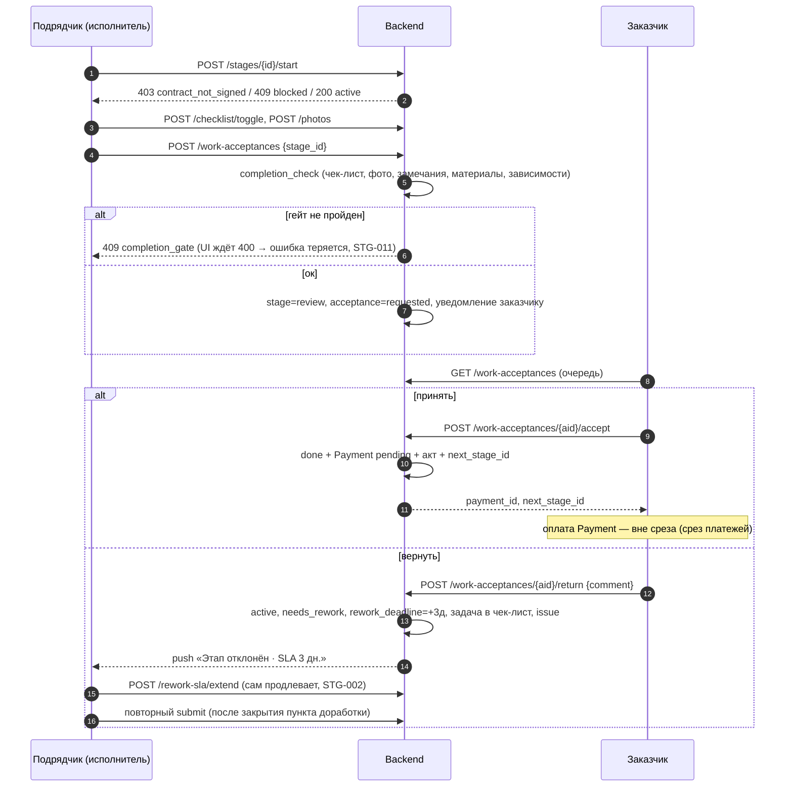
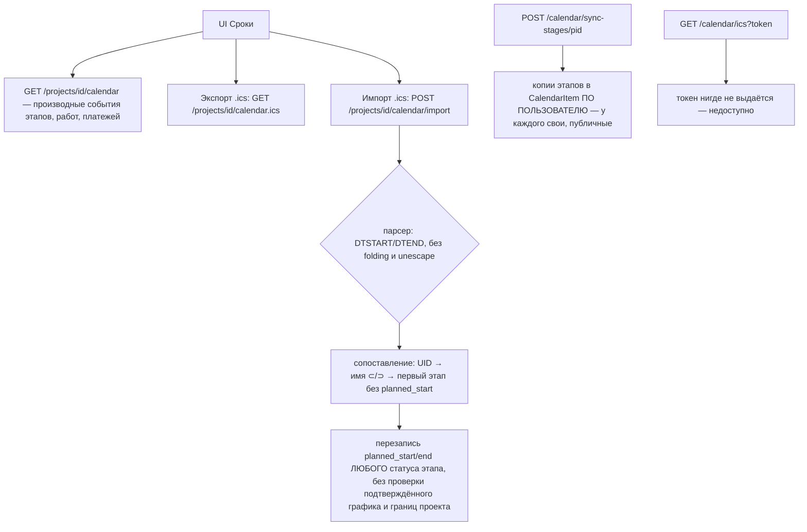

# Срез 02 — Этапы, график работ, календарь, приёмка

Дата аудита: 2026-09-30. Продуктовый код не менялся. Источники: чтение кода (backend `backend/app`, мобильный `apps/mobile`), существующие тесты среза (70 passed: `test_stage_mutation_integrity`, `test_stage_review_atomicity`, `test_work_acceptance_decision_integrity`, `test_work_schedule_acl_and_replay`, `test_schedule_item_transitions`, `test_calendar_import_issue422`, `test_calendar_integrity`, `test_portal_accept`, `test_acceptance_canon`, `test_technical_supervision_actions`) и временные in-process пробы (ASGI-клиент, sqlite :memory:, скрипт вне репозитория). Живой backend не трогался.

Обозначения: `S:` = `backend/app/services/`, `A:` = `backend/app/api/v1/`, `M:` = `apps/mobile/`.

---

## 1. Инвентарь среза

### 1.1 Backend: эндпоинты

Порядок монтирования и «замещённые» маршруты: `backend/app/api/v1/router.py:40-144` (`_remove_replaced_routes` вырезает старые хендлеры, канонические подключаются раньше).

| Группа | Маршрут | Хендлер | Что делает |
|---|---|---|---|
| Этапы (канон) | `POST /projects/{id}/stages` | A:stage_mutations.py:78 → S:stage_mutation_service.py:227 | создать этап (идемпотентно по `client_request_id`) |
| | `POST …/stages/{sid}/start` | stage_mutations.py:103 → S:…:359 | planned→active |
| | `POST …/stages/{sid}/ready` | stage_mutations.py:133 → S:stage_review_service.py:182 | active→review (старый алиас submit) |
| | `PATCH …/stages/{sid}/dates` | stage_mutations.py:261 → S:…:450 | даты этапа |
| | `PATCH …/rooms`, `…/work-type`, `…/depends` | stage_mutations.py:286/310/334 | комнаты, тип работ, предшественник (только в `planned`) |
| | `POST …/dependencies/sync` | stage_mutations.py:358 → S:…:689 | создать WorkDependency по шаблонам workflow |
| | `GET/PATCH …/stages/payment-plan` | stage_mutations.py:180/219 | суммы оплаты по этапам |
| Чтение | `GET …/stages/{sid}` (+`capabilities`) | A:stages_ext.py:138 | деталь этапа |
| | `GET …/plan` | stages_ext.py:282 | список этапов + `can_schedule` |
| | `GET …/stages/{sid}/blocked`, `GET …/dependencies` | stages_ext.py:370/401 | блокировки |
| | `GET …/stages/{sid}/snapshot`, `…/completion-check`, `…/workflow` | A:os.py:431/442/69 | снимок работы, гейт готовности, чек-лист |
| Наполнение | `POST …/comments`, `…/photos`, `GET …/photos/{pid}` | stages_ext.py:159/191/219 | комментарии, фото |
| | `POST …/checklist/toggle` | os.py:79 | отметка пункта чек-листа |
| | реакции `POST/GET …/comments/{cid}/react`, `…/reaction-counts` | A:stage_reactions.py:40/53/59 | эмодзи |
| Сдача/возврат | `POST …/stages/{sid}/submit` | A:stage_review_transitions.py:44 | active→review + приёмка |
| | `POST …/stages/{sid}/reject` | stage_review_transitions.py:74 | review→active (заказчик или технадзор) |
| Приёмка | `GET …/work-acceptances`, `…/pending-count` | A:work_acceptances.py:134/122 | список, счётчик |
| | `POST …/work-acceptances` | work_acceptances.py:153 | «запросить приёмку» = тот же submit |
| | `POST …/work-acceptances/{aid}/accept` / `/return` | work_acceptances.py:180/216 | решение заказчика |
| | `GET/POST …/acceptances…` | os.py:270-307 | алиасы на канон |
| | `POST /portal/projects/{id}/work-acceptances/{aid}/accept|return` | A:portal_acceptance_decisions.py:48/90 | решение по magic-link (scope `accept_stage`) |
| SLA доработки | `POST …/rework-sla/check` | A:rework_sla.py:25 | напоминание «SLA завтра» |
| | `POST …/rework-sla/extend?stage_id&days` | rework_sla.py:64 | продлить срок доработки на 1–7 дн. |
| График работ | `GET/POST /projects/{id}/work-schedules`, `/active`, `/{sid}` | A:project_work_schedule.py:39-88 | чтение, создание |
| | `PUT /{sid}` | project_work_schedule.py:90 | правка draft/rejected (полная замена пунктов) |
| | `POST /{sid}/submit` / `/confirm` / `/reject` | project_work_schedule.py:105/120/134 (reject замещён A:technical_supervision_schedule.py) | draft/rejected→submitted→confirmed/rejected |
| | `POST /{sid}/items/{iid}/status` | project_work_schedule.py:149 | смена статуса пункта |
| Календарь (производный) | `GET /projects/{id}/calendar`, `/calendar.ics` | A:calendar.py:23/51 | события этапов/работ/платежей |
| | `PATCH /projects/{id}/calendar/stages` | calendar.py:32 | legacy: даты этапа |
| | `POST /projects/{id}/calendar/import` | calendar.py:76 | импорт .ics в даты этапов |
| Календарь (CalendarItem) | `GET /calendar`, `/upcoming`, `/ics?token=` | A:calendar_integrity.py:57/93/146 | личные/проектные события |
| | `POST /calendar/sync-stages/{pid}` | calendar_integrity.py:168 | проекции этапов в CalendarItem |
| | `POST/PATCH/PUT/DELETE /calendar[/{id}]` | A:calendar_mutations.py:62-118 | CRUD событий |
| | `GET /calendar/{id}` | A:calendar_detail.py:16 | **роутер не подключён нигде** (STG-022) |

### 1.2 Backend: сервисы и модели

- Состояние этапа: `StageStatus = planned|active|review|done` (`backend/app/models/entities.py:20-24`); `needs_rework`, `rework_deadline`, `contractor_ready`, `customer_accepted_at`, `assignee_id`, `depends_on_stage_id`, `ical_uid`. Статуса `cancelled/paused` нет.
- Приёмка: `AcceptanceStatus` (`entities.py:963`) — `requested|in_review|accepted|accepted_with_remarks|returned|rejected|not_requested`; `WorkAcceptance` (`entities.py:973`). Фактически используются `requested`, `accepted`, `accepted_with_remarks`, `returned`; `in_review`/`rejected`/`not_requested` — нет писателей в каноне.
- График: `ProjectWorkSchedule` (`backend/app/models/work_schedule.py:27`), статусы `draft|submitted|confirmed|rejected|archived`; `ProjectWorkScheduleItem` (`:56`), статусы `planned|ready|in_progress|submitted|accepted|delayed|blocked|cancelled`.
- Сервисы: `S:stage_mutation_service` (ACL, start, даты), `S:stage_review_service` (submit/reject), `S:work_acceptance_decision_service` (accept/return), `S:accept_orchestrator` (каскад приёмки), `S:acceptance_policy` (quick/full), `S:dependency_service` (гейты старта), `S:work_snapshot_service` (гейт готовности), `S:project_work_schedule_service`, `S:schedule_item_transitions`, `S:calendar_import_service`, `S:calendar_integrity_service`, `S:calendar_mutation_service`, `S:automation_engine.scan_project_reminders` (просрочка), `S:project_document_service.project_contract_gate` (гейт договора).

### 1.3 Мобильный клиент

| Экран/компонент | Файл | Роль |
|---|---|---|
| Хаб «Ремонт» (вкладки Этапы · Приёмка · Материалы · Подбор) | `M:components/screens/OsRepairHubScreen.tsx` | обе роли |
| «Этапы» (OsWorksScreen) | `M:components/screens/OsWorksScreen.tsx` | список, фильтры, «+ Этап», «На приёмку (N)» |
| Деталь этапа | `M:app/stage/[id].tsx` → `components/screens/StageDetailScreen.tsx`, `stage/StageDetailHero.tsx`, `stage/StageDetailAcceptanceFold.tsx`, `stage/StageDetailPaymentBlock.tsx` | старт/сдача/приёмка |
| «Приёмка» | `OsControlScreen.tsx` → `control/CustomerControlView.tsx`, `ContractorControlView.tsx`, `TechnicalSupervisionControlView.tsx`; список `components/renova/UnifiedAcceptanceList.tsx` | очередь решений |
| «Сроки» (календарь + план-график) | `OsCalendarScreen.tsx` → `schedule/UnifiedScheduleView.tsx`, `components/renova/schedule/SchedulePlanItems.tsx`, `ScheduleIconToolbar.tsx`, `TechnicalSupervisionScheduleReview.tsx` | сроки |
| SLA доработки | `components/renova/ReworkSlaWidget.tsx` | подрядчик |
| Deep link | `M:app/work-acceptance.tsx` | редирект в Ремонт→Приёмка |
| API-слой | `M:lib/api/stages.ts`, `lib/api/calendar.ts`, `lib/api/workSchedule.ts`, `lib/domain/schedulePlanState.ts`, `lib/domain/scheduleItemNextActions.ts` | |

---

## 2. Матрица «кто что может»

Определения ролей (`S:team_service.py:472-506`): владелец=`project.customer_id`; подрядчик-владелец=`project.contractor_id`; член бригады (`owner|foreman|member|viewer`, только у пользователей с `UserRole.contractor`); гость (`ProjectViewer`, read-only); технадзор (`is_active_supervisor`, читает через fallback в `require_project`, `A:deps.py:112-135`); «самостоятельный» заказчик — проект без `contractor_id`.

«Исполнитель этапа» = `stage.assignee_id`, а если он пуст — `contractor_id` (или заказчик в проекте без подрядчика) (`S:stage_mutation_service.py:82-94`). Эндпоинта, который выставляет `assignee_id`, нет (STG-005).

| Действие | Заказчик | Подрядчик-владелец | Прораб (foreman) | Член / viewer бригады | Гость | Технадзор | Где проверяется |
|---|---|---|---|---|---|---|---|
| Создать этап / даты / комнаты / тип / зависимость / sync | только если проекта без подрядчика | да | да | нет | нет | нет | `S:stage_mutation_service.py:65-79` (`_require_schedule_actor`) |
| Старт этапа | сам-себе-исполнитель только | да | **нет** (не исполнитель) | нет | нет | нет | `:90-94`, гейты `:397-415` |
| Сдать этап (submit / `/ready` / `work-acceptances` POST) | сам-себе только | да | **нет** | нет | нет | нет | `S:stage_review_service.py:103-107` |
| Принять / вернуть по приёмке | да | нет | нет | нет | нет | нет | `S:work_acceptance_decision_service.py:41-43` |
| Вернуть на доработку (`/stages/{sid}/reject`) | да | нет | нет | нет | нет | да (`quality_review`, создаёт замечание) | `A:stage_review_transitions.py:74-88`, `S:technical_supervision_service.py:417-447` |
| Портальная приёмка/возврат | по токену со scope `accept_stage`, только `customer_id` | — | — | — | — | — | `A:portal_acceptance_decisions.py:24-45` |
| Чек-лист toggle, комментарии, фото | да | да | да | member да, viewer нет | нет | нет | `A:os.py:79-90`, `stages_ext.py:159/191` — **только `write=True`, роль не проверяется** (STG-018) |
| Реакции на комментарий | да | да | да | да | **да** | да | `stage_reactions.py:40` (`require_project_dep()` = read) |
| Платёжный план (`PATCH payment-plan`) | да | да | **да** | **да** | нет | нет | `stage_mutations.py:219-258` — только `write=True` (STG-001) |
| Продлить SLA доработки | да | да | да | да | нет | нет | `A:rework_sla.py:64-75` — только `write=True` (STG-002) |
| График: создать / править / отправить | сам-себе (нет подрядчика) | да | да | нет | нет | нет | `S:project_work_schedule_service.py:31-40` (`can_manage_schedule`) |
| График: согласовать / отклонить | да (только `customer_id`) | нет | нет | нет | нет | отклонить (с обязательной причиной) | `:635`, `:678`, `S:technical_supervision_action_service.py:141-170` |
| Статус пункта графика (кроме `accepted`/`blocked` из `submitted`) | нет | да | да | нет | нет | нет | `S:schedule_item_transitions.py:33-49` (`manage`) |
| Статус пункта `submitted→accepted/blocked` | да | нет | нет | нет | нет | нет | там же (`customer`) |
| Импорт .ics | **любой `write`** | да | да | member да | нет | нет | `A:calendar.py:76-92` (STG-009); в UI кнопка только исполнителю |
| PATCH `/calendar/stages` | нет (`role!=contractor`) | да | да | member да | нет | нет | `calendar.py:32-38` (STG-008) |
| CalendarItem CRUD | только автор (`user_id`) | автор | автор | автор | нет | нет | `S:calendar_mutation_service.py:180-182,286-288` |
| Видимость календаря CalendarItem | свои + публичные проектные | то же | то же | то же | то же | не входит в `accessible_project_ids` | `S:calendar_integrity_service.py:29-58` |

Видимость этапов в списках: `_filter_stages_for_user` (`A:projects.py:22-31`) — пользователь с `UserRole.contractor` видит только этапы со своим `assignee_id` или без `assignee_id`, но **только если он `contractor_id`**. Прораб/член бригады видит 0 этапов (STG-005).

---

## 3. Последовательности и состояния

### 3.1 Машина состояний этапа

```mermaid
stateDiagram-v2
    [*] --> planned: create_stage (владелец подрядчик/прораб; заказчик только без подрядчика)
    planned --> active: POST /start (исполнитель) [гейт: договор подписан ИЛИ самостоятельный заказчик; нет незакрытых зависимостей; ACL исполнителя]
    planned --> active: обходной путь — пункт графика planned/ready→in_progress (любой manage, БЕЗ гейтов) STG-003
    active --> review: POST /work-acceptances | /submit | /ready (исполнитель) [гейт completion_check: исполнитель, чек-лист 100%, фото, нет critical/high замечаний, материалы доставлены, зависимости]
    active --> review: обходной путь — пункт графика in_progress→submitted (БЕЗ acceptance-записи) STG-004
    review --> done: POST /work-acceptances/{id}/accept (только заказчик) [фото есть; чек-лист done ИЛИ передан]
    review --> active: /work-acceptances/{id}/return или /stages/{id}/reject (needs_rework=true, rework_deadline=+3 дн, пункт «Устранить замечание» в чек-лист)
    active --> active: доработка: исполнитель отмечает пункты, снова submit
    done --> [*]: терминально (нет reopen, нет cancel, нет delete)
    note right of active
      needs_rework=true, SLA 3 дня.
      Просрочка SLA НИЧЕГО не делает (STG-014):
      ни статуса, ни уведомления, ни эскалации.
    end note
```

Что блокирует следующий шаг и кто ждёт:

| Шаг | Инициатор | Ждёт | Блокеры | При отказе/таймауте |
|---|---|---|---|---|
| Старт | исполнитель | — | договор `contract_not_signed` (403), `blocked` (409), `stage_start_invalid_status` (409), `stage_execution_actor_forbidden` (403) | сообщение в UI; **если договора нет вообще — тупик** (STG-006) |
| Сдача | исполнитель | заказчик | `completion_gate` (409 на `/submit`,`/work-acceptances`; 422 на `/ready`) | этап остаётся `active` |
| Приёмка | заказчик | — | `acceptance_not_current` (409), `checklist_required` (409), `photos_required` (409), не `review` | при возврате: пункт «Устранить замечание: …», SLA 3 дня, опционально `ProjectIssue` |
| Таймаут приёмки | — | — | **нет** ни напоминания заказчику, ни автоприёмки (STG-015) | этап висит в `review`; исполнителю ежедневно приходит «Просрочка работы» (`S:automation_engine.py:279-303`) |

Каскад приёмки (`S:accept_orchestrator.py:153-197`): `stage.done`, `customer_accepted_at`, `percent=100`, `Payment(type=stage, pending)` если сумма этапа > 0 и есть подрядчик (`:55-84`), акт-документ, метка на плане, пункты графика этапа → `accepted`, уведомления «оплатите этап»/«акт готов»/«следующий этап готов к запуску» (следующий остаётся `planned`, старт вручную).

### 3.2 Последовательность: сдача → приёмка → возврат



### 3.3 Машина состояний плана-графика

```mermaid
stateDiagram-v2
    [*] --> draft: POST /work-schedules (owner/foreman; заказчик без подрядчика); пункты = этапы проекта
    draft --> draft: PUT (полная замена пунктов)
    draft --> submitted: submit (нужен ≥1 пункт)
    submitted --> confirmed: confirm (только заказчик) — даты пунктов ПЕРЕЗАПИСЫВАЮТ planned_start/end этапов
    submitted --> rejected: reject (заказчик, причина необязательна; технадзор — обязательна)
    rejected --> draft: PUT
    rejected --> submitted: submit (без правок допустимо; version+1)
    confirmed --> [*]: ТЕРМИНАЛ. Нет ни правки, ни отзыва, ни архива (STG-007)
    note right of confirmed
      archived в enum есть, писателей нет.
      Второй график можно создать через API,
      он перекроет confirmed в /active.
    end note
```



Состояния пункта (`S:schedule_item_transitions.py:14-30`): `planned→ready|in_progress|cancelled`, `ready→in_progress|submitted|cancelled`, `in_progress→submitted|blocked|cancelled`, `blocked→in_progress|cancelled` (manage); `submitted→accepted|blocked` (customer); `delayed→in_progress|blocked` — **в `delayed` нельзя попасть** (нет входящего перехода); `accepted`, `cancelled` терминальны. Проверка статуса самого графика (draft/confirmed/…) при смене пункта **не выполняется**.

### 3.4 Календарь и .ics



---

## 4. Кнопки, функции и опции по экранам

Формат: подпись → обработчик → API → серверная проверка → результат/ошибки.

### 4.1 «Этапы» (OsWorksScreen, M:components/screens/OsWorksScreen.tsx)

| Элемент | Обработчик | API | Серверная проверка | Результат |
|---|---|---|---|---|
| «+ Этап» (только при `plan.capabilities.can_schedule`) | `CreateStageSheet.onCreate` (стр. ~375) | `POST /stages` | `_require_schedule_actor`, даты в границах проекта, комнаты проекта | 403/422 → алерт; offline → очередь |
| «+ Работа» (подрядчик) | `CreateWorkSheet` | work-orders (вне среза) | | |
| «На приёмку (N)» (долгое нажатие выбирает этапы, подрядчик) | `bulkReady` (стр. ~170) | цикл `POST /work-acceptances` | `completion_gate` 409 | **нет try/catch**: первая ошибка обрывает цикл, остальные этапы не отправлены, выбор не сбрасывается (STG-023) |
| Карточка этапа / «Проверить» | `nav.stage(id)` | — | — | открывает деталь |
| Фильтры (заказчик: «Сейчас»…; подрядчик: Все/Сегодня/Просрочено/На приёмке/…) | локальные | — | — | `all` скрывает `done` |
| Виджет «Доработка (N)» + «+1 д» | `ReworkSlaWidget` | `POST /rework-sla/extend` | только `write=True` | подрядчик сам продлевает свой SLA (STG-002); нет обработки ошибок в `onPress` |
| Фоновые вызовы при каждом фокусе/перезагрузке | `refreshWorks` | `GET /projects/{id}`, N×`GET /stages/{sid}/blocked`, `GET /plan`, `POST /rework-sla/check` (подрядчик) | rate-limit 120/мин на ключ (`core/config.py:81`) | N+1 (STG-024) |
| Скрытый `RejectStageModal` | `rejectId` никогда не устанавливается | — | — | мёртвый код |

### 4.2 Деталь этапа (StageDetailScreen / Hero / AcceptanceFold)

| Кнопка | Условие показа | Обработчик → API | Серверные ошибки и реакция UI |
|---|---|---|---|
| «Начать этап» (или `next_action.button`) | `capabilities.can_start` (`A:stages_ext.py:87`) и не `blocked` | `api.startStage` → `POST /stages/{id}/start` | 403 `contract_not_signed` → алерт «Нужен договор» → «К документам»; 409 (и `blocked`, и `stage_start_invalid_status`) → «Сначала завершите зависимый этап»; 422 → не обработано (`throw`) |
| «Готово — на приёмку» | `can_submit_for_review`, кнопка disabled, пока `completion.ok=false` | `submitStage` → `POST /work-acceptances` | сервер даёт **409** `completion_gate`, Hero ждёт **400** → попадает в `else throw` (STG-011) |
| «Принять этап» | `role==='customer' && status==='review'` (не использует `capabilities.can_review`); disabled без фото/чек-листа | `acceptStage`: `GET /work-acceptances?stage_id` → `POST /{aid}/accept {mode:'full', checklist}` | нет активной приёмки → `ApiError 409 acceptance_not_requested` (сироты STG-004); 409 checklist/photos |
| «Вернуть на доработку» | заказчик, review | `RejectStageModal` (причина, пусто → «Требуется доработка») → `rejectStage` → `POST /{aid}/return {create_issue:true}` | 403/409/422 |
| Чек-лист (☐/☑) | `canWrite` | `POST /checklist/toggle` | нет проверки роли/статуса (STG-018) |
| «Добавить пункт» | `canWrite` | `addCustomCheck` — **только AsyncStorage** | пункт не уходит на сервер и скрыт, если есть серверный чек-лист (STG-020) |
| «До работ» / «После работ» | `canWrite` | загрузка в хранилище + `POST /photos` | любой writer, включая заказчика |
| «Отправить» комментарий, шаблоны, реакции 👍 ❓ | `canWrite` | `POST /comments`, `POST …/react` | гость может ставить реакции через API (STG-026) |
| «Акт приёмки (PDF)» | заказчик | `GET /stages/{id}/acceptance.pdf` (A:export.py:63) | вне среза |
| Блок оплаты этапа | заказчик, review/pending | подсказка «После приёмки: оплатить X» либо «Оплатить» | вне среза (платежи) |

### 4.3 «Приёмка» (Customer/Contractor/TechnicalSupervision ControlView + UnifiedAcceptanceList)

| Элемент | Обработчик → API | Замечания |
|---|---|---|
| «Принять» (заказчик, строка `kind=acceptance`) | `api.acceptWork` `mode:'inline'` → `POST /work-acceptances/{aid}/accept` | при непустых незакрытых пунктах чек-листа → `checklist_required` → диалог «К этапу». **Не учитывает `readOnly`** (STG-019) |
| «Вернуть» | `api.returnWork` с зашитым комментарием «Нужна доработка» и `create_issue:true` | причину не спрашивает (STG-017) |
| «Открыть этап» (подрядчик) | навигация | подрядчик не принимает решения |
| строка `kind=stage` (этап в `review` без записи приёмки) | «Принять/Вернуть» → открывают этап | ведёт в тупик: на этапе `acceptStage` падает без приёмки (STG-004) |
| Замечания («Закрыть» / «Исправлено») | `closeIssue` | срез замечаний — вне |
| Технадзор | `returnStageForTechnicalRework` → `POST /stages/{id}/reject`; `createTechnicalQualityIssue` | технадзор **принять** этап не может (только вернуть/замечания) |

### 4.4 «Сроки» (UnifiedScheduleView и вложенные)

| Кнопка | Показ (`schedulePlanActions`, M:lib/domain/schedulePlanState.ts:139-171) | API | Серверная проверка |
|---|---|---|---|
| «Создать план-график из этапов» | подрядчик (owner/foreman) и `not_created` | `POST /work-schedules {title}` без пунктов → пункты из этапов (`sync_items_from_stages`, S:…:195) | `can_manage_schedule` |
| «Отправить заказчику на согласование» | draft/rejected | `POST /{id}/submit` | ≥1 пункт |
| «Согласовать график» | заказчик, submitted | `POST /{id}/confirm` | `is_project_customer`; перезапись дат этапов |
| «Отклонить» | заказчик, submitted | `POST /{id}/reject` с **зашитой** причиной «Нужна правка сроков» | причина необязательна (STG-016) |
| Кнопка пункта: «К готовности / Старт / На приёмку / Принять этап / Заблокировать» | `primaryScheduleItemAction` | `POST /{id}/items/{iid}/status` | матрица переходов; **синхронизирует статус этапа** (STG-003/004) |
| Иконка «Импорт .ics» | только подрядчик, не readOnly | `POST /calendar/import` | см. STG-009 |
| Иконка «Экспорт .ics» | все | `GET /calendar.ics` | |
| «Назначить работу / Добавить задачу» | | work-orders | вне среза |
| Технадзор: причина + «Отклонить график» | `TechnicalSupervisionScheduleReview` | `POST /reject` (маршрут технадзора) | причина обязательна |

Нет в UI вообще: правка дат этапа, типа работ, предшественника, исполнителя этапа, удаление/отмена этапа, правка пунктов графика (`PUT`), создание CalendarItem (`/calendar/*`), выдача токена `.ics`.

---

## 5. РЕЕСТР ДЕФЕКТОВ

Серьёзность: P0 деньги/данные/безопасность; P1 не работает/тупик; P2 неудобство/рассинхрон; P3 косметика. «Проверено» — да = воспроизведено пробой/тестом или однозначно следует из кода (указано).

| ID | Сер. | Тип | Доказательство | Кого затрагивает | Предложение | Проверено |
|---|---|---|---|---|---|---|
| STG-001 | P0 | нет ACL | `A:stage_mutations.py:219-258`: `PATCH /stages/payment-plan` требует лишь `write=True`. Проба: подрядчик и прораб получают 200 и выставляют `{"s1":90000,"s2":90000}` при бюджете 100000 (`distributed=180000`, `total=100000`), сумма не сверяется с `budget_planned`, статус этапа не проверяется. Эти суммы становятся `Payment` заказчику при приёмке (`S:accept_orchestrator.py:71-82`) | заказчик (деньги), подрядчик (вектор злоупотребления) | доступ только заказчику (или согласование), запрет на изменение этапов `review/done`, валидация суммы ≤ бюджета | да (проба) |
| STG-002 | P1 | нет ACL | `A:rework_sla.py:64-75`: `extend` — `write=True`, без проверки роли и без требования `needs_rework`; `+1…+7` дней за вызов, число вызовов не ограничено; UI даёт кнопку подрядчику (`M:ReworkSlaWidget.tsx:33-47`). Проба: подрядчик поставил дедлайн на этап без доработки (200). Заказчик не уведомляется | заказчик | продление — только по согласию заказчика/заказчиком; лимит и аудит; только для `needs_rework` | да (проба) |
| STG-003 | P1 | рассинхрон UI↔backend / обход гейтов | `S:project_work_schedule_service.py:747-776`+`:779-846`: смена статуса пункта на `in_progress`/`ready` пишет `stage.status=active` без договора, зависимостей, `_require_execution_actor`; проверка статуса самого графика отсутствует. Проба: прораб (которому `/start` даёт 403 `stage_execution_actor_forbidden`) через пункт черновика графика при отсутствии договора получил `Stage.status=active` | заказчик (обход договора/зависимостей), команда | вызывать канонический `start_stage`/`submit_for_review` из синхронизации, либо запретить пункту менять этап | да (проба) |
| STG-004 | P1 | тупик | тот же код: `in_progress→submitted` ставит `stage.review`, но не создаёт `WorkAcceptance` и `contractor_ready`. Проба: `GET /work-acceptances`=`[]`, `pending-count`=1; подрядчик `POST /submit` → 409 `stage_submit_invalid_status:review`, `POST /work-acceptances` → 409; мобильный `acceptStage/rejectStage` бросает `acceptance_not_requested` (M:lib/api/stages.ts:104-140). Выход только прямым API `POST /stages/{id}/reject` (сработал) — в UI его нет. Основная CTA «На приёмку» в плане ведёт именно сюда | заказчик, подрядчик | синхронизация через канон; либо создавать acceptance при переходе в `review`; либо разрешить повторную сдачу из «осиротевшего» `review` | да (проба) |
| STG-005 | P1 | тупик / неверный статус | `A:projects.py:22-31` (`_filter_stages_for_user`): пользователь роли contractor видит этап, если `assignee_id==user.id` либо `assignee_id is None and contractor_id==user.id`. Проба: прораб получил `stages=0` в `/plan` и `/projects/{id}` при `capabilities.can_schedule=true`; созданный им же этап ему не виден; `capabilities.can_start/can_submit=false` для прораба. `assignee_id` не выставляется ни одним эндпоинтом (grep по `app/`; только тесты пишут напрямую) | прораб, член бригады | эндпоинт назначения исполнителя; видимость этапов для членов бригады; разрешить прорабу старт/сдачу | да (проба) |
| STG-006 | P1 | тупик / рассинхрон | `S:stage_mutation_service.py:397-404`: для проекта с подрядчиком старт запрещён, если договор **не найден** (`reason=no_contract_required` трактуется как отказ) — код `contract_not_signed`. Проба: `GET /contract-gate` → `{ok:true, reason:"no_contract_required"}` (баннер в `StageDetailHero` не показывается, кнопка активна), `POST /start` → 403 «Подпишите договор» с пустым `pending_titles`. Договор-черновик создаётся лишь при фиксации сметы (`S:estimate_service.py:302`) → проект без зафиксированной сметы не стартует | подрядчик, заказчик | единый ответ gate (`ok:false` для «нет договора») + путь создания/загрузки договора из экрана этапа | да (проба) + grep |
| STG-007 | P1 | тупик | `S:project_work_schedule_service.py:422-431,629-668`: `confirmed` нельзя ни править (409), ни повторно отправить, ни отклонить (проба: 409/409/409); `archived` не пишется; `_confirmed_schedule_exists` блокирует даты этапов навсегда (`S:stage_mutation_service.py:143-153,470`). UI обещает «Изменения — через новый график» (`UnifiedScheduleView.tsx` диалог), но `canCreate` только при `not_created`. Через API второй график создаётся и **перекрывает** confirmed в `/active` (проба: `План 2 draft`), подтверждённый остаётся и продолжает блокировать даты | заказчик, подрядчик | процедура пересогласования (revision → submitted → confirmed, старый → archived), `active` = последний confirmed/рабочий | да (проба) |
| STG-008 | P1 | нет ACL / обход | `A:calendar.py:32-49` + `S:stage_service.py:231-256`: `PATCH /calendar/stages` меняет даты без `_require_schedule_actor`, без блока подтверждённого графика, без границ проекта, для этапа любого статуса. Проба: после `confirm` этап `s1` перенесён на 2026-09-01 (200), тогда как канонический `/dates` даёт 409 `confirmed_schedule_controls_dates`. Доступно члену бригады/прорабу | заказчик (сроки), график | удалить/перевести на канонический сервис | да (проба) |
| STG-009 | P1 | нет ACL / нечестные данные | `A:calendar.py:76-92`, `S:calendar_import_service.py:128-151,196-217`: доступ только `write=True` (заказчик тоже); нет проверки роли, подтверждённого графика, статуса этапа, границ проекта; нечёткое сопоставление (подстрока имени в любую сторону), затем «первый этап без planned_start» для любого чужого события. Проба: заказчик импортом перезаписал даты **завершённого** этапа «Электрика» на 2027-01-01…04 событием «Электрика и слаботочка» (200) | заказчик, подрядчик, график | роль как у `_require_schedule_actor`, блок при confirmed, предпросмотр сопоставления, не трогать `done`, точное сопоставление по UID | да (проба) |
| STG-010 | P1 | тупик | `S:dependency_service.py:51-95,150-227`: зависимости из `sync` хранятся в `WorkDependency`; эндпоинтов удаления нет (grep по `app/api`, `app/services`); `PATCH …/depends {null}` чистит только `stage.depends_on_stage_id`. Проба: после очистки `POST /start` этапа «Электрика» → 409 `blocked: Завершите: Демонтаж`. Этап удалить/отменить нельзя (`StageStatus` без `cancelled`, DELETE нет) → предшественник, который не будет сделан, блокирует навсегда; обход — только STG-003 | подрядчик, заказчик | эндпоинт снятия зависимости/пропуска этапа, статус `cancelled`/`skipped`, удаление пустого этапа | да (проба) |
| STG-011 | P2 | рассинхрон UI↔backend | `M:components/screens/stage/StageDetailHero.tsx:164` ждёт `status===400` с `completion.failed`, сервер отдаёт 409 на `/work-acceptances` и `/submit` (`A:work_acceptances.py:168-169`) и 422 на `/ready` (`stage_mutations.py:152`). Проба: повторная сдача без закрытия пункта доработки → 409 `completion_gate`. Кнопка обычно disabled по `workSnap`, но при устаревшем снапшоте ошибка уходит в `throw` без сообщения. Там же 409 при старте трактуется как «зависимый этап», хотя может быть `stage_start_invalid_status`; 422 не обработан | подрядчик | единый контракт кодов (409 + `code`), маппинг по `detail.code` | да (код+проба) |
| STG-012 | P2 | рассинхрон | Пункты графика не следуют за этапом: проба (с подписанным договором) — после настоящего `start`, `submit`, `return` пункт остаётся `planned` на всём пути; из «submitted» у подрядчика нет переходов, поэтому после возврата пункт «застрявший» до приёмки (`mark_schedule_items_accepted_for_stage`, S:…:714, лечит только финал). Календарь/план показывают неверный статус | все | обратная синхронизация состояния этапа → пункт в канонических сервисах | да (проба) |
| STG-013 | P2 | нечестные данные | `S:project_work_schedule_service.py:195-241`: при создании из этапов дата пункта = `stage.planned_start or schedule.planned_start or today`, окончание = начало. В мобильном UI нет правки дат этапа/пунктов (grep `updateStageDates`, `updateWorkSchedule` вне `lib/api` — нет вызовов; `CreateStageSheet` — свободный текст дат). `confirm` записывает эти заглушки обратно в этапы (`:471-488`) и замораживает (STG-007) | заказчик, подрядчик | UI правки дат до отправки; запрет отправки графика с пунктами-заглушками | да (код) |
| STG-014 | P2 | тупик / нет реакции на просрочку | `rework_deadline` читают только `A:rework_sla.py:35` (окно «в ближайшие 24 ч», `deadline > now`) и виджет; просроченный SLA не даёт ни статуса, ни уведомления, ни эскалации заказчику. `check` вызывается подрядчиком при каждом обновлении экрана. Просроченные (< now) исключены условием запроса | заказчик | воркер: «SLA просрочен» заказчику, эскалация/право отозвать доработку | да (код+grep) |
| STG-015 | P2 | тупик | Нет таймаута/напоминания по приёмке: `automation_engine.scan_project_reminders` (`S:automation_engine.py:279-303`) шлёт только подрядчику «Просрочка работы» по `planned_end`, включая этапы в `review`, которые ждёт заказчик; заказчику напоминаний об ожидающей приёмке нет; автоприёмки нет | подрядчик, заказчик | напоминание заказчику; исключить `review` из просрочки исполнителя; политика авто-приёмки/эскалации | да (код) |
| STG-016 | P2 | затык UX | `M:UnifiedScheduleView.tsx` (обработчик «Отклонить»): причина зашита `'Нужна правка сроков'`; серверная ветка заказчика допускает пустую (`S:…:678-687`), ветка технадзора требует причину и в UI есть поле. Подрядчик не узнаёт, что править | подрядчик | поле причины обязательно и для заказчика | да (код) |
| STG-017 | P2 | затык UX | `M:UnifiedAcceptanceList.tsx` (`decide`, ветка `return`): комментарий зашит `'Нужна доработка'` + `create_issue:true`; из него строится пункт «Устранить замечание: Нужна доработка» (`S:stage_review_service.py:303-315`) и замечание. Причину можно ввести только на экране этапа | подрядчик | запрашивать причину в списке или отправлять в этап | да (код+проба текста пункта) |
| STG-018 | P2 | нет ACL | `A:os.py:79-90`: `toggle` — `write=True`, роль/статус не проверяются; заказчик может отмечать/снимать пункты исполнителя, править чек-лист этапов `review`/`done`; неизвестный `item_id` даёт 200 и «сохраняет» без изменений; `percent_complete` только растёт (`S:workflow_service.py:52-64`). Проба: заказчик — 200 и на реальный, и на несуществующий пункт | подрядчик, заказчик | только исполнитель и только `active` (заказчик — только приёмка); 404 на неизвестный пункт; пересчёт процента | да (проба) |
| STG-019 | P2 | рассинхрон UI↔backend | `M:UnifiedAcceptanceList.tsx`: нет обращения к `readOnly`/`useWriteAllowed`; кнопки «Принять/Вернуть» активны у гостя; сервер отвечает 403 (`require_project write=True`) → общий `Alert('Ошибка')`. В деталях этапа `readOnly` учитывается | гость | скрыть/заблокировать по `readOnly` и `capabilities.can_review` | да (код) |
| STG-020 | P2 | нечестные данные / мёртвый код | `M:StageDetailScreen.tsx:160` — своим пунктам место только при пустом серверном чек-листе; `addCustomCheck` пишет в AsyncStorage (`lib/customChecklist`); сервер о нём не знает и приёмка их не учитывает; кнопка «Добавить пункт» очищает поле как будто успешно | заказчик | сохранять пункт на сервере или убрать кнопку | да (код) |
| STG-021 | P2 | рассинхрон | Проекции `CalendarItem` — по пользователю (`S:calendar_integrity_service.py:129-181`), публичные. Проба: заказчик и подрядчик каждый вызвали `sync` → заказчик видит 4 записи вместо 2; после смены даты этапа копии остаются старыми (`2026-08-02T09:00`), пока каждый вручную не пересинхронизирует. Мобильный UI `/calendar/*` вообще не вызывает | все | одна проекция на проект, автообновление при смене дат | да (проба) |
| STG-022 | P2 | мёртвый код | (а) `A:calendar_detail.py` не подключён (grep `calendar_detail` — нет include); (б) `GET /calendar/ics?token=` требует `User.ics_token`, ни один код его не выдаёт (grep `ics_token` — только модель/миграция/тесты), токен в query-строке; (в) `CalendarItem.reminder_at`/`reminder_sent` никем не рассылаются (grep) | все | подключить/удалить; выдача и отзыв токена; воркер напоминаний | да (grep) |
| STG-023 | P3 | затык UX / мёртвый код | `M:OsWorksScreen.tsx` `bulkReady` без обработки ошибок (частичная сдача без отчёта, выбор не сбрасывается); `rejectId` не устанавливается (мёртвый `RejectStageModal`); `M:lib/api/stages.ts:56` `markStageReady` без вызовов | подрядчик | обработка и итоговое сообщение по каждому этапу | да (код) |
| STG-024 | P2 | нагрузка/затык | `OsWorksScreen.refreshWorks`: на каждый фокус и `useProjectDataReload` — `GET /blocked` на каждый этап + `GET /plan` + загрузка проекта + `POST /rework-sla/check`; лимит 120 запросов/мин на ключ (`core/config.py:81`) — при 15+ этапах и частых событиях возможны 429 | все | отдавать `blocked`/`can_start` в списке этапов одним запросом | нет (гипотеза, не измерялось) |
| STG-025 | P3 | нечестные данные | `A:calendar.py:51-73` не экранирует `SUMMARY` (запятые/переносы), нет `DTSTAMP`; парсер импорта не поддерживает line folding и экранирование, `content` без ограничения размера (`IcalImportIn`) | все | использовать общий экранировщик из `calendar_integrity._ics_escape`, лимит размера | да (код) |
| STG-026 | P3 | нет ACL | `A:stage_reactions.py:40-51`: запись реакции через `require_project_dep()` (read), значит гость пишет; `reaction: str` без длины | гость | `write=True` и ограничение набора | да (код) |
| STG-027 | P3 | мёртвый код | `A:portal.py:365-540` (устаревшие accept/return, импортируют несуществующие `require_pending_decision`/`require_stage`, вырезаны в `router.py:101-102`); `S:project_service.py:329-374` (`submit_stage_for_review`, `reject_stage`, `accept_stage`-ловушка); `A:projects.py:333-365` (`/submit`, `/reject` вырезаны, `/accept` даёт 410); `S:stage_service.py:136-228` (`set_contractor_ready`, `start_stage` — старая логика без ACL); `S:acceptance_service.py` (`accept`, `return_for_rework`, `mark_in_review`); `AcceptanceStatus.in_review/rejected/not_requested`, `WorkScheduleStatus.archived`, `WorkScheduleItemStatus.delayed`, `ProjectWorkScheduleItem.depends_on_item_id` (создание и замена пунктов с зависимостью запрещены: `S:project_work_schedule_service.py:105-140`) | разработка | удалить после подтверждения отсутствия вызовов (правило «без удаления без уверенности») | да (код) |
| STG-028 | P3 | неверный статус | `S:work_snapshot_service.py:16-21`: гейт `photos_after` проходит при любых ≥2 фото или подписи со словами «после/after/результат»; фото добавляет любой writer (в т.ч. заказчик); UI проверяет «≥1 фото» (`StageDetailScreen.tsx:168`); `_photos_before` считает «до» подстрокой | подрядчик, заказчик | типизированные фото (`kind`), учёт автора | да (код) |
| STG-029 | P3 | нечестные данные | `S:accept_orchestrator.py:187-188`: «замечание после приёмки» создаётся без исполнителя и срока (сравнить с возвратом: `assignee_id`, `due_at`) | подрядчик | назначить и датировать | да (код) |
| STG-030 | P2 | нет ACL | Технадзор не может принять этап, но `capabilities.can_review` возвращает `false` для не-заказчика, а мобильный `showAcceptance` смотрит на `role==='customer'` (роль `UserRole`), а не на capability (`StageDetailScreen.tsx:343`) — при `UserRole.customer` у технадзора кнопки видны и дают 403 `acceptance_decision_customer_only` | технадзор | использовать `capabilities.can_review` | нет (гипотеза: роль пользователя-технадзора не проверялась) |

Итого: 30 записей — P0: 1, P1: 9, P2: 14, P3: 6 (STG-024 и STG-030 — гипотезы, не проверено; остальные проверены пробой, тестом или однозначным чтением кода).

---

## 6. Прочее наблюдаемое (не дефекты)

- Идемпотентность: создание этапа и графика через `client_request_id` (`S:client_write_idempotency`), `start/submit/accept/return` повторяемы (`replayed`).
- Единый путь приёмки: мобильный список, экран этапа, портал и алиасы `/acceptances` сходятся в `work_acceptance_decision_service` (тесты `test_acceptance_canon`).
- Оплата этапа: `Payment` появляется только если `stage.payment_amount > 0` и есть подрядчик; иначе UI честно пишет «оплаты не возникнет» (`StageDetailPaymentBlock.tsx`). Гейта «оплата → старт следующего этапа» нет — предоплата/оплата не блокируют старт.
- Гейт материалов: старт блокируют неодобренные/недоставленные позиции, привязанные к этапу через `WorkDependency` (после `sync`); без нажатия «Синхр.» зависимости этапов/материалов не действуют вообще (по умолчанию все этапы можно стартовать в любом порядке).
- Портал: токен без отзыва и действует 7 суток (`S:portal_token_service.py:17-32`); срез порталов не мой — проверить отдельно.

## 7. Что не проверено

- Живой backend/ UI не запускался (пробы in-process на sqlite; PostgreSQL-блокировки `with_for_update` не воспроизводились).
- Реальные роли «технадзор» в мобильном UI (STG-030), нагрузка на rate-limit (STG-024), поведение офлайн-очереди при повторной отправке `work-acceptances`, платежная часть после приёмки (срез платежей), демо-данные.
- Временные пробы лежат вне репозитория (`scratchpad/test_probe02.py`), в коммит не входят.
