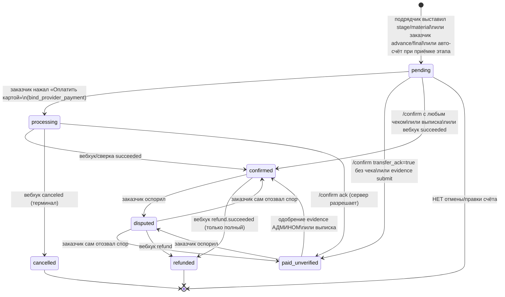
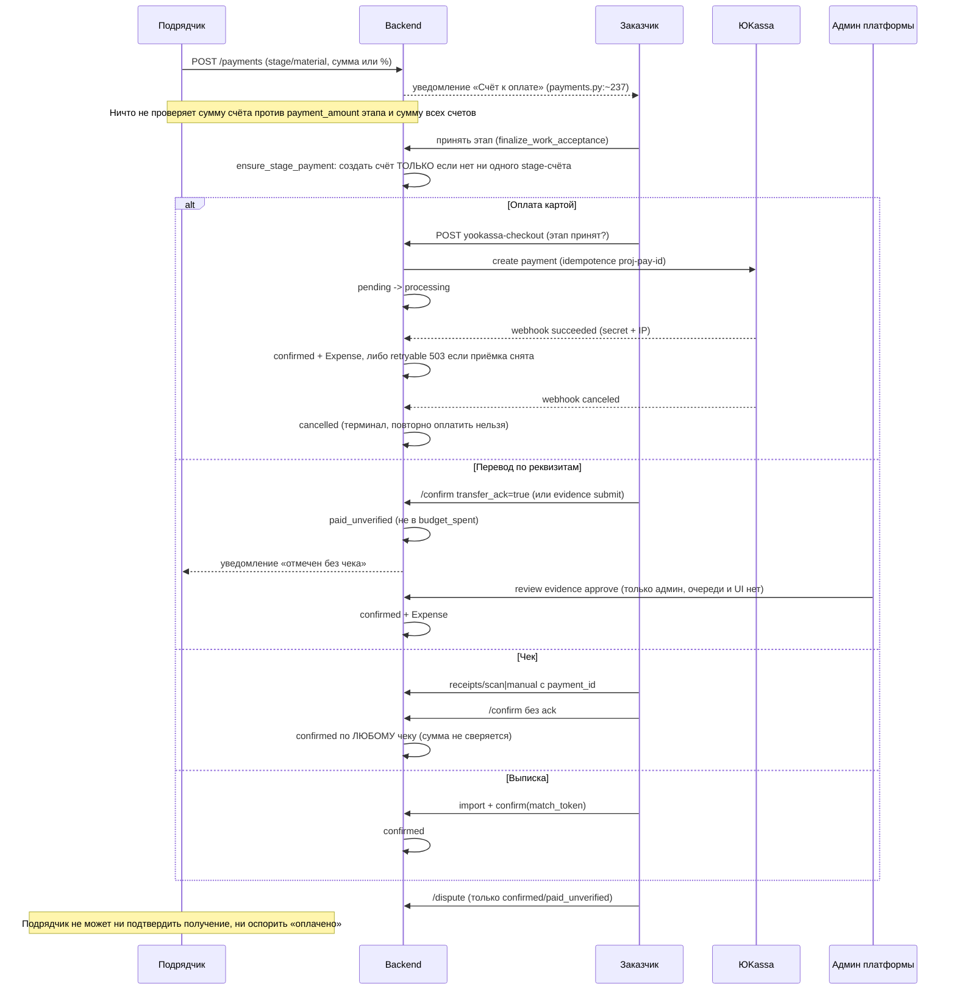
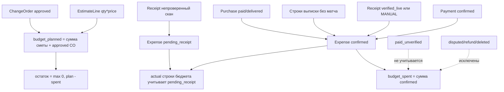

# Срез 03 — Деньги: счета, оплаты, допработы, бюджет

Дата аудита: 2026-09-30. Продуктовый код не менялся. Метод: чтение кода, временные проверки через in-process pytest (ASGI-клиент, отдельная SQLite, скрипт вне репозитория), живой backend не трогался. Статус «ВЕРИФИЦИРОВАНО: да (тест)» означает, что поведение воспроизведено запуском; «да (код)» — доказано чтением конкретных строк; «нет» — гипотеза.

Пути даны относительно `backend/app/` (backend) и `apps/mobile/` (mobile).

---

## 1. Инвентарь среза

### 1.1 Backend — эндпоинты

| Область | Метод и путь | Реализация |
|---|---|---|
| Счета | `GET /projects/{id}/payments` (с историей событий) | `api/v1/payment_history.py:14` (замещает `payments.py`, см. `api/v1/router.py:151-153`) |
| | `POST /projects/{id}/payments` | `api/v1/payments.py:141` |
| | `POST /projects/{id}/payments/{pid}/confirm` | `api/v1/payments.py:277` → `services/payment_service.py:209` |
| | `GET /projects/{id}/payment-requisites` | `api/v1/payments.py:~95` |
| | `GET /projects/{id}/stages/{sid}/payment-progress` | `api/v1/payments.py:63` |
| ЮKassa | `POST .../payments/{pid}/yookassa-checkout` | канон: `api/v1/payment_checkout_integrity.py:113` (старая копия `payments.py` удалена из роутера, `router.py:153`) |
| | `POST /subscription/webhook` (общий для проектных платежей и Pro) | `api/v1/subscription_integrity.py:335` → `services/yookassa_service.py:process_webhook` |
| Подтверждение перевода | `POST .../evidence/upload-intent`, `PUT .../evidence/{eid}/content`, `POST .../evidence/{eid}/submit`, `GET .../evidence`, `GET .../evidence/{eid}/content`, `POST .../evidence/{eid}/review` | `api/v1/payment_evidence.py` |
| Споры | `POST .../payments/{pid}/dispute`, `POST .../dispute/resolve` | `api/v1/payment_disputes.py:70,~100` → `services/payment_dispute_service.py:204,276` |
| Возврат/отмена провайдера | вебхуки `payment.canceled`, `refund.succeeded` | `services/payment_reversal_service.py:106,~160` |
| Сверка | worker `provider_reconciliation_handlers` | `services/provider_reconciliation_handlers.py:46,208` |
| Банковская выписка | `POST /projects/{id}/import/bank-statement`, `.../confirm` | `api/v1/bank_statements.py:41,79`, `services/bank_statement_integrity.py`, `services/integrations/bank_import.py` |
| Чеки | `POST/GET /projects/{id}/receipts`, `/scan`, `/manual`, `PATCH/DELETE /{rid}`, `/{rid}/reverify` | `api/v1/receipts.py:175,275` и далее |
| Фискализация | `GET /fns/health`, `POST /fns/check-npd`, `/fns/verify-me`, `/fns/moy-nalog/oauth/{start,callback}`, `/unlink`, `/link` (410) | `api/v1/fns.py` |
| Допработы | `GET/POST /projects/{id}/change-orders`, `/{oid}/approve`, `/{oid}/reject` | `api/v1/change_orders.py:36,115,154`; портал: `api/v1/portal_change_order_decisions.py` |
| Расходы | `GET /projects/{id}/os/expenses`, `PATCH/DELETE .../os/expenses/{eid}` | `api/v1/os.py:347`; канон мутаций `api/v1/expense_mutations.py` |
| Бюджет | `GET /projects/{id}/os/budget`, `/os/budget/lines`, `/budget-summary` (hub) | `api/v1/os.py:311,333,~322` → `services/budget_service_legacy.py:498,618` |
| Аналитика | `/analytics`, `/analytics/budget-alerts`, `/budget-room-lines/{rid}`, `/budget-breakdown`, `/budget-category-alerts`, `/budget-forecast`, `/budget-scenario`, `/expenses-summary`, `/expenses.csv`, `/projects/analytics/contractor-summary` | `api/v1/analytics.py` |
| План оплат этапов | `GET/PATCH /projects/{id}/stages/payment-plan` | `api/v1/stage_mutations.py:181,220`; авто-разнесение при фиксации сметы `services/stage_payment_plan_service.py:81`, вызов `services/estimate_service.py:301` |
| Рыночная оценка | `POST /market/estimate`, `/market/regions`, `POST /projects/{id}/budget/market-estimate` | `api/v1/budget_planner.py` |
| Подписка Pro | `POST /subscription/checkout`, `/start-trial`, `GET /me`; админ-разбор возвратов подписки `/admin/subscription-refunds/reviews/*` | `api/v1/subscription_integrity.py`, `api/v1/admin_subscription_refunds.py` |

### 1.2 Backend — сервисы и модели

- `services/payment_service.py` — единственная граница перевода статуса платежа (`confirm_payment`, `:209`), `attach_yookassa_id`, `receipt_id_for_payment` (`:396`).
- `services/payment_checkout_service.py` — идемпотентный старт/возобновление платежа ЮKassa, проверка суммы и метаданных провайдера.
- `services/payment_reversal_service.py` — отмена и полный возврат от провайдера.
- `services/payment_dispute_service.py` — спор заказчика.
- `services/payment_evidence_service.py` — версии подтверждений перевода.
- `services/budget_service.py` + `budget_service_legacy.py` — леджер `Expense`, `BudgetLine`, `Project.budget_spent/planned`. Обёртка `budget_service` подменяет функции в legacy (`budget_service.py:~570`).
- `services/expense_ledger_service.py` — пересчёт фактов без ре-гидрации (второй алгоритм, отличается от `_reconcile_budget_line_actuals`).
- `services/change_order_service.py` (+ `change_order_create_service.py`) — допработы.
- `services/accept_orchestrator.py:55` — `ensure_stage_payment`: авто-счёт при приёмке.
- Модели (`models/entities.py`): `Payment` (`:221`, сумма `Float`), `PaymentEvent`, `PaymentStatus` (`:39`: pending, processing, paid_unverified, confirmed, cancelled, disputed, refunded), `PaymentType` (advance, stage, material, final), `ChangeOrder` (`:242`, статусы pending/approved/rejected, без связи со счётом или этапом), `Receipt`, `Expense`, `BudgetLine`; `PaymentEvidence` (`models/payment_evidence.py`).

### 1.3 Mobile — экраны и компоненты

- Вкладка «Деньги/Бюджет»: `app/(customer)/(tabs)/budget.tsx` и `app/(contractor)/(tabs)/budget.tsx` → `components/screens/OsBudgetHubScreen.tsx` → `OsBudgetScreen.tsx`. Вкладки `constants/budgetTabs.ts`: «План–факт» (summary), «Оплаты» (primary), «Расходы», «Отклонения» (secondary, «Все»).
- Данные: `lib/hooks/useOsBudgetScreen.ts` (BFF `budget-summary`, fallback на 7 legacy-запросов).
- «Оплаты»: `components/screens/budget/BudgetPaymentsSection.tsx`; карточка счёта `components/renova/PaymentDetailSheet.tsx`; создание `CreatePaymentForm.tsx`; подтверждение перевода `PaymentEvidenceSheet.tsx`; выписка `BankStatementImportSheet.tsx`.
- Этап: `components/screens/stage/StageDetailPaymentBlock.tsx`.
- Возврат из ЮKassa: `app/payment-return.tsx`.
- Чеки и расходы: `app/scan-receipt.tsx`, `ManualExpenseForm`, `ExpenseDetailSheet`, `BudgetExpensesSection.tsx`.
- Допработы: `components/screens/estimate/ContractorEstimateView.tsx:72` (создание), `EstimateChangesLayer.tsx` (согласование).
- API-клиенты: `lib/api/payments.ts`, `lib/api/receipts.ts`, `lib/api/estimate.ts`.

---

## 2. Матрица «кто что может»

Роли в БД только две (`UserRole`: customer, contractor). «Команда подрядчика» — `TeamMember` с ролью `member/foreman/viewer`; «гость» — `ProjectViewer`; «технадзор» — только чтение (`api/deps.py:119-131`); «админ» — contractor с проверкой `admin_access_state` (`api/admin_access.py:20-35`). Доступ на запись: `require_project(write=True)` → `team_service.project_access_mode` (`services/team_service.py:472`): владелец-заказчик и владелец-подрядчик пишут; член команды пишет, если роль не `viewer`; гость и технадзор только читают.

| Действие | Заказчик | Подрядчик (владелец) | Член команды (member/foreman) | Гость/технадзор | Админ |
|---|---|---|---|---|---|
| Читать счета, бюджет, расходы, реквизиты | да | да | да | да (`payments.py` read, `require_project write=False`) | — |
| Создать счёт `advance/final` | да (`payments.py:148-149`) | нет, 403 | нет, 403 | нет | — |
| Создать счёт `stage/material` | нет, 403 | да (`payments.py:150-151`) | **да** (тест) | нет | — |
| Подтвердить оплату `/confirm` | только заказчик (`payments.py:285-286`) | 403 | 403 | 403 | — |
| Оплатить через ЮKassa | только заказчик (`payment_checkout_integrity.py:~122`) | 403 | 403 | 403 | — |
| Приложить подтверждение перевода (evidence) | только заказчик проекта (`payment_evidence_service._assert_customer`) | нет | нет | нет | — |
| Читать evidence | заказчик, админ (`payment_evidence.py:~83`) | **нет** | нет | нет | да |
| Одобрить/отклонить evidence | нет | нет (кроме dev-fallback админа) | нет | нет | только админ (`payment_evidence.py:254`) |
| Оспорить оплату / отозвать спор | только заказчик | нет | нет | нет | — |
| Подтвердить оплаты по выписке | только заказчик (`bank_statements.py:88-89`) | нет | нет | нет | — |
| Импорт выписки (превью) | да | да | да | да (read) | — |
| Импорт выписки `create_expenses` | да | да | да (write) | нет | — |
| Скан/ручной чек, привязка к счёту | да | да | да | нет | — |
| Править план оплат этапов `PATCH /stages/payment-plan` | да | да | **да** (тест) | нет | — |
| Создать допработу | нет, 403 (`change_orders.py:39`) | да | **да** (тест) | нет | — |
| Согласовать/отклонить допработу | только заказчик (`change_orders.py:118,157`), портал — по скоупу `accept_stage` | нет | нет | нет | — |
| Править/удалять расход (не связанный с источником) | да | да | да | нет | — |
| Отменить/править/удалить счёт | **никто** (эндпоинтов нет, тест 404) | | | | |
| Вернуть деньги | только провайдер по вебхуку (`refund.succeeded`), полный возврат | | | | — |
| Проверка ИНН НПД `/fns/check-npd` | любой залогиненный | любой | любой | любой | — |

Где именно проверяется доступ: `payments.py:147-151` (роль по типу счёта), `:285` (confirm), `payment_checkout_integrity.py:122-124` (ЮKassa), `payment_disputes.py:79-80,109-110`, `bank_statements.py:88`, `change_orders.py:38-39,117-118,156-157`, `stage_mutations.py:~233` (только `require_project(write=True)`, роль не проверяется), `receipts.py:~180` (только write), `analytics.py:76-80` (нет проверки принадлежности комнаты проекту).

---

## 3. Последовательности и состояния

### 3.1 Жизненный цикл счёта (`PaymentStatus`)

Правила и блокировки:
- Для `stage`-счёта любой путь в `confirmed/paid_unverified` требует `stage.customer_accepted_at` (`payment_service.py:259-264`, `payment_checkout_integrity.py:157-163`, `bank_statement_integrity.py:~305`). Признак нигде не сбрасывается (поиск по коду: только установка в `accept_orchestrator.py:183`).
- Авансы и `material`-счета приёмкой не гейтятся.
- Ничто в системе не блокирует старт этапа отсутствием аванса: гейта «оплата → старт» нет; есть только гейт «приёмка → оплата».

### 3.2 Полная последовательность денег

Кто кого ждёт:
- Подрядчик ждёт: приёмку этапа (без неё счёт не оплатить), действие заказчика (перевод/ЮKassa/подтверждение), админа платформы (для `paid_unverified`).
- Заказчик ждёт: счёт (либо авто-счёт после приёмки), возврат/повтор при `cancelled` — никто не выставит новый автоматически.
- Отказ/таймаут: неоплаченный `processing` не истекает локально (только сверка/вебхук); отказ ЮKassa → `cancelled` без повторной попытки; отклонённое evidence → можно загрузить новую версию (`payment_evidence_service.py:~150`).

### 3.3 Допработы (change orders)

```mermaid
stateDiagram-v2
    [*] --> pending: подрядчик/член команды POST (название, сумма; описание в UI нет)
    pending --> approved: заказчик approve (app или портал accept_stage)
    pending --> rejected: заказчик reject (без причины)
    approved --> approved: повтор approve (replay)
    approved --> [*]: НЕТ отзыва/правки/оплаты/привязки к этапу
    rejected --> [*]
```

При approve: план бюджета `+amount` (`apply_change_order_to_budget`, `sync_project_budget_planned`), создаётся черновик документа «Доп. работы» для подписи (`change_order_service.py:239`), уведомления. Счёт, этап или платёж не создаются. Подпись документа не влияет на статус допработы.

### 3.4 Как считаются план, факт, остаток

Где расходятся: `budget_spent` — только `confirmed`, а актуалы строк/сегментов — `confirmed + pending_receipt` (`budget_service.py:444-560`); карточки отклонений по комнатам считаются иначе (см. MNY-019).

---

## 4. Кнопки, функции и опции по экранам

Формат: подпись → обработчик → вызов API → серверная проверка → результат/ошибки.

### 4.1 «Бюджет → Оплаты» (`BudgetPaymentsSection.tsx`)

| Подпись | Кто видит | Обработчик → API | Серверная проверка | Результат / ошибки |
|---|---|---|---|---|
| «Выставить счёт» (`:66`) | только contractor с записью | форма `CreatePaymentForm` → `POST /payments` (`client_request_id`) | роль, этап проекта, `stage_payment_unset`, идемпотентность | счёт `pending`, уведомление заказчику; типы только Этап/Материалы |
| Доли 30/50/70/100 % | подрядчик | `percent` в теле | `base = stage.payment_amount`; нет учёта уже выставленного | любое число счетов на один этап |
| «Импорт выписки» | обе роли | `BankStatementImportSheet` → `POST /import/bank-statement` | превью для всех; `create_expenses` требует write; confirm только заказчик | подрядчик может только смотреть и создавать расходы |
| Фильтры «Все / Ожидают / На проверке / Оплачено» | все | локальная фильтрация (`useOsBudgetScreen.ts:76`) | — | `processing/disputed/cancelled/refunded` видны только в «Все» |
| Строка счёта | все | открывает `PaymentDetailSheet` | — | подписи статусов: `constants/labels.ts:24` |
| «Я перевёл — приложить подтверждение» / «Подтверждение перевода» | заказчик, статусы pending/paid_unverified, этап принят | `PaymentEvidenceSheet` → upload-intent → PUT content → submit | заказчик проекта, MIME, размер, версия | `paid_unverified` (не в факте) до решения админа |

### 4.2 `PaymentDetailSheet.tsx` (карточка счёта)

| Подпись | Условие показа | Обработчик → API | Результат / ошибки |
|---|---|---|---|
| «Перейти к приёмке» | заказчик, `pending`, этап `!== 'done'` (`:170`) | навигация на этап | — |
| «Оплатить картой (ЮKassa)» | заказчик, **только `pending`** (`:167`) | `POST yookassa-checkout` → `WebBrowser.open(confirmation_url)` | 409 любой природы → диалог «Сначала приёмка» (`:368`); 503 → «не настроена»; после возврата статус ждёт вебхук |
| «Перевести (СБП / реквизиты)» | там же | шаг «реквизиты» → `GET /payment-requisites`; «Скопировать сумму/реквизиты» | реквизиты не загрузились/пусты → блокировка; сервер лишь отдаёт строку |
| «Я перевёл — дальше» → «Я оплатил — подтвердить» | шаги 2 и 3 | `POST /confirm {transfer_ack}`; при сетевой ошибке ставится в офлайн-очередь (`lib/api/payments.ts:153`) | без чека → `paid_unverified` и сообщение «Прикрепите чек…» (`:438`), чего сервер не позволит (MNY-009) |
| «Прикрепить чек» | шаги info/confirm | `openReceipt` (`:217`): сразу `receiptAttached=true`, переход на `/scan-receipt?paymentId` | флаг ставится до скана; при подтверждении `transfer_ack: true` |
| «Оспорить оплату» | заказчик, confirmed/paid_unverified (`:168`) | `POST /dispute {reason ≥10}` | расход исключается из факта; подрядчик получает уведомление |
| «Отозвать спор» | заказчик, disputed | `POST /dispute/resolve {note ≥10}` | сервер восстанавливает статус из `PaymentEvent`; расходы возвращаются |
| Подрядчик | любой статус | только «Закрыть» и надпись «Ожидает подтверждения заказчиком» (`:685`) | действий подрядчика нет |

### 4.3 «План–факт» (`BudgetSummarySection.tsx`)

- Главная кнопка: «Оплатить X ₽» для заказчика, если есть «ожидающие» (`pending + paid_unverified`, `useOsBudgetScreen.ts:74`), иначе «Открыть оплаты (N)», «Разобрать отклонения», «Открыть расходы».
- «Таблица» → `GET /analytics/expenses.csv`; «Рыночная оценка» → `POST /budget/market-estimate`.
- Блок «Доп. работы»: список из `budget_summary.change_orders` (до 4), нажатие → слой изменений сметы.
- Данные: `GET /budget-summary` (`budget_hub`) выполняет запись в БД при чтении (MNY-018).

### 4.4 Этап (`StageDetailPaymentBlock.tsx`)

- Показывает «После приёмки: оплатить X» (заказчик, этап на приёмке, `payment_expected_on_accept`), «Ожидает оплаты заказчиком» (подрядчик), кнопку «Оплатить» для первого `pending` счёта этапа (`:60`). Статусы `processing/paid_unverified` не отображаются; при нескольких частичных счетах виден только первый.

### 4.5 Допработы (`ContractorEstimateView.tsx:72`, `EstimateChangesLayer.tsx`)

- «Отправить на согласование»: поля только «Название» и «Сумма» (описание сервер принимает, UI не даёт); `parseFloat(coAmount) || 0` (десятичная запятая теряет дробную часть; ноль → сервер 422 `gt=0`).
- Заказчик: «Согласовать» → `POST /change-orders/{id}/approve` (при сетевой ошибке попадает в офлайн-очередь, `lib/api/estimate.ts:140`), «Отклонить» → `.../reject`. Ответ содержит `document_id` черновика для подписи.

### 4.6 Чеки (`app/scan-receipt.tsx`)

- Камера/вставка QR: клиентская проверка набора полей `t,s,fn,i,fp,n` (`:22-28`); `POST /receipts/scan`; при `paymentId` сохраняет локальный флаг `paymentReceiptKey`.
- «Расход без чека» (`ManualExpenseForm`) → `POST /receipts/manual`.
- Ответ: `verified`, `verification_status`, `verify_mode` (live/demo/off). Без ключей ФНС чек остаётся `saved_unverified/verification_pending`.

### 4.7 «Мой налог»/ФНС

- Только: подключение OAuth (`/fns/moy-nalog/oauth/*`), проверка статуса НПД по ИНН, проверка чеков покупателя. Формирования чека самозанятого при получении оплаты в коде нет (MNY-032).

---

## 5. Идемпотентность и защита от повторной оплаты

| Операция | Механизм | Оценка |
|---|---|---|
| Создание счёта | `client_request_id` + хеш тела (`payments.py:~180-225`) | работает; **необязателен** — вызов без ключа (в т. ч. из чата, других клиентов) даёт дубли |
| Подтверждение `/confirm` | атомарный `UPDATE ... WHERE status IN`, повтор возвращает ту же строку (`payment_service.py:_transition_replay`) | надёжно |
| ЮKassa checkout | `Idempotence-Key: proj-pay-{id}` + `bind_provider_payment` (один провайдерский ID на платёж) + GET-возобновление и проверка суммы/метаданных | надёжно на сервере; клиент блокирует повтор для `processing` (MNY-011) |
| Вебхук | claim/complete по ключу `event:object_id`, проверка суммы, валюты, payer | надёжно; «ignored» причины завершают доставку (MNY-028) |
| Выписка | `match_token` (HMAC, 30 мин, привязка к проекту/юзеру), суммы сверяются | надёжно |
| Чеки | `client_request_id` + дедуп по `fn/fd` (`fiscal_receipt_dedup_service.py:62`) | скан надёжен; ручные чеки без ключа дублируются, мобильный клиент генерирует новый ключ на каждый вызов (`lib/api/receipts.ts`) |
| Допработы | `client_request_id`, повтор approve/reject безопасен | надёжно |
| Повторная оплата одного этапа | нет ограничения суммы счетов и нет запрета второго счёта | не защищено (MNY-005) |

---

## 6. РЕЕСТР ДЕФЕКТОВ

Итого: 36 записей. P0 — 2, P1 — 15, P2 — 16, P3 — 3. Верифицировано запуском теста: 15 (плюс одна частично); доказано чтением кода: 18; гипотез: 2 (MNY-027, MNY-036).

Скрипт проверок: `/private/tmp/claude-501/-Users-petr-Documents-claude/6fa9c3ab-22b6-473a-8de3-00a88efb72c6/scratchpad/test_probe_money.py` (вне репозитория; ASGI + SQLite, `X-User-Id`). Сиды: заказчик `cust`, подрядчик `cont`, член команды `mem`, этап `s1` (принят, `payment_amount=10000`), смета 1 строка.

| ID | Серьёзность | Тип | Доказательство | Кого затрагивает | Предложение | ВЕРИФИЦИРОВАНО |
|---|---|---|---|---|---|---|
| MNY-001 | P0 | нет ACL / потеря денег | `api/v1/stage_mutations.py:220-257`: `PATCH /stages/payment-plan` требует только `write=True`, роли не проверяет, сумму не ограничивает. Тест: член команды и владелец-подрядчик выставили этапам 999 999 и 777 777 при цене договора 100 000 (`distributed 1 777 776`, `matches_total false`). Эта сумма затем становится авто-счётом заказчику (`accept_orchestrator.py:79`) | заказчик | правка только заказчиком или с его подтверждением; жёсткая проверка Σ этапов ≤ цене договора; запрет изменения после приёмки/выставленных счетов | да (тест) |
| MNY-002 | P0 | нет ACL / неверный статус | `payment_service.py:396` `receipt_id_for_payment` считает доказательством любой `Receipt` с `payment_id`; `receipts.py:275-` даёт подрядчику вводить ручной чек на любую сумму (`fns_verified=False`, но расход `confirmed`). Тест: подрядчик привязал ручной чек 1 ₽ к счёту 5000 ₽, заказчик `/confirm` без `transfer_ack` → `confirmed`, `budget_spent = 1.0` (`expense_from_payment` вернул чековый расход, `budget_service.py:174-178`). Обходит `paid_unverified` и ревью админа; сумма чека со счётом не сверяется; по коду то же для мусорного QR (`invalid`) | заказчик, подрядчик (искажённый факт) | считать доказательством только `verified_live` или чек с суммой == сумме счёта, созданный заказчиком; запретить привязку ручного чека к счёту | да (тест) |
| MNY-003 | P1 | нет ACL / нечестные данные | `receipts.py:275`: подрядчик без участия заказчика добавляет ручной расход; `budget_service_legacy.py:expense_status_for_receipt` ставит `confirmed` для `MANUAL`. Тест: `budget_spent` вырос от чека подрядчика | заказчик | ручные расходы подрядчика — в статус «на согласовании» до подтверждения заказчиком | да (тест) |
| MNY-004 | P1 | нет ACL | `team_service.py:472-488`: запись блокируется только у `TeamMember.role == 'viewer'`. Тест: `member` создал счёт (200), поменял план оплат (200), создал допработу на 50 000 (200). Финансовых capability (как `estimate_lock` в `require_capability`) нет | подрядчик-владелец, заказчик | ввести capability `billing` (owner) и применить к счетам, плану оплат, допработам, выписке | да (тест) |
| MNY-005 | P1 | нет проверки | `payments.py:141-260`: нет ограничения суммы счетов этапа. Тест: три счёта по 10 000 на этап с `payment_amount=10000` → 200,200,200; `payment-progress`: `pending 30000`, `remaining 0` | заказчик (переплата) | отклонять счёт, если Σ (не отменённых) > payment_amount; предупреждать в UI | да (тест) |
| MNY-006 | P1 | тупик | нет эндпоинта отмены/правки/удаления счёта (тест: DELETE/PATCH/PUT/`/cancel` → 404; `cancelled` ставится только вебхуком `payment_reversal_service.py:139`). Ошибочный или дублирующий счёт остаётся `pending` навсегда, попадает в «Ожидает оплаты» и в счётчики | подрядчик, заказчик | `POST /payments/{id}/cancel` для автора-подрядчика (только pending/без evidence), запись в `PaymentEvent` | да (тест) |
| MNY-007 | P1 | тупик | `accept_orchestrator.py:71`: `ensure_stage_payment` возвращает любой существующий stage-счёт, в т. ч. `cancelled`. Тест: после `cancelled` повторный вызов вернул тот же `cancelled`. Отмена ЮKassa (закрыл страницу, 3DS) терминальна: `payment_checkout_integrity.py:~154` не даёт оплатить снова; заказчик выставить новый счёт не может (`payments.py:148`) | заказчик, подрядчик | новый счёт на остаток при терминальном `cancelled`, либо «повторить оплату» с новым провайдерским платежом | да (тест) |
| MNY-008 | P1 | неверный статус / рассинхрон | `accept_orchestrator.py:71`: при наличии частичного счёта остаток не создаётся. Тест: счёт 30 % (3000 при `payment_amount 10000`) → `ensure_stage_payment` вернул его же. UI при этом говорит «После приёмки: оплатить 10 000» (`StageDetailPaymentBlock.tsx:65`) | подрядчик (недополучает), заказчик | авто-счёт на `payment_amount − Σ выставленных` | да (тест) |
| MNY-009 | P1 | тупик | `paid_unverified` выходит только через evidence-review админом (`payment_evidence.py:254`, `payment_evidence_service.py:344`). Ни списка очереди для админа, ни экрана, ни уведомления админу нет (grep по backend/mobile). Чек после `paid_unverified` прикрепить нельзя: тест → 409 «К счёту уже нельзя прикрепить чек» (`receipts.py:75`), хотя UI обещает «Прикрепите чек — тогда сумма войдёт в бюджет» (`PaymentDetailSheet.tsx:438`). В production без `ADMIN_USER_IDS` админов нет вообще (`admin_access.py:24-28`) | заказчик, подрядчик | очередь ревью (endpoint+экран+push админу), либо подтверждение получения подрядчиком; исправить текст | да (тест + код) |
| MNY-010 | P1 | нет ACL (dev/staging) | `admin_access.py:35`: вне staging/production любой подрядчик — админ (`local_contractor_fallback`); `payment_evidence.py:254` не проверяет членство в проекте. Подрядчик может одобрить evidence любого проекта и «подтвердить» свой счёт | заказчик | требовать явный `ADMIN_USER_IDS` везде, где доступны реальные данные; проверить, что staging действительно попадает в `_WORKING_ENVIRONMENTS` | да (код), не запускал |
| MNY-011 | P1 | тупик UI↔backend | `PaymentDetailSheet.tsx:167`: `canConfirm` только для `pending`. Сервер (`payment_checkout_integrity.py:~145`) умеет возобновлять `processing`, но у заказчика на `processing` нет ни кнопки оплаты, ни evidence (`BudgetPaymentsSection.tsx:~140`), `payment-return.tsx:39` лишь ждёт. Если пользователь закрыл браузер ЮKassa или потерян вебхук — ждать сверки/отмены | заказчик | показать «Продолжить оплату» и «Проверить статус» для `processing` (повторный вызов checkout сверяет с провайдером) | да (код) |
| MNY-012 | P2 | рассинхрон UI↔backend | `constants/labels.ts:24-29`: нет `processing`, `cancelled`, `disputed`, `refunded`; есть несуществующий `rejected`. Экран печатает сырой ключ (`BudgetPaymentsSection.tsx:~150`, подзаголовок листа `PaymentDetailSheet.tsx:~650`) | все | добавить 4 подписи, убрать `rejected`, фильтры для спорных | да (код) |
| MNY-013 | P2 | рассинхрон | `useOsBudgetScreen.ts:74`: «ожидают» = `pending + paid_unverified`; на них в сводке главная кнопка «Оплатить X», но лист для `paid_unverified` показывает только «Оспорить» (`PaymentDetailSheet.tsx:167-168`). Фильтр «Ожидают» исключает `processing`. `projects.py:41` и `countPendingPayments` (`lib/api/payments.ts:129`) считают только `pending` | заказчик | единое определение «требует действия заказчика» | да (код) |
| MNY-014 | P1 | рассинхрон / деньги «зависли» | Тест: счёт 7000 с непроверенным чеком (`verification_pending`) → `/confirm` без ack → `confirmed`, но `budget_spent` остался 1.0. Причина: `expense_from_payment` возвращает чековый расход в статусе `pending_receipt` (`budget_service.py:174-178`, `budget_service_legacy.py:expense_status_for_receipt`). Оплата «Оплачено», в факте нет | заказчик, подрядчик | статус расхода привязывать к статусу платежа, если у чека есть `payment_id` | да (тест) |
| MNY-015 | P1 | нет ACL / рассинхрон | `payments.py:277-` подтверждение делает только заказчик: подрядчик не может ни подтвердить получение, ни оспорить (`payment_disputes.py:79-80`), спор снимает сам заказчик без второй стороны/арбитра (`payment_dispute_service.py:276`). Подрядчик видит только «Закрыть» (`PaymentDetailSheet.tsx:685`) | подрядчик | действие «Деньги получены / не получены» для подрядчика, спор с двумя сторонами | да (код) |
| MNY-016 | P2 | нечестные данные | `receipts.py:215-221`: невалидный QR сохраняется как чек. Тест: `t=BAD` → чек 4000, статус `invalid`; мусорная строка → чек 0 ₽; оба в списке чеков и в ленте активности | подрядчик, заказчик | отвечать 422 для `invalid`, не создавать `Receipt`/`ExpenseAdded` | да (тест) |
| MNY-017 | P1 | нет ACL (IDOR) | `analytics.py:76-80`: `budget-room-lines/{room_id}` фильтрует `EstimateLine` только по `room_id`. Тест: заказчик проекта B получил строки сметы комнаты проекта A (`plan 1000, fact 5000`) | любой пользователь с известным `room_id` | добавить `Room.project_id == project_id` | да (тест) |
| MNY-018 | P2 | мёртвый/побочный код | GET-маршруты пишут в БД: `os.py:311,333,347` (`refresh_budget_facts` + commit), `budget_service_legacy.py:498` (`budget_summary` коммитит), `analytics.py:39-70` (`budget-alerts` создаёт уведомление, шлёт письмо и коммитит). Читатели с read-доступом (гость, технадзор) запускают правки леджера, конкурентные GET гоняются | гости, технадзор, все | вынести пересчёт в события записи; GET — чистый | да (код) |
| MNY-019 | P2 | рассинхрон | (а) остаток комнаты: `analytics.py:53` и `budget_service_legacy.py:677` используют `max(estimate_fact, receipts)` и `Receipt.amount` всех чеков (включая `invalid`), а сводка — леджер; (б) прогноз: `budget_service_legacy.py:515` (progress>5) против `analytics.py:136` (`max(progress,1)`); (в) резерв: 12 % (`budget_service_legacy.py:RESERVE_PCT`) против остатка (`analytics.py:107`); (г) актуалы строк включают `pending_receipt`, а `budget_spent` нет (`budget_service.py:444-560`); (д) `deviation = spent − весь план` (`budget_service_legacy.py:511`) без учёта прогресса | все | один сервис-источник, явные подписи | да (код) |
| MNY-020 | P1 | тупик / нет связи | `change_order_service.py:239-330`: одобрение допработы меняет план и создаёт документ, но не создаёт счёт, платёж, привязку к этапу (у `ChangeOrder` нет `stage_id/payment_id`, `entities.py:242`). Тест: после approve `payments == []`, `planned 21000` при `distributed 20000`, `matches_total false` (`stage_payment_plan_service.apply_plan_from_estimate` вызывается только при фиксации сметы). Допработы не оплатить штатно (`stage`-счёт требует этап, `percent` считается от `payment_amount`) | подрядчик | связать CO ↔ этап/счёт, включить в разнесение | да (тест) |
| MNY-021 | P2 | тупик UX | `change_orders.py:36-175`: нет отзыва/правки допработы подрядчиком, отказ без причины; в UI нет поля описания (`ContractorEstimateView.tsx:195-197`), поэтому заказчик решает по названию и сумме; `parseFloat(coAmount)` без нормализации запятой (`:72`); `title` без `max_length` (колонка String(255) — в Postgres ожидается 500; в SQLite тест 200) | подрядчик, заказчик | добавить `withdraw`, `description`, причину отказа, валидацию | частично (тест: 200 для 300 символов; PG не запускал) |
| MNY-022 | P1 | нечестные данные | `bank_import.py:25`: `_parse_amount` берёт `abs`. Тест: строки `-5000` и `+12000 «Зарплата»` → обе как `5000`, `12000`. `bank_statement_integrity.create_expenses_from_rows` превращает входящие в расходы `other` | заказчик | учитывать знак/колонки «Приход/Расход», не импортировать кредиты | да (тест) |
| MNY-023 | P2 | нет ACL | `bank_statements.py:41-58`: `create_expenses` доступен любому с записью, в том числе подрядчику и члену команды; `match_bank_rows_to_payments` матчит платежи любого статуса (`bank_import.py:~115`), т. е. cancelled/refunded «забирают» строку | заказчик | `create_expenses` только заказчику; матчить только pending/processing/paid_unverified | да (код) |
| MNY-024 | P2 | неверный статус | `customer_accepted_at` не сбрасывается (нет ни одного присваивания `None`, `accept_orchestrator.py:183` — единственная запись). Этап, возвращённый на доработку, остаётся «принятым» для оплаты; мобильный гейт использует `stage.status !== 'done'` (`PaymentDetailSheet.tsx:170`), серверный — `customer_accepted_at` | заказчик | единый источник; сброс при возврате | да (код) |
| MNY-025 | P2 | рассинхрон UI↔backend | Сервер допускает `advance/final` от заказчика (`payments.py:148`), UI такой формы не имеет (`CreatePaymentForm.tsx:21` и `BudgetPaymentsSection.tsx:66` — только подрядчик); аванс появляется только в демо-сидере (`seed_demo.py:544`). Подрядчик о счёте, созданном заказчиком, не уведомляется (`payments.py:~232`). Гейта «старт этапа ← аванс» нет | заказчик, подрядчик | решить продуктово: убрать серверную ветку или дать UI | да (код) |
| MNY-026 | P2 | нечестные данные | `payment_reversal_service.py:185`: частичный возврат → `handled=False`; вебхук-эндпоинт для не-retryable причин завершает доставку «ignored» и отвечает 200 (`subscription_integrity.py:427`). То же для `amount_mismatch`, `payer_mismatch`, `payment_not_found` (`yookassa_service.py`). Локально платёж остаётся `confirmed`, деньги у провайдера иные, алерта нет | подрядчик, заказчик | метрика/алерт и запись в очередь ручного разбора | да (код) |
| MNY-027 | P2 | гипотеза | `subscription_integrity.py:343`: на staging/production требуется заголовок `X-Webhook-Secret`; ЮKassa HTTP-уведомления не отправляют произвольных заголовков (нужен прокси). Без него все вебхуки — 401, остаётся только сверка (`provider_reconciliation_handlers.py`) | все | проверить на стенде, документировать прокси/подпись | нет |
| MNY-028 | P2 | рассинхрон | `payments.py:63-84`: `payment-progress` учитывает только `confirmed` и `pending`; `processing/paid_unverified` выпадают, `remaining` завышен. Ответ `remaining` клампится в 0 при переплате (тест: `remaining 0` при 30 000/10 000) | заказчик | учесть все не терминальные статусы, показывать переплату | да (тест) |
| MNY-029 | P1 | нечестные данные / нет функции | Ни одного места, где создаётся чек самозанятого/учёт дохода: `fns.py` — только OAuth и проверка НПД, `receipts.py` — входящие чеки покупателя. При оплате подрядчик-самозанятый не получает и не отправляет чек (grep по `income/register/issue_receipt` пуст). `verify-me` (`fns.py:101`) любым пользователем записывает `npd_verified` | подрядчик | добавить формирование чека при `confirmed`, либо явно объявить «вне продукта» | да (код) |
| MNY-030 | P2 | рассинхрон UI↔backend | Любой 409 в оплате/подтверждении трактуется как «Сначала приёмка» (`PaymentDetailSheet.tsx:368,388,~415`): включая `payment_not_checkoutable`, `yookassa_*_mismatch`, `provider_payment_confirmation_blocked` | заказчик | разбирать `detail.code` | да (код) |
| MNY-031 | P2 | неверный статус UX | `PaymentDetailSheet.tsx:217-224`: `receiptAttached=true` ставится до скана; при подтверждении уходит `transfer_ack: true`; текст «Исполнитель увидит счёт как оплаченный» (`:402`), а итог — `paid_unverified`. `paymentReceiptKey` очищается только при подтверждении | заказчик | ставить флаг только после успешного скана | да (код) |
| MNY-032 | P2 | затык UX | `lib/api/payments.ts:117-125`: любой 5xx при создании счёта показывается как «офлайн заблокировано»; `confirmPayment` (`:153-175`) ставит финансовое подтверждение в офлайн-очередь, тогда как спор — только онлайн (комментарий `:206`) | подрядчик, заказчик | единая политика, различать 5xx и сеть | да (код) |
| MNY-033 | P3 | мёртвый код | `payments.py:~65-140` (`list_payments`) и `payments.py:~334-470` (`yookassa_checkout`) снимаются `_remove_replaced_routes` (`router.py:153`); слой `budget_service` подменяет функции `budget_service_legacy` через monkeypatch (`budget_service.py:~570`) — два алгоритма пересчёта (`expense_ledger_service.py` ≠ `_reconcile_budget_line_actuals`) | разработчики | удалить копии; после спора пересчёт использует упрощённый алгоритм (по коду CO-строки и системные строки получают категорийный итог, до следующего чтения) | да (код) |
| MNY-034 | P3 | нет ACL | `budget_planner.py:31`: `/market/estimate` и `/market/regions` доступны без аутентификации | инфраструктура | требовать токен/лимит | да (код) |
| MNY-035 | P3 | нечестные данные | `analytics.py:13-21`: `margin_estimated = budget_planned − Σ материалов сметы` (включая допработы и без оплат труда/закупок) выдаётся подрядчику как маржа; только для владельца-подрядчика | подрядчик | переименовать или считать по факту | да (код) |
| MNY-036 | P2 | гипотеза | Суммы `Float` (`entities.py:230`); сравнение округлений в разных местах (`abs(...)>0.01`, `round(...,2)`), стоимость хранится без Decimal; риск накопления погрешности при суммировании допработ/долей. Гости и технадзор читают реквизиты (`payments.py:~95`, `portal.py:250-263`, `require_project(write=False)`) | все | Decimal/копейки; скрыть реквизиты от гостей | нет |

Прочее выявлено, но не оформлено дефектом:
- `refund.succeeded` помечает возвратом только первый связанный расход (`payment_reversal_service.py:232`, `.limit(1)`), спор — все (`payment_dispute_service.py:_locked_payment_expenses`).
- Демо ЮKassa в dev подтверждает платёж сразу, а мобильный клиент говорит «недоступна» и не обновляет список (`PaymentDetailSheet.tsx:326-337`, `payment_checkout_integrity.py:~207`).
- Подписка Pro (денежная часть): чекаут и возвраты организованы через `checkout_svc/refund_svc` с админ-разбором `admin_subscription_refunds.py`; глубоко не проверялось.

---

## 7. Что не удалось проверить

- Поведение на PostgreSQL (длина `title`, блокировки `FOR UPDATE`) и живой ЮKassa/ФНС (использованы только тесты и код; живой backend не менялся).
- Доставка вебхуков ЮKassa с заголовком `X-Webhook-Secret` (MNY-027).
- Подписка Pro и возвраты подписки — только беглый разбор.
- Экраны «Расходы» и «Отклонения» прочитаны лишь по данным и компонентам верхнего уровня, детальная карта кнопок не составлена.
