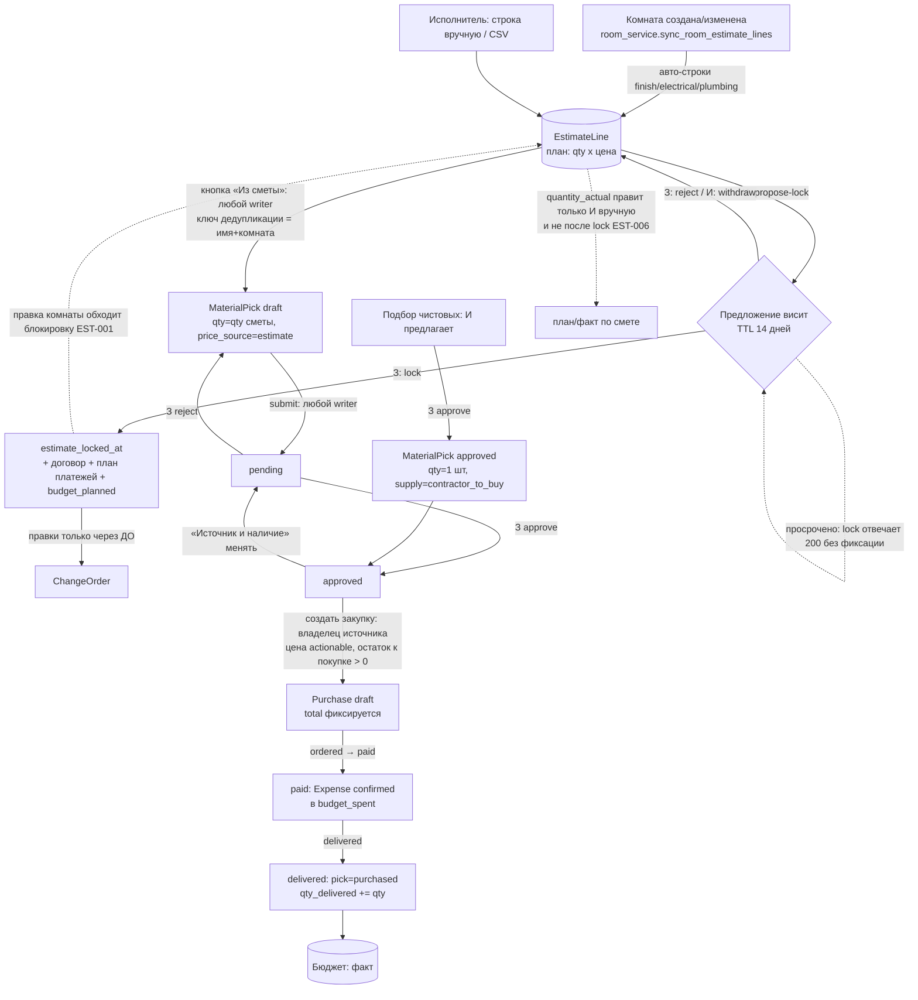
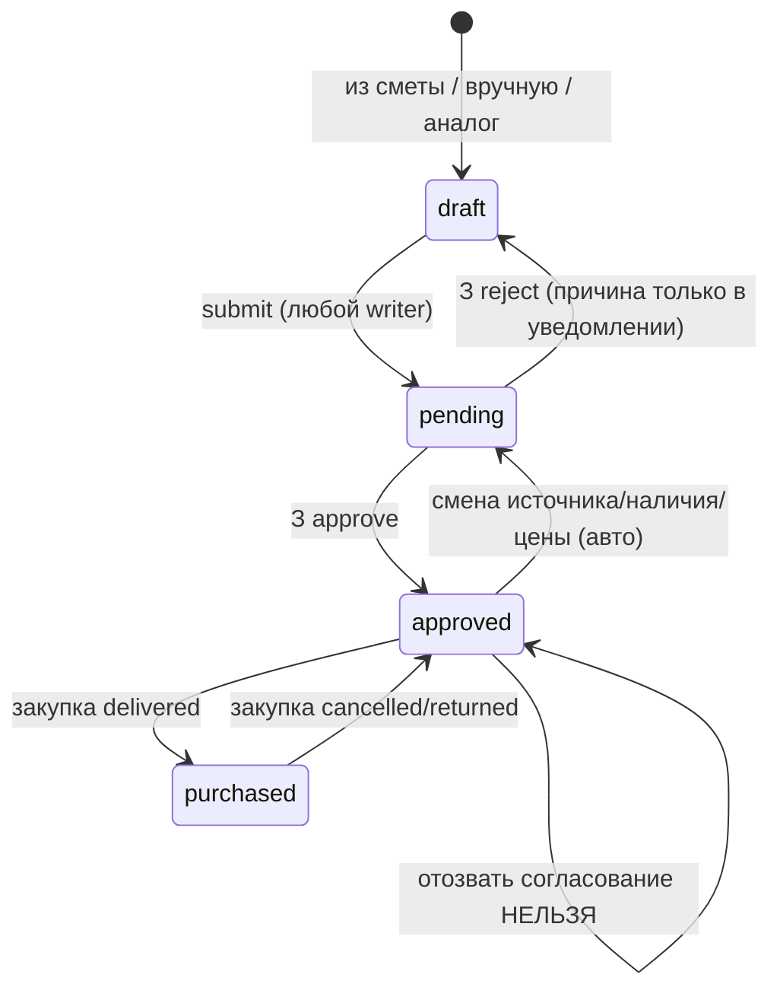
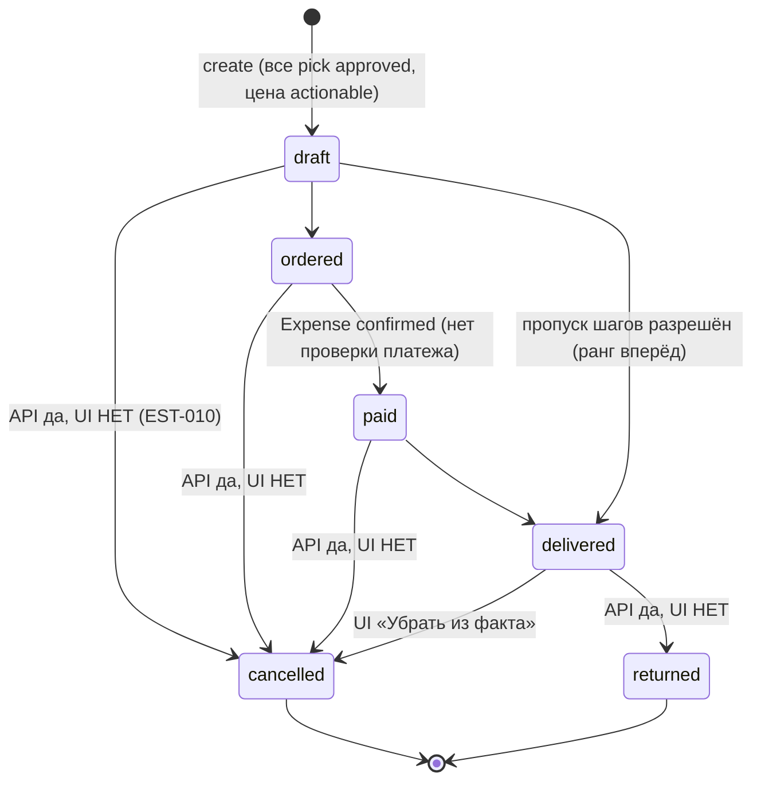
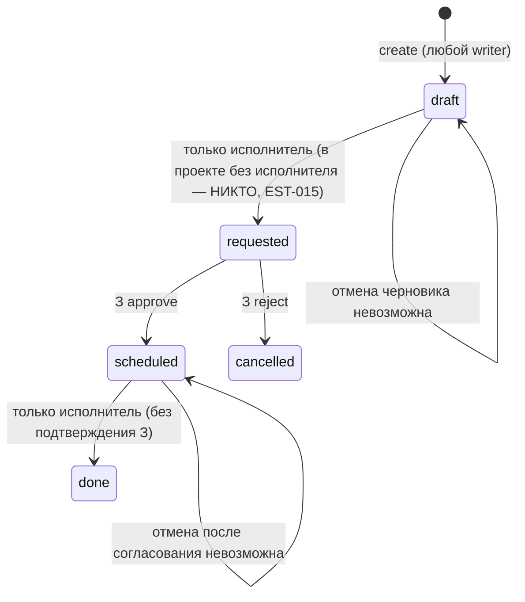
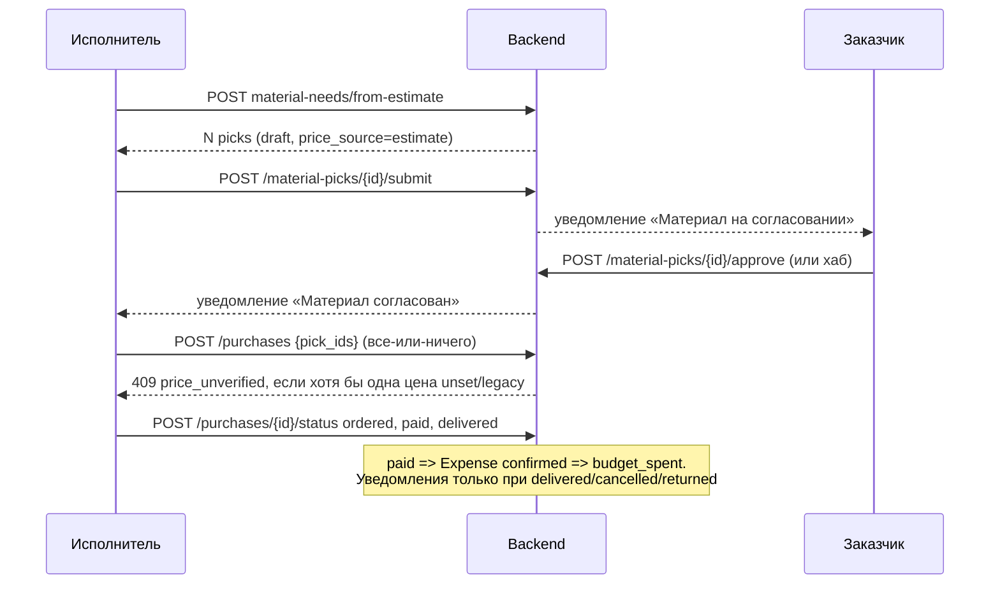

# Срез 04 — смета, материалы, закупки, выбор отделки, наряды, вывоз мусора, чек-листы, калькулятор

Дата аудита: 2026-09-30. Метод: чтение кода (backend + mobile + calc-engine) + прогон существующих backend-тестов среза (результат в разделе 6) + 4 временных in-process ASGI-пробы (SQLite tmp-файл, вне репозитория, удалены) + численный прогон калькуляторов. Живой backend (127.0.0.1:8100) не использовался, демо-база не менялась. Мобильный UI не запускался в браузере — поведение экранов подтверждено чтением кода (JS-семантика `parseFloat`/`Number` очевидна).
Продуктовый код не менялся. Пометка «ВЕРИФ.: да» = подтверждено пробой/тестом или однозначным чтением кода с указанием строки; «нет» = гипотеза, не проверено.

Роли в документе: **З** — заказчик (`project.customer_id`), **И-влад** — главный исполнитель (`project.contractor_id`), **Ком** — команда исполнителя (`owner/foreman/member`; `viewer` — только чтение), **Гость** — `ProjectViewer` (read-only), **Надзор** — технадзор (только чтение через fallback в `require_project`, `backend/app/api/deps.py:120-130`).

---

## 1. Инвентарь среза

### 1.1 Backend — эндпоинты (префикс `/api/v1`)

| Область | Метод и путь | Файл:строка |
|---|---|---|
| Смета | `PATCH /projects/{id}/estimate/lines/{line}` (qty/цена/факт) | `api/v1/estimate.py:58` |
| | `POST .../estimate/lines` (создать строку, идемпотентно) | `estimate.py:76` |
| | `POST .../estimate/import-csv` | `estimate.py:108`; логика `services/estimate_service.py:373` |
| | `GET .../estimate/materials-stats` | `estimate.py:127`; `estimate_service.py:185` |
| | `GET .../estimate/lock-diff` | `estimate.py:133`; `estimate_service.py:196` |
| | `POST .../estimate/propose-lock` / `lock` / `reject-lock` / `withdraw-lock` | `estimate.py:143 / 173 / 202 / 227`; `estimate_service.py:219 / 256 / 320` |
| Потребности | `POST .../material-needs/from-estimate` | `api/v1/purchases.py:331`; `services/purchase_service.py:424` |
| Материалы (pick) | `GET/POST .../material-picks`, `PATCH .../{id}/supply`, `POST .../{id}/submit|approve|reject|analog` | `api/v1/materials.py:283,301,321,418,435,454,475` |
| Цена | `GET .../price-truth`, `PATCH .../price`, `POST .../sync-price` | `api/v1/material_price_sync.py:79,98,123`; `services/material_price_service.py` |
| Закупки | `GET/POST .../purchases`, `POST .../purchases/{id}/status` | `api/v1/purchases.py:68,79,254`; `services/purchase_create_service.py`, `purchase_service.py:266` |
| Выбор отделки | `GET/POST .../selections`, `/pending-count`, `POST .../{id}/propose|approve|reject` | `api/v1/selections.py:92,107,128,207,239,280`; `services/selection_service.py:9` |
| Наряды | `GET/POST .../work-orders`, `GET/PATCH .../{id}`, `POST .../{id}/transition` | `api/v1/work_orders.py:65,71,100,109,139`; `services/work_order_service.py` (фасад) + `_work_order_service_core.py` |
| Вывоз мусора | `GET/POST .../waste-orders`, `POST .../{id}/request|approve|reject|complete` | `api/v1/waste_orders.py:60,75,176,192,208,224`; `services/waste_order_service.py` |
| Дизайн-пакеты | `GET/POST .../design-packages`, `POST .../{id}/submit|approve|reject`, `GET .../diff` | `api/v1/design_packages.py:57,72,121,137,153,169`; `services/design_package_service.py` |
| Хаб согласований | `GET .../approvals`, `POST .../approvals/{item}/approve|reject` | `api/v1/approvals.py:91,246,265`; `services/approval_decision_service.py:37` |
| Калькулятор комнаты | `POST /projects/{id}/rooms/{room}/calc-materials` | `api/v1/os.py:244`; `services/material_calculator.py:16` |
| Типы работ | `GET /work-types` (без авторизации, статический каталог `app/data/work_types.py`) | `api/v1/work_types.py:4` |
| Шаблоны чек-листов | `GET/POST /checklist-templates`, `GET /checklist-templates/{id}/versions` | `api/v1/checklist_templates.py:16,21,29` |
| | `GET/POST /projects/{id}/checklist-templates`, `.../{tpl}/versions`, `.../{tpl}/diff` | `api/v1/project_checklists.py:16,21,29,35` |

### 1.2 Backend — модели и сервисы

| Сущность | Где | Ключевое |
|---|---|---|
| `EstimateLine` | `models/entities.py:140-155` | `line_type work/material`, `unit` (свободная строка, латиница `pcs/m2/l/kg`), `quantity_planned`, `quantity_actual` (default 0), `unit_price`, `room_id`, `category`, `notes` |
| `Project.estimate_locked_at / estimate_lock_proposed_at / estimate_propose_snapshot_json` | `entities.py:96-100` | состояние согласования сметы |
| `MaterialPick` + `price_source/price_verified_at` | `entities.py`, `models/material_price_truth.py`, `models/material_supply.py` | статусы `draft/pending/approved/purchased`; `supply_source` (5 значений); `qty`, `qty_needed`, `qty_available`, `qty_delivered` |
| `Purchase`, `PurchaseItem` | `entities.py` | статусы `draft/approved/ordered/partial/paid/delivered/cancelled/returned` |
| `SelectionItem` | `entities.py:674` | `draft/proposed/approved/rejected`; нет поля количества |
| `WorkOrder` | `entities.py:1044-1080` | 9 статусов, `assignee_id`, `budget_planned`, `budget_spent` |
| `WasteOrder` | `entities.py:711-756` | `draft/requested/scheduled/done/cancelled`; `volume_m3`, `price` |
| `DesignPackage` | `entities.py` | статусы строкой: `published/pending/approved/rejected` |
| `ChecklistTemplate(+Version)`, `ProjectChecklistTemplate` | `entities.py:503` | шаблоны пунктов; версии создаются только v1 |
| Калькуляторы | `services/material_calculator.py`, `services/calc/estimate.py` (зеркало calc-engine), `packages/calc-engine/src/*`, `apps/mobile/lib/calc-engine/*` | 4 независимые копии формул (см. EST-030) |
| Бюджет-связка | `services/budget_service.py:228-278` (`expense_from_purchase`), `budget_service_legacy.py:394-436` (`refresh_budget_facts`) | Expense создаётся при статусе закупки `paid` или `delivered` |
| Авто-строки из комнат | `services/room_service.py:275-372` (`sync_room_estimate_lines`) | генерирует/переписывает строки сметы при создании/правке комнаты |

### 1.3 Мобильные экраны и компоненты

| Экран | Файл |
|---|---|
| «Объект → Смета» (по роли) | `components/screens/OsEstimateScreen.tsx:8` → `estimate/ContractorEstimateView.tsx` (И) / `estimate/CustomerEstimateView.tsx` (З); слои З: сводка / изменения / детали / документы (`estimate/Estimate*Layer.tsx`) |
| Редактор строк | `components/renova/estimate/EstimateLineEditorCard.tsx`, `AddEstimateLineForm.tsx`, `EstimateEditorByRoom.tsx`, `EstimateFilterBar.tsx` |
| Материалы (потребности / закупки / чеки) | `components/screens/OsMaterialsScreen.tsx`, `components/renova/MaterialPickList.tsx`, `MaterialPickDetailSheet.tsx`, `PurchaseList.tsx`, `app/material/[id].tsx`, `app/purchase/[id].tsx` |
| Подбор чистовых | `components/screens/OsSelectionsScreen.tsx` (вкладка «Ремонт → selections», `OsRepairHubScreen.tsx:92`) |
| Наряды | `components/screens/WorkOrderDetailScreen.tsx` (`app/work-order/[id].tsx`), `components/renova/WorkOrderDetailPanel.tsx`, `CreateWorkSheet.tsx`, `lib/domain/workLifecycle.ts` |
| Вывоз мусора | `components/renova/WasteOrderList.tsx` — встроен ТОЛЬКО в `estimate/EstimateOperationsPanel.tsx` (И-вид сметы); у заказчика отдельного экрана нет, решение — через `app/approvals.tsx` |
| Согласования | `app/approvals.tsx` |
| Калькулятор комнаты | `components/screens/RoomDetailScreen.tsx:256-273` (кнопка «Рассчитать материалы») |
| Чек-листы | `app/_stack/checklist-templates.tsx`, `lib/checklistTemplates.ts`, `StageDetailScreen.tsx:160` |

---

## 2. Матрица «кто что может»

Легенда: **+** можно, **−** нельзя (403/409), **(ч)** только чтение. Проверки доступа — в колонке «Где».

| Действие | З | И-влад | Ком (member/foreman) | Гость / Надзор | Где проверяется |
|---|---|---|---|---|---|
| Читать смету, материалы, закупки, наряды, мусор, подбор | + | + | + | (ч) | `require_project(write=False)` — `api/deps.py:112-135` |
| Добавить / изменить строку сметы | − | + | **+** (member тоже) | − | `estimate.py:66,83` (`user.role != contractor`) + `require_project(write=True)` |
| Импорт CSV | − | + | + | − | `estimate.py:116` |
| Предложить фиксацию (propose) | − | + (только владелец) | − | − | `estimate.py:146-156` |
| Отозвать предложение (withdraw) | − | + | + | − | `estimate.py:235`; сервис требует `cleared_by == contractor_id`: `estimate_service.py:343` (member получит 403) |
| Зафиксировать смету (lock) / отклонить (reject) | + | − | − | − | `estimate.py:176,210`; `estimate_service.py:272` |
| Править смету после lock | − | − (409 `estimate_locked`) | − | − | `estimate.py:52-55` — но **обход через комнаты, EST-001** |
| Сформировать потребности из сметы | + | + | + | − | `purchases.py:340` (любой writer) |
| Создать материал вручную (API) | + | + | + | − | `materials.py:308`; UI создаёт только И (`MaterialPickList.tsx:279`) |
| Отправить материал на согласование | + | + | + | − | `materials.py:425` |
| Согласовать / вернуть материал | + | − | − | − | `materials.py:443,462` (`user.role != customer`); хаб: `approval_decision_service.py:32-34` (`actor.id == customer_id`) |
| Сменить источник/наличие материала | + | + | **−** | − | `materials.py:19-30` (`_require_supply_principal`) |
| Указать цену вручную / «↻ цена» по ссылке | + | + | + | − | `material_price_sync.py:107,131` (любой writer); только `draft/approved`: `material_price_service.py:16,44` |
| Создать закупку | + (свои: `customer_to_buy`) | + (свои: `contractor_to_buy`) | **−** | − | `material_supply_service.py:121-127` (`actor_can_purchase`) |
| Перевести закупку в ordered/paid/delivered/cancelled/returned | + | + | **+** | − | `purchases.py:262` — только `require_project(write=True)`, без ролевой проверки — **EST-012** |
| Подбор: создать / предложить | + (API; UI — нет) | + | + | − | `selections.py:135,214`; UI: `OsSelectionsScreen.tsx:55` (`canWrite = !isCustomer`) |
| Подбор: согласовать / отклонить | + | − | − | − | `selections.py:247,289` |
| Наряд: создать | + | + | + | − | `work_orders.py:73` |
| Наряд: править поля (в т.ч. в статусах done/cancelled) | + | + | + | − | `work_orders.py:111`; ограничение только на `assignee_id`: `_work_order_service_core.py:386-435` — **EST-018** |
| Наряд: draft→published, →cancelled, published→negotiating | + | + | + | − | `ROLE_ALLOWED` `_work_order_service_core.py:43-57` |
| Наряд: published/negotiating→approved; review→done | + | − | − | − | `ROLE_ALLOWED` (`_BOTH_ROLES` не включает исполнителя) |
| Наряд: approved→in_progress, in_progress→review | −* | + | + (owner/foreman всегда; member только если `assignee_id == self`) | − | `work_order_service.py:83-134`; *З — только если он `assignee` или проект без исполнителя (`customer_can_execute_work_order`, core:523-538) |
| Наряд: review→in_progress (возврат) | + | + | + | − | `ROLE_ALLOWED` core:56 |
| Наряд: →paid | − никто (409 `payment_transition_required`) | | | | core:548-549 |
| Вывоз: создать (draft) | + | + | + | − | `waste_order_service.py:223` |
| Вывоз: draft→requested, scheduled→done | **−** | + (contractor_id) | owner/foreman | − | `waste_order_service.py:31-33,51-53` |
| Вывоз: requested→scheduled (approve) / →cancelled (reject) | + | − | − | − | `waste_order_service.py:47-49` |
| Дизайн: создать версию / submit | − | + | owner/foreman | − | `design_package_service.py:37-49,113` |
| Дизайн: approve / reject | + | − | − | − | `design_package_service.py:47-48` |
| Хаб согласований: видеть | 4 типа (материал, ДО, вывоз, дизайн) | только `room_change` | owner/foreman: `room_change` | − | `approvals.py:101-215` |
| Шаблоны чек-листов пользователя: читать версии | **любой пользователь любого шаблона (IDOR)** | | | | `checklist_templates.py:29-32` — EST-021 |
| Шаблоны чек-листов проекта: читать версии/diff | любой участник **любого** проекта по чужому `tpl_id` | | | | `project_checklists.py:29-40` — EST-021 |

---

## 3. Последовательности и состояния

### 3.1 Сквозная цепочка «смета → потребность → выбор → закупка → поставка → факт → бюджет»

Кто ждёт кого: смета — **заказчик** ждёт предложения исполнителя и фиксирует; материал — **исполнитель/любой** ждёт согласования **заказчика**; закупка — ждёт владельца источника (`customer_to_buy`→З, `contractor_to_buy`→И-влад); оплата/доставка — **нет ролевого барьера** (кто угодно из writer); наряд — заказчик ждёт `review`, исполнитель ждёт `approved`; вывоз — заказчик ждёт `requested`, исполнитель ждёт `scheduled`.
Таймаутов нет нигде, кроме TTL 14 дней на предложении сметы (`estimate_service.py:224,281-288`); при истечении никто не уведомляется.

### 3.2 Фиксация сметы

```mermaid
stateDiagram-v2
    [*] --> Черновик
    Черновик --> Предложена: И-влад propose-lock (>=1 строки; snapshot JSON; уведомление З)
    Предложена --> Предложена: И правит строки (PATCH разрешён!) EST-003
    Предложена --> Предложена: повторный propose обновляет TTL
    Предложена --> Черновик: З reject-lock (reason по умолчанию, уведомление И)
    Предложена --> Черновик: И withdraw-lock
    Предложена --> Зафиксирована: З lock (без сверки со snapshot)
    Предложена --> Предложена: З lock при возрасте > 14 дн -> HTTP 200, ничего не меняется EST-002
    Черновик --> Зафиксирована: З lock, если исполнителя нет (unilateral)
    Зафиксирована --> Зафиксирована: правки строк 409; ДО / правка комнаты
```

При lock: `estimate_locked_at`, обнуление proposal/snapshot, `recalc_budget`, `apply_plan_from_estimate` (план платежей по этапам), черновик договора, уведомление исполнителю (`estimate_service.py:289-317`).

### 3.3 MaterialPick

Разрешённые пары: `material_pick_service.py:249-262`. Пока pick входит в активную закупку (draft…delivered) — правки цены/источника и переходы запрещены (`:194,448`; `material_price_service.py:46`).

### 3.4 Purchase

Ранги: `purchase_service.py:31-54` (`partial` между ordered и paid, из UI недостижим и нет частичной поставки — EST-029). При cancelled/returned pick → `approved`, `qty_delivered` уменьшается, Expense удаляется (`budget_service.py:196-225`).

### 3.5 Подбор (Selection)

```mermaid
stateDiagram-v2
    [*] --> draft: create (UI: только И; название, цена, лимит)
    draft --> proposed: propose (уведомление З)
    rejected --> proposed: propose снова
    proposed --> approved: З approve -> MaterialPick approved (qty 1 шт)
    proposed --> rejected: З reject (причина дописывается в notes; уведомления нет)
```

Нет edit/delete (PATCH/DELETE → 404, ВЕРИФ.), нет блокировки при `price > allowance` (только флаг `over_allowance`).

### 3.6 WorkOrder

```mermaid
stateDiagram-v2
    [*] --> draft: create (publish=false)
    [*] --> published: create (publish=true)
    draft --> published: З/И
    published --> negotiating: З/И (чат работы)
    published --> approved: только З
    negotiating --> approved: только З
    approved --> in_progress: И (или исполнитель по ACL; З если сам assignee)
    in_progress --> review: И
    review --> done: только З
    review --> in_progress: З/И (доработка)
    draft --> cancelled
    published --> cancelled
    negotiating --> cancelled
    approved --> cancelled
    in_progress --> cancelled
    done --> [*]: paid недостижим EST-019
```

Таймаутов и автоприёмки нет: если З не отвечает на `published/review` — работа стоит бессрочно.

### 3.7 WasteOrder

### 3.8 Design package

`published` (создан исполнителем) → `pending` (submit исполнителя) → `approved` / `rejected` (З) → из `rejected` снова `pending` (submit). Заказчик не может согласовать `published` без submit (409 `published:approved`, ВЕРИФ.). Новая версия = новый пакет `version+1`, статус `published`; старая `approved` остаётся `approved` (нет `superseded`, ВЕРИФ.). Нет поля причины отклонения на прямом эндпоинте (`design_packages.py:153`, в хабе `reason` передаётся).

### 3.9 Sequence: закупка `contractor_to_buy`

---

## 4. Кнопки, функции и опции по экранам

Формат: подпись → обработчик → API → серверная проверка → результат/ошибки.

### 4.1 Объект → Смета, вид исполнителя (`ContractorEstimateView.tsx`)

| Кнопка/поле | Обработчик → API | Серверная проверка | Результат / замечания |
|---|---|---|---|
| Поле «Кол-во план» / «Цена, ₽» (`EstimateLineEditorCard.tsx:40-43`) | `onCommit` → `patchLine` → `PATCH /estimate/lines/{id}` | роль contractor, write, смета не locked; **нет ge=0** | `parseFloat("12,5") = 12` — запятая обрезается; `|| прежнее` не даёт поставить 0 (EST-008); отрицательные значения принимаются (EST-004) |
| «Факт расход» (только материалы, `:44-53`) | тот же PATCH `quantity_actual` | после lock → 409 `estimate_locked` | единственный ввод факта; после lock недоступен (EST-006); для работ поля нет |
| «Заметка / доп. информация» (`:56-66`) | PATCH `{notes}` | `LinePatch` не содержит `notes` | HTTP 200, **не сохраняется** (EST-005) |
| «+ Строка сметы» (`AddEstimateLineForm.tsx:70-132`) | `POST /estimate/lines` + `client_request_id` | роль, не locked, `quantity_planned > 0`, `unit_price >= 0` | ошибка сети/бизнес-ошибка — один общий текст «Строка не добавлена… Проверьте сеть»; запятая в числах обрабатывается верно (`:72-73`) |
| «Отправить смету на согласование» (`:118-131`) | `POST /estimate/propose-lock` | владелец-исполнитель, ≥1 строки | уведомление З; кнопка отключена, пока `estimate_lock_proposed_at` установлен — в том числе после истечения 14 дней (EST-002); правки строк остаются доступными (EST-003) |
| «Отозвать предложение» (`:136-163`) | confirm → `POST /withdraw-lock` | `cleared_by == contractor_id` | Ком получит 403 |
| «→ Бюджет», «→ Материалы» | навигация | — | — |
| «Подбор материалов и вывоз ▸» (`EstimateOperationsPanel.tsx`) | раскрывает `WasteOrderList` + дубль `MaterialPickList` | — | те же формы, что на вкладке «Материалы» |
| «Отправить на согласование» (доп. работа) | `POST /change-orders` | вне среза (срез ДО) | значения по умолчанию «Доп. розетки»/«8500» подставлены в поля (`:35-36`) — легко отправить случайно |

### 4.2 Объект → Смета, вид заказчика (`CustomerEstimateView.tsx`)

Экран **только для чтения**: нет ни правки строк, ни добавления, ни импорта; нет кнопки «Материалы из сметы» (она на вкладке «Материалы»).

| Кнопка | Обработчик → API | Серверная проверка | Результат / замечания |
|---|---|---|---|
| «Зафиксировать» (`EstimateSummaryLayer`, `canLock`: `:108-113`) | `POST /estimate/lock` → `alertEstimateLocked` | `role == customer`; предложение обязательно, если есть исполнитель; TTL 14 дн | при `proposal_stale` сервер отвечает **200 без фиксации**, UI показывает успех (EST-002); нет сверки со snapshot (EST-003) |
| «Отклонить» | `POST /estimate/reject-lock` (причина зашита: «Нужна правка сметы») | `role == customer`, есть proposal | нет поля причины (комментарий не введёшь) |
| Слой «Изменения» | `GET/POST` change-orders | вне среза | — |
| Блок diff | `GET /estimate/lock-diff` | read | показывает added/removed/changed относительно snapshot |

Заказчик без исполнителя: строки может создавать только через комнаты (API 403 на `/estimate/lines`, `estimate.py:83`); lock без propose работает (ВЕРИФ. — проба D1).

### 4.3 Материалы (`OsMaterialsScreen.tsx`)

| Кнопка | Обработчик → API | Серверная проверка | Результат / замечания |
|---|---|---|---|
| «Следующий шаг» (`procurementNextAction`) | `generate` / `create_purchase` / навигация | — | CTA выбирается на клиенте; `readyPickIds` не проверяет `price_actionable` (EST-011) |
| «Из сметы» (`generateFromEstimate:146`) | `POST /material-needs/from-estimate` | любой writer; дедупликация по `(name, room_id)` | не обновляет существующие pick при изменении сметы (EST-024) |
| «Создать закупку» (`createPurchaseFromReady:161`) | `POST /purchases {pick_ids}` | все approved, владелец источника, цена actionable, остаток > 0 — **всё-или-ничего** | любая ошибка → «Проверьте сеть» (`:172-177`) — бизнес-причина скрыта (EST-011) |
| Фильтры «Все / Купить / Согласовано / Доступно / Не хватает» | клиентская фильтрация | — | «Согласовано» = `status === approved` (не «заказано») |
| «Отметить заказ» / «Оплачено» / «Доставлено» (`PurchaseList.tsx:53-62`, `advancePurchase:195`) | `POST /purchases/{id}/status` | только write-доступ, ранг вперёд | нет ролевого ограничения (EST-012); ошибки — общий текст |
| «Убрать из факта» (только `delivered`, `PurchaseList.tsx:63-72`) | confirm → status `cancelled` | терминальный статус | draft/ordered/paid отменить нельзя (EST-010); «Позиции сохранятся» верно, «восстановить» — нет |
| «Источник и наличие» / «Сохранить источник» (`MaterialPickList.tsx:155-211`) | `PATCH /material-picks/{id}/supply` | только З и И-влад | у `approved` сбрасывает в `pending` (предупреждение в UI есть) |
| «↻ цена» (только И, при `shop_url`) | `POST /sync-price` | write; pick draft/approved, не в закупке | цена принимается только от JSON-LD/meta/текста с ₽; не-RUB отвергается (`price_parser.py:209`) |
| «Согласовать» (З, `pending`) | confirm → `POST /approve` | `role == customer` | ошибка показывается сообщением |
| «На согласование» (И, `draft`) | `POST /submit` | write | **нет try/catch** (`MaterialPickList.tsx:269-274`) — сбой молча |
| «+ Материал» → «Сохранить» (только И, `:279-340`) | `POST /material-picks {qty:1, unit:'шт'}` | `qty > 0` | **количество не вводится, всегда 1 шт**; цена `Number(price)` — «12,5» → 0 (EST-026) |
| «Сканировать QR чека» | `/scan-receipt` | вне среза | — |

### 4.4 Карточки материала и закупки

`MaterialPickDetailSheet.tsx`, `app/material/[id].tsx`: «Согласовать» (З, pending), «На согласование» (И, draft), «Убрать из факта» (delivered), «Сохранить цену вручную» (`PATCH /price`), «Проверить по ссылке поставщика» (`POST /sync-price`), «Полная карточка». Нет кнопки «Отклонить» для заказчика — только через хаб (`rejectMaterialPick` в `lib/api/materials.ts:50` нигде в UI не вызывается). Захардкожено «Кто платит: Подрядчик» и «Оплата: подрядчик» независимо от `supply_source` (EST-028).
`app/purchase/[id].tsx`: кнопка следующего шага без `try/catch` (`:64-70`); при ошибке загрузки экран навсегда «Загрузка…» (`:41`).

### 4.5 Подбор чистовых (`OsSelectionsScreen.tsx`)

| Кнопка | API | Замечания |
|---|---|---|
| «Предложить позицию» → «Сохранить» (только И, `canWrite = !isCustomer`) | `POST /selections {title, category, price, allowance}` | нет комнаты, количества, SKU, ссылки магазина; категория = текущий фильтр («Все» → other); «1500,5» → 0 (EST-014) |
| «На согласование» / «Отправить снова» | `POST /propose` | `else throw e` — необработанный reject без сообщения |
| «Согласовать» (З) | confirm → `POST /approve` | создаёт `MaterialPick approved`, 1 шт, `contractor_to_buy` (EST-013); уведомления исполнителю нет |
| «Отклонить» (З) | confirm → `POST /reject` | причины в UI нет, уведомления исполнителю нет (ВЕРИФ.: проба B6) |

### 4.6 Наряды (`WorkOrderDetailScreen.tsx`, `CreateWorkSheet.tsx`)

Кнопки строятся из `workActions(status, role)` (`lib/domain/workLifecycle.ts`) и повторяют `ROLE_ALLOWED` бэкенда: «Опубликовать», «Обсудить» (открывает чат работы), «Согласовать» (З, confirm), «Начать», «Передать на приёмку» (И), «Принять результат» (З, confirm), «Вернуть на доработку», «Отменить». «Открыть оплаты» — навигация в платежи (статус `paid` ставится не отсюда). Ошибки переводятся в человекочитаемые (`transitionErrorMessage:31-43`). Создание: «Черновик» / «Опубликовать» / «Добавить в план» (`CreateWorkSheet.tsx:377-384`), бюджет `+budget` (запятая → NaN). Блок «Бюджет работы: факт / план» показывает `budget_spent`, который никто не пишет (EST-019).

### 4.7 Вывоз мусора (`WasteOrderList.tsx`)

| Кнопка | API | Замечания |
|---|---|---|
| «+ Контейнер 8 м³» (И) | `POST /waste-orders {volume_m3: 8, price: 4500}` | объём и цена зашиты; `total = volume × price = 36 000 ₽` (EST-016) |
| «Заказать» (И, draft) | `POST /request` | — |
| «Согласовать» (З, requested; виден только если З попадёт в этот список — вид сметы И; у З решение через хаб) | confirm → `POST /approve` | сообщение «Стоимость войдёт в бюджет» неверно — в бюджет-факт вывоз не попадает |
| «Вывезено» (И, scheduled) | `POST /complete` | без подтверждения З и без факта объёма/суммы |
Статус показывается сырым кодом (`{w.volume_m3} м³ · {w.status}`, `:51`).

### 4.8 Калькулятор комнаты и шаблоны чек-листов

«Рассчитать материалы» (`RoomDetailScreen.tsx:256-273`) → `POST /rooms/{id}/calc-materials` → сервер падает `AttributeError` (EST-009). «Шаблоны чеклиста» (`checklist-templates.tsx`): «Сохранить шаблон» + список; правки/удаления/применения к этапу нет (EST-022).

---

## 5. РЕЕСТР ДЕФЕКТОВ

Тип: НР — не работает; Т — тупик; Р — рассинхрон UI↔backend; ACL — нет/слабый ACL; НС — неверный статус; НД — нечестные данные; МК — мёртвый код; UX — затык UX.
ВЕРИФ.: «да (проба)» = воспроизведено in-process ASGI; «да (код)» = однозначное чтение кода; «нет» = гипотеза.

| ID | Сер. | Тип | Доказательство (file:line + воспроизведение) | Кого | Предложение | ВЕРИФ. |
|---|---|---|---|---|---|---|
| EST-001 | P0 | ACL / НД (деньги) | Блокировка сметы проверяется только в `estimate.py:52-55`. Комнаты вызывают `sync_room_estimate_lines` без проверки: `room_mutation_service.py:304`, `room_change_service.py:320` → `room_service.py:340-372` переписывают `quantity_planned`, добавляют/удаляют строки и пересчитывают `budget_planned`. Проба: смета зафиксирована на 43 035 ₽; PATCH комнаты 10×10 → `budget_planned = 239 979.9`; новая комната (10 розеток) → 326 208.6, строк 5→12 — без ДО, `estimate_locked_at` остался | З (цена договора), И | при `estimate_locked_at` запрещать/направлять правку комнаты в ДО; либо `sync_room_estimate_lines` не трогает зафиксированные строки | да (проба) |
| EST-002 | P1 | НР / НС / UX | `estimate_service.py:281-288` возвращает `proposal_stale`, роут `estimate.py:185-190` его не обрабатывает → `200 {"ok":true,"estimate_locked_at":null,"contract":null}`. Проба: proposal возрастом 20 дн → 200, `estimate_locked_at` не установлен. Мобильный `CustomerEstimateView.tsx:124-128` после 200 показывает `alertEstimateLocked` (договор/график). У И кнопка «на согласовании» отключена (`ContractorEstimateView.tsx:121`) — переотправить можно только после «Отозвать» | З, И | вернуть 409 `proposal_stale`; UI показывать «устарело, попросите исполнителя отправить снова» и разрешить re-propose; уведомлять И об истечении | да (проба) |
| EST-003 | P1 | НС / нечестные данные | `_require_estimate_editable` (`estimate.py:52-55`) не учитывает висящее предложение; `lock_estimate` (`estimate_service.py:256-317`) не сверяет с `estimate_propose_snapshot_json`. Проба: propose → PATCH цены 100→99999 (200) → lock (200). `lock-diff` — только информационный | З | при правке строки автоматически снимать proposal (или блокировать правки), либо lock принимает хэш/`snapshot_version` и отвечает 409 при расхождении | да (проба) |
| EST-004 | P1 | НР (валидация) | `LinePatch` без ограничений (`estimate.py:33-36`); `create` требует `gt=0/ge=0` (`:43-44`). Проба: `quantity_planned=-5` → 200, `budget_planned = -500`; `0` → 200; `unit_price=-50` → `-150` | З, И | `Field(gt=0)`/`ge=0` в `LinePatch`; конечные числа | да (проба) |
| EST-005 | P1 | НР / НД | Поле «Заметка» шлёт `{notes}` (`EstimateLineEditorCard.tsx:64`), `LinePatch` поля `notes` не имеет (`estimate.py:33-36`) → 200, ничего не сохраняется. Проба: `notes now None` | И | добавить `notes` в `LinePatch`/`update_line` (или убрать поле из UI) | да (проба) |
| EST-006 | P1 | НР / Т / НД | `quantity_actual` пишет только `PATCH /estimate/lines` (`estimate_service.py:89-90`), а он закрыт после lock (`estimate.py:69`, 409 `estimate_locked`, проба). `_on_delivered` (`purchase_service.py:381-397`) факт в смету не пишет. UI-поле «Факт расход» есть только у материалов (`EstimateLineEditorCard.tsx:44`) → `works_fact` всегда 0 (`analytics.py:98`), `material_stats.actual` и перерасход (`estimate_service.py:185-193`), room budget alerts (`analytics.py:48,84`) после lock = 0 | З, И | разрешить `quantity_actual` после lock отдельным полем/эндпоинтом; либо считать факт из поставок/расходов | да (проба + код) |
| EST-007 | P1 | Р / НД | Три несовместимых «факта материалов»: (1) `analytics.py:33` — `quantity_actual × price` (0 без ручного ввода); (2) `analytics.py:101` — `qty × price` picks в статусах `approved` **и** `purchased` (согласованное ≠ купленное; включает `customer_on_hand`/`contractor_included`, где денег не тратилось); (3) бюджет — Expense закупок `paid/delivered` (`budget_service.py:229`). Разные экраны покажут разные суммы | З, И | единый источник — Expense/поставки; убрать `approved` из факта | да (код) |
| EST-008 | P1 | НД (округление ввода) | `EstimateLineEditorCard.tsx:41,43,52`: `parseFloat(v)` — «12,5» → 12 (обрезка), `|| line.unit_price` — нельзя ввести 0/очистить. Аналогично `MaterialPickList.tsx:319` (`Number("12,5")` → NaN → 0) и `OsSelectionsScreen.tsx:100`. `AddEstimateLineForm.tsx:72-73` запятую обрабатывает — поведение неконсистентно. Русская клавиатура decimal-pad даёт запятую | И (все, кто вводит цену/кол-во) | единый парсер `parseDecimalRu`, явная ошибка на невалидный ввод | да (код) |
| EST-009 | P1 | НР | `os.py:257` вызывает `room.floor_sq_m/wall_sq_m/perimeter_m` — у `Room` таких атрибутов нет (метрики считаются в `room_service.room_detail`). Проба: `POST /rooms/r1/calc-materials` → 500 `AttributeError: 'Room' object has no attribute 'floor_sq_m'`. Кнопка «Рассчитать материалы» (`RoomDetailScreen.tsx:269`) всегда ломается. Побочно: роут с `write=False` пишет activity (`os.py:258`). Тестов на эндпоинт нет | З, И (кнопка видна при `canWrite`) | считать метрики через `calc_room_metrics`; тест на эндпоинт | да (проба) |
| EST-010 | P1 | Т / Р (UI↔API) | UI даёт отмену только для `delivered` (`purchaseLifecycle.ts:19-21`, `PurchaseList.tsx:63`); `PURCHASE_NEXT_STATUS` (`:3-8`) вперёд без «отмены»; `returned`/`partial` из UI недостижимы. API допускает `cancelled` из любого статуса (проба: `paid → cancelled` 200). Пока закупка активна, pick заблокирован для смены цены/источника/статуса (`material_pick_service.py:194,448`; `material_price_service.py:46`). Ошибочная закупка (не тот поставщик/состав) в статусе draft/ordered/paid не отменяется — «в тупике» до «Доставлено», после чего только «Убрать из факта» | И, З | кнопка «Отменить закупку» для draft/approved/ordered/paid; «Возврат» для delivered | да (код+проба) |
| EST-011 | P1 | UX / Т | `OsMaterialsScreen.tsx:172-177,204-209` — любой сбой = «Проверьте сеть»; бизнес-коды `purchase_pick_price_unverified`, `picks_not_approved`, `picks_already_in_active_purchase` теряются. `readyPickIds` (`procurementNextAction.ts:35-47`) не отфильтровывает позиции с непроверенной ценой, а `prepare_purchase_from_picks` — всё-или-ничего (`purchase_create_service.py:93-104`). Проба: 2 pick, у одного `price_source=unset` → 409 на всю пачку, при этом UI предлагает «Создайте закупку: 2 поз. готовы». Сметные позиции с ценой 0 получают `price_source=unset` (`purchase_service.py:530`) | И, З | показывать `detail.message`; фильтровать «готовые» по `price_actionable`; подсветить позиции без цены | да (проба) |
| EST-012 | P1 | ACL / НД (деньги) | `update_purchase_status` (`purchases.py:262`) проверяет только write-доступ: любой участник, включая `member` команды и заказчика по закупке исполнителя, может поставить `paid`/`delivered`. `paid` создаёт `Expense(status="confirmed", payment_method="transfer")` без чека/подтверждения (`budget_service.py:229-278`; `refresh_budget_facts` `budget_service_legacy.py:403-417`) → растёт `projects.budget_spent`. Проба: закупка З создана З, `member` ставит `ordered → paid` → `Expense 300 confirmed`, `budget_spent = 300`; возможен `draft → delivered` без заказа/оплаты | З (искажение бюджета), И | ограничить переходы владельцем источника (`actor_can_purchase`), `paid` — только через подтверждённый платёж/чек; `delivered` — тому, кто принимает | да (проба) |
| EST-013 | P1 | НД / Т | Согласованный подбор создаёт `MaterialPick(qty=1, unit="шт")` (`selection_service.py:19-20`) — у `SelectionItem` нет количества, закупка = 1 шт × цена (плитка на 25 м² превращается в 1 шт). `supply_source` не задаётся → модельный default `contractor_to_buy` (`models/material_supply.py:22`): в проекте без исполнителя заказчик не может купить (проба: 409 `purchase_pick_responsibility_forbidden`); смена источника переводит pick в `pending` и нужно согласовать заново (`material_pick_service.py:212-216`) | З, И | количество и единица в подборе; источник по `default_source_for_project` | да (проба) |
| EST-014 | P2 | НР / UX | Выбор отделки: approve/reject не уведомляют И (проба: в `AppNotification` только «Подбор на согласование» для З); нет PATCH/DELETE (404, проба); `over_allowance` не блокирует согласование (проба: approve при цене 1500 > лимит 1000 → 200); UI-форма создания только у И (`OsSelectionsScreen.tsx:55`) без комнаты/количества/SKU/ссылки; причина отклонения в UI не вводится (комментарий кода `:257`), но API её дописывает в `notes` (`selections.py:297-298`) | З, И | уведомления, edit/delete, предупреждение при превышении лимита, поля формы | да (проба) |
| EST-015 | P1 | Т | Вывоз: `draft → requested` доступен только исполнителю (`waste_order_service.py:31-33,51-53`); в проекте без исполнителя — никому: проба «REQUEST by customer-only → 403». Отмена: `draft → cancelled` запрещена (`:15-24`, проба 409), `scheduled → cancelled` запрещена (проба 409), исполнитель не может отозвать `requested` (проба 403). Завершение — без участия заказчика | З (самостоятельный ремонт), И | разрешить З запрашивать/закрывать при отсутствии исполнителя; отмена draft/scheduled | да (проба) |
| EST-016 | P1 | НД / Р | `WasteOrderList.tsx:100` создаёт «Контейнер 8 м³» с `price: 4500`, а стоимость = `volume × price` (`waste_orders.py:49-53`, `analytics.py:107`) → 36 000 ₽ вместо 4 500 ₽ (что такое `price` — за м³ или за заявку — нигде не указано). Объём/цена/дата в UI не вводятся. Текст «Стоимость войдёт в бюджет» (`:67`) ложен: Expense из `WasteOrder` не создаётся (в `refresh_budget_facts` вывоза нет) | З, И | явная семантика (цена за м³ / за рейс), форма ввода, создавать Expense при `done` | да (код) |
| EST-017 | P2 | Р | `analytics.py:107-109`: вывоз (включая draft/requested) добавляется в «план», но `budget_planned` считается как смета + утверждённые ДО (`budget_service.py:380-404`), поэтому `reserve = max(0, planned − works − materials − waste)` занижается, `total_planned` может превысить `budget_planned` | З | считать вывоз в плане только после согласования и отражать в `budget_planned` | да (код) |
| EST-018 | P2 | ACL / НС | `PATCH work-orders/{id}` (`work_orders.py:109-136`; `_work_order_service_core.py:438-508`) не проверяет статус и роль: меняет `title/work_type/budget_planned/даты` у `done`/`cancelled`/`approved`. Проба: после `done` исполнитель поменял название и бюджет (200); `member` тоже (200) | З, И | запретить правку полей после `approved`/в терминальных статусах, кроме `notes`; правку бюджета — только З | да (проба) |
| EST-019 | P2 | МК / НД | `WorkOrder.budget_spent` нигде не обновляется (grep: единственная запись в `entities.py:1074`), статус `paid` недостижим (`_work_order_service_core.py:34,548-549`; проба 409). UI показывает «Бюджет работы: 0 / план» (`WorkOrderDetailScreen.tsx:189-193`). Наряд не связан со строками сметы/этапом бюджета | З, И | связать `budget_spent` с Expense по `stage_id/work_order_id` или убрать поле/статус | да (код+проба) |
| EST-020 | P3 | Т (процесс) | Наряд: нет шага «исполнитель принимает/отклоняет»: `published → approved` только заказчиком, у исполнителя лишь `cancel` (`ROLE_ALLOWED` core:47-52); нет таймаутов на ожидание З (`published`, `review`); ожидание показывается текстом `waitingForText`, но напоминаний нет | И | явный `accepted` со стороны исполнителя и SLA-напоминания | да (код) |
| EST-021 | P1 | ACL | `GET /checklist-templates/{id}/versions` (`checklist_templates.py:29-32`) не сверяет владельца, `GET /projects/{p}/checklist-templates/{tpl}/versions|diff` (`project_checklists.py:29-40`) не проверяет, что `tpl` принадлежит `p`. Пробы: чужой пользователь получил пункты «секретного» шаблона по id; участник проекта p2 получил версии шаблона проекта p1 | все | фильтр `ChecklistTemplate.user_id == user.id` / `ProjectChecklistTemplate.project_id == project_id` | да (проба) |
| EST-022 | P2 | МК / Т | Шаблоны чек-листов не используются: этап берёт `checklistForStage` (жёсткий словарь) или workflow (`StageDetailScreen.tsx:160`); нет PATCH/DELETE/применения; версия всегда 1 (`checklist_templates.py:25`, `project_checklists.py:25`); `ChecklistVersionList/Diff` и `saveProjectChecklist` нигде не вызываются (grep); бэкенд-сервисы приёмки шаблоны не читают (grep) | И | либо подключить шаблоны к `ensure_stage_checklist`, либо убрать экран | да (код) |
| EST-023 | P2 | НР / НД | Импорт CSV (`estimate_service.py:373-474`): повторный импорт того же файла дублирует все строки (проба: `Клей`×2, `Грунт`×2); отрицательная цена молча превращается в 0 (`max(0.0, price)`, проба `Грунт` цена 0); значения `nan`/`inf` проходят `float()` и роняют импорт HTTP 500 (`IntegrityError`/`decimal.InvalidOperation`, проба) — все строки теряются | И | `math.isfinite`, идемпотентность/дедуп по хэшу файла, вернуть список ошибочных строк | да (проба) |
| EST-024 | P2 | Р | «Из сметы» (`purchase_service.py:508-537`): ключ `(name, room_id)`; проба: (а) две строки «Плитка» в одной комнате → создаётся один pick, количество второй (5) потеряно; (б) правка количества в смете с 10 до 50 после генерации → pick остаётся 10, повторная генерация `count=0`; (в) переименование строки → появляется второй pick для той же строки. Ссылки `estimate_line_id` нет, удалённые строки не чистятся. Единицы сметы (`m2`, `l`, `pcs`) копируются в pick и показываются в UI как «12.96 m2» | И, З | связь pick↔строка сметы, пересинхронизация до статуса `pending`, нормализация единиц | да (проба) |
| EST-025 | P1 | Т | Для `MaterialPick` нет PATCH/DELETE (проба: 404); `require_editable_pick` (`material_pick_service.py:158`) нигде не вызывается — мёртвый код. Исправить количество/название/единицу/комнату можно только созданием аналога; approved pick нельзя отозвать (разрешены только `draft→pending`, `pending→approved/draft`, `material_pick_service.py:255-258`) | И, З | эндпоинт правки draft/pending + удаление; «отозвать согласование» | да (проба) |
| EST-026 | P1 | НД | Ручное создание материала в UI не имеет поля количества: `qty: 1, unit: 'шт'` (`MaterialPickList.tsx:319-321`), подсказка «Доступно, шт»; форма только у исполнителя (`:279`), у заказчика её нет, хотя API позволяет | И, З | поля «Количество» и «Ед.», форма для заказчика | да (код) |
| EST-027 | P3 | Р | Отклонение pick возвращает в `draft` (`_target_for("reject")`, `material_pick_service.py:241-246`), причина живёт только в активности/уведомлении, не на pick; статус «Отклонено» в `app/material/[id].tsx:21` недостижим | И | хранить `reject_reason`, статус `rejected` | да (код) |
| EST-028 | P2 | Р / НД | Копирайт vs факт: `PurchaseList.tsx:30` «… → Доставлено (факт)» и `material/[id].tsx:209` «в факт попадёт только после «Куплено»», а Expense создаётся уже при `paid` (`budget_service_legacy.py:412`, `budget_service.py:229`). «Кто платит: Подрядчик» захардкожено (`MaterialPickDetailSheet.tsx:266-267`, `material/[id].tsx:212`) при `customer_to_buy`. «Операцию можно восстановить позже» (`MaterialPickDetailSheet.tsx:176`, `material/[id].tsx:218`) — `cancelled` терминален (`purchase_service.py:45-46`) | З, И | синхронизировать тексты с реальными правилами, брать плательщика из `supply_source` | да (код) |
| EST-029 | P2 | НР | Закупка не поддерживает частичную поставку: `delivered` добавляет полный `item.qty` (`purchase_service.py:392`), `partial` (промежуточный по рангу) из UI не ставится и не несёт суммы; `total_amount` фиксируется при создании; для дозакупки нужна новая закупка при том, что pick уже `purchased` (терминален для новых закупок) | И, З | частичные поставки с количеством; дозакупка по остатку | да (код) |
| EST-030 | P2 | Р / НД | Четыре копии калькулятора: `material_calculator.py`, `services/calc/estimate.py`, `packages/calc-engine`, `apps/mobile/lib/calc-engine`. Пример комнаты 4,2×3,1×2,7: краска — 11,23 л (`material_calculator`, 2 слоя × 0,15) против 4,91 л (сметная строка, `wall×1,05/8`), обои `round()` вместо потолочного округления (стены 47 м² → 10 рулонов = 50 м² < 51,7 нужных), минимум 1 рулон при нулевых стенах, отрицательные габариты дают отрицательные количества (плитка −5,5 при площади −5), плитка и ламинат всегда выводятся одновременно на один пол, примечание «запас 7%» при диагонали (12%), параметр `door_width_m` не используется (константа 0,9), результат не сохраняется и не питает потребности. `packages/calc-engine` не импортируется никем (`@renova/calc-engine` только в `calc:test`), его тест на `console.assert` (не падает), `calc:test` не входит в CI (`ci.yml` без `calc`); тесты `apps/mobile/lib/calc-engine/*.test.ts` не входят в `mobile:test` | З, И | один источник формул на бэкенде; тесты с граничными значениями; потолочное округление | да (численный прогон) |
| EST-031 | P2 | Р | Хаб согласований (`approvals.py:91-215`) не содержит: предложение сметы, подбор (`proposed`), наряды `published/review`, закупки. Проба: при висящих предложении сметы, `proposed` подборе и `published` наряде `pending_count = 0`. У исполнителя хаб показывает только `room_change`. Дизайн: `reject` без причины на прямом эндпоинте (`design_packages.py:153`); версии не «вытесняют» друг друга (проба: v1 `approved`, v2 `published`) | З, И | единый список «ждёт вашего решения/ждём ответа» по всем сущностям | да (проба) |
| EST-032 | P2 | ACL | Правка сметы разрешена любому `contractor`-write (включая `member`, `estimate.py:66`), а отправка на согласование — только владельцу (`:149-156`); удалить/переименовать строку нельзя вовсе (`LinePatch`), тип/единицу/комнату — тоже; ошибочную строку убирает только ДО | И | роль `foreman+` для правок; endpoint удаления до propose | да (проба+код) |
| EST-033 | P2 | Т | Проект без исполнителя (самостоятельный ремонт): З не может добавлять/править строки сметы (`estimate.py:66,83` → 403, UI не даёт), только через комнаты (авто-строки с типовыми ценами); lock unilateral работает (проба D1). Цены/объёмы типовых строк подправить нельзя | З | разрешить З править смету, когда `contractor_id is None` | да (проба) |
| EST-034 | P2 | UX | Необработанные ошибки: `OsSelectionsScreen.tsx:202-250` (`else throw e` без сообщения), `MaterialPickList.tsx:269-274` (submit без try/catch), `purchase/[id].tsx:64-70`; создание закупки/статуса — общий текст (EST-011) | З, И | единый обработчик с `detail.message` | да (код) |
| EST-035 | P3 | UX | Статус вывоза показывается сырым кодом `requested/scheduled` (`WasteOrderList.tsx:51`); сумма вывоза `formatRub(w.total || w.price)` при `total == 0` показывает цену; бюджет наряда `+budget` (`CreateWorkSheet.tsx:164`) при запятой → NaN | З, И | локализовать, единый парсер | да (код) |
| EST-036 | P3 | UX | Уведомления по закупкам приходят только при `delivered/cancelled/returned` (`purchases.py:47-52`); `ordered/paid` не уведомляют вторую сторону | З, И | добавить `paid` для `customer_to_buy`/`contractor_to_buy` | да (код) |
| EST-037 | P3 | НД (гипотеза) | Цена по ссылке магазина принимается «как за единицу материала», хотя магазины часто указывают цену за упаковку/коробку; сопоставление единицы цены и `qty/unit` pick не моделируется. Валюта: при отсутствии `priceCurrency` считается RUB (`price_parser.py:208`) | И, З | поле «единица цены»/предупреждение | нет (гипотеза) |

Итого: **37 записей** — P0: 1, P1: 17, P2: 14, P3: 5 (EST-037 — гипотеза, остальные верифицированы).

---

## 6. Покрытие тестами

Существующие backend-тесты среза прогнаны: результат — в строке ниже.

**123 passed за 184 с, 0 failed** (файлы: `test_estimate_lock*`, `test_estimate_proposal_required_w64`, `test_estimate_clear_proposal_w65`, `test_estimate_line_acl_w375`, `test_estimate_line_create_replay_406`, `test_material_*` (6), `test_purchase_*` (5), `test_selections`, `test_waste_order_lifecycle_integrity`, `test_work_order_*` (4), `test_design_package_idempotency_413`, `test_approval_hub_atomicity`, `test_w66_controls`). Все существующие тесты зелёные — то есть перечисленные ниже дефекты **не покрыты** тестами, а не «сломаны тестами».

Оценка полезности:
- **Сильное покрытие** транзакционной целостности: идемпотентность (`test_estimate_line_create_replay_406`, `test_purchase_create_idempotency`, `test_material_needs_generation_atomic`), ACL по строке сметы (`test_estimate_line_acl_w375`), переходы закупки/наряда/вывоза (`test_purchase_transition_integrity`, `test_work_order_*`, `test_waste_order_lifecycle_integrity`), провенанс цены.
- **Слабое**: значительная часть «тестов» W57/W64/W65 — проверки исходного кода на подстроку (`inspect.getsource(...)`, например `test_estimate_lock_w57.py`), а не поведения. Тест на `proposal_stale` (`test_w66_controls.py:138`) проверяет сервис, а не HTTP-ответ — дефект EST-002 не виден.
- **Нет тестов**: `calc-materials` эндпоинт (EST-009), lock смены через комнаты (EST-001), ACL шаблонов чек-листов (EST-021), CSV `nan/inf`/повторный импорт (EST-023), ролевые ограничения `purchases/{id}/status` (EST-012), связка `analytics` факт (EST-007), `LinePatch` валидация (EST-004), нотификации подбора (EST-014).
- **Калькуляторы**: `packages/calc-engine/src/index.test.ts` — 1 файл на `console.assert` (никогда не падает, `calc:test` вне CI); `material_calculator.py` без тестов (кроме косвенных через `budget_planner`); граничных значений (0, отрицательные, большие площади) нет.

---

## 7. Что не удалось проверить / оговорки

- Живой backend и UI в браузере не запускались (только чтение кода и in-process ASGI на SQLite). Пробы Postgres-специфичной конкурентности (`*_postgres_*` тесты) не исполнялись.
- Поведение `EstimateSummaryLayer`/`EstimateChangesLayer` (кнопки «Зафиксировать/Отклонить», ДО) прочитано только на уровне вызовов из `CustomerEstimateView`; ДО — предмет другого среза.
- Реальные ответы магазинов (`price_parser`, `sync-price`) не проверялись; EST-037 — гипотеза.
- Портальные (по токену) пути к смете/материалам (`portal.py`) и e-sign договора после lock в срез не входят.
- Проверка `paid`-контура наряда через платежи/выписки (`payments`) — срез оплат.
