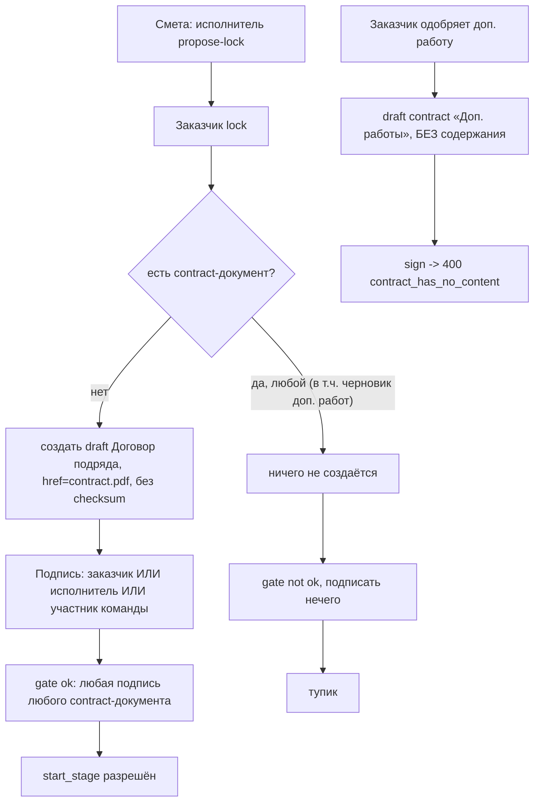

# Срез 05 — документы, договор, электронная подпись, клиентский портал, медиа

Дата аудита: 2026-09-30. Метод: чтение кода, запуск существующих тестов (114 тестов среза зелёные, 3 красных — см. раздел 6), временные in-process проверки через ASGI-клиент (скрипты вне репозитория, в коммит не попали). Продуктовый код не менялся. Живой backend не трогался.

Условные пометки: «проверено запуском» — воспроизведено in-process тестом; «проверено кодом» — следует из прочитанных строк, но не запускалось; «гипотеза» — не проверено.

Пути даны относительно `backend/` (`app/...`) и `apps/mobile/` (`m:`).

---

## 1. Инвентарь среза

### 1.1 Модели (`app/models/project_documents.py`)
| Сущность | Строки | Суть |
|---|---|---|
| `DocumentType` | :19-28 | acceptance_act, design_package, receipt, estimate, contract, invoice, warranty, upload, other. В БД тип хранится свободной строкой (`document_type: str`), enum нигде не валидируется на входе |
| `DocumentStatus` | :31-36 | draft, active, superseded, archived, deleted. `superseded` нигде не присваивается (мёртвое значение) |
| `ProjectDocument` | :39-68 | project_id, stage_id/payment_id/receipt_id/change_order_id (unique)/work_acceptance_id, type, title, status, current_version_id, legal_hold, retention_until |
| `DocumentVersion` | :71-90 | storage_key, href, mime, size, checksum_sha256, ocr_* поля. Версии не «заменяются»: прежние остаются, статус `superseded` не ставится |
| `DocumentSignature` | :93-108 | document_id, version_id, signer_user_id, signer_role, provider_name, provider_external_id, content_hash, status (submitting/pending/signed/failed), signed_at, revoked_at |

### 1.2 Эндпоинты
| Метод и путь | Файл:строка | Замечание |
|---|---|---|
| GET `/projects/{id}/documents` (единый индекс) | app/api/v1/documents.py:63-210 | склеивает canonical + design + acceptance + receipts + 7 «экспортных» строк |
| POST `/projects/{id}/documents` (метаданные) | documents.py:242-268 | любой href/storage_key/type |
| POST `/documents/{doc}/versions` | documents.py:271-293 | без проверки подписей |
| POST `/documents/upload` (multipart, 20 МБ) | documents.py:417-480 | + классификация «OCR» |
| POST `/documents/{doc}/sign` | **живой**: document_lifecycle.py:94-137 → document_lifecycle_service.py:155-200 → project_document_service.py:197-371 | старый обработчик documents.py:296-376 вырезан из роутера (router.py:85-91) |
| POST `/archive`, `/restore`, DELETE, POST `/legal-hold` | **живые**: document_lifecycle.py:140-273 → document_state_lifecycle_service.py | старые в documents.py:379-414, 483-542 — мёртвый код |
| GET/POST `/documents/{doc}/ocr` | documents.py:545-580 | «OCR» = эвристика по названию/имени файла |
| GET `/ocr/worker`, POST `/ocr/worker/tick` | app/api/v1/ocr_worker.py:15-45 | только админ; движка OCR нет |
| GET `/esign/providers`, GET `/esign/health` | app/api/v1/esign.py:217-250 | список провайдеров |
| POST `/esign/webhooks/kontur|goskey` | esign.py:253-278 | общий секрет в заголовке `X-Esign-Secret` |
| POST `/esign/dev/kontur/simulate` | esign.py:281-306 | без авторизации, только `development|test` |
| GET `/projects/{id}/contract-gate` | app/api/v1/projects.py:452-457 | статус гейта |
| GET `/projects/{id}/contract.pdf` | app/api/v1/export.py:87-150 | договор рисуется «на лету» из сметы |
| GET `/projects/{id}/stages/{s}/acceptance.pdf` | export.py:63-84 | акт «на лету» |
| GET `/projects/{id}/estimate.pdf|csv|xlsx`, `export.pdf`, `full-dossier.pdf`, `activity-dossier.pdf`, `kpi-weekly.pdf`, 1C/банк-экспорты | export.py:51-370 | все `require_project(write=False)` |
| GET `/projects/{id}/reports/daily|weekly|final(.pdf)` | app/api/v1/reports.py | read |
| POST `/media/upload-url`, GET `/media/presign/{key}`, GET `/media/{key}` | app/api/v1/media.py:55-144 | ACL по ключу |
| POST `/projects/{id}/portal-link`, `/viewers/{uid}/portal-link` | app/api/v1/portal.py:78-153 | выдача magic-link |
| POST `/auth/portal/session` | portal.py:33-75 | обмен ссылки на access JWT |
| GET `/portal/projects/{id}/snapshot` | portal.py:156-358 | сводка портала (нужен Bearer) |
| POST `/portal/projects/{id}/documents/{doc}/sign` | portal.py:548-616 | подпись по ссылке (scope `sign_document`) |
| POST `/portal/.../work-acceptances/{a}/accept|return` | **живые**: portal_acceptance_decisions.py; старые в portal.py:365-540 мёртвы | |
| POST `/portal/.../change-orders/{o}/approve|reject` | **живые**: portal_change_order_decisions.py; старые portal.py:759-811 мёртвы | |
| POST `/portal/.../work-schedules/{s}/confirm|reject`, `/estimate/lock|reject` | portal.py:640-751 | scope `accept_stage` |
| design-packages (список/создание/submit/approve/reject/diff) | app/api/v1/design_packages.py; app/services/design_package_service.py | согласование дизайна, файл — `file_key` |

### 1.3 Сервисы
- `project_document_service.py` — ядро: `create_document:101`, `add_version:153`, `sign_document:197`, `ensure_contract_draft:470`, `project_contract_gate:524`, `complete_external_signature:561`, `soft_delete_document:441`.
- `contract_document_service.py` — условия договора из сметы (`collect_terms`, `is_signable` — используется только для баннера в PDF, export.py:145).
- `document_lifecycle_service.py`, `document_state_lifecycle_service.py` — транзакция + outbox-эффекты (активность, уведомления).
- `esign/` — `in_app.py` (подписывает сразу, «mvp_stub»), `kontur.py` (реальный HTTP + вебхук), `goskey.py` (заглушка, всегда `available=False`), `external_stub.py` (неиспользуемая заглушка), `registry.py`, `runtime.py` (стартовая проверка).
- `esign_submission_service.py` — отправка внешней подписи из outbox.
- `document_ocr_service.py` / `document_ocr_worker.py` / `document_ocr_runtime.py` / `document_ocr_truth_repair.py` — классификация по метаданным; `document_ocr_runtime.py:15-25` запрещает режимы sync/async.
- `document_media_acl.py`, `storage_service.py` — ACL ключей и хранилище (S3/MinIO либо локальная папка).
- `portal_token_service.py` — stateless HMAC-токен.
- Связанные: `change_order_service.approve_with_sign_draft:239-330` (допработы → документ), `estimate_service.py:302` (фиксация сметы → черновик договора), `stage_mutation_service.py:395-405` и `stage_service.py:191` (гейт старта этапа), `project_service.py:502-540` (purge проекта).

### 1.4 Мобильные экраны
- Центр документов: `m:components/renova/DocumentsHub.tsx` (1065 строк), роут `m:app/documents.tsx`; API `m:lib/api/documents.ts`; метки `m:lib/documentCenterMeta.ts`; опрос подписи `m:lib/esignPoll.ts`.
- Портал по ссылке: `m:components/screens/PortalScreen.tsx` (роут `m:app/portal.tsx`), права `m:lib/domain/portalActions.ts`, API `m:lib/api/misc.ts:10-147`.
- Баннер «Перед началом работ»: `m:components/screens/stage/StageDetailHero.tsx:85-149`.
- Загрузка медиа: `m:lib/mediaUpload.ts` (используют `DesignPackageList.tsx`, `FloorPlanPanel.tsx`).
- Отдельных экранов «договор», «подпись», «акт» нет: всё через список документов и лист действий (`showActionConfirm`).

---

## 2. Матрица «кто что может»

Проверка доступа для документов сводится к одному предикату `require_project(..., write=True)` (app/api/deps.py:132-158) → `team_service.project_access_mode` (app/services/team_service.py:472-488). Ролевых проверок (customer/contractor) на подпись, архив, удаление, legal-hold, загрузку и версии нет.

| Действие | Заказчик (владелец) | Исполнитель-владелец | Бригадир/участник команды (не viewer) | Team viewer | Гость (project_viewer) | Технадзор | Админ |
|---|---|---|---|---|---|---|---|
| Список документов | да (deps.py:132 read) | да | да | да | да (read) | да (read-fallback deps.py:143-152) | нет отдельного |
| Скачать файл `/media/documents/...` | да | да | да | да | да | **нет** (404: document_media_acl.py:72-89 без fallback технадзора) — проверено кодом | нет |
| Создать документ/загрузить файл/версию | да | да | да | нет (read_only) | нет (404) | нет | нет |
| **Подписать любой документ (в т.ч. договор)** | да | **да** | **да** | нет | нет | нет | нет |
| Архив / восстановить | да | да | да | нет | нет | нет | нет |
| Удалить (soft) неподписанный | да | да | да | нет | нет | нет | нет |
| Legal hold вкл/выкл | да | да | да | нет | нет | нет | нет |
| «OCR» (смена типа) | да | да | да | нет | нет | нет | нет |
| Тик OCR-очереди | нет | нет | нет | нет | нет | нет | да (`require_admin_user`, ocr_worker.py:15) |
| Портал-ссылка для себя | да (portal.py:125-153) | **да, для customer_id, с любыми scope** (portal.py:139-153) | нет (403) | нет | нет | нет | нет |
| Портал-ссылка для гостя | да, только заказчик (portal.py:87-89) | нет | нет | нет | нет | нет | нет |
| Подписать по ссылке портала | по токену со scope `sign_document`, пользователь токена = customer (portal.py:575) | — | — | — | — | — | — |
| Принять/вернуть работы, согласовать доп. работы, зафиксировать смету по ссылке | scope `accept_stage`, только customer (portal_acceptance_decisions.py:31-48; portal.py:691-719) | — | — | — | — | — | — |
| Дизайн-пакет: submit | — | owner/foreman (design_package_service.py:37-46) | foreman | нет | нет | нет | нет |
| Дизайн-пакет: approve/reject | только customer_id (:42-49) | — | — | — | — | — | — |
| Вебхук провайдера подписи | без пользователя: секрет `X-Esign-Secret` (esign.py:52-61) | | | | | | |

Кто с кем связан при подписи: **никакой** привязки «подписанты договора = заказчик + исполнитель» нет. Гейт `project_contract_gate` (project_document_service.py:539-551) засчитывает первую любую подпись со статусом `signed` под любым документом типа `contract`.

---

## 3. Последовательности и состояния

### 3.1 Жизненный цикл документа

```mermaid
stateDiagram-v2
    [*] --> active: POST /documents, upload, версия
    [*] --> draft: фиксация сметы (ensure_contract_draft), одобрение доп. работы
    draft --> active: ПЕРВАЯ подпись любой стороны (in_app / вебхук signed)
    active --> active: новая версия (add_version, подписи НЕ сбрасываются)
    draft --> archived: archive
    active --> archived: archive
    archived --> active: restore (в UI кнопки нет)
    draft --> deleted: DELETE (пока нет подписей и legal_hold)
    active --> deleted: DELETE (пока нет подписей и legal_hold)
    archived --> deleted: DELETE
    deleted --> [*]: скрыт из списка; файл в хранилище остаётся
    note right of active: superseded не используется
```

Отказ/таймаут: у документа нет состояния «отклонён» или «истёк». Отказ от подписи в модели отсутствует.

### 3.2 Подпись (in-app и внешняя)
```mermaid
sequenceDiagram
    participant U as Подписант (любой writer)
    participant API as POST /documents/{id}/sign
    participant SVC as sign_document
    participant OB as outbox
    participant K as Контур.Сайн
    U->>API: provider=in_app|kontur
    API->>SVC: 404 если чужой; 409 если archived/deleted
    SVC->>SVC: нет версии -> document_has_no_version
    SVC->>SVC: провайдер недоступен -> 501 (kontur off) / goskey всегда 501
    SVC->>SVC: внешний без checksum -> external_signature_content_hash_required
    SVC->>SVC: contract без href/storage/checksum -> contract_has_no_content
    alt in_app
        SVC->>SVC: подпись signed сразу, content_hash = checksum версии (у договора None)
        SVC->>SVC: draft -> active
    else kontur
        SVC->>SVC: подпись submitting + outbox esign.submission, commit
        OB->>K: POST /signatures (Idempotency-Key)
        K-->>OB: accepted -> pending + signing_url
        K-->>API: вебхук signed / failed
    end
    SVC-->>U: signature, signing_url
    Note over U,K: отозвать/отменить подпись нельзя нигде; таймаута у pending нет
```

### 3.3 Договор → гейт начала работ


### 3.4 Клиентский портал
```mermaid
sequenceDiagram
    participant C as Заказчик или исполнитель
    participant API as portal-link
    participant G as Гость по ссылке
    participant S as /auth/portal/session
    participant P as /portal/... действия
    C->>API: allow_accept_stage, allow_pay (UI Хаба: всегда true)
    API-->>C: token (HMAC, 168 ч, без отзыва)
    C-->>G: ссылка /portal?token=...
    G->>S: token
    S-->>G: access JWT ПОЛЬЗОВАТЕЛЯ (customer), portal=true, без ограничения области
    G->>P: snapshot (Bearer)
    G->>P: sign/accept/... (в теле token; scope проверяется по токену)
    Note over S,P: любой API с этим JWT доступен как обычному заказчику
```

### 3.5 Дизайн-пакет
`published → (submit исполнитель) → pending → (approve|reject заказчик)`; `rejected → submit` снова (design_package_service.py:55-67).

---

## 4. Кнопки, функции и опции по экранам

### 4.1 Центр документов (`DocumentsHub.tsx`)
Индекс: pin «Нужно подписать» = все документы со статусом `draft` (:177-180, :832-860). Строка документа → `openIndexedDocument` (:604-751).

| Кнопка | Обработчик | API | Серверная проверка | Результат / ошибки |
|---|---|---|---|---|
| «+ Файл» → «Файл» / «Фото из галереи» | `uploadCanonicalDocument` :767-813 → `doUploadPicked` :753 | POST `/documents/upload` (document_type жёстко `upload`) | write-доступ; 20 МБ; тип из имени/заголовка | документ `active`, запускается «OCR»; офлайн → OFFLINE_UPLOAD_BLOCKED |
| «Открыть» | `openFile` :605-661 | GET href с Bearer (`previewProjectPdf`) | media ACL | без href: «Файл ещё не загружен» (для договора href есть — PDF рисуется) |
| «Подписать в приложении» | :678-686 | POST `/sign` `{provider:in_app}` | 3.2 | подпись; при ошибке — «Ошибка» с сырым кодом (DOC-016) |
| «Подписать через Контур» (только если провайдер доступен) | :687-721 | POST `/sign` `{provider:kontur}` + опрос 12×2 с (`esignPoll.ts`) | + checksum обязателен | для сгенерированного договора всегда 400 `external_signature_content_hash_required` (DOC-009) |
| «Распознать тип (OCR)» | :722-730 | POST `/ocr` `{apply_type:true}` | write | если уже есть suggestion — сразу меняет `document_type` без показа выбора (DOC-020) |
| «Legal hold / Снять» | :731-737 | POST `/legal-hold` | write | блокирует soft-delete; `retention_until` нигде не отправляется |
| «Архив» | :738-744 | POST `/archive` | write | **необратимо из UI**: кнопки восстановления нет |
| раздел, «К документам» | `documentSectionTarget` | навигация | — | |
| «Мой клиентский портал» / «Портал заказчику» | :274-287 | POST `/portal-link` с `allow_accept_stage:true, allow_pay:true` жёстко | заказчик или исполнитель | исполнитель получает ссылку с правами заказчика (DOC-002) |
| Экспорт PDF/CSV/XLSX/1С/банк/ICS/досье | :186-489 | GET export.* | `require_project(read)` | всем, включая гостя |

Нет в UI: удаление (DELETE), восстановление (restore), новая версия (`/versions`), просмотр списка подписей и их статусов, отмена подписи. Эти API есть в `documents.ts:164-182`, но без вызывающих экранов (проверено `grep`).
Все действия показываются всем ролям; гость получает 404 «document_or_project_not_found» как текст ошибки (DOC-017).

### 4.2 Портал (`PortalScreen.tsx`)
| Кнопка | Обработчик | API | Условие показа |
|---|---|---|---|
| «Принять этап» / «На доработку» | `acceptStage`/`returnStage` :334-403 | accept/return | scope `accept_stage` и customer |
| «Согласовать»/«Отклонить» доп. работу | :405-424 | change-orders | то же |
| «Зафиксировать смету»/«Отклонить» | :426-445 | estimate/lock, reject | есть proposal |
| «Согласовать график»/«Отклонить» | :631-671 | work-schedules | scope + customer |
| «Реквизиты / СБП», «Оплатить картой» | :447-546 | checkout ЮKassa | scope `pay` |
| «Подписать (in_app)», «Контур» | `signDocument` :548-593 | portal sign | scope `sign_document`; список = документы `draft` |
| «Поделиться статусом» | :315-332 | Share | всегда |
Документ на подпись показан **только названием** (:~850-885): ссылки/превью нет (DOC-010). Токен из URL при открытии обменивается на JWT, который сохраняется как глобальный токен приложения (`setAccessToken`, :265).

### 4.3 Остальное
- Баннер гейта (`StageDetailHero.tsx:85-149`) показывается исполнителю только при `!gate.ok`; если договора нет вовсе, гейт отвечает `ok:true`, но старт даёт 403 (DOC-008).
- `uploadMediaBlob` (`m:lib/mediaUpload.ts:9-16`): PUT на `upload_url` только если он не null.

---

## 5. Реестр дефектов

Серьёзности: P0 деньги/данные/безопасность; P1 не работает/тупик; P2 неудобство/рассинхрон; P3 косметика.

| ID | Сер. | Тип | Доказательство и воспроизведение | Кого затрагивает | Предложение | Верифицировано |
|---|---|---|---|---|---|---|
| DOC-001 | P0 | нет ACL | `portal.py:56-64` выдаёт полноценный access JWT пользователя; `deps.py:56-130` и `security.py:59-74` не читают claim `portal`. Запуск: ссылка `{}` (только чтение) → `/auth/portal/session` → JWT → POST `/projects/{id}/portal-link` c `allow_pay` = 200, GET `/viewers` = 200 | заказчик, гость (любой обладатель ссылки) | JWT портала с урезанной областью (`scope=portal_read`) и запретом на write-эндпоинты; либо не выдавать JWT, а проверять токен в каждом запросе | да (запуск) |
| DOC-002 | P0 | нет ACL | `portal.py:136-153`: исполнитель проекта создаёт токен на `customer_id` с `accept_stage`, `sign_document`, `pay`; портальные обработчики видят «пользователь токена = customer» (portal.py:575; portal_acceptance_decisions.py:47). UI Хаба делает это по умолчанию (`DocumentsHub.tsx:280-283`, `misc.ts:42-43`). Запуск: токен исполнителя → портальная подпись договора = 200 | заказчик (подделка согласия, приёмки, оплаты, фиксации сметы) | исполнителю отдавать ссылку только со scope `read`; write-scope выдавать лишь самому заказчику | да (запуск подписи; остальные scope — кодом) |
| DOC-003 | P0 | нет ACL / неверный статус | Гейт засчитывает любую подпись (`project_document_service.py:539-551`), подписать может любой writer (`document_lifecycle.py:22-32`). Запуск: сразу после фиксации сметы исполнитель подписывает «Договор подряда» → `contract-gate` `ok:true` | заказчик (работы стартуют без его подписи) | требовать подписи обеих сторон: customer_id и contractor_id (или team-owner) для версии; статус `partially_signed` | да (запуск) |
| DOC-004 | P0 | нет ACL | Любой `contract`-документ снимает гейт: `POST /documents` с `document_type=contract` и произвольным `href` (`documents.py:242-268`) или upload с `document_type=contract` (:417-466), подпись, `gate ok`, старт этапа 200. Дополнительно «OCR» переклассифицирует по имени файла (`document_ocr_service.py:139-141`). Запуск: probe G, F | заказчик | тип `contract` только системный (создание из сметы), валидация `document_type` по enum, запрет client-supplied `contract` | да (запуск) |
| DOC-005 | P0 | нечестные данные | Подпись привязана к `version_id`, но гейт версию не сверяет (`project_document_service.py:539-551`); `add_version` не проверяет подписи (:153-185). Запуск: подписанный договор → версия с `href=https://evil.example/other.pdf` → `gate ok`; архивный подписанный договор тоже удовлетворяет гейт | заказчик, исполнитель | запрет новой версии у подписанного документа (или сброс/помечание подписей `superseded`), гейт по актуальной версии и неархивному документу | да (запуск) |
| DOC-006 | P1 | тупик | `change_order_service.py:284-292` создаёт документ доп. работ типа `contract` без href/checksum; `project_document_service.py:267-268` запрещает подписывать такой договор. Запуск: одобрение → «Нужно подписать» в Хабе/портале (`portal.py:350-357`) → подпись 400 `contract_has_no_content`. Именно поэтому падают `test_portal_sign_draft_document` и `test_sign_in_app_via_registry` | заказчик, исполнитель | давать документу доп. работ содержимое (генерируемый PDF по `change_order_id`) либо не создавать «подписываемый» черновик | да (запуск) |
| DOC-007 | P1 | тупик | `ensure_contract_draft` (:470-503) при наличии любого `contract` (даже черновика допработ) ничего не создаёт. Запуск: допработа до фиксации сметы → фиксация возвращает `created:false`, основного договора нет; гейт `ok:false`, подписать нечего, `start` 403 «Подпишите договор» | заказчик, исполнитель | создавать основной договор безусловно, различать договор и допсоглашение (тип/флаг) | да (запуск) |
| DOC-008 | P1 | рассинхрон UI↔backend | `DELETE` неподписанного договора разрешён любому writer (`document_state_lifecycle_service.py:135-155`), пересоздать нельзя. Запуск: гейт `ok:true, reason:no_contract_required`, а `start` = 403 `contract_not_signed` с пустым `pending_titles` (`stage_mutation_service.py:395-405`); баннер (`StageDetailHero.tsx:85`) не показывается при `ok:true` | исполнитель, заказчик | запретить удаление системного договора; гейт и старт должны использовать один предикат; кнопка «Создать договор» | да (запуск) |
| DOC-009 | P1 | нечестные данные | Договор рисуется при каждом запросе (`export.py:87-150`), у версии нет checksum → подпись с `content_hash=None` (запуск: `meta_json` содержит `"content_hash": null`). Цена договора меняется после подписи (допработы входят в итог, `contract_document_service.py:130-147`). Kontur для этого договора невозможен: `external_signature_content_hash_required` (`project_document_service.py:254-256`, запуск проб) | заказчик, исполнитель | при создании фиксировать PDF в хранилище, считать sha256, подписывать хэш; допработы — отдельное допсоглашение | да (запуск) |
| DOC-010 | P1 | нет статуса «ждёт второй стороны» | Первая подпись переводит `draft→active` (`project_document_service.py:328-330`), а список «Нужно подписать» строится по `draft` (`DocumentsHub.tsx:177-180`; `portal.py:350-357`). Если сначала подписал исполнитель, у заказчика документ пропадает из списка | заказчик | вычислять «ждёт вашей подписи» по подписям (ожидаемые подписанты), а не по статусу | нет (по коду; вытекает из DOC-003) |
| DOC-011 | P1 | не работает | Локальный режим хранилища: `POST /media/upload-url` возвращает `upload_url:null` (проверено запуском), клиент пропускает PUT (`mediaUpload.ts:10-14`), возвращает ключ — файла нет, `GET /media/{key}` = 404. Затрагивает планировку и дизайн-пакеты | заказчик, исполнитель (dev/локально) | локальная ручка PUT с тем же ACL либо явная ошибка «хранилище не настроено» | да (бэкенд запуском, клиент кодом) |
| DOC-012 | P1 | не работает (окружение) | `docker-compose.yml:17` `S3_ENDPOINT=http://minio:9000`, `S3_PUBLIC_URL=""`; presign строится от внутреннего endpoint (`storage_service.py:250-282`), редирект `GET /media` (`media.py:119-126`) и PUT ведут на `minio:9000`, недоступный снаружи docker | все в compose-стенде | публичный endpoint для presign (`S3_PUBLIC_URL`/отдельный клиент) либо проксировать байты через API | нет (по коду и конфигу; MinIO не запускал) |
| DOC-013 | P1 | нечестные данные / потеря данных | `purge_project` удаляет `project_documents` со всеми подписями, блокируя только legal hold (`project_service.py:502-540`); исполнитель теряет подписанный договор без уведомления. Файлы не удаляются (в `storage_service.py` нет delete) и остаются читаемыми по ключу для участников проекта | исполнитель, заказчик (приватность) | блокировать purge проекта с подписанными документами; удалять байты при удалении; уведомлять контрагента | нет (по коду) |
| DOC-014 | P1 | тупик | Внешняя подпись: при отравленном outbox (8 попыток, `outbox_service.py:27`) запись остаётся `submitting`; повторная подпись возвращает её же (`project_document_service.py:270-294`), сервис мёртвых писем сигнатуры не трогает (нет ссылок в `outbox_dead_letter_service.py`). У `pending` нет таймаута; ручки отзыва/отмены подписи в API нет вообще | заказчик, исполнитель | статус `failed/expired` по таймеру и при dead-letter; ручка отмены; повторная отправка | нет (по коду) |
| DOC-015 | P1 | нечестные данные | Портальная подпись: заказчик подписывает документ, видя только название (`PortalScreen.tsx:~850-885`; в snapshot href есть, но не отрисован). Юридически значимое действие без просмотра | заказчик | ссылка «Открыть документ» с токеном портала (эндпоинт скачивания по токену) | нет (по коду) |
| DOC-016 | P2 | затык UX | Сырые коды в тексте ошибки: `contract_has_no_content`, `external_signature_content_hash_required`, `document_or_project_not_found` (`client.ts:39-47`; `DocumentsHub.tsx:526-536`; локализуются только `provider_unavailable`/501) | все | словарь кодов → русский текст | да (кодом клиента и сервера) |
| DOC-017 | P2 | затык UX / нет ACL в UI | Лист действий одинаков для всех ролей (`DocumentsHub.tsx:668-745`); гость и team-viewer видят «Подписать», «Архив», «Legal hold», получают 404. «Архив» необратим из UI (restore/delete/versions без экранов) | гость, исполнитель, заказчик | флаги возможностей в ответе списка, скрывать недоступное, экран «Архив» с восстановлением | да (кодом; grep вызовов) |
| DOC-018 | P2 | нечестные данные | В `lifecycle` уведомление и активность «Документ подписан» отправляются и для внешней подписи в состоянии `pending` (`document_lifecycle_service.py:105-200` без проверки `signature.status`), затем вебхук шлёт второе (`esign.py:99-140`) | заказчик, исполнитель | эффекты только при `signed` | нет (по коду) |
| DOC-019 | P2 | нет ACL | Подпись, архив, удаление и legal hold доступны любому участнику команды исполнителя (не viewer), в т.ч. member; сторонняя legal hold одной стороной блокирует удаление другой; `retention_until` нигде не применяется (мёртвое поле, `document_state_lifecycle_service.py:180-210`) | заказчик, исполнитель | роль-ограничения: подпись — только стороны договора; legal hold — по политике; либо убрать поле | да (кодом) |
| DOC-020 | P2 | нечестные данные | «Распознать тип (OCR)» = эвристика по названию/имени (`document_ocr_service.py:35-52`), кнопка отправляет `apply_type:true`, и при уже существующей подсказке тип меняется без подтверждения (`enqueue_and_run:158-171`), в т.ч. у подписанного договора (уйдёт из гейта). Чип «OCR: LOCAL» показывает честность, подпись действия — нет | заказчик, исполнитель | переименовать «Угадать тип по названию», показывать подсказку и подтверждение, блокировать смену типа подписанного | да (кодом) |
| DOC-021 | P2 | нет ACL / утечка | `GET /media` отдаёт авторизованные проектные медиа с `Cache-Control: public, max-age=86400, s-maxage=604800` (`media.py:128-133`) для всего кроме `documents/*`/чатов — общий кэш может раздать чужому | заказчик, исполнитель, гость | `private, no-store` для всего с ACL | нет (по коду) |
| DOC-022 | P2 | нет ACL | Токен портала: без отзыва, срок 168 ч, не учитывает `tokens_invalid_before` (`portal_token_service.py:16-56`), передаётся в URL; «выйти со всех устройств» ссылку не убивает; удаление гостя не отзывает сессионный JWT | заказчик | серверный реестр ссылок (jti) с отзывом и коротким TTL | нет (по коду) |
| DOC-023 | P2 | нет ACL / приватность | Снимок портала отдаёт гостю (read-only) реквизиты исполнителя, строки сметы, платежи (`portal.py:156-322`, `require_project(write=False)`) | заказчик/исполнитель (данные) | скрывать реквизиты и суммы от гостя, если это не задумано | нет (по коду, продуктовое решение) |
| DOC-024 | P2 | рассинхрон | Стартовый гейт не уведомляет заказчика: старый маршрут с уведомлением «Нужна подпись договора» вырезан (`stage_service.py:191-200` не используется), новый `stage_mutation_service.py:395-405` не шлёт ничего | заказчик | послать уведомление/активность из нового пути | да (кодом: нет notify в блоке) |
| DOC-025 | P2 | нечестные данные | Договор — сводка цен: нет срока, гарантии, ответственности, реквизитов, номера/даты, блока подписей; сумма «RUB»; `is_signable()` не применяется при подписи (`export.py:87-150`, `contract_document_service.py:85-90`) | заказчик, исполнитель | реальный шаблон договора, проверка `is_signable` в `sign_document` | да (кодом) |
| DOC-026 | P2 | нечестные данные | Акт `acceptance.pdf`: пункты чек-листа подставляются из query-параметра `checks` (произвольный текст, `export.py:63-84`); каноничный акт (`href` без параметра) чек-листа не содержит; текст транслитом («Priyomka», «Oplata») в отличие от договора | заказчик, исполнитель | брать чек-лист из `work_acceptance`, русский текст | да (кодом) |
| DOC-027 | P2 | тупик (доступ) | Технадзор видит список документов (read-fallback `deps.py:143-152`), но `GET /media/documents/...` вернёт 404: `assert_document_media_access` не знает о технадзоре (`document_media_acl.py:72-89`) | технадзор | тот же fallback в медиа-ACL | нет (по коду) |
| DOC-028 | P2 | нет валидации | Загрузка: `document_type` свободная строка; файл читается целиком в память до проверки размера (`documents.py:433-437`); MIME берётся из заголовка клиента; локальная выдача определяет тип по расширению имени — `.html` отдаётся как `text/html` (запуск: `Content-Type: text/html`). В S3-режиме тип нормализуется в octet-stream | все | потоковая проверка размера, magic-bytes, `Content-Disposition: attachment`, `nosniff` | да (запуск) |
| DOC-029 | P3 | гипотеза | `file_key` дизайн-пакета/планировки и `storage_key`/`href` документов принимаются от клиента без привязки к проекту; резолвер legacy-ключей берёт `limit(1)` из нескольких таблиц (`document_media_acl.py:137-175`) — теоретически ссылка на чужой ключ даёт доступ. Ключи — случайные uuid | все | проверять префикс ключа проекта при сохранении | нет (гипотеза) |
| DOC-030 | P3 | мёртвый код | `documents.py:296-414, 483-542` (старые sign/archive/restore/delete/legal-hold; ссылаются на несуществующие `proj.foreman_id`, `doc.kind`); `portal.py:365-540, 759-811`; `esign/external_stub.py`; `DocumentStatus.superseded`; ветка `mode == "async"` (`documents.py:473-477`, режим запрещён `document_ocr_runtime.py:15`); `ocr_worker_loop` | разработчики | удалить, убедившись, что `router.py:85-105` не завязан | да (кодом) |
| DOC-031 | P3 | косметика/нагрузка | `list_canonical_documents` делает 2 запроса на документ (`project_document_service.py:76-98`); в индекс всем всегда добавляются 7 «готовых» экспортных строк со статусом ready; `amount` всегда `None` | все | eager-загрузка; пометить экспорты отдельной секцией | да (кодом) |
| DOC-032 | P3 | безопасность (dev) | `/esign/dev/kontur/simulate` без авторизации в `development|test` (compose ставит `development`, `esign.py:281-306`); вебхук — статический секрет без HMAC тела и окна времени | стенды | ограничить localhost/флагом, HMAC + timestamp | нет (по коду) |
| DOC-033 | P3 | тесты | `test_sign_in_app_via_registry` и `test_portal_sign_draft_document` создают договор без содержимого (устарели после охранника `contract_has_no_content`, коммит 61332057), а `test_co_draft_document` закрепляет DOC-006 как норму. `test_esign_health_endpoint` без фикстуры БД: одиночный запуск — 500 «no such table: users» | разработчики | см. раздел 6 | да (запуск) |

---

## 6. Почему падают два теста (точно)

Причина одна: **устаревшие тесты относительно намеренно добавленного охранника, плюс вскрытый им реальный баг продукта (DOC-006).**

1. Коммит `61332057` добавил в `sign_document` (`project_document_service.py:258-268`) правило: документ типа `contract` без ссылки, файла и контрольной суммы (`_version_has_content`) не подписывается — `ValueError("contract_has_no_content")`. Правило проверяется после проверок провайдера.
2. `tests/test_esign_providers.py::test_sign_in_app_via_registry` создаёт `document_type="contract"` без `href`/`storage_key`/`checksum_sha256` → 400 по новому правилу. Соседние Kontur-тесты в том же файле уже обновлены (передают `checksum_sha256`), этот — нет. Правка теста: добавить `href=` или `checksum_sha256=`.
3. `tests/test_portal_sign.py::test_portal_sign_draft_document` создаёт «Доп. работы: тест» типа `contract` без содержимого → портальная ручка отвечает 400 `contract_has_no_content` (`portal.py:594`). Точно такой же документ создаёт боевой код одобрения допработ (`change_order_service.py:284-292`), поэтому это не только тест: в продукте подпись документа допработ невозможна (проверено запуском, probe D).
4. Отдельно `test_esign_health_endpoint` падает при запуске файла: в нём нет фикстуры БД (`POST /auth/demo` → «no such table: users»); в полном прогоне проходит только благодаря БД, инициализированной предыдущими тестами.

Вердикт: тесты устарели (нужно обновить содержимое), но охранник верный; исправлять надо продукт (DOC-006), иначе «зелёный» тест скроет тупик.

---

## 7. Что проверено запуском, а что нет

Запущено (in-process, SQLite, скрипты вне репозитория): DOC-001, 002 (подпись), 003, 004, 005, 006, 007, 008, 009, 011 (бэкенд), 028; тесты среза: 114 passed.
Не запускалось: MinIO/S3 (DOC-012), внешний Контур в реальном режиме (DOC-014), purge (DOC-013), кэш-заголовки в S3-режиме, UI на устройстве, гость/технадзор (по коду ACL).
Существующие тесты среза, зелёные и полезные как регрессия: `test_contract_gate*.py`, `test_document_lifecycle_atomicity.py`, `test_document_media_acl.py`, `test_esign_*`, `test_portal_*`, `test_project_media_acl.py`, `test_storage_integrity.py`.
