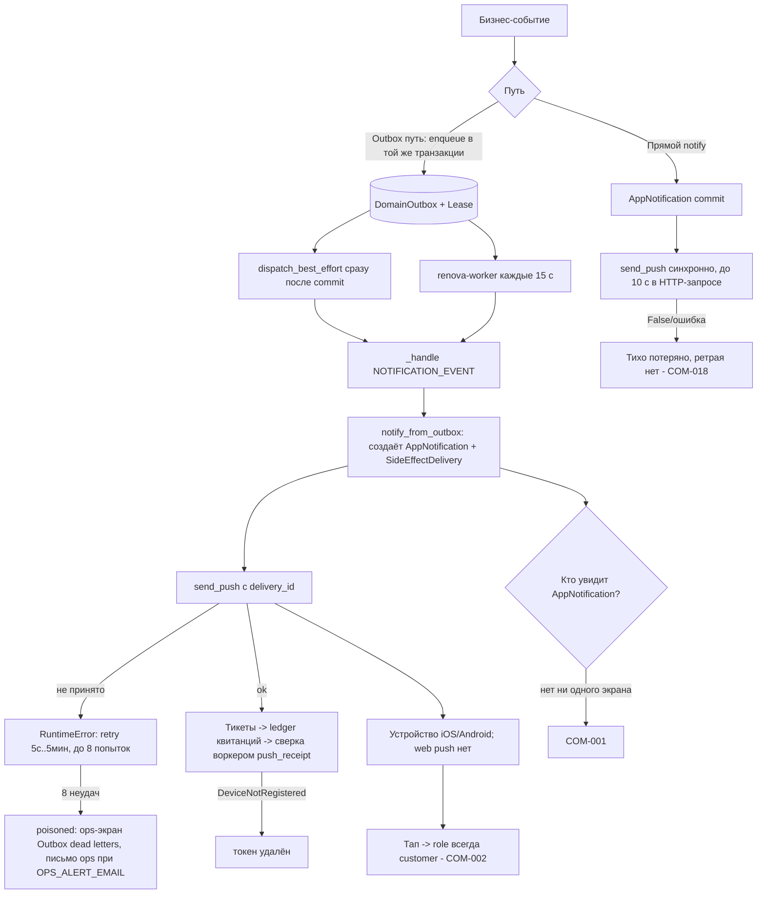
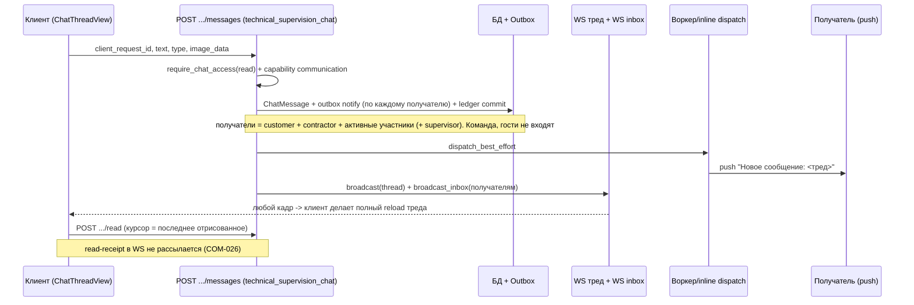
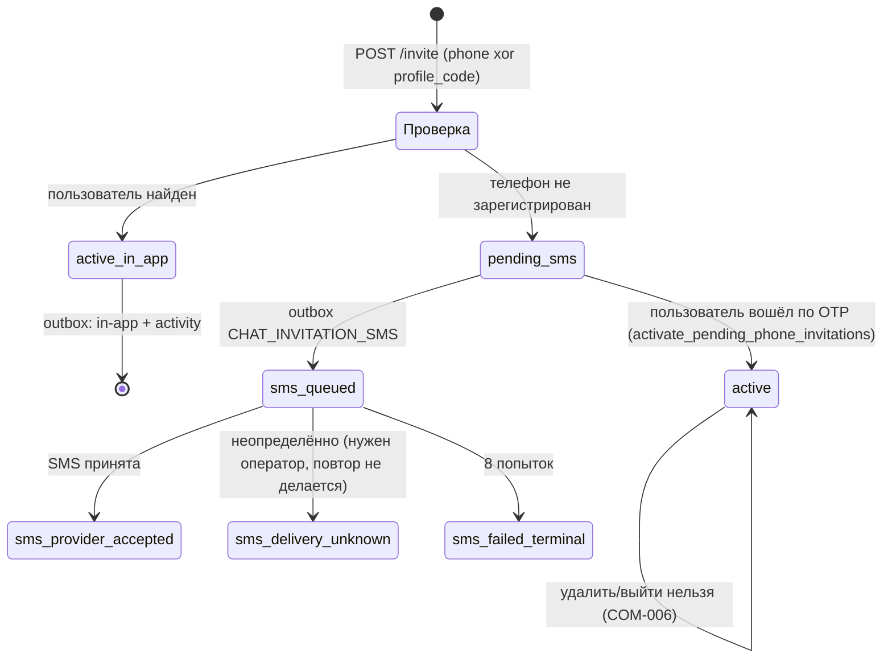
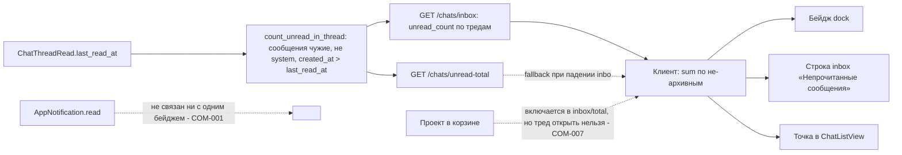

# Срез 06 — Коммуникации: чаты, входящие, уведомления, push, WebSocket, лента активности

Дата аудита: 2026-09-30. Метод: чтение кода, запуск существующих тестов (121 passed, 3 skipped: chat/notification/outbox/push/ws-наборы), временные in-process пробы pytest (SQLite in-memory, вне репозитория), запуск TS-функций маршрутизации через `tsx`, единичные GET к живому backend (один запрос `GET /api/v1/media/chat-media/...` без токена -> 401). Продуктовый код не менялся.

Легенда «ВЕРИФИЦИРОВАНО»: **да** = воспроизведено пробой/тестом/запуском функции; **по коду** = однозначно следует из прочитанного кода, но не запускалось; **нет (гипотеза)** = не проверено.

---

## 0. Главные выводы за 30 секунд

1. **In-app уведомления никто не видит.** Таблица `AppNotification` наполняется, но ни один экран мобильного приложения её не читает (`NotificationCenter`, `NotificationGroups` — мёртвый код). Реальный канал доставки только Expo-push на нативных iOS/Android. На web (Expo web) уведомлений нет вообще, кроме «Входящих», которые строятся из состояния проекта, а не из уведомлений (COM-001).
2. **Тап по push всегда трактуется как роль customer.** В payload push нет `role`, клиент подставляет `customer` (COM-002). Подрядчик, тапнув «Исправлено/Закрыто», «Просрочка», «График» и т. п., попадает во вкладки заказчика.
3. **Команда подрядчика (TeamMember), технадзор, гости не получают уведомлений** и не видят чаты в «Сообщениях»; получатели везде — только `customer_id`/`contractor_id` (COM-005).
4. **Фото в чате не отображаются** (RN `Image` без Authorization, media-эндпоинт даёт 401), **PDF/видео из чата дают 500** (COM-003/004).
5. Есть события без уведомления там, где кто-то ждёт реакции (назначение подрядчика, добавление участника, календарь, нет напоминаний по неоплаченным счетам/неподтверждённым приёмкам) (COM-021).

---

## 1. Инвентарь среза

### 1.1 Backend — REST

| Компонент | Файл:строка | Что делает |
|---|---|---|
| Чаты проекта | `backend/app/api/v1/chats.py` | список/создание/чтение треда, read-курсор, реакции, pin, confirm, задача, счёт, инвайт, PDF, поиск |
| — `GET /projects/{id}/chats` | chats.py:148 | список тредов проекта (`require_project` read) |
| — `POST /projects/{id}/chats` | chats.py:157 | создать тред (`write=True`, идемпотентно по `client_request_id`) |
| — `GET .../chats/unread-count` | chats.py:175 | непрочитанные по проекту |
| — `GET .../chats/search` | chats.py:182 | ILIKE-поиск по сообщениям (limit 30) |
| — `GET .../chats/{thread}.pdf` | chats.py:190 | экспорт треда в PDF |
| — `PATCH .../state` | chats.py:209 | pin/archive треда (персонально, `ChatThreadRead`) |
| — `POST .../read` | chats.py:217 | продвинуть курсор прочтения (монотонный upsert) |
| — `GET .../{thread}` | chats.py:242 | весь тред + участники + capabilities (без пагинации) |
| — `GET .../participants` | chats.py:265 | список участников |
| — `POST .../invite` | chats.py:273 | пригласить по телефону/коду профиля |
| — `POST .../messages` | chats.py:298 (**заменён**) | заменяется маршрутом технадзора при сборке роутера: `api/v1/router.py:146-149` |
| — `POST .../messages` (реальный) | `technical_supervision_chat.py:17` | отправка сообщения (`send_client_message`) |
| — `POST .../messages/{id}/confirm` | chats.py:327 | «подтвердить» (для `payment` — только открыть карточку) |
| — `POST .../messages/{id}/react` | chats.py:362 | тоггл реакции (идемпотентно) |
| — `POST .../messages/{id}/pin` | chats.py:382 | закрепить (одно закреплённое на тред) |
| — `POST .../messages/{id}/task` | chats.py:402 | создать WorkOrder из сообщения |
| — `POST .../invoice` | chats.py:417 | создать Payment из чата (только contractor) |
| Инбокс чатов | `chat_inbox.py:34,47` | `GET /chats/inbox`, `GET /chats/unread-total` |
| Уведомления | `notifications.py:13-98` | unread-count, список, mark-all-read, snooze, snooze-until, read, reaction-digest, approval-digest, waste-reminders/check |
| Push | `push.py:23` | `POST /push/register` (единственная ручка; отвязки нет) |
| WS | `ws.py:63,87` | `/ws/chats/{thread}`, `/ws/inbox/{user}`; билет `POST /auth/ws-ticket` (`auth.py:94`) |
| Лента активности | `activity.py:10` | `GET /projects/{id}/activity` (limit 50) |
| Аудит | `audit.py:12` | `GET /audit/logs` (только admin, последние 100) |
| Weekly digest | `export.py:373,389` | превью и ручной push-дайджест (POST, write) |
| Outbox DLQ (ops) | `admin_outbox_dead_letters.py:44-130` | список/claim/release/replay/history |

### 1.2 Backend — сервисы

| Сервис | Файл:строка | Роль |
|---|---|---|
| chat_service | `services/chat_service.py` | треды, read-state (`:85-150`), инбокс (`:174-208`), legacy `send_message` (`:312`), участники (`:633`), инвайт (`:825`), задача/счёт из чата (`:950`,`:1036`) |
| chat_message_mutation | `services/chat_message_mutation.py:88` | атомарная идемпотентная отправка + outbox-уведомления |
| chat_acl / chat_media_acl | `services/chat_acl.py:14`, `chat_media_acl.py:99` | ACL треда (проект либо exact-thread участник) и медиа-ключей |
| chat_participant_service | `services/chat_participant_service.py` | активация pending-инвайтов при OTP-логине (`otp_login_service.py:61`), thread-only инбокс |
| chat_invitation_delivery | `services/chat_invitation_delivery.py` | SMS-инвайт через outbox с fence «не повторять неопределённую отправку» |
| notification_service | `services/notification_service.py:44,103` | `notify` (прямой: commit + синхронный push), `notify_from_outbox` (ретраибельный) |
| push_service / push_receipt_* | `services/push_service.py:81`, `push_receipt_service.py`, `push_receipt_worker.py` | Expo Push API, разбор тикетов, чистка мёртвых токенов, сверка квитанций |
| outbox_service | `services/outbox_service.py` | `enqueue/enqueue_once`, `dispatch_pending` (lease 2 мин, 8 попыток, backoff 5с..5мин) `:327`, `_handle` `:624`, разворот приёмки `:480` |
| outbox_worker / worker_main | `services/outbox_worker.py`, `app/worker_main.py:94` | отдельный процесс `renova-worker`: outbox 15с, reminders 15 мин, push receipts 60с |
| outbox_inline_dispatch | `services/outbox_inline_dispatch.py:14` | «ускорение» — доставка сразу после commit |
| automation_engine / reminders | `services/automation_engine.py`, `automation_reminders_worker.py`, `automation_reminder_outbox.py` | реакции на события + плановые напоминания (просрочка этапа, материалы, вывоз мусора) |
| activity_service | `services/activity_service.py:71,152,238` | журнал событий проекта + триггер automation |
| email_service / email_stub | `services/email_service.py:93` | SMTP; **используется только для ops-алертов и в одном сломанном месте** (COM-008, COM-030) |
| ws_redis_bridge / ws_ticket_service | `services/ws_redis_bridge.py`, `ws_ticket_service.py` | fan-out между инстансами; 120-секундные stateless-билеты |

### 1.3 Модели
`ChatThread`, `ChatMessage` (типы: text/photo/file/confirm/system/task/invoice/payment — `entities.py:294`), `ChatThreadRead` (read-курсор, pin, archive), `ChatThreadParticipant` (`:443`), `AppNotification` (`:385`), `PushToken` (`:407`), `DomainOutbox`+`DomainOutboxLease`+`SideEffectDelivery` (`models/outbox_runtime.py`), `ActivityEvent`, `AuditLog`.

### 1.4 Мобильное приложение

| Экран/модуль | Файл | Назначение |
|---|---|---|
| Вкладка «Сообщения» | `app/(customer\|contractor)/(tabs)/chat.tsx` -> `components/renova/chat/ChatListView.tsx` | список тредов, фильтр объектов, архив, pin, создание |
| Экран треда | `app/chat/[threadId].tsx`, `components/renova/chat/ChatThreadView.tsx` | сообщения, реакции, pin, задача, счёт, инвайт, PDF |
| Создание чата | `CreateChatSheet.tsx`, `lib/createProjectChat.ts` | тред + инвайты |
| Задача из чата | `ChatTaskSheet.tsx` | название/срок/ответственный |
| Единый inbox | `lib/inboxSyncStore.ts`, `lib/useChatUnread.ts`, `app/inbox.tsx`, `lib/domain/buildInboxItems.ts` | бейдж = задачи (из состояния проекта) + непрочитанные чаты |
| WS | `lib/useChatWebSocket.ts` (тред), `inboxSyncStore.ts:506` (inbox), `lib/wsAuthQuery.ts` | билет -> сокет |
| Deep-link | `lib/pushLinks.ts`, `lib/legacyRoutes.ts`, `lib/pushOsNav.ts`, `lib/nativeNotifications.ts`, `app/_layout.tsx:36-50` | нормализация ссылок, тап по push |
| Лента | `components/renova/ActivityFeed.tsx`, `app/activity.tsx` | архив действий |
| **Мёртвое** | `components/renova/NotificationCenter.tsx`, `NotificationGroups.tsx`, `SnoozeUntilPicker.tsx`, `lib/useInboxWebSocket.ts`, API-методы `listNotifications/unreadNotifications/approvalDigest/reactionDigest*` | нигде не подключены |

---

## 2. Матрица «кто что может»

Обозначения: Д = да, — = нет, ч = частично. Роли: **Заказчик** (владелец), **Подрядчик** (владелец-исполнитель), **Команда** (TeamMember роль member/foreman), **Команда-viewer**, **Гость** (`ProjectViewer`), **Технадзор** (активное назначение), **Приглашённый** (exact-thread участник), **Admin**.

| Действие | Заказч. | Подряд. | Команда | Команда-viewer | Гость | Технадзор | Приглашённый | Проверка доступа |
|---|---|---|---|---|---|---|---|---|
| Видеть треды проекта (HTTP) | Д | Д | Д | Д | Д (!) | Д | только свой тред | `require_project(read)` chats.py:151; ACL `chat_acl.py:36` |
| Видеть треды в «Сообщения» (`/chats/inbox`) | Д | Д | **—** | **—** | **—** | **—** | Д (thread-only) | `chat_inbox.py:15-19` (только customer_id/contractor_id) |
| Создать тред | Д | Д | Д | — | — | — | — | `require_project(write)` chats.py:160 |
| Отправить сообщение | Д | Д | Д | — | — | Д (text/photo/file) | Д | `technical_supervision_chat.py:28-47`; `supervision.require_capability("communication")` `technical_supervision_service.py:436` |
| Пометить прочитанным | Д | Д | Д | Д | Д | Д | Д | `require_chat_access(write=False, allow_participant)` chats.py:220 |
| Поставить реакцию | Д | Д | Д | Д | **Д (!)** | Д | Д | chats.py:365 (`write=False`) — COM-014 |
| Закрепить сообщение / подтвердить | Д | Д | Д | — | — | — | — | `write=True` без participant chats.py:385,331 |
| Создать задачу из сообщения | Д | Д | Д | — | — | — | — | chats.py:405; `can_create_task` chats.py:85 |
| Счёт из чата | — | Д | — (403 по роли) | — | — | — | — | роль `contractor` chats.py:420; UI `can_create_invoice` chats.py:86 |
| Пригласить в тред | Д | Д | Д | — | — | — | — | `write=True` chats.py:276 |
| Убрать участника / выйти из треда | **нет ручки ни у кого** | | | | | | | COM-006 |
| Изменить/удалить сообщение, удалить/переименовать тред | **нет ручек** | | | | | | | COM-006 |
| PDF экспорт | Д | Д | Д | Д | Д | Д | Д | `allow_participant=True` chats.py:194 |
| Читать медиа чата | Д | Д | Д | Д | Д | Д | Д | `assert_chat_media_access` `chat_media_acl.py:99` (403->404) |
| Подключиться к WS треда | Д | Д | Д | Д | Д | **— (4403)** | Д | `ws.py:36-51` (`project_access_mode != none`; супервизор = `none`) |
| Слать кадры в WS треда | любой подключённый, без проверки прав записи | | | | | | | ws.py:76-83 — COM-013 |
| Читать in-app уведомления (API) | Д | Д | Д | Д | Д | Д | Д | `get_current_user` notifications.py; **UI отсутствует** |
| Лента активности | Д | Д | Д | Д | Д | Д | — | `require_project(read)` activity.py:11 |
| Запустить `waste-reminders/check` | **любой авторизованный** | | | | | | | notifications.py:91 — COM-022 |
| Аудит-лог | — | — | — | — | — | — | — | admin: `require_admin_user` audit.py:14 |

Получатели уведомлений по событиям — см. §3.4.

---

## 3. Последовательности и состояния

### 3.1 Конвейер уведомления: событие -> доставка

Что происходит при сбоях:
- Outbox-путь: in-app запись создаётся при первой попытке; при падении push повторяется (collapseId/`delivery_id` подавляют дубли); после 8 попыток push потерян, запись в БД остаётся (но её никто не читает).
- Прямой `notify`: одна попытка, результат `send_push` игнорируется (`notification_service.py:92`).
- Воркер — отдельный процесс (`main.py` не запускает outbox-цикл, см. `main.py:223` `background_runtime: renova-worker`). Без воркера выполняются только «ускоренные» строки (`dispatch_best_effort` вызывается в большинстве сервисов), а всё остальное (напоминания, ретраи) стоит.

### 3.2 Отправка сообщения в чат

Отказ/оффлайн: `sendChatMessage` ставит запрос в offline-очередь только при «неопределённой» ошибке (`isAmbiguousWriteFailure`) с тем же `client_request_id`; отказ сервера (4xx) — Alert «Не удалось отправить». Реплей безопасен (ledger).

### 3.3 Приглашение в тред (состояния участника)

### 3.4 Карта событий -> уведомления (кто -> кому -> канал)

Каналы: **in-app** = запись `AppNotification` (UI отсутствует, COM-001), **push** = Expo (только native), **WS** = inbox-кадр (только чат), **e-mail** = не используется пользователям, **SMS** = только инвайт в чат и OTP. Тип пути: **O** = outbox (ретрай), **D** = прямой `notify` (без ретрая).

| Событие | Источник (файл:строка) | Получатели | Путь | Ссылка / замечания |
|---|---|---|---|---|
| Новое сообщение в чате | `chat_message_mutation.py:67-70` | customer, contractor, активные участники (+supervisor), кроме автора | O + WS inbox + WS thread | `/chat/{id}`; команда/гости не получают (COM-005) |
| Сообщение «Задача»/«Счёт» из чата | `chat_service.py:367` (`send_message`) | customer, contractor, участники | D + WS | не идемпотентно по уведомлению, без разархивации (COM-034) |
| Приглашение в тред | `chat_service.py:879` | приглашённый (если зарегистрирован) | O | SMS если нет аккаунта |
| Новый счёт (payment created) | `client_write_side_effects.py:28` / `payments.py:244` | customer | O / D | `/(customer)/(tabs)/budget?tab=payments` |
| Подтверждение/отклонение платежа, оплата | `payments.py:355-362`, `payment_service.py:187`, `export.py:808-819` | customer+contractor (кроме актёра) | D / O | ссылки по роли — верные |
| Спор/возврат платежа | `payment_dispute_service.py:117-180`, `payment_reversal_service.py:82-100` | обе стороны | O | тип `other`, ссылки по роли |
| Банковская выписка/расходы | `bank_statement_integrity.py:249-362`, `expense_integrity_service.py:191-239` | customer (+contractor) | O | |
| Чек добавлен/удалён | `receipts.py:267-547`, `receipt_integrity_service.py:175` | customer (activity) | — | в основном только activity |
| Этап на приёмке | `stage_service.py:168` | customer | D | `/stage/{id}` |
| Этап принят/акт/след. этап (основной путь) | `outbox_service.py:480-610` | customer, contractor | O | `return_to` всегда customer (COM-020) |
| То же (портал) | `accept_orchestrator.py:207-219` | customer, contractor | D | + дубль «Можно оплатить этап» (COM-019) |
| Возврат на доработку | `project_service.py:355`, `portal.py:537`, `work_acceptance_side_effects.py:42-110` | contractor / оба | D / O | SLA 3 дня |
| SLA доработки | `rework_sla.py:51` | contractor | O | **только ручной POST /rework-sla/check** (COM-021) |
| Просрочка этапа (daily) | `automation_engine.py:306` | contractor | O (worker) | customer не оповещается |
| Закупить материалы (daily) | `automation_engine.py:331` | customer | O (worker) | |
| Вывоз мусора завтра | `automation_reminders_worker.py:303` | customer | O (worker) | contractor не оповещается |
| Материалы: заказ/доставка | `purchase_service.py:252`, `purchases.py:63` | customer+contractor | O/D | **ссылка группы customer уходит contractor** (COM-020) |
| Подбор/согласование материала, источник | `material_pick_service.py:357-410`, `materials.py:170-373`, `selections.py:234` | customer / contractor | O/D | `/approvals` |
| Смета на согласование/согласована/правка | `estimate_service.py:248,312,365` | customer / contractor | D | |
| Change order | `change_order_service.py:113-225` | customer / contractor | O | |
| Комнаты: создание/изменение/запрос | `room_mutation_service.py:129-165`, `room_change_service.py:151-258` | customer / contractor | O | |
| График работ: на согласование/согласован/отклонён | `project_work_schedule_service.py:499-697` | customer / contractor | O | |
| Технадзор: график/замечание/график возвращён | `technical_supervision_action_service.py:107-203`, `technical_supervision_service.py:157-184` | customer, contractor | O | ссылки без role (`/object`,`/calendar`,`/control`) |
| Замечание создано/исправлено/закрыто/спор | `client_write_side_effects.py:64-68`, `os.py:177-239`, `issue_service.py:404-425` | customer/contractor | O/D | `/control` |
| Гарантия | `export.py:504`, `client_write_side_effects.py:82` | другая сторона | D/O | |
| Документы/эскроу подпись/архив | `documents.py:344-409`, `esign.py:123-138`, `document_lifecycle_service.py`, `document_state_lifecycle_service.py`, `estimate_service.py:312` | обе стороны | D/O | `/documents` |
| Design package | `design_package_service.py:175-245` | customer / contractor | O | `/design` |
| Work order: смена статуса | `_work_order_service_core.py:689-704`, `work_order_service.py:231-246` | customer+contractor (кроме актёра) | O | **исполнитель-член команды не оповещается** |
| Work order: создание, смена assignee | `_work_order_service_core.py:312` | только activity | — | назначенный не оповещается (COM-015) |
| Team invite/join | `team_service.py:301`, `team_invite_join_service.py:67` | владелец/приглашённый | O | тип `chat_message` (!) `/(contractor)/(tabs)/profile` |
| Реакция на комментарий этапа | `stage_reactions.py:49` | автор комментария | D | тип `reaction` |
| Превышение бюджета комнаты | `analytics.py:66` | customer | D в **GET** | падает AttributeError (COM-008) |
| Еженедельный digest | `export.py:389-413` | customer, contractor, инициатор | D | только ручной POST, планировщика нет |
| Отчёт worker/outbox degraded | `automation_reminders_worker.py:167,229` | ops e-mail | e-mail | единственный реальный e-mail-канал |
| **Нет уведомления** | — | — | — | назначение/смена подрядчика (`projects.py:369,404`, `project_assignment_service.py:43`), lead-конвертация (`marketplace_conversion_service.py:25`), участники проекта (`project_participant_service.py`), grant viewer (`project_viewer_service.py:34`), календарные события (`calendar_mutation_service.py`), «оплата не подтверждена N дней», «приёмка ждёт N дней» — COM-021 |

Типы: `technical_supervision` и `schedule_confirmed` при сохранении приводятся к `other`/`approval` (`notification_service.py:16-31`).

### 3.5 Счётчики непрочитанного

Три поверхности (dock, строка inbox, точка) питаются одним `chatCount` в `inboxSyncStore.ts` — рассинхрона между ними нет. Рассинхрон есть между сервером и реальностью (корзина, COM-007) и у неиспользуемого `notifications/unread-count` (cap 50, COM-009).

### 3.6 WebSocket и переподключение

- Клиент: `POST /auth/ws-ticket` (JWT в заголовке) -> `?ticket=` (JWT-билет 120 с, многоразовый до истечения, `ws_ticket_service.py`) -> сокет. Авторизация проверяется **только при подключении** (`ws.py:36-51`); отзыв доступа не разрывает сокет (COM-042).
- Тред: любое входящее событие -> `reload()` полной истории (payload игнорируется, кроме `typing`). Пока WS не подключён — опрос 15 с (`ChatThreadView.tsx:387`). При переподключении догрузки нет (COM-025).
- Inbox: один сокет на пользователя (ref-count), события `type:"inbox"` -> trailing-reload (debounce 180 мс/макс 900 мс) + опрос 60 с (WS) / 25 с (без WS). При `onopen` — принудительный flush (догрузка есть).
- Событий «уведомление создано», «платёж оплачен», «приёмка» по WS нет — только сообщения чата.
- Multi-instance: Redis pub/sub fan-out при `REDIS_URL`; при недоступности Redis публикация молча пропускается (`ws.py:107-121`), доставка только локальным подписчикам.

---

## 4. Кнопки, функции и опции по экранам

### 4.1 Список чатов (ChatListView)
| Элемент | Обработчик | API | Серверная проверка | Результат / ошибки |
|---|---|---|---|---|
| Открыть тред | `openThread` `ChatListView.tsx` (~:186) | `loadProject` + nav | — | нет `project_id` -> Alert |
| Долгое нажатие: Закрепить/Архив | `threadActions` | `PATCH /chats/{t}/state` | `require_chat_access(read, participant)` | оффлайн -> очередь; ошибка молча |
| Фильтр объектов, Архив/Активные | локальные | `GET /chats/inbox` | `_user_projects` | команда/технадзор/гость получают пустой список (COM-005) |
| «+ Новый чат» | `CreateChatSheet` | `POST /projects/{p}/chats` + `/invite` | `write=True` | дубль по названию открывает существующий; нет объекта -> gate |
| Бейдж | `useChatUnread` | `/chats/inbox`, fallback `/chats/unread-total` | | точка вместо числа (цифра только в dock) |

### 4.2 Тред (ChatThreadView)
| Кнопка/жест | Обработчик | API | Серверная проверка | Замечания |
|---|---|---|---|---|
| Отправить | `sendText` (`:451`) | `POST .../messages` | capability `communication`; reply target в треде | reply-цитата дублируется в тексте `↩ ...` |
| 📷 Фото / 📎 Файл | `launchImageLibraryAsync` | то же, `image_data` base64 | `_decode_image`: только jpeg/png/webp ≤10 МБ | PDF/видео -> `ValueError` -> 500 (COM-004); фото после отправки не грузится (COM-003) |
| ✓? «Прошу подтвердить» (contractor) | `sendText(...,'confirm')` | messages | тип разрешён | подтверждение ни к чему не привязано (COM-010) |
| «Подтвердить» на confirm-сообщении | `confirmChatMessage` | `POST .../confirm` | `write=True` | видна и автору; без уведомления/WS (COM-010) |
| «Перейти к оплате» | `openPaymentFlow` | навигация в бюджет | клиент: `can_view_project_actions` | не пропадает после оплаты (COM-011) |
| 💳 Счёт (contractor) | `createInvoice` | `POST .../invoice` | роль contractor; `can_create_invoice` | суммы 5/10/25 тыс. без привязки к этапу; заказчик получает 2 push (COM-019) |
| Создать задачу | `ChatTaskSheet` -> `taskFromChatMessage` | `POST .../task` | `write=True` | assignee не валидируется; picker берёт `getTeam(current user)` — у заказчика пуст (COM-015) |
| Реакции (long-press/иконка) | `reactChatMessage` | `POST .../react` | `write=False` (доступно гостю, COM-014) | идемпотентно, WS `reaction` |
| Закрепить сообщение | `pinChatMessage` | `POST .../pin` | `write=True` | без WS |
| + Участник | invite modal | `POST .../invite` | `write=True` | результат доставки честный (`delivery_status`) |
| Настройки | модал | — | — | участники без контактов для не-владельцев |
| Документ (PDF) | `exportChatPdf` | `GET .../{t}.pdf` | ACL | на native: `URL.createObjectURL`/`document` недоступны — вероятный отказ (COM-031, гипотеза) |
| Закрепить чат | `patchChatState` | `PATCH .../state` | | |
| Поиск в треде | `ChatInThreadSearch` | локальный | | серверный `/chats/search` без id сообщения (COM-037) |
| Ввод текста | `wsSend({type:'typing'})` на каждый символ | WS | нет троттлинга | COM-013 |

### 4.3 Уведомления/лента
- **Экрана уведомлений нет.** `ProfileNotifications` — только кнопка «Открыть входящие». Inbox (`/inbox`) — задачи из состояния (платежи, согласования, приёмки, график, замечания, материалы и т. д.), а не `AppNotification`.
- `ActivityFeed` (`app/activity.tsx`): фильтр «Все/Материалы/Согласования/Комнаты» = точное совпадение `kind` (COM-032); клик -> `pushOsNav(link_path, back, role)`.

### 4.4 Тап по push (`app/_layout.tsx:36-50`, `nativeNotifications.ts:43-51`)
`data.link_path`/`returnTo` из payload -> `resolvePushLink(link, returnTo, role='customer')`. **Роль берётся из `data.role`, которого сервер не присылает** (`notification_service.py:96,151`).

---

## 5. РЕЕСТР ДЕФЕКТОВ

Серьёзность: P0 деньги/данные/безопасность; P1 функция не работает/тупик; P2 неудобство/рассинхрон; P3 косметика.

| ID | Сер. | Тип | Доказательство (file:line + как воспроизвести) | Кого затрагивает | Предложение | Верифицировано |
|---|---|---|---|---|---|---|
| COM-001 | P1 | тупик / мёртвый код | `AppNotification` пишется (`notification_service.py:78-90`), но ни один экран его не читает: `NotificationCenter.tsx`, `NotificationGroups.tsx` не импортируются нигде (`grep`), `ProfileNotifications.tsx:3` явно «без NotificationCenter». API `listNotifications/unreadNotifications/approvalDigest/markAllNotifications/snooze*` вызываются только из мёртвого компонента. Push только на native (`nativeNotifications.ts:36`). Поэтому на web и при отклонённом разрешении на push, а также после исчерпания 8 ретраев outbox пользователь **вообще не узнаёт** о событии (кроме производных строк inbox). | все роли | Подключить экран «Уведомления» (список + бейдж + mark-read) к `/notifications`; либо удалить таблицу и снять мёртвые ручки | да (grep + чтение) |
| COM-002 | P1 | рассинхрон UI↔backend / неверный маршрут | `nativeNotifications.ts:48` `role: data?.role === 'contractor' ? 'contractor':'customer'`; сервер не кладёт `role` (`notification_service.py:96,151`). Запуск `resolvePushLink('/control','/','customer')` -> `/(customer)/(tabs)/repair`; то же для `/calendar`, `/object`, `/design`, `/profile`, `/quality-control`, `/warranty`. Подрядчик по тапу «Закрыто: замечание» (`os.py:187`, `link_path="/control"`), «График отклонён» (`technical_supervision_action_service.py:203`) оказывается в customer-вкладках. | contractor (и команда, технадзор) | Класть `role` получателя в payload push или определять роль по текущему пользователю при тапе | да (tsx-прогон) |
| COM-003 | P1 | не работает | `ChatThreadView.tsx:179` `<Image source={{uri: m.image_url}}>` без Authorization; `GET /api/v1/media/chat-media/...` без токена -> **401** (curl); `media.py:112-126` требует Bearer. `chat_service`/`storage_service` кладут в `image_url` именно этот URL (`storage_service.py:113-116`). Фото «уходит», но не рисуется. Если задан `S3_PUBLIC_URL` (`storage_service.py:119-123`) — наоборот публичный URL в обход ACL. | все участники чата | Авторизованный загрузчик изображений (fetch+blob/expo-image headers) либо подписанные URL с TTL; не отдавать публичный S3-URL для chat-media | да (401 + код) / S3-ветка: по коду |
| COM-004 | P1 | не работает | UI 📎 разрешает `MediaTypeOptions.All` (`ChatThreadView.tsx:~605`), но `_decode_image` принимает только jpeg/png/webp (`storage_service.py:21-26,138-140`); `ValueError("unsupported_image_type")` не мапится в `technical_supervision_chat.py:71-78` (маппятся только `reply_target_not_in_thread`, `invalid_message_type`) -> `raise` -> HTTP 500. Проба: `send_client_message(... image_data="data:application/pdf;base64,...")` -> `ValueError`. Сообщение «Файл» вообще не хранит имя файла (клиент не шлёт `meta.file_name`). | все | Поддержать PDF/документы в chat-media либо ограничить пикер; мапить ошибки в 422 | да (сервис) / 500 на HTTP по коду |
| COM-005 | P1 | нет уведомлений / нет доступа в UI | Везде получатели = `{customer_id, contractor_id}` (`chat_message_mutation.py:45`, `chat_service.py:339`, `_work_order_service_core.py:565-572`, `accept_orchestrator.py:41-48`). Проба: `_active_recipients` для сообщения заказчика -> `['co']` (член команды не получает); `chat_inbox.inbox(team_member)` -> `[]`, хотя `require_chat_access(write=True)` для него проходит. `_user_projects` (`chat_inbox.py:15-19`) не знает команду/гостей/технадзор. Задачи из чата, назначенные исполнителю-члену команды, ему не приходят. | Команда подрядчика, гость, технадзор (для инбокса) | Единая функция «получатели проекта» через `project_access_mode`; включить команду в `_user_projects` | да (проба) |
| COM-006 | P1 | нет ACL / тупик | Нет ручек: удалить/покинуть участника, редактировать/удалять сообщение, удалять/переименовывать тред (`chats.py` — только перечисленные в §1; `delete_thread` вызывается лишь `seed_demo.py:70`). Приглашённый по коду профиля/телефону сохраняет доступ к треду навсегда (`chat_participant_service.py:75-92`); ошибочно отправленное сообщение не исправить. | владелец, подрядчик | Добавить revoke участника, soft-delete/edit сообщения, закрывать WS при revoke | да (по коду) |
| COM-007 | P1 | рассинхрон / нечестные данные | `_user_projects` не фильтрует `trashed_at` (`chat_inbox.py:15-19`). Проба: после `project.trashed_at=now` `unread_total` остаётся 1 и `inbox` возвращает тред; открыть его нельзя (`require_project` -> 404 «Проект в корзине», `deps.py:133`) и прочитать тоже -> бейдж непрочитанного висит вечно. (Для thread-only фильтр есть: `chat_participant_service.py:96`.) | владелец, подрядчик | Добавить `Project.trashed_at.is_(None)` | да (проба) |
| COM-008 | P1 | не работает | `analytics.py:67-69` обращается к `cu.email`, но у `User` поля нет (`entities.py:55-73`). Проба `analytics.budget_alerts` -> `AttributeError` **после** commit уведомления (`notify` уже сделан) и до записи `BudgetAlertSent` -> GET отдаёт 500 и при каждом вызове повторно шлёт push. Побочная запись в GET. | customer (экран бюджета) | Убрать e-mail из GET, вынести оповещение в worker с дедупом | да (проба) |
| COM-009 | P2 | неверный счётчик | `list_for_user` `.limit(50)` (`notification_service.py:172`) используется и в `unread-count` (`notifications.py:15`) и в `mark-all-read` (`:26`). Проба: 60 непрочитанных -> счётчик 50; `mark-all` -> `count 50`, остаток 10 остаётся непрочитанным. Snoozed скрыты из счётчика. | все (когда появится UI) | Считать `COUNT(*)`, обновлять `UPDATE ... WHERE read=false` | да (проба) |
| COM-010 | P1 | нечестные данные / тупик | «Прошу подтвердить согласование» (`ChatThreadView.tsx` ✓?) создаёт сообщение типа `confirm`; `POST .../confirm` только ставит `confirmed=True` (`chats.py:356`), без привязки к сущности, без уведомления автору, без activity, без WS. Проба: автор сам подтверждает свой запрос, outbox +0, уведомлений 0. Кнопка «Подтвердить» показывается всем с `can_manage_participants` включая автора (`ChatThreadView.tsx:539`). | contractor (ждёт), customer | Привязать confirm к business-объекту либо убрать функцию; запретить self-confirm; слать уведомление | да (проба) |
| COM-011 | P2 | рассинхрон | Payment-сообщение: `confirm` для `payment` лишь возвращает `finance_action` (`chats.py:341-354`); `message.confirmed` нигде не ставится при оплате (единственная запись `chats.py:356`). «Перейти к оплате» остаётся навсегда, даже когда счёт оплачен/отменён. | customer | Обновлять сообщение при смене статуса платежа | да (grep) |
| COM-012 | P2 | нечестные данные / нет валидации | `MessageCreate.message_type` — любая строка enum (`chats.py:118`); ограничен только `supervisor` (`technical_supervision_chat.py:40`). Проба: customer шлёт `message_type="system"` (клиент рисует как системное, `ChatThreadView.tsx:110`) и `payment` без платежа (кнопка «Перейти к оплате» у собеседника). | все | Клиентам разрешить только text/photo/file/confirm; `system/task/payment/invoice` — только сервер | да (проба) |
| COM-013 | P2 | нет ACL / DoS | `chat_ws` ретранслирует любой текст всем в комнате (`ws.py:76-83`), без проверки права записи (гость/viewer тоже) и без схемы. Проба: гость шлёт JSON — участник получает. Клиент реагирует на любой кадр полным reload (`ChatThreadView.tsx:373-383`) -> усиление нагрузки; `typing` на каждый символ (`:576`). | все | Ограничить WS клиент->сервер (только `typing` с throttle, только для писателей), отбрасывать остальное | да (проба) |
| COM-014 | P2 | нет ACL | `react_message` открыт с `write=False` (`chats.py:365`): read-only гость и команда-viewer меняют общее `meta_json` сообщения. Проба: гость получил `{'👍': ['gu']}`. | гость, team-viewer | `write=True` (или отдельная capability) | да (проба) |
| COM-015 | P2 | нет валидации / нет уведомления | `create_task_from_message` присваивает `wo.assignee_id = assignee_id` без проверки принадлежности проекту (`chat_service.py:1004-1006`). Проба: `assignee_id="not-a-user-at-all"` принят, в meta записан. Назначенный не уведомляется (создание WO шлёт только activity `_work_order_service_core.py:312`; получатели чат-сообщения — customer/contractor). Picker `ChatTaskSheet.tsx:47` берёт `api.getTeam(current user)` — у заказчика пуст. | customer, исполнитель | Валидировать assignee по `project_access_mode`, уведомлять назначенного | да (проба) |
| COM-016 | P3 | ошибка сервера | `date.fromisoformat(due_at[:10])` (`chat_service.py:990`) на невалидной дате -> `ValueError` не ловится в `task_from_message` (`chats.py:403-414`) -> 500. Проба «завтра» -> `ValueError`. | клиенты API | Валидировать через pydantic `date` | да (проба) |
| COM-017 | P1 | безопасность/приватность | Токен push привязывается к пользователю (`push.py:35-42`), но отвязки нет: `logout` отзывает refresh (`RenovaContext.tsx:731-742`) и не трогает `PushToken`; ручки unregister нет, при удалении аккаунта тоже (`grep PushToken` в account_purge нет). После выхода на устройстве продолжают приходить push с текстами сообщений/суммами прежнего пользователя. | все на общих/проданных устройствах | `DELETE /push/register` на logout + чистка при purge | да (grep) |
| COM-018 | P2 | надёжность | Прямой `notify` (портал, стадии, оценки, документы, материалы, issue и др. — см. §3.4 «D») делает `commit` и синхронный `send_push` (до 10 с в HTTP-запросе, `push_service.py:150`), результат игнорируется (`notification_service.py:92`). Проба: `send_push -> False` — `notify` возвращает запись, ретрая и outbox-строк 0. | все | Перевести на outbox-путь | да (проба) |
| COM-019 | P2 | дубли/ложное уведомление | (a) Портальная приёмка: `emit_acceptance_side_effects` пишет `AcceptancePassed` через `log_event` -> automation шлёт «Можно оплатить этап» (`automation_engine.py:118-131`) **и** `notify` «Подтвердите оплату этапа» (`accept_orchestrator.py:209`). Проба: у customer оба `payment_pending`; при `payment=None` остаётся один ложный «Можно оплатить этап». (b) Счёт из чата: payment-уведомление + `chat_message` на тот же счёт. (c) `MaterialDelivered`: automation шлёт подрядчику даже когда он сам актор (`automation_engine.py:155-167`, нет фильтра актора) + `_notify_purchase_status`. | customer, contractor | Один источник уведомления на событие; фильтр актора; проверять наличие платежа | (a) да (проба); (b),(c) по коду |
| COM-020 | P2 | неверный маршрут для роли | Ссылки группы `(customer)` рассылаются обоим участникам: `purchase_service.py:231-252,565`, `purchases.py:63,200,245,309`, `material_pick_service.py:339,394` (`return_to` customer при recipient=contractor), `outbox_service.py:520-606` (`return_to` customer для contractor), лента активности с `/(customer)/...` (`ActivityFeed.tsx` -> `pushOsNav`). `resolvePushLink('/(customer)/(tabs)/repair?tab=materials',…,'contractor')` -> `/(customer)/(tabs)/repair` (без ремапа роли). `backendNotificationLinks.contract.test.ts` проверяет лишь существование маршрута, не роль. | contractor | Нормализовать `(customer)/(contractor)` под роль пользователя в `resolvePushLink` или слать role-agnostic пути | да (tsx + код) |
| COM-021 | P2 | события без уведомления / нет напоминаний | Нет notify/outbox в: `project_assignment_service.py`, `api/v1/projects.py:369,404` (привязка/самоназначение подрядчика), `marketplace_conversion_service.py`, `project_participant_service.py`, `project_viewer_service.py`, `calendar_mutation_service.py`. Плановые напоминания только «просрочка этапа», «материалы», «вывоз мусора» (`automation_engine.py:262-337`, `automation_reminders_worker.py:280`): нет напоминаний по неоплаченному счёту, ожидающей приёмке/согласованию/смете; SLA доработки — лишь ручной `POST /rework-sla/check` при открытии экрана (`rework_sla.py:24`); customer не оповещается о просрочке этапа; contractor — о вывозе мусора; таймаутов/эскалации нет. | customer, contractor | Добавить события + плановые напоминания «ждёт N дней» | да (grep/чтение) |
| COM-022 | P2 | нет ACL | `POST /notifications/waste-reminders/check` доступен любому аутентифицированному, запускает глобальное сканирование и коммит (`notifications.py:91-98`); возвращает `sent`. | все | Убрать (worker уже делает) или admin-only | да (по коду) |
| COM-023 | P3 | рассинхрон | `GET /notifications/reaction-digest?push=1` при каждом вызове создаёт новое уведомление, тип `reaction` — сводка сама попадает в следующую сводку. Проба: 3 записи после двух вызовов (`['r','Сводка реакций (1)','Сводка реакций (2)']`). Метод `reactionDigestPush` нигде не вызывается. | — | Удалить или идемпотентный ключ на сутки | да (проба) |
| COM-024 | P2 | производительность/масштаб | `get_chat` отдаёт всю историю без пагинации (`chats.py:246-262`); `list_threads_enriched` загружает **все** сообщения каждого треда (`get_thread` selectinload, `chat_service.py:174-193`), N+1 на `get_thread_read_state`/`count_unread`; клиент делает это на каждое WS-событие и каждый poll (25/60 с) параллельно с ~14 запросами `buildInboxItems` при лимите 120 запросов/мин. | все | Пагинация/курсоры, агрегатный SQL для unread и last_message | да (по коду) |
| COM-025 | P2 | WS надёжность | (1) `useChatWebSocket.ts:57-59`: при отказе получения билета переподключение каждые 4 с без backoff (`attempt` растёт, задержка нет) — 2 сокета × 15 запросов/мин `/auth/ws-ticket` у клиента с истёкшей сессией; то же `inboxSyncStore.ts:589-593`. (2) при reconnect треда нет catch-up (`onopen` не грузит историю; опрос работает лишь пока `!connected`, `:387`) — сообщение, пришедшее между последним опросом и reconnect, видно только при следующем событии/фокусе. (3) cleanup inbox-WS не вызывает `ws.close()` (`inboxSyncStore.ts:600-607`, `useInboxWebSocket.ts:71-76`) — сокет живёт после logout. (4) `useInboxWebSocket.ts` не используется. | все | backoff в catch, reload на `onopen`, `ws.close()` в cleanup, удалить мёртвый хук | да (по коду) |
| COM-026 | P2 | рассинхрон | Кадры WS только для `message` и `reaction` (`chat_service.py:378`, `:606`). Прочтение (✓✓), pin, confirm, state, участники не рассылаются — обновляются только при reload. | все | Добавить события | да (по коду) |
| COM-027 | P2 | затык UX | Если подрядчика нет (`contractor_id IS NULL`), `_active_recipients` даёт пустой набор: сообщение «отправлено», никто не уведомлён, UI не предупреждает (нет текста про отсутствие получателей в `ChatThreadView`/`chat/[threadId].tsx`). Гости/команда — то же. | customer без подрядчика | Показывать «Вас пока никто не увидит» | да (по коду) |
| COM-028 | P3 | косметика/путаница | Показывается только роль автора, не имя (`ChatThreadView.tsx:109`); `mine = author_role === user.role` (`:503`) — сообщения другого человека той же роли (член команды, приглашённый-customer) выглядят «моими»; `supervisor` подписывается «Система». | все | Отдавать `user_id`/имя автора и сравнивать по id | да (по коду) |
| COM-029 | P3 | мёртвый код / WS | `notify_supervisor_chat_message` (`technical_supervision_action_service.py:219`) нигде не вызывается (поведение реализовано через `additional_recipient_ids`). Технадзор не подключается к WS треда: `_can_access_thread` использует `project_access_mode` (у супервизора `none`, `team_service.py:488`) -> 4403; в `/chats/inbox` его тоже нет. | технадзор | Учитывать супервизора в `_can_access_thread` и в инбоксе | по коду |
| COM-030 | P3 | нет канала | E-mail — не пользовательский канал: у `User` нет `email` (`entities.py:55`), `email_service` вызывается только для ops-алертов (`automation_reminders_worker.py:167,229`) и сломанного места COM-008. Пользователи без push (web, отказ разрешения) не имеют fallback. | все | Решение продукта: e-mail/SMS/веб-уведомления как fallback | да (grep) |
| COM-031 | P3 | гипотеза | `exportChatPdf` (`api/chats.ts:236-247`) на native: `URL.createObjectURL`/`document.createElement` недоступны, ветка `typeof window` истинна и в RN -> исключение -> Alert «Не удалось экспортировать документ». | native | Использовать expo-file-system/sharing | нет (гипотеза) |
| COM-032 | P3 | рассинхрон фильтра | `project_feed` фильтрует `ActivityEvent.kind == kind` (`activity_service.py:246`); эмиттеры используют CamelCase (`MaterialOrdered`, `MaterialCalculated`, `AcceptancePassed`…), а фильтр UI шлёт `material`/`approval`/`room_change` (`ActivityFeed.tsx:15`) — «Материалы» видит малую часть событий; нет пагинации (limit 50), нет фильтра платежей/приёмок. | все | Группировать kinds на сервере | да (по коду) |
| COM-033 | P3 | мёртвый код | Ветки `schedule_overdue` и `AcceptanceAccepted` в `automation_engine.py` никогда не эмитятся (grep); клиент: `NotificationCenter`, `NotificationGroups`, `SnoozeUntilPicker`, `useInboxWebSocket`, `approvalDigest`, `reactionDigestPush`, `unreadNotifications`. | — | Удалить или подключить | да (grep) |
| COM-034 | P2 | надёжность | Сообщения «Задача»/«Счёт» из чата создаются legacy `send_message` (`chat_service.py:312-384`): синхронный notify+push вне outbox, без `_restore_recipient_visibility` (в архивированном чате уведомление о счёте не попадает в бейдж), без идемпотентности самого сообщения — при сбое между `send_message` и записью ledger (`:1023-1033`, `:1071`) повтор создаст второе сообщение (WO/платёж защищены отдельно). | customer, contractor | Перевести на `send_client_message` | ledger-дубль: нет (гипотеза); остальное по коду |
| COM-035 | P2 | нет функции | Нет настроек уведомлений: mute треда, категории, тихие часы; snooze есть только в мёртвом UI. | все | Продуктовое решение | да (grep) |
| COM-036 | P2 | ACL (продуктовое решение) | Гость (read-only) и team-viewer видят **все** треды проекта, включая переписку о деньгах (`list_chats`/`get_chat` -> `require_project(read)`, `chats.py:151,246`; `can_access_project` для guest `team_service.py:486`). | гость | Подтвердить требование; при необходимости — per-thread видимость | нет (продуктовое) |
| COM-037 | P3 | недоработка | `search_messages`: ответ без `id` сообщения (перейти к найденному нельзя), `ILIKE %q%` без экранирования, `limit(30)` без сортировки, включает архивные/системные (`chats.py:182-187`). | все | Возвращать id, сортировать | да (по коду) |
| COM-038 | P3 | косметика | `notif_dict.return_to` возвращает percent-encoded строку (`quote(..., safe='/()')` при сохранении, разбор `notification_service.py:229`), клиент её не декодирует (потенциал для будущего UI). | — | `unquote` | по коду |
| COM-039 | P2 | тихая потеря | После 8 неудач outbox push потерян, а in-app запись никем не читается (COM-001) -> уведомление потеряно для пользователя; оператор оповещается только e-mail при заданном `OPS_ALERT_EMAIL` (`automation_reminders_worker.py:156-165`, в `.env` по умолчанию пуст) | все | Вместе с COM-001; обязательный ops-канал | по коду |
| COM-040 | P3 | гипотеза | Холодный старт по push: `installNativeNotificationInteractions` в `RootLayout` вызывает `pushOsNav` до восстановления сессии/роли (`_layout.tsx:36-43`), нет ожидания `useRenova().loading`. | все | Ставить deep-link в очередь до готовности сессии | нет (гипотеза) |
| COM-041 | P3 | утечка о существовании | `invite`: `invite_profile_not_found` (404) и `delivery_channel in_app/sms` раскрывают, зарегистрирован ли телефон/код профиля (`chat_service.py:855-921`, `chats.py:285-293`). Профильный код 6 hex (~16M). | проект-писатели | Одинаковый ответ, rate-limit | по коду |
| COM-042 | P2 | нет ACL | ACL WS проверяется только при подключении (`ws.py:36-51,63-73`): удалённый участник/снятый гость/удалённый из команды остаётся подписанным до разрыва и получает сообщения. | владелец | Периодическая ревалидация/закрытие при revoke | по коду |

Итого: **42 записи** — P0: 0; P1: 10 (COM-001, 002, 003, 004, 005, 006, 007, 008, 010, 017); P2: 20; P3: 12 (COM-016, 023, 028, 029, 030, 031, 032, 033, 037, 038, 040, 041).

---

## 6. Что проверено и что нет

Проверено запуском: 121 существующий тест (chat/notification/outbox/push/ws/activity) — зелёные; `backendNotificationLinks.contract.test.ts` и `pushLinks.test.ts` — зелёные (но не ловят COM-002/COM-020); 10 in-process проб (см. COM-005/007/008/009/010/012/013/014/015/016/018/019/023) и tsx-прогон `resolvePushLink`.

Не удалось проверить: реальную доставку Expo push (нужны устройство и ключи), Redis fan-out, нативное поведение PDF-экспорта и холодного старта по push (COM-031/COM-040), поведение S3 с публичным URL (COM-003), полный HTTP-путь 500 для COM-004 (проверен на уровне сервиса), нагрузку на inbox при большом числе сообщений (COM-024). Очередь outbox и воркер на демо-стенде не инспектировались (живая БД не трогалась).
