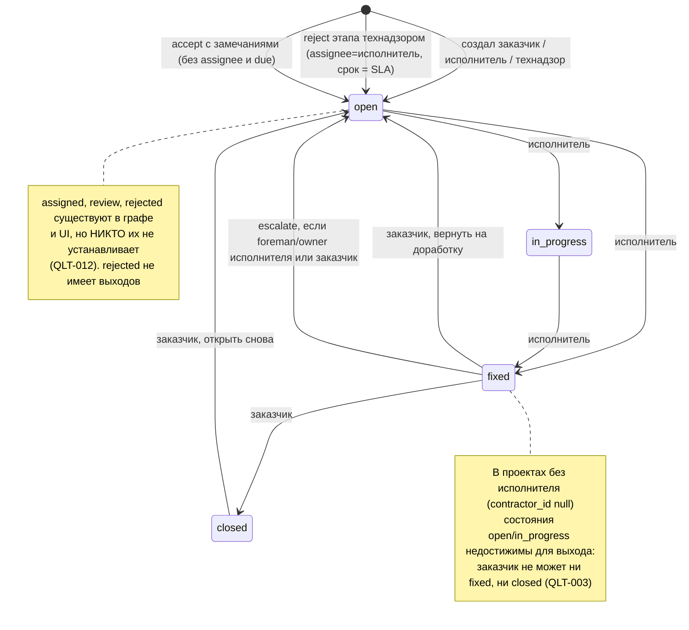
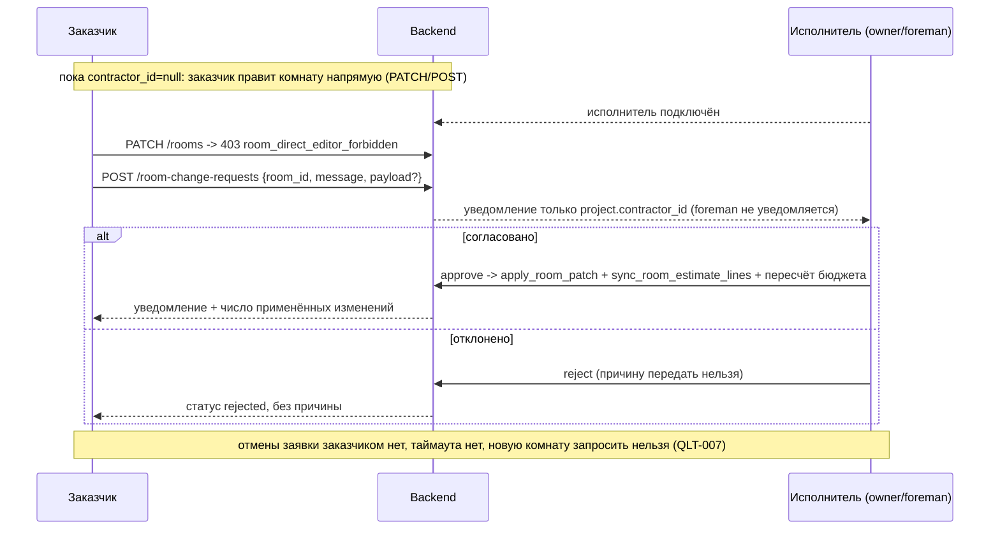
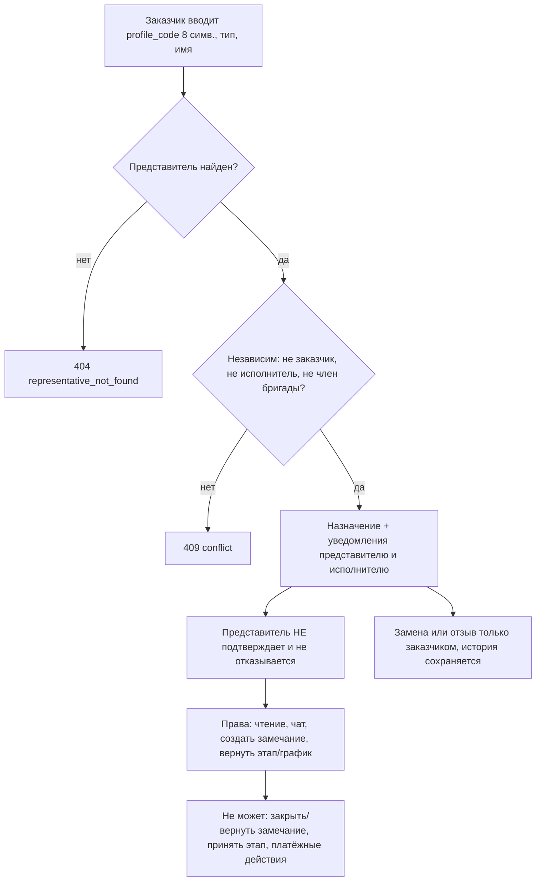
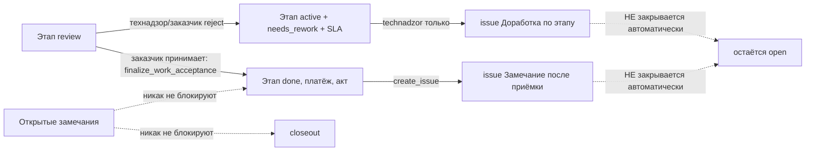

# Срез 07 — Качество на объекте: технадзор, замечания, гарантия, комнаты, планы

Дата аудита: 2026-09-30. Метод: чтение кода + существующие тесты (54 теста среза проходят) + временные in-process проверки (ASGI-клиент, sqlite in-memory, скрипт вне репозитория). Живой backend не трогался. Продуктовый код не менялся.

Условные обозначения: «ВЕРИФ» — воспроизведено тестом; «код» — доказано чтением кода; «гипотеза» — не проверено.

---

## 1. Инвентарь среза

### 1.1 Backend — эндпоинты

| Область | Метод и путь | Файл:строка |
|---|---|---|
| Технадзор | GET/PUT/DELETE `/projects/{id}/technical-supervision`, GET `/history` | `backend/app/api/v1/technical_supervision.py:118,135,152,184` |
| Технадзор: замечание | POST `/projects/{id}/technical-supervision/issues` | `technical_supervision_actions.py:33` |
| Технадзор: чат | POST `/projects/{id}/chats/{thread}/messages` (подменяет штатный) | `technical_supervision_chat.py:16` |
| Технадзор: график | POST `/projects/{id}/work-schedules/{sid}/reject` (только «вернуть») | `technical_supervision_schedule.py:15` |
| Технадзор: этап | POST `/projects/{id}/stages/{sid}/reject` (cap `quality_review`) | `stage_review_transitions.py:60-100` |
| Замечания | GET/POST `/projects/{id}/issues` | `os.py:95,102` |
| Замечания: переход | POST `/issues/{iid}/transition` (канон) | `issue_transitions.py:18` |
| Замечания: legacy | POST `/issues/{iid}/close`, POST `/issues/{iid}/escalate` | `os.py:136,194` |
| Гарантия | POST `/warranty-claims` (канон, идемпотентный) | `warranty.py:29` |
| Гарантия | GET `/warranty-claims`, POST `/warranty-claims/{iid}/close` | `export.py:520,551` |
| Гарантия (мёртвый дубль) | POST `/warranty-claims` в export.py — вырезан роутером | `export.py:446`, `router.py:161-164` |
| Closeout | GET `/closeout-checklist`, POST `/closeout` | `export.py:687,699` (`_closeout_snapshot` :605) |
| Комнаты | GET/POST/PATCH `/rooms`, GET `/rooms/{rid}/change-log` | `rooms.py:51,66,90,135` |
| Заявки на комнату | GET/POST `/room-change-requests`, POST `/{rid}/approve`, `/reject` | `room_requests.py:69,95,153,169` |
| Планы этажей | GET/POST `/floor-plans`, POST `/floor-plans/{pid}/pins`, PATCH `.../pins/{id}` | `floor_plans.py:82,101,122,186` |
| Мебель | GET/POST `/furniture`, PATCH `/furniture/{id}` | `floor_plans.py:150,158,209` |
| Блокнот | GET/POST/PATCH/DELETE `/scratchpad` | `scratchpad.py:25,31,47,64` |
| Реакции | POST/GET `/stages/{sid}/comments/{cid}/react`, GET `/reaction-counts` | `stage_reactions.py:41,54,60` |

DELETE для планов, меток и мебели, а также «замена плана» на backend отсутствуют.

### 1.2 Backend — сервисы и модели

- `issue_service.py` — граф статусов `ISSUE_TRANSITIONS` (:18), матрица ролей `ISSUE_ROLE_ALLOWED` (:29), `transition_issue` (:305), получатели уведомлений `issue_transition_targets` (:339).
- `technical_supervision_service.py` — назначение/замена/отзыв (`appoint_or_replace`, `revoke`), `SUPERVISOR_CAPABILITIES` (:17), `require_capability` (:417), независимость `_assert_independent`.
- `technical_supervision_action_service.py` — `create_quality_issue`, `reject_schedule_as_reviewer`.
- `warranty_claim_service.py` — гарантия = `ProjectIssue` с префиксом `[Гарантия]` + `ProjectDocument(warranty, draft)`, SLA 14 дней (:16).
- `room_mutation_service.py` (`_require_direct_editor` :25, `create_room` :177, `update_room` :266), `room_change_service.py` (`_validate_actor` :34, `create_request` :52, `decide_request` :264), `room_service.py` (`sync_room_estimate_lines` :340), `room_snapshot_service.py` (паспорт).
- `floor_plan_service.py`, `scratchpad_service.py`.
- Модели: `ProjectIssue` (`entities.py:877`), `RoomChangeRequest` (:325), `ProjectTechnicalSupervisorAssignment` (`models/technical_supervision.py:17`), `ProjectViewer` (:278).

### 1.3 Мобильные экраны

- Контроль качества: `components/screens/QualityControlScreen.tsx`, `control/CustomerControlView.tsx`, `control/ContractorControlView.tsx`, `control/TechnicalSupervisionControlView.tsx`, доменная логика `lib/domain/issueLifecycle.ts`.
- Технадзор (назначение заказчиком): `components/renova/TechnicalSupervisionCard.tsx`, `TechnicalSupervisionScheduleReview.tsx`.
- Комнаты: `OsRoomsScreen.tsx` (CustomerRoomsBody / ContractorRoomsBody / RoomRequestCard), `RoomDetailScreen.tsx`, `components/renova/os/RoomPassport.tsx`, `CreateRoomSheet.tsx`, `app/room/[id].tsx`.
- Планы и мебель: `components/renova/FloorPlanPanel.tsx` (включая FurnitureLayer).
- Гарантия: `DocumentsHub.tsx:289-352`, `OsHomeScreen.tsx:204`, `CustomerControlView.tsx:45`, `lib/api/os.ts:62-78`.
- Блокнот: `ScratchpadScreen.tsx`, `lib/api/scratchpad.ts`.

### 1.4 Чего в продукте нет

- «Акта обследования комнаты» нет ни в backend, ни в mobile: слово «survey» встречается только в графе технологий calc-engine. «Паспорт комнаты» — read-only срез (`RoomPassport.tsx`, `room_snapshot_service.py`): бюджет, материалы, число замечаний, этапы. Подписи и приёма-передачи у него нет.
- Гарантийного срока (12/24 мес.) нет: `grep warranty_months|warranty_until|warranty_period` пуст. Есть только SLA 14 дней на одно обращение.
- Оплаты, тарифа или договора технадзора нет: в модели только `provider_type` и `provider_name`.

---

## 2. Матрица «кто что может»

Обозначения: Д — да, Н — нет (код ответа), — нет функции.

| Действие | Заказчик (owner) | Исполнитель-владелец | Бригада: foreman / member / viewer | Гость (viewer) | Технадзор | Где проверяется |
|---|---|---|---|---|---|---|
| Просмотр замечаний, комнат, планов, блокнота | Д | Д | Д / Д / Д | Д | Д (read-fallback) | `deps.py:112-135` (`require_project write=False`) |
| Создать замечание (`POST /issues`) | Д | Д | Д / Д / Н | Н 403 | Н 403 (ВЕРИФ) | `os.py:110-111` (`field_write`) |
| Создать замечание (`/technical-supervision/issues`) | Д | Д | Д / Д / Н | Н | Д | `technical_supervision_action_service.py:38-53`, `technical_supervision_service.py:417` |
| open→in_progress / fixed | Н 403 (ВЕРИФ) | Д | Д / Д / Н | Н | Н | `issue_service.py:29-38` (по `user.role`) |
| fixed→closed / open (вернуть) | Д | Н | Н | Н | Н 403 (ВЕРИФ) | то же |
| closed→open | Д | Н | Н | Н | Н | то же |
| «В спор» (escalate) | Д | Д | Д / Н / Н | Н | Н | `os.py:205`, `team_service.py:540` |
| Создать гарантийное обращение | Д | Д | Д / Д / Н | Н | Н | `warranty.py:28` (`write=True`) |
| Закрыть гарантию | Д | Н 403 | Н | Н | Н | `export.py:562-563` |
| Closeout объекта | Д (только заказчик) | Н | Н | Н | Н | `export.py:715-716` |
| Назначить/заменить/отозвать технадзор | Д | Н | Н | Н | Н | `technical_supervision.py:160,192` |
| Вернуть этап на доработку | Д | Н | Н | Н | Д (создаётся issue) | `stage_review_transitions.py:66-76` |
| Вернуть график на доработку | Д | Н | Н | Н | Д | `technical_supervision_action_service.py:141-160` |
| Принять график, этап, закрыть замечание | Д | Н | Н | Н | Н | — |
| Прямое редактирование комнаты (PATCH) | Д только если `contractor_id is None` | Д (в т.ч. на заблокированной смете, ВЕРИФ) | Д / Д / Н | Н | Н | `room_mutation_service.py:25-50` |
| Создать комнату | Д только без исполнителя (ВЕРИФ 403 иначе) | Д | Д / Д / Н | Н | Н | там же |
| Заявка на изменение комнаты | Д (только заказчик) | Н 403 | Н | Н | Н | `room_change_service.py:81` |
| Согласовать/отклонить заявку | Н 403 (ВЕРИФ) | Д | Д (foreman) / Н / Н | Н | Н | `room_change_service.py:34-38` |
| Планы, метки, мебель (создать/двигать) | Д | Д | Д / Д / Н | Н | Н | `floor_plans.py` (`write=True`) |
| Блокнот (запись) | Д | Д | Д / Д / Н | Н 403 | Н | `scratchpad.py:44,56,70` |
| Реакция на комментарий этапа | Д | Д | Д / Д / Д | Д (ВЕРИФ) | Д | `stage_reactions.py:41` (`require_project_dep()` без `write=True`) |

Пояснения:
- Роль в переходах замечаний берётся из `user.role` (customer/contractor), а не из связи с проектом; доступ на запись даёт `require_project(write=True)`.
- Технадзор получает доступ только через fallback на чтение (`deps.py:120-130`). Записи идут через отдельные capability-роуты: `project_read`, `communication`, `quality_issue_write`, `quality_review`, `schedule_review`.

---

## 3. Последовательности и состояния

### 3.1 Жизненный цикл замечания (фактический граф)



Ожидание: open/in_progress → ждёт исполнителя; fixed → ждёт заказчика. Таймаутов нет: `due_at` = +3 дня хранится, но не проверяется и не эскалируется (QLT-014). Приёмка этапа и closeout на открытые замечания не смотрят (QLT-002).

### 3.2 Гарантийное обращение

```mermaid
sequenceDiagram
    participant З as Заказчик
    participant И as Исполнитель
    participant API as Backend
    З->>API: POST /warranty-claims (title, description, client_request_id)
    Note over З,API: UI шлёт title="Гарантийное обращение", description="Создано из Document Center" (QLT-006)
    API-->>API: ProjectIssue "[Гарантия] ..." status=open, high, due +14д; ProjectDocument(warranty, draft)
    API-->>И: уведомление -> /quality-control
    И->>API: transition (fixed) -> 409 warranty_transition_separate
    И->>API: warranty close -> 403 warranty_close_customer_only
    Note over И: у исполнителя нет действий, только подсказка "Гарантию закрывает заказчик"
    З->>API: POST /warranty-claims/{id}/close
    API-->>API: status=closed, документ архивируется
    Note over И: уведомления исполнителю о закрытии нет; открыть заново нельзя (QLT-004)
    З->>API: POST /issues/{id}/close на гарантии -> 404 (QLT-005)
```

Открытая гарантия блокирует closeout (`export.py:642-647`). Гарантия допускается и после closeout (архив), без срока (QLT-013).

### 3.3 Заявка на изменение комнаты



Побочный эффект (ВЕРИФ): прямая правка исполнителем и approve пересчитывают `EstimateLine.quantity_planned` и `budget_planned` даже при подписанной смете (QLT-001).

### 3.4 Назначение технадзора



Оплаты и договора нет. Если позже представитель войдёт в команду исполнителя, `is_active_supervisor` молча возвращает false (`technical_supervision_service.py:117-127`), без уведомления заказчика.

### 3.5 Связь замечаний с этапом и приёмкой



---

## 4. Кнопки, функции, опции по экранам

### 4.1 Контроль качества (`QualityControlScreen.tsx`)

| Кнопка | Обработчик | API | Серверная проверка | Результат / ошибки |
|---|---|---|---|---|
| «В работу», «Исправлено» (исполнитель) | `transitionIssue` :264 | POST `/issues/{id}/transition` | `require_project(write)`, матрица `user.role` | Confirm-sheet, затем обновление; ошибка → «Статус не изменён» + message |
| «Подтвердить исправление», «Вернуть на доработку», «Открыть снова» (заказчик) | то же | то же | то же | то же |
| «Закрыть гарантию» (заказчик, только `[Гарантия]`) | `closeWarranty` :282 | POST `/warranty-claims/{id}/close` | только заказчик | `alertWarrantyClosed`; повторно тоже 200 |
| «В спор» | `escalateIssue` :303 (кнопка :174) | POST `/issues/{id}/escalate` | cap `escalate`: owner/foreman/заказчик | Показана всем без проверки роли: member получает 403 (QLT-011) |
| «Этап», «План» | `pushOsNav` | — | — | Навигация |
| Кнопки создания замечания | **нет** | — | — | Создать замечание отсюда нельзя (QLT-007) |
| Список «Закрытые» | `slice(0,5)` | — | — | Остальное недоступно (QLT-021) |

Для заказчика в проекте без исполнителя показывается «Ждёт исправления исполнителем» и ни одной кнопки (`issueLifecycle.ts:110-113`).

### 4.2 Технадзор

- `TechnicalSupervisionCard` (заказчик): «Назначить/Заменить технадзор» → PUT (с `expected_assignment_id`), «Отозвать полномочия» → DELETE. Имя по умолчанию для физлица = имя из профиля или телефон (QLT-018).
- `TechnicalSupervisionControlView` (представитель): «Зафиксировать замечание» → POST `/technical-supervision/issues` (title = «Замечание: {этап}», severity=medium жёстко, без фото, комнаты, плана); «Вернуть на доработку» → POST `/stages/{id}/reject`. Список замечаний только для чтения. Ждущие проверки берутся из статусов `requested`/`in_review`, а reject требует, чтобы этап был в `review` (`stage_review_service.py`, `stage_reject_invalid_status` → общий алерт).

### 4.3 Комнаты

- `OsRoomsScreen` (заказчик): карточка комнаты «Запрос изменения» (`RoomRequestCard`, только при `contractor_id`) → POST `/room-change-requests`; «Мои запросы» показывает сообщение и статус. Отменить заявку нельзя, причины отказа не видно.
- `OsRoomsScreen` (исполнитель): «Согласовать»/«Отклонить» (`approveRequest`:333, `rejectRequest`:365) → approve/reject; «В архив/Восстановить» → PATCH `is_archived`; создание комнаты через `CreateRoomSheet`.
- `RoomDetailScreen`: `ownerCanEdit = !isContractor && !contractor_id && canWrite` (:57). Заказчик без исполнителя правит размеры и розетки, при исполнителе видит «Изменения — через запрос исполнителю». Исполнитель правит всё (тип, этаж, порог бюджета, габариты) и архивирует. «Рассчитать материалы» → POST `/calc-materials`. `RoomPassport` — read-only.

### 4.4 Планы и мебель (`FloorPlanPanel.tsx`)

- «Замечания на плане»: тап по плану, камера/галерея, `createIssue` с жёстким `title='Замечание на плане'`, severity medium, без описания, комнаты и этапа (:182-190).
- «+ Загрузить план», «Заменить план этажа» — только `role==='contractor'` (:422-441). Заказчик видит «Написать подрядчику».
- Перетаскивание меток комнат — только исполнитель (:379).
- Замена плана создаёт новый `FloorPlan`; UI берёт первый по этажу, то есть новейший (list :82 отдаёт `created_at desc`). Замечания старого плана исчезают с карты, оставаясь открытыми (QLT-020).

### 4.5 Гарантия (`DocumentsHub.tsx:289-352`)

«Гарантийное обращение» → `createWarrantyClaim` с фиксированными title и description (QLT-006). Если открытые есть, у заказчика предлагается «В QC», «Закрыть это» (закрывает первое из списка вслепую), «Создать ещё». Исполнитель получает только создание.

### 4.6 Блокнот (`ScratchpadScreen.tsx`)

«Записать», отметка «сделано», редактирование, удаление, «В работу» (promote → work_order, чат, расход). POST не идемпотентен; при сетевой ошибке или 5xx запрос ставится в offline-очередь и может задвоить строку (QLT-016). Для гостя запись закрыта (403), чтение открыто.

---

## 5. РЕЕСТР ДЕФЕКТОВ

Итого: 23 дефекта. P0 — 1, P1 — 5 (QLT-002, 003, 004, 006, 007), P2 — 14, P3 — 3.

| ID | Сев. | Тип | Доказательство (file:line, как воспроизвести) | Кого затрагивает | Предложение | ВЕРИФ |
|---|---|---|---|---|---|---|
| QLT-001 | P0 | нет ACL / потеря денег | Прямая правка комнаты исполнителем и approve заявки вызывают `sync_room_estimate_lines` (`room_service.py:340`, `room_mutation_service.py:266`, `room_change_service.py:264`) без проверки `estimate_locked_at`. Проверка блокировки есть только в `estimate.py:54`. Тест: подписанная смета, PATCH `/rooms/{id}` `length_m 3→6`, `width_m 3→6` → 200, смета 61 166 → 171 444 ₽, `budget_planned` пересчитан. approve заявки на зафиксированной смете тоже 200. Заказчик получает только уведомление «Обновлена комната». | Заказчик (деньги), исполнитель | При `estimate_locked_at` запрещать PATCH размеров и approve, либо создавать `ChangeOrder` и ждать акцепта заказчика. Согласовывать сторону, не подающую заявку. | да |
| QLT-002 | P1 | неверный статус / рассинхрон | Открытые замечания не блокируют приёмку этапа (`accept_orchestrator.py:158-200` не смотрит `ProjectIssue`) и closeout (`export.py:605-650`: `ready` = этапы done, оплаты, акт, нет гарантий). Тест: этап done + открытое critical-замечание + акт → `ready: True`, `POST /closeout` 200, проект уходит в архив. `compute_quality_score(open_issues)` мёртв (`open_issues` нигде не передаётся). | Заказчик | В `_closeout_snapshot` и приёмке учитывать открытые замечания (`status not in closed`), минимум critical/high, с предупреждением и явным «принять с замечаниями». | да (closeout), код (приёмка) |
| QLT-003 | P1 | тупик | В проекте без исполнителя (`contractor_id is None`, «самостоятельный») заказчик может создать замечание, но open→fixed/in_progress разрешены только `contractor` (`issue_service.py:29-38`), open→closed нет в графе. Тест: transition fixed 403, closed 409, in_progress 403, legacy `/close` 404. UI: «Ждёт исправления исполнителем» без кнопок (`issueLifecycle.ts:110-113`). Замечание не закрыть никогда. | Заказчик-самоуправленец | Для `contractor_id is None` разрешить заказчику open→closed (или fixed→closed) сразу. | да |
| QLT-004 | P1 | тупик / нет функции | Гарантия: исполнитель не может ответить, принять, отклонить или отметить «исправлено». Transition на `[Гарантия]` → 409 (`issue_transitions.py:29-38`), close → 403 (`export.py:562`); заказчик закрывает единолично. Закрытую гарантию открыть нельзя (transition блокирован, `/close` только закрывает). `close_warranty_claim` не уведомляет исполнителя (`export.py:551-600` без notify). Повторный close возвращает 200 и переписывает `closed_at` (тест). | Исполнитель, заказчик | Статусы гарантии: open → in_progress → fixed (исполнитель) → closed/reopen (заказчик); уведомление о закрытии; идемпотентный close. | да |
| QLT-005 | P2 | неверный статус | `POST /issues/{id}/close` для заказчика на `open` (в том числе `[Гарантия]`) отвечает 404 «Not Found» (`os.py:153-155`, `update_issue_status` вернул None). Исполнитель повторно на `fixed` → тоже 404. Ошибка вводит в заблуждение (запись существует). Клиент этот путь не использует (`closeIssue` deprecated), но он живой. | API-клиенты | Возвращать 409 с кодом или удалить legacy-роут. | да |
| QLT-006 | P1 | нечестные данные / затык UX | Единственная точка создания гарантии `DocumentsHub.tsx:329-345` шлёт `title:'Гарантийное обращение'`, `description:'Создано из Document Center'`. Поля для описания дефекта нет. Исполнитель видит обезличенное обращение; «Создать ещё» плодит одинаковые. | Заказчик, исполнитель | Форма с темой, описанием, фото и комнатой; передавать в `WarrantyClaimIn`. | да (код) |
| QLT-007 | P1 | тупик / нет функции | (а) Создать замечание вручную можно только тапом по плану этажа (`FloorPlanPanel.tsx:182`, title/severity зашиты, нет описания, комнаты, этапа); в `QualityControlScreen` кнопки создания нет. Плана нет — замечание не создать. (б) Загрузить план по UI может только исполнитель (`FloorPlanPanel.tsx:422-441`), хотя backend разрешает и заказчику. В самоуправляемом проекте заказчик видит «Подрядчик ещё не загрузил чертёж» и не может ни загрузить план, ни оформить замечание. (в) После подключения исполнителя заказчик не может добавить комнату: POST `/rooms` → 403 `room_direct_editor_forbidden` (тест), а заявка требует существующий `room_id` (`room_change_service.py:81-88`) — запросить новую комнату негде. | Заказчик | Кнопка «Добавить замечание» в QC (тема, описание, severity, комната, этап, фото); позволить заказчику загружать план; тип заявки «добавить комнату». | да (API), код (UI) |
| QLT-008 | P2 | тупик / нет ACL | Технадзор создаёт замечания, но не может их вести: transition, close и generic create → 403 (тест). Технадзор не получает уведомлений по замечаниям: `issue_transition_targets` (`issue_service.py:339`) берёт только заказчика и исполнителя, а `create_quality_issue` (`technical_supervision_action_service.py:115-130`) уведомляет заказчика и исполнителя, но не автора. Проверить «Исправлено» технадзор не может, приёмку/подписание не вправе. График можно только вернуть, одобрить нельзя. Мобильный экран технадзора показывает замечания без действий (`TechnicalSupervisionControlView.tsx`). | Технадзор | Добавить capability «подтвердить/вернуть замечание» (fixed→closed по согласованию либо fixed→open) и уведомлять технадзор. | да |
| QLT-009 | P2 | тупик | Заявка на комнату без исполнителя: создаётся (200, pending), но решать её некому (`_validate_actor` требует owner/foreman исполнителя, `room_change_service.py:34`; заказчик получает 403 — тест). Получателей уведомлений нет (:154). После подключения исполнителя заявка остаётся pending без уведомления. UI скрывает путь без исполнителя, проблема на уровне API и данных. | Заказчик | Запрещать создание при `contractor_id is None` (409) или автоприменять; при подключении исполнителя уведомлять о pending. | да |
| QLT-010 | P2 | нет функции | Заявка комнаты: reject без причины (`reason` в `decide_request` есть, но `_decide` его не принимает, `room_requests.py:122-150`); заказчик видит статус без объяснения; отменить/отозвать заявку нельзя; таймаута нет (pending вечно). | Заказчик | Тело `{reason}` в approve/reject; `DELETE`/cancel; авто-эскалация и напоминание. | да (код) |
| QLT-011 | P2 | рассинхрон UI↔backend | Кнопки «Согласовать/Отклонить» заявку показываются всем исполнителям с записью (`canWrite`, `OsRoomsScreen.tsx:325-367`), а backend требует owner/foreman: member получает 403 → общий «Ошибка» (`room_change_service.py:34-38`). Уведомление уходит только `project.contractor_id` (:154), foreman его не получает. Аналогично «В спор» показана всем (`QualityControlScreen.tsx:174-181,372`), а member получает 403 `escalate_foreman_or_owner_only`. | Бригада (member/foreman) | Скрывать кнопки по `team_role`; уведомлять foreman. | код |
| QLT-012 | P2 | мёртвый код / без ответственного | Статусы `assigned`, `review`, `rejected` есть в графе и UI (`issue_service.py:18-26`, `issueLifecycle.ts:1-30`), но их никто не выставляет. `assignee_id` заполняется только при reject этапа технадзором, API назначения нет, UI поле не показывает. Замечания создаются без ответственного; `rejected` без выходов. | Все | Удалить мёртвые статусы либо добавить назначение (assignee) и «отклонить замечание» с обоснованием. | да (код) |
| QLT-013 | P2 | нет функции | Нет гарантийного срока: `warranty` принимается вечно, без даты окончания гарантии от closeout; SLA 14 дней (`warranty_claim_service.py:16`) только хранится и показывается, не принуждается. | Заказчик, исполнитель | Поле `warranty_until` в проекте/договоре; проверка при создании обращения; напоминания. | да (код) |
| QLT-014 | P2 | нет функции | `due_at` замечаний (+3 дня, `issue_service.py:135,199`) нигде не проверяется: нет напоминаний, авто-эскалации, флага «просрочено» (кроме гарантии в `export.py:520-548`). Замечания из принятия («Замечание после приёмки», `accept_orchestrator.py:187`) вообще без срока и ответственного. | Исполнитель, заказчик | Воркер просрочки + notification; разметка в QC. | да (код) |
| QLT-015 | P2 | неверный статус | Замечания «Доработка по этапу» (`stage_review_service.py:414-426`) и «Замечание после приёмки» никогда не закрываются автоматически при повторной сдаче/приёмке этапа; остаются open навсегда, если заказчик не закроет вручную. Исполнитель об «Замечании после приёмки» не уведомляется (`accept_orchestrator.py:187`, нет notify). Rework-issue создаётся только при reject технадзора, при reject заказчиком — нет (`stage_review_transitions.py:96`). | Исполнитель, заказчик | Связать issue с этапом при повторной сдаче; уведомление исполнителя; единообразие для reject заказчика. | код |
| QLT-016 | P2 | нет идемпотентности / приватность | Блокнот: POST без `client_request_id` (`scratchpad.py:15,31`), mobile ставит запрос в offline-очередь при 5xx/сети (`scratchpad.ts:9-25`) — возможен дубль. Блокнот виден всем с правом чтения, включая гостей и технадзор (`scratchpad.py:25-29`; `created_by` не отдаётся, приватных заметок нет). `promoted_kind/id` в PATCH не валидируются. | Заказчик (приватность), все | `client_request_id`; ограничить чтение или разделить личные/общие заметки; валидировать promote. | код |
| QLT-017 | P2 | нет ACL | Реакции на комментарии этапа: `require_project_dep()` без `write=True` (`stage_reactions.py:41`). Тест: read-only гость (`ProjectViewer`) ставит реакцию → 200 и уведомление автору. Также чтение доступно технадзору. | Гость | `write=True` (кроме технадзора, если нужно). | да |
| QLT-018 | P2 | нечестные данные / приватность | Имя технадзора по умолчанию — телефон: `_provider_name` падает на `representative.phone` (`technical_supervision_service.py:43-55`). Тест: `provider_name` = `+79990000009`; попадает в статус, уведомления и историю, видно исполнителю. Представитель не подтверждает назначение и не может отказаться. | Технадзор, исполнитель | Требовать имя или брать `full_name`; не подставлять телефон; добавить подтверждение назначения. | да |
| QLT-019 | P2 | нет функции | Оплаты и договора технадзора нет: модель `ProjectTechnicalSupervisorAssignment` без ставки, статуса согласия, срока. Роль «технадзор» не привязана к акту/платежу, нельзя проверить «кто платит и когда». | Заказчик, технадзор | Продуктовое решение: тариф/акт, подписание. | да (код) |
| QLT-020 | P2 | рассинхрон | «Заменить план этажа» создаёт новый `FloorPlan` (`floor_plans.py:101-120`), UI берёт самый свежий (`FloorPlanPanel.tsx:88`); метки, мебель и замечания старого плана исчезают с карты, оставаясь открытыми. Удаления плана, метки или мебели нет; `move_pin`/`move_furniture` без границ 0–100 (`floor_plans.py:186-217`); замечание создаётся с x/y любых значений (тест: 999/-5 → 200). | Исполнитель, заказчик | Перенос меток при замене, DELETE, валидация координат. | да (замечания), код (остальное) |
| QLT-021 | P3 | затык UX | QC показывает лишь 5 закрытых замечаний (`QualityControlScreen.tsx:434`), без «Показать все»/фильтров по этапу и комнате. Нет поиска и группировки. | Все | Пагинация/фильтры. | код |
| QLT-022 | P3 | валидация | `POST /issues`: severity — любая строка, title без `max_length` (тест: `severity:"banana"` → 200); `photo_key` любой строкой. На PostgreSQL длинное значение (`String(255)`, `String(16)`, реакции `String(8)`) даст 500 (гипотеза, не проверено на PG). Магические префиксы `[Гарантия]`/`[Спор]` в названии определяют логику (`issue_transitions.py:29`, `export.py:527`): обычное замечание с таким названием считается гарантией, блокирует closeout и переходы. | Все | Enum severity, `max_length`, отдельное поле `kind` вместо префикса. | да (severity/coords), гипотеза (PG) |
| QLT-023 | P3 | мёртвый код / нет ACL | Дубль `POST /warranty-claims` в `export.py:446-517` вырезан роутером и мёртв. `require_project` не проверяет `is_archived` (`deps.py:112`), поэтому после closeout разрешены правки комнат (и пересчёт сметы), планов, блокнота (гипотеза о намерении: допускается ли). Исполнитель может создать «гарантийное обращение» против самого себя (нет ограничения по роли, `warranty.py:28`). | Заказчик | Удалить дубль; политика read-only для архивных объектов, кроме гарантии. | код |

### Топ по критичности

1. QLT-001 — правка комнаты пересчитывает подписанную смету (61 к → 171 к ₽) без согласия заказчика.
2. QLT-002 — closeout и приёмка при открытых critical-замечаниях.
3. QLT-003 — замечания в проекте без исполнителя невозможно закрыть.
4. QLT-007 / QLT-006 — замечание можно создать только через метку на плане, гарантию — только с шаблонным текстом; заказчик с подключённым исполнителем не может добавить комнату.
5. QLT-004 — гарантия без ответа исполнителя, без повторного открытия и без уведомления о закрытии.

### Что не удалось или не проверено

- Живой backend и Expo web не запускались (только чтение кода и in-process тесты), визуальная проверка UI не делалась.
- Поведение на PostgreSQL (длинные строки, блокировки) не проверялось — гипотеза QLT-022.
- Мобильные ограничения (`canPunch` для read-only гостя, offline-очередь) прочитаны в коде, но не воспроизводились на устройстве.
- Порядок статусов `WorkAcceptance` для списка технадзора (`requested`/`in_review`) сверен только чтением.
