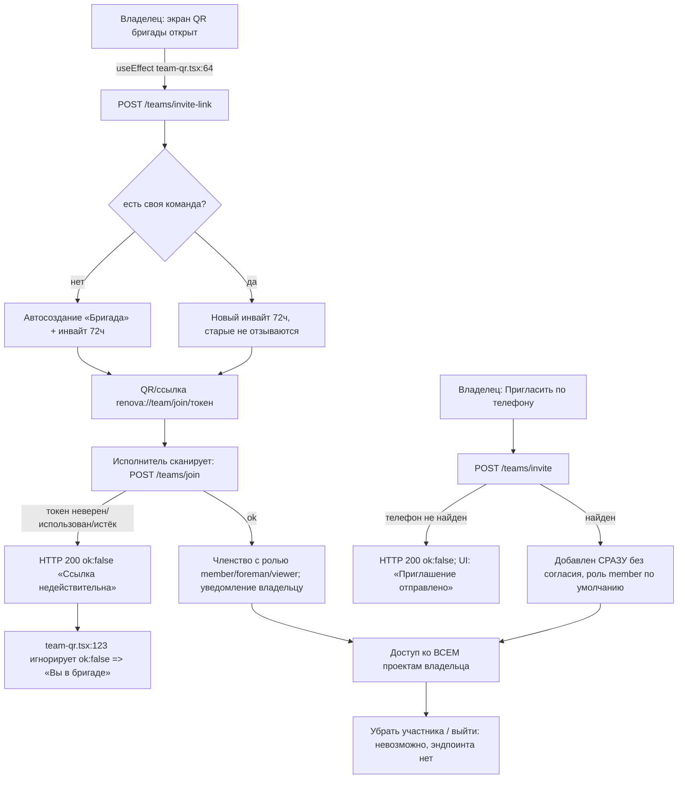
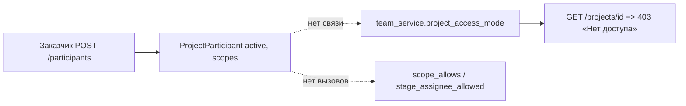

# Срез 08 — контур исполнителя: биржа заявок, отклики, команды, профиль, отчёты, статьи, админ-инструменты

Дата аудита: 2026-09-30. Метод: чтение кода + прогон существующих тестов (50 passed: `test_job_lead_*`, `test_lead_address_privacy`, `test_team_*`, `test_admin_rbac_integrity`, `test_project_participant_management`, `test_provider_reconciliation_admin`, `test_platform_admin_operations_integrity`) + две временные in-process ASGI-пробы (SQLite tmp, вне репозитория, файлы удалены) + один вход `POST /auth/demo` и один `GET /admin/stats` на живом backend (127.0.0.1:8100).
Продуктовый код не менялся. Пометка «ВЕРИФ.: да» = подтверждено пробой/тестом или прямым чтением кода с указанием строки; «нет» = гипотеза.

---

## 1. Инвентарь среза

### 1.1 Backend — эндпоинты (все под `/api/v1`)

| Область | Метод и путь | Файл:строка |
|---|---|---|
| Профиль исполнителя | `GET /contractors` (каталог, фильтр city) | `backend/app/api/v1/marketplace.py:136` |
| | `GET /contractors/me/profile` | `marketplace.py:170` |
| | `POST /contractors/profile` (upsert) | `marketplace.py:205` |
| | `GET /contractors/match` (подбор) | `marketplace.py:345` |
| | `GET/POST /contractors/{profile_id}/portfolio` | `marketplace.py:379`, `:401` |
| Биржа заявок | `GET /job-leads` (limit 50, без пагинации) | `marketplace.py:227` |
| | `POST /job-leads` (только customer) | `marketplace.py:260` |
| | `POST /job-leads/{id}/quote` (отклик/цена, upsert) | `marketplace.py:275` |
| | `POST /job-leads/{id}/quotes/{qid}/accept` | `marketplace.py:315` |
| | `POST /job-leads/{id}/auto-assign` | `marketplace.py:515` |
| | `GET/POST /job-leads/{id}/messages` | `marketplace.py:476`, `:498` |
| | `POST /job-leads/{id}/convert` — АКТИВНА версия | `marketplace_conversion_integrity.py:45`; сервис `services/marketplace_conversion_service.py:25` |
| | старая `convert` в `marketplace.py:421-474` снята с роутера | `api/v1/router.py:52-55` (`_remove_replaced_routes`) |
| Команды | `GET /teams/me`, `POST /teams`, `POST /teams/invite`, `/invite-sms`, `/invite-link`, `PATCH /teams/member-role`, `POST /teams/join` | `api/v1/teams.py:63,80,128,98,146,171,192`; логика `services/team_service.py`, `services/team_invite_join_service.py` |
| Multi-contractor | `GET/POST /projects/{id}/participants`, `PATCH .../{pid}/scopes`, `DELETE .../{pid}` | `api/v1/project_participants.py`; сервис `services/project_participant_service.py` |
| Прямое подключение | `POST /projects/{id}/contractor` (заказчик), `POST /projects/{id}/assign` (исполнитель сам) | `api/v1/project_assignment_integrity.py:57`, `:45`; `services/project_assignment_service.py:44` |
| Отчёты | `GET /projects/{id}/reports/daily|weekly|final` и `.pdf` | `api/v1/reports.py:16-87`; `services/report_service.py` |
| KPI | `GET /projects/{id}/kpi-history`, `POST .../kpi-snapshot` | `api/v1/kpi_history.py:12`, `:24` |
| Статьи | `GET /articles`, `/articles/categories`, `/articles/{slug}` (публично, без auth) | `api/v1/articles.py:23,43,48` |
| Статьи-админ | `GET/POST /articles/admin`, `PATCH/DELETE /articles/admin/{slug}` | `api/v1/articles_admin.py:24,61,83,43` |
| Шаблоны чек-листов | `GET/POST /checklist-templates`, `GET /{id}/versions` | `api/v1/checklist_templates.py:16,21,29` |
| Админ | `GET /admin/stats`, `/projects-chart`, `/revenue-chart`, `/release-health`, `/h0-readiness` | `api/v1/admin.py` |
| | `/admin/outbox/dead-letters` (list/detail/claim/release/replay/history) | `api/v1/admin_outbox_dead_letters.py` |
| | `/admin/provider-reconciliations` (list/detail/requeue) | `api/v1/admin_provider_reconciliations.py` |
| | `/admin/subscription-refunds/reviews` (list/detail/claim/release/resolve) | `api/v1/admin_subscription_refunds.py` |
| | `/automation/worker`, `/automation/worker/tick` | `api/v1/automation_worker.py` |
| Репутация | `RATING_SOURCES = ()`, `JOBS_DONE_SOURCES = ()` — источников нет | `services/contractor_reputation_service.py:28,31` |

### 1.2 Модели
`ContractorProfile` (rating/jobs_done со значением по умолчанию, `visible`) `models/entities.py:788`; `JobLead` + `JobLeadStatus{open,quoted,taken,closed}` `:805-826`; `ContractorPortfolioPhoto` `:828`; `LeadMessage` `:837`; `JobLeadQuote` (UNIQUE lead+contractor, есть `note`) `:847`; `Team/TeamMember/TeamInvite` `entities.py:492`; `ProjectParticipant*` `models/project_participants.py`; `MarginSnapshot` (entities); `RepairArticle`; `ChecklistTemplate(+Version)`.

### 1.3 Мобильные экраны
| Экран | Файл |
|---|---|
| Биржа заявок (общий для ролей) | `apps/mobile/app/job-leads.tsx` -> `app/_stack/job-leads.tsx` -> `components/renova/JobLeadsBoard.tsx` |
| Чат заявки | `components/renova/LeadChat.tsx` |
| Форма заявки | `components/renova/CreateJobLeadSheet.tsx` |
| Мастер конверсии (исполнитель) | `app/contractor-wizard/[leadId].tsx` |
| Профиль исполнителя + «Бригада» | `components/screens/profile/ContractorProfileScreen.tsx` |
| QR бригады | `app/(contractor)/_screens/team-qr.tsx` (маппинг в `app/(contractor)/[tool].tsx`) |
| Каталог исполнителей | `components/renova/ContractorDirectory.tsx` (через `ContractorInvitePanel.tsx`) |
| Портфолио-галерея | `components/renova/PortfolioGallery.tsx` (нигде не подключена) |
| Отчёты | `app/reports.tsx` -> `app/_stack/reports.tsx` |
| KPI-график | `components/renova/KPITrends.tsx` через `ProjectAnalyticsPanel.tsx:67` |
| Сводка менеджера | `app/_stack/manager-dashboard.tsx` -> `components/screens/ManagerDashboardScreen.tsx` |
| Гид / статья | `app/_stack/guide.tsx` -> `components/screens/GuideScreen.tsx`; `app/article/[slug].tsx` |
| Админ | `(contractor)/_screens/admin.tsx`, `admin-dashboard.tsx`, `articles-admin.tsx`, `outbox-dead-letters.tsx`, `audit.tsx`; ссылки — `components/renova/AdminHubLink.tsx` (только web) |
| Портфель проектов | `app/portfolio.tsx` (это не портфолио исполнителя, а список объектов) |

UI отсутствует для: `provider-reconciliations`, `subscription-refunds/reviews` (grep по `apps/mobile` пуст), `participants`, `member-role`, загрузка портфолио.

---

## 2. Матрица «кто что может»

Легенда: Д — да, Н — нет, — — не применимо. «customer» = заказчик-владелец заявки, «ctr» = исполнитель, «ctr-назн.» = исполнитель, назначенный на заявку, «член» = участник команды владельца.

| Действие | customer | ctr (любой) | ctr-назн. | член команды | viewer/гость | admin | Где проверяется |
|---|---|---|---|---|---|---|---|
| Создать заявку | Д | Н 403 | Н | Н | Н | Н | `marketplace.py:264` |
| Видеть открытые заявки | только свои | Д все `open` (лимит 50) | +свои назначенные | как ctr | Н | — | `marketplace.py:233-243` |
| Полный адрес | Д | Н (2 первых сегмента) | Д | Н | Н | — | `_can_see_full_address` `:65` |
| Цена чужого отклика | Д (все) | только своя | своя и `lead.pre_estimate` | — | — | — | `_lead_dict` `:71-121` |
| Отправить/изменить отклик | Н | Д если lead open/quoted и не назначен другой | Д (и ПОСЛЕ принятия, см. MKT-002) | Н | Н | — | `marketplace.py:285-289` |
| Принять отклик | Д (владелец) | Н | Н | Н | Н | — | `:319-339` |
| Авто-назначение | Д (владелец, статус open/quoted) | Н | Н | Н | Н | — | `:519-547` |
| Отозвать отклик / отказаться / отменить заявку / закрыть | Н | Н | Н | Н | Н | Н | эндпоинтов нет (openapi) |
| Переписка по заявке | Д | Н (404 до назначения) | Д | Н | Н | — | `_can_message_lead` `:130` |
| Конвертировать заявку в проект | Д | Н | Д | Н | Н | Н | `marketplace_conversion_service.py:44-53` |
| Профиль: править | Н | Д (свой) | — | Н | Н | — | `marketplace.py:211` |
| Каталог `/contractors`, `/match` | Д | Д | Д | Д | ? | — | только `get_current_user`, роль не проверяется |
| Создать бригаду / приглашать / менять роли | Н 403 | Д (владелец своей) | — | Н (но `POST /teams` и `invite-link` создадут ЕМУ новую бригаду) | Н | — | `teams.py:53-55`, `team_service.py:555` |
| Вступить по токену | Н | Д | — | — | — | — | `team_invite_join_service.py:110-116` |
| Удалить участника, выйти, отозвать инвайт | эндпоинтов нет | | | | | | openapi |
| Доступ к проектам владельца бригады | — | — | Д | Д на ВСЕ проекты владельца (viewer — read-only) | — | — | `team_service.py:441-489` |
| Добавить/убрать участника проекта | Д (только владелец-заказчик) | Н | Н | Н | Н | — | `project_participants.py:78-84` |
| Реальный доступ участника проекта к объекту | — | Н 403 (эффекта нет) | — | — | — | — | `team_service.py:472-489` не знает о `ProjectParticipant` |
| Отчёты daily/weekly/final (+PDF) | Д | Д если назначен | Д | Д (в т.ч. viewer) | Д (guest, read) | — | `require_project(write=False)` `reports.py:19` |
| KPI snapshot | Д (write) | Д | Д | Д кроме viewer (403) | Н | — | `require_project(write=True)` `kpi_history.py:26` |
| Статьи читать | Д, даже без авторизации | | | | | | `articles.py` без Depends на user |
| Статьи админ | Н 403 | Д в dev (fallback), в staging/prod только `ADMIN_USER_IDS` | | | | Д | `articles_admin.py`, `admin_access.py:20-35` |
| Шаблоны чек-листов: список | свои | свои | | | | | `checklist_templates.py:18` |
| Версии шаблона | ЛЮБОЙ шаблон по id (IDOR) | | | | | | `checklist_templates.py:29-32` |
| Админ-инструменты (dead letters, reconciliation, refunds, stats, health) | Н 403 | Д в dev/test; в staging/prod только явный id из `ADMIN_USER_IDS`, иначе 403 | | | | Д | `api/admin_access.py:20-49` |
| Самозахват проекта без исполнителя | — | Д ЛЮБОЙ исполнитель по id проекта (в рамках лимита Pro) | | | | | `project_assignment_service.py:76-80` |

Роли «технадзор» и «viewer» в срезе биржи не участвуют; технадзор читает отчёты через `require_project` fallback (`deps.py:120-130`).

---

## 3. Последовательности и состояния

### 3.1 Жизненный цикл заявки (фактический)

```mermaid
stateDiagram-v2
    [*] --> open: POST /job-leads (customer)
    open --> open: POST /quote (ctr; upsert одной строки на исполнителя)
    open --> quoted: accept_quote (customer) ИЛИ auto-assign (customer)
    quoted --> quoted: auto-assign повторно => ПЕРЕНАЗНАЧЕНИЕ, цена остаётся прежняя (MKT-001)
    quoted --> quoted: назначенный ctr меняет свой отклик, lead.pre_estimate не меняется (MKT-002)
    quoted --> taken: convert (customer ИЛИ назначенный ctr), создаётся проект
    taken --> taken: повторный convert = replay того же проекта
    open --> [*]: выхода нет: cancel/close/expire отсутствуют (closed нигде не выставляется)
    quoted --> [*]: отказа исполнителя и расторжения нет
```



Кто кого ждёт и что блокирует:
- заявка `open` ждёт откликов; без откликов остаётся вечно и висит в ленте исполнителей (лимит 50, старые вытесняются, но не закрываются);
- отклик ждёт выбора заказчика; исполнитель не знает о выборе (нет уведомлений), проигравшая заявка просто исчезает из его списка;
- `quoted` ждёт конверсии: заказчик или исполнитель нажимает «-> Проект»; первый, кто нажал, определяет комнаты (заказчик — всегда дефолтную «Комната 4x3»);
- при отказе/таймауте ничего не происходит: состояния «отклонено», «просрочено», «отозвано» не существуют.

### 3.2 Путь исполнителя от регистрации до объекта

```mermaid
sequenceDiagram
    participant C as Заказчик
    participant B as Backend (marketplace)
    participant X as Исполнитель
    participant Y as Другой исполнитель
    X->>B: POST /auth/demo или OTP (роль contractor)
    Note over X,B: профиль НЕ создаётся; в каталог попадает только после POST /contractors/profile
    X->>B: POST /contractors/profile (UI шлёт только company_name, payment_requisites)
    B-->>B: specialties/city/bio затираются в NULL (MKT-003)
    C->>B: POST /job-leads
    Note over B: уведомления исполнителям нет
    X->>B: GET /job-leads (ручной опрос)
    X->>B: POST /quote {pre_estimate}
    Y->>B: POST /quote {pre_estimate}
    Note over B: чужие цены скрыты (_lead_dict), цена на lead не зеркалится
    Note over C,B: заказчику уведомления о новом отклике нет
    C->>B: POST /quotes/{id}/accept
    B-->>B: assigned_contractor_id, lead.pre_estimate, status=quoted
    Note over X,Y: X и Y не уведомлены; Y просто теряет заявку из списка
    alt заказчик конвертирует
        C->>B: POST /convert (без комнат)
        B-->>C: проект с 1 комнатой 4x3, бюджет из шаблона, цена КП и бюджет заявки не переносятся
    else исполнитель конвертирует
        X->>B: POST /convert (rooms из мастера)
        B-->>X: проект; заказчик не подтверждает состав комнат
    end
    Note over B: лимит бесплатных проектов исполнителя на конверсии НЕ проверяется (MKT-008)
```

Что теряется при конверсии (`marketplace_conversion_service.py:83-88` -> `project_create_service._project_payload`): `pre_estimate` принятого КП, `budget_hint`, `description`, `note` отклика, история чата заявки, ссылка на саму заявку в проекте. Сохраняются `title`, `address`, `renovation_type`, `area_sqm`, `contractor_id` (+ участник `lead_contractor`). Даты: старт = сегодня, конец = +60 дней.

### 3.3 Команда



Права ролей (`team_service.py:518-552`): `member` — field_write; `foreman` — field_write + escalate + schedule; `viewer` — только чтение (`project_access_mode` -> read_only); `owner` (исполнитель проекта) — всё + estimate_lock. Изменить роль можно только API (`PATCH /teams/member-role`), UI нет; роль `owner` назначить нельзя (403 `team_role_change_forbidden`).

### 3.4 Multi-contractor (участники проекта)


Данные и аудит-события пишутся, но ни одна проверка доступа их не читает (grep по `backend/app`: `scope_allows`, `stage_assignee_allowed`, `active_participant` вызываются только внутри самого сервиса).

### 3.5 Админ-контур
`ADMIN_USER_IDS` (staging/prod) или «любой исполнитель» (development/test без ADMIN_USER_IDS) -> `require_admin_user`. Dead letters: `claim` (токен) -> `replay|release` (токен) -> `history`. Refunds: `claim(expected_version)` -> `resolve(decision_key, action, note>=10 симв.)`, один админ может и claim и resolve (разделения обязанностей нет). Reconciliation: `list` -> `requeue`; действие фиксируется общим AuditMiddleware, а не админ-идентификатором в записи.

---

## 4. Кнопки, функции и опции по экранам

### 4.1 Биржа заявок `JobLeadsBoard.tsx`
| Подпись | Роль | Обработчик -> API -> серверная проверка -> результат |
|---|---|---|
| `+ Заявка` (`:329`) | customer | `CreateJobLeadSheet` -> `POST /job-leads` -> `LeadIn`: title, area>0, budget>0; `renovation_type` НЕ валидируется -> алерт «Заявка создана» |
| `КП` + поле ₽ (`:298`) | ctr, статус open | `quoteJobLead` `POST /quote` -> контрактор, lead open/quoted, не назначен другой -> «КП отправлено»; повтор перезаписывает сумму; заметки к КП нет (`QuoteIn` без `note`) |
| `Принять · N ₽` (`:178`) | customer, статус open с откликами | `acceptJobLeadQuote` -> `accept_quote` -> владелец, не назначен -> статус quoted; исполнителю уведомления нет |
| `Авто-исполнитель` (`:207`) | customer, статус open | `autoAssignLead` -> `auto_assign` -> берёт первого из видимых профилей по совпадению строки специализации, иначе по id; без согласия, без учёта откликнувшихся |
| `-> Проект` (`:234`) | customer и ctr, статус quoted | customer: сразу `POST /convert` БЕЗ комнат -> дефолт «Комната 4x3»; ctr: переход в `contractor-wizard/{id}` |
| `Отправить` в `LeadChat` | все | `POST /messages` -> 404 для ctr до назначения; ошибка не перехватывается (`LeadChat.tsx:16` — `await` без try) |
| Нет кнопок | | отозвать КП, отказаться, отменить/закрыть заявку, отредактировать заявку, пожаловаться |

### 4.2 Мастер конверсии `contractor-wizard/[leadId].tsx`
`Создать проект` (`:240`) -> `convertJobLead(userId, leadId, {property_type, rooms})` -> `marketplace_conversion_service.convert_lead` (транзакция, replay-идемпотентность, роль/владение проверяются ДО replay) -> «Открыть созданный проект». Блок «Оценка: N ₽» (`:238`) считается на клиенте по шаблону и не связан с принятым КП. Ошибка -> «Результат создания не подтверждён»; корректный replay-путь через `committedProjectRef`.

### 4.3 Профиль исполнителя `ContractorProfileScreen.tsx`
| Подпись | Что делает |
|---|---|
| `Сохранить реквизиты` (`:152`) | `POST /contractors/profile {company_name, payment_requisites}` -> затирает specialties/city/bio (`marketplace.py:220`) |
| `Создать бригаду` (`:84`) | `POST /teams` «Моя бригада» (idempotent) |
| `Пригласить` (`:67`) | `POST /teams/invite {phone}` роль всегда member; успех показывается всегда, даже при `ok:false` |
| `QR-код бригады` (`:66`) | экран `team-qr` |
| `Проверить и сохранить НПД`, `Мой налог`, `Экспорт данных`, `Выйти на всех устройствах` | вне среза (интеграции ФНС / аккаунт) |
| Нет: поля специализаций/города/био, переключателя «виден в каталоге», загрузки портфолио, списка отзывов, удаления участника, смены роли |

### 4.4 QR бригады `team-qr.tsx`
Выбор роли (member/foreman/viewer) -> при монтировании и при каждой смене роли `POST /teams/invite-link` (`:64-66`) -> QR/ссылка; `Копировать`, `Поделиться`, `Обновить QR`; `Сканировать invite` -> `joinTeam` (`:123`) -> всегда «Вы в бригаде», без проверки `ok`. Текст про «Pro»/402 (`:44-50`) мёртв: в `teams.py` проверок подписки нет.

### 4.5 Каталог `ContractorDirectory.tsx`
Загрузка `matchContractors(userId,'capital','tiling')` (`:54`, жёстко зашитые значения для любого проекта), fallback на `listContractors`. Кнопка `Подключить` (`:114`) -> `linkContractor(projectId, c.id)` где `c.id` = id ПРОФИЛЯ, backend ждёт id ПОЛЬЗОВАТЕЛЯ -> 404 «Исполнитель не найден».

### 4.6 Отчёты `_stack/reports.tsx`
Автозагрузка daily/weekly/final; `ReportPdfActions` (открыть/поделиться/скачать), `ReportSectionPicker`, `Отправить недельный дайджест` (`POST /digest/weekly`, нужен write-доступ, у viewer будет 403), `Превью дайджеста`. Выбора даты для daily нет (параметр `day` API не используется UI).

### 4.7 Гид и статьи
`GuideScreen` — список без фильтра по категории, без состояния ошибки; `article/[slug]` — при ошибке остаётся «Загрузка…» навсегда; тело статьи — построчный текст.

### 4.8 Админ-статьи `articles-admin.tsx`
Список -> тап загружает только slug и заголовок (тело пустое); `Опубликовать`/`Обновить` шлёт `category:"process"`, `summary=title`, `tags:""`; `✕` — снять с публикации без подтверждения; повторной публикации нет; `save` без try/catch.

### 4.9 Админ-панель
`admin.tsx` (3 счётчика), `admin-dashboard.tsx` (stats, release-health, ЮKassa/ФНС health, H0, на web графики `projects-chart`/`revenue-chart`, карточка «Доставка событий» -> `outbox-dead-letters.tsx` с claim/replay/release/history). Reconciliation и refund-review — только через API.

---

## 5. РЕЕСТР ДЕФЕКТОВ

Итого: 40 записей. P0 — 0, P1 — 17, P2 — 20, P3 — 3. Верифицировано пробой/тестом/кодом: 35 (из них MKT-024 частично), гипотез/не воспроизведено: 4 (MKT-028, 034, 036, 037), ещё одна неполная проверка — MKT-024.

| ID | Сер. | Тип | Доказательство (file:line + воспроизведение) | Кого затрагивает | Предложение | ВЕРИФ. |
|---|---|---|---|---|---|---|
| MKT-001 | P1 | нет ACL / неверный статус / повторная утечка цены | `marketplace.py:515-547`: `auto-assign` допускает статус `quoted` (`:529`) и переназначает исполнителя, `lead.pre_estimate` (цена прежнего победителя) не сбрасывается; `_lead_dict:77-79` показывает `lead.pre_estimate` назначенному. Проба: accept победителя X (450 000), затем `auto-assign` -> назначен rival (score 0.0), заказчик видит `(rival, 450000)`; rival видит цену X. | заказчик, исполнители | auto-assign только для `open`; при любой смене назначения обнулять `pre_estimate`/подставлять цену отклика нового исполнителя; не допускать переназначения после принятия | да |
| MKT-002 | P1 | нет ACL (подмена цены после акцепта) | `marketplace.py:285-306`: `quote_lead` не блокирует правку своего отклика после `accept` (условие только «assigned != я»). Проба: после accept 450 000 победитель POST quote 900 000 -> 200; в `job_lead_quotes` 900 000, `lead.pre_estimate` 450 000, заказчик в `quotes` видит 900 000 при цене 450 000 в шапке. | заказчик (деньги), исполнитель | после accept отклики read-only (409); хранить принятую цену как снимок | да |
| MKT-003 | P1 | не работает / рассинхрон UI-backend | `marketplace.py:217-221`: upsert делает `setattr` для ВСЕХ полей `body.model_dump()` (не `exclude_unset`); UI (`ContractorProfileScreen.tsx:158`) шлёт 2 поля. Проба: сохранены specialties/city/bio -> «сохранить реквизиты» -> все три `None`. В UI вообще нет полей specialties/city/bio. | исполнитель (невидим в подборе/по городу) | `exclude_unset=True`; добавить в профиль поля специализаций/города/био и `visible` | да |
| MKT-004 | P1 | неверный статус (подбор не по данным) + затык | `contractor_reputation_service.py:129`: при равных баллах сортировка по `profile.id`; т.к. specialties пустые у всех (MKT-003), `auto-assign` назначает ПРОИЗВОЛЬНОГО исполнителя без его согласия, игнорируя откликнувшихся (`marketplace.py:531-541`). Проба: `match_basis` «Совпадений по специализации нет», score 0.0. | заказчик, исполнитель | auto-assign только из числа откликнувшихся или требовать согласия исполнителя; запретить назначение при score 0 | да |
| MKT-005 | P1 | тупик | Нет эндпоинтов: отозвать/удалить отклик, отказаться от назначения, снять назначение, отменить/закрыть/отредактировать заявку (openapi-перечень маршрутов `/job-leads*`); `JobLeadStatus.closed` нигде не выставляется (grep). Заявка без откликов живёт вечно; ошибочно выбранного исполнителя не заменить (`accept_quote` 409 `lead_already_assigned` `:327`); исполнитель не может отказаться. | заказчик, исполнитель | `DELETE quote`, `POST /decline`, `POST /cancel`, TTL заявки (auto-close), причина отказа | да |
| MKT-006 | P1 | затык UX / рассинхрон | В `marketplace.py` нет ни `outbox`, ни `notify` (grep): новый отклик, принятие, проигрыш, конверсия, сообщение чата — без уведомлений. Проба: проигравший исполнитель видит пустой список (заявка тихо исчезает). | все стороны | события в outbox: quote_received, quote_accepted, quote_rejected, lead_converted, lead_message | да |
| MKT-007 | P1 | нечестные данные / потеря данных при конверсии | `marketplace_conversion_service.py:83-88` -> `project_create_service._project_payload:98-142`: не переносятся `pre_estimate`, `budget_hint`, `description`, заметка КП, чат. Проба: заявка 50 м2/900 000 ₽ с КП 450 000 -> проект с одной «Комната» 4x3, `budget_planned` 43 035 (шаблон). Заказчик из UI всегда конвертирует без комнат (`JobLeadsBoard.tsx:245`, `marketplace_conversion_integrity.py:52-56`). | заказчик, исполнитель | переносить цену КП в бюджет/договорную сумму, описание — в проект; для заказчика запускать тот же мастер комнат | да |
| MKT-008 | P1 | нет ACL / обход монетизации | `project_assignment_service.py:96-100` проверяет `contractor_free_project_limit` (в dev = 1) и Pro, а `marketplace_conversion_service.py` — нет. Проба: три конверсии одного исполнителя -> 200/200/200, а `POST /projects/{id}/contractor` того же исполнителя -> 402. | платформа (доход) | общая проверка лимита в `prepare_project_in_transaction` или в `convert_lead` | да |
| MKT-009 | P1 | не работает / рассинхрон id | `ContractorDirectory.tsx:114` `link(c.id)`; `/contractors`,`/match` отдают `id=profile.id` (`marketplace.py:145,361`), а `assign_contractor` делает `db.get(User, contractor_id)` (`project_assignment_service.py:87`). Проба: link с `profile.id` -> 404 `contractor_not_found`, с `user_id` -> работает. Подсветка «подключён» `:102` не срабатывает никогда. Подбор жёстко `('capital','tiling')` (`:54`). | заказчик | слать `user_id`; параметры подбора брать из проекта | да |
| MKT-010 | P1 | тупик | `_can_message_lead` (`marketplace.py:130-133`): исполнитель без назначения не может читать/писать (404), заказчик пишет в пустоту (проба: 200/404/404). `LeadChat` показывается всем (`JobLeadsBoard.tsx:173`), ошибки глотает (`LeadChat.tsx:12`), `Отправить` без try. У сообщений нет автора/времени в UI (`LeadChat.tsx:16`). | оба | вопросы исполнителя до отклика (публичный тред или запрос-ответ); скрыть чат там, где он недоступен | да |
| MKT-011 | P1 | не работает / мёртвая функция | Участник проекта добавляется и пишется в аудит, но `project_access_mode` (`team_service.py:472-489`) его не знает: проба — `GET /projects/{id}` и `/reports/weekly` от участника -> 403. `scope_allows`, `stage_assignee_allowed` не вызываются нигде вне сервиса. UI нет. Фича «несколько исполнителей» фактически выключена. | заказчик, доп. исполнители | подключить participants к `can_access_project`/`require_capability` с учётом scope, либо скрыть API до готовности | да |
| MKT-012 | P1 | тупик / нет ACL | В `teams.py` нет удаления участника, выхода, отзыва/списка инвайтов. Членство даёт доступ ко ВСЕМ проектам владельца (`team_service.py:441-459,472-489`), без привязки к объекту. Проба: viewer-член читает проект и `final`-отчёт (бюджет). | владелец бригады, заказчики его объектов | `DELETE /teams/members/{id}`, `POST /teams/leave`, `DELETE/GET invites`, доступ по объектам | да |
| MKT-013 | P1 | рассинхрон UI-backend (ложный успех) | `teams.py:128-143`: неверный телефон/уже в бригаде -> HTTP 200 `{ok:false}`; `ContractorProfileScreen.tsx:70-79` показывает `alertTeamInviteSent` всегда. `team-qr.tsx:119-127`: `joinTeam` с `ok:false` (проба join bad -> 200 `ok:false`) -> «Вы в бригаде». Онбординг это делает верно (`requireSuccessfulTeamJoin`, `onboarding/_screens/role.tsx:47`). | исполнитель, владелец | проверять `ok`, показывать `message`; лучше вернуть 4xx | да |
| MKT-014 | P1 | не работает / PII | `marketplace.py:151,361`: `name = full_name or phone` — телефон исполнителя без имени отдаётся любому авторизованному (в т.ч. заказчикам и конкурентам). Проба: `'name': '+70000000999'`. Удалённые (`deleted_at`) не фильтруются ни в `/contractors`, ни в `/match`, ни в `auto-assign` (`:136-166,345-376,531-537`); проба — удалённый остаётся в списке. | исполнитель (ПДн), заказчик (назначение «мёртвого») | не отдавать телефон; фильтр `User.deleted_at IS NULL`; маскировать | да |
| MKT-015 | P1 | нет ACL (кросс-срез) | `POST /projects/{id}/assign` (`project_assignment_integrity.py:45-54`, `project_assignment_service.py:76-80`): любой исполнитель может закрепить за собой любой проект без исполнителя, зная id. Проба: случайный contractor -> 200 с деталями проекта. Обходит биржу и согласие заказчика. | заказчик | требовать приглашение/принятый отклик или убрать эндпоинт | да |
| MKT-016 | P1 | нет ACL | `admin_access.py:32-35` + `config.py:12` (`environment` по умолчанию `development`): при незаданном `ENVIRONMENT`/`ADMIN_USER_IDS` каждый исполнитель — админ (dead letters replay, refund resolve, статьи). Проба: любой contractor -> 200 на `/admin/stats`, `/admin/outbox/dead-letters`, `/admin/subscription-refunds/reviews`; живой :8100 — демо-исполнитель получил 200 на `/admin/stats`. В staging/prod закрыто (fail-closed) — риск только в неверной конфигурации. | платформа | дефолт fail-closed (production), явный `ALLOW_LOCAL_ADMIN=1` для dev | да |
| MKT-017 | P1 | нет ACL (IDOR) | `checklist_templates.py:29-32`: версии шаблона выбираются только по `template_id`, владелец не проверяется. Проба: чужой шаблон «secret» читается другим исполнителем -> 200 с items. | все авторы шаблонов | фильтр по `ChecklistTemplate.user_id == user.id` | да |
| MKT-018 | P2 | не работает | `reports.py:19` `date.fromisoformat(day)` без обработки: `?day=garbage` -> 500. `daily.pdf` параметр `day` игнорирует (`:35-40`); в UI выбора даты нет. | все читатели отчётов | 422 на некорректную дату; поддержать `day` в PDF и UI | да |
| MKT-019 | P2 | нечестные данные | `report_service.py:109,116`: `savings = planned - spent`, для нового проекта равно всему бюджету (проба: 34 465,1 «экономии» у проекта без работ); отчёт «финальный» доступен на любом этапе; `expenses_by_category` считается из `Receipt` (`:156-165`), `expenses_total` — из `Expense` (`:121`) — расхождение источников. | заказчик | считать экономию только при закрытых этапах; единый источник | да |
| MKT-020 | P2 | нечестные данные / мёртвый код | `kpi_history.py:27-29`: «margin» = `budget_planned - budget_spent` (это остаток бюджета, не маржа); единственный писатель — `POST kpi-snapshot`, вызова нет ни в UI (`lib/api/os.ts:53` — только определение), ни в воркере -> `KPITrends` пуст всегда; снимок может создать и заказчик (проба 200). | заказчик, исполнитель | периодический снимок в воркере, честное название («остаток бюджета»), права | да |
| MKT-021 | P2 | тупик / рассинхрон | `team-qr.tsx:64-66`: `refreshLink` на монтировании и при каждой смене роли -> `create_owner_invite` (`team_service.py:555-591`) создаёт команду «Бригада», если её нет. Член чужой бригады, открыв экран, получает СВОЮ пустую команду, и `my_team` (`team_service.py:99-110`, приоритет owned) показывает её вместо настоящей. Токены копятся (проба: 3 живых), отозвать нельзя. | члены бригад, владельцы | создавать инвайт только по кнопке; отзыв токенов | да |
| MKT-022 | P2 | нет ACL / UX | `team_service.py:320-359`: приглашение по телефону добавляет исполнителя сразу без согласия (проба: `viewer` появился в чужой бригаде) и раскрывает факт регистрации по номеру («Исполнитель не найден»). | исполнитель (приватность) | инвайт-ожидание с принятием | да |
| MKT-023 | P2 | нет UI | `PATCH /teams/member-role` работает (проба 200, `owner` -> 403), но `setMemberRole` (`lib/api/admin.ts:74`) нигде не вызывается; в UI роль приглашённого по телефону всегда `member`. Членов нельзя ни повысить, ни ограничить. | владелец бригады | список участников с ролью/удалением | да |
| MKT-024 | P2 | мёртвый код (портфолио) | `marketplace.py:401-418`: `image_key` принимается любой строкой из query без проверки владения (проба: `../../etc/passwd` -> 200); загрузки портфолио нет в мобильном API/UI, `PortfolioGallery` нигде не подключён. Ключи `project-media/*` при чтении идут по проектному ACL (`document_media_acl.py:222-250`), т.е. другим пользователям не отдадутся — портфолио практически недоступно. | исполнитель, заказчик | UI загрузки + отдельный префикс ключей + валидация | частично (код) |
| MKT-025 | P2 | тупик по продукту (репутация) | `contractor_reputation_service.py:28-31`: `RATING_SOURCES=()`, `JOBS_DONE_SOURCES=()`; отзывов/приёмок в схеме нет; `rating=5.0`, `jobs_done=0` — колонки, которые никто не пишет. UI честно показывает «Оценок пока нет» (`contractorMeta.ts`). Выбор исполнителя опирается только на самоописание. | заказчик | отзыв после `taken`+приёмки, счётчик сданных | да |
| MKT-026 | P2 | затык UX | `marketplace.py:227-257`: лента `limit(50)` без пагинации и без фильтров по городу/типу/бюджету для исполнителя; порядок только по дате -> старые открытые заявки недоступны, а вечные `open` (MKT-005) забивают ленту. Проба: 52+ заявок -> исполнитель видит 50. | исполнитель | пагинация, фильтры, TTL | да |
| MKT-027 | P2 | нечестные данные | `contractor-wizard/[leadId].tsx:101-111,238`: «Оценка: N ₽» считается клиентом по шаблону и может противоречить принятому КП (цена КП экрану не передаётся, `_lead_dict` отдаёт её в `pre_estimate`, но мастер её не показывает). | исполнитель | показывать принятую цену КП рядом с оценкой | да |
| MKT-028 | P2 | затык UX | Обе стороны могут конвертировать; исполнитель определяет комнаты/тип и создаёт проект от имени заказчика без его подтверждения (`marketplace_conversion_service.py:44-53`); гонка «кто первый». | заказчик | конверсия только по подтверждению заказчика или согласование состава | нет (логика подтверждена кодом, поведение UX не воспроизводилось) |
| MKT-029 | P2 | неверный статус | Статьи: `get_article` не проверяет `published` (`articles.py:48-62`; проба: снятая статья отдаётся 200); список `list_articles` при пустой выборке публикаций возвращает статический набор (`:23-41`) — если снять все статьи, вернутся встроенные; одна опубликованная статья скрывает весь статический набор. Повторной публикации нет: PATCH не меняет `published` (`articles_admin.py:83-108`), есть только снятие. | читатели, админ | проверять `published`; endpoint publish; убрать fallback при наличии записей | да |
| MKT-030 | P2 | не работает | `articles-admin.tsx:19-22`: при редактировании тело не подгружается, `PATCH` требует `body min_length=1` (`articles_admin.py:19`) -> 422 без обработки; при сохранении категория принудительно `process`, `summary=title`, `tags=""` (затирает данные); `✕` снимает без подтверждения. | админ | загружать статью целиком, обрабатывать ошибки, confirm | да (код+схема) |
| MKT-031 | P2 | затык UX | `article/[slug].tsx:13-17`: при ошибке загрузки экран остаётся «Загрузка…» навсегда; `GuideScreen.tsx:14` — нет состояния ошибки/пустого списка и фильтра по категориям, хотя API их поддерживает. | все | состояния ошибки, фильтр | да |
| MKT-032 | P2 | нечестные данные | `admin.py:29,47`: `projects-chart` и `revenue-chart` фильтруют `Project.contractor_id == user.id` — админ видит ЛИЧНЫЕ проекты (у админа как исполнителя), а не платформу; «margin» = `budget_planned - плановые материалы`. | админ | платформенные агрегаты | да |
| MKT-033 | P2 | нет UI | Для `provider-reconciliations` и `subscription-refunds/reviews` экранов нет (grep `apps/mobile`); операторы работают только через API. Refund: claim и resolve может сделать один админ (`subscription_refund_review_service.py:516-526`), разделения ролей нет; reconciliation `requeue` не пишет id админа в запись (`provider_reconciliation_admin_service.py:1-5` — только общий AuditMiddleware). | ops | UI и двухшаговое утверждение для рефандов | да (grep) |
| MKT-034 | P2 | нет ACL / нет UI | `AdminHubLink.tsx` показывает админ-кнопки любому исполнителю на web без проверки доступа -> в prod 403 «Административный доступ запрещён». | исполнитель | скрывать по `admin_access_state` | нет (в prod-конфиге не запускалось) |
| MKT-035 | P2 | затык UX | `ContractorProfileScreen.tsx:84-98,44`: при ошибке загрузки команды `setTeam(null)` -> экран показывает «Создать бригаду» вместо ошибки (ложное «команды нет»); `POST /teams` идемпотентен, но «Моя бригада» игнорирует уже существующую и не сообщает. | исполнитель | отличать ошибку от отсутствия | да (код) |
| MKT-036 | P2 | нет ACL / гипотеза | `teams.py:98-125` `invite-sms`: любой исполнитель отправляет брендированное SMS на произвольный номер (проверки, что номер — исполнитель, нет). Лимит спама только глобальный rate limit. | третьи лица, платформа (расходы SMS) | ограничения на номер/сутки, проверка | нет |
| MKT-037 | P2 | гипотеза (формат номера) | `team_service.py:331-333` ищет `User.phone == phone.strip()` без нормализации формата -> «+7 999 …» не найдёт «+7999…», ложное «Исполнитель не найден». | владелец бригады | нормализовать | нет |
| MKT-038 | P3 | мёртвый код | `marketplace.py:421-474` (старая `convert_lead`, снятая на `router.py:53`) и дублирующий `ConvertLeadIn` `:43`; `_can_access_lead` `:124` не используется; `team_service.join_by_token` `:624-677` дублирует `team_invite_join_service`; `create_team/invite_phone/create_invite_link/set_member_role` — совместимые обёртки. | разработчики | удалить после проверки зависимостей | да |
| MKT-039 | P3 | рассинхрон | `JobLeadQuote.note` есть в модели и в типах мобильного клиента (`market.ts:46`), но `QuoteIn` (`marketplace.py:44`) поля не имеет — писать заметку нельзя, `quotes[].note` всегда `null`. | исполнитель | добавить `note` | да |
| MKT-040 | P3 | косметика | `renovation_type` заявки не валидируется (проба: `garbage` -> 200); UI-подписи знают 4 значения (`JobLeadsBoard.tsx:23`); статус заявки в списке показывается сырой строкой `l.status` (`:155`); у исполнителя нет пометки «ваше КП отправлено, ждём выбора». | все | enum, локализация | да |

Идентификаторы 001-040 не переиспользуются. Средства воспроизведения: проба лежала вне репозитория (scratchpad), удалена; по образцу `backend/tests/test_job_lead_quote_price_acl.py` (ASGI + tmp SQLite + `ensure_demo_users`).

---

## 6. Что было перепроверено и оказалось в порядке (ложные подозрения не заносим в реестр)
- Утечка цен конкурентов через список заявок закрыта: конкурент видит `pre_estimate=None`, `quotes=[]` (`_lead_dict`, тесты `test_job_lead_quote_price_acl.py` зелёные). Остаточные пути утечки — MKT-001 (переназначение) и MKT-002 (разночтение цен).
- Полный адрес скрыт до назначения (`_location_public`), тест `test_lead_address_privacy` зелёный.
- Конверсия атомарна и идемпотентна (`marketplace_conversion_service.py`): повторный вызов возвращает тот же проект (проба: convert again 200 с тем же id), авторизация до replay.
- Вступление по токену одноразово, чужой повтор -> «Ссылка недействительна» (проба), владелец чужой роли `owner` не назначается.
- Внутри dead letters / refunds — claim с токеном/версией, идемпотентный `decision_key`; тесты admin RBAC зелёные.

## 7. Что не удалось проверить
- Работа админ-доступа с `ENVIRONMENT=production` и заданным `ADMIN_USER_IDS` (только чтение кода; тест `test_admin_rbac_integrity` зелёный).
- Реальная доставка SMS/пушей и rate limit на `invite-sms`.
- Визуальное поведение экранов (только код), поведение 402/Pro в UI бригады.
- Открытость портфолио-медиа на практике (нет загрузки; вывод по коду ACL).
- PostgreSQL-конкуренция участников (`test_project_participant_postgres_concurrency`) — тесты Postgres не запускались.
