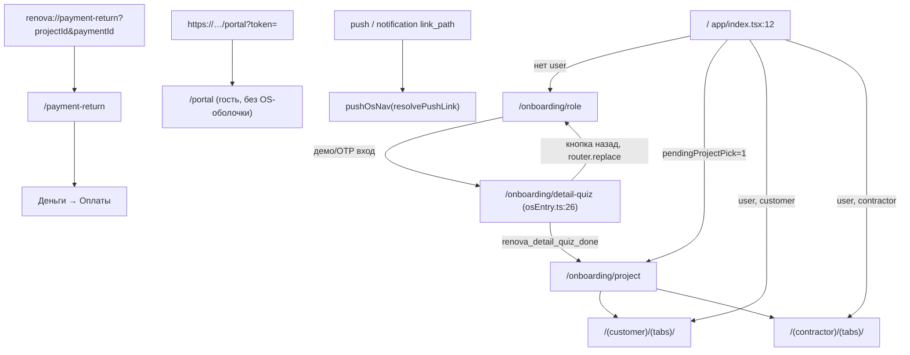
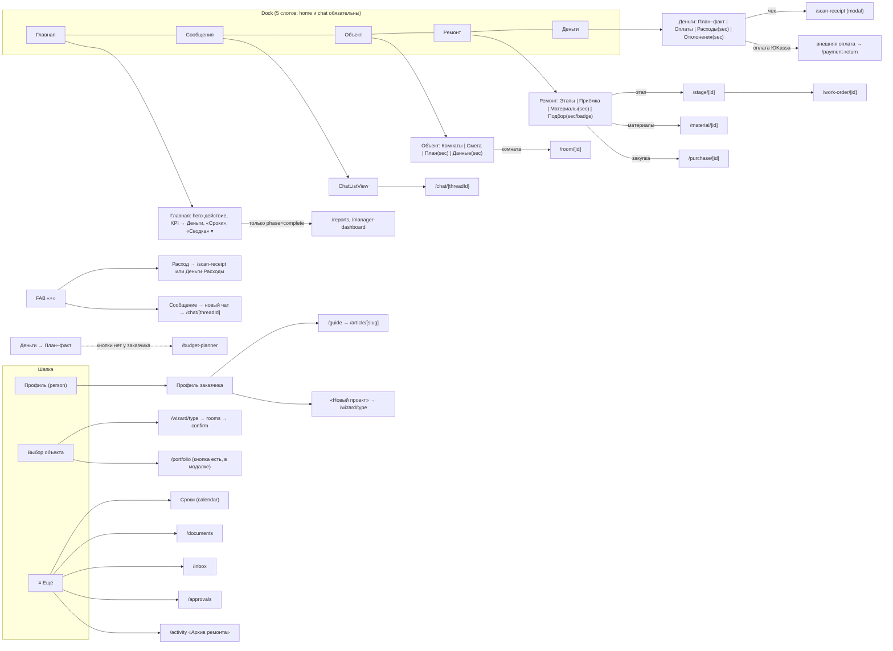
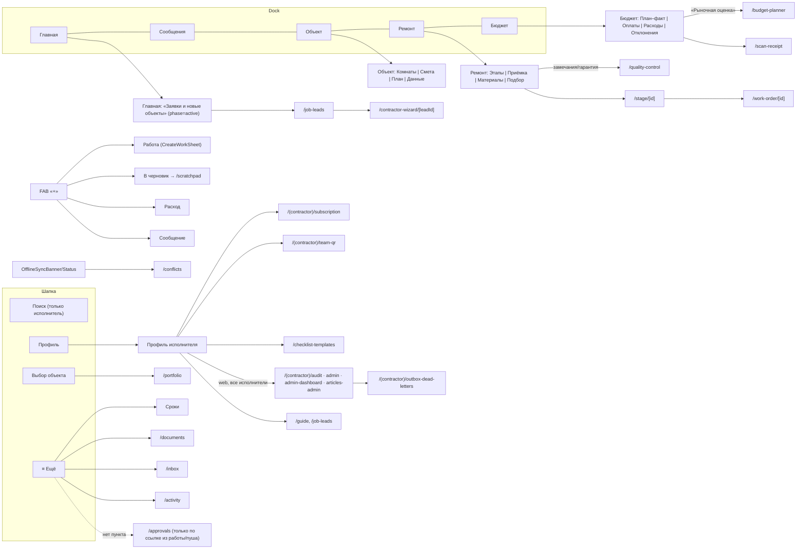
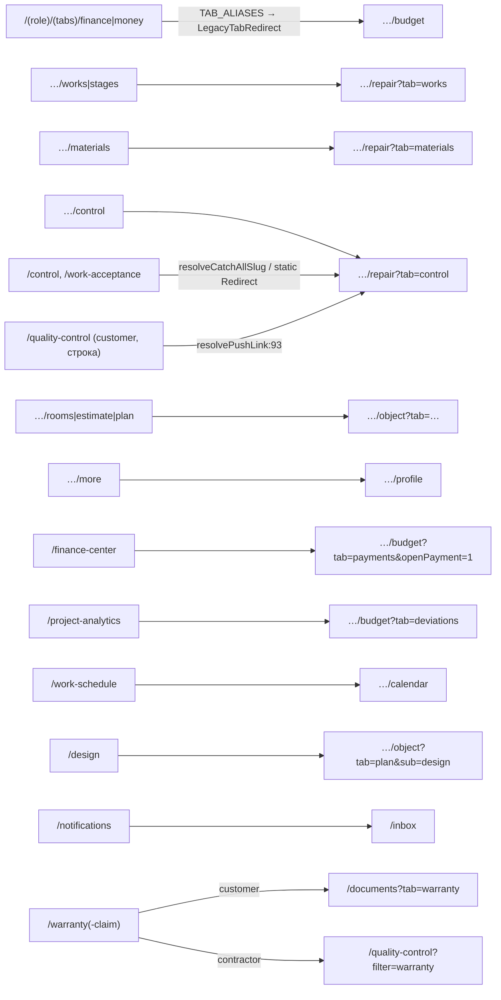
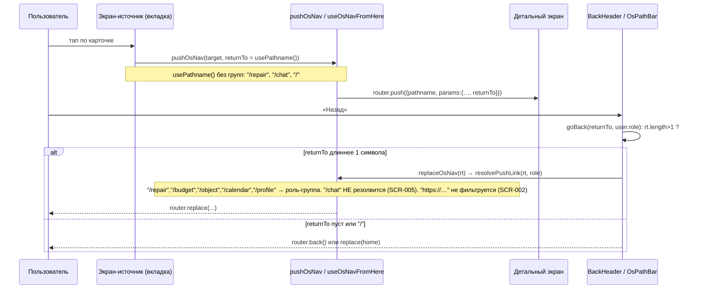

# 09. Перепись экранов приложения: маршруты и кнопки

Срез: `apps/mobile/app/**` (74 файла), `components/screens/**`, навигационное ядро (`lib/navigation*`, `legacyRoutes.ts`, `resolveCatchAllSlug.ts`, `constants/osSections.ts`). Состояние кода: `main` на 2026-09-30 (HEAD `fbe5082f`). Продуктовый код не менялся. Метод: чтение кода, существующие тесты навигации (`routeRegistry`, `pushOsNav`, `contractorToolStackCollision`, `osTabNav`, `legacyRoutes`, `pushLinks`, `backendNotificationLinks.contract`, `resolveCatchAllSlug` — все зелёные), точечные пробы `resolvePushLink`/`ProjectUpdate`, скрипт импорт-графа; подсрезы описаны параллельными подагентами (по тому же методу), их выводы сведены ниже. Живой backend не использовался.

## 0. Итоги

**Дефектов: 195 — P0: 6, P1: 40, P2: 84, P3: 65** (SCR 17: 0/3/7/7; HOM 31: 0/3/13/15; OBJ 38: 1/10/18/9; REP 44: 1/9/20/14; BUD 48: 1/9/26/12; INB 37: 3/6/20/8).

Ответы на вопросы задания:
- **(а) Недостижимые экраны:** из UI заказчика нет входа на `/job-leads`, `/contractor-wizard/*`, `/scratchpad`, `/checklist-templates`, `/budget-planner`; `/reports` и `/manager-dashboard` недоступны из UI до фазы «проект завершён» (SCR-004); `/quality-control` у исполнителя без ссылки из Приёмки (REP-14); `/portal` и `/payment-return` — только по внешней ссылке (так задумано); 26 компонентов `components/renova/**` вообще не подключены (SCR-009).
- **(б) Ссылки на несуществующие маршруты:** все литералы в `app/ components/ lib/ constants/` ведут на существующие файлы (проверено выборкой и тестом `backendNotificationLinks.contract`: 48 литералов, 64 маршрута). Исключение — backend `return_to='/(contractor)/(tabs)/plan'` (REP-39), работает только через алиас.
- **(в) Пустые/заглушечные обработчики, TODO, «скоро»:** grep по TODO/FIXME/«скоро»/пустым `onPress` в срезе чист. Зато есть «alert-заглушки» иного рода — `Alert.alert`, который на web ничего не делает (SCR-001).
- **(г) Кнопка видна, отказ получен:** SCR-007 (исполнитель → «Новый проект»), SCR-006 (админ-кнопки), REP-07/REP-29, HOM-серия, INB-05.
- **(д) Дубли и легаси-цепочки:** цепочек длиннее одного хопа нет, но четыре параллельных механизма редиректов и затенённые ветки catch-all (SCR-011).
- **(е) Экраны без loading/error/empty:** SCR-015, REP-23, отдельные пункты в подсрезах.
- **(ж) Расхождения со SCREEN-CONTRACT-CATALOG / SNAPSHOT:** SCR-012 (устаревшие SHA, красные гейты, маршрут записан не в реальном виде).

Топ-5 по риску: REP-09 (любая сторона меняет статус закупки и факт бюджета, P0), BUD-40/INB-01 (исполнитель выпускает портал-токен с правами заказчика: приёмка, подпись, оплата, P0), OBJ-03 (`PATCH /projects/{id}` без проверки роли, P0), INB-03 (contract gate снимается одной подписью), SCR-001 (`Alert.alert` — пустышка на web: молчаливые отказы и невыполняемые подтверждения).

## 1. Инвентарь среза

Все пути ниже — от `apps/mobile/`, если не указано иное. Срез: 74 файла в `app/**` (5084 строки, из них ~85 % — тонкие обёртки над `components/screens/**`), 24 экранных компонента верхнего уровня в `components/screens/**` (+ подпапки `budget/ control/ estimate/ object/ profile/ schedule/ stage/`), навигационное ядро в `lib/` и `constants/`.

### 1.1. Навигационное ядро (SoT и его дубли)

| Что | Файл:строка | Роль в навигации |
|---|---|---|
| Корневой `Stack` и список экранов | `app/_layout.tsx:80-103` | объявляет 22 экрана; `work-order`, `material`, `purchase`, `quality-control`, `work-acceptance`, `outbox-dead-letters` не объявлены и подхватываются авто-регистрацией expo-router с дефолтными опциями |
| Стартовый роутер | `app/index.tsx:12-42` | `!user → /onboarding/role`; иначе `pendingProjectPick==='1' → /onboarding/project`; иначе `tabsRoute(role,'index')` |
| Группа заказчика | `app/(customer)/_layout.tsx:6`, `(tabs)/_layout.tsx:13` | `OsRoleTabsNavigator role="customer"` (Slot + свой Dock, не `<Tabs>`) |
| Группа исполнителя | `app/(contractor)/_layout.tsx:6`, `(tabs)/_layout.tsx:11` | то же с `role="contractor"`, плюс `[tool]` |
| Оболочка вкладок | `components/renova/os/OsRoleTabsNavigator.tsx:31-45` | шапка `OsTabsHeaderBar` + `DataStatusBanner` + `<Slot/>` + `OsQuickFab` + `OsDockBar` |
| Нижняя панель (Dock) | `constants/dockBar.ts:31-41`, `components/renova/os/OsDockBar.tsx:81-125` | 9 возможных id, 5 слотов; `home`+`chat` обязательны; для заказчика в фазе setup — динамический пресет (`lib/domain/resolveDynamicDock.ts:48`) |
| Меню «Ещё» шапки | `components/renova/os/OsSectionMenu.tsx:44-160`, `lib/navigation/navigationPolicy.ts:58-88` | Сроки, Документы, Входящие, Согласования (только заказчик), История; для readOnly/гостя только Документы+Входящие |
| «+» (FAB) | `components/renova/os/OsQuickFab.tsx:31-140` | Расход (скан/вручную), Сообщение, у исполнителя ещё Работа и «В черновик»; скрыт при `readOnly` (стр. 60) |
| Реестр маршрутов | `lib/routeRegistry.ts:39-258` | 32 записи (`RENOVA_ROUTES`), `menuRoutes`, `assertRouteRegistryInvariants` |
| Единый push/replace | `lib/pushOsNav.ts:34-70` → `lib/pushLinks.ts:31-136` (`resolvePushLink`) → `lib/osDeepLink.ts:17` | строка → `{pathname, params}`; для вкладок `router.navigate`, для остального `router.push` |
| Алиасы легаси-вкладок | `lib/legacyRoutes.ts:5-25` (`TAB_ALIASES`, 19 записей), `components/routing/LegacyTabRedirect.tsx:23-52` | `(tabs)/[legacyTab]` → канонический хаб |
| Catch-all | `app/[slug].tsx:11`, `app/(contractor)/[tool].tsx:39`, `app/_stack/AppCatchAllScreen.tsx:57-109`, `lib/resolveCatchAllSlug.ts:67-83` | 9 «stack»-экранов + 7 легаси-slug → редирект, иначе 404 |
| Возврат «Назад» | `lib/navigation.ts:99-113` (`goBack`, `goHome`), `components/renova/BackHeader.tsx:22-64`, `lib/osReturnTo.ts`, `lib/breadcrumb.ts` | `returnTo` в query, `goBack` делает `replaceOsNav(returnTo)` |
| Секции OS | `constants/osSections.ts:15-223` | `tabsRoute`, `budgetTabRoute`, `objectTabRoute`, `repairTabRoute`, `calendarTabRoute`, `parseOsHref` |
| Push-уведомления | `lib/pushLinks.ts:146-177` (`resolveNotificationLink`), `lib/nativeNotifications.ts`, `app/_layout.tsx:42-46` | 27 типов уведомлений → маршрут |

### 1.2. Файлы маршрутов `app/**` (URL → экран)

Группы `(customer)`, `(contractor)`, `(tabs)` в URL не видны. Оба `(tabs)/chat` и оба `(tabs)/index` дают один и тот же URL (`/chat`, `/`) — какая группа выигрывает при «голом» `router.replace('/chat')`, зависит от expo-router (см. SCR-005).

| URL | Файл:строка default-экспорта | Что рендерит |
|---|---|---|
| `/` | `app/index.tsx:12` | редирект по сессии |
| `/onboarding/{role,project,detail-quiz}` | `app/onboarding/[step].tsx:7` → `_screens/role.tsx:19`, `project.tsx:14`, `detail-quiz.tsx:18` | выбор роли/входа, выбор объекта, квиз детализации |
| `/wizard/{type,rooms,confirm}` | `app/wizard/[step].tsx:7` → `_screens/type.tsx:21`, `rooms.tsx:42`, `confirm.tsx:40` (модальный `Stack` `wizard/_layout.tsx:4`) | мастер создания объекта (заказчик) |
| `/contractor-wizard/[leadId]` | `app/contractor-wizard/[leadId].tsx:27` | мастер отклика исполнителя на заявку |
| `/(customer)/(tabs)/` и `/(contractor)/(tabs)/` | `index.tsx:4` | `OsHomeScreen` |
| `…/(tabs)/object` | `object.tsx:4` | `OsObjectHubScreen` |
| `…/(tabs)/repair` | `repair.tsx:4` | `OsRepairHubScreen` |
| `…/(tabs)/budget` | `budget.tsx:4` | `OsBudgetHubScreen` |
| `…/(tabs)/calendar` | `calendar.tsx:4` | `OsCalendarScreen` |
| `…/(tabs)/chat` | `chat.tsx:23` | `ChatListView` |
| `…/(tabs)/profile` | `profile.tsx:3` | `CustomerProfileScreen` / `ContractorProfileScreen` |
| `…/(tabs)/[legacyTab]` | `[legacyTab].tsx:8` / `:5` | `LegacyTabRedirect` |
| `/stage/[id]` | `app/stage/[id].tsx:3` | `StageDetailScreen` |
| `/room/[id]` | `app/room/[id].tsx:3` | `RoomDetailScreen` |
| `/work-order/[id]` | `app/work-order/[id].tsx:4` | `WorkOrderDetailScreen` |
| `/material/[id]` | `app/material/[id].tsx:45` | карточка подбора материала |
| `/purchase/[id]` | `app/purchase/[id].tsx:24` | карточка закупки |
| `/chat/[threadId]` | `app/chat/[threadId].tsx:15` | ACL-проверка → `ChatThreadView` |
| `/article/[slug]` | `app/article/[slug].tsx:9` | статья гида |
| `/approvals` | `app/approvals.tsx:23` | центр согласований |
| `/activity` | `app/activity.tsx:19` | история проекта |
| `/documents` | `app/documents.tsx:9` | `DocumentsHub` |
| `/inbox` | `app/inbox.tsx:6` | `UnifiedInboxScreen` |
| `/quality-control` | `app/quality-control.tsx:3` | `QualityControlScreen` (замечания/гарантия, исполнитель) |
| `/work-acceptance` | `app/work-acceptance.tsx:5` | `<Redirect>` в Ремонт→Приёмка |
| `/scan-receipt` | `app/scan-receipt.tsx:32` | скан/ручной ввод чека (модальный) |
| `/payment-return` | `app/payment-return.tsx:14` | возврат из ЮKassa (`renova://payment-return`) |
| `/portal` | `app/portal.tsx:1` → `PortalScreen` (967 строк) | гостевой портал по magic-link |
| `/portfolio`, `/reports`, `/guide`, `/job-leads` | `app/portfolio.tsx:8`, `reports.tsx:2`, `guide.tsx:2`, `job-leads.tsx:2` | статические копии stack-экранов |
| `/outbox-dead-letters` | `app/outbox-dead-letters.tsx:1` | re-export админ-экрана |
| `/{budget-planner,checklist-templates,conflicts,manager-dashboard,scratchpad}` | `app/[slug].tsx:11` → `AppCatchAllScreen.tsx:43-53` | stack-экраны через catch-all |
| `/{admin,admin-dashboard,articles-admin,audit,subscription,team-qr,outbox-dead-letters}` | `app/(contractor)/[tool].tsx:12-45` | админ/подписка/QR бригады |
| `/{notifications,work-schedule,finance-center,project-analytics,design,control,warranty,warranty-claim}` | `lib/resolveCatchAllSlug.ts:23-54` | легаси-slug → редирект |
| прочее | `app/+not-found.tsx:8`, `app/+html.tsx:8` | 404, html-шаблон web |
| `/_stack/*`, `/(contractor)/_screens/*`, `/onboarding/_screens/*`, `/wizard/_screens/*` | файлы в `_`-папках | по комментарию автора (`AppCatchAllScreen.tsx:111-116`) expo-router обходит и `_`-папки; это лишние URL-двойники экранов (гипотеза, не проверено в рантайме) |

### 1.3. Экранные компоненты (`components/screens/**`)

`OsHomeScreen` (420), `OsObjectHubScreen` (49) → `OsRoomsScreen` (664), `OsEstimateScreen` (12) → `estimate/{Customer,Contractor}EstimateView`, `OsPlanTabScreen` (113), `OsProjectProfileScreen` (215); `OsRepairHubScreen` (102) → `OsWorksScreen` (382), `OsMaterialsScreen` (375), `OsSelectionsScreen` (306), `OsControlScreen` (15) → `control/{Customer,Contractor,TechnicalSupervision}ControlView`; `OsBudgetHubScreen` (43) → `OsBudgetScreen` (223) → `budget/*Section`; `OsCalendarScreen` (17) → `schedule/UnifiedScheduleView`; `profile/{Customer,Contractor}ProfileScreen`; `StageDetailScreen` (573) + `stage/*`; `RoomDetailScreen` (365); `WorkOrderDetailScreen` (232); `QualityControlScreen` (485); `UnifiedInboxScreen` (207); `PortalScreen` (967); `GuideScreen` (41); `ManagerDashboardScreen` (206); `ScratchpadScreen` (353).

## 2. Матрица «кто что может» — уровень маршрутов

**Главный вывод:** проверка роли/владения на клиенте в маршрутизации отсутствует. Ни один `_layout.tsx` не сверяет `user.role` с группой (`grep "role !==" app` пусто; layouts `app/(customer)/_layout.tsx:6`, `app/(contractor)/_layout.tsx:6`, `OsRoleTabsNavigator.tsx:31`). Роль экрана берётся из **группы маршрута** (`<OsHomeScreen role="customer">`), а не из `user.role`. Единственные гейты: (а) `Platform.OS==='web'` у админ-кнопок (`AdminHubLink.tsx:8`, `ContractorProfileScreen.tsx:197`), (б) `readOnly` у FAB/кнопок записи, (в) `access_mode==='supervisor'` в `OsControlScreen.tsx:10`, (г) серверные проверки. Ниже: «Видимость» — где есть ссылка, «Клиентская защита» — есть ли проверка при прямом URL, «Сервер» — что реально останавливает.

| Маршрут | Заказчик | Исполнитель | Гость/viewer (readOnly) | Клиентская защита при прямом URL | Сервер |
|---|---|---|---|---|---|
| 7 вкладок `(tabs)` своей группы | да | да | да (кнопки записи скрыты `readOnly`) | нет: чужая группа откроется с UI чужой роли | `require_project`/RBAC на каждом API |
| `/wizard/*` | да | ссылка только у заказчика (`ProjectEmptyState.tsx:387`, `CustomerProfileScreen.tsx:128`, `OsProjectPicker.tsx:354`), роль зашита `'customer'` | нет | нет | `POST /projects` |
| `/contractor-wizard/[leadId]` | прямой URL | из `JobLeadsBoard.tsx:239` | — | нет | `job-leads` API |
| `/job-leads` | прямой URL | Home, профиль, EmptyState | — | нет (`_stack/job-leads.tsx:10` пускает любую роль, только `if(!user) return null`) | API |
| `/approvals` | «Ещё», Home, Inbox, push | ссылки скрыты (`navigationPolicy.ts:80`), но открывается из `WorkOrderDetailPanel.tsx:103` и push `approval` (`pushLinks.ts:162`) | видит, решать нельзя (`approvals.tsx:53` `!isCustomer\|\|readOnly`) | частично (кнопки) | `approvals` API |
| `/documents`, `/inbox`, `/activity` | да | да | да (`READ_ONLY_MORE_IDS`) | — | ACL проекта |
| `/quality-control` | подменяется на Приёмку/Документы (`pushLinks.ts:93-101`), но «голый» `router.push({pathname:'/quality-control'})` этого не делает | да | нет | нет | API |
| `/reports`, `/manager-dashboard` | только в фазе `complete` (`navigationPolicy.ts:83`) | то же | нет | нет | — |
| `/portfolio`, `/conflicts`, `/scratchpad` | прямой URL | да | — | нет | — |
| `/checklist-templates` | прямой URL | профиль | — | нет | шаблоны привязаны к user |
| `/budget-planner` | прямой URL | кнопка «Рыночная оценка» только исполнителю (`BudgetSummarySection.tsx:272`) | — | `readOnly`/`useWriteAllowed` | PATCH молча игнорирует поле (SCR-003) |
| `/(contractor)/{admin,admin-dashboard,articles-admin,audit,outbox-dead-letters}` | прямой URL | кнопки у **каждого** исполнителя на web (`AdminHubLink.tsx:12-14`, `ContractorProfileScreen.tsx:198-204`) | — | нет | `require_admin_user` (`backend/app/api/admin_access.py`): в staging/prod только id из `ADMIN_USER_IDS`, локально любой исполнитель |
| `/(contractor)/{subscription,team-qr}` | прямой URL | профиль/бригада | — | нет | API подписки/бригады |
| `/portal` | только по magic-link (заказчик-гость) | — | основной сценарий | токен в query | portal-API по токену |
| `/payment-return` | deep link ЮKassa | — | — | нет user → «Неверная ссылка» | — |

Где роль решает поведение внутри общего экрана: `OsControlScreen.tsx:10-14` (supervisor → технадзор, contractor → исполнитель, иначе заказчик), `OsEstimateScreen.tsx:9-11`, `OsHomeScreen.tsx:` `snapRole = readOnly ? 'customer' : role`, `OsTabsLayoutOptions.tsx:33` (поиск только у исполнителя), `OsQuickFab.tsx:53-73`, `OsSectionMenu` (`navigationPolicy.ts:80` — «Согласования» скрыты у исполнителя).

## 3. Карты навигации и последовательности

### 3.1. Вход и старт приложения

### 3.2. Карта навигации заказчика (customer)

Оболочка на каждом экране группы: шапка (лого · профиль · выбор объекта · ≡«Ещё»), путь/«Назад», нижний Dock, FAB «+».

Недостижимо из UI заказчика: `/budget-planner`, `/job-leads`, `/contractor-wizard/*`, `/scratchpad`, `/checklist-templates`, `/conflicts` (баннер офлайна есть, ссылка `OfflineSyncBanner.tsx:39` показывается и заказчику), `/(contractor)/*` — доступны только прямым URL.

### 3.3. Карта навигации исполнителя (contractor)

### 3.4. Легаси-редиректы и цепочки

Цепочек длиннее одного хопа нет: каждый легаси-адрес сразу указывает на канон (проверено `resolveCatchAllSlug.test.ts`, `legacyRoutes.test.ts`, `pushLinks.test.ts` — все зелёные). Но один и тот же легаси-адрес обслуживается **четырьмя параллельными механизмами** (статический файл `work-acceptance.tsx`, `legacySlugRedirect`, `resolvePushLink`, `RENOVA_ROUTES.redirectTarget`) — см. SCR-013.

### 3.5. Последовательность «Назад» (returnTo)

## 4. Кнопки, функции и опции по экранам

Оболочка (общая для всех вкладок): шапка `OsTabsHeaderBar` (`OsTabsLayoutOptions.tsx:22-71`) — логотип → `router.replace(главная)` (`OsRenovaLogo.tsx:8`); «Поиск» (только исполнитель) → `OsSearchModal`; «Профиль» → `pushOsTabNav(role,'profile')`; выбор объекта `OsProjectPicker` (переключить объект → `loadProject`, 402 → paywall; «Портфель» при ≥2 объектах → `/portfolio`; «Данные объекта» → `pushTab('object','profile')`; «Новый проект» → `/wizard/type`; архив/корзина только заказчику `:128`); «≡ Ещё» `OsSectionMenu.tsx:91-140` → `replaceOsNav` для «Сроки», `pushOsNav(route.path)` для остальных; Dock `OsDockBar.tsx:81-89` → `router.navigate(tabsRoute)`; FAB `OsQuickFab.tsx:53-125` (не показывается при `readOnly`, `:60`). Далее — покарточная перепись экранов пяти подсрезов.

### 4.1. Главная, вход, онбординг, мастера, заявки, выбор объекта (подсрез HOM, источник: перепись подагента)

### Перепись экранов Renova: главная, вход/онбординг, мастера, заявки, выбор объекта (срез HOM)

Все пути относятся к `/Users/petr/renova/apps/mobile`, если не указано `backend:`. Backend читался по коду `/Users/petr/renova/backend/app`. Продуктовый код не менялся, backend не дёргался.

Условные обозначения ролей: **Зак** — customer; **Исп** — contractor; **Гость/RO** — readOnly (флаг `readOnly` из `useRenova()`, который = `read_only` проекта ИЛИ `teamAccess.readOnly` у исполнителя с командной ролью `viewer`/не определённой: `lib/context/RenovaContext.tsx:231-233`, `lib/domain/teamAccess.ts:26-31,80-89`). Гость в бэкенде — не отдельная роль, а пользователь-заказчик, привязанный как viewer к проекту (`backend/app/api/v1/auth.py:222`).

Общая механика навигации, на которую ссылаются таблицы:
- `pushNav(x)` = `pushOsNav(x, pathname, role)` (`lib/navigation.ts:40`); `pushScreen(path)` = то же со строкой (`lib/navigation.ts:44-51`); `pushTab(name, hubTab)` = `router.navigate(tabsRoute(...))` (`lib/osTabNav.ts:10-20`).
- Строки резолвятся в `resolvePushLink` (`lib/pushLinks.ts:31-136`): `/documents /inbox /approvals /activity /reports /job-leads /portfolio …` — `STACK_PATHS` (`:10-14`), `/control /work-acceptance` → Ремонт→Приёмка, `/stage/…`, `/room/…` и т.д.
- Маршруты, существующие как файлы: `app/index.tsx`, `app/onboarding/[step].tsx`, `app/wizard/[step].tsx`, `app/contractor-wizard/[leadId].tsx`, `app/job-leads.tsx`, `app/portfolio.tsx`, `app/documents.tsx`, `app/inbox.tsx`, `app/approvals.tsx`, `app/activity.tsx`, `app/reports.tsx`, `app/(customer|contractor)/(tabs)/{index,object,repair,budget,calendar,chat,profile}`. `/manager-dashboard` и `/budget-planner`… существуют только через catch-all `app/[slug].tsx` → `app/_stack/AppCatchAllScreen.tsx:43-53`.

---

### ЧАСТЬ 1. Вход, роль, квиз, стартовый редирект

#### 1.1 `app/index.tsx` — стартовый редирект
- Файл: `app/index.tsx`. Роли: все. Логика `:15-27`: нет `user` → `/onboarding/role`; есть `pendingProjectPick === '1'` → `/onboarding/project`; иначе `tabsRoute(user.role, 'index')`.
- Откуда попадают: первый маршрут приложения; `Redirect` из `app/onboarding/[step].tsx:13`, `app/wizard/[step].tsx` (не сюда), `goHome` через `homeRoute`.
- Интерактивных элементов нет (спиннер `:29-35`).
- Замечания: `AsyncStorage.getItem(...).then(...)` без `.catch` (`:20`) — при отказе хранилища `href` не ставится и экран остаётся на спиннере навсегда (гипотеза: отказ хранилища редок). Роль берётся из `user.role` сервера (`:26`) — в отличие от `navigateAfterLogin` (см. HOM-01).

#### 1.2 `app/onboarding/[step].tsx` — диспетчер шагов онбординга
- `role | project | detail-quiz` → соответствующий экран, иное → `/onboarding/role` (`:8-13`).
- Ссылки внутрь: `app/index.tsx:19,39`, `lib/osEntry.ts:14,28` (`/onboarding/project`, `/onboarding/detail-quiz`), `components/renova/RoleSwitchButton.tsx:28`, `detail-quiz.tsx:36`, `OsPendingProjectPickEffect.tsx:35`.
- Последовательность мастера входа: **role → (detail-quiz, если на устройстве нет `renova_detail_quiz_done`) → (project, если `pendingProjectPick==='1'`) → tabs** (`lib/osEntry.ts:26-37`).

#### 1.3 `app/onboarding/_screens/role.tsx` — «Кто вы в этом проекте?» (вход)
- Роли: аноним (единственный экран без сессии). Параметр `?teamToken=` (вступление в бригаду, только для роли «Исполнитель», `:20,34,37`).
- Откуда: `app/index.tsx`, `RoleSwitchButton` (после logout), `detail-quiz.backToRole`.
- Режимы: `demo` (только при `EXPO_PUBLIC_DEMO=1`, `:15,22`) и `sms`.

| Элемент | Обработчик (file:line) | Куда / какой API | Кто видит | Серверная проверка | При ошибке |
|---|---|---|---|---|---|
| Чип «Демо-стенд» / «SMS» | `role.tsx:118-125` `setMode(m); setCodeSent(false)` | локальное состояние; в проде виден один чип «SMS» | все; disabled при `teamJoinPending` | — | — |
| Плитки «Заказчик» / «Исполнитель» | `role.tsx:135-142` `setRole(r)` | локальное; по умолчанию `customer` (`:23`) | все; disabled при `teamJoinPending` | для существующего пользователя сервер роль ИГНОРИРУЕТ (`backend: auth.py:119-158`, роль применяется только при создании, `:137-146`) | — |
| Поле «Телефон +7…» | `role.tsx:147` `setPhone` | — | режим SMS | `SmsSendRequest`: 10..20 симв. (`backend: schemas/auth.py:39-42`) | сервер вернёт 422/400 → показывается в `error` |
| Поле «Код из SMS» | `role.tsx:148` | — | только после `codeSent` | `SmsVerifyRequest.code` 4..8 симв. (`schemas/auth.py:47`) | «Неверный или просроченный код» (`auth.py:128`) → `error` + sheet |
| Поле «Имя (необязательно)» | `role.tsx:149` | уходит в `verifySmsCode` только при создании аккаунта | SMS | — | — |
| «Отправить код» / «Продолжить» / «Повторить вступление» | `role.tsx:159-163` → `onContinue` `:66-96` | demo: `api.demoLogin` (`RenovaContext.tsx:530`); sms шаг 1: `api.sendSmsCode` POST `/api/v1/auth/sms/send` (`:80`); шаг 2: `loginWithSms` → POST `/auth/sms/verify` (`:86`); затем `afterLogin` (`:36-64`): при `teamToken` `api.joinTeam`, затем `navigateAfterLogin(role)` (`:63`) | все | 429 rate-limit/locked, 503 (`backend auth.py:104-116`) | `catch :89-93` → `setError` + `alertMessage` (двойной показ: текст на экране и sheet) |
| «Продолжить без вступления» | `role.tsx:164-168` → `continueWithoutTeam` `:98-111` | `navigateAfterLogin(role)` | только `teamJoinPending` (вход есть, вступление не удалось) | — | `catch` → `alertMessage` |
| Текст «После входа: «Ещё» → «← Выбор роли»» | `role.tsx:170` | подсказка; кнопка находится в профиле (`RoleSwitchButton`) | все | — | — |

Последовательность и блокировки шага: «Отправить код» → поле «Код» → «Продолжить». Повторной отправки кода **нет**: единственный способ — нажать чип «SMS» (сбрасывает `codeSent`, `:122`), это неочевидно (HOM-15). Правка телефона после отправки кода `codeSent` не сбрасывает (`:147`). Возврат назад — `Redirect` не предусмотрен, экран корневой. Ввода ИНН нет, хотя backend умеет проверку НПД для исполнителя (`auth.py:135-141`) — из этого экрана недостижима (гипотеза: ИНН может вводиться в профиле).
Роли «Наблюдатель/Гость» на экране нет; `api.demoGuest` (`lib/api/auth.ts:12`) нигде не вызывается — вход гостем из UI отсутствует.

#### 1.4 `app/onboarding/_screens/detail-quiz.tsx` — «Как показывать информацию?»
- Роли: любой вошедший. Откуда: `navigateAfterLogin` при отсутствии `renova_detail_quiz_done` (`lib/osEntry.ts:26-30`).

| Элемент | Обработчик | Куда / API | Кто | Серверная | Ошибка |
|---|---|---|---|---|---|
| «← Выбор роли / Заказчик · Исполнитель · Наблюдатель» | `detail-quiz.tsx:34-37,40` `logout()` → `router.replace('/onboarding/role')` | `api.logout(refresh)` в `RenovaContext.tsx:731-765` | все | — | ошибка отзыва только в лог (`:740-743`); подпись НЕ говорит о выходе из аккаунта (в отличие от `RoleSwitchButton`, где есть a11y-подпись) |
| Карточки «Кратко/Стандарт/Подробно» | `:45-50` `setMode` | локально; по умолчанию `detailed` для роли исполнителя, иначе `standard` (`:21`) | все | — | — |
| `DetailLevelPreview` | `components/renova/DetailLevelPreview.tsx:2-6` | статичный список блоков «Превью главной» | все | — | обещает блоки, которых на главной нет (HOM-10) |
| «Продолжить» | `:23-33,51` `finish` | пишет `renova_detail_level`, `renova_detail_quiz_done` в AsyncStorage; `navigateAfterLogin(role)` — роль читается из `renova_user_role`, записанной из UI-выбора, а не из сервера (`lib/osEntry.ts:26`) | все | — | `try/finally` без `catch` (`:25-32`): исключение уйдёт необработанным, кнопка разблокируется без сообщения |

Замечания: флаги квиза глобальны на устройство, не на аккаунт; `logout` их не чистит (`RenovaContext.tsx:746-753`) — второй аккаунт на устройстве квиз не увидит. Экран не показывает «пропустить».

#### 1.5 `app/onboarding/_screens/project.tsx` — «Выберите объект» (после входа)
- Роли: Зак / Исп / Гость. Откуда: `app/index.tsx:22`, `navigateAfterLogin`, `OsPendingProjectPickEffect.tsx:35`.
- Рендерит `ProjectEmptyState` (`autoPick={false}`, `hideHomeButton`, `onSelectProject`) — элементы см. §4.4.
- `enterProject` (`:20-33`): `loadProject(id)` → `AsyncStorage(projectExplicitlyPicked=1)`, снять `pendingProjectPick`, `replaceOsNav(osEntryRoute(role))`. Ошибка: `alertMessage('Не удалось открыть объект', …)` (`:29`), без повторной генерации — поэтому подписка (402) до `showPaywall` не доходит (`ProjectEmptyState.tsx:253` ловит только выброшенное). Если `loadProject` тихо вернулся при rate-limit (`RenovaContext.tsx:329`), экран всё равно снимает флаг и уходит на главную без активного объекта (HOM-12).
- Нет кнопки «выйти/сменить роль» и нет заголовка/назад (`app/_layout.tsx:82` — headerShown:false на корне) — вкладки недоступны, пока не выбран объект (`OsPendingProjectPickEffect` возвращает сюда с любой вкладки, кроме `/profile`, `:28-35`). Для нового исполнителя без объектов путь один: «Найти заявки» / «Профиль и бригада» (§4.4).

#### 1.6 Контекст входа: `lib/osEntry.ts` и `RenovaContext`
- `navigateAfterLogin(role)` `:20-37`: сначала пишет `renova_user_role = role` (роль **из UI**), затем quiz→pick→tabs.
- `RenovaContext`: `loginWithSms` `:555-582` (не возвращает пользователя; если в хранилище есть `projectId` и он есть в списке — грузит объект и снимает `pendingProjectPick`, иначе ставит `pendingProjectPick=1`); `demoLogin` `:530-553` (всегда ставит `pendingProjectPick=1`, ошибка списка проектов → `list=[]` `:543-546`); `loadProject` `:293-335`; `logout` `:731-765` (чистит токены, `pendingProjectPick`, `projectExplicitlyPicked`, wizard; **не** чистит `renova_detail_*`, `renova_home_widgets_*`, `renova_portfolio_selected_ids`, `renova_setup_checklist_dismiss_*`).
- У исполнителя `loadProject` вызывает `POST /projects/{id}/assign` (`:306`); любая ошибка, кроме 402/«subscription», проглатывается — идём дальше с данными `getProject` (`:306`).

#### 1.7 `components/renova/RoleSwitchButton.tsx`
- Где: профиль заказчика `CustomerProfileScreen.tsx:72`, исполнителя `ContractorProfileScreen.tsx:124`.
- «← Выбор роли» (`:33-44`, `:47-57`) → `onPress :26-29`: `logout()` + `replaceOsNav('/onboarding/role')` — **без подтверждения**; фактически выход из аккаунта. У компактной версии подпись «{роль} · сменить →» звучит как переключатель, a11y-подпись честная (`:19-20`). Кто: все роли (в т.ч. Гость). Ошибка `logout` не ловится вовне (внутри — только в лог).
- Важно: «смена роли» возможна только под другим номером — на тот же номер сервер вернёт прежнюю роль (HOM-01).

---

### ЧАСТЬ 2. Главная: `components/screens/OsHomeScreen.tsx`

- Роли: Зак и Исп (`app/(customer)/(tabs)/index.tsx:7`, `app/(contractor)/(tabs)/index.tsx:7`, оба внутри `OsTabFocusGate`), плюс Гость/RO (заказчик с `readOnly`; для `readOnly` снимок строится как для заказчика, `OsHomeScreen.tsx:99`).
- Откуда попадают: `app/index.tsx`, `enterProject`, `PortfolioProjectsView.openProject` (`:151`), dock «Главная», `homeRoute`.
- Нет объекта / состояния (`:324-365`): `!user` → пустой экран (`return null`, `:324`); исполнитель без проектов → «Нет объектов» + одна кнопка (`:326-333`); есть проекты, но нет активного → спиннер «Загрузка объекта…» (`:335-343`) или `ProjectEmptyState` (`:344-350`); `loading && !dash` → спиннер (`:353`); нет `dash`/`snap` → «Не удалось загрузить главную» + «Повторить» (`:357-365`); частичная загрузка → жёлтая плашка (`:388-390`), скрывается, если глобальный баннер «нет связи/устарели» уже виден.
- Загрузка (`load` `:130-262`): 17 параллельных источников (dashboard, payments, receipts, material-picks, purchases, os/risks, os/schedule, os/insights + digest preview, budget-alerts, os/budget, acceptances pending, work schedule, warranty-claims, change-orders, project documents, offline outbox, closeout-checklist). Каждый отказ → `reportError` + флаг «частично» (`:238-250`); данные того же объекта сохраняются. Серверные чтения: `require_project(write=False)` (`backend: api/deps.py:112-135`) — для Зак/Исп/Гость 403 на них не ожидается (`os.py:49-57,310-314,424-428,452-458`, `purchases.py:68-76`, `payments.py:89-98`, `export.py:373-386,519-546,687-696`).
- Перезагрузки: `useEffect :264` (при смене объекта + `refreshProjects`), подписка на `projectDataBus` (`:277`), pull-to-refresh (`:316-319,387`: `refreshProjects` + `loadProject` + `load` — `loadProject` сам шлёт `notifyProjectDataChanged` (`RenovaContext.tsx:322`), поэтому `load` идёт дважды подряд, см. HOM-24).

| Элемент | Обработчик (file:line) | Куда / API | Кто видит | Серверная проверка | При ошибке |
|---|---|---|---|---|---|
| «Заявки и новые объекты» (пустой экран исп.) | `OsHomeScreen.tsx:330` | `pushOsNav('/job-leads', undefined, role)` → `app/job-leads.tsx` | Исп при `projects.length===0` | — | — (кнопки «обновить»/«профиль» нет, в отличие от `ProjectEmptyState`) |
| «Повторить» | `OsHomeScreen.tsx:362` | `load()` | все при `!dash||!snap` | — | `catch → reportCatch` (молча) |
| Pull-to-refresh | `:316-319,387` | `refreshProjects`, `loadProject`, `load` | все | — | `try/finally`, исключения `refreshProjects` вылетают из обработчика |
| `ProjectEmptyState` (нет активного объекта) | `:344-350` | см. §4.4 | Зак / Исп (проекты есть, объект не выбран) | — | — |

#### 2.1 `HomeScreenBody` (`components/renova/os/home/HomeScreenBody.tsx`)
Порядок блоков: шапка → синхронизация → подзаголовок гостя → подсказка профиля и чеклист (только Зак и не RO, `:117-122`) → ссылка «Заявки» (Исп, фаза active, `:124-126`) → плашка приёмки (`:130-136`) → «Сделать сейчас» (`:137-146`) → «Деньги/Сводка» (`:149-157`) → «В работе» (`:160-164`) → «Сроки» (`:166-168`) → «Сводка» раскрывающаяся (`:171-205`).

| Элемент | Обработчик | Куда / API | Кто видит | Серверная | Ошибка |
|---|---|---|---|---|---|
| `ProjectOsHeader` (название, «Завершён», бейдж здоровья) | `ProjectOsPanels.tsx:21-61` | без нажатий | все | — | — |
| `OfflineSyncStatus compact` | `HomeScreenBody.tsx:112` | встроенный компонент (вне среза) | все | — | — |
| Подсказка «Добавьте …» / «Профиль →» | `ProjectProfileHint.tsx:45-50` → `pushTab('object','profile')` | вкладка Объект→Профиль | Зак, не RO | — | — |
| «×» скрыть подсказку | `ProjectProfileHint.tsx:52-59` | `AsyncStorage renova_profile_hint_dismiss_{id}` | Зак | — | `.catch(reportCatch)`; вернуть подсказку нельзя |
| `HomeSetupChecklist`: «×» | `HomeSetupChecklist.tsx:55-66` | AsyncStorage `renova_setup_checklist_dismiss_{id}` | Зак не RO, фаза `active`, прогресс <80% (`buildSetupChecklist.ts:31-34,97-103`) | — | молча |
| `HomeSetupChecklist`: «Продолжить: {шаг}» | `HomeSetupChecklist.tsx:78-84` → `pushNav(next.href)` | href из `buildSetupChecklist.ts:44-88` (`/(customer)/(tabs)/object?tab=profile|rooms|estimate`, `repair?tab=works`, `budget?tab=summary`, `profile?focus=contractor`) | то же | — | — |
| «Заявки и новые объекты» | `HomeScreenBody.tsx:125` → `pushScreen('/job-leads')` | `app/job-leads.tsx` | Исп, только фаза `active` (в фазах «закрытие/завершён» ссылки нет). Не проверяет `readOnly` (у Исп-viewer ссылка остаётся) | — | — |
| `HomeAcceptanceBanner` «N этап(ов) ждут …» | `HomeAcceptanceBanner.tsx:27-32` → `pushOsNav(href \|\| repairTabRoute(role,'control'), returnTo)` | `/stage/{id}` (`snap.activeWorks.find(review)`) либо Ремонт→Приёмка | Зак и Исп, **включая RO** (`HomeScreenBody.tsx:130-136` без `readOnly`); формулировка Зак: «ждут вашей приёмки» | принять этап — запись (`write=True` → 403 для RO: `team_service.py:509-515`) | — (навигация) |
| `HomeActionHero`: заголовок hero и кнопка `hero.button` | `HomeActionHero.tsx:79-83` `pushNav(hero.href)`; для RO — строка «Посмотреть · …» `:73-77` | href из `buildProjectOsSnapshot.ts:175-431` (оплата `budgetTabRoute(…payments…)`, `/stage/{id}`, `/documents`, `/inbox`, календарь, смета, материалы, профиль→исполнитель) | Зак/Исп/RO (показ: `showAttention` и фаза ≠ complete, `HomeScreenBody.tsx:137`) | конечные экраны сами проверяют права | — |
| «Все задачи (N) →» / «Входящие →» | `HomeActionHero.tsx:57-64` → `pushOsNav('/inbox', returnTo, role)` | `app/inbox.tsx` | **нигде не показывается**: условие `showInbox`=`isVisible('inbox')`, а `inbox` скрыт из каталога, отсутствует в пресетах и вычищается миграцией (`constants/homeWidgets.ts:39,49-80`, `lib/homeWidgetPrefs.ts:73-85,113`) — HOM-09 | — | — |
| До 2 «вторичных» задач | `HomeActionHero.tsx:88-107` → `navigateApproval` / `pushNav(target.href)` | `resolveInboxNavigation` | тоже недостижимо (`showInbox=false`) | — | — |
| Подсказка-копилот | `HomeActionHero.tsx:109-115` → `pushNav(insight.href)` | href из `/os/insights` | Зак/Исп при `insights`-виджете (в пресете «Подробно»), `secondary.length<2` | `os.py:452-458` | — |
| Зона «Деньги»/«Сводка»: «Подробнее →» | `HomeScreenBody.tsx:153` `pushNav(budgetTabRoute(role,'summary',{period:'month',focus:'fact'}))` | Бюджет→Сводка | Зак/Исп/RO, фаза ≠ closing; заголовок «Сводка» у Исп дублируется с блоком «Сводка» ниже (HOM-22) | — | — |
| KPI-плитки (Бюджет/Сроки/Материалы/Качество) | `ProjectOsPanels.tsx:94` `setDetailWidgetId` → `HomeKpiDetailSheet` | открывает лист | по виджетам; «Материалы» — только `needBuy>0`, «Качество» — только `awaitingAcceptance>0` и hero≠accept, «Бюджет» скрыт при hero=payment (`:72-80`) | — | — |
| `HomeKpiDetailSheet`: главная кнопка (`detail.actionLabel`) | `HomeKpiDetailSheet.tsx:76-83` `onClose(); pushNav(detail.actionHref)` | `budget?tab=payments&openPayment=1`, `budget?tab=summary`, `/documents`, календарь, материалы, Приёмка (`lib/domain/buildHomeKpiDetail.ts:60,75,94,109,125,141,156`) | все роли; подпись «Оплатить →» одна и та же для Исп и RO (`:60,94`) — HOM-16 | — | — |
| `HomeKpiDetailSheet`: «Закрыть», фон | `:41,84-86` | закрыть | все | — | — |
| «Работы»/«Материалы» (2 колонки) | `ProjectOsPanels.tsx:164,174` `pushNav(w.href / m.href)` | `/stage/{id}`, `/material/{id}` | Зак/Исп/RO, `works_materials` (только пресет «Подробно», `homeWidgets.ts:72-85`) | — | — |
| «Сроки» | `HomeScreenBody.tsx:167` `pushTab('calendar')` | вкладка Календарь | все при виджете `schedule` (есть в «Кратко/Стандарт/Подробно») | — | — |
| Раскрывающаяся «Сводка» (шапка) | `HomeMoreSection.tsx:29-45` | локальный toggle | показ: `readOnly \|\| moreHasContent \|\| phase==='complete'` (`HomeScreenBody.tsx:79`) | — | — |
| «Документы», «Входящие» (RO) / «Управленческая сводка», «Отчёты» (фаза complete) | `HomeScreenBody.tsx:173-179` `pushScreen(route.path)` | `/documents`, `/inbox`, `/manager-dashboard` (через catch-all), `/reports` | RO — документы+входящие (`navigationPolicy.ts:56,71`); остальные роли — только `manager-dashboard/reports` при `phase==='complete'` (`:83`), остальное отфильтровано как дубль шапки (`:95`) | — | — |
| `HomeCompletionLinks` (фаза complete): «Закрытие и документы», «Отчёты проекта» | `HomeCompletionStrip.tsx:40-41` `pushScreen('/documents' \| '/reports')` | стек-экраны | все, в т.ч. RO | — | — |
| «Недельный дайджест» | `HomeCompletionStrip.tsx:42-67` → `api.pushWeeklyDigest` POST `/api/v1/projects/{id}/digest/weekly` | уведомляет участников, создаёт документ «Дайджест» | все, **включая RO** | `require_project(write=True)` → RO получает 403 (`backend export.py:389-397`, `deps.py:119-132`) | `.catch → showActionConfirm('Не удалось отправить')` без причины; повторное нажатие создаёт ещё документ и рассылку (`export.py:407-434`) — HOM-07 |
| «Экспорт расходов (CSV)» | `HomeCompletionStrip.tsx:68-71,23-35` → `exportExpensesCsvFile` GET `/api/v1/projects/{id}/analytics/expenses.csv` | файл/share | все | чтение по `require_project` внутри `expenses_summary` (`backend analytics.py:202-217`) | `catch → showActionConfirm('Не удалось выгрузить…')`; URL берётся из `EXPO_PUBLIC_API_URL ?? 'http://127.0.0.1:8100'` мимо `API_BASE`-guard (`lib/exportExpensesCsv.ts:8`), refresh токена нет — HOM-21 |
| `BudgetAlerts`, `ProjectSitesPanel`, `RiskStrip`, `ActivityFeed` (в «Сводке») | `HomeScreenBody.tsx:183-203`; `RiskStrip` `ProjectOsPanels.tsx:119` `pushNav(r.href)` | встроенные компоненты (вне среза), риск → href риска | по виджетам «Подробно» | — | — |

#### 2.2 Дополнительные компоненты главной
- `HomeLinkRow` (`os/HomeLinkRow.tsx:16-51`) — строка-ссылка; `onPress` задаёт вызывающий. Также используется в `app/_stack/reports.tsx:200,214,277`.
- `HomeZone` (`os/HomeZone.tsx:14-37`) — заголовок зоны + ссылка справа.
- `OsWidgetStrip.tsx` (`OsWidgetGrid`/`OsWidgetStrip`, `:83-108`) — сетка плиток: нажатие → `onWidgetPress` (лист KPI) либо `href` через `pushOsHrefWithReturn` (`:41-46`); используется ещё в `ProjectSitesPanel`, `ProjectAnalyticsPanel`, `BudgetSummarySection`. `OsCompactCard` (`:128-150`) — по коду главной не используется (гипотеза: используется другими экранами).
- `HomeHealthBadge` — только отображение (`ProjectOsPanels.tsx:55`).
- `HomeWidgetSettings` (`os/HomeWidgetSettings.tsx`), встроен в профили (`CustomerProfileScreen.tsx:113`, `ContractorProfileScreen.tsx:171`):

| Элемент | Обработчик | Что делает | Замечание |
|---|---|---|---|
| Пресеты «Кратко/Стандарт/Подробно» | `:76-85,51-56` `applyHomeWidgetPreset` → AsyncStorage `renova_home_widgets_{role}` | набор виджетов главной | никак не связаны с уровнем детализации из квиза (`renova_detail_level`) — HOM-10 |
| «Настроить блоки по отдельности ▼» | `:87-91` | раскрыть переключатели | — |
| Переключатель блока (карточка с ✓/○) | `:99-109,37-49` `toggleHomeWidget` | вкл/выкл; нельзя выключить последний (sheet «Минимум один», `:39-45`) | скрытые виджеты (`inbox`, `documents`, `portfolio`) переключить нельзя, а `inbox` реально управляет блоком главной |
| «Сбросить к «Кратко»» | `:113-117,58-63` `resetHomeWidgets` | `HOME_WIDGET_DEFAULT` = ids «Кратко» (`homeWidgets.ts:88`) | — |
- Все обработчики `onToggle/onPreset/reset` без `try/catch`: сбой AsyncStorage → необработанное исключение (гипотеза о редкости).

---

### ЧАСТЬ 3. Мастера создания объекта

#### 3.1 `app/wizard/[step].tsx` + `_layout.tsx` — диспетчер мастера «Новый объект»
- Шаги: **type → (rooms →) confirm**. Неизвестный шаг → `/wizard/type` (`[step].tsx:13`). Стек модальный (`app/_layout.tsx:83`), заголовок «Новый объект» (`wizard/_layout.tsx:7`).
- Черновик хранится в `RenovaContext.wizard` (`:186-193,228`) — **только в памяти**, не сбрасывается после создания (сброс только в `logout`, `:763`) — HOM-19.
- Откуда входят: `ProjectEmptyState.tsx:387` («Создать объект», только `role==='customer'`), `CustomerProfileScreen.tsx:128` («Новый проект»), `OsProjectPicker.tsx:354` («Новый проект» — для ВСЕХ ролей).
- Серверная проверка создания: `POST /projects` и `/projects/from-template` — только заказчик (`backend projects.py:181-182,216-217`); `ProjectCreate.rooms` ≥1 (`schemas/project.py:66`), даты друг с другом не сверяются (`:64-65`).

##### 3.1.1 Шаг 1 `app/wizard/_screens/type.tsx`

| Элемент | Обработчик | Куда / API | Блокирует переход | Ошибка |
|---|---|---|---|---|
| Чипы «Быстро / Подробно» | `type.tsx:93-103` | `setMode`+`setWizard({wizard_mode})` | — | — |
| `ProjectProfileFields` (название, адрес, тип объекта, вид ремонта, НДС, даты старта/конца) | `type.tsx:113`; поля `ProjectProfileFields.tsx:146-205` | `setWizard(patch)`; даты — свободный ISO-текст «2026-06-01» (плейсхолдеры уже в прошлом, `:193,203`) | название обязательно | нет проверки «конец ≥ начало» ни в UI, ни на сервере (гипотеза, не найдено) |
| Поле «Общая площадь, м²» (быстрый режим) | `type.tsx:118-124` | `parsePositiveArea` `:13-19` | > 0 | красная рамка + текст `:125-127` |
| «Настроить комнаты подробнее →» | `type.tsx:131-133` → `goDetailedRooms` `:41-49` | `router.navigate('/wizard/rooms')` | не disabled; при пустом названии показывает `Alert.alert` (`:44`) — на web это no-op (HOM-11), клик «мёртвый» | — |
| Главная «К смете» / «Далее: комнаты» | `type.tsx:143-148,66-69` | быстрый: `router.navigate({pathname:'/wizard/[step]', params:{step:'confirm', quickSqm}})` (`:63`); подробный: `/wizard/rooms` | `disabled={!canNext}` = имя + (для quick) площадь>0 (`:30-32`); подпись причины `:138-142` | `Alert.alert` (`:44,54,58`) недостижимы при disabled-кнопке, кроме ссылки |

##### 3.1.2 Шаг 2 `app/wizard/_screens/rooms.tsx` (только «Подробно»)

| Элемент | Обработчик | Куда | Блокирует | Ошибка |
|---|---|---|---|---|
| Поля комнаты (название, тип, этаж, длина/ширина/высота, розетки/выключатели/точки воды) | `rooms.tsx:96-129` (`RoomSetupFields`) | `setWizard({rooms})`; числа `parseFloat(v)||0` | валидация `roomValidationError` `:18-40` | текст `validation` `:172` |
| Пресет типа комнаты | `rooms.tsx:62-76,104` | подставляет размеры пресета | — | — |
| «Удалить комнату» | `rooms.tsx:130-134` | убирает комнату (≥2 комнат) | — | без подтверждения |
| «+ шаблон» ×N / «+ Пустая комната» | `rooms.tsx:140-147,150-171` | добавляет комнату | — | — |
| «Рассчитать смету» | `rooms.tsx:174,78-84` → `pushOsNav('/wizard/confirm')` | шаг 3 | `disabled={Boolean(validationError)}` | `Alert.alert('Проверьте комнаты')` (`:80`) — на web no-op, но кнопка disabled |

##### 3.1.3 Шаг 3 `app/wizard/_screens/confirm.tsx`
- Считает смету по шаблону (`:76-88`), в быстром режиме комнаты берутся из параметра `quickSqm` (`:59-74`).

| Элемент | Обработчик | Куда / API | Кто | Серверная | Ошибка |
|---|---|---|---|---|---|
| `CustomerBudgetField` | `confirm.tsx:168-173` | `budgetInput` → `customer_budget` (`:108,116`) | Зак | PATCH `customer_budget` после создания | — |
| `BudgetPlannerPanel` (регион, виды работ, сложность, доля труда) | `confirm.tsx:176-191` | `onEstimate` → рыночная оценка (`api.projectMarketEstimate`/`marketEstimate`, вне среза) | Зак | — | внутри панели |
| Чекбокс «Записать рыночную оценку … в план сметы» | `confirm.tsx:195-201` | `applyMarketPlan` (по умолчанию **включён**, `:49`) | после расчёта | — | — |
| «Создать проект» | `confirm.tsx:205,103-146` `onCreate` | `createProjectFromWizard` (`RenovaContext.tsx:598-641`): POST `/projects` → PATCH `customer_budget` → GET проект → GET список; затем `PATCH /projects/{id}` `budget_planned` (`:119-123`), `syncProjectSideEffects`, `loadProject` | Зак (Исп получит 403 `projects.py:181-182`) | `Создавать проект может только заказчик` | `catch :133-142` → sheet «Ошибка создания» с «Повторить» (`onCreate()` повторно) — HOM-02 |
| `PostCreateSheet` (после создания): 5 строк «Проверить смету / Подключить исполнителя / План и документы / Контроль бюджета / Начать ремонт» | `PostCreateSheet.tsx:75-84`; обработчик `confirm.tsx:211-219` | `replaceOsNav(href)` (`objectTabHref('customer','estimate')`, `objectTabHref('customer','plan')`, `tabsHref('customer','budget','summary')`, `repairTabHref('customer','works')`); «Подключить исполнителя» → `ContractorInviteSheet` (`:212-216`) | Зак | — | — |
| `PostCreateSheet`: «На главную» / фон | `PostCreateSheet.tsx:71,85-87`; `confirm.tsx:220-227` | `replaceOsNav(tabsHref('customer','index'))` | Зак | — | — |
| `ContractorInviteSheet`: «Готово» / фон | `ContractorInviteSheet.tsx:32,46`; `confirm.tsx:236-239` | закрыть + на главную; сам `ContractorInvitePanel` — вне среза (`onLinked` → `loadProject`, `:240`) | Зак | — | — |

Что происходит при отказе/возврате: возврат назад из `confirm` сохраняет черновик в контексте; после успешного создания черновик НЕ очищается (HOM-19). Отказ сервера — sheet с «Повторить»; повтор после частичного успеха создаёт второй объект (HOM-02). Демо-подмена активного объекта (`RenovaContext.tsx:611-623`) сообщается только в `__DEV__` (`confirm.tsx:125-131`).

#### 3.2 `app/contractor-wizard/[leadId].tsx` — «Новый объект из заявки»
- Роль: только Исп (`role !== 'contractor'` → текст «Мастер доступен авторизованному исполнителю», `:168-170`). Не проверяет `readOnly`/командную роль viewer.
- Откуда: `JobLeadsBoard.tsx:239` (`pushOsNav({pathname:'/contractor-wizard/'+id}, '/job-leads', 'contractor')`) для заявки в статусе `quoted`; файл зарегистрирован в `app/_layout.tsx:90`.
- Загрузка: `loadQuotedLead(status => api.listJobLeads(userId,status), leadId)` (`:64`) → `GET /job-leads?status=quoted`; состояния `loading/error/unavailable/ready` (`:190-207`).
- Шаги: (1) выбор «Квартира/Дом» (`:216-221`); (2) комнаты: название, тип, этаж (для дома), кнопки-шаблоны «+ {шаблон}» (`:222-237`); (3) «Создать проект» (`:240`, `onCreate :113-166`).

| Элемент | Обработчик | Куда / API | Серверная | Ошибка |
|---|---|---|---|---|
| «Квартира/Дом» | `:217` | локально | — | — |
| Название комнаты | `:224` | локально | `rooms: list` не типизирован (`backend marketplace.py:46-48`) | — |
| Тип комнаты / этаж | `:225,227` (`RoomTypePicker`, `FloorLevelPicker`) | локально | — | — |
| «+ {шаблон}» | `:233` (≤100 комнат) | локально | — | **удалить комнату или поправить размеры нельзя** — HOM-06 |
| «Создать проект» | `:240,113-166` → `api.convertJobLead` POST `/job-leads/{id}/convert` с `{property_type, rooms}` | создаёт объект | `lead.status==quoted`, `assigned_contractor_id==user.id` (`backend marketplace.py:421-449`), 403 `assigned_contractor_only` | `showActionConfirm('Результат создания не подтверждён')` (`:132-136`); после успеха защита от повторного создания есть (`committedProjectRef`, `:125-143`) |
| «Открыть созданный проект» | `:184` → `onCreate` | `openConvertedProject` | — | сообщение «Объект сохранён…» (`:153-156`) |
| «На главную» | `:185` | `replaceOsNav(tabsRoute('contractor','index'))` | — | — |
| «Повторить загрузку», «К заявкам» | `:200-201` | перезагрузка / `/job-leads` | — | — |
Блокируют переход: `loadState==='ready'`, непустые названия комнат (`:116-119`). «Оценка» на экране считается по шаблонным размерам 4×3×2,7 (`:24,101-111,238`), не связана ни с площадью заявки, ни с принятой КП. Назад — `BackHeader returnTo` (`:211`).

---

### ЧАСТЬ 4. Заявки, выбор объекта, портфель

#### 4.1 `app/job-leads.tsx` → `app/_stack/job-leads.tsx` → `components/renova/JobLeadsBoard.tsx` — «Заявки»
- Файлы: `app/job-leads.tsx` (реэкспорт), `app/_stack/job-leads.tsx:7-12` (`BackHeader "Заявки"` + `JobLeadsBoard userId role={user.role}`), также рендерится из catch-all `AppCatchAllScreen.tsx:48`.
- Роли: экран рассчитан на Исп и Зак (`role` берётся из `user.role`). **Входы в экран есть только у Исп**: `HomeScreenBody.tsx:125`, `OsHomeScreen.tsx:330`, `ProjectEmptyState.tsx:418`, `ContractorProfileScreen.tsx:30` (пункт «Заявки»), а также алерты `lib/jobLeadNav.ts:12-43` («К заявкам»/«К заявке»). Для Зак ссылки нет ни в профиле, ни в реестре маршрутов (`grep 'job-leads'` по проекту, `lib/routeRegistry.ts` его не содержит) — HOM-03.
- Загрузка `load` `:61-80`: два запроса `GET /job-leads?status=quoted` и `?status=open` (`lib/api/market.ts:31-49`). Лимит 50 на бэкенде (`backend marketplace.py:255`). Состояния: спиннер `:140`, ошибка+«Повторить загрузку» `:141-148` (честно различает пустой список и сбой), пусто «Активных заявок пока нет.» `:149-151`. Список для Исп: `open` + назначенные ему (`marketplace.py:234-243`); для Зак — свои (`:234-236`).

| Элемент | Обработчик (file:line) | API / куда | Кто видит | Серверная проверка | При ошибке |
|---|---|---|---|---|---|
| «Повторить загрузку» | `JobLeadsBoard.tsx:146` | `load()` | при `loadError` | — | — |
| Строка заявки: заголовок · **статус сырым значением** (`open`/`quoted`) | `:154-156` | — | все | — | косметика (HOM-22) |
| `LeadChat`: поле «Сообщение» + «Отправить» | `:173` → `LeadChat.tsx:18-19` | `GET/POST /job-leads/{id}/messages` (`lib/api/market.ts:58-59`) | **у каждой заявки для обеих ролей** | писать/читать может только владелец-заказчик или назначенный исполнитель (`backend marketplace.py:130-134,476-512`) — Исп на чужой `open`-заявке получает 404 | загрузка: `.catch(reportCatch)` (тихо, `LeadChat.tsx:13`); отправка: **нет try/catch** (`:19`) — необработанное отклонение, текст не очищается, сообщения нет — HOM-04 |
| «Принять · {сумма}» (по КП) | `:178-203` → `showActionConfirm` → `api.acceptJobLeadQuote` POST `/job-leads/{id}/quotes/{q}/accept` | Зак, заявка `open` с КП | `customer_only`, владелец, не назначен (`marketplace.py:315-342`) | `showMutationFailure` (`:103-109,191`); успех → `alertJobLeadAssigned` |
| «Авто-исполнитель» | `:206-231` → `api.autoAssignLead` POST `/job-leads/{id}/auto-assign` | Зак, заявка `open` | `customer_only`, статус open/quoted; 404 `no_contractors` (`marketplace.py:515-541`) | `showMutationFailure` (`:220`) |
| «→ Проект» (Зак) | `:233-288` → `api.convertJobLead(userId, id)` без тела → потом `refreshProjects`, `loadProject`, `replaceOsNav('/(customer)/(tabs)/')` | Зак, заявка `quoted` | владелец, `quoted`, есть исполнитель (`marketplace.py:436-445`); без тела бэкенд создаёт **единственную комнату-заглушку 4×3×2,7 «Комната»** (`:449-456`) | конвертация — `showMutationFailure`; сбой открытия — sheet «Проект создан…» (`:264-278`) |
| «→ Проект» (Исп) | `:238-241` → `pushOsNav({pathname:'/contractor-wizard/'+id}, '/job-leads', 'contractor')` | Исп, заявка `quoted` (назначена ему) | — | см. §3.2 |
| Поле «₽» + «КП» | `:291-322` → `api.quoteJobLead` POST `/job-leads/{id}/quote` `{pre_estimate}` | Исп, заявка `open` | `contractor_only`, заявка open/quoted, не назначена другому (`marketplace.py:275-312`); `QuoteIn.pre_estimate>0` | `parseQuoteAmount` `:45-48`, `showMutationFailure` `:314`; кнопка disabled при пустом поле `:300` |
| «+ Заявка» → `CreateJobLeadSheet` | `:329-339` | Зак | `customer_only` (`marketplace.py:266-267`) | ошибка создания показывается через `Alert.alert` (`CreateJobLeadSheet.tsx:123`) — на web не видна (HOM-11) |
| Инфоплашка «Новые объекты — через заявки…» | `:131-138` | — | Исп | — | — |

Заметки: экран не учитывает `readOnly`/командную роль `viewer` (Исп-наблюдатель видит поле КП и «→ Проект», `JobLeadsBoard.tsx` вообще не читает `readOnly`; сервер этого тоже не проверяет — гипотеза о желаемом поведении, HOM-05). Нет пагинации/фильтра «мои КП», у Исп нет индикации «КП отправлено» кроме строки «Оценка».

#### 4.2 `components/renova/ProjectEmptyState.tsx` — выбор/создание объекта
- Используется: `app/onboarding/_screens/project.tsx`, `OsHomeScreen.tsx:344`, а также как заглушка на `app/documents.tsx:19`, `app/activity.tsx:79`, `app/(customer)/(tabs)/chat.tsx:13`, `app/_stack/reports.tsx:117` (вне среза).
- Роли: Зак / Исп (`role` из вызывающего кода), у RO кнопки управления архивом скрыты (`canManageBuckets = user.role==='customer' && !readOnly`, `:175`).

| Элемент | Обработчик | Куда / API | Кто | Серверная | Ошибка |
|---|---|---|---|---|---|
| `ProjectBucketToolbar` «Активные / Архив / Корзина» | `:343-349` | смена `bucket` | Зак не RO (`canManage`) | хук `useProjectBuckets` (вне среза; эндпоинт не проверялся) | ошибка → «Не удалось загрузить архив/корзину» `:370-371` |
| «Очистить корзину» | `:351-353` `emptyTrash` | необратимая очистка | Зак не RO | владелец (`projects.py:267-270`) | `alertMessage` (в хуке) |
| Карточка проекта | `:96` → `pick :247-260` | `onSelectProject(id)` (экран выбора) либо `loadProject(id)` | все | `getProject`; исп. — `assign` (`RenovaContext.tsx:306`) | ловится **только** 402→`showPaywall` (`:253,258`); прочие ошибки молча (HOM-14) |
| Иконки архив/корзина/восстановить/удалить | `ProjectCardLifecycleIcons.tsx:63-76` | `useProjectLifecycleActions` | Зак не RO, `canManageProjectLifecycle` | владелец | `alertMessage`/`confirmDestructive` в хуке |
| «Создать объект» | `:382-389` → `pushOsNav('/wizard/type', pathname, 'customer')` | мастер §3.1 | Зак, `showCreate` и bucket=active (в т.ч. RO — гость сможет начать создание собственного объекта; сервер разрешит, `projects.py:181`) | `customer` | — |
| «Шаблон: 2-комнатная / Студия / Дом» | `:400-407` → `createFromTemplate :279-330` → `api.createProjectFromTemplate` POST `/projects/from-template` | только если `!projects.length` | Зак | `customer` (`projects.py:216-217`), 404 `unknown_template` | `catch` → «Не удалось создать объект…»/`showPaywall`; постфактум-сбои не превращаются в «ошибку создания» (защита от дублей есть, `:301-329`) |
| «Найти заявки» | `:414-419` → `pushOsNav('/job-leads', pathname, 'contractor')` | Исп, нет проектов | Исп | — | — |
| «Профиль и бригада» | `:424-429` → `replaceOsNav(tabsRoute('contractor','profile'))` | Исп, нет проектов | Исп | — | — |
| «Обновить проекты» | `:435-441` → `refreshProjects` | `GET /projects` | нет проектов | — | текст ошибки `:270-273` |
| «На главную» | `:443-448` → `replaceOsNav(tabsRoute(role,'index'))` | если не `hideHomeButton` | все | — | — |
Состояния: loading (`:238-245`, `bucketLoading`), error (архив/корзина), empty («Нет проектов»/«Архив пуст»/«Корзина пуста» `:373`).

#### 4.3 `components/renova/os/OsProjectPicker.tsx` — переключатель объекта в шапке (`OsTabsLayoutOptions.tsx:54`)
- Роли: все (Зак/Исп/RO). Скрыт, если нет активного объекта или список после `filterOutJunkProjects` пуст (`:188`).

| Элемент | Обработчик | Куда / API | Кто | Серверная | Ошибка |
|---|---|---|---|---|---|
| Кнопка-иконка «Проект: {имя}» + бейдж числа | `:218-231` | открыть меню | все | — | — |
| Строка «Все проекты (N)» | `:256-281,211-214` → `pushScreen('/portfolio')` | `/portfolio` | ≥2 проекта, bucket=active | — | — |
| Строка объекта | `:88-108,191-209` `select` → `loadProject(id)` | смена активного объекта | все (не активный bucket — disabled) | `getProject`/`assign` | 402→`showPaywall`; иначе `Alert.alert('Ошибка', …)` (`:205`) — на web не показывается (HOM-11); тихий возврат при rate-limit (HOM-12) |
| Иконки архив/корзина | `:109-118` | как в §4.2 | Зак не RO | владелец | хук |
| «Очистить корзину» | `:249-251` | `emptyTrash` | Зак не RO, bucket=trashed | владелец | хук |
| «Данные объекта» | `:339-348` → `pushTab('object','profile')` | Объект→Профиль | все | — | — |
| «Новый проект» | `:349-360` → `pushScreen('/wizard/type')` | мастер §3.1 | **все роли, включая Исп и RO** (нет условия на роль) | сервер: только заказчик (`projects.py:181-182`) → Исп получает отказ на последнем шаге — HOM-08 | ошибка на шаге confirm (sheet «Ошибка создания» с «Повторить») |
| Фон/«Закрыть» | `:235` | закрыть | все | — | — |
Состояния: пусто «Нет проектов/Архив пуст/Корзина пуста» (`:326-336`), ошибка архива (`:327-330`). Фильтр «мусорных» проектов скрывает и настоящие объекты с именами «Студия», «Test…», «e2e…» (`lib/junkProjects.ts:4-8`, применён `:137`) — HOM-29.

#### 4.4 `components/renova/os/OsPendingProjectPickEffect.tsx` (+ дубликат `components/renova/OsPendingProjectPickEffect.tsx`)
- Невидимый эффект внутри `OsRoleTabsNavigator.tsx:35`. При `user && !activeProject && pendingProjectPick==='1'` и пути вне `/onboarding/` и не `/profile` делает `replaceOsNav('/onboarding/project')` один раз (`:23-36`).
- Файл `components/renova/OsPendingProjectPickEffect.tsx` — побайтная копия, не импортируется нигде (`diff` пуст, `grep import` даёт только `os/…`) — мёртвый код.

#### 4.5 `app/portfolio.tsx` + `components/renova/os/PortfolioProjectsView.tsx` (+ `portfolio/*`)
- Файлы: `app/portfolio.tsx:8-22`, реэкспорт в `app/_stack/portfolio.tsx`. Роли: Зак/Исп (RO — без ограничений). Откуда: `OsProjectPicker.tsx:213`, `PortfolioLink.tsx:19` (компонент нигде не подключён).

| Элемент | Обработчик | Куда / API | Кто | Серверная | Ошибка |
|---|---|---|---|---|---|
| `BackHeader` «Портфель проектов» | `app/portfolio.tsx:12-16` | назад по `returnTo` | все | — | — |
| «Выбрать все» / «Снять все» | `PortfolioSelectionPanel.tsx:32-34` | `usePortfolioSelection` (`lib/portfolioSelection.ts:53-66`) → AsyncStorage `renova_portfolio_selected_ids` | все | — | «Снять все» сохраняет пустой список, но при следующей загрузке пустой выбор заменяется «выбрать всё» (`portfolioSelection.ts:11-19`) — не запоминается (HOM-25) |
| Чекбокс объекта | `PortfolioSelectionPanel.tsx:50-55` | `toggle` | все | — | — |
| Стрелка «Открыть {имя}» | `PortfolioSelectionPanel.tsx:79-86` → `openProject :148-156` | `loadProject(id)` + `replaceOsNav(tabsRoute(role,'index'))` | все | `getProject`/`assign` | `Alert.alert('Ошибка','Не удалось открыть объект')` (`:154`) — на web не виден; при rate-limit уходит на главную без смены объекта (HOM-12) |
| Сводка/разбивка по статьям/сравнение | `PortfolioSummaryHero`, `PortfolioCategoryBreakdown`, `PortfolioCompareList` (без нажатий) | `api.budgetBreakdown` на КАЖДЫЙ выбранный объект (`:105-134`) и `countPendingPayments` для завершённых | все | чтения по `require_project` | неизвестные значения помечены («Статус финальных оплат неизвестен», `:162-166`) — честно |
Состояния: `!projects.length` → текст «Нет проектов — создайте первый объект в профиле» без кнопки, для Исп совет неприменим (`:136-138`); `!ready` → спиннер; при сбое AsyncStorage `ready` не выставится никогда (`portfolioSelection.ts:38-46`, нет `.catch`; гипотеза).

---

### 4.2. Объект: комнаты, смета, план, данные, комната (подсрез OBJ, источник: перепись подагента)

### Опись экранов: раздел «Объект» (hub) + комната

Срез OBJ. Пути к мобильному коду — от `/Users/petr/renova/apps/mobile`, бэкенд — от `/Users/petr/renova/backend/app`.
Статус проверки: всё ниже подтверждено чтением кода; живой backend не дёргался, код продукта не менялся. Пометка «гипотеза» — там, где не проверено кодом.

Обозначения ролей: **З** = заказчик (customer, полный доступ), **И** = исполнитель (contractor: owner / foreman / member; team-роль viewer = readOnly), **Г** = гость (readOnly viewer; в мобиле обычно попадает в customer-табы, `readOnly` из `RenovaContext`).
`canWrite` = `useWriteAllowed()` = `!readOnly` (`components/renova/ReadOnlyGuard.tsx:10-13`).
Серверная проверка записи: `require_project(write=True)` → `team_service.can_access_project` (`backend/app/services/team_service.py:509-515`): владелец/исполнитель-owner/участник команды (не viewer) — запись; гость и team-viewer — только чтение (403 «Нет доступа»).

---

#### 0. Каркас hub «Объект» (общий для З и И)

**Файлы:** `app/(customer)/(tabs)/object.tsx`, `app/(contractor)/(tabs)/object.tsx` (10 строк каждый: `OsTabFocusGate routeName="object"` → `<OsObjectHubScreen role=…>`), `components/screens/OsObjectHubScreen.tsx`, `components/renova/os/OsHubTabs.tsx`, `lib/useHubTab.ts`, `components/renova/ProjectScopeLoader.tsx`.

**Кто видит:** все роли, одинаковые 4 вкладки (нет ролевой фильтрации): primary «Комнаты», «Смета»; secondary (за кнопкой «Все») «План», «Данные» (`OsObjectHubScreen.tsx:21-29`).

**Как переключаются вкладки**
- `?tab=` ∈ {profile, rooms, estimate, plan}; по умолчанию `rooms`; последний выбор хранится в AsyncStorage `renova_object_hub_tab_${role}` (ключ без projectId/userId) — `OsObjectHubScreen.tsx:17`, `useHubTab.ts:82-96`.
- Тап по вкладке → `setActive` + `router.setParams({tab})` c ретраями (`useHubTab.ts:117-121`).
- Подвкладки: план — `?sub=floor|design` (+`punch=1`); смета (только З) — `?estimateLayer=summary|changes|detail|documents`; слой в URL при ручном переключении **не пишется** (`CustomerEstimateView.tsx:97`).
- Состояние экрана: `ProjectScopeLoader` — loading («Загрузка объекта…»), empty («Создайте первый объект»), pick («Сменить объект»), no-user → `null` (пустой экран без сообщения) (`ProjectScopeLoader.tsx:14-44`).

**ОТКУДА попадают в hub «Объект»** (`objectTabRoute/objectTabHref/planPunchRoute` + push): `lib/estimatePayNav.ts` (после lock/reject/withdraw → `tab=estimate`), `lib/procurementNav.ts:52-64` и `lib/fieldCreateNav.ts:108` (`estimateLayer=changes`), `lib/approvalLinks.ts:23`, `app/approvals.tsx:152`, `components/screens/budget/BudgetSummarySection.tsx:233`, `lib/domain/buildInboxItems.ts:247,328,426` (входящие: доп.работы, `plan&sub=floor&punch=1`), `lib/pushLinks.ts:138-153` (пуш `change_order`, `/design`→`plan`), `lib/domain/buildProjectOsSnapshot.ts:168`, `lib/shareAccessNav.ts`, `lib/siteOpsNav.ts`, `lib/acceptanceNav.ts`, `components/screens/stage/*`, `PostCreateSheet.tsx`, `lib/documentSectionNav.ts`, серверные ссылки пушей `/(customer)|(contractor)/(tabs)/object?tab=estimate` (`backend/app/services/estimate_service.py:317-318,373-374`).

| Элемент | Подпись → обработчик (file:line) | Куда / api | Кто видит | Серверная проверка | Ошибка |
|---|---|---|---|---|---|
| Вкладка «Комнаты»/«Смета»/«План»/«Данные» | `OsHubTabs.tsx:99-119` → `onChange` → `OsObjectHubScreen.tsx:19,34` | setParams tab | все | — | ретраи, `reportError` (`useHubTab.ts:53-74`) |
| «Все» | `OsHubTabs.tsx:123-141` → `setMoreOpen(true)` | раскрывает secondary; обратно не сворачивается | все | — | — |
| Подсказка «Скрыть» / «Дальше: …→» | `ObjectTabGuide.tsx:107-117, 125-139` → `onNextTab` или `router.setParams({tab})` | смена вкладки | все | — | `reportCatch` |
| Ссылки «→ Ремонт», «→ Деньги» (только non-compact, вкладка plan) | `ObjectTabGuide.tsx:140-148` → `pushOsNav` | `/(role)/(tabs)/repair?tab=works`, `/budget?tab=summary` | все | — | — |

Замечания к каркасу: `OsSelectionsScreen.tsx` в hub «Объект» **не рендерится** — его импортирует только `OsRepairHubScreen.tsx:8` (срез «Ремонт»); здесь не описывается, не мёртв. `ObjectSection`/`EstimateLineRow`/`ObjectProfileSection`/`PlanSectionFrame`/`EstimateMaterialsByRoom`/`EstimateWorksByRoom` — чисто презентационные (кроме раскрытия групп по комнатам `EstimateWorksByRoom.tsx:31-33`, `EstimateMaterialsByRoom.tsx:28-30`, без API).

---

#### 1. Вкладка «Комнаты» — Заказчик (`CustomerRoomsBody`)

**Файл:** `components/screens/OsRoomsScreen.tsx:57-252`. Доступ: З и Г (Г — `canWrite=false`). Вход: `?tab=rooms` (дефолт), `ObjectTabGuide` «Дальше: Комнаты →» с «Данные», «→ Комнаты» на вкладке «Данные» (`OsProjectProfileScreen.tsx:185-193`), кнопка `onOpenRooms` из плана (`OsPlanTabScreen.tsx:100`).
Состояния: loading («Загружаем комнаты…»), error (баннер + «Повторить загрузку», различает «последний подтверждённый список»), empty (`EmptyActionState`) — есть (`:172-197`).

| Элемент | Обработчик | Куда / api | Кто видит | Сервер | Ошибка |
|---|---|---|---|---|---|
| «→ Подключить исполнителя» | `:152-158` → `pushOsNav(customerProfileTabHref('customer','contractor'))` | `/(customer)/(tabs)/profile?focus=contractor` | `!contractor_id`, **включая Г** (нет проверки canWrite) | — | — |
| «→ Ход работ и этапы» | `:160-164` | `repair?tab=works` | `contractor_id` | — | — |
| Поиск / фильтр «Активные/Архив» | `SearchFilter` `:166` → `setQuery/setRoomFilter` | GET `/projects/{id}/rooms?archived=` (`api.listRooms`, `lib/api/rooms.ts:32`) | все | `backend/app/api/v1/rooms.py:51-63` read | `Promise.allSettled`, `reportError`, баннер |
| «Повторить загрузку» | `:181` → `reloadRooms` | rooms + `GET /room-change-requests` | при ошибке | `room_requests.py:69` read | — |
| Заголовок комнаты «›» | `RoomRequestCard:554-560` → `nav.room(id)` | `/room/[id]` (`lib/navigation.ts:17`) | все | — | — |
| «Расходы по комнате →» | `:561-569` → `pushOsNav(budgetTabRoute('customer','expenses',{roomId}))` | `budget?tab=expenses&roomId` | все | — | — |
| Поле «Запрос изменения…» + «Отправить запрос» | `:572-586`, `submit` `:538-550` → `onSubmit` `:207-228` → `api.createRoomChangeRequest` **с `payload: {}`** | POST `/projects/{id}/room-change-requests` (`lib/api/rooms.ts:103`) | `canWrite && contractor_id` | `room_requests.py:95-119` (`require_project(write=True)`), `room_change_service.py:77-93` — только `customer_id`; **`validate_room_patch({})` → `room_patch_empty`** (`room_service.py:76-79`) → 422 | `showActionConfirm` «Не удалось отправить. Запрос сохранён в форме. Повторите отправку позже» — см. OBJ-01 |
| «Редактирование — в карточке комнаты» | текст `:588-590` | — | `canWrite && !contractor_id` | прямое редактирование разрешено З только без исполнителя (`room_mutation_service.py:45-48`) | — |
| «Мои запросы» (список) | `:242-248` | — (текст + статус) | все | список **всех** запросов проекта (`room_requests.py:76-80`) | баннер «Запросы могут быть неактуальны» `:233-241` |
| Пустое состояние «Показать архив / К активным» | `:194-195` | переключает фильтр | все | — | — |

Заглушек/TODO нет. Нет кнопки «+ Комната» у заказчика без исполнителя, хотя бэкенд разрешает прямое создание (OBJ-26).

#### 2. Вкладка «Комнаты» — Исполнитель (`ContractorRoomsBody`)

**Файл:** `OsRoomsScreen.tsx:254-519`. Доступ: И (team-viewer → `canWrite=false`).
Состояния: **нет** loading/error — при сбое `listRooms` остаётся пустой экран без сообщения (кроме 429) (`:291-306`) — OBJ-25.

| Элемент | Обработчик | Куда / api | Кто видит | Сервер | Ошибка |
|---|---|---|---|---|---|
| Матрица «Этапы × комнаты»: ячейка | `StageRoomMatrix.tsx:41-53` → `onToggleLink` `OsRoomsScreen.tsx:425-435` → `api.patchStageRooms` | PATCH `/projects/{id}/stages/{sid}/rooms` (`lib/api/stages.ts:219`; бэк `stage_mutations.py:286`) | `canEdit = canWrite && !busy`; иначе тап по связанной ячейке → этап | write | `showActionConfirm('Не удалось обновить привязку')` |
| Заголовок этапа / комнаты в матрице | `StageRoomMatrix.tsx:66,73` → `pushStageDetail/pushRoomDetail` | `/stage/[id]`, `/room/[id]` | все | — | — |
| «→ Настроить в «Ремонт»» (пустая матрица) | `StageRoomMatrix.tsx:34` | `repair?tab=works` | все | — | — |
| «+ Комната» | `:437-439` → `CreateRoomSheet` (`:496-516`) → `api.createRoom` | POST `/projects/{id}/rooms` (`rooms.py:135-153`, `_require_direct_editor` `room_mutation_service.py:25-53`) | `canWrite && filter=active && !roomsConfirmedEmpty` | write; исполнитель-участник | `CreateRoomSheet.tsx:123-128` Alert (429/общее) |
| Фильтр/поиск | `:440` | GET rooms | все | — | — |
| Карточка «Запрос заказчика»: «Согласовать» / «Отклонить» | `:446-458` → `approveRequest/rejectRequest` `:323-381` → `api.approveRoomChange/rejectRoomChange` | POST `/room-change-requests/{id}/approve|reject` (`room_requests.py:153-182`) | `canWrite` (disabled иначе) | **`room_change_service._validate_actor`: только team-роль owner/foreman** (`room_change_service.py:34-37`) → member получает 403 | «Не удалось согласовать/отклонить запрос» (без причины) — OBJ-11 |
| Строка комнаты `›` | `RoomListRow:613` → `nav.room` | `/room/[id]` | все | — | — |
| «Расходы по комнате →» | `:622-630` | `budget?tab=expenses&roomId` | все | — | — |
| «В архив» / «Восстановить из архива» | `:631-638` → `changeArchive` `:383-415` → `api.updateRoom(is_archived)` | PATCH `/projects/{id}/rooms/{rid}` (`rooms.py:66-87`) | ВСЕ И (кнопка не скрыта при `!canWrite`, только логика `changeArchive` возвращает `if(!canWrite)`) | write, `room_mutation_service.py:49-53` | «Не удалось отправить комнату в архив» |
| EmptyActionState «Добавить комнату / Показать архив» | `:488-492` | `CreateRoomSheet` / фильтр | `canWrite` для первой | — | — |

**CreateRoomSheet** (`components/renova/CreateRoomSheet.tsx`): поля имя/тип/этаж/длина/ширина/высота/розетки/выключатели/сантехника; предзаполнено 4.2×3.1×2.7 и пресет «Гостиная» (`:47-52,99`); кнопка `submit` `:102-131` блокируется `!canSubmit`; `parseFloat("4,2")`=4 (OBJ-27). «Отмена» `:170`.

---

#### 3. Вкладка «Смета» — Заказчик (`CustomerEstimateView`) + слои

**Файлы:** `components/screens/OsEstimateScreen.tsx` (диспетчер по роли), `components/screens/estimate/CustomerEstimateView.tsx`, `EstimateSummaryLayer.tsx`, `EstimateChangesLayer.tsx`, `EstimateDetailLayer.tsx`, `EstimateDocumentsLayer.tsx`, `constants/estimateLayers.ts`. Слои (`estimateLayer`): **summary** (по умолчанию), **changes**, **detail**, **documents**. **Только З/Г**: в `ContractorEstimateView` слоёв нет (`rg` — все four Layer-компонента импортирует только `CustomerEstimateView`).
Загрузка: `materialStats`, `listChangeOrders`, при `proposed && !locked` — `getEstimateLockDiff` — все ошибки только в `reportCatch`, без loading/error (OBJ-13). Слой из URL применяется эффектом только при смене значения param (`:68-72`).

**Модель «смета» (кто/что/статусы)**
- Статусы сметы (поля Project): «Черновик» (нет `estimate_lock_proposed_at`/`estimate_locked_at`) → «На согласовании у заказчика» (`estimate_lock_proposed_at`) → «Зафиксирована» (`estimate_locked_at`). Отдельного enum нет — выводится из двух дат (`EstimateSummaryLayer.tsx:72-78`).
- **Предложить** фиксацию: только И-owner (`POST /estimate/propose-lock`, `backend/app/api/v1/estimate.py:143-172`: role==contractor и `project.contractor_id == user.id`; при пустой смете 400). UI: `ContractorEstimateView.tsx:118-131`, `disabled=!isContractorOwner`.
- **Зафиксировать** (lock): только З (`estimate.py:175-197`; `estimate_service.lock_estimate:256-317`): если есть исполнитель — нужен предварительный propose (`proposal_required` 409), предложение старше 14 дн. → код `proposal_stale`. Без исполнителя З фиксирует единолично. При lock: `estimate_locked_at`, пересчёт бюджета, `apply_plan_from_estimate` (платёжный план по этапам), `ensure_contract_draft` (черновик договора), уведомление исполнителю.
- **Отклонить** предложение: только З (`POST /estimate/reject-lock`, `estimate.py:200-224`, причина в UI зашита «Нужна правка сметы» — `CustomerEstimateView.tsx:143`); **отозвать**: только И (`/estimate/withdraw-lock`, `clear_estimate_proposal` — проверка `cleared_by == contractor_id`, т.е. только owner).
- **Кто платит:** сам lock денег не списывает. Платёжный план по этапам создаётся при lock (`estimate_service.py:299-301`), оплата — в разделе «Деньги» (срез BUD). Согласованная доп.работа (CO) создаёт строку плана бюджета (`budget_service.apply_change_order_to_budget:407-441`) и черновик договора-допсоглашения; платёж не создаётся.
- **Что блокирует следующий шаг:** lock блокирует только правку строк сметы (`_require_estimate_editable`, `estimate.py:52-55` → 409 `estimate_locked` для PATCH/POST строк и import-csv). Других зависимостей от lock в бэке нет (`rg estimate_locked_at` — только сама смета, договор, портал): старт этапов, оплаты и приёмка **не зависят** от фиксации сметы; комнаты/CO тоже не проверяют lock (OBJ-04, OBJ-14).

##### 3.1 Слой «Итог» (`EstimateSummaryLayer`)
| Элемент | Обработчик | Куда / api | Кто видит | Сервер | Ошибка |
|---|---|---|---|---|---|
| Чип «На согласовании: N» | `:203-224` → `pushOsNav(...estimateLayer=changes)` | слой changes | `count>0` | — | — |
| «Согласовать и зафиксировать смету» → confirm «Зафиксировать» | `:104-127` → `onLockEstimate` (`CustomerEstimateView.tsx:120-138`) → `api.lockEstimate` | POST `/estimate/lock` | `canLock = canWrite && lines>0 && (proposed \|\| !contractor_id)` | только З; `proposal_stale` **не обрабатывается роутером** → `ok:true` без блокировки (`estimate.py:175-197`, см. OBJ-02) | `.catch` → `showActionConfirm('Не удалось', e.message)`; offline → «Фиксация сметы» очередь |
| «Отклонить — нужна правка» → confirm | `:128-151` → `onRejectProposal` (`CustomerEstimateView.tsx:139-150`) → `api.rejectEstimateLock` | POST `/estimate/reject-lock` | `canWrite && proposed && contractor_id` | З | `.catch` sheet |
| «Отозвать предложение» | `:152-175` | — | **никогда**: `canWithdrawProposal` не передаётся (`CustomerEstimateView.tsx:100-151`) — мёртвая ветка для З (для И отзыв реализован в `ContractorEstimateView`) | — | — |
| «→ Документы (договор)» | `:176-183` → `pushOsNav('/documents')` | `/documents` | `lockedAt` | — | — |
| «→ Деньги», «→ Материалы» | `:186-197` | `budget?tab=summary`, `repair?tab=materials` | все | — | — |
Нет объяснения «ждём предложение исполнителя» когда `contractor_id` есть, а предложения нет (кнопки нет, текст — «Черновик»): затык UX (OBJ-34).

##### 3.2 Слой «Изменения» — доп.соглашения (change orders), `EstimateChangesLayer`
Статусы CO: `pending → approved | rejected` (`backend/app/models/entities.py:49-52`, метки `changeOrderStatusLabel`).
- **Создаёт** только И (POST `/projects/{id}/change-orders`, `change_orders.py:35-111`: role==contractor, `write=True`, `amount > 0`, идемпотентный `client_request_id`). Ограничений на статус сметы нет (можно и при черновике).
- **Решает** только З (approve/reject: `change_orders.py:114-179`; финальные состояния → 409). Гость/viewer — 403.
- Approve: статус approved, строка плана бюджета + `sync_project_budget_planned`, черновик договора (`Доп. работы: …`) в «Документы», синхронизация графика, уведомления. **Строка сметы не добавляется** (см. OBJ-14).
- Что блокирует: ничего дальше не блокируется; до решения CO просто висит `pending`.

| Элемент | Обработчик | Куда / api | Кто видит | Сервер | Ошибка |
|---|---|---|---|---|---|
| «К бюджету» (панель «Сумма ожидающих») | `:75-80` | `budget?tab=summary` | `pending.length` | — | — |
| «Согласовать» → confirm | `ChangeOrderRow:201` → `:88-125` → `api.approveChangeOrder` | POST `/change-orders/{id}/approve` | `canWrite` (З) | только З (`:117`) | sheet «Не удалось согласовать» + `reportError`; после успеха `alertChangeOrderApproved` («Подписать» → `/documents`) и рефреш; offline → очередь (сетевые ошибки любого вида уходят в очередь: `lib/api/estimate.ts:137-142`) |
| «Отклонить» → confirm | `:203`, `:126-153` → `api.rejectChangeOrder` (без причины) | POST `/change-orders/{id}/reject` | `canWrite` | З | sheet «Не удалось отклонить» |
| «В бюджет» (история, approved) | `:167-173` | `budget?tab=summary` | approved | — | — |
| Пустое состояние | `:70` «Все изменения обработаны» | — | нет pending | показывается и при **сбое загрузки** (OBJ-13) | — |

##### 3.3 Слой «Детализация» (`EstimateDetailLayer`)
`EstimateFilterBar` (чипы Тип: Все/Работы/Материалы; Статья) `renova/estimate/EstimateFilterBar.tsx:49-77` → локальный state; `GET /work-types` (fallback на константы). Группы по комнатам раскрываются (только отображение). Блок «Расходники · план и факт» из `materials-stats` (`estimate.py:99-103`). Пустое состояние есть (`:70-72`). Ошибок/loading нет (данные из проекта).

##### 3.4 Слой «Документы» (`EstimateDocumentsLayer`)
| Элемент | Обработчик | Куда / api | Кто видит | Сервер | Ошибка |
|---|---|---|---|---|---|
| «Смета проекта · PDF» → меню Открыть/Скачать/Поделиться | `:143-162` | GET `/estimate.pdf` (`export.py:51-60`, read) | все (в т.ч. Г) | `require_project(write=False)`; PDF считает `ИТОГО` по `budget_planned`, строки — по estimate_lines | Alert «Не удалось получить документ» |
| «Смета для Excel (CSV)» | `:57-63` | GET `/estimate.csv` (`export.py:185-192`) | все | read; имена не экранируются (OBJ-32) | Alert |
| «Смета для Excel (XLSX)» | `:64-70` | GET `/estimate.xlsx` (`export.py:195-215`) | все | read; отдаёт SpreadsheetML `.xls` с зашитыми 20% НДС (OBJ-32) | Alert |
| «Импорт CSV в смету» → модалка «Импортировать» | `:205-210`, `submitImport` `:73-122` | POST `/estimate/import-csv` | **всем З/Г без проверки роли** | **только И** (`estimate.py:95-113`, 403 «Импорт сметы — только исполнитель») | Alert «Проверьте формат и что смета не зафиксирована» (403 маскируется) — OBJ-07 |
| «→ Все документы проекта» | `:212-216` | `/documents` | все | — | — |
Текстовое поле CSV предзаполнено демо-строкой «Штукатурка стен,work,м2,40,450,Гостиная» (`:42`).

#### 4. Вкладка «Смета» — Исполнитель (`ContractorEstimateView`)
**Файл:** `components/screens/estimate/ContractorEstimateView.tsx`. Один длинный экран, слоёв нет; `?estimateLayer=` **игнорируется**.
| Элемент | Обработчик | Куда / api | Кто видит | Сервер | Ошибка |
|---|---|---|---|---|---|
| Итог «Смета проекта», «Зафиксирована · дата» | `:91-100` | — | все И | — | — |
| `EstimateFilterBar` | `:103-109` | локально | все | — | — |
| Группы по комнатам ▸/▾, карточка строки ▸/▾ | `EstimateEditorByRoom.tsx:33`, `EstimateLineEditorCard.tsx:23` | — | все | — | — |
| «Кол-во план» / «Цена, ₽» / «Факт расход» (blur) | `EstimateLineEditorCard.tsx:40-53` → `onPatch` → `patchLine` (`:53-67`) → `api.patchEstimateLine` | PATCH `/estimate/lines/{id}` (`estimate.py:58-72`) | `editable={canWrite}` — **не учитывает `estimate_locked_at`/proposed** | И, write, `_require_estimate_editable` → 409 при lock (включая `quantity_actual`) | `patchLine` перебрасывает ошибку; в карточке нет catch → тихий unhandled rejection, поле остаётся с введённым значением (OBJ-08); `parseFloat(v) \|\| old` (OBJ-09) |
| «Заметка» (blur) | `EstimateLineEditorCard.tsx:56-66` | PATCH lines `{notes}` | canWrite | **`LinePatch` не содержит `notes`** (`estimate.py:24-27`: только quantity_planned/unit_price/quantity_actual) → поле молча игнорируется pydantic-ом, сервер возвращает ok | нет (OBJ-37) |
| «Отправить смету на согласование» | `:118-131` → `api.proposeEstimateLock` | POST `/estimate/propose-lock` | `canWrite && !locked && lines>0`; `disabled = proposed \|\| !isContractorOwner` | только И-owner | `Alert.alert('Не удалось', e.message)` |
| Подпись «Отправку сметы делает главный исполнитель» | `:132-134` | — | `!isContractorOwner && teamRole !== 'owner'` | — | — |
| «Отозвать предложение» → confirm | `:135-164` → `api.withdrawEstimateLock` | POST `/estimate/withdraw-lock` | `proposed` — **любой И с canWrite, без проверки owner** | только owner (`clear_estimate_proposal`, 403 `contractor_withdraw_required`) | sheet «Не удалось» (OBJ-10) |
| «+ Строка сметы» → форма | `AddEstimateLineForm.tsx:134-143, 70-132` → `api.addEstimateLine` | POST `/estimate/lines` (`estimate.py:75-99`) | `canWrite`, **не скрыта при lock** | 409 `estimate_locked` | sheet «Строка не добавлена… Проверьте сеть» (маскирует 409) — OBJ-28; запятая как разделитель учтена |
| «Подбор материалов и вывоз» ▸ | `EstimateOperationsPanel.tsx:23` → `WasteOrderList`, `MaterialPickList` | (срез «Ремонт/материалы») | все И | — | — |
| «→ Бюджет», «→ Материалы» | `:189-190` | `budget?tab=summary`, `repair?tab=materials` | все | — | — |
| Форма «Изменение сметы (доп. работа)»: «Название», «Сумма», «Отправить на согласование» | `:195-197`, `addChangeOrder` `:69-83` → `api.createChangeOrder` | POST `/change-orders` | `disabled={!canWrite}` | И, `amount>0` (`change_orders.py:15`) | ошибка (кроме offline) **перебрасывается без catch** → тихий сбой (OBJ-06); поля предзаполнены «Доп. розетки»/«8500» (`:35-36`); после успеха поля не очищаются |
| Подсказка «раздел «Документы» в меню ↑» | `:187` | — | — | — | гипотеза: указание на меню, которого может не быть |
Отсутствует: список собственных CO и их статусов; экспорт PDF/CSV/XLSX; импорт CSV; lock-diff. Все входящие ссылки `estimateLayer=changes` для И ведут на этот экран, где слоя нет (OBJ-05).

---

#### 5. Вкладка «План» (`OsPlanTabScreen`)
**Файлы:** `components/screens/OsPlanTabScreen.tsx`, `object/PlanTabOverview.tsx`, `object/PlanSectionFrame.tsx`, `components/renova/FloorPlanPanel.tsx`, `DesignPackageList.tsx`. Роли: З, И, Г (нет фильтра по роли). Параметры: `tab=plan`, `sub=floor|design`, `punch=1|true` (открывает «Планировка» + включает режим замечаний), legacy `sub=schedule` → редирект на «Календарь» (`:64-69`). Входы: `planPunchRoute` (`constants/osSections.ts:175`), `buildInboxItems.ts:422-426`, push `/design` (`pushLinks.ts:87-90`), `PlanTabOverview`, гайд.
Состояния: `!activeProject` → `ProjectEmptyState`; панели имеют error (`LoadErrorState`) и empty (`EmptyActionState`), явного loading нет.

| Элемент | Обработчик | Куда / api | Кто видит | Сервер | Ошибка |
|---|---|---|---|---|---|
| Подвкладки «Планировка»/«Дизайн» | `:91` → `setSubTab` `:75-78` | `setParams({sub})` | все | — | **при `punch=1` в URL «Дизайн» откатывается на «Планировка»** (OBJ-15) |
| «→ Сфоткать дефект на плане» | `PlanTabOverview.tsx:61-66` → `pushOsNav(planPunchRoute)` | plan?sub=floor&punch=1 | `floorCount>0` | — | ошибка загрузки → «план не загружен» (OBJ-30) |
| «→ Календарь» / «→ Ремонт» | `PlanTabOverview.tsx:67-68` | `calendar` / `repair?tab=works` | все | — | — |
| Метка комнаты на плане | `FloorPlanPanel.tsx:396-398` → `pushRoomDetail` | `/room/[id]` | все | — | — |
| Перетаскивание метки | `:378-395` PanResponder → `savePin` → `api.moveFloorPin` | PATCH pin | `role==='contractor' && !accepted` | write (модуль floor_plans) | Alert «Позиция не сохранена» |
| Чип этажа «N эт.» | `:322-328` | локальный | несколько этажей | — | — |
| «○ Замечания на плане» (переключатель) | `:337-345` | режим punch | З, И, **и Г** (нет readOnly-проверки; rg `readOnly\|canWrite` в файле — пусто) | — | — |
| Тап по плану (punch) | `:352-362` → `addPunchAt` `:141-217`: камера/галерея → `uploadMediaBlob` → `api.createIssue` | POST issue | как выше | write (Г получит 403 уже **после** снимка и загрузки) | Alert «Не удалось добавить замечание»; sheet «Открыть в QC» |
| «Список →» | `:346-348` → `openQcIssue` | QC | все | — | — |
| Пин замечания | `:374-376` → `openQcIssue` | QC | все | — | — |
| «+ Загрузить план» (empty, И) / «Написать подрядчику» (З) / «Заменить план этажа» | `:427-447`, `uploadPlan` `:223-291` → `createFloorPlan` | POST floor-plan; для З — чат-таб | И (запись) / З | write | Alert «Не удалось загрузить план» |
| Sheet «Открыть в QC/Остаться»; «Замечания на плане/Комнаты» | `:453-475` | QC / punchMode / `setParams tab=rooms` | — | — | — |
| `FurnitureLayer` | `:449` | (не описан — вне среза) | — | — | — |
| **DesignPackageList** «Открыть» | `:117-119` → `Linking.openURL(BASE+file_url)` | `/api/v1/media/{key}` | все | media-роут | — |
| «Согласовать» → confirm | `:121-152` → `api.approveDesignPackage` | POST `/design-packages/{id}/approve` | `role==='customer' && status==='pending'` — **включая Г** | только customer_id (`design_package_service.py:47-48`) | sheet с `e.message` |
| «На соглас.» | `:154-156` → `api.submitDesignPackage` | POST `…/submit` | И, статус draft/published | executor (`design_package_service.py:37-45`) | **нет try/catch** (OBJ-17) |
| «+ Загрузить PDF»/«+ Новая версия PDF» | `:80-91,158-160`, `uploadPdf` `:53-68` | upload + POST `/design-packages` | И (для team-viewer не скрыто) | write | Alert «Не удалось загрузить документ» |
| Отсутствует «Отклонить» | комментарий `:127` «reject API в mobile пока нет» | бэк `POST …/reject` есть (`design_packages.py:158-172`) | — | — | OBJ-17 |

#### 6. Вкладка «Данные» (профиль объекта, `OsProjectProfileScreen`)
**Файлы:** `components/screens/OsProjectProfileScreen.tsx`, `components/renova/ProjectProfileFields.tsx`, `TechnicalSupervisionCard.tsx`. Вход: `?tab=profile`, гайд, ссылки. Редактирует только З-владелец: `canWrite = useWriteAllowed() && canEditProjectProfile` (`lib/domain/roleCapabilities.ts:9-16` → `role==='customer' && !readOnly`).
| Элемент | Обработчик | Куда / api | Кто видит | Сервер | Ошибка |
|---|---|---|---|---|---|
| Название, Адрес | `ProjectProfileFields.tsx:146-160` | state | `editable` = З | — | — |
| «Квартира/Дом», тип ремонта, НДС 0/5/10/20 (chips) | `:166, :178, :123` | state | `editable` | — | — |
| Старт/Финиш (YYYY-MM-DD) | `:191-209` | state | `editable` | — | Alert при плохом формате/порядке (`:105-118`) |
| Бюджет заказчика | `CustomerBudgetField` (`:214-223`) | state | З | — | `budgetError` |
| «Сохранить профиль» | `OsProjectProfileScreen.tsx:198-203`, `onSave` `:99-152` → `updateProjectProfile` | PATCH `/projects/{id}` (`projects.py:288-293`) | З-владелец, `hasChanges` | **нет проверки роли на бэке**: любой участник с write (И, member) может прислать PATCH (OBJ-03); нет проверки lock для `vat_rate` | Alert «Не удалось сохранить. Проверьте подключение» (любое исключение) |
| «N комнат → Комнаты» | `:185-193` → `onNextTab('rooms')` | смена вкладки | все | — | — |
| Карточка «Технический надзор»: код профиля, Специалист/Компания, «Назначить/Заменить», «Отозвать», «Повторить» | `TechnicalSupervisionCard.tsx` (`persistAssignment`, `revokeAssignment`, `load`) | `api.getTechnicalSupervision/setTechnicalSupervision/revokeTechnicalSupervision` | управление: `role==='customer' && access_mode==='owner' && !readOnly`; просмотр — все | `technical_supervision_*` (вне среза) | inline-ошибка с retry |
Для И/Г все поля `editable=false`, подсказка «Профиль объекта редактирует заказчик» (`ProjectProfileFields.tsx:228-230`), кнопки «Сохранить» нет — но гайд для И пишет «Сохраняются только согласованные правки» (`roleCapabilities.ts:53`, OBJ-31).

---

#### 7. Экран комнаты `/room/[id]` (`RoomDetailScreen`)

**Файлы:** `app/room/[id].tsx` (обёртка) → `components/screens/RoomDetailScreen.tsx`, `components/renova/os/RoomPassport.tsx`, `os/RoomStageTimeline.tsx`, `RoomDiagramInteractive.tsx`, `RoomBudgetThreshold.tsx`, `RoomTypePicker.tsx`, `RoomDiffTimeline.tsx`.
**Параметры:** `id`, `returnTo`, `overrun=1` (подгружает `budgetRoomLines`, красный блок «Перерасход по строкам»).
**Доступ:** З, И, Г. Права правки (клиент): `isContractor` (роль user) — тип/этаж/порог/габариты/инженерия/архив; `ownerCanEdit = !isContractor && !contractor_id && canWrite && !readOnly` — З без исполнителя правит габариты/инженерию. Серверная правка: `_require_direct_editor` (`backend/app/services/room_mutation_service.py:25-53`) — З только при `contractor_id is None`, иначе только И с mode=contractor не readOnly.
**ОТКУДА:** `nav.room()` из «Комнаты» (обе роли), матрица этап×комната, метки плана (`FloorPlanPanel.tsx:397`), `ExpenseByRoom.tsx:71`, `ExpenseDetailSheet.tsx:293`, `BudgetAlerts.tsx:34` (`overrun=1`), `RoomProgressOverview`, `MaterialPickDetailSheet.tsx:281`, `MaterialReceiptReconcile`, глобальный поиск (`lib/globalSearch.ts:19`, `GlobalSearchBar.tsx:66`), пуши/входящие (`approvalLinks.ts:28,41`, `pushLinks.ts:115`), `next_action` из снимка комнаты/этапа (бэк `room_snapshot_service.py:86,94`).
**Состояния:** loading («Загрузка объекта…»/«Загрузка комнаты…»), error (`LoadErrorState` + retry), «Комната не найдена» + «Проверить снова» — есть. Комната ищется только в активном проекте (сначала active, затем archived): при переходе по ссылке из другого проекта показывается «Комната не найдена» (OBJ-22).

| Элемент | Обработчик (file:line) | Куда / api | Кто видит | Сервер | Ошибка |
|---|---|---|---|---|---|
| BackHeader «‹» | `BackHeader` (returnTo) | возврат | все | — | — |
| «В архив»/«Восстановить из архива» → confirm | `:237-246`, `toggleArchive` `:145-178` → `api.updateRoom({is_archived})` | PATCH `/projects/{id}/rooms/{rid}` | `isContractor && canWrite` | `require_project(write=True)`, `_require_direct_editor` | sheet с `error.message` |
| `RoomPassport`: ячейка «Бюджет →» | `RoomPassport.tsx:42-46` → `pushOsNav(budgetTabRoute(role,'expenses',{roomId,view:'rooms'}))` | `budget?tab=expenses&roomId&view=rooms` | все (при снимке) | GET `/rooms/{rid}/snapshot` (`os.py:461-470`, read) | если снимок не загрузился — заменяется на 2 плитки «Пол/Стены» без ошибки (`:96,247-252`) |
| Кнопка «next_action» (`na.button`) | `RoomPassport.tsx:72-76` → `pushOsNav(na.href)` | `/room/{id}` (самоссылка при «Открыть работы»/«Калькулятор»!), `/stage/{id}`, `/(customer)/(tabs)/repair?tab=materials` (жёстко «customer», даже для И) | все | значения строит бэк (`room_snapshot_service.py:86-94`) | OBJ-19 |
| `RoomStageTimeline`: карточка этапа (раскрыть) | `RoomStageTimeline.tsx:40` | локально | все | карточки строятся с `role='customer'` по умолчанию (`room_snapshot_service.py:25,127`) | OBJ-18 |
| Кнопка `st.next_action.button` | `:51-55` → `pushOsNav(href)` | `/stage/{id}` | все | — | — |
| «Подробнее ›» | `:57` → `pushStageDetail` | `/stage/[id]` | все | — | — |
| `RoomDiagramInteractive`: тап/drag розеток, «Сбросить» | `RoomDiagramInteractive.tsx` (PanResponder, `:113-123`) → **AsyncStorage**, не API | локально | все, в т.ч. Г | — | OBJ-29 |
| «Рассчитать материалы» | `:261-273` → `api.calcRoomMaterials` (без catch) | POST `/rooms/{rid}/calc-materials` (`os.py:244-257`: `write=False`, но пишет activity log) | `canWrite` | read-доступ; бэк пишет `log_event` | исключение не ловится → тихий сбой (OBJ-24) |
| «Расходы» / «Расходы по комнате» | `:299-300` → `pushOsNav(budgetTabRoute(...))` (без role в вызове `pushOsNav`) | `budget?tab=expenses&roomId(&view=rooms)` | `lines.length>0` | — | — |
| «Детали комнаты и журнал ▼» | `:306-309` | локальный toggle | все | — | — |
| `RoomBudgetThreshold` 5/10/15/20% | `RoomBudgetThreshold.tsx:9` → `save({budget_alert_pct})` `:313` | PATCH room | `isContractor` — **без `canWrite`** (viewer-исполнитель видит рабочие чипы) | write → 403 «Нет доступа» | sheet «Не удалось сохранить комнату» (OBJ-20) |
| `RoomTypePicker` / `FloorLevelPicker` (dropdown, кастомный этаж) | `:314-317` → `save({room_type})`/`save({floor_level})` | PATCH room | `isContractor` без `canWrite` | as above | — |
| «Длина/Ширина/Высота» + «Сохранить» | `:318-321`, `Field` `:349-351` → `save({length_m:+len,…})` | PATCH room | `isContractor \|\| ownerCanEdit`; кнопка disabled по `!canWrite` | `RoomUpdate`: `gt=0` (`schemas/project.py:25-27`); после сохранения пересчёт `sync_room_estimate_lines` (без проверки lock — OBJ-04) | `+"3,5"`=NaN→`null`→422 (OBJ-21); sheet с `error.message` |
| «Розетки/Сантехника» + «Сохранить» | `:323-325` → `save({outlets_count, plumbing_points, switches_count})` | PATCH room | как выше | — | — |
| Для З с исполнителем: текст «Изменения — через запрос исполнителю» | `:325` | — | З при `contractor_id` | подсказка ведёт к запросу, но формы запроса на этом экране нет — только на вкладке «Комнаты» | затык UX |
| Строка сметы (тап) | `:329-335` → `pushOsNav(objectTabHref(role,'estimate'))` | `object?tab=estimate` | `lines.length>0` | `lines` = `room_id===id \|\| room_name===name` (OBJ-23) | — |
| `RoomDiffTimeline` | `:338` | — (список) | `history.length>0` | GET `/rooms/{rid}/change-log` (`rooms.py:90-132`, read) | ошибка `reportCatch` (пусто) |
| «Экспорт» | `:339-342` — только текст `DOCUMENTS_MENU_HINT` | — | все | — | заглушка-подсказка: кнопок экспорта комнаты нет, хотя бэк даёт `export.pdf`/`audit.pdf` (`lib/api/rooms.ts:93-100` не используются на экране; гипотеза: используются в «Документах») |

Прочее: `mutation`-блокировка (`runMutation`) защищает от двойных нажатий; параллельные подгрузки (`listReceipts`, `osExpenses`, `listMaterialPicks`, `listPurchases`, `roomChangeLog`) — только `reportCatch`, без индикаторов ошибок; блок «Расходы» скрыт полностью, если у комнаты нет строк сметы (`:283`), т.е. факт расходов по комнате без сметы не виден.

---

### 4.3. Ремонт: этапы, приёмка, этап, работа, материалы, закупки, подбор, QC (подсрез REP, источник: перепись подагента)

### Опись экранов: раздел «Ремонт» (Renova, apps/mobile)

Пути приложения — от `/Users/petr/renova/apps/mobile`, backend — от `/Users/petr/renova/backend/app`.
Метки: «ВЕРИФ.» = проверено чтением кода; «ГИПОТЕЗА» = не подтверждено полностью.

Общие факты о ролях и ACL (нужны для всех экранов):
- Роль UI = `user.role` (customer/contractor). Технадзор — не отдельная роль, а режим проекта `activeProject.access_mode === 'supervisor'` (`components/screens/OsControlScreen.tsx:10`); backend отдаёт ему `read_only=True` и набор capabilities `project_read, communication, quality_issue_write, quality_review, schedule_review` (`services/technical_supervision_service.py:17,404-414`). Гость/наблюдатель: `project_access_mode` → `("guest", True)` (`services/team_service.py:486-487`), viewer команды → `read_only`.
- `readOnly` в UI = `project.read_only || teamAccess.readOnly` (`lib/context/RenovaContext.tsx:231-233,794`). Любой `require_project(write=True)` для read-only даёт 403 «Нет доступа» (`api/deps.py:112-135`). Технадзору write-путь закрыт (fallback только для чтения).
- Принять этап / вернуть по `work-acceptances` может ТОЛЬКО `actor.role==customer и actor.id==project.customer_id` (`services/work_acceptance_decision_service.py:41-43`).

---

#### 0. Карта входов в «Ремонт»

| Вход | Файл | Куда ведёт |
|---|---|---|
| Таб «Ремонт» заказчика | `app/(customer)/(tabs)/repair.tsx:1-9` | `OsRepairHubScreen role="customer"` |
| Таб «Ремонт» исполнителя | `app/(contractor)/(tabs)/repair.tsx:1-9` | `OsRepairHubScreen role="contractor"` |
| `/work-acceptance` (legacy) | `app/work-acceptance.tsx:6-18` | `<Redirect>` в `repair?tab=control` (роль = contractor, иначе customer) |
| `/control`, `/work-acceptance` через push-ссылки | `lib/pushLinks.ts:64-67` | `repairTabRoute(role,'control')` |
| Push `stage_review / stage_started / acceptance` | `lib/pushLinks.ts:150-152` | `repair?tab=control` |
| Push `materials / waste_reminder / material` | `lib/pushLinks.ts:153,169,175` | `repair?tab=materials` |
| Push `stage_start` | `lib/pushLinks.ts:170` | `repair?tab=works` |
| Backend link_path подбора | `api/v1/selections.py:234,273` | `repair?tab=selections`, `repair?tab=materials&subtab=picks` |
| Backend link_path закупок | `api/v1/purchases.py:200,245,309`, `services/purchase_service.py:231,252` | `repair?tab=materials` |

Ссылок на несуществующие маршруты в моём срезе не найдено, кроме двух замечаний:
- `return_to='/(contractor)/(tabs)/plan'` в бэкенде (`services/stage_review_service.py:457`, `api/v1/rework_sla.py:52`): такого таба нет, через `TAB_ALIASES` (`lib/legacyRoutes.ts:23`) он превращается в `object?tab=plan` (план этажа), а не в «Этапы» (ГИПОТЕЗА по назначению: скорее всего подразумевалось repair?tab=works; ВЕРИФ. по факту редиректа).
- Параметры `filter=stage:<id>` и `filter=acceptance&stageId=` не читаются ни одним экраном (см. дефекты REP-11).

---

#### 1. Хаб «Ремонт» — `components/screens/OsRepairHubScreen.tsx` (+ `components/renova/os/OsHubTabs.tsx`)

Роли: customer, contractor, технадзор (через `access_mode`), гость. Оборачивается в `ProjectScopeLoader` (`:86`) и `OsTabFocusGate`.
Откуда попадают: см. раздел 0. Вкладка запоминается в `?tab=` через `useHubTab` (`lib/useHubTab.ts`), запись в URL с ретраями.

Подвкладки (одинаковые для обеих ролей и технадзора; различия — внутри экранов):

| Вкладка | id | Primary/Secondary | Бейдж | Строка |
|---|---|---|---|---|
| Этапы | works | primary | нет | `OsRepairHubScreen.tsx:74` |
| Приёмка | control | primary | `api.acceptancesPendingCount` → `GET /projects/{id}/work-acceptances/pending-count` | `:75` |
| Материалы | materials | secondary («Все») | нет | `:76` |
| Подбор | selections | secondary, поднимается в primary когда `pendingSelections>0` | `GET /projects/{id}/selections/pending-count` | `:77-82` |

Элементы:

| Подпись | Обработчик | Куда/что зовёт | Кто видит | Серверная проверка | При ошибке |
|---|---|---|---|---|---|
| Вкладки Этапы/Приёмка/Материалы/Подбор | `OsHubTabs.tsx:103` → `handleTabChange` `OsRepairHubScreen.tsx:62-68` → `setActive` + `router.setParams({tab})` | локально | все | — | неизвестный tab → `reportError`, UI не меняется |
| «Все» (раскрыть secondary) | `OsHubTabs.tsx:125` `setMoreOpen(true)` | локально | все, пока `secondary` скрыт | — | — |
| Бейдж приёмки | `reloadBadge` `:53-57` | `GET work-acceptances/pending-count` | все, кому виден проект (`require_project write=False`, `api/v1/work_acceptances.py:122-131`) | read | `catch` → `reportError` + бейдж 0 (тихо) |
| Бейдж подбора | там же | `GET selections/pending-count` (`api/v1/selections.py:92-104`) | все | read | то же |
| Автопереход `tab=calendar` | `:34-38` | `replaceOsNav(tabsRoute(role,'calendar'))` | все | — | — |
| `subtab=picks|purchases|receipts` | `:41-45` | включает вкладку materials | все | — | — |

Замечания:
- Бейдж «Приёмка» у ИСПОЛНИТЕЛЯ показывает те же `pending_count` (что ждёт решения заказчика) — красный «долг» для исполнителя, хотя действовать он не может (ВЕРИФ.: `OsRepairHubScreen.tsx:70-75` не зависит от роли). Реакция на вкладку «Подбор»: исполнитель видит бейдж «на согласовании» (ждёт заказчика) как собственное действие.
- В `OsHubTabs` нет состояния loading/error (не нужно).
- Технадзор: `OsRepairHubScreen` не различает `access_mode==='supervisor'`; все четыре вкладки видны. Из контрольного вида технадзора нет ссылок на этап/фото/чек-лист (см. REP-32).

---

#### 2. Вкладка «Этапы» — `components/screens/OsWorksScreen.tsx`

Роли: customer, contractor (флаги `isCustomer/isContractor` из пропса `role`, а не из `user.role`, `:53-54`); технадзор/гость — те же UI, но `readOnly=true` скрывает мутации.
Состояния: `!activeProject` → `ProjectEmptyState` (`:216-218`); пусто — `emptyState`/`EmptyActionState` (`:291-325`). Отдельного loading/error для `loadProject` нет: `refreshWorks` (`:116-123`) вызывает `void loadProject(...)`, `void reloadBlocked()`, ошибки списка этапов не показываются (список берётся из контекста).

| Подпись | Обработчик (file:line) | Куда/API | Кто видит | Серверная проверка | При ошибке |
|---|---|---|---|---|---|
| Фильтры (Сейчас/Ждёт меня/Проблемы/Все) — заказчик; Все/Сегодня/Просрочено/На приёмке(+Активные, Архив, Доработка, Материалы) — исполнитель | `SearchFilter onFilter={setFilter}` `:230` | локально | customer / contractor | — | — |
| Поиск | `SearchFilter onQuery` `:230` | локально | все | — | — |
| «Ещё фильтры» | `:232` `setShowAdvancedFilters(true)` | локально | contractor | — | — |
| «План и назначения» / «Свернуть план» | `:236-246` | раскрывает `RepairProcessTimeline`, `StageDependenciesPanel`, `WorkOrdersListPanel` | все, но заказчик — только когда `filter==='all'` (`:235`) | — | — |
| «+ Этап» | `:263` `setShowCreate(true)` → `CreateStageSheet.onCreate` `:332-345` → `POST /projects/{id}/stages` (`api.createStage`) | sheet | только если `plan.capabilities.can_schedule===true && !readOnly` (`:56,100-114,261-263`) | `stage_mutations.py:78-85` `require_project(write=True)` + `_require_schedule_actor` | `throw e` из onCreate — обрабатывает sheet (не проверено — ГИПОТЕЗА); offline_queued пробрасывается |
| «+ Работа» | `:264` `setShowCreateWork(true)` → `CreateWorkSheet` (раздел 4) | `POST /projects/{id}/work-orders` | contractor, `!readOnly` (в т.ч. любой член команды кроме viewer) | `work_orders.py:71-73` `write=True`; роли не проверяются | см. раздел 4 |
| «На приёмку (N)» (массовая сдача) | `:268` `bulkReady` `:209-214` → цикл `submitStage(id)` (context) → `POST /projects/{id}/work-acceptances` | contractor, если выбраны этапы долгим нажатием (`:280`) | `stage_review_service._require_submit_actor` (исполнитель этапа) | НЕТ try/catch и НЕТ проверок: первый упавший этап (`completion_gate` 409, `stage_submit_actor_forbidden` 403, нет фото) обрывает цикл, необработанный reject, пользователь сообщения не видит, `sel` не очищается (ВЕРИФ. `:209-214`) |
| Карточка этапа (тап) | `onOpen={() => nav.stage(s.id)}` `:279` | `/stage/[id]` | все | — | — |
| Карточка этапа (долгое нажатие) | `:280` `toggleSel` | локально | contractor | — | — |
| «Проверить» на карточке | `:272,284` `onPrimary → nav.stage` | `/stage/[id]` | customer, `s.status==='review' && !readOnly` | — | — |
| «Сбросить фильтр» / «Показать все» | `:296,300` | локально | при пустом списке | — | — |
| «Создать этап» / «Сообщения» / «Обновить» (EmptyActionState) | `:319-323` | sheet / `pushOsNav(tabsRoute(role,'chat'))` / reload | по `canScheduleStages`/`isCustomer` | — | — |
| `ReworkSlaWidget` «Продлить» | `:226` (компонент вне среза) → `POST /projects/{id}/rework-sla/extend?stage_id&days` | contractor | `api/v1/rework_sla.py:64-75`: `require_project(write=True)`, роли НЕ проверяются — см. REP-31 | — | — |
| `RejectStageModal` | `:290` | НЕДОСТИЖИМА: `setRejectId` вызывается только со значением `null` (`:74,290`), `rejectId`/`rejectName` никогда не получают значение → мёртвый код (ВЕРИФ. grep `setRejectId(`/`setRejectName(` по файлу) | — | — | — |

Дополнительно:
- `reloadBlocked` (`:80-98`) делает N параллельных `GET /stages/{id}/blocked` на КАЖДОЕ обновление (фокус, любое событие `useProjectDataReload`); на ошибку помечает этап `blocked:true` с текстом «Не удалось проверить зависимости» (fail-closed, `:89-93`), но в карточке это показывается как блокирующая зависимость — ошибка сети выглядит как «заблокировано зависимостью» (ГИПОТЕЗА по UX, код `:283`).
- `api.reworkSlaCheck` (`:121`) — это POST с write-доступом; вызывается при каждом открытии экрана исполнителем (`refreshWorks`), результат игнорируется через `reportCatch`.
- Фильтр `filter=stage:<id>` из «Открытые работы» карточки этапа (`StageContextSummary.tsx:52`) не обрабатывается: `filterParam` принимается только если ключ есть в `FILTERS`/`CUSTOMER_WORKS_FILTERS` (`OsWorksScreen.tsx:64-73`).
- Заказчик: фильтры `archive` и `review` (приходят из `StageDetailScreen.tsx:357` «→ Архив этапов» и `UnifiedAcceptanceList.tsx:117` «Открыть этапы») проходят проверку `FILTERS.some(...)` (`OsWorksScreen.tsx:68`), но `filterStagesForCustomer` для неизвестного ключа делает `return true` (`lib/domain/customerWorksFilters.ts:62`) → заказчик видит ВСЕ этапы (включая закрытые), ни один чип не подсвечен (в `CUSTOMER_WORKS_FILTERS` нет ни `archive`, ни `review`). Отдельного «архива» у заказчика нет: `all` = «кроме done» (`:28`), `now` тоже исключает done (`:52`) — закрытые этапы заказчик иначе не видит (ВЕРИФ.), см. REP-12.

---

#### 3. Вкладка «Приёмка» — `components/screens/OsControlScreen.tsx` (+ `control/*View.tsx`)

Выбор вида (`OsControlScreen.tsx:9-14`): `access_mode==='supervisor'` → `TechnicalSupervisionControlView`; иначе `role==='contractor'` → `ContractorControlView`; иначе `CustomerControlView`.
Откуда: вкладка хаба; push `stage_review/acceptance`; `/control`, `/work-acceptance`, `/quality-control` для заказчика (`lib/pushLinks.ts:64,93-101`); `openQcIssue()` (`lib/qcNav.ts`); backend `link_path='/control'` (`api/v1/os.py:159,172,220,232`) и `return_to=...repair?tab=control` (`services/stage_review_service.py:281,290,466`).

##### 3.1 CustomerControlView.tsx (заказчик)
Состояния: loading — НЕТ (строка `loadState==='loading'` не отрисовывается: `:67` рендерит только error; пока грузится, счётчики показывают 0 и «Сейчас ничего не ждёт решения»); error — есть (`:67-78`, `LoadErrorState` + «повторить»); empty — внутри `UnifiedAcceptanceList`.

| Подпись | Обработчик | Куда/API | Кто видит | Серверная проверка | При ошибке |
|---|---|---|---|---|---|
| Сводка «Приёмка / Замечания / Гарантия|Критичные» | `:117-121` | — | заказчик | — | 3-я ячейка меняет смысл (`warrantyOpen ? 'Гарантия' : 'Критичные'`), 2-я показывает `openIssues.length || rework.length` — «Замечания» = либо замечания, либо доработки (REP-19) |
| Строка «Гарантия» | `:95-102` `openQcIssue(w.id,…,'customer')` | строка `/quality-control?issueId=<id гарантийного обращения>` → для customer `pushLinks.ts:93-101` ремап в `repair?tab=control&issueId=` (тот же экран) | заказчик, `warrantyOpen>0 || focus=warranty` | — | id гарантии ≠ id замечания, фокусировать нечего (ГИПОТЕЗА: `warrantyItems` отдаёт `list_warranty_claims`, id может совпадать с ProjectIssue — не проверял модель) |
| «Все гарантии (QC)» | `:105-109` `openQcIssue(...)` | ремап → тот же экран (кнопка ведёт «сама на себя») | заказчик | — | — |
| Решение: «Принять» / «Вернуть» / «Этап» / оценка | `UnifiedAcceptanceList` (раздел 3.4) | см. 3.4 | заказчик | см. 3.4 | см. 3.4 |
| Строка замечания (тап) | `:144` `openQcIssue(iss.id,…)` | ремап → `repair?tab=control&issueId=` (тот же экран, замечание переставляется наверх) | заказчик | — | — |
| «→ На план» | `:149-154` `pushOsNav(objectTabRoute('customer','plan','floor'))` | `/(customer)/(tabs)/object?tab=plan&sub=floor` | если `iss.floor_plan_id` | — | — |
| «Закрыть» / «Подтвердить исправление» | `:157-200` → `showActionConfirm` → `api.closeIssue` = `POST /projects/{id}/issues/{iss}/close` (`lib/api/issues.ts:53-54`, помечен `@deprecated`: «use transitionIssue») | кнопка на КАЖДОМ незакрытом замечании (`!readOnly && status!=='closed'`) | `api/v1/os.py:136-153`: `require_project(write=True)`, затем `iss.update_issue_status(...)`, который допускает только графы `ISSUE_TRANSITIONS` (`services/issue_service.py:18-26,300-336`): `open→closed` и `in_progress→closed` НЕ разрешены → возвращается `None` → HTTP 404 (без текста) | `catch` показывает `e.message` (для 404 — «Not Found» или подобное) — REP-07 |
| «Все замечания (QC)» | `:206-210` | ремап → тот же экран | заказчик, если есть открытые | — | — |
| Доработка (строка этапа) | `:216` `nav.stage(st.id)` | `/stage/[id]` | заказчик | — | — |

Ключевое: у заказчика нет пути «вернуть исправление на доработку» (`fixed→open`), «эскалировать в спор» и «закрыть гарантию»: они есть только в `QualityControlScreen` (раздел 8), а заказчика туда не пускает ремап `pushLinks.ts:93`. Описание и фото замечания заказчик не видит — в `CustomerControlView` выводятся только заголовок и флаги (`:146-147`). См. REP-08.

##### 3.2 ContractorControlView.tsx (исполнитель)
Состояния: как у 3.1 (loading не рисуется, `:59-65` error).

| Подпись | Обработчик | Куда/API | Кто видит | Серверная проверка | При ошибке |
|---|---|---|---|---|---|
| Сводка | `:73-77` | — | исполнитель | — | «Критичные» = `issues.filter(critical|high).length` ВКЛЮЧАЯ закрытые (`:76`), в отличие от заказчика (`CustomerControlView.tsx:120` — только открытые) — REP-19 |
| «Решение у заказчика» (`UnifiedAcceptanceList role=contractor`) | `:80` | только «Открыть этап» → `/stage/[id]` | исполнитель | — | — |
| Строка замечания | `:88` `nav.stage(iss.stage_id)` | `/stage/[id]`; без `stage_id` — не кликабельна (`disabled`) | исполнитель | — | — |
| «Исправлено» | `:94-138` → `api.closeIssue` → `POST /issues/{id}/close`: для роли contractor `next_status='fixed'` (`os.py:147-149`) | `!readOnly && status!=='closed' && status!=='fixed'` и не «[Гарантия]» | `os.py:136-153`: `require_project(write=True)`; из `review` `fixed` недопустим (граф) → 404 | `catch` → confirm-лист «Ошибка»/`e.message`; offline → `notifyOfflineQueued` |
| «Гарантию закрывает заказчик в Документах» | текст `:141` | — | — | — | — |
| Доработка (строка этапа) | `:149` `nav.stage(st.id)` | `/stage/[id]` | исполнитель | — | — |

Нет ни одной ссылки на `/quality-control` (реестр маршрутов заявляет `entryPoints: ['repair.control']`, `lib/routeRegistry.ts:83-90`, но в файле её нет) — QC-экран исполнителю доступен только через push «issue» (`lib/pushLinks.ts:161`). REP-14.

##### 3.3 TechnicalSupervisionControlView.tsx (технадзор)
Только чтение + два действия по capability. Состояния: loading («Загрузка контроля…» `:142`), error (`:143-150`, «Повторить»), empty (тексты `:156,211`), pull-to-refresh (`:133`). Нет `ReadOnlyBanner`, нет `useFocusEffect`/`useProjectDataReload` — данные обновляются только при монтировании и ручном pull-to-refresh (`:58-60`).

| Подпись | Обработчик | Куда/API | Кто видит | Серверная проверка | При ошибке |
|---|---|---|---|---|---|
| Строка «На технической проверке» / «Проверить» | `:159-170` `chooseStage` | локально (открывает форму) | технадзор | — | — |
| Поле замечания | `:177-185` | локально | технадзор с выбранным этапом | — | — |
| «Зафиксировать замечание» | `:188-194` `createRemark` → `api.createTechnicalQualityIssue` = `POST /projects/{id}/technical-supervision/issues` (`api/v1/technical_supervision_actions.py:31-53`) | если capability `quality_issue_write` (`:35,187`) | `require_project(write=False)` + `actions.create_quality_issue` (проверка capability в сервисе — не читал: ГИПОТЕЗА) | `Alert` «Не удалось сохранить замечание…» (`:85`) |
| «Вернуть на доработку» | `:197-203` `returnForRework` → Alert-подтверждение → `api.returnStageForTechnicalRework` (`POST /projects/{id}/stages/{stage}/reject` с `text`, `api/v1/stage_review_transitions.py:74-117`) | capability `quality_review` (`:36,196`) | `supervision.require_capability('quality_review')` (`services/technical_supervision_service.py:417-447`), `create_issue=True`, `authorized_reviewer=True` | `Alert` «Не удалось вернуть этап…» (`:112`) |
| Список замечаний | `:213-221` | — (не кликабелен) | технадзор | — | статусы и серьёзность выводятся сырыми английскими значениями: `{issue.status} · {issue.severity}` (`:217`) и `Статус: {acceptance.status}` (`:166`) — REP-20 |

Заметки:
- Технадзор решает «вслепую»: нет ссылок на этап, фото «до/после» и чеклист (`:159-170`, форма без превью). Финальную приёмку по-прежнему делает заказчик (`:138`) — соответствует backend (`work_acceptance_decision_service._require_customer`).
- Причина возврата обязательна (`!remark.trim()` блокирует кнопку) — в отличие от инлайн-возврата заказчика (REP-06).
- Другие вкладки хаба для технадзора: `readOnly=true` скрывает мутации на «Этапы»/«Материалы»/«Подбор»; вход в хаб не ограничен.

##### 3.4 UnifiedAcceptanceList.tsx (`components/renova/`, общий для 3.1/3.2)
Источник данных: `buildUnifiedAcceptanceItems` (`lib/domain/acceptancePending.ts:35-70`) — pending-acceptance (`requested|in_review`) + этапы в `review` БЕЗ записи приёмки (kind='stage').

| Подпись | Обработчик | Куда/API | Кто видит | Серверная проверка | При ошибке |
|---|---|---|---|---|---|
| Заголовок строки (тап) | `:203,137` `pushStageDetail` | `/stage/[id]` | все | — | — |
| «Открыть этап» | `:210` | `/stage/[id]` | исполнитель | — | — |
| Оценка (QualityScorePicker) | `:215` | локально, 0–10 | заказчик, kind='acceptance' | `quality_score` ge=0 le=10 (`work_acceptances.py:31`) | — |
| «Принять» | `:218-223,138-150` → confirm → `decide('accept')` `:48-71` → `api.acceptWork` = `POST /work-acceptances/{id}/accept`, `mode:'inline'`, комментарий фиксирован «Работы приняты» | заказчик; кнопка НЕ проверяет `readOnly` (REP-05); `disabled={busy || kind!=='acceptance'}`, при kind='stage' при kind=«stage» просто открывает этап | `work_acceptances.py:181-213`: `require_project(write=True)`, затем `_require_customer` (только заказчик проекта); `assert_accept_policy(source='inline')` → 409 `checklist_required`, если в чек-листе есть невыполненные пункты (`services/acceptance_policy.py:29-42`); `photos_required` при отсутствии фото (`accept_orchestrator.py:170-172`) | `code==='checklist_required|checklist_incomplete'` → confirm «Нужен чек-лист → К этапу» (`:91-99`); прочие → `Alert('Ошибка', e.message)` (`:101`); offline → `notifyOfflineQueued` |
| «Вернуть» | `:224-230,151-162` → confirm → `decide('return')` → `api.returnWork` = `POST /work-acceptances/{id}/return` с ФИКСИРОВАННЫМ комментарием «Нужна доработка» и `create_issue:true` | заказчик; не проверяет `readOnly` | `work_acceptances.py:217-250`, `reject_for_rework`: причина обязательна на сервере, UI подставляет константу; создаётся `ProjectIssue` medium с `due_at`=SLA (`stage_review_service.py:411-426`) | `Alert('Ошибка')`; при успехе — `ActionConfirmSheet «На доработку … К этапу»` (`:165-176`) |
| «Этап» | `:231` | `/stage/[id]` | заказчик | — | — |
| EmptyActionState «Открыть этапы» | `:117` `pushOsNav(repairTabRoute(role,'works','review'))` | `repair?tab=works&filter=review` | обе роли | — | у заказчика фильтр `review` даёт «все этапы» (REP-12) |
| После «Принять»: «Оплатить» / «Открыть план» | `lib/acceptanceNav.ts:12-20` | `budget?tab=payments&openPayment=1` / `object?tab=plan` | заказчик | — | — |

Дефекты списка: инлайн-возврат теряет причину (заказчик не может её ввести); кнопки без `readOnly`-guard (гость/наблюдатель видит «Принять/Вернуть» и получает 403 `Нет доступа` от `require_project`, `api/deps.py:119-132`).

---

#### 4. Экран этапа — `app/stage/[id].tsx` → `components/screens/StageDetailScreen.tsx`

Файл-маршрут: `app/stage/[id].tsx:1-5` (тонкая обёртка). Роль UI: `user.role` (`StageDetailScreen.tsx:158-159`), не `access_mode`; `canWrite = !readOnly` (`ReadOnlyGuard.tsx:10-13`).
Откуда попадают: `nav.stage()`/`pushStageDetail` из `OsWorksScreen.tsx:279,284`, `UnifiedAcceptanceList.tsx:52,137,171`, `Customer/ContractorControlView` (доработка/замечания), `WorkOrderDetailPanel.tsx:94`, `QualityControlScreen.tsx:130`, `material/[id].tsx:177`, `MaterialPickDetailSheet.tsx:293` (мёртвый компонент), `ReworkSlaWidget.tsx:32`, `StageExpensePanel`, push/уведомления `link_path=/stage/{id}` (`accept_orchestrator.py:202-219`, `stage_review_service.py:145,170`, `rework_sla.py:51`, `automation_engine.py:~100`).
Состояния: loading — текст «Загрузка…» (`:226-231`) БЕЗ повторной попытки, если `loadError=false` и `stage===null` (например, `!user`/`!activeProject`); error — `LoadErrorState` (`:218-224`) только при первом провале; последующие ошибки перезагрузки тихо оставляют старые данные (`:118-125`); вторичные GET (`workflow`, `blocked`, `contract-gate`, `work-snapshot`) с `reportError`, при не-429 ошибке `blocked` → fail-closed `{blocked:true,'load_error'}` (`:131-137`), т.е. кнопка «Начать этап» блокируется без объяснения.

##### 4.1 Шапка/Hero — `stage/StageDetailHero.tsx`
| Подпись | Обработчик | Куда/API | Кто видит | Серверная проверка | При ошибке |
|---|---|---|---|---|---|
| «Начать этап» (или `next_action.button`) | `:101-148` → `api.startStage` = `POST /stages/{id}/start` | `stage.capabilities.can_start===true` (`:48`); `disabled={!canWrite || blocked?.blocked}` | `stage_mutations.py:103-130`: `require_project(write=True)` + `mutations.start_stage` (договор подписан → иначе 403 `contract_not_signed`; зависимости → 409; исполнитель этапа `_require_execution_actor`) | 409 → «Блокировка / Сначала завершите зависимый этап»; 403 → «Нужен договор / К документам» или «Доступ запрещён»; прочее `throw e` (не пойман) |
| «Готово — на приёмку» (или `next_action.button`) | `:151-176` → `onSubmitStage` = `submitStage` (context `RenovaContext.tsx:688-697`) → `api.submitStage` = `POST /work-acceptances` `{stage_id, checklist:[], comment:'Этап готов к приёмке'}` | `capabilities.can_submit_for_review===true`; `disabled={!canWrite || (workSnap && !workSnap.completion.ok)}` | `work_acceptances.py:153-177` → `stage_review_service.submit_for_review` (`:182-300`): исполнитель этапа/владелец, статус `active`, `completion_check` (исполнитель назначен; чеклист 100%; фото «после»; нет открытых critical/high; материалы; зависимости; `work_snapshot_service.py:50-82`) | Обрабатывается только `ApiError 400` (`:164`), а backend отдаёт `completion_gate` как 409 (`work_acceptances.py:171-172`) → ветка недостижима; любые 403/409 → `throw e` без сообщения (REP-16). Комментарий «Этап готов к приёмке» константа |
| «К документам» (контракт) | `:92-96` `pushOsNav('/documents')` | исполнитель, этап `planned`, `contractGate.ok===false` | — | — |
| StageContextSummary (Помещения / Открытые работы / приоритетная ссылка) | `StageContextSummary.tsx:39-75` → `open(...)` | `object?tab=rooms` / `repair?tab=works&filter=stage:<id>` / приоритет: `control&filter=acceptance&stageId=`, `works&filter=stage:<id>`, `budget?tab=deviations&stageId`, `calendar?stageId` (`lib/domain/stageContextSummary.ts:99-118`) | все (условие `hasContext`) | — | параметры `filter=stage:…`, `filter=acceptance`, `stageId` НЕ читаются целевыми экранами (`OsWorksScreen.tsx:64-73`, `CustomerControlView.tsx:30`) → ссылки ведут в общий список (REP-11) |

##### 4.2 Блок приёмки — `stage/StageDetailAcceptanceFold.tsx`
Показывается ТОЛЬКО если `role==='customer' && stage.status==='review'` (`StageDetailScreen.tsx:343,377`); НЕ проверяет `capabilities.can_review`.
| Подпись | Обработчик | Куда/API | Кто видит | Серверная проверка | При ошибке |
|---|---|---|---|---|---|
| Сравнение фото / «Полноэкранное сравнение» | `:98-105` | локально | заказчик | — | — |
| Пункт чек-листа (тап) | `:116-140` → `api.toggleStageChecklist` = `POST /stages/{id}/checklist/toggle` (`api/v1/os.py:79-92`); без `wfChecks` — локальный `setChecks` | заказчик, `disabled={!canWrite}` | `require_project(write=True)` — роли не проверяются (любой писатель может отметить пункт) | offline → `notifyOfflineQueued`; иная ошибка → `reportError` (пункт молча не переключается) |
| QualityScorePicker | `:143` | локально | заказчик, `canWrite` | — | — |
| «Принять этап» | `:144-148` → `onAcceptPress` → `showActionConfirm` (`StageDetailScreen.tsx:201-215`) → `runAcceptStage` `:183-199` → `acceptStage` (context `:706-717`) → `api.acceptStage`: находит активную приёмку `GET work-acceptances?stage_id`, затем `POST …/{id}/accept` `mode:'full'` + отмеченные пункты | `disabled={acceptBlocked || !canWrite}` (`acceptBlocked` = чеклист не завершён или нет ни одного фото, `:169`) | `accept_work` (см. раздел 10) | вызывается `.catch(reportCatch('stage.accept'))` (`:211`): 403/409 (`photos_required`, `checklist_incomplete`, `acceptance_not_current`, «Нет активной приёмки») ТОЛЬКО логируются — пользователь ничего не видит (REP-04). Контекст глотает `offline_queued` (`RenovaContext.tsx:710-713`), после чего `alertStageAccepted` показывает «Этап принят» хотя запрос лишь в очереди (REP-03) |
| «Вернуть на доработку» | `:149-154` → `RejectStageModal` (`StageDetailScreen.tsx:534-551`) → `rejectStage` → `api.rejectStage`: `POST …/return`, `create_issue:true` | `disabled={!canWrite}` | `return_work` (`work_acceptances.py:217-250`), `expected_acceptance_id` | `Alert('Ошибка','Не удалось вернуть…')`, offline → `notifyOfflineQueued`. Модалка закрывается ДО запроса (`:539`), введённая причина теряется при ошибке; пустая причина → «Требуется доработка» (`RejectStageModal.tsx:18`) |
| «Акт приёмки (PDF)» | `:155` → `api.exportStageAcceptance` = `GET /stages/{id}/acceptance.pdf` (`export.py:63-84`) | заказчик, только пока этап в `review` | `require_project` (чтение) | `Alert('Не удалось','Акт приёмки временно недоступен')`. После приёмки блок исчезает — кнопки «скачать акт» на экране уже нет (документ доступен только в «Документах») — REP-18 |
| «Добавить пункт» + поле | `:157-181` → `addCustomCheck(stageId,text)` (`lib/customChecklist`) — ТОЛЬКО локально (AsyncStorage), на сервер не уходит | заказчик, `canWrite` | нет | молча; «Свой пункт» не влияет на серверный `assert_accept_policy` и не виден исполнителю (REP-15) |

##### 4.3 Оплата этапа — `stage/StageDetailPaymentBlock.tsx`
| Условие | Что показывает |
|---|---|
| review, заказчик, `payment_amount>0 && capabilities.payment_expected_on_accept` | «После приёмки: оплатить X» (`:64-70`) |
| review, заказчик, `!payment_expected_on_accept` | «По этому этапу оплаты не возникнет: сумма не распределена» (`:75-83`) — совпадает с backend (`stages_ext.py:109-112`: самоуправляемый проект или нулевая сумма) |
| исполнитель, есть pending-платёж, этап не review | «Ожидает оплаты заказчиком» (`:87-93`) |
| заказчик, pending-платёж | карточка «Оплата этапа» + «Оплатить» (`:97-104`) → `PaymentDetailSheet` (вне среза) → `POST /payments/{id}/confirm` (только `user.role==customer`, `api/v1/payments.py:276-312`, нужен `transfer_ack` или чек; иначе 409) или YooKassa |
Ошибка загрузки платежей: `catch` → `payments=[]` (`:47-51`), блок исчезает молча — заказчик не видит оплату (ГИПОТЕЗА по UX: `reportError` без UI).

##### 4.4 Аккордеоны (все роли; вторичное)
| Секция | Элементы → API | Кто | Серверная проверка | При ошибке |
|---|---|---|---|---|
| «Фото до / после» | «До работ»/«После работ» `:420-421` → `onAddPhoto` `:270-337`: `ImagePicker` → `api.getUploadUrl` → `PUT` в хранилище → `POST /stages/{id}/photos` (`stages_ext.py:191`) | `canWrite` (любая роль, не только исполнитель) | `require_project(write=True)`, без проверки роли | `Alert('Фото','Не удалось загрузить фото…')`; нет доступа к галерее → confirm «Нужен доступ к фото». Классификация «до/после» по подстроке «до»/«после» в подписи (`:339-341`); backend считает «после» по «после/after/результат» ИЛИ ≥2 фото (`work_snapshot_service.py:15-21`) — правила расходятся |
| «Расходы и смета» | `StageExpensePanel`, `StageEstimatePanel` (вне среза) | все | — | — |
| «Комментарии» | шаблоны-чипы (исполнитель) `:465-469` → `onAddComment(t)` = `POST /stages/{id}/comments`; тап по комментарию → «ответ»; «Отправить» `:493`; реакции 👍/❓ `CommentReactions` → `POST …/comments/{id}/react` | шаблоны — исполнитель; остальное `canWrite` | `require_project(write=True)` | `Alert('Комментарий','Не удалось отправить…')`; реакции — только `reportError`. Шаблоны «Готово к приёмке» / «@заказчик готово к приёмке» шлют ОБЫЧНЫЙ комментарий и не запрашивают приёмку (REP-17) |
| «История решений» | `DecisionHistoryPanel` (вне среза) | все | — | — |
| «Связанные разделы» (`StageDetailLinks.tsx`) | «→ Этапы» `:77`, выбор комнат `StageRoomPicker` `:81-90` (`PATCH /stages/{id}/rooms`), «→ Комнаты» `:92`, «→ Расходы этапа» `:97-105`, «→ Бюджет» `:106`, «→ Связь» `:109` (`api.listChats` → чат этапа / `createProjectChat`), «→ Сроки» `:114` | все; смена комнат — `canWrite && capabilities.can_schedule` | `stage_mutations.py:286-306` `write=True` + schedule ACL | «→ Связь»: `Alert('Ошибка','Не удалось открыть чат по этапу')`; смена комнат: `await api.patchStageRooms` без try/catch → необработанное отклонение (REP-16 п.3). Внутри аккордеона заголовок «Связанные разделы» дублируется (`StageDetailLinks.tsx:76`, `StageDetailScreen.tsx:506`) |
| «Прогресс» | только чтение | все | — | — |
| Баннер «Этап завершён → Архив этапов» | `:357` `pushOsNav(repairTabRoute(role,'works','archive'))` | `stage.status==='done'` | — | у заказчика `archive` не является допустимым фильтром (REP-12) |

Нет UI отметки чек-листа для ИСПОЛНИТЕЛЯ: `toggleStageChecklist` вызывается только из `StageDetailAcceptanceFold`, который рендерится только заказчику в статусе `review` (см. grep `toggleStageChecklist` — единственный вызов `StageDetailAcceptanceFold.tsx:123`). При этом `completion_check` требует 100% чеклиста (`work_snapshot_service.py:57-60`) — REP-01.

---

#### 5. Экран работы — `app/work-order/[id].tsx` → `components/screens/WorkOrderDetailScreen.tsx` (+ `WorkOrderDetailPanel.tsx`, `WorkOrderCard.tsx`, `CreateWorkSheet.tsx`)

WorkOrder («детальная работа») — отдельная от Stage сущность со своим жизненным циклом. Роль UI = `user.role`; `canWrite = !readOnly`.
Откуда: `WorkOrderCard` (`WorkOrderCard.tsx:24-26`) в `WorkOrdersListPanel` (раздел «План и назначения» на вкладке «Этапы») и календаре; `alertWorkCreated` (`lib/fieldCreateNav`); push `link_path=/work-order/{id}` (`_work_order_service_core.py` активность `:~300`, `pushLinks.ts:114-118`).
Состояния: loading — «Загрузка…» (`WorkOrderDetailScreen.tsx:97-104`); error — экран «Не удалось загрузить работу» + «Повторить» (`:106-116`); empty n/a.

| Подпись | Обработчик | Куда/API | Кто видит | Серверная проверка | При ошибке |
|---|---|---|---|---|---|
| Действия «Следующий шаг»: Опубликовать / Обсудить в чате / Согласовать / Начать работу / Передать на приёмку / Принять результат / Вернуть на доработку (Вернуть в работу) / Отменить работу | `:198-207` `runAction` `:131-169` → `transition` `:71-95` → `api.transitionWorkOrder` = `POST /projects/{id}/work-orders/{wo}/transition {status}` | `workActions(status, role)` (`lib/domain/workLifecycle.ts:49-76`), только `canWrite`. Подтверждение — для `cancelled/approved/done/in_progress из review` | `work_orders.py:139-170`: `require_project(write=True)`; `wo_svc.transition`: `ROLE_ALLOWED` (`_work_order_service_core.py:41-56`), объектный ACL исполнителя (`work_order_service.py:83-134`: рядовой член команды двигает только назначенную на него работу, иначе `WORK_ORDER_FORBIDDEN`→403) | `showActionConfirm('Статус не изменён', причина)`; 403 → «Этот переход недоступен для вашей роли»; 409 `payment_transition_required`; offline → `notifyOfflineQueued`. После `negotiating` — переход в чат работы (`:135-141`) |
| «Открыть оплаты» | `:209-213` `pushOsNav(budgetTabRoute(role,'payments'))` | `budget?tab=payments` | заказчик, статус `done` (`hasCanonicalPaymentAction`) | — | — |
| «Сохранить описание» | `WorkOrderDetailPanel.tsx:137-144` `saveNotes` `:49-86` → `api.patchWorkOrder` = `PATCH /work-orders/{id}` с `expected_updated_at` | любой `canWrite` (обе роли), доступна и в архиве/done/cancelled | `work_orders.py:109-136`: `write=True`, оптимистичная блокировка → 409 `work_order_stale` | Alert «Работа уже изменилась…» / «Не удалось сохранить описание» |
| Ссылка «Обсуждение и уточнения» | `:88-91` → `/chat/[threadId]` | `disabled` пока нет `chat_thread_id` | — | подпись «Чат появится после публикации работы» — неточна: `chat_thread_id` создаётся при создании работы, даже черновика (`_work_order_service_core.py:109-138,292-297`) — REP-22 |
| Ссылка «Этап: фото и приёмка» | `:93-96` → `/stage/[id]` | `disabled`, если нет `stage_id` («Этап не привязан») | — | мобильное приложение никогда не передаёт `stage_id` при создании (`CreateWorkSheet.tsx:158-167`) и не имеет UI привязки → для работ, созданных в приложении, ссылка всегда неактивна (REP-22) |
| «Материалы» | `:97-100` `pushOsNav(repairTabHref(role,'materials'))` | `repair?tab=materials` | все | — | — |
| «Доп. работы и согласования» | `:101-104` `pushOsNav('/approvals')` | `/approvals` | все | — | — |
| «Календарь» | `:169` | `calendar` | все | — | — |
| Строка «Бюджет работы» | `:189-194` | только чтение | все | — | не связан с платежами/этапом |

Рассинхрон UI↔backend по ролям (ВЕРИФ.):
- `isTransitionAllowedForRole` разрешает «Начать работу» и «Передать на приёмку» ТОЛЬКО роли contractor (`workLifecycle.ts:70-73`), а backend допускает и заказчика в самоуправляемом проекте (`contractor_id is None`) либо на назначенных ему работах (`customer_can_execute_work_order`, `_work_order_service_core.py:523-538`, `validate_transition :541-563`). Заказчик без подрядчика создаёт «Задачу на день» (`CreateWorkSheet variant='customer'` → `publish:true`), согласовывает её, а дальше видит «Ход за исполнителя» (`waitingForText`) — двигать работу дальше нельзя (REP-02).
- Кнопки хода исполнителя видит любой член команды с write (`canWrite`), а объектный ACL разрешает рядовому члену только «свои» работы → 403 «Этот переход недоступен для вашей роли» уже после нажатия.
- Статус `paid` в UI есть (`WORK_STATUS_LABEL`), но кем и когда он ставится, в этом срезе не найдено (backend отказывает `payment_transition_required`, `_work_order_service_core.py:548-549`) — ГИПОТЕЗА: ставится платёжным контуром.

##### 5.1 WorkOrderCard.tsx
| Подпись | Обработчик | Куда | Кто | Ошибки |
|---|---|---|---|---|
| Карточка | `:24-26` `pushOsNav('/work-order/[id]', pathname, role)` | `/work-order/[id]` | все | — |
| 💬 | `:38-46` | `/chat/[threadId]`, если `wo.chat_thread_id && !compact` | все | Pressable внутри Pressable (родитель тоже нажимается) — ГИПОТЕЗА про всплытие |

##### 5.2 CreateWorkSheet.tsx (модалка «Новая работа» / «Задача на день»)
Открывается: `OsWorksScreen.tsx:349` «+ Работа» (исполнитель), `OsQuickFab`, `UnifiedScheduleView`, `ScratchpadScreen` (вне среза).
| Подпись | Обработчик | Куда/API | Кто | Серверная проверка | При ошибке |
|---|---|---|---|---|---|
| Вкладки «Заполнение»/«Калькулятор» | `:229-234` | локально | исполнитель | — | — |
| Категория / Тип / Уточнение | `:252-281` | локально; типы `api.listWorkTypes` | все | — | при ошибке загрузки — `WORK_TYPES_FALLBACK` |
| Где (Общее / комната) | `:286-297` | локально | все | `_validate_resource_refs` (комната проекта) | — |
| Старт / Финиш (текст «2026-07-06») | `:304-321` | локально | все | `_validate_planned_dates` → 400 `work_order_dates_invalid` | нет валидации формата на клиенте: любая строка уходит на сервер → Pydantic 422 → общий Alert «Не удалось создать работу» (REP-21) |
| Бюджет | `:325-331` | `+budget` | все | `_validate_budget` → 400 | то же |
| «→ Рассчитать во вкладке «Калькулятор»» / калькулятор | `:334,356-369` `BudgetPlannerPanel.onEstimate` → подстановка суммы + Alert «Расчёт» | локально | исполнитель | — | — |
| «Черновик» / «Опубликовать» / «Добавить в план» (заказчик) / «Отмена» | `:377-384` → `submit(publish)` `:149-218` → `api.createWorkOrder` = `POST /projects/{id}/work-orders` с `client_request_id` | обе роли | `work_orders.py:71-97`: `require_project(write=True)`, роли не проверяются | Rate-limit → Alert «Подождите»; offline → `notifyOfflineQueued`; иное → `Alert('Ошибка','Не удалось создать работу')` (детали 400/422 скрыты, `reportError`); после успеха — best-effort sync и `alertWorkCreated` |
Заметка: для исполнителя «Опубликовать» создаёт работу в статусе `published` без согласования заказчиком; согласование — отдельный ход `published→approved` только у заказчика (`ROLE_ALLOWED`).

---

#### 6. Вкладка «Материалы» и связанные экраны

##### 6.1 `components/screens/OsMaterialsScreen.tsx`
Откуда: вкладка хаба (`tab=materials`, `subtab=picks|purchases|receipts`); push `materials/material/waste_reminder`; `WorkOrderDetailPanel`, `OsSelectionsScreen` («Согласованные → Материалы / закупки»), `material/[id].tsx` («Все материалы»), `purchase/[id].tsx` («Все закупки»).
Состояния: loading — НЕ отрисовывается (`loadState` есть, но при `'loading'` экран показывает пустое состояние «Материалы ещё не рассчитаны…» и нулевые счётчики, `:273-279`, REP-23); error — есть (`:115-126`, `LoadErrorState`); empty — есть (`:273-279,315-325`).
Все три запроса (picks/purchases/receipts) идут одним `Promise.all` — сбой любого даёт общую ошибку.

| Подпись | Обработчик | Куда/API | Кто видит | Серверная проверка | При ошибке |
|---|---|---|---|---|---|
| «Следующий шаг» (CTA: «Из сметы» / «К потребностям» / «Создать закупку» / «К материалам» / «К закупкам» / «Сканировать чек» / «Обновить») | `:248-254` `runNextCta` `:181-193` | зависит от `procurementNextAction` (`lib/domain/procurementNextAction.ts:41-118`) | обе роли; для write-шагов скрыта при `readOnly` (`:247`) | — | см. ниже |
| — «Из сметы» | `generateFromEstimate` `:146-159` → `api.generateMaterialNeeds` = `POST /projects/{id}/material-needs/from-estimate` | нет picks | `purchases.py:331-356` `require_project(write=True)`, роли не проверяются (может нажать и заказчик) | `catch` → confirm «Не удалось рассчитать материалы… Проверьте сеть» (текст всегда про сеть) |
| — «Создать закупку» | `createPurchaseFromReady` `:161-179` → `api.createPurchase` = `POST /projects/{id}/purchases {material_pick_ids}` | есть `readyPickIds(role)` (approved, «ваша» сторона по `supply_source`, есть остаток, не в активной закупке) | `purchases.py:79-251` → `prepare_purchase_from_picks`: 409 `picks_not_approved`, `picks_already_in_active_purchase`, `purchase_pick_responsibility_forbidden` (`material_supply_service.actor_can_purchase`: для `contractor_to_buy` — ТОЛЬКО `project.contractor_id`, не член команды/прораб), `purchase_pick_price_unverified`, `purchase_pick_quantity_fulfilled` | `catch {}` ВСЕГДА показывает «Закупка не создана. Проверьте сеть и повторите.» — код и `message` сервера отбрасываются (REP-10) |
| «Подбор чистовых →» | `:257-265` `pushOsNav(repairTabRoute(role,'selections'), pathname)` (без role) | `repair?tab=selections` | ТОЛЬКО contractor | — | — |
| Подвкладки Потребности/Закупки/Чеки (`OsHubTabs` внутри ScrollView) | `:269` `setMaterialSubtab` → `router.setParams({tab:'materials',subtab})` | локально | все | — | — |
| Фильтры Все/Купить/Согласовано/Доступно/Не хватает | `:285-295` | локально | все, если есть picks | — | — |
| Список потребностей | `MaterialPickList` (6.2) | — | — | — | — |
| Список закупок | `PurchaseList` (6.3) | — | — | — | — |
| «Сканировать QR чека» | `:338-343` `pushOsNav('/scan-receipt')` | `/scan-receipt` | все (в т.ч. readOnly — без проверки `readOnly`) | сканирование пишет чек (вне среза) | — |
| Сверка материалов и чеков | `MaterialReceiptReconcile` `:345` → `pushRoomDetail`, «Сканировать чек» | `/room/[id]`, `/scan-receipt` | все | — | — |

##### 6.2 `components/renova/MaterialPickList.tsx` (внутри «Потребности»)
Внимание: в хабе всегда передан `picksOverride` (`OsMaterialsScreen.tsx:306`) → собственный `load()` не работает, а фильтр `WorkTypeFilter` (`:134`) на список НЕ влияет (`wt` используется только в `load` и при создании нового материала, `:67-68,322`) — REP-24.
| Подпись | Обработчик | Куда/API | Кто видит | Серверная проверка | При ошибке |
|---|---|---|---|---|---|
| Фильтр по типу работ | `:134` | — (мёртв при `picksOverride`) | все | — | — |
| Строка материала | `:145` `nav.material(p.id)` | `/material/[id]` | все | — | — |
| «Источник и наличие» → чипы источника, «Доступно», «Сохранить источник» | `:156-211` → `api.updateMaterialSupply` = `PATCH /material-picks/{id}/supply` | `!readOnly && status!=='purchased'` — обе роли и любой член команды | `materials.py:321-380`: `write=True` + `_require_supply_principal` (только `customer_id` и `contractor_id` проекта, иначе 403 `material_supply_actor_forbidden`); изменение источника у согласованного требует повторного согласования | confirm «Источник не изменён» + `e.message` |
| «↻ цена» | `:214-235` → `api.syncMaterialPrice` = `POST …/sync-price` | contractor, есть `shop_url` | `material_price_sync.py:123-...` `write=True`; SSRF-защита на сервере | confirm «Цена не проверена» |
| Ссылка магазина | `:238` `Linking.openURL(p.shop_url!)` — без `resolveSafeDocumentUrl` и без try/catch | все | схема `shop_url` при создании на сервере не проверяется (проверка схемы есть только при `sync-price`); ГИПОТЕЗА по риску | необработанное отклонение при невалидной ссылке |
| «Согласовать» | `:243-266` → `api.approveMaterialPick` = `POST …/approve` | заказчик, `pending`, `!readOnly` | `materials.py:435-451`: `write=True` + `user.role==customer` (не сверяет `customer_id`) | confirm «Ошибка» + `e.message` |
| «На согласование» | `:269-274` → `api.submitMaterialPick` = `POST …/submit` | contractor, `draft` | `materials.py:418-432` `write=True` | БЕЗ try/catch — ошибка не показывается, необработанное отклонение (REP-16) |
| «+ Материал» / форма (название, цена, комната, источник, доступно, «Сохранить») | `:279-340` → `api.createMaterialPick` = `POST /material-picks` (`qty:1, unit:'шт'` всегда) | contractor, `!readOnly` (заказчик создавать материал не может, хотя backend допускает) | `materials.py:301-318` `write=True` | БЕЗ try/catch (`:315-335`): при 4xx форма остаётся, сообщений нет; количество всегда «1 шт» — нельзя задать объём |

##### 6.3 `components/renova/PurchaseList.tsx` (внутри «Закупки»)
Конвейер в подписи: «Черновик → Заказано → Оплачено → Доставлено (факт)» (`:30`), `PURCHASE_NEXT_STATUS` (`lib/domain/purchaseLifecycle.ts:3-8`): `draft|approved→ordered→paid→delivered`; отмена — только из `delivered`.
| Подпись | Обработчик | Куда/API | Кто видит | Серверная проверка | При ошибке |
|---|---|---|---|---|---|
| Строка закупки | `:38-43` `pushOsNav('/purchase/[id]', returnTo, role)` | `/purchase/[id]` | все | — | — |
| «Отметить заказ» / «Оплачено» / «Доставлено» | `:53-62` → `onAdvance` = `OsMaterialsScreen.advancePurchase` `:195-225` → `api.updatePurchaseStatus` = `POST /purchases/{id}/status` | `!readOnly && next` — ОБЕ роли | `purchases.py:254-324`: только `require_project(write=True)` + допустимость перехода (`purchase_service.validate_purchase_transition`), НИКАКОЙ проверки, кто платит/закупает; при `paid/delivered/cancelled/returned` пересчитывается факт бюджета (`budget.refresh_budget_facts`, `purchase_service.py:306-314`) | confirm «Не удалось обновить закупку… Проверьте сеть» (код 409 теряется) |
| «Убрать из факта» (cancel) | `:63-72` → confirm (`OsMaterialsScreen.tsx:212-222`) → статус `cancelled` | обе роли, только для `delivered` | то же; `_on_reversed` пересчитывает факт | то же |
Замечания: (1) любая сторона (в т.ч. не отвечающая за закупку) может отметить «Оплачено/Доставлено» и тем изменить факт бюджета (REP-09); (2) нельзя отменить закупку в статусах draft/ordered/paid — а `picks_already_in_active_purchase` считает draft…delivered активными (`purchase_create_service.py:28-35,68-81`) → ошибочно созданную закупку убрать нельзя, позиции заблокированы (REP-25); (3) `returned` и `partial` в UI недоступны.

##### 6.4 `app/material/[id].tsx` — деталь материала
Откуда: `MaterialPickList` (`nav.material`), `StageExpensePanel.tsx:106`, `lib/expenseRowNav.ts:21`, `lib/approvalLinks.ts:17` (согласования), `buildProjectOsSnapshot.ts:493`, push `/material/{id}`.
Состояния: loading «Загрузка…» (с BackHeader, `:91-98`); «Материал не найден» (`:100-107`) показывается и при 404, и при ошибке сети/сервера (`:80-85` `setPick(null)`) — REP-23.
| Подпись | Обработчик | Куда/API | Кто видит | Серверная проверка | При ошибке |
|---|---|---|---|---|---|
| «Этап: …» | `:177` → `/stage/[id]` | все, если есть `stage_id` | — | — |
| Ссылка магазина | `:182` `Linking.openURL(pick.shop_url!)` (без проверки схемы, без catch) | все | — | — |
| «Сохранить цену вручную» | `:199` `saveManualPrice` → `api.setMaterialPrice` = `PATCH /material-picks/{id}/price` | оба роли (нет проверки роли), `priceCanEdit` = `draft` или `approved` с неподтверждённой ценой | `material_price_sync.py:98-120` `write=True` (без роли) | confirm «Цена не сохранена» + `e.message` (для `readOnly` поле не блокируется — `priceCanEdit` не учитывает `readOnly`, REP-05) |
| «Проверить по ссылке поставщика» | `:201` → `api.syncMaterialPrice` | есть `shop_url` и `priceCanEdit` | `write=True` | confirm «Цена не проверена» |
| «Убрать из факта» (`purchaseAdvanceLabel(cancelStatus)`) | `:214-238` → `api.updatePurchaseStatus(…, 'cancelled')` | contractor, `pick.status==='purchased'` и есть доставленная закупка | как 6.3 | confirm «Ошибка» |
| «Согласовать» | `:240-266` → `api.approveMaterialPick` | customer, `pending`; НЕ проверяет `readOnly` | `materials.py:435-451` | confirm «Ошибка» |
| «На согласование» | `:267-282` → `api.submitMaterialPick` | contractor, `draft`; НЕ проверяет `readOnly` | `materials.py:418` | confirm «Не отправлено» |
| «Все материалы» | `:283` `replaceOsNav(repairTabRoute(role,'materials'))` | — | — | — |
Тексты: «Оплата: подрядчик · учтено в факте бюджета» (`:211-213`) и «после «Куплено» подрядчиком» (`:208-210`) прошиты жёстко, хотя источник может быть `customer_to_buy` (закупает заказчик) — REP-26.

##### 6.5 `app/purchase/[id].tsx` — деталь закупки
Откуда: `PurchaseList`, push `link_path` закупок.
Состояния: `if (!purchase) return <Загрузка…>` (`:41`) — БЕЗ `BackHeader`; при ошибке сети или несуществующем id `reload` ставит `purchase=null` (`:35`) → вечная «Загрузка…» без кнопки «назад» и повтора (тупик, REP-13).
| Подпись | Обработчик | Куда/API | Кто видит | Серверная проверка | При ошибке |
|---|---|---|---|---|---|
| «Отметить заказ» / «Оплачено» / «Доставлено» | `:61-72` → `api.updatePurchaseStatus` | `canWrite && next` — обе роли | как 6.3 | БЕЗ try/catch — 409/403 остаются необработанным отклонением, экран не сообщает (REP-16) |
| «Расходы бюджета» | `:73-79` | `budget?tab=expenses`, только `delivered` | — | — |
| «В календаре» | `:80-86` | `calendar` | если есть `ordered_at/delivered_at` | — |
| «Все закупки» | `:87` `replaceOsNav(repairTabRoute(role,'materials'))` | — | — | — |

##### 6.6 `components/renova/MaterialPickDetailSheet.tsx` — МЁРТВЫЙ КОД
На компонент нет ни одного импорта вне собственного файла (grep `MaterialPickDetailSheet` по `apps/mobile`, исключая тесты). Содержит жёстко «Кто платит: Подрядчик» (`:266-268`) и кнопку «Убрать из факта» для любой роли (`:233-242`). Если его подключить, будет показывать неверного плательщика (REP-26).

---

#### 7. Вкладка «Подбор» — `components/screens/OsSelectionsScreen.tsx`
Откуда: вкладка хаба; push `?tab=selections` (`api/v1/selections.py:234`), «Подбор чистовых →» (исполнитель), бейдж.
Состояния: loading — НЕ отрисовывается (при `loadState==='loading'` показывается «Подбор пуст», `:173-186`); error — есть (`:84-90`); empty — есть.
Роли (`:54-55`): `isCustomer=role==='customer'`; `canWrite=!readOnly && !isCustomer` (т.е. любой исполнитель, включая члена команды, но НЕ заказчик).
Процесс: исполнитель создаёт позицию (draft) → «На согласование» (proposed, уведомление заказчику `selections.py:223-236`) → заказчик «Согласовать» (approved: создаётся `MaterialPick` approved, qty=1 шт, цена из подбора, `supply_source` по умолчанию `contractor_to_buy`, `selection_service.py:11-34`) либо «Отклонить» (rejected; причина не запрашивается) → исполнитель может «Отправить снова». Платит закупку исполнитель (дефолт `contractor_to_buy`), т.е. закупка создаётся стороной подрядчика из Материалов.

| Подпись | Обработчик | Куда/API | Кто видит | Серверная проверка | При ошибке |
|---|---|---|---|---|---|
| Чипы категорий | `:153` | локально | все | — | — |
| «Согласованные → Материалы / закупки» | `:144-148` `pushOsNav(repairTabRoute(role,'materials'), pathname)` | `repair?tab=materials` | НЕ заказчик, есть approved | — | — |
| «Предложить позицию» → форма (Название, Цена, Лимит), «Сохранить», «Отмена» | `:159-171` `createItem` `:95-131` → `api.createSelection` = `POST /projects/{id}/selections` (категория = текущий чип, `all`→`other`) | исполнитель, `!readOnly` | `selections.py:128-204`: `write=True`, без проверки роли; 422 `invalid_category`; лимиты 0…10 000 000 (зеркалятся на клиенте `:104`) | offline → `notifyOfflineQueued`; иначе confirm «Ошибка / Не удалось добавить позицию» |
| «На согласование» | `:201-214` → `api.proposeSelection` = `POST …/{id}/propose` | исполнитель, `draft` | `selections.py:207-236`: `write=True`; 409 `invalid_status` | при не-offline ошибке `throw e` внутри async onPress → необработанное отклонение, пользователь ничего не видит (REP-27) |
| «Отправить снова» | `:216-228` (то же, статус `rejected`) | исполнитель | то же | то же |
| «Согласовать» | `:232-255` → confirm → `api.approveSelection` = `POST …/approve` | заказчик, `!readOnly`, `proposed` | `selections.py:239-277`: `write=True` + `user.role==customer` («Только заказчик», не сверяет `project.customer_id`); статус `proposed` (иначе 409); создаётся MaterialPick | `throw e` в `void (async…)()` — необработанное отклонение, без сообщения (REP-27) |
| «Отклонить» | `:256-278` → confirm → `api.rejectSelection` = `POST …/reject` (без причины) | заказчик, `proposed` | `selections.py:280-300` | то же; в отличие от «Согласовать» нет `alertSelectionApproved`-подобного итога |
| Баннер «N на согласовании» | `:139-141` | заказчик | — | — |
| EmptyActionState «Предложить позицию» / «Написать в чат» | `:174-185` | локально / `tabsRoute(role,'chat')` | исполнитель / заказчик | — | — |

Замечания:
- Позиция подбора не показывает, КТО платит и КТО ответственный за закупку; заказчик согласует, не видя, что закупает исполнитель (дефолт `contractor_to_buy`), а уже в «Материалах» заказчик может сменить источник (`updateMaterialSupply`).
- В самоуправляемом проекте (нет исполнителя) заказчик не может предложить позицию (UI `canWrite` исключает заказчика), а согласованный подбор получил бы `contractor_to_buy`, который никто купить не может (`actor_can_purchase` требует `project.contractor_id`) — REP-28 (ГИПОТЕЗА по сценарию, ВЕРИФ. по коду `selection_service.py:11-34` + `material_supply_service.py:121-127`).
- Позиция с `over_allowance` лишь помечается «Выше лимита allowance» (`:196-198`), согласование не блокируется ни клиентом, ни сервером (`selections.py:239-277`).
- Нет редактирования/удаления позиции и комментариев; поля `room_id`, `sku`, `shop_url`, `notes` в форме отсутствуют (backend их поддерживает) — комната всегда «Общее».

---

#### 8. `/quality-control` — `app/quality-control.tsx` → `components/screens/QualityControlScreen.tsx`
Роль UI = `user.role`; по реестру — экран исполнителя (`lib/routeRegistry.ts:83-90`). Для заказчика `/quality-control` ремапится в `repair?tab=control` (`lib/pushLinks.ts:93-101`) — сам экран заказчик открыть не может.
Откуда: push «issue» для исполнителя (`pushLinks.ts:161`), `warrantyRoute` для исполнителя (`lib/navigation/navigationPolicy.ts:110-114`, `tab=warranty&filter=warranty` — параметр `filter` экраном не читается: читается только `issueId`, `QualityControlScreen.tsx:191`), deeplink. Из `ContractorControlView` ссылки НЕТ (REP-14).
Состояния: no project (`:321-333`), loading (`ActivityIndicator`, `:335-342`), error (`:344-359`, «Повторить» + чат), empty («Открытых замечаний нет.» `:428`), pull-to-refresh.

| Подпись | Обработчик | Куда/API | Кто видит | Серверная проверка | При ошибке |
|---|---|---|---|---|---|
| «‹ Назад» | `:388-395` `router.back()` | назад | все | — | если экран открыт как первый экран стека — `router.back()` без страховки (ГИПОТЕЗА) |
| «Этап» | `:124-137` → `/stage/[id]` | есть `stage_id` | — | — |
| «План» | `:139-147` → `object?tab=plan&sub=floor` | есть `floor_plan_id` | — | — |
| Действия по статусу: «В работу», «Исправлено» (исполнитель); «Подтвердить исправление», «Вернуть на доработку», «Открыть снова» (заказчик) | `:149-162` → `transitionIssue` `:264-280` → `api.transitionIssue` = `POST /projects/{id}/issues/{issue}/transition` | `issueActions(status, role, isWarranty)` (`lib/domain/issueLifecycle.ts:64-120`), скрыты при `readOnly` | `issue_transitions.py:18-88`: `write=True`, `ISSUE_ROLE_ALLOWED` по `user.role`; гарантия → 409 `warranty_transition_separate` | confirm «Статус не изменён» + `e.message` |
| «Закрыть гарантию» | `:164-172` → `api.closeWarrantyClaim` = `POST /warranty-claims/{id}/close` (`api/v1/export.py:550`) | заказчик, `[Гарантия]` | `export.py:550` (не читал) | confirm «Статус не изменён» |
| «В спор» | `:174-183` → `api.escalateIssue` = `POST /issues/{id}/escalate` (`os.py:194-243`) | ВСЕ роли при `!readOnly && status!=='closed'` (`:372`) | `write=True` + `team_svc.require_capability('escalate')` — только заказчик, владелец и прораб бригады (`team_service.py:540-543`) → рядовой член команды получает 403 | confirm «Статус не изменён» + `e.message`. Эскалация принудительно ставит `severity='critical'` и сбрасывает `fixed/review→open` (`os.py:214-217`) |
| Баннер «Режим просмотра…» | `:400-404` | `readOnly` | — | — |
Замечание: работа `QualityControlScreen` без проверки роли на «В спор» — рядовой член команды видит кнопку, которая всегда вернёт 403 (REP-29).

---

#### 9. `/work-acceptance` — `app/work-acceptance.tsx` (редирект)
`app/work-acceptance.tsx:6-18`: `<Redirect href={{pathname:'/(${role})/(tabs)/repair', params:{tab:'control', ...params}}}/>`; `role = user.role==='contractor' ? 'contractor':'customer'`.
Замечания:
- Пока `useRenova().user` ещё не восстановлен (`user==null` при холодном старте по deeplink), роль по умолчанию — customer: исполнителя с deeplink на `/work-acceptance` при холодном старте перекинет в `(customer)`-табы, которые для его роли закрыты (ГИПОТЕЗА: зависит от гейтов `_layout`; ВЕРИФ. по коду `:8-9`).
- Технадзор — тоже попадёт в `(customer)` или `(contractor)` в зависимости от `user.role`, а внутри хаба `access_mode` выберет TS-вид.
- Внутренних интерактивных элементов нет; на сам экран `/work-acceptance` ссылаются `lib/pushLinks.ts:64` (ремап на hub — фактически этот экран-редирект используется только при прямом deeplink).

---

#### 10. Цепочки статусов (UI сверен с backend)

##### 10.1 Приёмка этапа (Stage ↔ WorkAcceptance ↔ Payment)

Статусы этапа: `planned → active → review → done`, побочное состояние `active + needs_rework`. Статусы `WorkAcceptance`: `requested | in_review → accepted | accepted_with_remarks | returned` (`work_acceptance_decision_service.py:21-28`, `accept_orchestrator.py:167`).

| Шаг | Кто | UI (file:line) | Backend | Что происходит |
|---|---|---|---|---|
| 0. Старт этапа | исполнитель (владелец, назначенный) | `StageDetailHero.tsx:101-148` | `stage_mutations.py:103-130`; 403 `contract_not_signed`, 409 `blocked` | `planned→active` |
| 1. Заполнить чек-лист/фото/закрыть критичные замечания | исполнитель | фото — `StageDetailScreen.tsx:420-421`; чек-лист — НЕТ UI (REP-01) | `completion_check` `work_snapshot_service.py:50-82` | условия сдачи: исполнитель назначен, чеклист 100%, есть фото «после» (или ≥2 фото), нет открытых critical/high, материалы этапа поставлены, зависимости сняты |
| 2. Запросить приёмку | исполнитель | «Готово — на приёмку» `StageDetailHero.tsx:151-176`; массово `OsWorksScreen.tsx:209-214` | `POST /work-acceptances` (`work_acceptances.py:153-177`) = `submit_for_review` (`stage_review_service.py:182-300`) | `active→review`, `contractor_ready=true`, создаётся/перезаписывается `WorkAcceptance(requested)`, активность `WorkCompleted`+`InspectionRequested`, уведомление заказчику «Этап на приёмке» (`return_to …repair?tab=control`). Повторный запрос при `review` — идемпотентный replay |
| 2б. (второй путь) | исполнитель/прораб через график | экраны графика (вне среза) | `project_work_schedule_service.py:746-767,843` | строка графика `submitted` переводит этап в `review` БЕЗ создания `WorkAcceptance`, без чеклиста/фото/gate — «сирота» (REP-30) |
| 3. Ждать решения | исполнитель | «Решение у заказчика» / «Открыть этап» `UnifiedAcceptanceList.tsx:210`; бейдж «Приёмка» | — | Отозвать запрос, напомнить, продлить срок решения — НЕЛЬЗЯ (нет ручки, `grep withdraw/recall` пусто; REP-33) |
| 4а. Принять | ТОЛЬКО заказчик проекта (`actor.role==customer && actor.id==project.customer_id`) | инлайн `UnifiedAcceptanceList.tsx:138-150` (`mode:'inline'`) или экран этапа `StageDetailAcceptanceFold.tsx:144-148` (`mode:'full'` + чек-лист) | `accept_work` (`work_acceptance_decision_service.py:135-243`): блокировка этапа, `row.id` должен быть последним приёмкой (иначе 409 `acceptance_not_current`), этап в `review`, политика (`acceptance_policy.py`: инлайн — только если все пункты чек-листа уже done, иначе 409 `checklist_required`; полная — переданы все невыполненные), ≥1 фото (`photos_required`) | `finalize_work_acceptance` (`accept_orchestrator.py:153-197`): `stage=done`, `customer_accepted_at`, `actual_end`, 100%, `needs_rework=false`; опц. «замечание после приёмки» (`create_issue`→`accepted_with_remarks`, severity low); создаётся ОДИН платёж `Payment(type=stage,status=pending, amount=stage.payment_amount)` если у проекта есть исполнитель и сумма>0 (`ensure_stage_payment :55-84`); акт-документ; метка ✓ на плане этажа; строки графика → accepted; следующий `planned` этап только выбирается для уведомления, НЕ запускается (`activate_next_stage :87-103`). Побочки через outbox: активности, уведомления (принят / «Подтвердите оплату этапа» заказчику / акт готов / «Следующий этап готов к запуску»), `emit_acceptance_side_effects :200-219` |
| 4б. Вернуть | заказчик (`work-acceptances/{id}/return` или `stages/{id}/reject`) ИЛИ технадзор с capability `quality_review` (только `stages/{id}/reject`, `technical_supervision_service.py:443-446`) | заказчик: инлайн (константа «Нужна доработка», `UnifiedAcceptanceList.tsx:73-82`) или модалка с причиной (`RejectStageModal`); технадзор: `TechnicalSupervisionControlView.tsx:91-120` | `reject_for_rework` (`stage_review_service.py:318-483`): причина обязательна (≤2000), этап в `review` | `review→active`, `needs_rework=true`, `contractor_ready=false`, `actual_end=None`, `rework_deadline=now+3 дня` (`REWORK_SLA_DAYS=3`), в чек-лист добавляется пункт «Устранить замечание: …» (это снова обнуляет 100% и требует повторного прохождения gate), `WorkAcceptance.status=returned`, комментарий этапа, `ProjectIssue(medium, due=SLA)` если `create_issue` (заказчик из UI — всегда `true`, технадзор — всегда), уведомление исполнителю «Этап отклонён · SLA 3 дн.»; при возврате технадзором — уведомление заказчику |
| 5. Доработка | исполнитель | `ReworkSlaWidget` («+1 д»), `OsWorksScreen.tsx:226` | `rework_sla.py:25-75` | `check` (зовётся при каждом открытии «Этапов» исполнителем) шлёт единственное напоминание за 24 ч до SLA; `extend` сдвигает срок на 1–7 дней без согласия заказчика и без уведомления (REP-31). ПО ИСТЕЧЕНИИ SLA не происходит ничего (нет штрафа/эскалации/автоприёмки) |
| 6. Повторная сдача | исполнитель | как шаг 2 | `submit_for_review` перезаписывает ту же `WorkAcceptance` (`requested`) — история решений затирается, остаётся `StageComment` и `ProjectIssue` | цикл 2→4б неограничен |
| 7. Оплата | ТОЛЬКО заказчик | `StageDetailPaymentBlock.tsx:97-118` «Оплатить» → `PaymentDetailSheet`; после приёмки `alertStageAccepted` → `budget?tab=payments&openPayment=1` | `POST /payments/{id}/confirm` (`payments.py:276-312`): роль customer; без чека/`transfer_ack` → 409; для stage-платежа требует `customer_accepted_at` («Сначала примите этап»); либо YooKassa | `pending → paid | paid_unverified`; исполнитель на этапе видит «Ожидает оплаты заказчиком» (`StageDetailPaymentBlock.tsx:87-93`) |

Что происходит с оплатой при возврате: платёж по этапу создаётся только при ПРИНЯТИИ, поэтому возврат на доработку оплату не затрагивает (платежа ещё нет). Обратного пути после принятия нет: принятый этап нельзя вернуть, а созданный `pending`-платёж не отменяется автоматически (ГИПОТЕЗА: отмена платежа — в контуре бюджета, в срезе не проверял); претензии после приёмки идут через замечания/гарантию.

Дедлайны и таймауты:
- Дедлайна на решение заказчика нет: нет автопринятия, нет эскалации, нет напоминаний кроме одного уведомления при сдаче (`stage_review_service.py:283-291`, плюс «Нужна приёмка» из `automation_engine.py:84-101`). Исполнитель ждёт бессрочно (REP-33).
- Дедлайн на доработку — 3 дня (SLA), продлевается исполнителем без ограничения (`rework_sla.py:73`), просрочка ничего не блокирует.
- Дедлайн на оплату после приёмки не задан.

Кто кого ждёт: исполнитель ⇄ заказчик (решение по этапу); заказчик ⇄ исполнитель (доработка, SLA 3 дня, продление сам); технадзор — параллельная ветка «вернуть» (не «принять»); финальное «принять» остаётся за заказчиком. Заказчик → платёж → исполнитель ждёт оплату.

Сверка UI ↔ backend (кратко):
- UI и сервер согласованы в том, что принимает только заказчик; кнопки скрыты по `role==='customer'`, а не по `capabilities.can_review` (`stages_ext.py:99-108` отдаёт флаг, UI его не читает).
- UI не согласован в чек-листе (REP-01), в реакции на 409/403 (REP-04, REP-16), в офлайн-очереди (REP-03), и в потоке «второго пути» через график (REP-30).
- Счётчик «Приёмка» = `WorkAcceptance` в `requested|in_review` + этапы `review` без такой записи (`acceptance_service.py:144-158`, дублируется на клиенте `lib/domain/acceptancePending.ts:8-15`) — согласовано.

##### 10.2 Работа (WorkOrder)
`draft → published → (negotiating) → approved → in_progress → review → done → paid`, плюс `cancelled` (`_work_order_service_core.py:25-56`). Согласование — заказчик (`published|negotiating→approved`); «Начать»/«Сдать» — исполнитель (`approved→in_progress`, `in_progress→review`), с объектным ACL (рядовой член команды — только назначенное ему; владелец/прораб — любое); приёмка — заказчик (`review→done`); возврат `review→in_progress` — обе стороны; оплата — только платёжный контур. Никакой связи с `Stage`/`WorkAcceptance`/платежом этапа при переходе нет (`stage_id` необязателен и из приложения не заполняется) — WorkOrder-«приёмка» и Stage-приёмка — параллельные независимые процессы (ГИПОТЕЗА по продуктовой задумке).

##### 10.3 Подбор материалов и закупки

Сущности: `MaterialPick` (потребность/подбор) → `Purchase` (закупка) → `Receipt` (чек, вне среза).

Материал (`MaterialPick`): статусы `draft → pending → approved → purchased` (`material_pick_service.py:122-142`); `reject` (`pending→draft`) есть на backend, но UI-кнопки «Отклонить» нет (REP-35).
| Шаг | Кто | UI | Backend |
|---|---|---|---|
| Создать потребности из сметы | любой писатель (UI: CTA «Из сметы» обеим ролям) | `OsMaterialsScreen.tsx:146-159` | `purchases.py:331-356` (`write=True`), picks в `draft` |
| Добавить материал вручную | исполнитель (в UI); backend — любой писатель | `MaterialPickList.tsx:279-340` | `materials.py:301-318` |
| Указать источник и наличие | заказчик или исполнитель проекта | `MaterialPickList.tsx:156-211` | `materials.py:321-380` (`_require_supply_principal`); у `approved` — повторное согласование + уведомление заказчику |
| Предложить на согласование | исполнитель (UI); backend — любой писатель | `MaterialPickList.tsx:268-275`, `material/[id].tsx:267-282` | `materials.py:418-432` |
| Согласовать | заказчик (`user.role==customer`, `customer_id` не сверяется) | `MaterialPickList.tsx:242-266` | `materials.py:435-451` |
| Цена | обе стороны | `material/[id].tsx:199,201` | `material_price_sync.py:98-140`; закупка требует «доказуемую» цену (`price_unverified`) |
Закупка: `draft → (approved) → ordered → (partial) → paid → delivered`, терминальные `cancelled/returned` (`purchase_service.py:31-54`, UI использует только `draft→ordered→paid→delivered` + `delivered→cancelled`).
| Шаг | Кто | UI | Backend |
|---|---|---|---|
| Создать закупку | ТОЛЬКО «ответственная» сторона по `supply_source`: `customer_to_buy` → `project.customer_id`; `contractor_to_buy` → `project.contractor_id` (не член команды) | `OsMaterialsScreen.tsx:161-179` (через `readyPickIds` по роли) | `purchase_create_service.py:38-123`, 409 `purchase_pick_responsibility_forbidden`; позиции только `approved`, с остатком к покупке, с подтверждённой ценой, не в активной закупке |
| Заказ / оплата / доставка | ЛЮБАЯ сторона с write (нет проверки ответственного) | `PurchaseList.tsx:53-62`, `purchase/[id].tsx:61-72` | `purchases.py:254-324` (REP-09); `delivered` → пики `purchased`, `qty_delivered += qty`, пересчёт зависимостей этапов и факта бюджета (`purchase_service.py:381-397`) |
| Откат | любая сторона, только из `delivered` | `PurchaseList.tsx:63-72` | `purchase_service._on_reversed` |
Кто платит: определяется `supply_source` (customer_to_buy / contractor_to_buy / customer_on_hand / contractor_included / third_party, `models/material_supply.py`), по умолчанию `contractor_to_buy` (`models/material_supply.py:22`). UI показывает источник в списке потребностей (`MaterialPickList.tsx:150`), но в деталях — жёсткое «подрядчик» (REP-26). Явного «кто платит» нет ни в закупке, ни в подборе.

Подбор чистовых (`SelectionItem`): `draft → proposed → approved | rejected` (rejected → снова proposed) — раздел 7. Предлагает исполнитель (UI), утверждает заказчик (сервер: `user.role==customer`), платит — исполнитель, если не сменят источник: при `approve` создаётся `MaterialPick(approved, qty=1 шт, price=цена подбора, supply_source по умолчанию)`, дальше обычная цепочка закупки. Лимит `allowance` — только предупреждение.

---

### 4.4. Деньги, Сроки, Сообщения, Профиль (подсрез BUD, источник: перепись подагента)

### Опись экранов Renova: Деньги/Бюджет · Сроки · Сообщения · Профиль

Пути приложений считаются от `/Users/petr/renova/apps/mobile` (далее `M/`), backend — `/Users/petr/renova/backend/app` (далее `B/`).
Только чтение кода; ничего не запускалось. «Гипотеза» = не подтверждено чтением кода.

#### Сквозная модель оплат (что реально происходит)

- Платёж (`Payment`) создаёт: исполнитель — типы `stage`/`material` (`B/api/v1/payments.py:150-151`); заказчик — `advance`/`final` (там же :148-149). **В UI создание есть только у исполнителя** (`BudgetPaymentsSection.tsx:66`, `canCreate = role==='contractor' && canOperate`); единственный вызов `api.createPayment` — `CreatePaymentForm.tsx:81`. Типы `advance`/`final` в мобильном приложении создать нельзя (кроме гипотезы «счёт из чата», `api.invoiceFromChat`, — см. чат).
- Статусы backend (`B/models/entities.py:39-46`): `pending, processing, paid_unverified, confirmed, cancelled, disputed, refunded`. Подписи в UI (`M/constants/labels.ts:24-29`): только `pending, paid_unverified, confirmed, rejected` (`rejected` у backend НЕТ).
- **Кто «подтверждает получение»: никто из исполнителей.** Получение денег исполнитель нигде не подтверждает: `POST /payments/{id}/confirm` разрешён только заказчику (`payments.py:285-286`), спор — только заказчику (`payment_disputes.py:78-79,110-111`), выписка — только заказчику (`bank_statements.py:87-88`), evidence-upload/чтение — только заказчику-владельцу (`payment_evidence.py:86-87,136-137`), evidence-review — только platform-admin (`payment_evidence.py:259`, `require_admin_user`). В мобильном приложении UI для evidence-review нет вообще. Исполнитель видит только «Ожидает подтверждения заказчиком» (`PaymentDetailSheet.tsx:685`).
- Кто платит: (а) карта ЮKassa — `api.checkoutYookassa` (route фактически из `payment_checkout_integrity.py:109`, заменяет `payments.py`, см. `router.py:152-155`); (б) внешний перевод СБП/реквизиты + «Я перевёл» → `transfer_ack` → статус `paid_unverified`; (в) чек ФНС (`/scan-receipt` c `paymentId`) → `confirmed`; (г) CSV-выписка → `confirmed`; (д) файл-подтверждение (PaymentEvidenceSheet) → `paid_unverified` до ревью админом.
- Блокировка: этап-оплата (`payment_type==='stage'`) невозможна, пока этап не принят заказчиком (`payments.py:324`, `payment_service.py:259-264`); UI дублирует это (`PaymentDetailSheet.tsx:165,167,566`).

---

#### 1. Вкладка «Деньги» (хаб)

**Файлы:** `M/app/(customer)/(tabs)/budget.tsx`, `M/app/(contractor)/(tabs)/budget.tsx` → `OsTabFocusGate` → `M/components/screens/OsBudgetHubScreen.tsx` → `OsBudgetScreen.tsx`.
**Роли:** customer, contractor (одна и та же реализация, `role` пропсом). Гость/наблюдатель: экран открывается (`ReadOnlyBanner`), write-кнопки скрыты через `canWrite`/`readOnly`.
**Откуда попадают:** таб «Деньги»; deep-link `?tab=payments|expenses|summary|deviations|rooms|stages|analytics`, `?openPayment=1`, `?paymentId=`; `payment-return.tsx` (`replaceOsNav(budgetTabRoute('customer','payments'))`); `BankStatementImportSheet` (`goPayments/goExpenses`); `OsWidgetGrid`/`BudgetPeriodDetailSection` (`budgetTabRoute`).
**Состояния:** нет активного проекта → `ProjectEmptyState` (`OsBudgetScreen.tsx:96`); ошибка загрузки → блок «Не удалось загрузить бюджет» + «Повторить» (`:99-110`); **`loadState==='loading'` НЕ обрабатывается** (см. BUD-07).

| Элемент | Обработчик | Куда/API | Кто видит | Серверная проверка | При ошибке |
|---|---|---|---|---|---|
| Вкладки «План–факт / Оплаты» (primary), «Расходы / Отклонения» (secondary «Все») | `OsHubTabs onChange` `OsBudgetHubScreen.tsx:38` | `setActive` (локально, AsyncStorage `renova_budget_hub_tab_<role>`) | все | — | — |
| «Повторить» | `OsBudgetScreen.tsx:107` `reload()` | `budgetSummaryHub` + `listPurchases`, fallback на 7 запросов (`useOsBudgetScreen.ts:35-70`) | все | read (`require_project write=False`) | при повторном сбое `loadState='error'`, `reportError` |

##### 1.1 Вкладка «План–факт» (Сводка) — `budget/BudgetSummarySection.tsx`

| Элемент | Обработчик (file:line) | Куда/API | Кто видит | Серверная проверка | При ошибке |
|---|---|---|---|---|---|
| Главная кнопка `nextAction` «Оплатить X ₽» | :105 `onPaymentPress(firstPending)` | открывает `PaymentDetailSheet` | customer && !readOnly && есть `pending`/`paid_unverified` | — | см. BUD-09: для `paid_unverified` кнопка «Оплатить» ведёт в лист без действий оплаты |
| «Открыть оплаты (N)» | :111 `router.setParams({tab:'payments'})` | вкладка Оплаты | contractor или readOnly при наличии pending | — | — |
| «Разобрать отклонения» | :117 | вкладка Отклонения | при перерасходе/alerts | — | см. BUD-16 |
| «Открыть расходы» (outline) | :122 | вкладка Расходы | иначе | — | — |
| Строка «Доп. работы» (до 4) | :230 `pushOsNav(objectTabRoute(role,'estimate'){estimateLayer:'changes'})` | вкладка Объект→Смета, слой changes | если есть change_orders | — | — |
| «Таблица» | :271 `api.exportExpensesCsv` (**без catch**) | GET `/analytics/expenses.csv` | `bwVisible('actions')` — все роли, в т.ч. гость | read | `exportExpensesCsv.ts:13` `throw new Error('csv')` → необработанный reject, пользователь ничего не видит (BUD-08) |
| «Рыночная оценка» | :273 `pushOsNav('/budget-planner')` | экран `budget-planner` | только contractor | — | — |
| Плитки «По статьям» (`OsWidgetGrid`) | `href: budgetTabRoute(role,'deviations',{period,focus:'fact'})` :288 | вкладка Отклонения | `bwVisible('segments')` | — | все плитки ведут в одно место независимо от статьи (BUD-17, P3) |
| Строка «Ожидает оплаты» (каждая) | :302 `onPaymentPress(payment)` | `PaymentDetailSheet` | `bwVisible('pending_payments')`; подпись «Открыть →» только customer && !readOnly | — | — |
| Строка «Последние траты» (5) | :324 `rowToExpenseTarget` → `onExpensePress` | `ExpenseDetailSheet` | `bwVisible('expense_preview')` | — | если target=null — молча ничего |
| «Все расходы →» | :336 | вкладка Расходы | там же | — | — |
| `BudgetAlerts` строки | `BudgetAlerts.tsx:32` `pushOsNav('/room/[id]',{overrun:'1'})` | комната | `bwVisible('budget_alerts')`, если `fact>plan && plan>0` | — | — |
| `StageExpenseLinksPanel` (`:60-75`) / `RepairControlSummary` / `BudgetPeriodDetailSection` (:113 `onExpensePress`, :123 `pushOsNav(budgetTabRoute(role,'expenses',{period}))`) | см. файлы | этап / расходы | `bwVisible('repair_control')`, `focus` параметр | — | — |

##### 1.2 Вкладка «Расходы» — `budget/BudgetExpensesSection.tsx`

| Элемент | Обработчик | Куда/API | Кто видит | Серверная проверка | При ошибке |
|---|---|---|---|---|---|
| `BudgetPeriodPicker` чипы периода | `BudgetPeriodPicker.tsx:22,34` `router.setParams` | параметр `period` | все | — | — |
| Чипы «Список/По комнатам/По этапам» | :103 `router.setParams({tab:'expenses',view})` | локально | все | — | — |
| `ExpenseByRoom` / `ExpenseByStage` | (внутри компонентов, `returnTo=budgetTabHref`) | комнаты/этапы | все | — | — |
| Чипы фильтра «Все/Без этапа/Без проверки ФНС» | :145 `setFilter` | локально | если есть операции за период | — | — |
| Строка расхода | :151 `openExpenseRowTarget` (`expenseRowNav.ts`) | `ExpenseDetailSheet` или `/material/[id]` | все | — | если не резолвится → `false`, ничего не происходит |
| «Показать все траты» (Empty) | :168 | сброс фильтра | filter≠all | — | — |
| `ReceiptBulkLinkPanel` «Привязать все (N)» | `ReceiptBulkLinkPanel.tsx:33-53` `api.patchReceipt`×N через `Promise.all` | PATCH `/receipts/{id}` | canOperate && filter==='no-stage' | `require_project write=True`, **роли не проверяются** (`receipts.py:384`) | catch → `Alert.alert('Ошибка…')`; reload не вызывается при частичном успехе (BUD-15); применяется ко всем чекам проекта, а не к списку периода (BUD-22) |
| `ReceiptBulkCategoryPanel` «Применить категорию» | `ReceiptBulkCategoryPanel.tsx:116` | PATCH `/receipts/{id}` ×N | canOperate && filter≠all | то же | `Alert.alert('Не удалось обновить категории')` |
| `ManualExpenseForm` «+ Расход без чека» / «Добавить расход» / «Отмена» | `ManualExpenseForm.tsx:127-145 submit`, `:151 setOpen` | POST `/receipts/manual` (`api.addManualReceipt`) | canOperate (оба role) | `require_project write=True` (`receipts.py:281`) | catch → sheet «Не удалось сохранить расход… введённые данные сохранены»; офлайн → очередь |

##### 1.3 Вкладка «Оплаты» — `budget/BudgetPaymentsSection.tsx`

| Элемент | Обработчик | Куда/API | Кто видит | Серверная проверка | При ошибке |
|---|---|---|---|---|---|
| «Выставить счёт / Скрыть форму» | :86 `setCreateOpen` | форма `CreatePaymentForm` | **только contractor** && canOperate | `payments.py:150-151` (contractor: stage/material) | — |
| «Импорт выписки» | :92 `setBankOpen(true)` | `BankStatementImportSheet` | canOperate — **оба role** | import: read-level (`bank_statements.py:48` `write=bool(create_expenses)`), confirm — только customer (:87) | см. BUD-04 |
| Чипы «Все / Ожидают / На проверке / Оплачено» | :121 `setPayFilter` | локально | все | — | статусы `processing/disputed/cancelled/refunded` доступны только под «Все» (BUD-10) |
| Строка счёта | :174 `onPaymentPress` | `PaymentDetailSheet` | все | — | статус выводится сырым `payment.status` для неизвестных (:184) |
| «Я перевёл — приложить подтверждение» / «Подтверждение перевода» | :191 `setEvidencePayment` | `PaymentEvidenceSheet` | customer && canOperate && (stage принят или тип≠stage) && статус pending/paid_unverified | evidence: customer-only (`payment_evidence.py:86,136`) | — |
| Empty «Выставить счёт» / «Показать все счета» | :141, :143 | форма / фильтр | contractor / любой | — | — |
| `CreatePaymentForm`: чипы Этап/Материалы, чипы 30/50/70/100%, поля, «Создать счёт» (ниже) | `CreatePaymentForm.tsx:60 submit`, :142, :186 | POST `/payments` | contractor | `payments.py:147-180` | catch → sheet «Не удалось создать счёт» + сообщение; текст 403 подменяется на «Этот тип счёта недоступен исполнителю…» (:98) — для read-only/нет доступа тоже (BUD-14, P3) |

##### 1.4 Вкладка «Отклонения» — `budget/BudgetDeviationsSection.tsx`
`BudgetAlerts` (строка → `/room/[id]?overrun=1`) + `ProjectAnalyticsPanel full` (сам грузит 7 API, есть loading `:104` и error `:96`). Проп `role` в `BudgetDeviationsSection` не используется (`:13`, мёртвый параметр). Интерактив внутри `ProjectAnalyticsPanel` (BudgetScenario/Threshold/Breakdown) — не разбирался построчно (вне ядра среза, гипотеза о полноте).

##### 1.5 Лист счёта — `M/components/renova/PaymentDetailSheet.tsx`
**Роли:** оплата/подтверждение/спор — только customer && !readOnly; исполнитель и гость видят только карточку + «Закрыть».
**Откуда:** `OsBudgetScreen` (`setPaymentDetail`) — из Сводки, Оплат, deep-link `?openPayment/paymentId`.
Шаги: `info → transfer → confirm` (`step`), для pending.

| Элемент | Обработчик (line) | Куда/API | Кто видит | Серверная проверка | При ошибке |
|---|---|---|---|---|---|
| «Оплатить картой (ЮKassa)» | :570→:318 `payWithCard` (demo-провайдер: backend уже подтвердил платёж, а UI пишет «недоступна» и не обновляет список — BUD-23) | POST `/payments/{id}/yookassa-checkout`, затем `WebBrowser.openBrowserAsync(confirmation_url)` | canConfirm (customer, pending), этап принят | `payment_checkout_integrity.py:122-163` (customer-only; 409 без приёмки; 503 нет ключей) | 409→sheet «Сначала приёмка»; 503→sheet «не настроена»; прочее→sheet «Ошибка оплаты» + reportError |
| «Перевести (СБП / реквизиты)» | :571 `setStep('transfer')` | шаг 2 | то же | — | — |
| «Прикрепить чек» | :572/:585 → :217 `openReceipt` | `pushOsNav('/scan-receipt',{paymentId})` | шаг info/confirm | `receipts.py:73-75` (pending only) | см. BUD-19, BUD-20, BUD-21 |
| «Импорт выписки (пакетно)» | :627 `onClose(); pushOsNav('/documents')` | `/documents` (там `DocumentsHub` + `BankStatementImportSheet`, `DocumentsHub.tsx:818`) | шаг info | — | — |
| «Скопировать сумму» / «Скопировать реквизиты» / «Открыть СБП / банк» | :639 `copySbpAmount`, :640 `copyRequisites`, :641 `openSbp` | Clipboard; sheet с реквизитами; «Открыть банк» лишь показывает ещё один sheet «Понятно» (:261-268) — **приложение банка не открывается** (BUD-11) | шаг transfer | реквизиты: GET `/payment-requisites` (read) | при ошибке — sheet «Реквизиты не подтверждены» + «Повторить проверку» |
| «Я перевёл — дальше» | :578 `setTransferAck(true); setStep('confirm')` | локально; disabled без реквизитов | шаг transfer | — | — |
| «Я оплатил — подтвердить» | :584→:385 `confirm` | POST `/payments/{id}/confirm {transfer_ack}` | шаг confirm | `payments.py:284-327` (customer-only; receipt или ack; приёмка) | 409→«Сначала приёмка» (**даже когда причина другая**: «Сначала отметьте перевод…», «Платёж уже обработан» тоже 409 — BUD-13); прочее → sheet «Оплата не подтверждена» |
| «Назад» ×2, «Закрыть» | :586, :579, :589 | локально | canConfirm | — | — |
| «Оспорить оплату» → «Подтвердить спор» / «Отмена» + поле причины (≥10 симв.) | :599/:595 `submitDispute` | POST dispute (`api.disputePayment`) | customer && !readOnly && статус confirmed/paid_unverified | `payment_disputes.py:78-79` | sheet «Спор не открыт» |
| «Отозвать спор» → «Подтвердить отзыв спора» + поле | :611/:607 `submitResolution` | `api.resolvePaymentDispute` | customer && status==='disputed' | `payment_disputes.py:110-111` | sheet «Спор не отозван» |
| Строка «Этап →» | :671 `onClose(); pushStageDetail(stage.id)` | `/stage/[id]` | если есть stage | — | — |
| «Перейти к приёмке» (footer, если этап не принят) | :567 `goToAcceptance` | `/stage/[id]` или `repairTabRoute(role,'control')` | canConfirm && этап≠done | — | — |

**Контрагентская сторона:** у исполнителя единственный сигнал — статус в списке. Действий «получил / не получил / оспорить подтверждение заказчика» нет (см. BUD-01).

##### 1.6 `PaymentEvidenceSheet.tsx` (customer)
Кнопки: «Выбрать файл / Продолжить загрузку / Загрузить новую версию» (:213 `chooseFile`, DocumentPicker jpeg/png/pdf), «Отправить на проверку» (:221 `upload`: `createPaymentEvidenceUploadIntent` → `uploadPaymentEvidenceBytes` → `submitPaymentEvidence`), «Выбрать другой файл», «Обновить статус» (`load`, GET `/evidence`), «Закрыть». Ошибки: `setError` баннер + reportError. Проверяет только `customer` (`payment_evidence.py:86,136`). Статус `submitted` разрешается **только** admin-review (`:259`) — в приложении нет ни одной точки, где это делается (BUD-02).

##### 1.7 `BankStatementImportSheet.tsx`
Кнопки: «Отмена» (:198), «Импортировать» (:201 `submit` → POST `/import/bank-statement`), дальше цепочка `showActionConfirm`: «Подтвердить» (:139 → POST `/import/bank-statement/confirm`, customer-only), «Только матч», «К оплатам», «Дальше», «Создать расходы» (:59 → import с `create_expenses:true`), «К расходам», «Нет», «Готово». Ошибки: catch → sheet «Ошибка» + `e.message` (**без `apiErrorMessage`**, поэтому для ApiError message = разобранное сообщение — ok). Исполнитель после импорта видит «Подтверждает оплаты заказчик» (:113). Пустой ввод → sheet.

##### 1.8 `ExpenseDetailSheet.tsx`
Кнопки: «Сохранить» (:209 `saveChanges` → PATCH `/receipts/{id}` или `/expenses/{id}`), «Удалить трату» (:220 → DELETE), «Закрыть», строки «Комната →» (`/room/[id]`), «Этап →» (`/stage/[id]`), пикеры комнаты/этапа/категории. Виден `editable = canWrite && !readOnly` → **обеим ролям** (BUD-24), включая правку/удаление чужих трат (`expense_mutations.py:57,95`, `receipts.py:384,422` — только `write=True`, роль не проверяется). Ошибка: `:138-141,178-181` читает `error.detail` как строку — см. BUD-06.

##### 1.9 `/scan-receipt` — `M/app/scan-receipt.tsx`
**Роли:** любой авторизованный с проектом; **проверки `useWriteAllowed()` нет** (BUD-05). **Откуда:** `PaymentDetailSheet.tsx:220` (с paymentId), `MaterialReceiptReconcile.tsx:47`, `OsMaterialsScreen.tsx:185,342`, `lib/procurementNav.ts:43`, `lib/navigation.ts:82`. Регистрация: `_layout.tsx:100` modal.

| Элемент | Обработчик | API | Кто | Серверно | Ошибка |
|---|---|---|---|---|---|
| Камера `CameraView` (native) | :162 `onBarcodeScanned → submit(data)` | POST `/receipts/scan` | все с камерой | `receipts.py:181` write=True | любой сбой → `Alert 'Не удалось проверить чек. Проверьте QR или сервер.'` (не различает 403/409/офлайн; `offline_queued` тоже даёт «ошибку» — BUD-05) |
| «Разрешить камеру» | :137 `requestPerm` | — | если нет прав | — | нет ветки «отказано навсегда» |
| Web: поле QR + «Проверить и сохранить» | :125 `submit(manual)` | то же | web | то же | то же |
| `ExpenseContextPickers` комната/этап/категория | `setRoomId/setStageId/setCategory` | — | | | |
| `ManualExpenseForm` (collapsed) | см. 1.2 | | | | |
| `BackHeader` | `returnTo` | | | | |
После успеха при `paymentId` пишется флаг AsyncStorage `paymentReceiptKey` (:71) и `alertReceiptScanned`.

##### 1.10 `/budget-planner` — `M/app/_stack/budget-planner.tsx`
**Откуда:** только кнопка «Рыночная оценка» (`BudgetSummarySection.tsx:273`, contractor); реестр `routeRegistry.ts:223` (`audience:'both'`, `entryPoints:['budget.summary']`, status beta); customer вход не имеет, но при deep-link открывается.
Элементы: `BudgetPlannerPanel` (выбор видов работ/региона/метрик/сложности/доли труда → локальный расчёт `onEstimate`), «Применить X к плану проекта» (:93 `applyToPlan` → confirm-sheet → `api.patchProject(user.id, id, {budget_planned})`), видна при `estimate && canWrite && !readOnly` (обеим ролям). **Backend не принимает `budget_planned` (BUD-03).** catch → sheet «Не удалось обновить план проекта» (без деталей).

##### 1.11 `/payment-return` — `M/app/payment-return.tsx`
**Откуда:** deep link `renova://payment-return?projectId&paymentId` (формирует backend `payments.py:399`/`payment_checkout_integrity.py`). Регистрация `_layout.tsx:101`. Роль зашита `'customer'` (:21). Элементов ввода нет; только `showActionConfirm` c кнопкой «К оплатам» (:44,52) → `replaceOsNav(budgetTabRoute('customer','payments'))`. Состояние: спиннер + текст. Ошибки: `catch { goBudgetPayments() }` — **молча** (:56-58). Нет поллинга статуса: если ЮKassa ещё не прислала webhook — один раз показывает «Ожидаем подтверждение», проверка не повторяется (BUD-18). Условие `!user?.id` (:25) срабатывает сразу при холодном старте по deep-link, если контекст пользователя ещё не гидрирован → ложное «Неверная ссылка возврата» (гипотеза, зависит от порядка гидрации `RenovaContext`).

---

#### 2. Вкладка «Сроки» (календарь + план-график)

**Файлы:** `M/app/(customer|contractor)/(tabs)/calendar.tsx` → `OsTabFocusGate` → `M/components/screens/OsCalendarScreen.tsx` (`ProjectScopeLoader` + `TechnicalSupervisionScheduleReview` + `UnifiedScheduleView`).
**Откуда:** таб «Сроки»; `calendarTabRoute` из `PlanTabOverview`, `OsPlanTabScreen`, `StageDetailLinks`, `WorkOrderDetailPanel`, `DocumentsHub`, `purchase/[id]`, `lib/estimatePayNav`, `scheduleCloseoutNav`, `calendarIcsNav`, `fieldCreateNav`, `pushLinks` (push-уведомления графика), `resolveCatchAllSlug` (legacy `/work-schedule` → сюда), `?date=YYYY-MM-DD`.
**Роли:** customer, contractor; технадзор (access_mode==='supervisor') видит блок проверки; гость/readOnly — только чтение (`ReadOnlyBanner`).
**Состояния:** нет проекта → `ProjectEmptyState`; ошибка календаря без данных → `LoadErrorState` с «Повторить» (`:267-277`); загрузка → текст «Загрузка календаря…» (`:278`); частичные сбои (work-orders/purchases) → `ScheduleDataStateNotice` c кнопкой повтора на каждый ресурс; план: состояния `idle/loading/not_created/draft/submitted/confirmed/rejected/stale/forbidden/error` (`schedulePlanState.ts`).

##### 2.1 Календарь (`ScheduleCalendar.tsx`, `ScheduleDayDetail.tsx`)

| Элемент | Обработчик | Куда/API | Кто видит | Серверная проверка | При ошибке |
|---|---|---|---|---|---|
| «Назад»/«Вперёд» месяц/неделя | `ScheduleCalendar.tsx:94,98` `shift` | локально | все | — | — |
| Режимы (месяц/неделя/…) | :105 `onViewModeChange` | локально | все | — | — |
| «Сегодня» | :109 | локально | все | — | — |
| Ячейка дня | :139 `onSelectDate` → `UnifiedScheduleView.tsx:259` | открывает `ScheduleDayDetail` | все | — | — |
| «← Назад к календарю» | `ScheduleDayDetail.tsx:191` `onBack` | сворачивает день, разворачивает план (`:313-316`) | все | — | — |
| «Добавить задачу» (customer) / «Назначить работу» (contractor) / «Ещё задачу на этот день» | :203, :226 → `UnifiedScheduleView.tsx:318` `setShowCreate(true)` | `CreateWorkSheet` → POST `/work-orders` | `!readOnly && canCreateWork` (оба role) | `work_orders.py:73` write=True (роль не проверяется — заказчик тоже создаёт) | `CreateWorkSheet.tsx:176` `Alert 'Не удалось создать работу'` (без причины); 429 → «Подождите» |
| Событие дня | :212 `onEventPress` → `openEvent` (`:247-257`) | `nav.purchase` / `nav.workOrder` / `nav.stage` / `budgetTabRoute(role,'payments')` | все | — | событие без work_order/stage/purchase/payment — тап ничего не делает (kind `contractor_ready`/`customer_accepted` без id, гипотеза) |
| Кнопка основного действия по работе (`workActions(...)`, напр. «Старт»/«На приёмку»/«Принять») | `ScheduleDayDetail.tsx:164 transitionWork` | POST `/work-orders/{id}/transition` (`api.transitionWorkOrder`) | `!readOnly` и WO не в архиве; по роли | `work_orders.py:141` write=True + `work_order_service` role policy (403 `work_order_transition_forbidden`) | catch (`:138-143`) → `Alert 'Не удалось обновить статус'` — причина/403 не показывается (BUD-30) |
| «Продлить +3 дня» (customer) | :169 `extendWork(wo,3,'Продление срока заказчиком')` | PATCH `/work-orders/{id}` `{planned_end}` с `expected_updated_at` | customer | `work_orders.py:111` write=True; **роль не проверяется** | 409 `work_order_stale` → Alert; иначе «Не удалось продлить срок» |
| «Запросить +7 дней» (contractor) | :175 `extendWork(wo,7,'Запрос продления от исполнителя')` | **тот же PATCH — сразу меняет `planned_end`**, показывает «Срок обновлён» (`:105`) | contractor | как выше | как выше (BUD-26) |

##### 2.2 План-график (карточка «План-график», `UnifiedScheduleView.tsx:365-565`)
Статусы plan: `draft → submitted → confirmed | rejected → (submit) …`, `archived` трактуется как «не создан» (`schedulePlanState.ts:60`).

| Элемент | Обработчик | Куда/API | Кто видит (условие) | Серверная проверка | При ошибке |
|---|---|---|---|---|---|
| «Повторить загрузку» | :375 `reloadSchedule({soft:false})` | GET `/work-schedules/active` | status error/forbidden && retryable | `project_work_schedule.py:55` | — |
| «Обновить план» (stale) | :389 | то же | stale | — | — |
| «Создать план-график из этапов» | :411-435 `api.createWorkSchedule({title})` | POST `/work-schedules` | contractor && !readOnly && owner/foreman/без teamRole && status `not_created` | `project_work_schedule_service.py:339-341` (только владелец/прораб) | offline→очередь; иначе sheet «Не удалось создать план» с `e.message` — **сырой код backend** (`only_contractor_or_foreman_can_create_schedule`; BUD-27) |
| «Отправить заказчику на согласование» | :439-459 `api.submitWorkSchedule` | POST `/{id}/submit` | contractor (owner/foreman), status draft ИЛИ rejected | `service:581` (owner/foreman), :586 draft/rejected, **:590 `schedule_items_required` 409** | `Alert.alert('Ошибка', e.message)` — сырой код («schedule_items_required») (BUD-27) |
| «Согласовать график» → sheet «Согласовать график?» / «Отмена» | :462-500 `api.confirmWorkSchedule` | POST `/{id}/confirm` | customer && !readOnly && status submitted | `service:636` (только заказчик), :638 `schedule_must_be_submitted_before_confirm` | sheet «Ошибка» + `e.message` (сырой код) |
| «Отклонить» → sheet «Отклонить график?» | :501-543 `api.rejectWorkSchedule(..., 'Нужна правка сроков')` | POST `/{id}/reject` | customer (тот же блок canConfirm) | `technical_supervision_schedule.py:17-60` → `reject_schedule` (только заказчик, submitted) | sheet «Ошибка»; **причина зашита константой, ввода нет** (BUD-25) |
| Текст «Причина: …» | :397 | — | rejected && reason | — | у исполнителя после reject единственный сигнал; ссылки в чат нет |
| `SchedulePlanItems` кнопка primary по пункту («К готовности», «Старт», «На приёмку», «Принять этап») | `SchedulePlanItems.tsx:132 applyStatus` → `runUpdate` :74 | POST `/{id}/items/{itemId}/status`, затем GET active | customer (только item `submitted`) / contractor (`confirmed` или `draft`) | `service:779-830` + `assert_item_transition`; accepted — только заказчик и после приёмки этапа (409 `use_work_acceptance_first`) | sheet «Ошибка» + `e.message`; для customer «Принять этап» сразу показывает sheet → «К этапу»/«К приёмке» (`pushStageDetail`/`repairTabRoute('customer','control')`) |
| — Недостающие действия | у исполнителя нет «Заблокировать», «Отменить»; у заказчика нет «Вернуть» (submitted→blocked) — `primaryScheduleItemAction` отдаёт ровно одну CTA (`scheduleItemNextActions.ts:56-67`), «secondary» из комментария :54 не реализован (BUD-28) | | | | |

##### 2.3 Прочее на экране

| Элемент | Обработчик | Куда/API | Кто | Серверно | Ошибка |
|---|---|---|---|---|---|
| «План-график и задачи · развернуть» / «Свернуть план» | `UnifiedScheduleView.tsx:346,357` | локально | все | — | — |
| `ScheduleIconToolbar`: «Назначить работу» (иконка +) | `ScheduleIconToolbar.tsx:132` `onCreateWork` | `CreateWorkSheet` | contractor && !readOnly | write=True | см. выше |
| «Импорт .ics» | :133 `importIcal` (`readIcalFile`) → `api.importIcal` | POST `/calendar/import` (**переписывает даты этапов**) | contractor && !readOnly; teamRole не проверяется (в отличие от `canManageSchedulePlan`) | `calendar.py:77-95` — только `write=True`, **без роли** (заказчик через API тоже может) (BUD-29) | `Alert 'Не удалось импортировать'` без причины |
| «Экспорт .ics» | :135 `exportIcal` → `api.exportIcal` | GET `/calendar/export.ics` | все, включая гостя | read | `Alert 'Не удалось экспортировать .ics'` |
| «Добавить задачу» (иконка, customer) | :137 | `CreateWorkSheet` | customer && !readOnly | write=True | см. выше |
| «Этапы ремонта» | `UnifiedScheduleView.tsx:583` `replaceOsNav(repairTabRoute(role,'works'))` | вкладка Ремонт→Работы. **replace, а не push** — кнопка «назад» не вернёт на календарь (гипотеза по семантике `replaceOsNav`) | все | — | — |
| «Материалы» | :584 `replaceOsNav(repairTabRoute(role,'materials'))` | вкладка Ремонт→Материалы | все | — | — |
| «Фильтры · показать/скрыть» + чипы «Активные/Архив», «Все/7 дней/Работы/Этапы/Просрочка/Поставки» | :590, :608, :611 | локально | все | — | — |
| `WorkOrderCard compact` (до 5) | `WorkOrderCard` (вне среза) | `/work-order/[id]` | все | — | — |
| «Все работы (N) →» | :638 `replaceOsNav(repairTabRoute(role,'works'))` | Ремонт→Работы | если >5 | — | — |
| Событие в списке «События» (до 20) | :654 `openEvent` | см. 2.1 | все | — | — |
| `CreateWorkSheet` (форма/калькулятор): чипы категории/типа, комнаты, даты, бюджет, «Добавить в план», «Отмена» | `CreateWorkSheet.tsx:229-378` | POST `/work-orders` (+ `publish`) | `canAddTask` | write=True | `Alert.alert` |
| `TechnicalSupervisionScheduleReview` | «Повторить» (:98), поле причины, «Вернуть график на доработку» (:121 `rejectSchedule` → `Alert` confirm → `api.rejectWorkSchedule`) | POST `/work-schedules/{id}/reject` | только supervisor с capability `schedule_review` и status submitted | `technical_supervision_action_service.py:149-186` | текст «Не удалось вернуть график…» + `reportError`; нет статуса на русском («Статус: submitted», :109 — сырой enum) |

**Мёртвое/пробелы:** в клиенте нет вызова `PUT /work-schedules/{id}` (`updateWorkSchedule` отсутствует в `lib/api/workSchedule.ts`), т.е. содержимое плана менять нельзя (BUD-25).

---

#### 3. Вкладка «Сообщения» и экран чата

##### 3.1 Список чатов — `M/app/(customer|contractor)/(tabs)/chat.tsx` → `M/components/renova/chat/ChatListView.tsx`
**Роли:** customer, contractor (тела вкладок идентичны, отличается только текст пустого состояния). Гость (readOnly): вход и чтение есть, ограничений на «Создать чат» нет (BUD-36).
**Откуда:** таб «Сообщения»; push (`lib/pushLinks.ts:109`), поиск (`GlobalSearchBar.tsx:25`), `WorkOrderCard.tsx:41`, `WorkOrderDetailPanel.tsx:90`, `WorkOrderDetailScreen.tsx:137`, `StageDetailLinks.tsx:47,61`, `ScratchpadScreen.tsx:164`, `OsQuickFab.tsx:175` → всё ведёт в `/chat/[threadId]`.
**Состояния:** `!projects.length` → `ProjectEmptyState` **вместо списка** (`chat.tsx:14-16`) — см. BUD-33; `!prefsLoaded` → «Загрузка…»; ошибка → `LoadErrorState` «Не удалось загрузить чаты» + повтор (`:297-302`); пусто → `EmptyActionState` / «Архив пуст».

| Элемент | Обработчик | Куда/API | Кто видит | Серверная проверка | При ошибке |
|---|---|---|---|---|---|
| Табы «Чаты / Архив» | :238, :241 `setFolder` | локально (фильтр `is_archived`) | все | — | — |
| `ChatProjectFilterDropdown` → чипы объектов, «Все», «Применить», «Отмена» | `ChatProjectFilter.tsx:78,95,106,120,123` `applyProjectFilter` | AsyncStorage `chatPrefs` | если есть объекты | — | — |
| «Создать чат» (и Empty-CTA) | :259, :312 `setCreateOpen(true)` | `CreateChatSheet` | `folder==='active' && projects.length>0` — **без проверки readOnly** | `chats.py:159` `require_project(write=True)` | см. ниже |
| `CreateChatSheet`: поле названия, чипы темы (Общий/Материалы/Работы/Оплата), выбор объекта (`FilterDropdown`), строки приглашений (телефон/код профиля, «+»/«−»), «Создать и открыть», «Отмена» | `CreateChatSheet.tsx:106 submit`, :211, :48-59, :67-68 | `createProjectChat` → `findExistingChat` (дубль по названию+теме → открывает существующий), `api.createChat` (POST `/chats`), `api.inviteToChat` по каждому (POST `/chats/{id}/invite`) | те, кто видит «Создать чат» | `chats.py:159` write; `invite` — write | catch → sheet «Не удалось создать чат» + `e.message` (для read-only → «Нет доступа»); частичный сбой приглашений → sheet «Чат создан, но N приглашений не отправлено… Добавьте участников позже из настроек чата» — в «Настройках» **нет** кнопки приглашения, она называется «+ Участник» в шапке (BUD-49) |
| Карточка чата (тап) | :290→:166 `openThread` | `loadProject(project_id)` + `nav.chat(id, projectId)` → `/chat/[threadId]` | все | `chats.py:243` `require_chat_access` | `!project_id` → `Alert 'Чат не привязан к объекту'` |
| Карточка чата (long-press) | :291→:179 `threadActions` | sheet «Закрепить/Открепить», «В архив/Вернуть из архива» → `api.patchChatState` (PATCH `/chats/{id}/state`) | все (жест не подсказан) | `chats.py:210` write=False, allow_participant (персональное состояние) | catch: только офлайн-ветка; любые другие ошибки **проглатываются молча** (`:196-198,209-211`; BUD-36) |
| «Не удалось обновить — нажмите, чтобы повторить» | :232 | `reload` | если `unreadFailed||loadError` и `globalUnread===0` и есть треды | — | — |

##### 3.2 Экран чата — `M/app/chat/[threadId].tsx` → `M/components/renova/chat/ChatThreadView.tsx`
**Роли/ACL:** сначала `resolveChatProjectId` (проверка доступа, `[threadId].tsx:31-59`), состояния: «Проверяем доступ…», «Чат не найден…» + «Повторить», «Не удалось проверить доступ…» + «Повторить». Права из `chat.capabilities` (`chats.py:58-89`): `can_manage_participants` = `can_create_task` = write по проекту; `can_create_invoice` = write && contractor; `access_scope: 'thread'` для приглашённых без проекта (кнопки проектных действий скрыты).
**Состояния:** загрузка → «Загрузка…»; ошибка без данных → «Не удалось открыть чат…» + «Повторить»; пустой список сообщений — отдельного empty-состояния нет.

| Элемент | Обработчик (line) | Куда/API | Кто видит | Серверная проверка | При ошибке |
|---|---|---|---|---|---|
| «+ Участник» | :473 `setInviteOpen` | модалка приглашения | `canManageParticipants` | `chats.py:275` write=True | — |
| Модалка «Пригласить в чат»: поле кода, поле телефона, «Пригласить», «Закрыть» | :700-725 `api.inviteToChat` | POST `/chats/{id}/invite` | то же | 400 «invite_requires_exactly_one_target» если заполнены оба поля или ни одного (`chats.py:276-277`) | `Alert 'Не удалось пригласить участника'` — причина не показывается; 422/404/409-коды прячутся |
| «Настройки» | :475 `setSettingsOpen` | модалка: объект, список участников (статус выводится сырым `p.status`, :686), «Закрыть» | все | — | — |
| «Документ» | :476 `api.exportChatPdf` | GET `/chats/{id}.pdf` | все | `chats.py:190` | `Alert 'Не удалось экспортировать документ'` |
| «Закрепить/Открепить чат» | :479-494 `api.patchChatState` | PATCH `/state` | все | `chats.py:210` | `Alert 'Не удалось изменить закрепление'` |
| Поиск в треде `ChatInThreadSearch` | `router.setParams({highlightId})` (:496) | локально; прокрутка `idx*72` (эвристика, :370) | все | — | — |
| Пузырь: long-press → sheet «Реакция или действие» (5 эмодзи, «Закрепить», «Ответить», «Создать задачу») | :124-135 | см. ниже | все, пункты по правам | — | — |
| Иконки: реакция / ответ / закрепить / «Создать задачу из сообщения» | :193-215 | | реакция/ответ — все; закрепить — `canManageParticipants`; задача — `canCreateTask` | react: `chats.py:364` write=False, allow_participant (**гость тоже может реагировать**, UI не ограничивает); pin: `:384` write=True; task: `:404` write=True | реакция: `Alert 'Не удалось поставить реакцию'`; pin/… аналогично |
| Чип реакции (эмодзи + счётчик) | :184 `onReact` | тоггл | все | | |
| Цитата ответа | :143 `onOpenReplied` → `router.setParams({highlightId})` | прокрутка | если `reply_to_id` | — | — |
| «Открыть задачу →» | :167 `pushOsNav('/work-order/[id]')` | WO | `m.work_order_id && canViewProjectActions` | — | — |
| «Перейти к оплате» (сообщение типа `payment`) | :160 → :555 `openPaymentFlow` | `budgetTabRoute(role,'payments',{openPayment:'1',paymentId})` | **обе роли** при `canViewProjectActions` | — | у исполнителя лист счёта без действий (BUD-35) |
| «Подтвердить» (сообщение типа `confirm`) | :163 → :539 `api.confirmChatMessage` | POST `/messages/{id}/confirm` | **любой с write, включая автора-исполнителя** (`canManageParticipants && type==='confirm' && !confirmed`) | `chats.py:335-360`: для не-payment сообщений нет проверки «не автор / заказчик» (BUD-31) | `Alert 'Не удалось подтвердить сообщение'` |
| Плашка ответа «✕» | :566 | сброс `replyTo` | — | | |
| Поле сообщения + «Отправить» | :573, :582 `sendText` | POST `/chats/{id}/messages` (`reply_to_id`, префикс «↩ …» дублируется в тексте, срезается `textWithoutReplyPrefix`) | `canWrite` (=!readOnly проекта) | `chats.py:300` write=True + allow_participant | текст возвращается в поле; `Alert 'Не удалось отправить сообщение'` |
| 📷 Фото | :594 `ImagePicker` → `sendText('Фото','photo', compressDataUrl(...))` | `image_data` = data-URL | `canWrite` | `storage_service._decode_image` (`storage_service.py:126-150`) | `Alert 'Не удалось отправить фото'`; **`compressDataUrl` не сжимает, а обрезает строку до 400 000 символов** (`compressImage.ts:3-5`) — снимок >≈300 КБ портится (BUD-32) |
| 📎 Файл | :604 (`MediaTypeOptions.All`: только фото/видео из галереи) | тип `photo`/`file`, тот же data-URL | `canWrite` | `_decode_image`: только image/*; видео → 422 | `Alert 'Не удалось отправить файл'`; вложение-«файл» в пузыре — просто текст `📎 имя` без открытия/скачивания (`:180`, BUD-37) |
| «✓?» (запросить согласование) | :618 `sendText('Прошу подтвердить согласование','confirm')` | сообщение типа confirm | только contractor (`user.role==='contractor'`) | — | `Alert 'Не удалось отправить запрос подтверждения'` |
| 💳 «Счёт» → sheet «Счёт в бюджете»: «5 000 ₽», «10 000 ₽», «25 000 ₽», «Другая сумма…», «Открыть оплаты» | :627-662; `api.invoiceFromChat({title:'Оплата работ', amount, payment_type:'stage'})` (POST `/chats/{id}/invoice`) | создаёт `Payment` типа `stage` **без stage_id** + сообщение `payment` | contractor && `can_create_invoice` | `chats.py:420` (только contractor); `PaymentFromChat.payment_type="stage"` без stage_id (`chats.py:139-142`, `chat_service.py:1068`) — в обход `payments.py:155-158` (BUD-34) | `Alert 'Не удалось создать счёт'`; «Другая сумма…» и «Открыть оплаты» — одно и то же действие `openPaymentForm` → `budgetTabRoute(...{openPayment:'1'})`, что **не открывает форму** «Выставить счёт», а открывает лист первого pending-счёта (`OsBudgetScreen.tsx:78-89`; BUD-35) |
| `ChatTaskSheet`: чипы срока, исполнитель (`api.getTeam`), «Создать задачу», «Отмена» | `ChatTaskSheet.tsx:72-97`; `api.taskFromChatMessage` (POST `/messages/{id}/task`) | создаёт work-order, связь `m.work_order_id` | `canCreateTask` | `chats.py:404` write | `throw e` в родителя (`ChatThreadView.tsx:748`) — пользователю сообщение зависит от `ChatTaskSheet.save` (вне детального разбора) |
| Индикатор «● онлайн / ○ опрос 15 с» | :471 | WS/поллинг | все | — | — |

**Права read-only viewer (гость):** композер и вложения `editable/disabled = !canWrite` (:578,582,594,604,618,627), закрепление/подтверждение/задача скрыты через `capabilities`; но реакции, «Закрепить чат» (личное состояние) и «Документ» доступны — сервер это разрешает (`react`/`state`/`pdf` без write).
**Привязка к work-order:** чат создаётся только из списка/FAB (`createProjectChat` — без привязки); связь чат↔WO возникает лишь «сообщение → задача» и через `wo.chat_thread_id` на стороне WO.

---

#### 4. Вкладка «Профиль»

**Файлы:** `M/app/(customer)/(tabs)/profile.tsx` → `CustomerProfileScreen.tsx`; `M/app/(contractor)/(tabs)/profile.tsx` → `ContractorProfileScreen.tsx`. Подкомпоненты: `ProfileHeader`, `ProfileSection`, `ProfileNotifications`, `RoleSwitchButton`, `PortalSharePanel`, `ViewerSharePanel`, `ContractorInvitePanel`(+`ContractorDirectory`), `DockBarSettings`, `BudgetWidgetSettings`, `HomeWidgetSettings`, `BudgetThresholdPicker`, `ProfileExtraLinks`, `AdminHubLink`.
**Откуда:** таб «Профиль»; `NotificationCenter.tsx:66`, `NotificationsList.tsx:22` (back), `pushLinks.ts:84`, `legacyRoutes.ts:7` (`/more` → profile), `?focus=contractor`.
**Состояния:** отдельных loading/error у экрана нет; секции сами (ViewerSharePanel — loading/error/empty; TeamSection — молча `setTeam(null)`).

##### 4.1 Заказчик — `CustomerProfileScreen.tsx`
Секции «Исполнитель/Клиентский портал/Гости» видны при `user && activeProject && !readOnly` (:49); гость (readOnly) их не видит.

| Элемент | Обработчик | Куда/API | Кто видит | Серверная проверка | При ошибке |
|---|---|---|---|---|---|
| «← Выбор роли / Заказчик · Исполнитель» | `RoleSwitchButton.tsx:26` `logout()` → `replaceOsNav('/onboarding/role')` | **выход из аккаунта без подтверждения** | все | — | (BUD-45) |
| `ContractorInvitePanel`: «Поделиться кодом (WhatsApp / Telegram)» | `ContractorInvitePanel.tsx:49` `Share.share` (код = первые 8 символов id проекта) | системный Share | если исполнитель не подключён | — | — |
| `ContractorDirectory`: «Подключить» у карточки исполнителя | `ContractorDirectory.tsx:114 link(c.id)` → `api.linkContractor` (POST link) → `loadProject` | привязка исполнителя к объекту | showAccess | — | `Alert` (:76); в режиме `linkedOnly` (подключён) — ни отвязать, ни заменить исполнителя нельзя (гипотеза: отвязки нет в UI) |
| `PortalSharePanel` (customer): 2 `Switch` «Приёмка и подпись» / «Оплата счетов» (оба по умолчанию **включены**), «Поделиться ссылкой» | `PortalSharePanel.tsx:27 share` → `api.createCustomerPortalLink` (POST `/portal-link`) → `shareRenovaLink` | ссылка-токен на портал **с правами самого заказчика** | showAccess | `portal.py:125-152` | `Alert 'Портал'` + `apiErrorMessage` |
| `ViewerSharePanel`: «Повторить», поле телефона / кода, «Добавить гостя», 🔗 (ссылка гостю), ✕ + sheet «Удалить гостя?» | `ViewerSharePanel.tsx:70 addGuest`, :104, :120 | POST/GET/DELETE `/projects/{id}/viewers…`, `createViewerPortalLink` | showAccess | `portal.py:78-119` (только заказчик, scope только `read` для гостей) | sheet «Не удалось добавить/Портал/Ошибка» с `apiErrorMessage` (нормально) |
| `HomeWidgetSettings` (пресеты, «Показать блоки», строки-переключатели, «Сбросить»), `BudgetWidgetSettings` («Настроить блоки сводки», строки, «Сбросить»), `DockBarSettings` («Изменить разделы панели», строки, «Сбросить»), `BudgetThresholdPicker` (5/10/15/20 %) | локальные prefs (AsyncStorage) | нет API | все | — | `BudgetWidgetSettings:23` `Alert 'Минимум один'`; `DockBarSettings:75-105` sheet; у «Сбросить» и `BudgetThresholdPicker:23` нет catch |
| «Открыть входящие» | `ProfileNotifications.tsx:28` `pushOsNav('/inbox')` | `/inbox` | все | — | — |
| «Документы проекта» | :127 `pushOsNav('/documents')` | `/documents` | все, **даже гость** (кнопка не гейтится) | read | — |
| «Новый проект» | :128 `pushOsNav('/wizard/type')` | мастер | все, **даже гость** | — | гостю мастер создаст его собственный проект — допустимо (гипотеза) |
| «Выйти на всех устройствах» | :137 `api.revokeAllSessions` | POST `/auth/sessions/revoke-all` | все | `account_lifecycle.py:49` | sheet «Готово / Ошибка»; **локальный logout после успеха не выполняется** (BUD-43) |
| «Помощь» (ProfileExtraLinks) | `ProfileExtraLinks.tsx:27` `pushOsNav('/guide')` | `guide` (stack) | все | — | — |
| **Отсутствует:** редактирование имени/телефона, экспорт данных (есть только у исполнителя), удаление аккаунта (`api.anonymizeMe` нигде не вызывается) | | | | `account_lifecycle.py:32,41` | BUD-44 |

##### 4.2 Исполнитель — `ContractorProfileScreen.tsx`

| Элемент | Обработчик | Куда/API | Кто видит | Серверная проверка | При ошибке |
|---|---|---|---|---|---|
| «← Выбор роли» | как выше | logout | все | — | BUD-45 |
| Поля «Название ИП/ООО» и «Реквизиты», «Сохранить реквизиты» | :155 `api.upsertContractorProfile` | PUT профиль исполнителя | все контрактор-роли (в т.ч. члены бригады) | по своему профилю; реквизиты уходят в `payment-requisites` заказчику проекта, где `contractor_id` = владелец | sheet «Не удалось сохранить реквизиты» (без причины); реквизиты **читаются заказчиком** из профиля владельца объекта, а не члена бригады — у не-владельца форма бесполезна (гипотеза) |
| Виджеты/панель (Home/Budget/Dock) | как у заказчика | — | все | — | — |
| «Открыть входящие» | :179 `pushOsNav('/inbox')` | `/inbox` | все | — | — |
| `PortalSharePanel` (contractor) «Ссылка заказчику» + переключатели (**по умолчанию включены**) «Приёмка и подпись», «Оплата счетов» | `PortalSharePanel.tsx:27` → POST `/portal-link` | токен **с `user_id` = заказчик** и scopes `accept_stage, sign_document, pay` | `user && activeProject` — **любой член бригады** | `portal.py:136-152`: разрешено только `user.id == proj.contractor_id`; иначе 403 `portal_link_customer_or_contractor_only`; **владельцу выдаётся токен, которым `POST /auth/portal/session` (portal.py:33-75) чеканит access-JWT заказчика** (BUD-40) | `Alert 'Портал'` + сырой код для члена бригады (BUD-46) |
| `TeamSection`: «Создать бригаду» / список участников (`{phone} · {role}` — сырой enum) / поле телефона / «QR-код бригады» / «Пригласить» | :87 `api.createTeam`, :70 `api.inviteTeamMember`, :66 `nav.href('/(contractor)/team-qr')` | POST `/teams`, `/teams/invite`, экран `team-qr` (через `(contractor)/[tool].tsx` MAP) | все контрактор-роли | `teams.py:58-145` — `contractor_only`; owner-ограничение внутри `team_svc` (не проверялось) | sheet «Ошибка» + `e.message`; при 403 с dict-detail без `message` — «Ошибка сервера (HTTP 403)…» (`client.ts:71`); ошибка загрузки бригады → `setTeam(null)` → показывается «Создать бригаду», хотя бригада могла быть (гипотеза) |
| «Документы объекта» | :195 `pushOsNav('/documents')` | `/documents` | все | — | — |
| «Подписка Про» | :196 `nav.href('/(contractor)/subscription')` | экран subscription | все | `subscription.py:41-62` | вне среза |
| «Журнал аудита (веб-версия)» | :201 `nav.href('/(contractor)/audit')` | audit | **только web**, всем контракторам | `audit.py:12-14` `require_admin_user` → 403 обычному исполнителю (BUD-42) | — |
| `AdminHubLink`: «Админ: статистика / панель / статьи» | `AdminHubLink.tsx:12-14` | `/(contractor)/admin\|admin-dashboard\|articles-admin` | **только web, всем исполнителям** без проверки `admin_access_state` | `admin.py:16..` `require_admin_user` → 403 «Административный доступ запрещён» | `admin.tsx:13` `api.getAdminStats(...).then(setS)` **без catch** → пустой экран, unhandled rejection (BUD-42) |
| «Шаблоны чеклиста» | :205 `nav.href('/checklist-templates')` | stack-экран | все | — | — |
| Поле ИНН + «Проверить и сохранить НПД» | :222 `api.verifyNpdMe` (POST `/fns/verify-me`) | ФНС | все | — | `!inn<12` → sheet; **любая** ошибка → «ФНС: Сервис недоступен» (BUD-47) |
| «Авторизовать «Мой налог» (OAuth)» | :239 `api.moyNalogOAuthStart` → `WebBrowser.openBrowserAsync` / демо `moyNalogOAuthCallback({demo_complete:true})` при отсутствии `auth_url` | `/fns/moy-nalog/oauth/start` | все | `fns.py` | sheet «Мой налог» + `e.message`; демо-завершение выполняется из продовой кнопки, если у сервера нет `auth_url` (гипотеза — зависит от окружения) |
| «Включить флаг (без OAuth)» | :267 `api.linkMoyNalog` → POST `/fns/moy-nalog/link` | **backend всегда отвечает 410** (`fns.py:123-131`, «linked=true запрещён без OAuth») | все | — | sheet с технической фразой про `/fns/moy-nalog/oauth/start` — **мёртвая кнопка** (BUD-41) |
| «Отключить «Мой налог»» | :287 `api.unlinkMoyNalog` | POST `/fns/moy-nalog/unlink` | если `moy_nalog_linked` | `fns.py:134-155` | sheet |
| «Экспорт данных» | :302 `api.exportMyData` → `exportGdprJsonFile` | GET `/auth/export` | все | — | sheet «Не удалось выгрузить данные» |
| «Выйти на всех устройствах» | :321 | как выше | все | — | BUD-43 |
| «Помощь», «Заявки» (`ProfileExtraLinks`) | `pushOsNav('/guide')`, `pushOsNav('/job-leads')` | stack | все | — | — |

**Виджеты/панель:** `DockBarSettings.tsx:52-56` — у обязательных строк `disabled={locked}`, значит ветка sheet «Обязательно» (`:77-83`) недостижима (мёртвый код); «Сбросить» (`:108`) задаёт жёсткий набор `['home','chat','object','repair','budget']`, не зависящий от роли.

---

### 4.5. Входящие, согласования, архив, документы, портал, отчёты, админ (подсрез INB, источник: перепись подагента)

### Опись экранов: inbox / согласования / архив / документы / портал / admin (срез INB)

Пути — от /Users/petr/renova/apps/mobile, backend — /Users/petr/renova/backend/app. Только чтение кода; «гипотеза» = не подтверждено кодом.

---
#### 1. Входящие (/inbox)
**Файлы:** app/inbox.tsx:6-10 -> components/screens/UnifiedInboxScreen.tsx; данные: lib/useChatUnread.ts:92 (useInboxTasks) -> lib/inboxSyncStore.ts -> lib/domain/buildInboxItems.ts (+ lib/domain/offlineInbox.ts).
**Роли:** app/inbox.tsx:8 — `role = user.role==='contractor' ? 'contractor' : 'customer'`: админ/наблюдатель/любой не-contractor получает customer-набор строк. readOnly (наблюдатель) видит те же строки + баннер `ReadOnlyBanner`, подзаголовок «Только просмотр» (UnifiedInboxScreen.tsx:109).
**Откуда попадают:** резолв `/inbox` из pushLinks (`/notifications` -> /inbox; default push -> /inbox: lib/pushLinks.ts:70,170), пункт меню/бейдж «Входящие», ссылка «Все задачи» с главной (heroKind), офлайн-строка (`href:'/inbox'`, offlineInbox.ts:28,38).
**Состояния:** loading (health idle: «Проверяем актуальные задачи…» :134), empty (`EmptyActionState` :137-146, только при health complete), error (degraded-баннер :127-133 с retry). Нет проекта -> ProjectEmptyState.

| Элемент | Обработчик | Куда / api | Кто видит | Серверная проверка | При ошибке |
|---|---|---|---|---|---|
| BackHeader «Входящие» (назад) | BackHeader, returnTo | returnTo | все | – | – |
| OfflineSyncStatus (виджет очереди) | components/renova/OfflineSyncStatus | flush/просмотр очереди | все | – | вне среза |
| «Повторить загрузку» (InboxIntegrityBanner) UnifiedInboxScreen.tsx:65 | :131 `reload()` | reloadInboxSync | при health=degraded | – | reportCatch; UI без сообщения |
| «Сообщения» (EmptyActionState) :144 | pushOsNav(tabsRoute(role,'chat')) | /(role)/(tabs)/chat | при пустом списке | – | – |
| Строка `chat` (buildInboxItems.ts:83-90) | :148 -> open() -> :107 pushOsNav | /(contractor|customer)/(tabs)/chat | оба, chatUnread>0 | – | reportCatch |
| Строка `pay-<id>` (:96) «Счёт к оплате» | pushOsNav | budgetTabHref(role,'payments') | customer | GET payments | – |
| Строка `ap-<type>-<id>` (:109) согласование | open() :101 -> navigateApproval (lib/navigation.ts:29) -> resolveApprovalHref (lib/approvalLinks.ts:10) | material -> /material/[id]; change_order -> estimate?estimateLayer=changes; room_change -> /room/[id]; design -> object/plan/design; waste -> repair/materials; иначе stage/room | только customer-ветка (isCustomer :93) | approvals.py:91-215 | если link=null — тап молча ничего не делает (navigateApproval :30) |
| Строка `acceptance` (:120) | pushOsNav | /stage/{reviewStage} или repair/control | customer | – | – |
| Строка `schedule-confirm` (:133) | pushOsNav | calendarTabHref | customer | – | – |
| Строка `estimate-lock` / `estimate-wait` (:144-175) | pushOsNav | object/estimate | customer | – | – |
| Строка `contract-sign` (:181) | pushOsNav | /documents | customer, estimate_locked_at и gate.ok===false | GET contract-gate | – |
| Строка `issues-fixed` (:195) | pushOsNav | /stage/{id} или `/control` -> repair/control (pushLinks.ts:64) | customer | – | – |
| Строка `materials-pending` (:211) | pushOsNav | /material/[id] или repair/materials | customer | – | – |
| Строка `selections-pending` (:225) | pushOsNav | repair/selections | customer | – | – |
| Строка `change-orders` (:242) | pushOsNav | object/estimate&estimateLayer=changes | customer, если нет ap-change_order | – | – |
| Строка `warranty-open` (:255) | pushOsNav | warrantyRoute(role,{source:'inbox'}) | customer | – | – |
| Строка `docs-sign` (:270) | pushOsNav | /documents | customer, если нет contract-sign; условие `status==='draft'` | GET documents | – |
| Contractor: `pay-wait-<id>`, `rework`, `await-acceptance`, `change-orders-wait`, `schedule-waiting`, `materials` (:281-356) | pushOsNav | budget/payments, /stage/[id]|repair/works, /stage/[id]|repair/control, object/estimate, calendar, repair/materials | contractor | – | – |
| Оба: `stages-overdue` (:361), `wo-review` (customer, :376), `wo-pending` (contractor, :388), closeout (:405 buildCloseoutInboxItem), `floor-punch` (:421) | pushOsNav | /stage/[id]|repair/works?filter=overdue; /work-order/[id]|repair/control; /work-order/[id]|calendar; closeout (lib/domain/closeoutHome); object/plan?sub=floor&punch=1 | по роли | – | – |
| Строка `offline-queue` (offlineInbox.ts:24,34) | open() :93-97 | `flushOfflineOutbox()` + reload (не навигация) | оба | – | catch -> reportCatch, сообщения пользователю нет |

Замечания: все ошибки источников -> `issues.push` (buildInboxItems.ts:56-62) -> баннер degraded; это честное поведение. Строка approval с href-парой: `InboxItem` объединение — open() различает по `'approval' in item`.

---
#### 2. Согласования (/approvals)
**Файл:** app/approvals.tsx (+ lib/approvalLinks.ts, lib/navigation.ts:29 navigateApproval). **Роли:** `isCustomer = user.role==='customer'` (:28). readOnly -> «Только просмотр — решения недоступны» (:88). Не-customer (исполнитель) видит только список + текст «Статус: ожидает заказчика» (:135-137) и подзаголовок «Только просмотр — решает заказчик» (:73).
**Откуда попадают:** push `approval` (lib/pushLinks.ts:162), строки inbox `ap-*` (через navigateApproval -> drill-down, НЕ сам /approvals), WorkOrderDetailPanel.tsx:103, lib/siteOpsNav.ts:20, routeRegistry.ts:125 (меню «Ещё»).
**Кто решает / кто инициирует (по backend):** GET /projects/{id}/approvals (approvals.py:91-215): заказчик (`user.id==project.customer_id`) получает material (MaterialPick pending), change_order, waste (WasteOrder requested), design (DesignPackage pending). `room_change` получает ТОЛЬКО исполнитель с team-ролью owner/foreman (approvals.py:192). Решения: POST .../approvals/{id}/approve|reject (approvals.py:246+), `require_project(write=True)` (:228) + `decision_svc.decide`: material/CO/waste/design -> `_require_customer` (approval_decision_service.py:33-35, 403 approval_customer_required); room_change -> только owner/foreman (room_change_service.py:34-37). Инициируют: исполнитель (материалы, доп. работы, дизайн-пакеты, вывоз) и заказчик (room_change) — по моделям; сам инициатор в этом экране не отображается.

| Элемент | Обработчик | Куда / api | Кто видит | Серверная проверка | При ошибке |
|---|---|---|---|---|---|
| Заголовок карточки + «Открыть …» (:81-86) | navigateApproval :81 | material->/material/[id]; change_order->object/estimate?estimateLayer=changes; room_change->/room/[id]; design->object/plan/design; waste->repair/materials; иначе /stage/[id], /room/[id] (approvalLinks.ts:16-43) | все | – | если link=null — тап молча ничего не делает |
| TextInput «Комментарий при отклонении» (:92) | setReasons | локальный state | customer, !readOnly | – | – |
| «Согласовать» (:99) -> sheet «Согласовать?» -> approve() :51 | api.approveApproval (misc.ts:150) POST /projects/{pid}/approvals/{id}/approve | customer, !readOnly | approvals.py:246, decision_svc `_require_customer` | catch (:66-68) реагирует ТОЛЬКО на offline_queued; 403/404/409 глотаются молча |
| «Отклонить» (:110) -> sheet -> rejectApproval | POST .../reject {type, reason} | customer, !readOnly | approvals.py, reason max 1000 | catch :124-126 то же — молча |
| LoadErrorState «Повторить» (:141) | load | GET approvals | при ошибке | – | – |
| «Открыть доп. работы в смете» (:147) | pushOsNav(object/estimate&estimateLayer=changes) | tab | customer, пустой список | – | – |
Состояния: loading — нет индикатора (loadState 'loading' не рендерится: список пуст + «Нет ожидающих согласований» мигает, :143); error — есть; empty — есть.
Замечание: причина отклонения не обязательна (:120 передаётся `reason(it)`, может быть ''); у room_change исполнитель кнопок не получает (см. INB-05).

---
#### 3. Архив ремонта (/activity)
**Файлы:** app/activity.tsx, components/renova/ActivityFeed.tsx, DecisionHistoryPanel.tsx (вложен). **Роли:** все; `role = contractor? contractor : customer` (:22). **Откуда:** ActivityFeed compact «Весь архив →» (ActivityFeed.tsx:101, с главной/manager-dashboard), меню «Ещё» (navigationPolicy.ts:55), documents «Архив ремонта». Backend: GET /projects/{id}/activity (activity.py:10-14) `require_project(write=False)`, фильтрации по роли нет.

| Элемент | Обработчик | Куда / api | Кто видит | Серверная проверка | При ошибке |
|---|---|---|---|---|---|
| FilterDropdown «Объект» (activity.tsx:89) | setSelectedProjectId | локально, потом getProject | все, если >1 проекта (иначе disabled) | – | catch :52 -> viewProject=null (см. INB-08) |
| «Все документы (PDF)» (:100) | openDocuments :66 -> loadProject + pushOsNav('/documents','/activity') | /documents | все | – | reportCatch, без сообщения |
| RepairProcessTimeline | – (просмотр) | – | все | – | – |
| DecisionHistoryPanel: чипы фильтра, строка события (DecisionHistoryPanel.tsx:~80-110) | pushOsNav(item.linkPath) | link_path из activity | все | – | catch :47 -> setRaw([]) без сообщения |
| ActivityFeed чипы Все/Материалы/Согласования/Комнаты (ActivityFeed.tsx:68) + GlobalFilterBar (:70) | setKind/setWt | GET /projects/{pid}/activity?kind=&work_type= | все (не compact) | require_project read | LoadErrorState с retry :77 |
| Строка события (:92) | openItem -> pushOsNav(link_path, back, role) | зависит от link_path (backend: `/stage/..`, `/documents`, `/control`, `/room/..`, `/(customer)/(tabs)/budget?tab=payments` и т.д.) | все; без link_path — неактивная строка | – | – |
| «Весь архив →» (compact) | pushOsNav('/activity') | /activity | compact-режим | – | – |
Состояния: loading архива при смене проекта — бесконечно (INB-08); у ActivityFeed нет loading и нет empty (INB-09).

---
#### 4. Документы (/documents)
**Файлы:** app/documents.tsx, components/renova/DocumentsHub.tsx (1065 строк), вложенный BankStatementImportSheet (вне подробного разбора). **Роли:** обе; `isContractor` (:99) меняет подписи/логику; **readOnly не проверяется нигде** (DocumentsHub.tsx:98). Нет проекта -> ProjectEmptyState. **Откуда:** inbox `contract-sign`/`docs-sign` (buildInboxItems.ts:186,273), профили (ContractorProfileScreen.tsx:196, CustomerProfile), ActivityScreen, ReportsScreen (app/_stack/reports.tsx:277), push `document` (pushLinks.ts:157), activity link_path `/documents` (backend esign.py:123, documents.py:sign/archive log_event).
**Кто подписывает / порядок / блокировки (backend):** sign POST /projects/{pid}/documents/{did}/sign (documents.py:296-378): доступ = любой с write-доступом (`require_project_docs write=True`, при отказе 404 «document_or_project_not_found», :36-44). Порядка подписантов нет; роль подписанта только пишется в подпись. `project_document_service.sign_document` (:197+): проверяет провайдера (501 «provider_unavailable»), наличие контента у договора (`contract_has_no_content`), идемпотентность по (док, версия, подписант, провайдер); in_app подпись сразу `signed` и переводит `draft->active` (первой же подписью). Contract gate (`project_contract_gate`, :524-558; GET /projects/{id}/contract-gate projects.py:453) считает договор подписанным при ОДНОЙ подписи любого участника (:550). Гейт блокирует start_stage (P3-W7). Kontur: асинхронно, `pending` до webhook; UI опрашивает `pollDocumentSignature`.
**Документ-меню** (для канонических документов, :339-435) строится через showActionConfirm; индексные (акты/чеки/экспорт) — просто «Открыть».

| Элемент | Обработчик (file:line) | Куда / api | Кто видит | Серверная проверка | При ошибке |
|---|---|---|---|---|---|
| «+ Файл» (:879) | uploadCanonicalDocument :767 -> pickDocumentForUpload / pickImageForDocumentUpload -> doUploadPicked | POST /projects/{pid}/documents/upload (documents.py:417, write) | все, даже readOnly | write=True -> 404 | Alert «Ошибка загрузки» / sheet «Ошибка» (withBusy) |
| Блок «Нужно подписать (N)» строка (:836) | openIndexedDocument :604 | меню документа | обе роли (не только customer), status==='draft' | – | – |
| Строка «Единый индекс» (recentDocs, :901) | openIndexedDocument | PDF preview (`previewProjectPdf`) / sheet «Открыть»+раздел / «Загрузить» если нет href | все | media/pdf GET | withBusy sheet |
| Меню документа: «Открыть» | openFile (в openIndexedDocument :604) | previewProjectPdf / Linking.openURL(resolveSafeDocumentUrl) | все | – | sheet «Ссылка недоступна» |
| «<раздел>» (documentSectionTarget) | pushOsNav(section.route) | по типу документа | все | – | – |
| «Подписать в приложении» (:678) | signProjectDocument(..,{provider:'in_app'}) (:680) | POST .../sign | все (без ролевого фильтра) | см. выше | withBusy -> sheet «Ошибка» (msg); без confirm «Вы подписываете …» |
| «Подписать через Контур» (:688) | signProjectDocument(kontur) + WebBrowser + pollDocumentSignature | POST .../sign; polling | если konturAvailable (GET /esign/providers) | 501 если off | sheet «Провайдер подписи недоступен» |
| «Распознать тип (OCR)» (:723) | runDocumentOcr(force) | POST .../ocr | все | write | sheet |
| «Legal hold / Снять» (:732) | setDocumentLegalHold | POST .../legal-hold | все | write; блокирует delete, НЕ archive | sheet |
| «Архив» (:739) | archiveProjectDocument | POST .../archive (documents.py:379) | все, без подтверждения | write; не проверяет signed/legal_hold (project_document_service.py:374-378) | sheet |
| Строки секций (свёрнуты по умолчанию): «Смета проекта / Отчёт по объекту / Архив ремонта / Полное досье» (pdf-меню Открыть/Скачать/Поделиться, openPdfMenu :548) | previewProjectPdf / api.download*/export* / fetchPdfBlob+share | GET /projects/{id}/estimate.pdf, export.pdf, activity-dossier.pdf, full-dossier.pdf | обе | require_project read | sheet «Ошибка» |
| «Расходы» CSV, «1С CSV/XML/CommerceML», «Реестр для банка», «Календарь работ» ICS, «Смета Excel» (CSV/XLSX) | api.export* | GET export endpoints | обе | read | sheet |
| «Импорт выписки» (:242) | setBankImportOpen -> BankStatementImportSheet | внутри sheet | обе | (вне среза) | (вне среза) |
| «Недельный дайджест» (:251) | pushWeeklyDigest -> sheet «Дайджест отправлен» [Входящие / KPI PDF] | POST /projects/{pid}/digest/weekly (export.py:389, write) | обе, 1 тап без confirm | write | sheet |
| «Портал заказчику / Мой клиентский портал» (:275) | createCustomerPortalLink {allow_accept_stage:true, allow_pay:true} -> shareRenovaLink | POST /projects/{pid}/portal-link (portal.py:125) | обе роли | заказчик (для себя) или contractor_id (для customer_id), иначе 403 (:144) | sheet |
| «Гарантийное обращение» (:289) | listWarrantyClaims; customer с открытыми -> sheet [В QC / Закрыть это / Создать ещё]; иначе сразу createWarrantyClaim | GET/POST warranty claims; closeWarrantyClaim | обе | (warranty.py вне среза) | sheet |
| «Завершение объекта» (:351) | closeoutChecklist -> customer: [К приёмке/К оплатам/К документам/К гарантии] или «Завершить» -> closeoutProject | GET closeout, POST closeout | contractor видит только чеклист «Завершить может только заказчик» | closeout — customer-only (вне среза) | Alert «Ошибка» / sheet |
| «Мои данные» (:480) | exportMyData -> exportGdprJsonFile | GET /users/me/export | обе | – | sheet |
| Заголовок секции (свернуть/развернуть, :939) | setExpandedSections | локально | все | – | – |
Состояния: loading индекса (ActivityIndicator ~:878), error индекса -> «Индекс пока недоступен» (:897), empty нет отдельного. Чипы режимов «OCR: LOCAL», «Kontur: OFF · UNAVAILABLE», «Подпись: IN_APP / LOCAL» (:863-867) показываются конечному пользователю.

---
#### 5. Клиентский портал (/portal?token=…)
**Файлы:** app/portal.tsx (re-export) -> components/screens/PortalScreen.tsx (967 строк); Stack.Screen `portal` без header (app/_layout.tsx:102). Backend: backend/app/api/v1/portal.py, portal_acceptance_decisions.py, portal_change_order_decisions.py (регистрируются router.py:100-105; старые копии accept/return/CO в portal.py вырезаются `_remove_replaced_routes`), services/portal_token_service.py, payments.py:395-470.
**Кто попадает:** гость/заказчик по magic-link `{public_base_url}/portal?token=…` (portal_token_service.py:49-51). Создание ссылки: заказчик для гостя-наблюдателя (POST /projects/{id}/viewers/{viewer}/portal-link, portal.py:78, viewer сам себе не получит write-scope), заказчик или исполнитель для customer_id (POST /projects/{id}/portal-link, portal.py:125; UI DocumentsHub.tsx:275 и ViewerSharePanel.tsx:107). **Откуда в экран приходят:** внешняя ссылка (мессенджер), возврат из ЮKassa `return_url=…/portal?token=…&paid=1&paymentId=` (payments.py:417-418); внутри приложения кнопок-входов нет.
**Токен (backend):** HMAC-подписанный payload {sub, project_id, read_only, scopes, iat, exp=168h} (portal_token_service.py:14-26); verify: подпись + exp (:29-46). Без jti/БД -> отозвать нельзя. `POST /auth/portal/session` (portal.py:31-60): 401 `invalid_portal_token` (и для просроченного, и для битого), 401 user_not_found, 404 project_not_found, 403 no_access (project_access_mode == none), выдаёт **обычный access JWT** пользователя-цели (`portal:true` в claim, нигде не проверяется).
**Что может гость (scope из токена):** `read` — snapshot GET /portal/projects/{id}/snapshot (Bearer, require_project read); `accept_stage` — accept/return приёмки (portal_acceptance_decisions.py:34,44, только customer-user), confirm/reject графика (portal.py: `_require_portal_scope(accept_stage)` + require_project write), lock/reject сметы (customer-only), approve/reject доп. работ (portal_change_order_decisions.py:44-82, scope accept_stage); `sign_document` — POST …/documents/{id}/sign (portal.py, customer-only, draft/active); `pay` — checkout ЮKassa (payments.py:408-417, проверка scope только если передан portal_token). Флаги can_* в snapshot = пользователь==customer_id && role customer (portal.py ~ can_accept_stage, can_sign_documents, can_decide_change_orders/can_confirm_schedule ещё и not read_only).

| Элемент | Обработчик (file:line) | Куда / api | Кто видит (условие) | Серверная проверка | При ошибке |
|---|---|---|---|---|---|
| Загрузка: обмен токена (:251-286) | useEffect | POST /auth/portal/session; setAccessToken (:265); GET snapshot | всегда | portal.py:31-60 | экран «Портал недоступен» + сырой `apiErrorMessage` (:280,302): для просроченной/отозванной ссылки гость видит код `invalid_portal_token`; нет кнопки «запросить новую» |
| AppState active -> refresh (:288-295) | refreshPortalSnapshot | GET snapshot | всегда | – | reportError, без UI |
| «Поделиться статусом» (:620) | shareStatus :315 | Share.share / Clipboard | всегда | – | fallback в буфер |
| «Согласовать график» (:634) | confirmMutation -> api.portalConfirmSchedule | POST /portal/projects/{pid}/work-schedules/{id}/confirm | pending_work_schedule && capabilities.confirmSchedule (scope accept_stage & !readOnly & can_confirm_schedule) | scope + require_project(write) + wss.confirm_schedule | sheet «Не удалось согласовать график» |
| «Отклонить» график (:654) | portalRejectSchedule(reason='Нужна правка сроков' :670 — жёстко) | …/reject | то же | то же | sheet |
| «Принять этап» (:693) -> acceptStage :334 | portalAcceptStage | POST …/work-acceptances/{id}/accept | pending_acceptances && capabilities.acceptStage | scope accept_stage, customer-only, photos/checklist gates (409) | onError: «Нужны фото» / «Нужен чек-лист» + `renova://stage/{id}` / sheet «Ошибка» |
| «На доработку» (:700) -> returnStage :390 | portalReturnStage(comment='Нужна доработка' — жёстко :397) | POST …/return | то же | то же | sheet |
| «Согласовать»/«Отклонить» доп. работу (:724,:731) -> decideChangeOrder :405 | portalApproveChangeOrder / portalRejectChangeOrder | POST …/change-orders/{id}/approve|reject | pending_change_orders && capabilities.decideChangeOrders | scope accept_stage (portal_change_order_decisions.py:53,82) + customer-only | sheet |
| «Зафиксировать смету» (:763) / «Отклонить» (:770) -> decideEstimate :426 | portalLockEstimate / portalRejectEstimate('Нужна правка сметы' — жёстко :438) | POST …/estimate/lock|reject | estimate.proposed_at && !locked_at && capabilities.accept | scope accept_stage + customer-only (portal.py) | sheet |
| «Реквизиты / СБП» (:814) -> openRequisites :514 | Clipboard + «К подтверждению» -> openPaymentSheet :226 | локально; PaymentDetailSheet | capabilities.pay, счета pending | gate needs_acceptance только в UI (сервер: для stage-платежа ниже) | sheet «Реквизиты не указаны» |
| «Оплатить картой» / «Карта (demo)» (:823) -> openCardCheckout :447 | checkoutYookassa(portal_token) | POST /projects/{pid}/payments/{id}/yookassa-checkout | payments_mode live/demo && capabilities.pay; disabled при needs_acceptance | payments.py:398-417 (409 без приёмки, scope pay, token↔user match) | sheet «Оплата картой недоступна» |
| «Подписать (in_app)» / «Подписать в приложении» (:866) -> signDocument :548 | portalSignDocument(provider in_app) | POST …/documents/{id}/sign | pendingDocuments (status==='draft') && capabilities.signDocuments | scope sign_document + customer-only | sheet «Не удалось подписать документ» |
| «Контур» (:875) | portalSignDocument(kontur) + Linking.openURL(signing_url) | то же | snapshot.kontur_available | 400/501 провайдера | sheet «Контур недоступен» |
| PaymentDetailSheet (загрузка чека/подтверждение перевода) | onChanged -> refreshPortalSnapshot | внутри sheet (вне среза) | capabilities.pay | (вне среза) | reportError |
| Секции «Расписание», «Смета», «Подбор материалов», «Документы» | только чтение | – | всегда | snapshot | – |
Состояния: loading/error есть (PortalState); empty-состояния текстовые. Просроченная ссылка = то же, что невалидная (INB-03/INB-18). Отозвать ссылку/увидеть список выданных ссылок в UI нельзя.

---
#### 6. Статья и Гид (/article/[slug], /guide)
**article/[slug].tsx:** роли — все (публичный GET /articles/{slug}, articles.py:48-59, без ACL). Вход: GuideScreen (nav.article -> lib/navigation.ts:77). Кнопок нет, кроме BackHeader. Loading: «Загрузка…» (:16); error: catch -> reportCatch (:14) и экран навсегда «Загрузка…» (INB-28). Тело — текст по строкам (без markdown).
**guide.tsx (app/guide.tsx -> app/_stack/guide.tsx) + GuideScreen.tsx:** вход — профиль «Помощь» `/guide` (CustomerProfileScreen.tsx:25, ContractorProfileScreen.tsx:29). BackHeader «Гид по ремонту» + внутри ещё заголовок «Гид по ремонту» (дубль, GuideScreen.tsx:15).
| Элемент | Обработчик | Куда / api | Кто видит | Серверная проверка | При ошибке |
|---|---|---|---|---|---|
| Карточка статьи (GuideScreen.tsx:20) | nav.article(a.slug) | /article/[slug] | все | GET /articles (публичный; статика при пустой БД, articles.py:26-31) | catch reportCatch (:14): пустой экран без сообщения; нет loading/empty |

---
#### 7. Отчёты (/reports)
**Файлы:** app/reports.tsx -> app/_stack/reports.tsx; components/reports/ReportPdfActions.tsx, ReportSectionPicker, FinalReportView. **Роли:** обе, readOnly не проверяется. Backend: GET /projects/{id}/reports/daily|weekly|final (+ .pdf) `require_project read`; дайджест POST — write (export.py:389-430), preview — read (:373). **Откуда:** профиль/«Ещё» (navigationPolicy.ts:83: только phase==='complete'), DocumentsHub (нет), push digest link_path `/reports` (export.py:406).
| Элемент | Обработчик | Куда / api | Кто видит | Серверная проверка | При ошибке |
|---|---|---|---|---|---|
| «Повторить загрузку» (daily/weekly/final, :135,:173,:194) | reloadDaily/Weekly/Final | GET reports | при stale | – | InfoBanner + LoadErrorState (честно) |
| PDF «Открыть/Поделиться/Скачать» (ReportPdfActions.tsx:29-31) для daily/weekly/final | previewReportPdf/shareReportPdf/downloadReportPdf | GET /projects/{id}/reports/{kind}.pdf | все | read | onPdfError -> Alert «Не удалось сформировать PDF»; нет busy/disabled — можно тапнуть несколько раз |
| «Отправить недельный дайджест» (:200) | api.pushWeeklyDigest | POST /projects/{pid}/digest/weekly | все, readOnly тоже | write=True (readOnly -> ошибка) | Alert с текстом ошибки |
| «Превью дайджеста» (:214) | api.previewWeeklyDigest | GET …/digest/weekly/preview | все | read | Alert |
| ReportSectionPicker (секции/категории) | toggleId (:37, минимум 1) | локальный state, влияет на FinalReportView и final PDF | все | – | – |
| «Все документы и CSV расходов» (:277) | pushOsNav('/documents') без role/returnTo | /documents | все | – | – |

---
#### 8. Управленческая сводка (/manager-dashboard)
**Файлы:** app/_stack/manager-dashboard.tsx -> components/screens/ManagerDashboardScreen.tsx. **Роли:** обе; в меню «Ещё» только phase==='complete' (navigationPolicy.ts:83), но по deep-link открывается всегда. Backend: GET /projects/{id}/os/budget, /os/risks, /os/insights (os.py:49,310,452).
| Элемент | Обработчик | Куда / api | Кто видит | Серверная проверка | При ошибке |
|---|---|---|---|---|---|
| «‹ Назад» (:123) | router.back() | назад | только в успешном состоянии | – | – |
| «Открыть риск» (:132) | pushOsNav(topRisk.href) | href из os/risks | если href есть | – | – |
| «<action> / Открыть» (:160) | pushOsNav(topInsight.href) — без проверки на пустой href | href из os/insights | если есть инсайт | – | – |
| ActivityFeed compact (:169) | см. §3 | /activity | все | – | – |
| Pull-to-refresh (:120) | setRefreshing+load | – | только в успешном состоянии | – | – |
Состояния: loading (:98) и error (:107) выводятся БЕЗ BackHeader/ScrollView (INB-24); при повторной ошибке после успеха данные заменяются экраном ошибки.

---
#### 9. Черновик (/scratchpad)
**Файлы:** app/_stack/scratchpad.tsx (роль из параметра `role`, :6-8) -> components/screens/ScratchpadScreen.tsx, components/renova/scratchpad/ScratchpadLineRow.tsx. **Откуда:** OsQuickFab.tsx:68 («В черновик», единственный вход, передаёт role), TAB-редирект LegacyTabRedirect. Backend: scratchpad.py: GET read, POST/PATCH/DELETE `require_project(write=True)` (:27,38,55,71). readOnly учитывается на клиенте (:57,80,93,120,140,259).
| Элемент | Обработчик (file:line) | Куда / api | Кто видит | Серверная проверка | При ошибке |
|---|---|---|---|---|---|
| «Назад» (:195,:210) | router.replace(returnTo)/back | – | все | – | – |
| Чекбокс строки (LineRow:26) | toggleLine :78 | PATCH …/scratchpad/{id} {done} | !readOnly, checkable | write | Alert / offline-notice |
| Тап по строке (LineRow:32) | openEdit :119 -> модалка -> saveEdit :125 | PATCH {text} | !readOnly | write | Alert «Не удалось сохранить изменения» |
| Долгий тап (LineRow:32) | deleteLine :92 -> sheet «Удалить строку?» | DELETE | !readOnly | write | Alert |
| «→» (LineRow:38) -> openPromoteMenu :139 | sheet: «Задача в календаре» / «Сообщение в чат» / «Расход» / «Удалить» | см. ниже | !readOnly && !promoted | – | – |
|  — «Задача в календаре» :146 | CreateWorkSheet -> onCreatedWork -> markPromoted + calendarTabHref | POST work-order | то же | write | внутри sheet; markPromoted без try/catch (:109-117, :~283) |
|  — «Сообщение в чат» :150 | api.chatInbox + createProjectChat -> markPromoted(chat) -> /chat/[threadId] | chat API | то же | – | любой сбой (в т.ч. markPromoted) показывается как «Не удалось загрузить чаты» (:167) |
|  — «Расход» :174 | pushOsNav(budgetTabHref(role,'expenses',{focus:'create'}) + scratchpadLineId/Text) | вкладка бюджет; строка помечается только после сохранения расхода (BudgetExpensesSection.tsx:200) | то же | – | – |
| «Записать» (composer, :~262) | addLine :56 | POST …/scratchpad | !readOnly | write | Alert / offline-notice |
| LoadErrorState «Повторить» (:221) | reload | GET | при ошибке | – | – |
Роль экрана берётся только из ?role (INB-25): при заходе без параметра исполнитель получает customer-маршруты (budget/calendar/chat) и customer-вариант CreateWorkSheet.

---
#### 10. Очередь синхронизации / конфликты (/conflicts)
**Файл:** app/_stack/conflicts.tsx (+ FieldMergePicker.tsx, OfflineDiffViewer.tsx, lib/offlineQueue.ts). **Откуда:** OfflineSyncStatus (кнопки «разобрать»), STACK_PATHS pushLinks.ts:12; inbox-строка `offline-queue` открывает flush, а не этот экран. **Роли:** все; очередь локальная (без API-ACL).
| Элемент | Обработчик | Куда / api | Кто видит | Серверная проверка | При ошибке |
|---|---|---|---|---|---|
| «Повторить чтение» (:147) | reload -> getQueue | локальный storage | при loadError | – | текст ошибки |
| OfflineDiffViewer / FieldMergePicker «Лок / Сервер / Применить слияние» (:189-208) | updateJobBody(job.id, merged) -> retryNow | локальная очередь -> повтор запроса | job.conflict | сервер решает по версии | actionError |
| «Повторить сейчас» (:213) | retryNow :70 -> retryJob + flushOfflineOutbox | повтор исходного запроса | все задания | 409 -> снова conflict | actionError «осталось в очереди» |
| «Удалить без синхронизации» (:221) | sheet «Удалить из очереди?» -> removeWithoutSync :99 | removeJob | все | – | actionError |
| «Убрать повторные действия» (:238) | dedupeNow -> dedupeReplayedIntents | очередь | jobs>0 | – | actionError |
| «Синхронизировать готовые» (:246) | syncReady -> flushOfflineOutbox | пакетный повтор | jobs>0 | – | actionError |
Качество: пустая/ошибочная/загрузочная состояния есть; деструктивное действие с подтверждением. Дефект логики слияния — INB-22.

---
#### 11. Шаблоны чеклиста (/checklist-templates)
**Файл:** app/_stack/checklist-templates.tsx. **Откуда:** ContractorProfileScreen.tsx:205 (только исполнитель; routeRegistry.ts:224 заявляет audience contractor и вход `repair.control.settings` — не проверял, гипотеза). Backend: /checklist-templates GET/POST `get_current_user` (checklist_templates.py:16-22), без ролевого ограничения.
| Элемент | Обработчик | Куда / api | Кто видит | Серверная проверка | При ошибке |
|---|---|---|---|---|---|
| TextInput «Название», «Пункты» | локально | – | все | – | – |
| «Сохранить шаблон» (:64) | save :30 | POST /checklist-templates {name, items} | все, кто открыл экран | нет ролевой проверки | Alert «Не удалось сохранить»; без loading/двойной тап -> дубли |
| Список «Сохранённые» (:65+) | только чтение | GET /checklist-templates | все | – | catch -> [] «Пока нет шаблонов» (ошибка неотличима от пустоты, :24) |
Нет редактирования/удаления/применения/версий (версии шаблона на этом экране не показываются: ChecklistVersionList.tsx:10 (userChecklistVersions) к экрану не подключён); BackHeader (:52) внутри ScrollView и без returnTo.

---
#### 12. Admin / служебные экраны исполнителя: app/(contractor)/_screens/*
**Маршрутизация:** `(contractor)/[tool].tsx:12-20` мапит `admin, admin-dashboard, articles-admin, audit, outbox-dead-letters, subscription, team-qr`; иначе AppCatchAllScreen. Клиентской проверки роли/админа нет ни в [tool].tsx, ни в `(contractor)/_layout.tsx`: открыть `/(contractor)/admin-dashboard` по deep-link может любой пользователь; в клиенте вообще нет признака «админ» (grep is_admin/isAdmin — пусто).
**Backend ACL:** `require_admin_user` (backend/app/api/admin_access.py:20-49): роль должна быть `contractor`; в staging/production нужен явный `ADMIN_USER_IDS` (без него 403 admin_access_not_configured; чужой id -> admin_identity_forbidden); в dev без настройки любой contractor = админ (`local_contractor_fallback`). Админ-эндпоинты: /admin/stats,projects-chart,revenue-chart,release-health,h0-readiness (admin.py:14-209), /audit/logs (audit.py:12 — `require_admin_user`, ГЛОБАЛЬНЫЙ журнал последних 100 записей всех пользователей, включая user_id, path), /articles/admin* (articles_admin.py), /admin/outbox/dead-letters* (admin_outbox_dead_letters.py:49-135). НО `/subscription/yookassa/health` (subscription.py:33-38), `/fns/health` (fns.py:41-42), `/esign/health` (esign.py:217-218) — только `get_current_user`.
**Откуда попадают:** `AdminHubLink` (components/renova/AdminHubLink.tsx: web-only, `Platform.OS!=='web'` -> null; кнопки «Админ: статистика/панель/статьи»), встроен в ContractorProfileScreen.tsx:204 без проверки админа; «Журнал аудита (веб-версия)» ContractorProfileScreen.tsx:198-203 (web-only, всем исполнителям); «Подписка Про» ContractorProfileScreen.tsx:196; team-qr — ContractorProfileScreen.tsx:66, lib/fieldCommsNav.ts:103,115; subscription — team-qr.tsx:53, RenovaContext.tsx:306,818 (402); outbox-dead-letters — только из admin-dashboard.tsx:83-85 (плюс app/outbox-dead-letters.tsx re-export).

##### 12.1 admin.tsx («Админ», статистика)
| Элемент | Обработчик | Куда / api | Кто видит | ACL | Ошибка |
|---|---|---|---|---|---|
| BackHeader | – | returnTo | web-кнопка «Админ: статистика» у любого исполнителя | GET /admin/stats require_admin_user | admin.tsx:13 `.then(setS)` без catch: 403 -> необработанное отклонение, пустой экран, без сообщения |
Кнопок действий нет (3 строки: Проекты/Пользователи/События аудита).

##### 12.2 admin-dashboard.tsx («Панель администратора»)
| Элемент | Обработчик | Куда / api | Кто видит | ACL | Ошибка |
|---|---|---|---|---|---|
| Загрузка KPI (:68-79) | reload | GET /admin/stats, /admin/release-health, /subscription/yookassa/health, /fns/health, /admin/h0-readiness (+ web: /admin/projects-chart, /admin/revenue-chart) | web-кнопка «Админ: панель» (всем исполнителям); native-ветка (:87-136) недостижима из UI | admin-эндпоинты — require_admin_user; yookassa/fns — любой | все `.catch(reportCatch)` без UI: при 403 пустая панель |
| «Открыть восстановление» / «Проверить очередь» (OutboxOperations, :45) | openOutbox :83 -> router.push('/(contractor)/outbox-dead-letters') | экран 12.3 | если health.integrations.outbox есть | – | – |
| Bars/тексты статусов | чтение | – | – | – | – |

##### 12.3 outbox-dead-letters.tsx («Проблемные события»)
| Элемент | Обработчик | Куда / api | Кто видит | ACL | Ошибка |
|---|---|---|---|---|---|
| Pull-to-refresh, «Обновить очередь» (:285) | load :104 | GET /admin/outbox/dead-letters?limit=100 + GET /admin/release-health (Promise.all :110) | попавшие на экран | require_admin_user | `operatorError` (:42-51): 403 «Операционный доступ запрещён…», 404, 409, коды claim |
| «Взять в работу» / «Продолжить работу» (:341) | claim :142 | POST …/dead-letters/{id}/claim | canClaimDeadLetter | admin | banner + reload |
| «Повторить доставку» -> «Подтвердить повтор» (:349) | replay :193 (двухшаговое подтверждение confirmReplayId) | POST …/replay {confirm:true} + claim_token | claim валиден | admin, claim-token | banner |
| «Освободить» (:359) | release :164 | POST …/release | claimed_self && локальный токен | admin | banner |
| «История» (:368) | toggleHistory :227 | GET …/history | всегда | admin | banner |
Состояния: loading/empty/error есть, но при ошибке выводятся одновременно баннер ошибки и «Проблемных событий нет»/«Очередь здорова» (INB-24).

##### 12.4 articles-admin.tsx («Статьи»)
| Элемент | Обработчик | Куда / api | Кто видит | ACL | Ошибка |
|---|---|---|---|---|---|
| Строка статьи (:34) | setEditSlug/Slug/Title (body/summary/category/tags не подгружаются) | локально | web-кнопка «Админ: статьи» (всем исполнителям) | – | – |
| «✕» (:36) | deleteArticleAdmin + reload — без подтверждения | DELETE /articles/admin/{slug} = unpublish (articles_admin.py:47-62) | то же | require_admin_user | нет try/catch: 403/404 — необработанная ошибка, UI без изменений |
| TextInput slug/заголовок/текст (:39-41) | локально; slug заблокирован при редактировании | – | – | slug pattern `^[a-z0-9]+(-…)*$` (ArticleIn) | – |
| «Опубликовать»/«Обновить» (:42) | save :22 -> createArticleAdmin / updateArticleAdmin(category:'process', summary:title, tags:'') | POST /articles/admin, PATCH /articles/admin/{slug} | то же | admin; 409 article_slug_conflict; 422 (body min_length=1) | нет try/catch: `Alert 'Сохранено'` только при успехе, при ошибке тишина |

##### 12.5 audit.tsx («Журнал аудита»)
| Элемент | Обработчик | Куда / api | Кто видит | ACL | Ошибка |
|---|---|---|---|---|---|
| Список строк (:19) | – | GET /audit/logs (последние 100, все пользователи, без фильтров/пагинации) | web-кнопка всем исполнителям; nativeне вход | require_admin_user (audit.py:12) | catch -> `setLogs([])` (:17): 403 неотличим от пустого журнала |

##### 12.6 subscription.tsx («Подписка Про»)
| Элемент | Обработчик | Куда / api | Кто видит | ACL | Ошибка |
|---|---|---|---|---|---|
| «Попробовать N дней бесплатно» (:107) | startTrial :39 | POST /subscription/start-trial | !is_pro && trial_available | get_current_user | sheet с message |
| «Pro X ₽/мес» (:116) / «Оформить Pro» (:129, при trial) | checkout :57 | POST /subscription/checkout -> WebBrowser confirmation_url / demo | !is_pro; disabled при mode==='off' | get_current_user | sheet |
| Загрузка (:29-32) | reload | GET /subscription/me | все исполнители | – | без try/catch (INB-28) |

##### 12.7 team-qr.tsx («Бригада QR»)
| Элемент | Обработчик | Куда / api | Кто видит | ACL | Ошибка |
|---|---|---|---|---|---|
| Чипы роли Рабочий/Прораб/Наблюдатель (:76) | setRole -> useEffect refreshLink :64 | POST /teams/invite-link {role} (teams.py:146; TeamInvite 72 ч, team_service.py:555-591) | исполнитель | `_require_contractor` | sheet «Бригада» (+ CTA «Подписка», если текст похож на 402) |
| «Копировать» (:89) / «Поделиться» (:100) | Clipboard / Share.share | – | link!='' | – | – |
| «Обновить QR» (:111) | refreshLink | новый POST invite-link | все | – | sheet |
| «Сканировать invite» / «Стоп сканер» / «Разрешить камеру» (:113-114) | setScan / useCameraPermissions | камера | все | – | – |
| Скан QR (:119) | onBarcodeScanned: regex `join/(token)` -> api.joinTeam -> syncProjectSideEffects -> router.back | POST /teams/join (teams.py:192, `_require_contractor`) | scan && permission | join_by_token | нет try/catch: ошибка join необработана; неверный QR игнорируется молча |
Экран вынесен и в inbound `fieldCommsNav`. `(contractor)/[tool].tsx`, `app/[slug].tsx`, `+not-found.tsx` не разбирал (по заданию); замечание: `[tool].tsx` (path-transparent группа) и `[slug].tsx` матчат один и тот же путь — авторы уже описали это в комментарии, поведение зависит от роутера.

---
## 5. Реестр дефектов

Серьёзность: P0 потеря денег/данных/безопасность; P1 функция не работает/тупик; P2 неудобство/рассинхрон; P3 косметика. Префиксы: SCR — сквозная навигация/оболочка; HOM, OBJ, REP, BUD, INB — подсрезы переписи (единая нумерация внутри подсреза). «Верифицировано: да» — подтверждено чтением кода/пробой; «гипотеза» — не проверено.

### 5.0. Сквозные дефекты навигации и оболочки (SCR-xxx)

| ID | Сер. | Тип | Доказательство (file:line) и воспроизведение | Кого | Предложение | Верифиц. |
|---|---|---|---|---|---|---|
| SCR-001 | P1 | не работает (web) | `react-native-web` реализует `Alert.alert` как пустую функцию (`node_modules/react-native-web/dist/exports/Alert/index.js`: `static alert() {}`); в приложении 39 файлов зовут `Alert.alert` (напр. валидация мастера `app/wizard/_screens/type.tsx:44,54,58`, отказ отправки в чате `components/renova/chat/ChatThreadView.tsx:591,601`, возврат графика технадзором с подтверждением-кнопками `components/renova/TechnicalSupervisionScheduleReview.tsx:49-75`, превью дайджеста `app/_stack/reports.tsx:205-221`, ошибка сохранения работы `WorkOrderDetailPanel.tsx:53-82`, FAB-чат `OsQuickFab.tsx`). Воспроизвести: web, мастер «Новый объект», оставить название пустым, «Далее» — ничего не происходит и ничего не показывается; технадзор «Вернуть график» — действие не выполняется вовсе. Проект уже имеет замену (`showActionConfirm`, `lib/actionConfirmBus`, `lib/confirmAlert.ts`). На native не проявляется | все роли на web; технадзор | заменить `Alert.alert` на `showActionConfirm`/`alertMessage` (или глобальный web-полифилл) | да (код + библиотека) |
| SCR-002 | P2 | безопасность (open redirect) | `goBack` → `replaceOsNav(returnTo)` (`lib/navigation.ts:99-106`) → `resolvePushLink` возвращает любой `pathname` как есть (`lib/pushLinks.ts:135`; проба: `https://evil.example/x`, `//evil.example`, `javascript:…` возвращаются без изменений) → `router.replace` → в expo-router `linkTo` для внешних адресов делает `Linking.openURL` (`node_modules/expo-router/build/global-state/router.js:139-146`). Санитайзера `returnTo` нет ни в `osReturnTo.ts`, ни в `pushOsNav.ts`. Сценарий: ссылка `…/documents?returnTo=https://evil.example`, тап «Назад». Рантайм не запускал | все роли, открывающие чужие ссылки | принимать `returnTo` только при `^/[^/]` и без `:`; иначе игнорировать | да (статически + проба), рантайм — нет |
| SCR-003 | P1 | нечестные данные | «Применить … к плану проекта» (`app/_stack/budget-planner.tsx:39-63`) шлёт `PATCH /projects/{id}` с `budget_planned`; `ProjectUpdate` (`backend/app/schemas/project.py:37-46`) поля не знает и молча отбрасывает (проба `ProjectUpdate(budget_planned=123456).model_dump(exclude_unset=True) == {}`), сервис его тоже не принимает (`project_profile_service.py:12-21`); UI показывает «План проекта обновлён». Текст «согласуйте с подрядчиком» адресован заказчику, а кнопка «Рыночная оценка» есть только у исполнителя (`BudgetSummarySection.tsx:272`) | исполнитель | убрать кнопку или реализовать поле/эндпоинт; не показывать успех | да |
| SCR-004 | P2 | рассинхрон / недостижимый экран | `/reports` (daily/weekly/final, дайджест) и `/manager-dashboard` открываются только в фазе `complete`: `navigationPolicy.ts:83`, `routeRegistry.ts:287`, единственная ссылка на `/reports` — `HomeCompletionStrip.tsx:41`; фаза `complete` = все работы завершены и нет неоплаченных счетов (`resolveProjectPhase.ts:12-16`). Пока идёт ремонт, экраны доступны только прямым URL, хотя реестр обещает «Daily / weekly» (`routeRegistry.ts:245`) | обе роли | дать пункт в «Ещё»/профиль в любой фазе | да |
| SCR-005 | P2 | рассинхрон навигации | `usePathname()` отдаёт путь без групп (`/chat`), он попадает в `returnTo` (`lib/navigation.ts:56-60`); `resolvePushLink` резолвит по роли только `/object|/repair|/budget|/calendar|/profile` (`pushLinks.ts:46,83`), `/chat` остаётся голым (проба). Оба `(tabs)/chat` имеют URL `/chat`, какая группа откроется при «Назад» из треда, зависит от порядка expo-router — гипотеза, не проверено в рантайме | заказчик/исполнитель | добавить `chat` в `bareHub` | статика да, рантайм нет |
| SCR-006 | P2 | нет ACL (клиент) | Ни один layout не сверяет `user.role` с группой (`app/(customer)/_layout.tsx:6`, `(contractor)/_layout.tsx:6`, `OsRoleTabsNavigator.tsx:31`): роль экрана берётся из группы. Админ-кнопки «Журнал аудита/Админ: статистика/панель/статьи» видны каждому исполнителю на web (`AdminHubLink.tsx:8-15`, `ContractorProfileScreen.tsx:197-204`), а бэкенд в staging/prod пускает только `ADMIN_USER_IDS` (`backend/app/api/admin_access.py`) → 403; `admin.tsx:13` и `audit.tsx:17` без обработки ошибки/пустого состояния (`getAdminStats().then(setS)` без `catch`) | исполнитель, любой при прямом URL | гейтить по `user.role` в layout и скрывать admin-кнопки по факту прав | да |
| SCR-007 | P1 | роль видит кнопку, получает отказ | Выбор объекта показывает «Новый проект» всем ролям при `bucket==='active'` (`components/renova/os/OsProjectPicker.tsx:349-358`, вне `canManageBuckets`), ведёт в трёхшаговый мастер; `POST /projects` для исполнителя отвечает 403 «Создавать проект может только заказчик» (`backend/app/api/v1/projects.py:181-182`) — отказ в конце мастера | исполнитель | показывать пункт только заказчику | да |
| SCR-008 | P2 | затык UX | Модалка поиска `OsSearchModal.tsx:24-40` не закрывается при тапе по результату: `GlobalSearchBar` не получает `onClose` (`GlobalSearchBar.tsx:33,90`), экран открывается под всё ещё видимой модалкой; закрыть можно только полоской-«ручкой» 4 px (`:47`). Поиск есть только у исполнителя (`OsTabsLayoutOptions.tsx:33`) | исполнитель (заказчику поиска нет) | закрывать при выборе; дать поиск заказчику | да |
| SCR-009 | P3 | мёртвый код | Не импортируются продовым кодом (проверено скриптом импорт-графа и grep): `ChecklistVersionDiff`, `ChecklistVersionList`, `DetailPresetPicker`, `IcalImportButton`, `MaterialPickDetailSheet`, `MonthCalendar`, `NotificationCenter`, `NotificationGroups`, `NotificationsList`, `OnboardingHint`, `PlanFactByRoom`, `PlanFactObjects`, `PortfolioGallery`, `PropertySummary`, `ReceiptList`, `RoleDetailPicker`, `RoomAuditFilters`, `RoomDiagram`, `RoomDiffVisual`, `RoomProgressOverview`, `RoomStagesPanel`, `StagePaymentPlanPanel`, `WeekTimeline`, `os/OsReturnBar`, `os/PortfolioLink`, `os/WeekScheduleStrip` (все `components/renova/**`); часть покрыта только тестами (`MaterialPickDetailSheet`, `IcalImportButton`, `ReceiptList`, `WeekTimeline`, `WeekScheduleStrip`) — тесты подтверждают код, которого пользователь не увидит | разработка | удалить после проверки зависимостей | да |
| SCR-010 | P3 | мёртвый код / рассинхрон | `lib/navHistory.ts:6-10` пишет в AsyncStorage на каждый переход (`NavTracker.tsx:16`), но `getNavHistory`/`pathLabel` нигде не читаются; метки расходятся с интерфейсом: `/activity` = «Архив ремонта» (`activity.tsx:78`) против «История проекта» в меню (`routeRegistry.ts:226`), «Связь»/«Календарь»/«Бюджет» против «Сообщения»/«Сроки»/«Деньги». `useNavFromHere().tab` (`navigation.ts:92-95`) не используется и собрал бы битый путь из `usePathname()` без групп | все | удалить или подключить | да |
| SCR-011 | P3 | дубли / затенённый код | В `AppCatchAllScreen.tsx:43-53` ветки `portfolio`, `reports`, `guide`, `job-leads` мертвы: одноимённые статические файлы `app/portfolio.tsx`, `reports.tsx`, `guide.tsx`, `job-leads.tsx` выигрывают; `_stack/portfolio.tsx` — реэкспорт; `ROOT_STACK_SLUGS` в `LegacyTabRedirect.tsx:11-21` дублирует список. Один и тот же легаси-адрес обслуживают четыре механизма (`work-acceptance.tsx`, `legacySlugRedirect`, `resolvePushLink`, `redirectTarget` реестра); для `/design` `legacySlugRedirect` возвращает строку, и `AppCatchAllScreen.tsx:74-76` теряет `returnTo` | разработка | оставить один SoT | да |
| SCR-012 | P2 | документация ≠ код | `SCREEN-SOURCE-SNAPSHOT.md` хранит устаревшие blob-SHA для `PrimaryButton.tsx`, `OsMaterialsScreen.tsx`, `CustomerControlView.tsx`, `ContractorControlView.tsx` (изменены 2026-09-30, коммиты `6ddb6a6d`, `b7e39a25`, `398e859f`); в самом каталоге блок про Selections ссылается на blob `9ccb7fa6…`, а актуален `498ecd09…` (`SCREEN-CONTRACT-CATALOG.md:298`). Оба гейта были красными на момент начала аудита (позже `technicalSpecContract` кем-то из параллельных сессий приведён в зелёный; annex-гейт перепроверить): `node --test scripts/technicalSpecContract.test.mjs` падает «stale for backend/app/models/entities.py», `technicalSpecAnnexContract.test.mjs` — «stale for PrimaryButton.tsx». Маршрут в каталоге записан как `/{customer|contractor}/object`, реальный — `/(customer)/(tabs)/object` (URL `/object`). Табы Object/Repair/Budget и диспетчер Control совпадают с кодом | разработка | обновить SHA и текст, вернуть зелёный гейт | да |
| SCR-013 | P3 | реестр ≠ код | `routeRegistry.ts`: `checklist-templates` заявляет вход `repair.control.settings` — такой ссылки нет (единственная — профиль исполнителя `ContractorProfileScreen.tsx:205`); `scratchpad` и `budget-planner` помечены `audience: both`, но входы есть только у исполнителя (`OsQuickFab.tsx:63-69`, `BudgetSummarySection.tsx:272`); `portal` заявляет вход `object.viewers`, ссылку выдаёт только `PortalSharePanel` | разработка | привести реестр к фактам | да |
| SCR-014 | P2 | гипотеза | `/payment-return` при холодном старте по deep link: эффект стартует до восстановления `user` и сразу показывает «Неверная ссылка возврата» (`payment-return.tsx:25-28`, эффект зависит от `user?.id` и перезапустится, но уже показанный лист остаётся). Не проверено в рантайме | заказчик | ждать `loading` из контекста | нет |
| SCR-015 | P3 | затык UX | Админ-экраны без состояний загрузки/ошибки/пусто: `admin.tsx`, `audit.tsx` (пустой список = белый экран); `articles-admin.tsx:36` удаляет статью без подтверждения, `:22-27` сохраняет без обработки ошибок, слаг по умолчанию `new-tip` | админ | добавить состояния и confirm | да |
| SCR-016 | P3 | гипотеза | Модальный мастер `/wizard/*` (`app/_layout.tsx:83`, `wizard/_layout.tsx:4-9`) не содержит кнопки закрытия: в экранах нет `router.back/dismiss` (grep). На iOS закрывается свайпом, на web/Android — только системной «назад». Не проверено в рантайме | заказчик | добавить «Отмена» | нет |
| SCR-017 | P3 | гипотеза | Expo-router обходит и `_`-папки (комментарий автора `AppCatchAllScreen.tsx:111-116`), поэтому `/_stack/*`, `/(contractor)/_screens/*`, `/onboarding/_screens/*`, `/wizard/_screens/*` могут быть лишними URL-двойниками экранов без гейтов | разработка | не проверено |  нет |

### 5.1. Дефекты подсреза HOM (Главная, вход, онбординг, мастера, заявки, выбор объекта)

Серьёзность: P0 деньги/данные/безопасность; P1 функция не работает/тупик; P2 неудобство/рассинхрон; P3 косметика. «Верифицировано: да» — подтверждено чтением кода клиента и (где указано) backend; «нет/гипотеза» — вывод по коду, требует проверки запуском. Живой backend не дёргался, поэтому «воспроизведение» — сценарий по коду.

Итого: P0 — 0; P1 — 3; P2 — 13; P3 — 15 (всего 31).

| ID | Серьёзн. | Тип | Доказательство (file:line) и как воспроизвести | Кого затрагивает | Предложение исправления | Верифицировано |
|---|---|---|---|---|---|---|
| HOM-01 | P1 | рассинхрон UI↔backend | После SMS-входа маршрут и `renova_user_role` берутся из **выбранной на экране** роли, а не из ответа сервера: `app/onboarding/_screens/role.tsx:23` (по умолчанию `customer`), `:63`, `:86`; `lib/osEntry.ts:20-26`; `RenovaContext.loginWithSms :555` не возвращает пользователя. Сервер для существующего номера роль игнорирует: `backend auth.py:119-158` (роль применяется только при создании, `:137-146`). Сценарий: зарегистрироваться как «Заказчик», в профиле «← Выбор роли» (`RoleSwitchButton.tsx:26-29`), выбрать «Исполнитель», тот же номер → откроются вкладки исполнителя (`/(contractor)/(tabs)`), а `user.role==='customer'`; кнопки исполнителя дают 403 `contractor_only`. Также вернувшийся исполнитель, не переключивший плитку с «Заказчик» по умолчанию, попадает в интерфейс заказчика. После перезапуска `app/index.tsx:26` использует серверную роль — интерфейс «перескакивает». | Все, у кого роль в аккаунте ≠ выбранной; любой, кто пользуется «сменой роли» с тем же номером | Использовать `user.role` из ответа (вернуть пользователя из `loginWithSms`), плитки роли показывать только при регистрации нового номера; переименовать «Выбор роли» в «Выйти» | да (клиент + backend) |
| HOM-02 | P1 | не работает / данные (дубли объектов) | `app/wizard/_screens/confirm.tsx:103-146`: `createProjectFromWizard` (`RenovaContext.tsx:598-641`) фиксирует POST `/projects`, затем не защищённые шаги — `api.listProjects` (`:626`), а в `confirm.tsx` `api.patchProject(... budget_planned)`, `syncProjectSideEffects`, `loadProject` (`:119-123`). Любой сбой после создания идёт в `catch :133-142` → sheet «Ошибка создания» с «Повторить» → `onCreate()` создаёт **второй** объект. Сценарий: включена рыночная оценка (`:49`), отключить сеть после ответа POST /projects и нажать «Создать проект»; «Повторить». Для сравнения, `ProjectEmptyState.createFromTemplate :301-329` и `JobLeadsBoard.tsx:251-262` эту ловушку обходят. | Заказчики при плохой сети | Хранить `createdProjectId` (ref) и при повторе пропускать создание; пост-коммитные шаги оборачивать в try/catch с предупреждением | да (статически) |
| HOM-03 | P1 | тупик / недостижимый экран (для Зак) | Все действия заказчика на `/job-leads` — «+ Заявка», «Принять · КП», «Авто-исполнитель», «→ Проект» (`JobLeadsBoard.tsx:174-231,233-288,329-339`) — недостижимы из интерфейса: ссылки на `/job-leads` только у исполнителя (`HomeScreenBody.tsx:125`, `OsHomeScreen.tsx:330`, `ProjectEmptyState.tsx:418`, `ContractorProfileScreen.tsx:30`); в `CustomerProfileScreen.tsx`, `lib/routeRegistry.ts`, меню/поиске упоминаний нет (grep `job-leads`). Заявки заказчик может создать только вручную набрав маршрут. Цепочка «заявка → КП → принять → проект» для заказчика оборвана; алерты `alertJobLeadCreated/Assigned` ведут туда же (`lib/jobLeadNav.ts:12-43`). | Заказчики; исполнители не получат заявок | Добавить вход в профиль/«Ещё» заказчика и запись в реестр маршрутов; либо убрать заказчицкие ветки | да |
| HOM-04 | P2 | не работает (403/404 видна как рабочая кнопка) | `LeadChat` рендерится для всех заявок и ролей (`JobLeadsBoard.tsx:173`), а сервер разрешает переписку только владельцу-заказчику и назначенному исполнителю (`backend marketplace.py:130-134,476-512`): Исп на чужой `open`-заявке видит поле и «Отправить», получает 404. Загрузка молчит (`LeadChat.tsx:13`), отправка без try/catch (`:19`) → необработанное отклонение, текст остаётся. Сообщения без автора/времени (`:17`), N+1 запросов на список. Воспроизведение: войти исполнителем, открыть `/job-leads`, отправить сообщение в чужую заявку. | Исполнители (до назначения), заказчики (пишут в пустоту до назначения) | Скрывать чат до назначения; `try/catch` + сообщение; показывать автора | да |
| HOM-05 | P2 | нет ACL (гипотеза) | `JobLeadsBoard.tsx` и `contractor-wizard/[leadId].tsx:168` не читают `readOnly`; ссылка на заявки на главной тоже не проверяет (`HomeScreenBody.tsx:124-126`). Исп с командной ролью `viewer` (`readOnly=true`, `lib/domain/teamAccess.ts:80-89`) видит поле «КП», «→ Проект», «Создать проект»; сервер проверяет только `role==contractor` (`backend marketplace.py:283-284,436-445`), командную роль не учитывает. Гипотеза: продуктово наблюдатель бригады не должен уходить в КП/создание объектов. | Исполнители-наблюдатели бригады | Скрыть/заблокировать при `readOnly`, проверить на сервере через `team_svc` | нет (гипотеза о желаемой политике) |
| HOM-06 | P2 | нечестные данные / функция | (а) Мастер исполнителя: комнаты нельзя удалить и нельзя менять размеры — только название/тип/этаж и «+ шаблон» (`contractor-wizard/[leadId].tsx:222-237`); по умолчанию комната 4×3×2,7 (`:24`); «Оценка» (`:101-111,238`) считается по этим шаблонным размерам, не по `area_sqm` заявки и не по принятой КП. Ошибочно добавленную комнату не убрать. (б) Заказчик по «→ Проект» отправляет конвертацию без тела (`JobLeadsBoard.tsx:245`), сервер создаёт «Комната» 4×3×2,7 «apartment» (`backend marketplace.py:449-456`) — объект с выдуманной геометрией; `ConvertLeadIn.rooms: list` не валидируется (`:46-48`, риск 500 на кривых данных — гипотеза). | Исполнители и заказчики при создании объекта из заявки | Дать редактор размеров/удаление; для заказчика использовать площадь заявки; типизировать `rooms` как `RoomInput` | да |
| HOM-07 | P2 | кнопка видна роли, но получает 403 | «Недельный дайджест» показывается в фазе complete всем, включая RO: `HomeScreenBody.tsx:180-182` → `HomeCompletionStrip.tsx:42-67`; сервер требует запись: `backend export.py:389-397` (`require_project(write=True)`) + `deps.py:119-132`, `team_service.py:509-515` → 403 у гостя/Исп-viewer. Пользователь видит «Не удалось отправить» без причины (`:64`). У имеющих права: каждое нажатие создаёт новый документ и рассылку (`export.py:407-434`), защита только `busy`. | Гости/наблюдатели; все (повторные документы) | Скрывать для `readOnly`, показывать причину; идемпотентность | да |
| HOM-08 | P2 | кнопка видна роли, но получает 403 | «Новый проект» в меню шапки доступен всем ролям: `OsProjectPicker.tsx:349-360` (в отличие от `ProjectEmptyState.tsx:382` с `role==='customer'`). Исполнитель проходит мастер до конца и получает отказ `POST /projects` → «Создавать проект может только заказчик» (`backend projects.py:181-182`) с кнопкой «Повторить» (`confirm.tsx:133-142`) — бесконечный цикл. Ещё и подсказка исполнителю на заявках гласит, что объект вручную создать нельзя (`JobLeadsBoard.tsx:135`). | Исполнители | Показывать пункт только при `user.role==='customer'` | да |
| HOM-09 | P2 | мёртвый функционал | Блок «входящие» в hero главной не выводится ни у кого: `HomeActionHero.tsx:57-64,88-107` завязаны на `showInbox=isVisible('inbox')` (`HomeScreenBody.tsx:143`), а `inbox` — `hidden` в каталоге (`constants/homeWidgets.ts:39`), не входит в пресеты (`:49-80`) и удаляется миграцией V5 (`lib/homeWidgetPrefs.ts:73-85`). Итог: на главной нет ссылки «Все задачи (N) →» и очереди вторичных задач; комментарий `HomeScreenBody.tsx:128` («hero + inbox») устарел; в настройках включить нельзя. Вход во «Входящие» — только меню шапки. | Все | Убрать мёртвый код и комментарии либо вернуть виджет | да (статически) |
| HOM-10 | P2 | нечестные данные / рассинхрон | Квиз обещает «Подробно — все метрики, графики, логи» и показывает «Превью главной» (`detail-quiz.tsx:15`, `DetailLevelPreview.tsx:2-6`: КПЭ, Журнал комнат, Реакции, Экспорт документов, Уведомления). Выбор пишет только `renova_detail_level` (`:26`); состав главной задают пресеты виджетов (`lib/homeWidgetPrefs.ts:96-105` → по умолчанию «Кратко»), а уровень влияет лишь на скрытие `risks/kpi_analytics` при «Кратко» (`lib/detailLevelPolicy.ts:13,39`). Названные блоки на главной не существуют; вторая независимая настройка «Кратко/Стандарт/Подробно» — в профиле (`HomeWidgetSettings.tsx:76-85`). | Новые пользователи | Свести к одной настройке, убрать вымышленное превью | да (статически) |
| HOM-11 | P2 | тихий отказ на web | На web `Alert.alert` — пустая функция (`/Users/petr/renova/node_modules/react-native-web/dist/exports/Alert/index.js`: `static alert() {}`), полифилла нет. Использования в срезе: `wizard/_screens/type.tsx:44,54,58` (ссылка «Настроить комнаты подробнее →» при пустом имени — «мёртвая»), `rooms.tsx:80`, `OsProjectPicker.tsx:205` (ошибка переключения объекта), `PortfolioProjectsView.tsx:154`, `CreateJobLeadSheet.tsx:97-123` (ошибка создания заявки). Воспроизведение: web, выключить сеть, переключить объект/создать заявку — нет ни сообщения, ни реакции. В проекте есть готовый `alertMessage` (`lib/confirmAlert.ts:33-39`). | Web-пользователи | Заменить на `alertMessage`/`showActionConfirm` | да |
| HOM-12 | P2 | рассинхрон | `loadProject` молча возвращается при rate-limit (`RenovaContext.tsx:329-330`), вызывающие считают операцию успешной: `onboarding/_screens/project.tsx:22-30` снимает `pendingProjectPick` и уходит на главную без выбранного объекта (потом автоподхват может выбрать другой объект, `ensureActiveProject :339-354`); `OsProjectPicker.tsx:199-201` закрывает меню; `PortfolioProjectsView.tsx:148-152` уходит на главную со старым объектом. Пользователь считает, что открыл нужный проект. | Все при 429 | Возвращать результат/бросать типизированную ошибку, вызывающие проверяют `activeProject.id` | да (статически) |
| HOM-13 | P3 | тупик UX | Исполнитель без проектов на главной видит «Нет объектов» и одну кнопку (`OsHomeScreen.tsx:326-333`) — без обновления, без «Профиль и бригада», без pull-to-refresh, и это же сообщение показывается при сбое загрузки списка (`RenovaContext.tsx:543-546` при ошибке ставит `[]`). Аналогичный `ProjectEmptyState` (`:414-441`) всё это имеет, но обойдён. Достижимо, когда `pendingProjectPick` не выставлен (гипотеза). | Новые исполнители | Использовать `ProjectEmptyState` и здесь | да (статически) |
| HOM-14 | P3 | проглатывание ошибки | Нажатие на карточку проекта на главной/пустых экранах: `loadProject(id).catch(...)` обрабатывает только 402 (`ProjectEmptyState.tsx:257-259`) — остальные ошибки молча. | Все на экране «Нет активного объекта» | Показать `alertMessage` | да |
| HOM-15 | P2 | затык UX | После отправки кода нет «Отправить ещё раз» и «Изменить номер»: повторить можно только нажатием чипа «SMS» (`role.tsx:118-125`, сбрасывает `codeSent`), в проде это единственный чип и выглядит как заголовок; правка телефона `codeSent` не сбрасывает (`:147`), поэтому код проверяется по новому номеру. Сервер лимитирует запросы (429, `backend auth.py:104-116`). | Все при входе по SMS | Кнопка «Отправить снова» с таймером, «Изменить номер» | да |
| HOM-16 | P3 | нечестные формулировки | (а) `HomeAcceptanceBanner` для Зак с `readOnly` пишет «ждут вашей приёмки» (`HomeScreenBody.tsx:130-136`, `HomeAcceptanceBanner.tsx:21-24`); принять гость не может (`write=True`, `team_service.py:509-515`). (б) Лист KPI в фазе closing: кнопка «Оплатить →» одинакова для исполнителя и гостя (`lib/domain/buildHomeKpiDetail.ts:60,94`). | Гости, исполнители | Подписи по роли/readOnly | да (формулировки) |
| HOM-17 | P3 | нечестные подписи / мёртвый API | В квизе подпись «Заказчик · Исполнитель · Наблюдатель» (`detail-quiz.tsx:42`), но выбрать «Наблюдатель» негде (`role.tsx:134`); `api.demoGuest` (`lib/api/auth.ts:12`) нигде не вызывается — входа гостем из UI нет (гость = заказчик с `project_viewers`, `backend auth.py:222`). Кнопка «← Выбор роли» там же выходит из аккаунта без предупреждения и без a11y-подписи (`:34-40`). | Гости, все | Убрать «Наблюдатель» или добавить вход | да |
| HOM-18 | P3 | затык UX | `RoleSwitchButton` разлогинивает одним нажатием без подтверждения (`RoleSwitchButton.tsx:26-29`); у полной версии видимая подпись «Заказчик · Исполнитель» (`:55`) читается как переключатель. Вместе с HOM-01 «смена роли» на тот же номер невозможна. | Все | Подтверждение, подпись «Выйти» | да |
| HOM-19 | P2 | рассинхрон | Черновик мастера `wizard` не сбрасывается после создания: `defaultWizard` присваивается только при инициализации (`RenovaContext.tsx:186-193,228`) и в `logout` (`:763`); `setWizard(` в срезе нигде не обнуляет (grep). Второй «Новый проект» открывается с прежним названием, адресом, комнатами и режимом. | Заказчики, создающие 2+ объектов за сессию | Сбрасывать черновик после успеха/при входе в мастер | да |
| HOM-20 | P2 | нет ACL / нет гварда (частично гипотеза) | У групп маршрутов нет проверки сессии/роли: `app/(customer)/_layout.tsx`, `app/(contractor)/_layout.tsx`, `OsRoleTabsNavigator.tsx`, `app/_layout.tsx` (`SplashGate :24-31` только скрывает сплэш). При отсутствии `user` `OsHomeScreen` рендерит `null` (`:324`) — вкладки без контента и без редиректа на вход (например, глубокая ссылка `/(customer)/(tabs)` без сессии). Заказчик с сессией исполнителя и наоборот проходят в чужую группу (см. HOM-01). Права всё равно проверяет backend. | Не вошедшие/просроченная сессия | Гвард в layout групп: нет пользователя → `/onboarding/role`, роль ≠ группе → своя группа | нет (частично по коду) |
| HOM-21 | P3 | неверный источник данных | `exportExpensesCsvFile` формирует URL как `EXPO_PUBLIC_API_URL ?? 'http://127.0.0.1:8100'` (`lib/exportExpensesCsv.ts:8`), мимо `API_BASE` с guard (`lib/api/client.ts:295-301`), без обновления токена; сообщение об ошибке всегда «Проверьте сервер» (`HomeCompletionStrip.tsx:28-31`). | Пользователи фазы «завершён» | Использовать `API_BASE` и общий `req` | да |
| HOM-22 | P3 | косметика | У исполнителя два блока «Сводка» подряд (`HomeScreenBody.tsx:77` и `HomeMoreSection.tsx:12`); статус заявки выводится сырым `open/quoted` (`JobLeadsBoard.tsx:154-156`); плейсхолдеры дат мастера «2026-06-01/2026-09-01» уже в прошлом (`ProjectProfileFields.tsx:193,203`), плейсхолдер названия «Демо-дом» (`:148`). | Все | Подписи, локализация статусов | да |
| HOM-23 | P3 | мёртвый код | `components/renova/os/PortfolioLink.tsx` (никем не подключён); дубль `components/renova/OsPendingProjectPickEffect.tsx` (копия `os/…`); `HomeCompletionStrip` (deprecated-алиас, `HomeCompletionStrip.tsx:76-79`); `osEntryHref` (deprecated, `lib/osEntry.ts:20-23`); неиспользуемые стили `hint/subHint/presetH/sub` в `HomeWidgetSettings.tsx:127-143`; ветки инбокса (HOM-09). | Разработчики | Удалить после проверки зависимостей | да |
| HOM-24 | P3 | производительность | Pull-to-refresh: `loadProject` (шлёт `notifyProjectDataChanged`, `RenovaContext.tsx:322`) запускает `load()` через подписку, затем `onRefresh` вызывает `load()` ещё раз (`OsHomeScreen.tsx:316-319,277`) — по 17 запросов дважды; смена объекта дополнительно зовёт `refreshProjects` (N+1 по оплатам, `:264`). Защита `loadGenerationRef` отбрасывает результат первого, но запросы уже ушли. | Все | Убрать явный `load()` после `loadProject` | да |
| HOM-25 | P3 | не работает | «Снять все» в портфеле не запоминается: пустой сохранённый список при следующей загрузке заменяется на «выбрать всё» (`lib/portfolioSelection.ts:11-19`). Ключ выбора общий для аккаунтов и не чистится при выходе (`RenovaContext.tsx:746-753`). | Пользователи портфеля | Различать «не задано» и «пусто» | да |
| HOM-26 | P3 | затык UX | `applyMarketPlan` включён по умолчанию и без явного согласия перезаписывает `budget_planned` рыночной оценкой сразу после создания (`confirm.tsx:49,119-123`); чекбокс появляется только после расчёта. | Заказчики | По умолчанию выключить/спросить | да |
| HOM-27 | P3 | рассинхрон / необработанное исключение | Флаги/настройки устройства не привязаны к аккаунту и не чистятся при выходе: `renova_detail_quiz_done`, `renova_detail_level`, `renova_home_widgets_*`, `renova_setup_checklist_dismiss_*`, `renova_profile_hint_dismiss_*` (`RenovaContext.tsx:746-753`); второй аккаунт квиз не увидит. `finish` квиза без `catch` (`detail-quiz.tsx:25-32`). | Общие устройства | Ключи с userId, `catch` | да |
| HOM-28 | P3 | нет состояния error | `app/index.tsx:20` — `AsyncStorage.getItem(...).then` без `.catch`: отказ хранилища оставляет вечный спиннер; `PortfolioProjectsView` тоже (`portfolioSelection.ts:38-46`). Гипотеза о вероятности. | Все (редко) | `catch` с запасным маршрутом | нет (гипотеза) |
| HOM-29 | P2 | данные скрыты | `filterOutJunkProjects` (`lib/junkProjects.ts:4-15`) в `OsProjectPicker.tsx:137` и `PortfolioProjectsView.tsx:21` прячет реальные проекты с именами «Студия»/«Studio», «…test…», «e2e», «walkthrough» при наличии других; вместе с тем `ProjectEmptyState` показывает все (`:183`). Воспроизведение: назвать второй объект ровно «Студия» (шаблонное «Моя студия» под правило не попадает) рядом с объектом «Квартира» — в переключателе шапки и в портфеле «Студия» не появится, переключиться на неё оттуда нельзя. | Заказчики | Помечать демо-проекты серверным флагом, не по имени | да |
| HOM-30 | P3 | функция недостижима (гипотеза) | Регистрация исполнителя не собирает ИНН: `role.tsx` передаёт только `full_name` (`:86`), тогда как сервер по ИНН проверяет НПД (`backend auth.py:135-141`). Возможно, ИНН вводится в профиле (не проверялось). | Исполнители | Проверить профиль | нет (гипотеза) |
| HOM-31 | P3 | проглатывание ошибки (гипотеза) | `loadProject` для исполнителя: ошибка `POST /projects/{id}/assign` кроме 402/«subscription» игнорируется — вход продолжается с данными `getProject` (`RenovaContext.tsx:306`), назначение могло не произойти. | Исполнители | Различать 403/404 и сообщать | нет (гипотеза) |

#### Итоговая проверка ссылок на маршруты (по срезу)
Найдены существующие цели: `/onboarding/{role,project,detail-quiz}`, `/wizard/{type,rooms,confirm}`, `/contractor-wizard/[leadId]`, `/job-leads`, `/portfolio`, `/documents`, `/reports`, `/inbox`, `/approvals`, `/activity`, `/manager-dashboard` (catch-all), `/stage/{id}`, `/material/{id}`, вкладки `(customer|contractor)/(tabs)/*`. Ссылок на несуществующие маршруты в срезе не обнаружено; `/control?focus=warranty` (`buildProjectOsSnapshot.ts:206`) резолвится в Ремонт→Приёмка через `resolvePushLink :64-67`, а `/subscription` для исполнителя (`RenovaContext.tsx:306`) обслуживается `(contractor)/[tool].tsx`.

### 5.2. Дефекты подсреза OBJ (Объект: комнаты, смета, план, данные, комната)

Серьёзность: P0 деньги/данные/безопасность; P1 функция не работает/тупик; P2 неудобство/рассинхрон; P3 косметика. «Верифицировано: да» = прочитан и клиентский и серверный код цепочки; живой прогон не выполнялся (backend не дёргался).

| ID | Серв. | Тип | Доказательство (file:line) и как воспроизвести | Кого затрагивает | Предложение | Вериф. |
|---|---|---|---|---|---|---|
| OBJ-01 | P1 | рассинхрон UI↔backend | `components/screens/OsRoomsScreen.tsx:544` шлёт `onSubmit(message, {})` → `api.createRoomChangeRequest` (`lib/api/rooms.ts:107`) с `payload: {}`. Бэк: `backend/app/services/room_change_service.py:91-93` — `if payload is not None: validate_room_patch(payload)`, а `room_service.py:78-79` бросает `room_patch_empty` для пустого dict → `room_requests.py:60-65` отдаёт 422. Воспроизведение: З с подключённым исполнителем → «Комнаты» → ввести текст в «Запрос изменения…» → «Отправить запрос»: всегда «Не удалось отправить». Единственный канал З→И по комнате не работает; сообщение «Повторите отправку позже» вводит в заблуждение. | З | Слать `payload: null`/не слать поле, либо на бэке `payload or None`; текстовый запрос — «свободный» | да (по коду) |
| OBJ-02 | P1 | неверный статус | `backend/app/api/v1/estimate.py:175-197`: `lock_estimate` возвращает код `proposal_stale` (>14 дн., `estimate_service.py:281-288`), роутер его не обрабатывает и отдаёт `{"ok": true, "estimate_locked_at": null}`. Клиент (`CustomerEstimateView.tsx:124-128`) трактует как успех: `loadProject`, «Смета зафиксирована — дальше договор» (`estimatePayNav.ts:16-24`), а смета остаётся неподписанной. Воспроизведение: исполнитель делает propose, заказчик ждёт >14 дн., жмёт «Согласовать и зафиксировать». | З | В роутере вернуть 409 для `proposal_stale`; в UI показывать «предложение устарело» и скрывать «Зафиксировать» | да |
| OBJ-03 | P0 | нет ACL | `backend/app/api/v1/projects.py:288-293` `patch_project`: только `require_project(write=True)`, без проверки роли; `project_profile_service.py:11-36` пишет `vat_rate`, `customer_budget`, даты, `name`, `property_type`. UI закрывает правку от И (`roleCapabilities.ts:14-16`), но API открыт любому участнику с записью (И-owner/foreman/member); проверки `estimate_locked_at` для `vat_rate` нет. Воспроизведение: под И выполнить `PATCH /api/v1/projects/{id}` `{"vat_rate":20,"customer_budget":1}`. | З (бюджет/НДС), договор | Ограничить `customer`; `vat_rate` после lock — 409; `customer_budget` — только владелец | да |
| OBJ-04 | P1 | нет ACL / неверный статус | Правка/создание комнаты И регенерирует системные строки сметы и `budget_planned`: `room_mutation_service.py:304` и `room_service.py:340-375` (`sync_room_estimate_lines`), также `room_change_service.py:320`. Проверки `estimate_locked_at` в этих сервисах нет (`rg estimate_locked_at` — только `estimate.py`, `estimate_service.py`, договор, портал). UI: `RoomDetailScreen.tsx:318-325`, `CreateRoomSheet`. Воспроизведение: зафиксировать смету → И меняет длину/розетки → строки сметы и «Итого» меняются в обход CO. | З, И | Блокировать сдвиг сметы после lock (или порождать CO автоматически) | да |
| OBJ-05 | P1 | тупик | У И нет слоя «Изменения»: `ContractorEstimateView.tsx` не читает `estimateLayer` и не показывает список CO; `EstimateChangesLayer` рендерится только из `CustomerEstimateView.tsx:154-163`. При этом CTA «К изменениям» (`lib/procurementNav.ts:52-65`, вызывается `ContractorEstimateView.tsx:75`), входящие «Доп. работы у заказчика» (`buildInboxItems.ts:318-330`, `247`) и пуши ведут И на `object?tab=estimate&estimateLayer=changes` — на экран без CO. Исполнитель не видит статус (pending/approved/rejected) отправленных доп.работ нигде в hub. | И | Добавить в `ContractorEstimateView` список CO со статусами (или слой changes только-чтение) | да |
| OBJ-06 | P1 | не работает / нечестные данные | `ContractorEstimateView.tsx:35-36` — поля CO по умолчанию «Доп. розетки» / «8500»; `:69-83` `addChangeOrder` без валидации (`parseFloat(coAmount)\|\|0`), ошибка не-offline перебрасывается (`:81`) без catch, `onPress={addChangeOrder}` (`:197`) её не ловит и глобального обработчика нет (`rg unhandledrejection` пусто). Бэк: `change_orders.py:15` `amount>0` → 422 при пустой сумме/0, 403/409 — пользователь не видит ничего. Одно нажатие «Отправить» без редактирования создаёт реальную доп.работу «Доп. розетки 8500 ₽» у заказчика; поля после отправки не очищаются (повторное нажатие = дубль с новым `client_request_id`, `lib/api/estimate.ts:105`). | И, З | Пустые поля по умолчанию, валидация, catch + сообщение, очистка формы | да |
| OBJ-07 | P1 | рассинхрон UI↔backend | `EstimateDocumentsLayer.tsx:205-210` показывает «Импорт CSV в смету» З и Г. Бэк `estimate.py:95-113`: `role != contractor` → 403 «только исполнитель». UI: `:85-88` «Проверьте формат и что смета не зафиксирована» — причина замаскирована; CSV в поле предзаполнен демо-строкой (`:42`), т.е. И при успехе без правки добавит «Штукатурка стен / Гостиная». Слой «Документы» у И отсутствует вовсе — импорт доступен тем, кому запрещён, и недоступен тем, кому разрешён. | З, Г, И | Скрыть у не-И; перенести импорт в `ContractorEstimateView`; очистить дефолт | да |
| OBJ-08 | P1 | не работает | `EstimateLineEditorCard.tsx:40-66`: поля редактируются при `canWrite` и **без учёта** `estimate_locked_at`; `onCommit`/`onEndEditing` вызывают `onPatch` (`ContractorEstimateView.tsx:53-67`), который перебрасывает не-offline ошибку, а карточка её не ловит → тихий unhandled rejection, значение в поле остаётся «сохранённым». Бэк `estimate.py:52-72`: `_require_estimate_editable` → 409 `estimate_locked` также для `quantity_actual`, то есть после фиксации нельзя вносить «Факт расход» материалов (функция, ради которой поле существует). Воспроизведение: после lock раскрыть строку → «Факт расход» → изменить → blur. | И | Блокировать/скрывать поля при lock, показывать ошибку; разрешить `quantity_actual` после lock | да |
| OBJ-09 | P1 | нечестные данные | `EstimateLineEditorCard.tsx:41,43,52`: `parseFloat(v) \|\| line.quantity_planned`; при `keyboardType="decimal-pad"` в русской локали «2,5» → `parseFloat("2,5")=2` (молча усечено), «0» цену нельзя задать (откат к старой), пустое значение сбрасывается без сообщения. `AddEstimateLineForm.tsx:72-73` запятую обрабатывает — поведение несогласованно. | И, З (суммы сметы) | Нормализовать `,`→`.` и валидировать | да |
| OBJ-10 | P2 | рассинхрон UI↔backend | `ContractorEstimateView.tsx:135-164` кнопка «Отозвать предложение» видна любому И с `canWrite`; бэк `estimate_service.py:339-341` разрешает только `contractor_id`. Foreman/member получают 403 (сообщение «Не удалось»), при том что «Отправить» для них корректно disabled (`:121`). | И (foreman/member) | `disabled/hidden` при `!isContractorOwner` | да |
| OBJ-11 | P2 | рассинхрон UI↔backend | `OsRoomsScreen.tsx:446-458` «Согласовать/Отклонить» доступны при `canWrite`; бэк `room_change_service.py:34-37` — только team-роль owner/foreman. Member получает 403, UI: «Не удалось согласовать запрос» без причины (`:344, :373`). | И (member) | Показывать только owner/foreman, либо текст причины | да |
| OBJ-12 | P2 | нечестные данные | Диалог согласования: «Комната будет изменена по запросу заказчика» (`OsRoomsScreen.tsx:328`), но `decide_request` меняет комнату только при непустом `payload` (`room_change_service.py:311-321`); запрос из мобильного клиента — свободный текст (см. OBJ-01, после исправления `payload=null`) → «Согласовано», комната не меняется, И должен править вручную; З видит «Статус: согласован». | З, И | Явный текст «принять к исполнению» или структурированные поля запроса | да |
| OBJ-13 | P2 | нет состояний / нечестные данные | `CustomerEstimateView.tsx:49-52`: сбой `listChangeOrders`/`materialStats` только `reportCatch`; `orders` стартует `[]` → слой «Изменения» показывает «Нет ожидающих доп. работ / Все изменения обработаны» (`EstimateChangesLayer.tsx:66-70`), бейдж на вкладке отсутствует. Ни loading, ни error, ни retry. Воспроизведение: оффлайн/500 на `GET /change-orders`. | З | Состояния loading/error/retry как в «Комнатах» | да |
| OBJ-14 | P2 | нечестные данные | Тексты «попадёт в смету и бюджет» (`EstimateChangesLayer.tsx:92`), «смета обновится» (`:66`), «не войдёт в смету» (`:129`). Бэк `change_order_service.approve_with_sign_draft` (`:239-340`) + `budget_service.apply_change_order_to_budget:407-441` создаёт только строку плана бюджета и черновик договора; `EstimateLine` не добавляется, PDF/CSV сметы её не содержат (`export.py:56-60,189`). Также создание/одобрение CO не привязано к статусу сметы (`change_orders.py:35-179`): можно при черновике. | З, И | Уточнить тексты или добавлять строку сметы | да |
| OBJ-15 | P2 | тупик / затык UX | `OsPlanTabScreen.tsx:57-73`: при `punch=1` эффект всегда `setSub('floor')`; `setSubTab` (`:75-78`) меняет только `sub`, `punch` остаётся в URL, эффект срабатывает по смене `subParam` и возвращает «Планировка». Воспроизведение: «→ Сфоткать дефект на плане» (`PlanTabOverview.tsx:61`) или входящий `floor-punch` (`buildInboxItems.ts:426`) → нажать «Дизайн» — вкладка не переключается, пока `punch` не очищен. | З, И | Обнулять `punch` при `setSubTab` (`setParams({sub, punch: undefined})`) | да |
| OBJ-16 | P1 | не работает | `FloorPlanPanel.tsx:371` `<Image source={{uri: BASE + plan.image_url}}>` (`image_url=/api/v1/media/{key}`, `floor_plans.py:73`) и `DesignPackageList.tsx:117-119` `Linking.openURL(BASE+file_url)`. Бэк `media.py:100-125`/`deps.py:60-87`: любой ключ требует `Authorization` (без него 401); RN `Image` и системный браузер заголовков не шлют. Итог: изображение плана этажа и PDF дизайн-пакета не открываются; остаются пины поверх пустой области. Соседний код (`lib/pdfOpen.ts` `fetchPdfBlob`) авторизованный вариант использует. Гипотеза лишь в том, что прод-сборка не оборачивает Image — в репозитории обёртки нет (`rg AuthImage` пусто). | З, И, Г | Грузить через авторизованный fetch/presign (`/media/presign/…`) | да (по коду) |
| OBJ-17 | P2 | тупик / нет ACL в UI | `DesignPackageList.tsx:127` — «reject API в mobile пока нет»; бэк `design_packages.py:158-172` `POST …/reject` есть. З может только «Согласовать» (без «Вернуть на доработку»). «На соглас.» (`:154-156`) — без try/catch (тихий сбой). Кнопки «Согласовать» (З) и загрузки (И) не проверяют `readOnly` — Г/viewer получают 403 (`design_package_service.py:47-48`). | З, И, Г | Добавить reject (`api/design.ts`), catch, readOnly-guard | да |
| OBJ-18 | P2 | рассинхрон UI↔backend | `room_snapshot_service.py:127`: `_stage_card(db, s, project)` без `role` (по умолчанию `"customer"`, `:25`), затем `work_snapshot_service.next_action` при `review` для customer отдаёт «Принять» (`:104-105`). И на экране комнаты видит кнопку «Принять» у этапа, ждущего приёмки заказчиком (`RoomStageTimeline.tsx:51-55`). | И | Передавать роль пользователя в `build_room_snapshot` | да |
| OBJ-19 | P2 | тупик / неверный маршрут | `room_snapshot_service.py:86,94`: `next_action.href=/room/{id}` для «Открыть работы»/«Калькулятор» — на экране комнаты (`RoomPassport.tsx:72-76`) кнопка пушит тот же экран в стек и ничего не делает. Стр.92: `/(customer)/(tabs)/repair?tab=materials` зашито для всех — у И `resolvePushLink` (`pushLinks.ts:130-134`) уводит в customer-группу вкладок (guard в `app/(customer)/_layout.tsx` нет). | З, И | Подставлять href по роли; для комнаты — скроллить к калькулятору | да |
| OBJ-20 | P2 | рассинхрон UI↔backend | `RoomDetailScreen.tsx:313-317` — `RoomBudgetThreshold`, `RoomTypePicker`, `FloorLevelPicker` показаны при `isContractor` без `canWrite`; readOnly-И (team viewer) жмёт → PATCH 403, «Не удалось сохранить комнату». | И (viewer) | Прятать/disabled при `!canWrite` | да |
| OBJ-21 | P2 | не работает | `RoomDetailScreen.tsx:320`: `save({length_m:+len,…})`; русская запятая → `NaN` → `null` → на бэке `room_patch_value_required`/`gt=0` (422). Нет клиентской валидации; при `0` — 422. Аналогично `CreateRoomSheet.tsx:103-115` `parseFloat("4,2")=4` (молча неверная длина). | И, З (без исполнителя) | Нормализация `,` и проверка `>0` | да |
| OBJ-22 | P2 | тупик | `RoomDetailScreen.tsx:80-93` ищет комнату только в `activeProject`; переход по пушу/входящему/поиску на комнату другого проекта → «Комната не найдена… ссылка устарела» без предложения сменить объект. | З, И | Использовать `projectId` из ссылки | да (по коду) |
| OBJ-23 | P2 | нечестные данные | `RoomDetailScreen.tsx:143`: `(l.room_id && l.room_id===room.id) \|\| l.room_name===room.name` — строка с другим `room_id`, но тем же названием («Спальня» ×2) попадает в «Расходы»/«Смета» этой комнаты (план/факт завышены). Аналогично `room_snapshot_service.py:79`. | З, И | Сравнивать по `room_id`, имя — только для строк без id | да |
| OBJ-24 | P2 | не работает / ACL | `RoomDetailScreen.tsx:267-271`: `calcRoomMaterials` без catch — ошибки (сеть, 404) молча. Бэк `os.py:244-257`: `write=False`, но `act.log_event(...)` пишет активность — гость мог бы засорять ленту (UI скрывает кнопку при `!canWrite`, API — нет). | все | try/catch; write=True или без лога | да |
| OBJ-25 | P2 | нет состояний | `OsRoomsScreen.tsx:291-306` (И): при сбое `listRooms` пустой экран без баннера/повтора (только 429); `reloadRequests` (`:281-289`) тоже глотает. Заказчик, наоборот, имеет полноценные состояния. | И | Как у `CustomerRoomsBody` | да |
| OBJ-26 | P3 | тупик / рассинхрон | З без исполнителя: бэк разрешает создавать/править/архивировать комнаты (`room_mutation_service.py:45-48`), но `CustomerRoomsBody` не имеет «+ Комната» и архива; в `RoomDetailScreen` у З нет `RoomTypePicker`/архива (`:313-317` только `isContractor`). Пустое состояние («Список появится после создания объекта») без действия. | З | Добавить создание/тип/архив для З без исполнителя | да |
| OBJ-27 | P2 | нечестные данные | `CreateRoomSheet.tsx:47-52,103-118`: предзаполненные 4.2/3.1/2.7 и 6 розеток/2 выключателя — при нажатии «Создать» без правки создаётся комната с выдуманными размерами (и строки сметы/бюджет, `room_service.py` `prepare_room`); запятая усекается (`parseFloat`). Кнопка `disabled` при `!canSubmit`. | И | Пустые поля/подсказки, нормализация запятой | да |
| OBJ-28 | P2 | рассинхрон UI↔backend | «+ Строка сметы» (`ContractorEstimateView.tsx:168-175`) не скрыта при `estimate_locked_at`; бэк 409 `estimate_locked` (`estimate.py:75-99`); UI: «Введённые данные сохранены в форме. Проверьте сеть и повторите» (`AddEstimateLineForm.tsx:114-117`) — причина маскируется. | И | Показывать `e.message`/скрывать при lock | да |
| OBJ-29 | P3 | нечестные данные | `RoomDiagramInteractive.tsx:100-123`: точки розеток хранятся только в AsyncStorage устройства, заголовок «Схема · … (n/outlets_count)» выглядит как данные комнаты; на сервер не уходят, доступны Г, не видны у другой роли/устройства. | все | Пометить как «черновик на устройстве» или сохранять | да |
| OBJ-30 | P3 | нет состояний | `PlanTabOverview.tsx:31-48`: `listFloorPlans` при ошибке → «план этажа ещё не загружен», кнопка «Сфоткать дефект» пропадает; `listDesignPackages` — 0 ожидающих. | З, И | Отдельное состояние ошибки | да |
| OBJ-31 | P3 | затык UX | `ObjectTabGuide.tsx`: ключ скрытия `renova_object_guide_dismissed_${tab}` (`:51`) не привязан к user/role → подсказка скрыта навсегда для другого аккаунта на устройстве; для И вкладка «Смета» показывает текст З «Согласуйте доп. работы во вкладке «Изменения»… Четыре слоя» (`:35-39`, `ContractorEstimateView.tsx:89`), но слоёв нет; для И на «Данные» — «Сохраняются только согласованные правки» (`roleCapabilities.ts:53`), хотя правки закрыты; «→ Ремонт/→ Деньги» на плане только в non-compact режиме (`:140-148`). | все | Ролевые тексты, ключ с userId | да |
| OBJ-32 | P1 | нечестные данные (документы) | `backend/app/api/v1/export.py:195-215`: «XLSX» — SpreadsheetML, но клиент сохраняет как `estimate.xlsx` (`lib/api/estimate.ts:163`); столбец и «TOTAL» считаются с зашитым `*0.2`/`*1.2` (НДС 20%) независимо от `project.vat_rate` (0/5/10/20 из профиля); имена без экранирования XML (`&`/`<` ломают файл). `export.py:188-191` CSV — имена с запятой без кавычек. PDF (`:56-59`) суммирует строки, а «ИТОГО» = `budget_planned` (включая CO) — не сходятся. Воспроизведение: З при «Без НДС» → «Документы» → XLSX. | З, И, Г | Использовать `vat_rate`, экранирование, настоящий xlsx/расширение | да |
| OBJ-33 | P3 | затык UX | `CustomerEstimateView.tsx:68-72,97`: слой из `estimateLayer` читается эффектом только при смене значения param; ручной переход по слоям в URL не отражается → повторная навигация с тем же `estimateLayer=changes` (например, чип «На согласовании») не переключает слой. Гипотеза по поведению expo-router, код проверен. | З | Писать слой в URL или сбрасывать param | нет (гипотеза) |
| OBJ-34 | P3 | затык UX | Есть исполнитель, но нет предложения → З не видит кнопки фиксации и объяснения «ждём предложение исполнителя» (`CustomerEstimateView.tsx:108-113`, `EstimateSummaryLayer.tsx:104`); нет «Отозвано»/«просрочено» индикации (`proposal_stale`). Причина отклонения зашита «Нужна правка сметы» (`CustomerEstimateView.tsx:143`), CO отклоняется без причины (`lib/api/estimate.ts:144`). | З, И | Пояснительный текст; поле «причина» | да |
| OBJ-35 | P3 | мёртвый код | `EstimateSummaryLayer.tsx:25,28,152-175`: `canWithdrawProposal`/`onWithdrawProposal` никогда не передаются (`CustomerEstimateView.tsx:100-151`) — ветка недостижима. | — | Удалить или подключить | да |
| OBJ-36 | P3 | рассинхрон | `lib/api/rooms.ts:40-51`: `listRooms` при любой ошибке (включая 403/404) на web возвращает кэш `localStorage` — И/З, потерявшие доступ, видят старые комнаты; на native — `throw new Error('offline')`. | все | Различать 4xx и сеть | да |
| OBJ-37 | P2 | не работает (потеря данных) | `EstimateLineEditorCard.tsx:63-65` сохраняет «Заметку» через `PATCH {notes}`, но `LinePatch` (`estimate.py:24-27`) не содержит `notes` — pydantic отбрасывает поле, бэк отвечает `ok` (`model_dump(exclude_none=True)` пусто). Заметка «Бренд, артикул…» после перезагрузки исчезает. | И | Добавить `notes` в `LinePatch`/`update_line` | да |
| OBJ-38 | P3 | затык UX | `OsHubTabs.tsx:122-141`: после «Все» ряд не сворачивается; при `secondary` активной «Все» скрыта — нормально; но для З и Г вкладка «Смета» доступна и при `readOnly`, слой «Документы» даёт им Импорт (см. OBJ-07). Плюс `ProjectScopeLoader.tsx:42` `no-user → null` — пустой экран без сообщения. | все | — | да |

#### Сводка по вопросам задания

- **Кто утверждает/блокирует смету:** предлагает И-owner (`propose-lock`), фиксирует/отклоняет З (`lock`/`reject-lock`), отзывает И-owner (`withdraw-lock`). Без исполнителя З фиксирует сам. Ограничение фиксации — только на правку строк (409 `estimate_locked`); комнаты, CO, этапы, оплаты lock не проверяют (OBJ-04, OBJ-14). Просрочка предложения (>14 дн.) → баг OBJ-02.
- **Кто платит:** lock создаёт платёжный план по этапам, платежи — раздел «Деньги»; CO платежей не создаёт, только строку плана бюджета и черновик договора.
- **Change orders:** создаёт только И, решает только З; статусы pending/approved/rejected; у И нет UI со статусами (OBJ-05); форма создания с демо-значениями и тихими ошибками (OBJ-06); одобрение не блокируется статусом сметы.
- **Вкладки по ролям:** «Комнаты», «Смета», «План», «Данные» видят все роли; различается только содержимое (Смета: два разных компонента; Данные: правка только З-владелец; План/Дизайн: загрузка только И, согласование только З; Г не отсекается в FloorPlanPanel/DesignPackageList).

### 5.3. Дефекты подсреза REP (Ремонт: этапы, приёмка, этап, работа, материалы, закупки, подбор, QC)

Легенда: серьёзность P0 деньги/данные/безопасность, P1 функция не работает/тупик, P2 неудобство/рассинхрон, P3 косметика. «Верифицировано: да» = подтверждено чтением кода (приложение и backend не запускались, живой backend не дёргался).

| ID | Серв. | Тип | Доказательство (file:line) и как воспроизвести | Кого затрагивает | Предложение | Верифиц. |
|---|---|---|---|---|---|---|
| REP-01 | P1 | тупик | Гейт сдачи требует чек-лист 100% (`backend/app/services/work_snapshot_service.py:57-60`; чек-лист по умолчанию непустой: `services/workflow_service.py:42-49`, `data/workflow_templates.py:72-83`). Единственный UI отметки пунктов — `components/screens/stage/StageDetailAcceptanceFold.tsx:123`, а он рендерится только заказчику при `status==='review'` (`components/screens/StageDetailScreen.tsx:343,377`). Исполнитель на активном этапе видит «Перед сдачей: Чек-лист N% — выполните все пункты» (`stage/StageDetailHero.tsx:76-83`), кнопка «Готово — на приёмку» отключена (`:153`), отметить нечего. Повтор: открыть свежий active-этап исполнителем | Исполнитель (все проекты с исполнителем) | Показать чек-лист с переключателями исполнителю в статусе `active` (вынести список из `AcceptanceFold`), либо не требовать 100% от исполнителя | да |
| REP-02 | P1 | рассинхрон UI↔backend | `lib/domain/workLifecycle.ts:70-73` пускает «Начать работу»/«Передать на приёмку» только contractor; backend разрешает и заказчика в самоуправляемом проекте/на назначенной ему работе (`backend/app/services/_work_order_service_core.py:523-538,541-563`). Заказчик без исполнителя создаёт «Задачу на день» (`components/renova/CreateWorkSheet.tsx:375-378`, `publish:true`), согласует (`published→approved`) и застревает: `WorkOrderDetailScreen.tsx:127,197` пишет «Ход за исполнителя» | Заказчик в проекте без исполнителя (self-managed), заказчик-исполнитель назначенной работы | Строить `workActions` от серверной способности (поле `capabilities` в `wo_dict`) либо передавать `customer_can_execute` в клиент | да |
| REP-03 | P1 | нечестные данные | `lib/context/RenovaContext.tsx:706-717`: `acceptStage` глотает `offline_queued`; `lib/api/stages.ts:151-162` ставит запрос в очередь при любой не-4xx ошибке (включая 5xx); затем `StageDetailScreen.tsx:192-194` вызывает `alertStageAccepted` («Этап принят … Оплатить») хотя приёмка не выполнена. Повтор: POST accept отвечает 5xx/обрыв после успешного `GET work-acceptances` | Заказчик | Пробрасывать `offline_queued`, показывать «Отправим при появлении сети», не открывать «Оплатить» | да |
| REP-04 | P1 | не работает (ошибка проглатывается) | `StageDetailScreen.tsx:195-198,211`: любая ошибка `acceptStage`, кроме offline, делает `throw e` → `.catch(reportCatch('stage.accept'))` — только лог (`lib/reportError.ts:57-59`). Заказчик жмёт «Принять этап», сервер отвечает 409 (`photos_required`, `checklist_incomplete`, `acceptance_not_current`) или `ApiError 409 «Нет активной приёмки»` (`lib/api/stages.ts:138`) — на экране ничего. Повтор: этап в review без записи приёмки (REP-30) или чек-лист изменён между загрузкой и нажатием | Заказчик | Ловить `ApiError` и показывать `detail.message` (сервер уже отдаёт русские тексты, `work_acceptances.py:75-119`) | да |
| REP-05 | P2 | нет ACL (в UI) | Нет `readOnly`-guard: `components/renova/UnifiedAcceptanceList.tsx:212-233` (кнопки «Принять/Вернуть» видны всегда), `app/material/[id].tsx:187,240,267` (`priceCanEdit`, «Согласовать», «На согласование» без `useWriteAllowed`). Backend отвечает 403 «Нет доступа» (`api/deps.py:119-132`). Повтор: гость/viewer команды открывает Ремонт→Приёмка, жмёт «Принять» → `Alert('Ошибка','Нет доступа')` | Гость/наблюдатель, viewer бригады | Передавать `readOnly` из контекста в список и на экран материала | да |
| REP-06 | P2 | нечестные данные / затык UX | Инлайн-возврат шлёт константу «Нужна доработка» и `create_issue:true` (`UnifiedAcceptanceList.tsx:73-82`), пользователь не может указать причину (в отличие от экрана этапа `RejectStageModal`). Исполнитель получает задачу и замечание с бессодержательным текстом («Устранить замечание: Нужна доработка», `stage_review_service.py:303-315`) | Заказчик, исполнитель | Перед инлайн-возвратом открывать лист с обязательной причиной | да |
| REP-07 | P1 | рассинхрон UI↔backend | «Закрыть» показана на КАЖДОМ незакрытом замечании (`components/screens/control/CustomerControlView.tsx:156-158`), но `POST /issues/{id}/close` (`backend/app/api/v1/os.py:136-153`) через `update_issue_status` допускает только `fixed→closed` (`services/issue_service.py:18-26,300-336`); из `open/in_progress` возвращается `None` → 404 без текста. Эндпоинт помечен `@deprecated` (`lib/api/issues.ts:53`). Повтор: заказчик нажимает «Закрыть» на «Открыто» → confirm «Ошибка» с «Not Found»-подобным текстом (`CustomerControlView.tsx:189-192`) | Заказчик; исполнитель (для `review` кнопка «Исправлено» тоже даёт 404, `ContractorControlView.tsx:93`) | Показывать «Закрыть» только при `fixed/review`, перейти на `transitionIssue` | да |
| REP-08 | P1 | тупик (функция недоступна) | Функции заказчика «Вернуть на доработку» (`fixed→open`), «Открыть снова», «В спор», «Закрыть гарантию» есть только в `QualityControlScreen.tsx:149-183`, а для заказчика `/quality-control` ремапится в хаб (`lib/pushLinks.ts:93-101`; `lib/qcNav.ts` всегда строковый href), кнопки «Все замечания (QC)»/«Все гарантии (QC)» ведут обратно на тот же экран (`CustomerControlView.tsx:105-109,206-210`). Плюс заказчик не видит описание/фото замечания (`CustomerControlView.tsx:146-147`). Повтор: исполнитель отметил «Исправлено» некачественно → у заказчика только «Подтвердить исправление» | Заказчик | Дать заказчику доступ к QC-экрану (или перенести действия в `CustomerControlView`), вывести описание и фото | да |
| REP-09 | P0 | нет ACL (деньги) | `POST /projects/{id}/purchases/{id}/status` требует только `require_project(write=True)` (`backend/app/api/v1/purchases.py:254-274`), без проверки ответственной стороны; `paid/delivered/cancelled/returned` пересчитывают факт бюджета (`services/purchase_service.py:306-314`). UI показывает «Оплачено/Доставлено/Убрать из факта» обеим ролям (`components/renova/PurchaseList.tsx:53-72`, `app/purchase/[id].tsx:61-72`). Повтор: закупка `customer_to_buy` — исполнитель отмечает «Оплачено», факт бюджета и «Материалы поставлены» меняются | Обе стороны; бюджет проекта | Проверять `actor_can_purchase`/ответственность на переходах `paid/delivered/cancelled`; в UI показывать кнопки только ответственной стороне | да |
| REP-10 | P2 | нечестные данные | `OsMaterialsScreen.tsx:161-179,195-225,146-159`: любой сбой (409 `purchase_pick_responsibility_forbidden`, `price_unverified`, `picks_already_in_active_purchase`, 403) показывается как «Проверьте сеть и повторите»; сервер отдаёт точные `detail.message` (`purchases.py:166-187`). Повтор: член команды (не `contractor_id`) жмёт «Создать закупку» | Исполнитель/бригада, заказчик | Показывать `ApiError.detail.message` | да |
| REP-11 | P2 | рассинхрон навигации | Ссылки с параметрами `filter=stage:<id>` (`lib/domain/stageContextSummary.ts:106,110`, `StageContextSummary.tsx:52`) и `filter=acceptance&stageId` (`:108`) не читаются: `OsWorksScreen.tsx:64-73` принимает только известные ключи, `CustomerControlView.tsx:30` читает лишь `issueId/focus`. «Открытые работы», «Открыть приёмку», «Проверить доработку» ведут в общий список | Обе роли | Реализовать фильтр по этапу и фокус на этапе или убрать ссылки | да |
| REP-12 | P2 | рассинхрон UI↔UI | Заказчик: `filter=archive`/`review` (`StageDetailScreen.tsx:357`, `UnifiedAcceptanceList.tsx:117`) проходит `FILTERS.some` (`OsWorksScreen.tsx:68`), но `filterStagesForCustomer` для незнакомого ключа возвращает `true` для всех (`lib/domain/customerWorksFilters.ts:62`) → показываются все этапы, ни один чип не активен. В `CUSTOMER_WORKS_FILTERS` нет архива: закрытые этапы заказчик не видит вообще (`all`/`now` исключают `done`, `:28,52`) | Заказчик | Добавить фильтр «Завершённые» и обработку `archive/review` | да |
| REP-13 | P1 | тупик | `app/purchase/[id].tsx:41` — `if (!purchase) return <Загрузка…>` без `BackHeader`; `reload` при ошибке/несуществующем id ставит `null` (`:35`). Повтор: открыть закупку офлайн/по чужому id → вечная «Загрузка…», кнопки «назад» нет | Обе роли | Состояния loading/error/not-found с `BackHeader` и «Повторить» | да |
| REP-14 | P2 | недостижимый экран | `QualityControlScreen` для исполнителя не имеет ссылки из UI: `ContractorControlView.tsx` не вызывает `openQcIssue`/`/quality-control` (реестр заявляет `entryPoints:['repair.control']`, `lib/routeRegistry.ts:83-90`); достижим только push «issue» (`lib/pushLinks.ts:161`). Для заказчика — не достижим совсем (REP-08) | Исполнитель, заказчик | Добавить кнопку «Все замечания» в `ContractorControlView` | да |
| REP-15 | P2 | рассинхрон | «Добавить пункт» в блоке приёмки (`StageDetailAcceptanceFold.tsx:157-181`) пишет в локальное хранилище (`lib/customChecklist`), сервер и исполнитель пунктов не видят; в `acceptBlocked` они не входят (`StageDetailScreen.tsx:160-169`, только `wfChecks` серверные). Пользователь считает, что добавил требование | Заказчик | Сохранять пункт на сервер или убрать функцию | да |
| REP-16 | P2 | не работает (ошибки проглатываются) | Необработанные отклонения без сообщений: `StageDetailHero.tsx:164` ждёт `ApiError 400`, а backend отдаёт `completion_gate` как 409 (`work_acceptances.py:171-172`; `stage_mutations.py:154` даёт 422) → ветка недостижима, 403/409 `throw e`; `OsWorksScreen.tsx:209-214` (`bulkReady` без try/catch, цикл обрывается на первом отказе); `app/purchase/[id].tsx:63-70`; `MaterialPickList.tsx:269-274,315-335`; `StageDetailLinks.tsx:85-89` (`patchStageRooms`); `ReworkSlaWidget.tsx:39-47` («+1 д»); `Linking.openURL` без catch (`material/[id].tsx:182`, `MaterialPickList.tsx:238`) | Исполнитель, обе стороны | Единый `try/catch` с показом `ApiError.detail.message` | да |
| REP-17 | P3 | нечестные данные | Шаблоны комментариев «Готово к приёмке», «@заказчик готово к приёмке» (`StageDetailScreen.tsx:38,466`) публикуют обычный комментарий (`POST /stages/{id}/comments`) и не запрашивают приёмку; исполнитель может решить, что сдал этап | Исполнитель | Убрать шаблоны или связать с `submit` | да |
| REP-18 | P2 | затык UX | «Акт приёмки (PDF)» доступна только в блоке приёмки в статусе `review` (`StageDetailAcceptanceFold.tsx:155`, `StageDetailScreen.tsx:343`); после приёмки блок пропадает, а именно тогда формируется настоящий акт (`accept_orchestrator.py:191-192`). Кнопки «скачать акт» на завершённом этапе нет | Заказчик, исполнитель | Показывать ссылку на акт в документах этапа для `done` | да |
| REP-19 | P3 | нечестные данные | Сводка приёмки: у исполнителя «Критичные» считает и закрытые (`ContractorControlView.tsx:76`), у заказчика — только открытые (`CustomerControlView.tsx:120`); у заказчика «Замечания» подставляет число доработок при отсутствии замечаний (`:119`), третья ячейка меняет смысл (`:120`) | Обе роли | Единый расчёт, фиксированные подписи | да |
| REP-20 | P3 | косметика | Технадзор видит сырые значения: `Статус: {acceptance.status}` (`TechnicalSupervisionControlView.tsx:166`), `{issue.status} · {issue.severity}` (`:217`) | Технадзор | Использовать `issueStatusLabel/issueSeverityLabel` | да |
| REP-21 | P3 | затык UX | Даты в `CreateWorkSheet.tsx:304-321` — свободный текст без маски и проверки; неверный формат даёт общий Alert «Не удалось создать работу» (`:175-176`), детали 400/422 скрыты; календарного выбора нет | Обе роли | Date picker, показ `message` сервера | да |
| REP-22 | P3 | нечестные данные | `WorkOrderDetailPanel.tsx:162`: «Чат появится после публикации» — чат создаётся при создании работы, даже черновика (`_work_order_service_core.py:292-297`); ссылка «Этап: фото и приёмка» всегда неактивна для работ из приложения — `stage_id` нигде не задаётся (`CreateWorkSheet.tsx:158-167`) | Обе роли | Исправить текст, добавить привязку этапа | да |
| REP-23 | P2 | нет состояний loading/error | Loading не отрисовывается (показывается «пусто»): `OsMaterialsScreen.tsx:59,273-279`, `OsSelectionsScreen.tsx:52,173-186`, `CustomerControlView.tsx:37,67`, `ContractorControlView.tsx:32,59`. `app/material/[id].tsx:80-85,100-107` при сетевой ошибке пишет «Материал не найден». Повтор: открыть вкладку на медленной сети — «Материалы ещё не рассчитаны», «Подбор пуст», «Сейчас ничего не ждёт решения» вместо загрузки | Все роли | Рисовать skeleton/spinner при `loadState==='loading'`; отделять not-found от ошибки | да |
| REP-24 | P3 | мёртвый код | `MaterialPickList.tsx:134`: `WorkTypeFilter` ничего не фильтрует при `picksOverride` (в хабе всегда передан, `OsMaterialsScreen.tsx:306`); `wt` используется лишь в `load()` (не вызывается) и как `work_type` нового материала (`:322`) | Все роли | Фильтровать `visible` по `wt` либо убрать фильтр | да |
| REP-25 | P1 | тупик | UI отменяет закупку только из `delivered` (`lib/domain/purchaseLifecycle.ts:20-22`), хотя сервер допускает отмену из любого нетерминального (`purchase_service.py:47-50`), а `draft…delivered` считаются активными и блокируют позиции (`purchase_create_service.py:28-35,68-81`, 409 `picks_already_in_active_purchase`). Ошибочно созданную закупку убрать нельзя, позиции заблокированы. Повтор: «Создать закупку» → закупка draft → отмены нет | Исполнитель/заказчик | Кнопка «Отменить закупку» для draft/ordered/paid | да |
| REP-26 | P2 | нечестные данные | Жёстко «подрядчик платит»: `app/material/[id].tsx:208-213` («…после «Куплено» подрядчиком», «Оплата: подрядчик») и в мёртвом `MaterialPickDetailSheet.tsx:266-268` («Кто платит: Подрядчик»); фактический плательщик определяется `supply_source` (`customer_to_buy` → заказчик, `material_supply_service.py:121-127`). Повтор: материал «Покупает заказчик» → в деталях «Оплата: подрядчик» | Заказчик, исполнитель | Выводить `supplyLabel(pick.supply_source)`; удалить/подключить лист | да |
| REP-27 | P2 | не работает (ошибка проглатывается) | Подбор: `OsSelectionsScreen.tsx:202-213,216-227,239-250,263-273` — при не-offline ошибке `throw e` внутри `onPress`/`void (async…)()` → необработанное отклонение, сообщения нет (409 `not_proposed`/`invalid_status`, 403). У «Отклонить» нет итогового сообщения об успехе | Исполнитель, заказчик | try/catch + confirm с текстом | да |
| REP-28 | P2 | рассинхрон UI↔backend | В проекте без исполнителя заказчик не может предложить позицию (`OsSelectionsScreen.tsx:55` `canWrite` исключает заказчика), при этом backend разрешает (`selections.py:128-135`), а согласованный подбор получает `contractor_to_buy` (`selection_service.py:11-34`; дефолт `models/material_supply.py:22`), который никто не может купить (`material_supply_service.py:121-127`). Подсказка экрана «исполнитель предлагает» (`:135-137`) для таких проектов бессмысленна | Заказчик без исполнителя | Для self-managed: разрешить заказчику предлагать и подставлять `customer_to_buy` | да (по коду) |
| REP-29 | P3 | рассинхрон UI↔backend | «В спор» видна любой роли при `!readOnly` (`QualityControlScreen.tsx:372`), а backend требует владельца/прораба/заказчика (`team_service.py:540-543`) → рядовой член получает 403 после подтверждения | Члены бригады | Скрывать по роли/capability | да |
| REP-30 | P1 | неверный статус / тупик | `services/project_work_schedule_service.py:746-767,843`: перевод строки графика в `submitted` (разрешён «manage», `schedule_item_transitions.py:12-24`) ставит `stage.status=review` без `WorkAcceptance`, без gate (чек-лист/фото), без `contractor_ready`. Далее: `submit_for_review` отказывает (`stage_review_service.py:207-217`: этап уже `review`, не `active`), заказчик не может принять/вернуть (`lib/api/stages.ts:111,138` — «Нет активной приёмки», REP-04); список показывает такой этап как kind='stage' (`lib/domain/acceptancePending.ts:57-66`). Повтор: в графике исполнитель/прораб отмечает работу «сдана» | Обе роли | Из графика вызывать `stage_review_service.submit_for_review`, а не менять `stage.status` напрямую | да (по коду; сценарий не запускался) |
| REP-31 | P2 | нет ACL / рассинхрон процесса | `POST /rework-sla/extend` (`backend/app/api/v1/rework_sla.py:64-75`): только `write=True`, без роли, без лимита числа продлений, без уведомления/согласия заказчика; UI-кнопка «+1 д» (`ReworkSlaWidget.tsx:35-48`) даёт исполнителю бесконечно сдвигать SLA на 3 дня, назначенный заказчиком. `check` (write) зовётся при каждом открытии «Этапов» (`OsWorksScreen.tsx:121`) | Заказчик (теряет контроль срока) | Продление — запрос заказчику или лимит + уведомление; роль-проверка | да |
| REP-32 | P2 | затык UX / рассинхрон | Технадзор решает вслепую: нет ссылок на этап, фото, чек-лист (`TechnicalSupervisionControlView.tsx:159-206`); экран не обновляется по событиям/фокусу (`:58-60`), нет `ReadOnlyBanner` | Технадзор | Ссылка «Открыть этап» (read-only), автообновление | да |
| REP-33 | P2 | тупик процесса | Нет таймаутов и обратной связи в приёмке: заказчик может не отвечать бессрочно (нет автопринятия/эскалации, единственное уведомление при сдаче, `stage_review_service.py:283-291`); исполнитель не может отозвать запрос или напомнить (`UnifiedAcceptanceList.tsx:210`, backend без ручки); SLA доработки не принудительный (`rework_sla.py`) | Исполнитель | Кнопка «Напомнить» (rate-limited), эскалация по сроку, «Отозвать запрос» | да |
| REP-34 | P2 | нечестные данные | Прогресс этапа в списке выдуман: `WorkStageCard.tsx:32` `checklist_progress ?? (done 100 : review 90 : 40)`, а `StageOut` не содержит `checklist_progress` (`backend/app/schemas/project.py:81-102`) → всегда 40/90/100, хотя `percent_complete` приходит. Аналогично подзаголовок приёмки «Чеклист N%» никогда не показывается (`lib/domain/acceptancePending.ts:26-32`), `display_status_label`/`overdue_days` тоже отсутствуют в `StageOut` | Обе роли | Использовать `percent_complete`, отдавать `checklist_progress` | да |
| REP-35 | P2 | недостающая функция | Backend умеет `POST /material-picks/{id}/reject` (`materials.py:454-472`), клиент `rejectMaterialPick` (`lib/api/materials.ts:50`) нигде не вызывается — у заказчика нет «Отклонить» материал (только «Согласовать»). Повтор: заказчик открывает `pending`-материал | Заказчик | Кнопка «Отклонить» с причиной | да |
| REP-36 | P3 | мёртвый код | `OsWorksScreen.tsx:74-75,290`: `RejectStageModal` недостижима (`setRejectId/Name` вызываются только с `null`); неиспользуемые стили `center/muted/empty` (`:367-369`); `MaterialPickDetailSheet.tsx` не импортируется нигде | — | Удалить | да |
| REP-37 | P3 | нечестные данные | Комментарии технадзора подписываются «Заказчик»: `StageDetailScreen.tsx:474` (`author_role==='contractor' ? 'Исполнитель' : 'Заказчик'`), а backend пишет `author_role='supervisor'` при возврате технадзором (`stage_review_service.py:428-440`) | Все | Подпись «Технадзор» | да |
| REP-38 | P3 | рассинхрон | Классификация фото «до/после» на клиенте по подстроке «до»/«после» (`StageDetailScreen.tsx:339-341`); backend: «после/after/результат» или ≥2 фото (`work_snapshot_service.py:15-21`) — блок «После» и gate могут расходиться | Исполнитель | Отдавать тип фото с сервера | да |
| REP-39 | P3 | ссылка на несуществующий маршрут | Backend `return_to='/(contractor)/(tabs)/plan'` (`stage_review_service.py:457`, `rework_sla.py:52`) — такого таба нет, alias ведёт в `object?tab=plan` (`lib/legacyRoutes.ts:23`), а не в «Этапы» | Исполнитель | `repair?tab=works` | да (алиас), намерение — гипотеза |
| REP-40 | P3 | нечестные данные | Бейдж «Приёмка» и «Подбор» одинаковы для обеих ролей (`OsRepairHubScreen.tsx:53-57,70-82`) — исполнитель видит красный счётчик того, что ждёт решения заказчика | Исполнитель | Считать «ждёт меня» по роли | да |
| REP-41 | P2 | нет ACL | `POST /stages/{id}/checklist/toggle` без проверки роли и статуса этапа (`os.py:79-92`, `workflow_service.py:52-64`): любой писатель может менять чек-лист, в т.ч. у завершённого этапа, а `percent_complete` только растёт | Все | Ограничить роли/статусы | да |
| REP-42 | P3 | безопасность (низкая) | `Linking.openURL(pick.shop_url!)` без `resolveSafeDocumentUrl` (`material/[id].tsx:182`, `MaterialPickList.tsx:238`); схема `shop_url` при создании не валидируется (`materials.py:PickIn`), проверка есть только в `sync-price` | Все | Использовать `resolveSafeDocumentUrl` как в листе | да (клиент), схема сервера — гипотеза |
| REP-43 | P2 | нечестные данные | Подбор: заказчик согласует, не видя, кто платит закупку (дефолт `contractor_to_buy`, `selection_service.py:31`), позиция с `over_allowance` согласуется без блока (`OsSelectionsScreen.tsx:196-198`, `selections.py:239-277`); поля комната/SKU/ссылка/примечание не вводятся (`:159-171`) | Заказчик | Показывать плательщика и превышение в confirm | да |
| REP-44 | P3 | затык UX | «Этапы» при сбое `stage-blocked` помечает этап блокированным «Не удалось проверить зависимости» (`OsWorksScreen.tsx:89-93,283`) — выглядит как зависимость; N запросов `/blocked` на каждое обновление (`:80-98`) | Обе роли | Отдельное состояние «не удалось проверить», батч-эндпоинт | да |

Итого дефектов: 44 — P0: 1 (REP-09); P1: 9 (REP-01, 02, 03, 04, 07, 08, 13, 25, 30); P2: 20; P3: 14.

Топ-3 по риску: REP-09 (любая сторона переводит закупку в «Оплачено/Доставлено» и меняет факт бюджета), REP-01 (исполнитель не может отметить чек-лист и, следовательно, сдать этап), REP-30 (график переводит этап в review без приёмки — заказчик не может ни принять, ни вернуть).

### 5.4. Дефекты подсреза BUD (Деньги, Сроки, Сообщения, Профиль)

Формат: ID · серьёзность · тип · доказательство (file:line; `M/`=apps/mobile, `B/`=backend/app) и как воспроизвести · кого затрагивает · предложение · «Верифицировано» (да = подтверждено чтением кода, нет/гипотеза = не подтверждено).
Ничего не запускалось; «воспроизвести» — сценарий по коду.

##### P0

| ID | Сер. | Тип | Доказательство и воспроизведение | Кого | Исправление | Верифицировано |
|---|---|---|---|---|---|---|
| BUD-40 | P0 | нет ACL / безопасность / деньги | `M/components/screens/profile/ContractorProfileScreen.tsx:184-186` + `M/components/renova/PortalSharePanel.tsx:23-24,30` (оба `Switch` включены по умолчанию) → `POST /projects/{id}/portal-link`. `B/api/v1/portal.py:136-152`: для владельца-исполнителя `target_user_id = proj.customer_id`, `scopes = read + accept_stage + sign_document + pay`, токен возвращается исполнителю. `B/api/v1/portal.py:33-75` `POST /auth/portal/session` обменивает такой токен на **access-JWT заказчика** (`create_access_token(user.id,{role: customer, portal:true})`). Воспроизвести: войти исполнителем на объекте с заказчиком → Профиль → «Портал заказчика» → «Поделиться ссылкой»; открыть полученный URL/токен самому → сессия заказчика: приёмка этапа (`portal.py:365-397`), подпись документов (`:548-576`), подтверждение/отклонение графика (`:640-680`), оплата. Исполнитель может «принять» собственную работу. | Заказчик (деньги, приёмка, подписи); честность всех customer-only гейтов | Исполнителю выдавать токен только со scope `read` (или отдельный «view-only» scope), либо чеканить токен, привязанный к user_id исполнителя; `accept_stage/sign_document/pay` — только владельцу-заказчику (для клиентского sharing — токен, выданный самим заказчиком); в UI убрать переключатели у роли contractor | да |

##### P1

| ID | Сер. | Тип | Доказательство и воспроизведение | Кого | Исправление | Верифицировано |
|---|---|---|---|---|---|---|
| BUD-01 | P1 | рассинхрон UI↔backend / тупик | Получение денег исполнитель не подтверждает и не оспаривает: `B/api/v1/payments.py:285-286` (confirm — только customer), `payment_disputes.py:78-79,110-111`, `bank_statements.py:87-88`, `payment_evidence.py:86,136`. В UI исполнитель видит лишь «Ожидает подтверждения заказчиком» (`M/components/renova/PaymentDetailSheet.tsx:685`); кнопок «Получил / не получил / оспорить» нет. Сценарий: заказчик жмёт «Я перевёл — дальше» → «Я оплатил — подтвердить» без реального перевода (`transfer_ack`, `PaymentDetailSheet.tsx:411`) → статус `paid_unverified`; исполнитель не может отреагировать. | Исполнитель (нет защиты и сигнала), обе стороны (нет сверки) | Добавить действие исполнителя «Деньги получены / Не получены» (второй фактор) и/или его право открыть спор; уведомление исполнителю при `paid_unverified` | да |
| BUD-02 | P1 | тупик | `POST .../evidence/{id}/review` доступен только `require_admin_user` (`B/api/v1/payment_evidence.py:253-259`); в мобильном клиенте нет вызова review (поиск по `lib/api/payments.ts`, `PaymentEvidenceSheet.tsx`). Заказчик загружает файл → «На проверке» (`PaymentEvidenceSheet.tsx:34-40`), но подтверждающего звена в приложении нет; счёт навсегда `paid_unverified`, сумма вне факта бюджета (`entities.py:42`). | Заказчик, исполнитель, бюджет (факт занижен) | Определить рецензента (исполнитель как получатель / админ-очередь в приложении) и сделать экран/действие; либо сообщать честно «проверяет модератор Renova» + SLA | да |
| BUD-03 | P1 | не работает / нечестные данные | `M/app/_stack/budget-planner.tsx:50` `api.patchProject(..., {budget_planned})`; `B/schemas/project.py:37-47` `ProjectUpdate` не содержит `budget_planned` (pydantic игнорирует лишние поля), `B/services/project_profile_service.py:12-23` `PROFILE_FIELDS` тоже. PATCH возвращает 200 и ничего не меняет, а UI пишет «План проекта обновлён» (`budget-planner.tsx:53-56`). Воспроизвести: Деньги → План–факт → «Рыночная оценка» (исполнитель) → «Применить …» → план не меняется. Кроме того при работающем backend исполнитель перезаписывал бы бюджет заказчика (`budget-planner.tsx:90` показывает кнопку обеим ролям). | Исполнитель (ложное «Готово»), заказчик (если починят без ACL) | Либо убрать кнопку, либо реализовать поле + проверку роли (правит только заказчик/через согласование) и проверять фактическое изменение в ответе | да |
| BUD-04 | P1 | нет проверки / деньги | `B/services/bank_statement_integrity.py:295-330`: `confirm_matches` переводит `pending/processing/paid_unverified → confirmed` и создаёт расход по CSV, который заказчик сам вставил (`M/components/renova/BankStatementImportSheet.tsx:88-98,139`; выписка нигде не проверяется у банка). Обходит и admin-ревью evidence (BUD-02), и требование чека. Воспроизвести: Оплаты → «Импорт выписки» → вставить `дата;сумма;назначение` с суммой pending-счёта → «Подтвердить». | Исполнитель, бюджет (подтверждённый факт по самоотчёту) | Требовать подпись/источник выписки (банковская интеграция) или оставлять статус `paid_unverified` + ревью; показывать честную подпись | да |
| BUD-19 | P1 | нет проверки / деньги | `B/services/payment_service.py:396-400` `receipt_id_for_payment` — любой `Receipt` с `payment_id` (без проверки `fns_verified` и суммы) достаточен для `confirmed` (`payment_service.py:237-247,266`); `B/api/v1/receipts.py:174-233` сохраняет чек с любыми полями `t,s,fn,i,fp,n` (проверка `M/app/scan-receipt.tsx:22-30` только на наличие ключей). Воспроизвести: Оплаты → счёт → «Прикрепить чек» → ввести строку `t=1&s=1&fn=1&i=1&fp=1&n=1` → «Я оплатил — подтвердить» → `confirmed` (не `paid_unverified`) при чеке на 1 ₽ и любой сумме счёта. | Исполнитель, бюджет | Сравнивать сумму чека и счёта, требовать `verification_status=verified`; иначе `paid_unverified` | да |
| BUD-25 | P1 | тупик / затык UX | Заказчик отклоняет график с зашитой причиной `'Нужна правка сроков'` (`M/components/screens/schedule/UnifiedScheduleView.tsx:514-519`), поля причины нет; сообщение «Причину можно уточнить в чате» (:508) без ссылки в чат. У исполнителя нет способа изменить план: `updateWorkSchedule` (PUT `/work-schedules/{id}`, `B/api/v1/project_work_schedule.py:90-102`) в клиенте не вызывается вовсе (нет в `M/lib/api/workSchedule.ts`), доступно только «Отправить заказчику» (`UnifiedScheduleView.tsx:439-459`) — тот же план уходит повторно (версия+1, `B/services/project_work_schedule_service.py:594-600`). Зацикливание submit→reject. | Заказчик и исполнитель | Поле причины при отклонении (обязательное); редактор пунктов/дат плана для исполнителя; кнопка «Обсудить в чате» | да (отсутствие вызова PUT и константа причины); что правка дат этапов не пробрасывается в черновик плана — гипотеза |
| BUD-31 | P1 | нет ACL | Кнопка «Подтвердить» на сообщении типа `confirm` показывается по `canManageParticipants` (`M/components/renova/chat/ChatThreadView.tsx:539`, `M/…:162-164`) — в том числе автору-исполнителю, отправившему «Прошу подтвердить согласование» (`:619`). Сервер: `B/api/v1/chats.py:335-360` — для не-payment сообщений нет проверки роли/авторства, `msg.confirmed=True`. Воспроизвести: исполнитель → «✓?» → на своём же сообщении «Подтвердить» → «✓ Подтверждено» для обеих сторон. | Заказчик (ложное согласование) | На сервере: подтверждать может только не-автор с ролью, противоположной автору (customer); в UI скрыть кнопку для автора | да |
| BUD-32 | P1 | не работает / порча данных | `M/lib/compressImage.ts:3-5` `compressDataUrl` возвращает `dataUrl.slice(0, 400000)` — обрезка base64 вместо сжатия; используется для фото/вложений чата `ChatThreadView.tsx:598,610`. 400000 кратно 4, поэтому `base64.b64decode(validate=True)` в `B/services/storage_service.py:143` проходит, и на сервер сохраняется обрезанный JPEG (битая/серая картинка). Воспроизвести: 📷 → фото с камеры (>≈300 КБ) → отправить → в чате битая картинка. | Все участники чата | Реально уменьшать (`ImageManipulator`, `compressUri` уже есть, `compressImage.ts:8`) до лимита; не обрезать строку | да (по коду); визуальный результат — гипотеза |
| BUD-33 | P1 | тупик | `M/app/(customer|contractor)/(tabs)/chat.tsx:14-16` при `!projects.length` показывает `ProjectEmptyState` вместо `ChatListView`, тогда как `ChatListView.tsx:114-115` комментирует, что thread-only приглашённые без объектов обязаны видеть чаты (`access_scope:'thread'`, `B/api/v1/chats.py:58-89`). Приглашённый по телефону/коду в чат (`ChatThreadView.tsx:700-724`) и не имеющий проектов увидит «Создайте объект» и не откроет чат из таба (только push/deep-link). | Приглашённые участники чата | Убрать ранний `return`; показывать список входящих независимо от `projects` | да |

##### P2

| ID | Сер. | Тип | Доказательство и воспроизведение | Кого | Исправление | Верифицировано |
|---|---|---|---|---|---|---|
| BUD-05 | P2 | не работает / затык UX | `M/app/scan-receipt.tsx`: нет `useWriteAllowed`/`readOnly` (гость получит 403 от `receipts.py:181`); `:88-90` любой сбой (403/409 «К счёту уже нельзя прикрепить чек» `receipts.py:74-75`, офлайн-очередь `offline_queued` из `M/lib/api/receipts.ts:59-66`) показывается как «Не удалось проверить чек. Проверьте QR или сервер.»; при офлайн-очереди `scanned.current` сбрасывается → повторный скан создаст дубль (у запроса свой `client_request_id` на каждую попытку, `receipts.ts:55`). | Все роли | Разбирать `ApiError`/`isOfflineQueued`, показывать причину; гейтить readOnly | да |
| BUD-06 | P2 | затык UX | `M/components/renova/ExpenseDetailSheet.tsx:138-141,178-181`: `'detail' in error` → `String(error.detail)`; `ApiError` всегда имеет поле `detail` (`M/lib/api/client.ts:8-18`), а backend отдаёт `detail={"code","message"}` (`B/api/v1/expense_mutations.py:44`, `receipts.py:61`) → «[object Object]», а при отсутствии detail — «undefined». Воспроизвести: править сумму траты, созданной подтверждённой оплатой (`expense_source_locked`, 409). | Обе роли | Использовать `apiErrorMessage(error, …)` | да |
| BUD-07 | P2 | нет loading | `M/lib/hooks/useOsBudgetScreen.ts:12,43` держит `loadState='loading'`, но `M/components/screens/OsBudgetScreen.tsx:99` обрабатывает только `'error'`; при первом входе и при каждом `reload()` вкладка рисует нули (0 ₽ факта, «Нет финансовых данных», «Лимит заказчика не задан») вместо индикатора. | Обе роли | Ветка `loadState==='loading'` со скелетоном | да |
| BUD-08 | P2 | не работает (тишина при ошибке) | `M/components/screens/budget/BudgetSummarySection.tsx:271` `onPress={() => api.exportExpensesCsv(...)}` без catch; `M/lib/exportExpensesCsv.ts:13` `throw new Error('csv')`; нет индикатора занятости. Кнопка «Таблица» видна и гостю (`bwVisible('actions')`). | Все роли | try/catch + sheet, `loading` на кнопке | да |
| BUD-09 | P2 | неверный статус | `M/lib/hooks/useOsBudgetScreen.ts:76` `pending` включает `paid_unverified`; `BudgetSummarySection.tsx:101-106` для заказчика показывает «Оплатить X ₽» и «Ожидает оплаты» с суммой уже оплаченного счёта (`view.pendingAmount`), а лист (`PaymentDetailSheet.tsx:167`) для `paid_unverified` не даёт оплаты — только «Оспорить». | Заказчик | Разделить `pending` и `paid_unverified` (второй — «На проверке», без CTA «Оплатить») | да |
| BUD-10 | P2 | рассинхрон UI↔backend | `M/constants/labels.ts:24-29` знает `pending, paid_unverified, confirmed, rejected`; backend — `processing, cancelled, disputed, refunded` (`B/models/entities.py:39-46`), а `rejected` не существует. `BudgetPaymentsSection.tsx:184` и `PaymentDetailSheet.tsx:171` выводят сырой enum («disputed», «processing»); фильтры (:17-22) не покрывают эти статусы (только «Все»). | Обе роли | Дополнить словарь и фильтр «Спор/Отмена» | да |
| BUD-12 | P2 | тупик | После старта ЮKassa статус становится `processing` (`B/services/payment_service.py:385-386`). Backend разрешает повтор checkout (`B/api/v1/payment_checkout_integrity.py:151`), но `PaymentDetailSheet.tsx:167` `canConfirm` только для `pending` → у `processing` в листе нет ни «Оплатить», ни «Отменить»; фильтры прячут счёт (BUD-10). Воспроизвести: «Оплатить картой» → закрыть браузер, не платя. | Заказчик | Показывать для `processing` «Продолжить оплату/Проверить статус» | да (по коду) |
| BUD-13 | P2 | нечестное сообщение | `M/components/renova/PaymentDetailSheet.tsx:415-416`: любой 409 при подтверждении показывается как «Сначала приёмка», хотя backend отдаёт 409 и для «Сначала отметьте перевод или прикрепите чек» (`B/api/v1/payments.py:308-311`), «Платёж уже обработан», idempotency (`:326-327,52`). Аналогично для yookassa-checkout (`:367-368`). | Заказчик | Разбирать `e.message/code` | да |
| BUD-18 | P2 | затык UX | `M/app/payment-return.tsx:56-58` `catch { goBudgetPayments() }` — ошибка проглатывается; при `pending` показывается одноразовый sheet (:47-54), поллинга статуса нет (`processing` до webhook). `:25` без ожидания гидрации `user` показывает «Неверная ссылка возврата» — гипотеза, зависит от `RenovaContext`. | Заказчик после ЮKassa | Поллинг/`useFocusEffect`, различать «нет user» и «нет параметров» | да (первые два), гипотеза (третье) |
| BUD-20 | P2 | тупик / нечестное сообщение | `M/components/renova/PaymentDetailSheet.tsx:438` после `paid_unverified` обещает «Прикрепите чек — тогда сумма войдёт в бюджет», но чек можно привязать только к `pending` (`B/api/v1/receipts.py:74-75` 409), а лист для `paid_unverified` не содержит «Прикрепить чек» (`:167,563-617`). | Заказчик | Разрешить привязку чека к `paid_unverified` (и перевод в `confirmed`) либо изменить текст | да |
| BUD-21 | P2 | нет проверки | `M/components/renova/PaymentDetailSheet.tsx:219` `setReceiptAttached(true)` ставится **до** сканирования; `:411` `transfer_ack: Boolean(transferAck \|\| receiptAttached)`. Воспроизвести: «Прикрепить чек» → закрыть камеру без скана → в sheet «К подтверждению» → «Я оплатил — подтвердить» → сервер `paid_unverified` (`payment_service.py:241-247`) без чека и без «Я перевёл». | Исполнитель, бюджет | Ставить флаг после успеха `scanReceipt` (`reloadReceiptFlag` уже читает AsyncStorage) | да |
| BUD-22 | P2 | рассинхрон | `M/components/screens/budget/BudgetExpensesSection.tsx:172-178` передаёт в `ReceiptBulkLinkPanel` весь `receipts` проекта, панель сама фильтрует `!stage_id` (`ReceiptBulkLinkPanel.tsx:22`); подпись «применится ко всем перечисленным в списке ниже» (:63) неверна при периоде/фильтре — привязываются и чеки вне выбранного периода. | Обе роли | Передавать `filtered` чеки | да |
| BUD-24 | P2 | нет ACL | Правка/удаление трат и чеков доступна обеим ролям: `ExpenseDetailSheet.tsx:87-88` (`canEdit=canDelete=editable`), `BudgetExpensesSection.tsx:87,172-191` (bulk); сервер — только `write=True`, без ролей (`B/api/v1/expense_mutations.py:57,95`, `receipts.py:384,422`). Исполнитель может удалить/перекатегоризировать чек заказчика (влияет на «факт»). Расходы от подтверждённых оплат защищены (`expense_source_locked`). Продуктовое решение — требует подтверждения (гипотеза по намерению). | Заказчик | Ограничить по автору/роли или писать в журнал изменений и уведомлять | да (отсутствие ACL); намерение — гипотеза |
| BUD-26 | P2 | нечестная подпись / нет ACL | `M/components/renova/schedule/ScheduleDayDetail.tsx:175` «Запросить +7 дней» (исполнитель) вызывает `extendWork` → `patchWorkOrder({planned_end})` сразу (`:98-101`) и показывает «Срок обновлён» (`:105`); «Продлить +3 дня» у заказчика делает то же. Сервер не проверяет роль (`B/api/v1/work_orders.py:111-134`). Ни запроса, ни согласования второй стороны нет; согласованный график (`confirmed`) при этом не меняется. | Обе роли (сроки работ) | Реальный «запрос» с подтверждением или честная подпись «Продлить»; учёт в графике | да |
| BUD-27 | P2 | затык UX | Ошибки графика показываются как `e.message` = сырой код backend: `UnifiedScheduleView.tsx:426,452,486,529`, `SchedulePlanItems.tsx:92`; коды строковые (`B/services/project_work_schedule_service.py:341,581,590,636,679`, парсер `M/lib/api/client.ts:41-49` кладёт `detail` в `message`). Пример: «Отправить заказчику» без пунктов → «schedule_items_required». Также `TechnicalSupervisionScheduleReview.tsx:109` «Статус: submitted». | Обе роли, технадзор | Словарь кодов → русские сообщения | да |
| BUD-29 | P2 | нет ACL | `B/api/v1/calendar.py:77-95` импорт .ics (перезапись дат этапов) требует только `write=True`; UI скрывает его для заказчика (`UnifiedScheduleView.tsx:188`), но не различает роли бригады (`teamRole`), в отличие от плана (`:80-82`). Заказчик/член бригады через API меняет даты этапов. | Исполнитель, заказчик | Проверка роли на сервере (owner/foreman) | да |
| BUD-34 | P2 | рассинхрон / обход гейта | `M/components/renova/chat/ChatThreadView.tsx:630-634` создаёт счёт `payment_type:'stage'` без `stage_id`, title зашит «Оплата работ»; `B/api/v1/chats.py:139-142`, `chat_service.py:1068` не требуют этап, тогда как обычный путь требует (`payments.py:155-158`). Без `stage_id` гейт приёмки не применяется (`payment_service.py:259`), счёт не привязан к этапу. | Заказчик, исполнитель | Требовать этап / привязку; выбор суммы и названия | да |
| BUD-35 | P2 | не работает | `ChatThreadView.tsx:647-659` «Другая сумма…» и «Открыть оплаты» идентичны и открывают `…payments?openPayment=1`; `OsBudgetScreen.tsx:78-89` в ответ на это открывает лист **первого pending-счёта** (или ничего), а не форму «Выставить счёт» (`BudgetPaymentsSection.tsx:86` управляется локальным `createOpen`). Кроме того кнопка «Перейти к оплате» в сообщении `payment` видна исполнителю (`ChatThreadView.tsx:555`), у него лист без действий. | Исполнитель | Параметр `create=1`, открывающий форму; скрывать CTA оплаты у исполнителя | да |
| BUD-36 | P2 | нет ACL в UI / затык UX | `ChatListView.tsx:219` «Создать чат» без учёта `readOnly` (сервер `chats.py:159` даст 403); `:196-198,209-211` при ошибке закрепления/архива проглатываются не-офлайн ошибки; действия спрятаны за long-press без подсказки. | Гость, все | Гейт `readOnly`; сообщать об ошибках | да |
| BUD-41 | P2 | не работает | `M/components/screens/profile/ContractorProfileScreen.tsx:264-277` «Включить флаг (без OAuth)» → `B/api/v1/fns.py:123-131` всегда 410 `moy_nalog_legacy_link_removed`. Пользователь видит техническую фразу про `/fns/moy-nalog/oauth/start`. | Исполнитель | Удалить кнопку | да |
| BUD-42 | P2 | нет ACL в UI / нет error | `M/components/renova/AdminHubLink.tsx:12-14` и `ContractorProfileScreen.tsx:198-204` показывают админ-кнопки и «Журнал аудита» на web **всем** исполнителям; сервер отвечает 403 (`B/api/admin_access.py:38-51`, `audit.py:12-14`). `M/app/(contractor)/_screens/admin.tsx:13` — `.then(setS)` без catch: пустой экран и unhandled rejection. | Исполнители (web) | Скрывать по `admin_access_state`/флагу с сервера; error-состояние | да |
| BUD-43 | P2 | затык UX | «Выйти на всех устройствах» (`CustomerProfileScreen.tsx:137-145`, `ContractorProfileScreen.tsx:321-329`) → `B/api/v1/account_lifecycle.py:49-60` инвалидирует и текущую сессию (`tokens_invalid_before`), но клиент не вызывает `logout()`; сообщение «Войдите снова на других устройствах» вводит в заблуждение — на этом устройстве сессия тоже умрёт при следующем запросе. | Обе роли | Локальный logout после успеха + текст | да (по коду); поведение при 401 — гипотеза |
| BUD-44 | P2 | нет функции | Нет UI удаления аккаунта: `api.anonymizeMe` (`M/lib/api/auth.ts:15`) нигде не вызывается; у заказчика нет и «Экспорт данных» (есть у исполнителя `:302`, и в `DocumentsHub.tsx:485`). Backend поддерживает `DELETE /auth/me` (`account_lifecycle.py:41`). | Обе роли (комплаенс сторов/152-ФЗ) | Добавить «Удалить аккаунт» с подтверждением | да |
| BUD-45 | P2 | затык UX | `RoleSwitchButton.tsx:26-29` — единственный «выход»: подпись «← Выбор роли / Заказчик · Исполнитель», вызывает `logout()` без подтверждения (a11y-подпись честная, видимая нет). Первая кнопка экрана `CustomerProfileScreen.tsx:72` / `ContractorProfileScreen.tsx:124` — легко нажать. | Обе роли | Подтверждение + подпись «Выйти» | да |
| BUD-46 | P2 | нет ACL в UI | `ContractorProfileScreen.tsx:184-186` «Портал заказчика» и `TeamSection` («Пригласить»/«Создать бригаду», :59-98) видны всем ролям бригады; сервер разрешает портал только владельцу-исполнителю (`portal.py:143-144` → 403 `portal_link_customer_or_contractor_only`), сообщение — сырой код (`PortalSharePanel.tsx:47`). Список участников печатает сырой `m.role` (:56). | Члены бригады | Скрывать по `teamRole` (уже есть `canManageSchedulePlan`-логика) | да (403 по коду); поведение invite для не-владельца — гипотеза |
| BUD-50 | P2 | затык UX | `ChatTaskSheet.tsx:53-61` `save` без catch; родитель перебрасывает (`ChatThreadView.tsx:745-748`) → необработанный reject, окно остаётся открытым, сообщения нет. | Обе роли | catch + сообщение в шите | да |

##### P3

| ID | Сер. | Тип | Доказательство | Кого | Исправление | Верифицировано |
|---|---|---|---|---|---|---|
| BUD-11 | P3 | нечестный UI | `PaymentDetailSheet.tsx:255-268` «Открыть банк» лишь показывает ещё один sheet «Понятно»; приложение банка/СБП не открывается (`Linking` не используется). | Заказчик | Переименовать или открыть deeplink | да |
| BUD-14 | P3 | мёртвый код | `CreatePaymentForm.tsx:98` проверяет `message.includes('403')/'Forbidden'`, но `apiErrorMessage` возвращает русскую строку backend (`payments.py:151` «Исполнитель создаёт…») — ветка практически недостижима; при read-only/нет доступа показывается «Нет доступа» с приписью. | Исполнитель | Ветвиться по `ApiError.status` | да |
| BUD-15 | P3 | рассинхрон | `ReceiptBulkLinkPanel.tsx:38-54`: `Promise.all` — часть чеков может быть привязана, затем `Alert 'Не удалось привязать все чеки'` без `onDone()` → список не обновляется. | Обе роли | reload в `finally` | да |
| BUD-16 | P3 | гипотеза | `BudgetSummarySection.tsx:100` `urgentBudget` считает `budgetAlerts.length>0`, но `BudgetAlerts.tsx:22` рисует только `fact>plan && plan>0`; вкладка «Отклонения» может оказаться пустой при подсказке «Разобрать отклонения». | Обе роли | Использовать тот же фильтр | нет (зависит от данных backend `budget-alerts`) |
| BUD-17 | P3 | рассинхрон | `BudgetSummarySection.tsx:283-289` все плитки «По статьям» имеют один `href` (вкладка Отклонения, `focus:'fact'`) без указания статьи. | Обе роли | Передавать сегмент | да |
| BUD-23 | P3 | рассинхрон (только dev/test) | `M/components/renova/PaymentDetailSheet.tsx:326-341` при `demo` показывает «Онлайн-оплата недоступна… реальное списание не выполняется» и возвращается до `onChanged()`; backend в demo-режиме уже подтвердил платёж (`B/api/v1/payment_checkout_integrity.py:203-217`, `demo_allowed` для development/test). | Разработка/QA | Вызвать `onChanged()`/показать «подтверждено (demo)» | да |
| BUD-28 | P3 | тупик функции | `SchedulePlanItems.tsx` + `scheduleItemNextActions.ts:56-67`: одна CTA на пункт; «Заблокировать/Отменить» (исполнитель), «Вернуть» (заказчик, submitted→blocked) есть на сервере (`TRANSITIONS`), но в UI недостижимы. | Обе роли | Добавить secondary-действия | да |
| BUD-30 | P3 | затык UX | `ScheduleDayDetail.tsx:120-125,142` любая ошибка перехода/продления — «Не удалось обновить статус / продлить срок» без причины (403 `work_order_transition_forbidden` и др.); `Alert.alert` вместо принятого `showActionConfirm`. | Обе роли | Показывать `apiErrorMessage` | да |
| BUD-37 | P3 | не работает | `ChatThreadView.tsx:604-615` «📎» — только медиа из галереи (`MediaTypeOptions.All`), видео отклоняется сервером (`storage_service.py:138-140`); вложение `file` отображается текстом `📎 имя` без открытия (`:180`). Документы (PDF) отправить нельзя. | Все | Нормальный DocumentPicker + загрузка через `save_bytes` | да |
| BUD-38 | P3 | нечестные данные | `ChatThreadView.tsx:503` `mine = m.author_role === user.role`; роль-метки только «Заказчик/Исполнитель» (:109) — сообщения других членов бригады/приглашённых заказчиков выглядят «моими»/безымянными. | Многосторонние чаты | Сравнивать `user_id`, показывать имя | да |
| BUD-47 | P3 | мелочи | `DockBarSettings.tsx:52-56,77-83` — ветка «Обязательно» недостижима (`disabled={locked}`); `:108` «Сбросить» с жёстким набором; `ContractorProfileScreen.tsx:231-233` любая ошибка ФНС → «Сервис недоступен»; `BudgetThresholdPicker.tsx:22-25` без catch; порог доступен только заказчику; `BudgetDeviationsSection.tsx:13` неиспользуемый `role`. | Обе роли | Почистить | да |
| BUD-49 | P3 | нечестный текст | `CreateChatSheet.tsx:163` «Добавьте участников позже из настроек чата», но «Настройки» (`ChatThreadView.tsx:669-694`) не содержат приглашения — оно в шапке «+ Участник» (:473). | Все | Исправить текст | да |

##### Дополнительные наблюдения (не отдельные дефекты)
- Экраны без своих loading/error: `PaymentDetailSheet` (реквизиты — есть; `history` — из payment), `BudgetPeriodDetailSection`/`RepairControlSummary` — детали не разбирались (гипотеза о полноте).
- `ProjectAnalyticsPanel` (`full`) — единственный компонент вкладки «Отклонения» с loading/error (`:96-104`); его внутренние элементы (`BudgetScenario`, пороги, `BudgetBreakdown`) в описи не раскрыты.
- Гость и `/scan-receipt`, `/budget-planner`: обход UI-гейта через deep-link возможен (см. BUD-05, BUD-03), сервер закрывает write-путь (`require_project(write=True)`).
- `CreateWorkSheet` (форма работы) описан только по точкам входа; полный разбор — в срезе «Ремонт/работы».

### 5.5. Дефекты подсреза INB (Входящие, согласования, архив, документы, портал, отчёты, админ)
Серьёзность: P0 деньги/данные/безопасность; P1 функция не работает/тупик; P2 неудобство/рассинхрон; P3 косметика. «Верифицировано: да» = подтверждено чтением кода (живой backend не дёргался), «нет/гипотеза» = логическая цепочка не доведена до конца.

| ID | Sev | Тип | Доказательство (file:line) и воспроизведение | Кого затрагивает | Предложение | Верифицировано |
|---|---|---|---|---|---|---|
| INB-01 | P0 | нет ACL (эскалация прав) | DocumentsHub.tsx:275-286 + lib/api/misc.ts:36-43 (по умолчанию `allow_accept_stage:true, allow_pay:true`) -> backend portal.py:125-152: `create_customer_portal_link` для исполнителя объекта выпускает токен с `target_user_id = customer_id` и scopes accept_stage+sign_document+pay. Воспроизвести: исполнитель -> Документы -> «Портал заказчику» -> открыть ссылку -> «Принять этап»/«Подписать»/«Оплатить»: действия исполняются от имени заказчика (portal_acceptance_decisions.py:44 проверяет лишь `user.id==customer_id` для пользователя из токена). | заказчик (деньги, приёмка, подписи), исполнитель-нарушитель | исполнитель может выпускать только `read` (или отдельный scope «просмотр смет/статуса»); write-scopes только заказчику лично и с явным выбором | да |
| INB-02 | P0 | нет ACL | portal.py:41-60: `/auth/portal/session` выдаёт полноценный access JWT пользователя-цели (claim `portal:true`); grep по backend/app/api/deps.py и core/security.py — claim `portal` нигде не читается. Скоупы проверяются только на /portal/* и в yookassa (payments.py:408-417, только если передан portal_token). Воспроизвести: обменять read-only ссылку заказчика (или ссылку, выданную им «просто посмотреть») на access_token и вызвать обычные эндпоинты (approvals/approve, payments…) — write-действия доступны. | заказчик | ограничить portal-JWT (scope-claim + отклонение в get_current_user вне /portal/*), короткий TTL, не выдавать access-токен для read-only | да (по коду) |
| INB-03 | P0 | неверный статус / нет ACL (договор) | project_document_service.py:539-551: `project_contract_gate` = ok, если у договора есть ХОТЬ ОДНА подпись `signed`; documents.py:296-311 разрешает подписать любому с write-доступом (нет проверки роли/порядка); in_app подпись сразу `signed` и переводит `draft->active` (project_document_service.py, ветка esign.name=='in_app'). Воспроизвести: исполнитель подписывает «Договор» в Документы (блок «Нужно подписать») -> inbox заказчика «Подписать договор» исчезает, gate start_stage снят без подписи заказчика. | обе стороны (юридически значимый договор, разблокировка работ) | требовать подписи обеих сторон (customer+contractor), порядок (сначала исполнитель/заказчик), gate ok только при обеих; в UI показывать «ждём вторую сторону» | да |
| INB-04 | P1 | нет ACL / затык | Токен портала stateless HMAC 168ч без jti/БД (portal_token_service.py:14-46) — отозвать нельзя, UI списка/отзыва ссылок нет; `portal_session` не различает просроченный и невалидный токен (portal.py:37-38); токен в query `?token=` (:49-51, PortalScreen читает useLocalSearchParams) -> история браузера/логи/Referer. Воспроизвести: сформировать ссылку, расшарить, попытаться отозвать — способа нет (кроме удаления viewer'а, только для guest-ссылок). | заказчик, гость | хранить jti/статус в БД, метод POST /portal/links/{id}/revoke, короткий TTL; токен в fragment/POST | да |
| INB-05 | P1 | тупик / рассинхрон UI↔backend | Backend: `room_change` виден и решается только исполнителем owner/foreman (approvals.py:191-213; room_change_service.py:34-37). approvals.tsx:73-77,135-137 для не-customer: «Только просмотр — решает заказчик» / «Статус: ожидает заказчика», кнопок нет; buildInboxItems.ts:279-357 (ветка исполнителя) не вызывает approvalHub — строки нет. Воспроизвести: заказчик подаёт изменение комнаты -> исполнитель открывает «Согласования»: видит заявку с ложным текстом и без кнопок. | исполнитель (owner/foreman), заказчик (заявка висит) | для исполнителя показывать Согласовать/Отклонить по `allowed_actions` из ответа hub; добавить строки в inbox исполнителя | да (решение через /room/[id] не проверял — гипотеза, что там есть обходной путь) |
| INB-06 | P1 | не работает (ошибки проглатываются) | approvals.tsx:66-68 и :124-126: `catch` реагирует только на `isOfflineQueued`; 403 (approval_customer_required), 404, 409 (approvals.py:52-88) игнорируются — ни сообщения, ни `load()`. Воспроизвести: два устройства, одно уже согласовало; второе жмёт «Согласовать» -> тишина, карточка остаётся. | заказчик | показывать `apiErrorMessage`, после 404/409 перезагружать список | да |
| INB-07 | P1 | не работает (потеря данных) | conflicts.tsx:189-208 передаёт в OfflineDiffViewer/FieldMergePicker только `local` (без `server`); FieldMergePicker.tsx:12-16: выбор «Сервер» берёт `srv={}` -> `obj[field]=undefined` -> JSON.stringify убирает поле из тела запроса; OfflineDiffViewer.tsx:11 показывает «— загрузите после синхронизации —». Воспроизвести: конфликтное задание -> «Слияние по полям» -> «Сервер» -> «Применить слияние»: поле удалено из PATCH/POST, а не заменено серверным значением. «Повторить сейчас» (:213) шлёт то же тело (гипотеза: снова 409). | исполнитель/заказчик с offline-очередью | подгружать серверную версию ресурса при конфликте; убрать вариант «Сервер», пока данных нет | да (по коду) |
| INB-08 | P1 | тупик | ManagerDashboardScreen.tsx:98-114: состояния loading и error возвращают `<View>` без BackHeader и без ScrollView; текст ошибки «Потяните вниз или откройте снова» (:111), но pull-to-refresh есть только в успешной ветке (:117-120); «‹ Назад» (:123) — тоже только там. Воспроизвести: отключить сеть -> открыть /manager-dashboard: нет ни назад, ни retry. | заказчик/исполнитель | всегда рендерить BackHeader; добавить LoadErrorState с onRetry | да |
| INB-09 | P1 | не работает (потеря данных) | articles-admin.tsx:34 при редактировании подгружает только slug/title; save :22-27 шлёт PATCH `{category:'process', summary:title, tags:'', body}` -> перезаписывает category/summary/tags любой статьи; при пустом body -> 422 (articles_admin.py ArticleIn.body min_length=1), ошибок не показывается (нет try/catch); после создания slug остаётся -> повтор «Опубликовать» = 409 без сообщения; «✕» (:36) снимает с публикации без подтверждения. | админ/контент | загружать полную статью (GET /articles/{slug}), поля category/summary/tags, try/catch с сообщением, confirm на ✕ | да |
| INB-10 | P2 | рассинхрон UI↔backend (нет readOnly-гейта) | DocumentsHub.tsx:98 не читает `readOnly`; наблюдатель видит «+ Файл», подпись, OCR, legal hold, архив, дайджест, портал, гарантию; backend require_project_docs(write=True) -> 404 «document_or_project_not_found» (documents.py:36-44,249,304). Воспроизвести: войти как наблюдатель, тап «Подписать в приложении» -> sheet «Ошибка». | наблюдатель | скрывать/дизейблить write-действия при `readOnly` | да |
| INB-11 | P2 | затык UX (побочные эффекты одним тапом) | DocumentsHub.tsx:251-270 «Недельный дайджест»: один тап -> POST /digest/weekly рассылает уведомления всем участникам и создаёт документ «Дайджест <дата>» (export.py:389-430) — каждый раз; :289-346 «Гарантийное обращение» при отсутствии открытых сразу создаёт claim «Гарантийное обращение / Создано из Document Center» без формы и confirm. reports.tsx:200-213 — то же для дайджеста. | обе роли (спам, лишние сущности) | confirm-sheet, для гарантии — форма темы/описания | да |
| INB-12 | P2 | нет ACL / нет подтверждения | DocumentsHub.tsx:739-744 «Архив» без confirm; backend archive_document (project_document_service.py:374-378) не проверяет signed/legal_hold; любой writer может заархивировать подписанный документ; legal hold защищает только от delete (documents.py:504-519). | обе роли | confirm + запрет архивации подписанных/с hold без роли-владельца | да |
| INB-13 | P2 | затык UX (юр. значимое действие без confirm) | DocumentsHub.tsx:678-686: пункт меню «Подписать в приложении» сразу вызывает signProjectDocument, без явного «Вы подписываете «<title>» v<N>» и без просмотра; in_app подпись — не КЭП (подсказка есть только в портале, PortalScreen ~:887). | заказчик/исполнитель | confirm-sheet с названием/версией и текстом о типе подписи | да |
| INB-14 | P2 | рассинхрон | DocumentsHub.tsx:177-180,834-861 «Нужно подписать» — для любой роли, включая исполнителя, а inbox формирует «Подписать договор/документ» только в ветке customer (buildInboxItems.ts:181-189,265-278). Исполнитель подписывает, не получая уведомлений; заказчик не видит, что исполнитель уже подписал (INB-03). | обе роли | единая модель «кто должен подписать» из backend | да |
| INB-15 | P2 | затык UX | activity.tsx:50-52: при ошибке getProject `setViewProject(null)`; рендер :108-120 показывает «Загрузка архива…» бесконечно, без ошибки/retry. Воспроизвести: выбрать в «Объект» проект, к которому нет доступа/нет сети. | обе роли | состояние error + retry | да |
| INB-16 | P2 | нет состояний | ActivityFeed.tsx:77-99: нет loading и нет empty («нет событий» — пустая область); фильтры дублируются: чипы :68 и GlobalFilterBar :70 меняют один `kind`. | обе роли | добавить loading/empty, убрать дубль (P3) | да |
| INB-17 | P2 | рассинхрон (гипотеза) | backend пишет в activity/уведомления customer-only `link_path` вида `/(customer)/(tabs)/budget?tab=payments` (payments.py:251,342; selections.py:234,273; stage_review_service.py:281); ActivityFeed.tsx:62 -> pushOsNav не заменяет группу роли (pushLinks.ts:130-134). Гипотеза: исполнитель по тапу попадёт в маршрут группы (customer); поведение (customer)/_layout для не-customer не проверял. | исполнитель | нормализовать link_path по роли в resolvePushLink | нет (гипотеза) |
| INB-18 | P2 | нечестные сообщения / затык | PortalScreen.tsx:278-281,302: ошибка обмена токена показывается как есть; для просроченной/невалидной ссылки backend отдаёт detail `invalid_portal_token` (portal.py:37-38), parseApiErrorBody (client.ts:33-43) возвращает его как message -> гость видит «invalid_portal_token», без «ссылка истекла, попросите новую». Воспроизвести: открыть портал со старым токеном. | гость/заказчик | различать expired/invalid (коды), русский текст + инструкция | да |
| INB-19 | P2 | не работает (гость не может указать причину) | PortalScreen.tsx:397,438,670: причины «Нужна доработка», «Нужна правка сметы», «Нужна правка сроков» — жёсткие строки; TextInput в портале отсутствует. Исполнитель получает задачу без содержательной причины. | заказчик/гость, исполнитель | поле «Причина» в confirm | да |
| INB-20 | P2 | нечестные данные (гипотеза) | lib/api/misc.ts:110-147 `portalSnapshot` — обычный GET с durable-кэшем (client.ts:90-96, failurePolicy.ts:33-46 — fallback на кэш при network/5xx/429) и без `provenance`; PortalScreen.refreshPortalSnapshot (:134-149) после мутации при сбое сети может показать закэшированный снимок (приёмка «ждёт решения» после уже принятой). Повтор нажатия -> 409. | гость/заказчик | пробрасывать provenance и баннер «данные не обновлены» | нет (гипотеза) |
| INB-21 | P2 | рассинхрон (гипотеза) | PortalScreen.tsx:265 `setAccessToken(portal access_token)` заменяет in-memory токен приложения без сохранения/восстановления; при открытии ссылки в приложении под другим пользователем (исполнитель) последующие запросы пойдут от имени заказчика до refresh. | исполнитель/заказчик | изолировать portal-сессию (отдельный клиент) | нет (гипотеза) |
| INB-22 | P2 | неверная роль | scratchpad.tsx:6-8: роль только из `?role=`, иначе `customer`; единственный вход, передающий role — OsQuickFab.tsx:68; остальные (`/scratchpad` через pushLinks STACK_PATHS, deep link) дают исполнителю customer-маршруты budget/calendar/chat и customer-вариант CreateWorkSheet (ScratchpadScreen.tsx:270). | исполнитель | брать роль из `useRenova().user.role` | да |
| INB-23 | P2 | рассинхрон UI↔backend | AdminHubLink.tsx (web) и ContractorProfileScreen.tsx:198-204 показывают «Админ: статистика/панель/статьи» и «Журнал аудита» ВСЕМ исполнителям; backend admin_access.py:20-39 требует ADMIN_USER_IDS. Non-admin получает: admin.tsx:13 — необработанное отклонение, пустой экран; admin-dashboard.tsx:70-77 — пустая панель; audit.tsx:17 — пустой журнал; articles-admin — тишина. Клиент не знает, админ ли пользователь. | обычные исполнители (web) | вернуть `is_admin` из /auth/me и скрывать пункты; показывать 403-сообщение | да |
| INB-24 | P2 | нечестные данные | outbox-dead-letters.tsx:135-140,296-308: при 403/ошибке загрузки одновременно баннер ошибки, «Проблемных событий нет» и статус «Очередь здорова» (criticalCount = health?.poisoned ?? total = 0); Promise.all (:110-113) — сбой release-health скрывает и сам список. | админ | не рендерить empty/healthy при `error`; загружать список и health независимо | да |
| INB-25 | P2 | неверный статус | articles.py:48-59 `get_article` не проверяет `published` — «снятая» статья открывается по slug; articles.py:26-31: если опубликованных строк нет, список отдаёт статический seed — снятие последней статьи «воскрешает» старые; articles_admin.py:82-101 PATCH не меняет `published`, POST на существующий slug = 409 -> снятую статью вернуть нельзя; articles-admin UI (:34-36) не показывает признак published (снятая строка остаётся в списке). | админ, читатели | фильтровать published в get_article; endpoint republish; показывать статус | да |
| INB-26 | P2 | нет состояний / P3 дубль | article/[slug].tsx:14-16: при ошибке (404) остаётся «Загрузка…» навсегда; GuideScreen.tsx:14 — нет loading/error/empty (ошибка = пустой экран); в GuideScreen.tsx:15 дубль заголовка «Гид по ремонту» поверх BackHeader (app/_stack/guide.tsx:9). | все | LoadErrorState, empty | да |
| INB-27 | P2 | затык UX | team-qr.tsx:34-66: `refreshLink` в useEffect на каждое открытие и на каждый тап по роли + «Обновить QR» -> каждый раз новый TeamInvite на 72 ч (team_service.py:555-591); прежние остаются действующими, отзыва нет; для роли `foreman` — накопление живых приглашений. Скан (:119-127): нет try/catch вокруг joinTeam, неверный QR молча игнорируется. | исполнитель-владелец бригады | создавать invite по явной кнопке, показывать срок, отзыв; try/catch на join | да |
| INB-28 | P2 | нечестные данные | subscription.tsx:29-32 `reload` без catch: при ошибке sub=null -> «Бесплатно · 1 объект» (:93) даже для Pro; служебные тексты «нужны YOOKASSA_*», «Staging/production…» (:82,133) в интерфейсе пользователя. | исполнитель | error-состояние, убрать техжаргон | да |
| INB-29 | P2 | нет ACL (раскрытие конфигурации) | subscription.py:33-38, fns.py:41-42, esign.py:217-218 — health-эндпоинты только `get_current_user`; admin-dashboard.tsx:72-73 воспринимает их как админские данные (shop_id_set, webhook_url, environment, режимы Контур/ФНС). Воспроизвести: любой авторизованный (в т.ч. заказчик) GET /api/v1/subscription/yookassa/health. | любой пользователь видит конфигурацию интеграций | require_admin_user для yookassa/fns health; esign health — урезать до `available` | да |
| INB-30 | P3 | затык UX | approvals.tsx:78-143: при `loadState==='loading'` показывается «Нет ожидающих согласований» (нет индикатора загрузки). | заказчик | добавить loading | да |
| INB-31 | P3 | мёртвый код | backend portal.py: `portal_accept_work`, `portal_return_work`, `portal_approve_change_order`, `portal_reject_change_order` (без scope-проверки) вырезаются `_remove_replaced_routes` (router.py:100-105) — но код остаётся и вводит в заблуждение. | разработчики | удалить | да |
| INB-32 | P3 | недостижимый экран | AdminHubLink.tsx:9 (`Platform.OS!=='web'` -> null): native-ветка admin-dashboard (:87-136) и единственный вход в outbox-dead-letters (admin-dashboard.tsx:83-85) недостижимы на нативе; admin.tsx/audit.tsx — только web-кнопки. | админ на мобильном | добавить вход в профиль для админа | да |
| INB-33 | P3 | нечестные данные / косметика | DocumentsHub.tsx:863-868 показывает конечному пользователю «OCR: LOCAL», «Kontur: OFF · UNAVAILABLE», «Подпись: IN_APP / LOCAL»; :499 подсказка «W67: 1С/банк…» (внутренний маркер волны). | обе роли | скрыть/русифицировать | да |
| INB-34 | P3 | нечестные данные | PortalScreen.tsx:226-248 `openPaymentSheet`: PaymentDetailSheet получает выдуманный Stage (`name:'Этап'`, status/percent, `customer_accepted_at:new Date()` при !needs_acceptance) и `created_at:''`. | гость/заказчик | брать stage из snapshot | да |
| INB-35 | P3 | затык UX | checklist-templates.tsx: нет редактирования/удаления/применения; :24 ошибка неотличима от «Пока нет шаблонов»; :64 save без busy-защиты (дубли); BackHeader (:52) внутри ScrollView и без returnTo. | исполнитель | доработать CRUD, состояния | да |
| INB-36 | P3 | затык UX | ReportPdfActions.tsx:19-31: нет busy/disabled — повторные тапы запускают несколько генераций PDF; общий Alert «Проверьте сервер» (reports.tsx:114). | обе роли | busy-состояние, специфичные ошибки | да |
| INB-37 | P3 | затык UX | UnifiedInboxScreen.tsx:93-98: при тапе на офлайн-строку ошибка flush уходит только в reportCatch — пользователь не видит результат, строка остаётся. | обе роли | toast/баннер результата | да |

##### Итого по срезу INB
P0 — 3 (INB-01..03); P1 — 6 (INB-04..09); P2 — 20 (INB-10..29); P3 — 8 (INB-30..37). Из них «гипотеза» (не доведено до конца): INB-17, INB-20, INB-21; в INB-05 обходной путь через /room/[id] и в INB-07 повтор с тем же телом — предположения.
Не разбирал по заданию: +not-found.tsx, [slug].tsx/AppCatchAllScreen, (contractor)/[tool].tsx (замечания в §12); BankStatementImportSheet, PaymentDetailSheet, closeout/warranty backend — вне среза.
