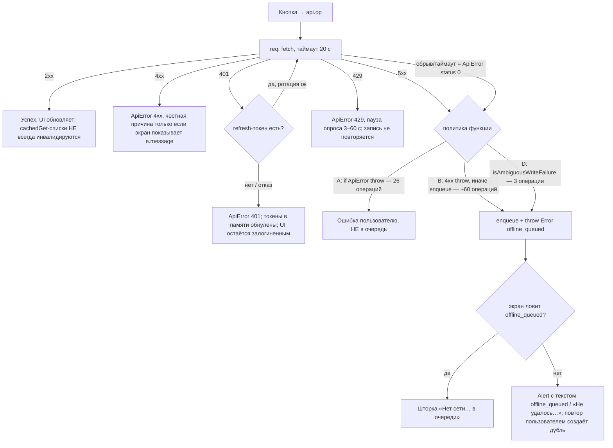
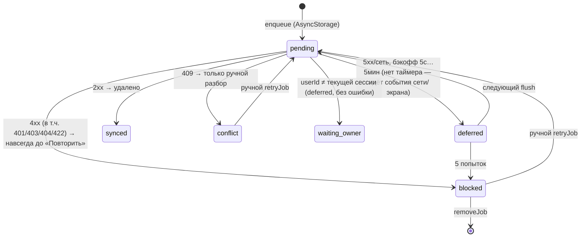
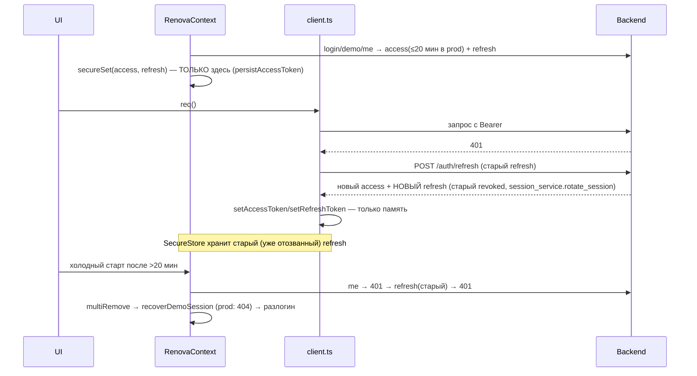

# Срез 10 — компоненты, формы, шторки, состояния и офлайн-поведение

Дата аудита: 2026-09-30. Область: `apps/mobile/components/renova/**`, `apps/mobile/components/ui/**`, `apps/mobile/lib/api/*.ts`, `lib/offlineQueue.ts`, `lib/offline/*`, `lib/context/RenovaContext.tsx`, `lib/domain/*`, `lib/hooks/*`.
Продуктовый код не менялся. Префикс дефектов: `CMP-`.

Способы проверки: чтение кода; временные tsx-пробы вне репозитория (мок `fetch`/`AsyncStorage`, вызов реальных `lib/api/*` и `lib/offline/flushPolicy.ts`); скрипт-разбор всех записывающих вызовов `lib/api/*.ts`; grep по импортам. Живой backend не трогался (только чтение кода `backend/app/...`).
Пометка «ВЕРИФ» в реестре: `да (проба)` — воспроизведено запуском; `да (код)` — однозначно следует из кода; `гипотеза` — не проверено.

---

## 1. Инвентарь среза

### 1.1 Слой данных (`apps/mobile/lib`)

| Что | Где | Назначение |
|---|---|---|
| HTTP-клиент `req`/`performReq` | `lib/api/client.ts:449-563` | Таймаут 20 с (`:436`), до 3 попыток, повтор GET при 429 по `Retry-After`, единичный refresh при 401 (`:502`), слияние одинаковых GET «в полёте» (`:446-460`), фолбэк GET в durable-кэш (`:550`) |
| TTL-кэш `cachedGet` | `lib/api/client.ts:238-281` | 30 с в памяти (`:79`) + 24 ч в AsyncStorage (`renova_cache_get:<userId>:<path>`); провенанс «устарело» по пути (`getStaleCachePaths`) |
| Refresh токена | `lib/api/client.ts:331-395` | Single-flight, защита от смены сессии (`getSessionStamp`) |
| `authHeaders` | `lib/api/client.ts:399-420` | Глобальный Bearer; при явном `userId ≠ currentSessionUserId()` заголовок не прикладывается |
| Классификация сбоев | `lib/api/failurePolicy.ts` | `isAuthoritativeRefreshRejection`, `shouldFallbackToDurableCache`, `isAmbiguousWriteFailure` |
| Идемпотентный ключ | `lib/clientRequestId.ts` | `createClientRequestId(scope)`; сервер принимает `client_request_id` (≤80 симв.) |
| Офлайн-очередь | `lib/offlineQueue.ts` | Единый ключ `renova_offline_queue`; задание = `{path, method, body(строка), userId, id, attempts, blocked, conflict, nextAttemptAt}`; заголовок `X-Offline-Id` |
| Политика повтора | `lib/offline/flushPolicy.ts:19-56` | 2xx → drop; 409 → conflict; прочие 4xx (кроме 408/425/429) → block навсегда; 5xx/сеть → бэкофф 5 с…5 мин, блок после 5 попыток |
| Запуск flush | `app/_layout.tsx:53-66` (NetInfo/`online`), `lib/context/RenovaContext.tsx:520` (bootstrap), `OfflineSyncStatus.tsx:73`, `app/_stack/conflicts.tsx:75,89`, `UnifiedInboxScreen.tsx:95` | Периодического таймера нет |
| Экран очереди | `app/_stack/conflicts.tsx` | Повтор / удалить / дедуп; подписи `lib/offlineJobLabel.ts` |
| Контекст сессии | `lib/context/RenovaContext.tsx` (829 строк) | Единственный контекст: user, projects, activeProject, readOnly, teamAccess; login/logout/bootstrap |
| Рубеж сессии | `lib/domain/sessionAuthority.ts`, `sessionFence.ts` | Поколение+userId; отбрасывает запоздалые ответы и чужие задания очереди |
| Хуки | `lib/hooks/*` (6 файлов), `lib/async/useAsyncResource.ts` | `useAsyncResource` используют только 2 файла; `LoadErrorState` — 18 |
| Домены | `lib/domain/*` (≈120 файлов, чистая логика) | без сети |

### 1.2 Записывающие вызовы API

Разбор скриптом: **196** операций POST/PATCH/PUT/DELETE в `lib/api/*.ts` (без служебных). Из них:
- **89** ставятся в офлайн-очередь; **107** — только онлайн;
- из 89 очередных лишь **24** несут `client_request_id` в теле (остальные — естественно идемпотентные переходы состояний или **без ключа**);
- **26** очередных операций имеют «мёртвую» ветку очереди (см. CMP-001).

### 1.3 UI-компоненты

- `components/renova/**` — 145 файлов верхнего уровня + подпапки (`budget`, `chat`, `estimate`, `os`, `room`, `schedule`, `scratchpad`, `wizard`, `work`).
- `components/ui/**` — 7 примитивов (`Card`, `EmptyActionState`, `InfoBanner`, `LoadErrorState`, `SectionHeader`, `StatusPill`, `TextLink`); в них 0 сырых hex.
- Общие поверхности: `SheetSurface.tsx` (шторка: KeyboardAvoidingView, safe-area, sticky footer, блок закрытия при `busy`), `ActionConfirmSheet.tsx`/`ActionConfirmHost.tsx` (шина `lib/actionConfirmBus.ts`), `PrimaryButton.tsx` (minHeight 44, `loading`/`disabled`, **не ждёт** промис `onPress`).
- Мёртвые компоненты — см. CMP-022.

---

## 2. Матрица «кто что может» (уровень компонентов и данных)

Серверные проверки прав — в срезах 01/07/08; здесь — где доступ проверяется на клиенте в моём срезе.

| Действие | Заказчик (владелец) | Исполнитель | Гость/viewer | Где проверяется на клиенте |
|---|---|---|---|---|
| Любая запись из шторок/форм | да | да | нет | `useWriteAllowed()` = `!readOnly` (`ReadOnlyGuard.tsx:8-11`); `readOnly = project.read_only ‖ teamAccess.readOnly` (`RenovaContext.tsx:233`) |
| Создать проект | да | нет | нет | `roleCapabilities.canCreateProject` (`lib/domain/roleCapabilities.ts:29`) |
| Подтверждать платежи | да | нет | нет | `canConfirmPayments`; сервер — `payments.py` |
| Править профиль/бюджет объекта | да | нет | нет | `canEditProjectProfile/canEditCustomerBudget` |
| Править строки сметы, публиковать работы | нет | да (главный; член бригады — по `teamAccess`) | нет | `canEditEstimateLines/canPublishWorks`, `ContractorEstimateView.tsx:118-131` (`isContractorOwner`) |
| Гостей: добавить/ссылка портала/удалить | да | нет | нет | `canManageGuests`; `ViewerSharePanel.tsx` (сервер отдаёт 403 → `apiErrorMessage`) |
| Отправить смету на согласование | нет | да | нет | `ContractorEstimateView.tsx:118-131` |
| Портал по magic-ссылке (приёмка/оплата/подпись) | scopes из токена | — | scopes из токена | Сервер: `/portal/*`; клиент: `PortalScreen.tsx:262-266` |
| Реквизиты для оплаты | нет | да | нет | `ContractorProfileScreen.tsx:150-166` (экран исполнителя) |

Замечание: `readOnly` ставится в `false` при логине/демо-входе (`RenovaContext.tsx:592`, `demoLogin`) до загрузки проекта — окно, где UI теоретически показывает write-кнопки гостю до `loadProject`. Серверный ACL закрывает запись; UI-окно — **гипотеза, не проверено**.

---

## 3. Последовательности и состояния

### 3.1 Путь записи: что происходит при сбое (как есть)

### 3.2 Жизненный цикл задания очереди

Порядок: `flushOnce` сортирует по `ts` (`offlineQueue.ts:405`), но упавшее задание НЕ блокирует зависимые (комната → этап в комнате отправятся независимо; зависимое получит 4xx → blocked). Результаты применяются одним merge после всего цикла — при убийстве процесса в середине уже отправленные задания остаются в очереди и повторяются (защита — только `client_request_id`/естественная идемпотентность).

### 3.3 Сессия и токены

Отказ авторитетный (401/403 на refresh): токены в памяти обнуляются (`client.ts:351`), но `RenovaContext.user` остаётся, SecureStore не чистится, глобального обработчика 401 нет (grep `401` по `app/`, `components/`, `lib/` вне клиента — 0 совпадений) → пользователь «внутри» приложения, где все запросы падают.

### 3.4 Кэш и «свежесть»

`cachedGet` (11 путей: calendar, documents, change-orders, warranty-claims, material-picks, issues, projects(+bucket), **stages/{id}**, selections/pending-count, work-orders). Инвалидация есть у change-orders, selections, material-picks (только базовый путь), warranty, issues (только базовый путь), work-orders, documents, projects (только в `useProjectLifecycleActions`). **Нет** инвалидации: `stages/{id}`, `calendar`, `projects` после create/patch, вариантов с query (`?status=`, `?work_type=`).

---

## 4. Каталог форм и шторок

Обозначения: Вал.кл — клиентская валидация; Вал.сер — серверная; 2×tap — защита от двойной отправки; Отмена — есть ли; Ошибка — что видит человек.

| Форма / шторка | Поля | Вал.кл | Вал.сер (расхождения) | 2×tap | Отмена | Сеть/4xx/5xx/429 → что видит |
|---|---|---|---|---|---|---|
| `CreateStageSheet.tsx` (Модал, без KeyboardAvoiding) | название, начало, конец (текст `ГГГГ-ММ-ДД`), комната | только `name.trim()` | даты парсятся сервером (`StageCreate`); формат/порядок дат клиент не проверяет | `busy` на кнопке; «Отмена» и фон активны | да | **любая** ошибка → «Не удалось создать этап» (`:61`), причина сервера теряется; очередь → шторка «Нет сети»; нет `client_request_id`, хотя сервер поддерживает (`stage_mutations.py:26`) |
| `CreateRoomSheet.tsx` + `room/RoomSetupFields.tsx` | имя, тип, этаж, длина, ширина, высота, розетки, выключатели, точки воды | имя, `parseFloat(len/wid)>0` | `RoomInput`: gt=0, floor −2..20; верхних границ нет ни там ни там | `busy`; отмена активна | да | Rate-limit → «Подождите»; **всё остальное, включая «поставлено в очередь», → «Не удалось создать комнату»** (`:127`), см. CMP-006; запятая в числах → усечение (CMP-013) |
| `CreateWorkSheet.tsx` (445 строк) | категория, тип/название, комната, даты, бюджет, заметки, публикация; вкладка «Калькулятор» | только непустой заголовок | `budget_planned: +budget` (`:164`); даты — свободный текст | `busy` в `submit` | да | rate-limit/очередь/«Не удалось создать работу» (`:176`) без причины; `reportError` пишет причину в телеметрию, пользователю — нет |
| `RejectStageModal.tsx` | причина (шаблоны) | нет: пустая причина молча → «Требуется доработка» (`:18`) | сервер `ReturnIn` принимает комментарий | **нет** (нет busy, `onConfirm` сразу) | да, но `reason` не очищается | родитель `StageDetailScreen.tsx:534-552` закрывает модалку до ответа; ошибка → «Не удалось вернуть этап на доработку» |
| `CreateChatSheet.tsx` | название, тема, объект, участники | название/объект | — | `busyRef` | да | очередь → показывается **`e.message` = `offline_queued`** (`:171`); приглашения не отправляются (CMP-011) |
| `CreateJobLeadSheet.tsx` | 5 полей | по месту | `job-leads` | `busy` | да | `e.message` (`:123`) |
| `AddEstimateLineForm.tsx` | название, ед., кол-во, цена, комната, этап | `parseFloat(price.replace(',', '.'))` | ключ `client_request_id` в `useRef` — **образец** | `busy` | да | ключ ротируется после успеха/очереди |
| `ManualExpenseForm.tsx` | сумма, описание, категория, привязки | `parseFloat(amount.replace(',', '.'))` | `receipts/manual` | `busy` | да | ключ в `useRef` — образец |
| `CreatePaymentForm.tsx` | тип, название, сумма/доля, этап, заметка | сумма>0, этап обязателен для «этапа» | `payments.py:165-180` (`422 Укажите amount или percent`) | `busyRef` | да | `apiErrorMessage`; данные остаются в форме; 5xx маскируется как «недоступно офлайн» (CMP-026) |
| `PaymentDetailSheet.tsx`, `ExpenseDetailSheet.tsx`, `PaymentEvidenceSheet.tsx`, `MaterialPickDetailSheet.tsx` (`SheetSurface`) | платёж/расход/доказательство | `mutationRef` (`beginMutation`) | — | да, защита закрытия при `busy` | да | `apiErrorMessage`/`ApiError.status` (409 → ведёт к приёмке) — **образцовые** шторки |
| `BankStatementImportSheet.tsx` | CSV-текст | непустой | `match_token` от сервера | `busy` только на кнопках шага; шторка закрывается до диалогов | да | `e.message`; жаргон «pending-оплат», «gate», «матч» в текстах |
| `ViewerSharePanel.tsx` | телефон / код профиля | одно из двух | сервер: «пользователь должен быть в Renova» | `runAction(busy)` | подтверждение удаления | `apiErrorMessage` — образец |
| `MaterialPickList.tsx` (форма «Сохранить», «На согласование») | название, цена, комната, источник, доступно | **нет** (название по умолчанию «Материал») | `PickIn` | **нет** | да | **нет try/catch**: 4xx/очередь → необработанный reject, пользователь не видит ничего (CMP-012); `Number(price)\|\|0` (CMP-013) |
| `OsSelectionsScreen.tsx` (подбор) | название, цена, лимит | границы 0…10 000 000 — зеркалят сервер (`selections.py`) | совпадает | `busy` | да | обработка очереди есть |
| `ContractorEstimateView.tsx` (доп. соглашение, «Отправить смету») | название, сумма | **нет**: `parseFloat(coAmount)\|\|0` (`:72`) | ДО с суммой 0 принимается | нет | — | `throw e` в обработчике (`:80`) — тихий reject; для сметы `Alert(e.message)` = `offline_queued` (`:128`) |
| `ContractorProfileScreen.tsx` | компания, реквизиты, ИНН | ИНН ≥12 симв. | — | нет | — | при сбое **загрузки** поля пустые, «Сохранить реквизиты» затирает серверные (CMP-010) |
| `ScratchpadScreen.tsx` | строка/правка | непустая | — | `busy` | да | «Не удалось сохранить строку» без причины |
| `StageDetailScreen.tsx` (комментарий, фото, приёмка) | текст, фото | непустой текст | — | `setLoading` | — | ошибка обобщённая; после успеха `reload()` читает **устаревший** кэш (CMP-004) |
| `SnoozeUntilPicker.tsx`, `RoomAuditFilters.tsx` | текстовые даты | нет | — | — | — | нет валидации формата (`validateDate.ts` подключён только к профилю объекта) |
| Wizard `app/wizard/_screens/confirm.tsx` | имя, бюджет, план рынка | имя обязательно | сервер поддерживает ключ (`project_creation.py:18`), клиент не шлёт | `busy` | «Закрыть» | «Повторить» перезапускает **всю** цепочку (CMP-005) |

Не-модальные «маленькие» формы (`TechnicalSupervisionCard`, `StagePaymentPlanPanel` (мёртв), `WorkOrderDetailPanel`, `EstimateLineEditorCard`) сверены выборочно; подробности — только по перечисленным выше.

---

## 5. Кнопки → обработчик → API → сервер → результат (ключевые цепочки среза)

| Кнопка (подпись) | Обработчик | API | Серверная проверка | Результат / ошибки |
|---|---|---|---|---|
| «Создать этап» | `CreateStageSheet.submit` → родитель | `stagesApi.createStage` (`stages.ts:180`) | `stage_mutations.py:78` (+ идемпотентность по ключу, если бы клиент слал) | ок → `alertStageCreated`; сеть/5xx → очередь без ключа |
| «Создать комнату» | `CreateRoomSheet.submit` → `OsRoomsScreen.tsx:501` | `roomsApi.createRoom` (`rooms.ts:65`, ключ создаётся внутри вызова) | `rooms.py` (`RoomCreateIn`, идемпотентность, 403 для заказчика) | очередь → **ложная ошибка** (CMP-006) |
| «Отправить» (чат) | `ChatThreadView.tsx:583` | `sendChatMessage` (`chats.ts:275`, `isAmbiguousWriteFailure`) | `chats.py` | текст возвращается в поле при ошибке; очередь → «Сообщение поставлено» — **образец** |
| «Начать этап» / «Готово» / «Сдать» / «Принять» / «Отклонить» | `StageDetailHero`, `StageDetailScreen`, `RenovaContext.submitStage/acceptStage/rejectStage` | `stages.ts:58-165` | статусы + гейты приёмки | 409 → шторка «Блокировка»; очередь → «Нет сети» |
| «Подтвердить оплату» | `PaymentDetailSheet.tsx:404-421` | `paymentsApi.confirmPayment` (`payments.ts:153`) | `payments.py` (приёмка-gate, 409) | сеть → **не в очередь** (ветка мертва), ошибка «Оплата не подтверждена» — безопасно |
| «Создать счёт» | `CreatePaymentForm.submit` | `createPayment` (`payments.ts:115`, ключ в `useRef`) | `payments.py:165-180` | форма сохраняется; повтор идемпотентен — **образец** |
| «На согласование» (материал) | `MaterialPickList.tsx:269` | `submitMaterialPick` | `materials.py:418` | без try/catch (CMP-012) |
| «Сохранить реквизиты» | `ContractorProfileScreen.tsx:153-166` | `upsertContractorProfile` | `contractors/profile` | затирание при сбое загрузки (CMP-010) |
| «Повторить» / «Демо» (баннер «Нет связи») | `DataStatusBanner.tsx:47-70,102-108` → `recoverSession` | `demoLogin` | `auth.py:204` (`404 demo_disabled` вне demo) | prod: восстановление невозможно (CMP-008) |
| «Повторить» (Мастер создания) | `confirm.tsx:onCreate` | `createProject` + `patchProject` | `project_creation.py:68` | дубликат объекта (CMP-005) |
| «Повторить»/«Очередь синхронизации» | `conflicts.tsx:retryNow/syncReady/removeWithoutSync/dedupeNow` | `retryJob`+`flush` | `flushPolicy` | честные сообщения; подписи заданий местами неверны (CMP-021) |

---

## 6. Таблица «операция × офлайн-поведение × идемпотентность × что видит пользователь»

Классы политики: **A** `if (e instanceof ApiError) throw e` — в очередь попадает только не-ApiError, т.е. **на практике никогда** (обрыв/таймаут = `ApiError(0)`); **B** «4xx → throw, иначе очередь» (5xx и сеть ставятся); **B429** то же, но 429 тоже в очередь (floor, addEstimateLine); **D** `isAmbiguousWriteFailure` (только 5xx/сеть; 429 показывается); **онлайн** — не в очереди.

Идемпотентность: `КЛ` = ключ в теле; `КЛ*` = ключ создаётся внутри вызова API (не живёт в форме — повтор пользователем даёт новый ключ); `КФ` = ключ хранится в форме (`useRef`) — надёжно; `нет` = ключа нет, `сост` = естественная идемпотентность по состоянию/абсолютному PATCH.

| Операция (файл:строка) | Класс | Ключ | Пользователь при очереди | Комментарий |
|---|---|---|---|---|
| `addStageComment` (stages.ts:21) | **A (мёртвая)** | КЛ* | ошибка «Сервер недоступен» | комментарий не сохраняется офлайн |
| `addStagePhoto` (stages.ts:44) | **A** | нет | ошибка «Не удалось загрузить фото» | заявленный offline-путь (`base64` в очередь) недостижим |
| `toggleStageChecklist` (:207), `patchStageRooms` (:219) | **A** | сост | ошибка | — |
| `markStageReady/submitStage/startStage/acceptStage/rejectStage` (stages.ts:58-165) | B | сост (409 при повторе) | шторка «Нет сети» | при уже применённом действии → «конфликт» в очереди |
| `createStage` (:180) | B | **нет** (сервер поддерживает) | шторка | дубль при потере ответа |
| `patchStageDepends/WorkType` (:231,:243) | B | сост | шторка | — |
| `createRoom` (rooms.ts:65) | B | КЛ* | **ложная ошибка** | CMP-006 |
| `updateRoom` (:55), `approveRoomChange`, `rejectRoomChange`, `createRoomChangeRequest` | **A** | КЛ*/сост | ошибка | — |
| `addEstimateLine` (estimate.ts:34) | B429 | КФ (`AddEstimateLineForm`) | шторка | образец |
| `patchEstimateLine` (:7) | B | КЛ | шторка | — |
| `lock/proposeLock/rejectLock/withdrawLock` (:68-193) | B | сост | proposeLock: **сырой `offline_queued`** | CMP-011 |
| `createChangeOrder` (:101) | B | КЛ* (форма не передаёт) | тихий reject | CMP-012 |
| `approveChangeOrder/rejectChangeOrder` | **A** | сост | ошибка | — |
| `createFloorPlan/pinFloorPlanRoom/createFurniture/createWasteOrder` (floor.ts) | B429 | КЛ | шторка | исправлено недавно, ок |
| `moveFloorPin/moveFurniture/approveWasteOrder` | **A** | сост | ошибка | — |
| `createIssue` (issues.ts:15) | **A** | КЛ* | ошибка; при не-ApiError вернёт `undefined` после `offline_queued` | — |
| `escalate/transition/closeIssue` | **A** | сост | ошибка | — |
| `createMaterialPick` (materials.ts:8) | B | КЛ* | необработанный reject | CMP-012 |
| `submit/approve/rejectMaterialPick` | **A** | сост | необработанный reject/ошибка | — |
| `createPurchase`, `generateMaterialNeeds` | B | КЛ* | файл-вызыватель не ловит `offline_queued` | CMP-011 |
| `updatePurchaseStatus` (:110) | B | сост | без try/catch в `purchase/[id].tsx:65` | CMP-012 |
| `createProjectDocument` (documents.ts:20) | B | **нет** | шторка | дубль записи документа |
| `signProjectDocument` (:58) | **A** | сост | ошибка | — |
| `archiveProjectDocument` | B | сост | — | — |
| `upload/ocr/restore/delete/legal-hold` документ | онлайн | нет | «недоступно без интернета» (при 5xx тоже, CMP-026) | — |
| `createWorkOrder/patch/transition` (workOrders.ts) | B | КЛ (`X-Offline-Id` → `request_id` на сервере) | шторка | образец |
| `createWorkSchedule/submit/confirm/reject/updateItemStatus` (workSchedule.ts) | B | КЛ | шторка; `TechnicalSupervisionScheduleReview` не ловит | — |
| `sendChatMessage` (chats.ts:275) | D | КЛ | «Сообщение поставлено» | образец |
| `createChat` (chats.ts:42) | B | КЛ | **сырой `offline_queued`**, приглашения теряются | CMP-011 |
| `react/pin/confirm/invoiceFromChat/taskFromChatMessage/patchChatState/markChatRead` | B | КЛ/сост | шторка | — |
| `inviteToChat` | онлайн | КЛ | — | — |
| `addManualReceipt`, `scanReceipt` (receipts.ts) | D | КЛ* (в форме — КФ) | шторка; `scan-receipt.tsx`, `OsQuickFab` не ловят | — |
| `patchReceipt/deleteReceipt` | B | сост | `ReceiptBulk*` не ловят | — |
| `createScratchpadLine` (scratchpad.ts:10) | B | **нет** | шторка | дубль строки |
| `patch/deleteScratchpadLine` | B | сост | `BudgetExpensesSection` не ловит | — |
| `createWarrantyClaim` | B | КЛ (обязателен на сервере) | — | — |
| `patchOsExpense/deleteOsExpense` | B | сост | — | — |
| `importIcal` (calendar.ts:49) | B | **нет** | шторка | весь `.ics` кладётся в AsyncStorage |
| `updateStageDates` (calendar.ts:27) | B | сост | — | — |
| `confirmPayment` (payments.ts:153) | **A** | сост | ошибка «Оплата не подтверждена» | безопасно: деньги не уходят в очередь |
| `createPayment` | онлайн | КФ | «Создание платежа недоступно офлайн» (и при 5xx) | — |
| Платёжные доказательства (`payments.ts:184,208`) | онлайн | КФ | — | образец |
| `createProject`/`createProjectFromTemplate` (projects.ts:25-27) | онлайн | **нет** | — | CMP-005 |
| Прочие онлайн-записи (`admin.ts`, `market.ts`, `misc.ts`, `technicalSupervision.ts`, `selections.ts`, `notifications.ts`) | онлайн | в основном нет | текст `ApiError` | `createJobLead`, `postLeadMessage`, `createTeam`, `inviteTeamMember` — без ключа |

---

## 7. Состояния loading / error / empty

Хорошо: главная (`OsHomeScreen.tsx:150-186`) сохраняет «последнее подтверждённое» значение при сбое источника и явно помечает частичную загрузку; `LoadErrorState` — «это не пустой список» (18 экранов); `DataStatusBanner` объединяет «нет связи / нет данных / устарело» в одну плашку; провенанс устаревшего кэша ведётся по пути.

Слабо:
- `fallbackDashboard` (`lib/domain/fallbackDashboard.ts:21`) при первичном сбое `/dashboard` подставляет `days_overdue: 0` — «просрочек нет» вместо «не загружено» (баннер частичной загрузки есть, но сама цифра выглядит фактом).
- `StageDetailScreen` после мутаций показывает данные из 30-секундного кэша (CMP-004): состояние «загружено», но неактуально.
- Формы `MaterialPickList`, `ContractorEstimateView.addChangeOrder`, `purchase/[id]` не имеют ни loading, ни error (CMP-012).
- `ContractorProfileScreen.reloadProfile` — при ошибке поля молча пустые, «загрузка» неотличима от «реквизитов нет» (CMP-010).
- `useAsyncResource` (единая модель loading/error/empty) применяется в 2 файлах — остальные экраны реализуют состояния вручную по-разному.

---

## 8. Дизайн-система

Измерения (grep по `components`, `app`):
- Сырые hex-цвета: **189** вхождений в **68** файлах `components/renova` (+14 в `components/screens`, +23 в `app`); `components/ui` — 0. Больше всего: `RoomDiagramInteractive.tsx` (6), `room/RoomSetupFields.tsx` (5), `chat/ChatThreadView.tsx` (5), `ReadOnlyGuard.tsx` (`#fef3c7`), `ContractorEstimateView.tsx:135` (`#64748B`).
- Касание: `PrimaryButton` — `minHeight: 44` (ок). Проблемы у голых `Pressable`: `BackHeader.tsx:62` (padding 6 + иконка 24 ≈ 36, спасает `hitSlop=8`), `ScheduleCalendar.tsx:165` (32×32), `ProjectCardLifecycleIcons.tsx:95` (32×32), `OfflineSyncStatus.tsx:184` (30×30), чипы с `paddingVertical 4-6` (`GlobalFilterBar`, `FloorPlanPanel`, `BudgetPlannerPanel`, `DocumentsHub.tsx:1008`).
- a11y: 412 интерактивных `Pressable/TouchableOpacity`; строк с `accessibilityLabel/Role` — 158; **96 из 172** файлов с Pressable не имеют ни одного a11y-атрибута. Хуже всего: `OsQuickFab` (11 из 12 без), `ChatThreadView` (10 из 14; кнопки «📷», «📎», «✓?», «✕» — эмодзи без подписи), `NotificationCenter`/`ReceiptList` (мёртвые), `CreateWorkSheet` (7 из 7), `FloorPlanPanel`, `BudgetPlannerPanel`.
- Согласованность шторок: старые формы создания (`CreateStageSheet`, `CreateRoomSheet`, `CreateWorkSheet`, `RejectStageModal`, `BankStatementImportSheet`, `chat/CreateChatSheet`, `chat/ChatTaskSheet`, `OsQuickFab`, `EstimateDocumentsLayer`) — собственный `Modal` без `KeyboardAvoidingView` и без блокировки закрытия при отправке; финансовые шторки уже на `SheetSurface` (закреплено тестом `lib/sheetChromeContract.test.ts`, старые формы в нём не участвуют).
- Инструменты форматирования: числа вводятся тремя способами (`replace(',', '.')` в 15 местах, «голый» `parseFloat`/`Number`/унарный `+` в остальных).

---

## 9. РЕЕСТР ДЕФЕКТОВ

Серьёзность: P0 деньги/данные/безопасность; P1 функция не работает/тупик; P2 неудобство/рассинхрон; P3 косметика.

| ID | Сев. | Тип | Доказательство (file:line + воспроизведение) | Кого | Предложение | ВЕРИФ |
|---|---|---|---|---|---|---|
| CMP-001 | P1 | не работает | 26 записывающих вызовов ставят в очередь только при «не ApiError»: `stages.ts:29,48,212`, `rooms.ts:55,103,117,127`, `estimate.ts:128,144`, `issues.ts:15,31,41,54`, `payments.ts:153`, `floor.ts:47,82,135`, `materials.ts:26,38,50`, `misc.ts:150,161`, `os.ts:78`, `design.ts:49`, `documents.ts:58`. `req` превращает обрыв/таймаут в `ApiError(0)` (`client.ts:544-549`) → ветка `enqueue` недостижима. Проба: мок `fetch` → `TypeError`; `addStageComment`, `toggleStageChecklist`, `createIssue`, `updateRoom`, `approveChangeOrder`, `confirmPayment` → `ApiError 0`, очередь пуста; `createStage`, `createScratchpadLine`, `markStageReady`, `createRoom` → `offline_queued`, в очереди 4 задания | все роли в поле (комментарий, чек-лист, замечание, правка комнаты, согласование ДО) | Один помощник записи: `if (!isAmbiguousWriteFailure(e)) throw e; enqueue; throw offline_queued` вместо 4 копий; для `confirmPayment` сознательно оставить онлайн-only и убрать мёртвый код | да (проба) |
| CMP-002 | P1 | нет ACL/сессия | Ротация refresh не сохраняется: `client.ts:377-383` меняет токены только в памяти; запись в SecureStore — только `RenovaContext.tsx:80-90` (login/me). Сервер отзывает старый refresh при ротации: `session_service.py:66-76`, `auth.py:233-251`. В prod access ≤20 мин (`security.py:15-22`). Сценарий: работа >20 мин → авто-refresh → закрыть приложение → открыть позже: `me` 401 → refresh старым токеном 401 → разлогин | все | Персистить новые токены прямо в `refreshAccessToken` (колбэк в контекст), писать `access` и `refresh` атомарно | да (код) |
| CMP-003 | P1 | тупик | Нет глобальной реакции на 401: grep `401` вне `client.ts`/`failurePolicy.ts` — только `appError.ts` (текст «Сессия истекла. Войдите снова» без действия). При отказе refresh (`client.ts:351`) токены в памяти обнулены, SecureStore и `user` не тронуты; все запросы уходят без Authorization и падают | все | Событие «сессия окончена» из клиента → `logout()` + переход на вход; чистить SecureStore | да (код) |
| CMP-004 | P1 | рассинхрон UI↔backend | `stagesApi.getStage` = `cachedGet` (`stages.ts:19`) с TTL 30 с (`client.ts:79`); ни одна мутация этапа не инвалидирует путь. Проба: `getStage` → 0 комментариев; `addStageComment` (успех на сервере); повторный `getStage` → **0** (на сервере 1). Экран этапа зовёт `reload()` после комментария/фото/чек-листа/старта/приёмки (`StageDetailScreen.tsx:112-125,256,325`). Аналогично `listProjects` после `createProject` (проба: `[A]` при серверных `[A,B]`) — `createProjectFromWizard` вызывает `listProjects` сразу после создания (`RenovaContext.tsx:605-628`); `calendar` не инвалидируется при `updateStageDates/importIcal`; варианты `?status=`/`?work_type=` не сбрасываются | заказчик, исполнитель | Инвалидировать `stages/{id}` во всех мутациях этапа; в `reload()` после записи использовать `req` (без кэша) или флаг `fresh`; инвалидировать `projects` в `createProject*`/`patchProject`; сбрасывать по префиксу пути | да (проба) |
| CMP-005 | P1 | нет ключа / дубль | `createProject` не шлёт `client_request_id` (`projects.ts:27`), хотя сервер идемпотентен (`project_creation.py:18,88`). Таймаут 20 с (`client.ts:436`) → «Не удалось создать» → «Повторить» → новый проект. Кроме того `confirm.tsx:103-137`: `onCreate` = create → `patchProject(budget_planned)` → …; сбой любого шага после create показывает «Ошибка создания» с «Повторить», который повторяет **всю** цепочку и создаёт второй объект (`createdProjectId` не используется) | заказчик | Ключ в `useRef` мастера; после создания хранить `createdProjectId` и повторять только хвост | да (код) |
| CMP-006 | P1 | рассинхрон / дубль | `OsRoomsScreen.tsx:501-503` пробрасывает `offline_queued` из `createRoom`; `CreateRoomSheet.tsx:120-128` его не различает → «Не удалось создать комнату. Проверьте подключение…». Комната при этом в очереди. Повтор пользователем → новый `client_request_id` (создаётся внутри `rooms.ts:65-70`, а не в форме) → две комнаты после синхронизации. Форма также не закрывается | исполнитель | Ловить `isOfflineQueued` как в `CreateStageSheet`; держать ключ в `useRef` формы и передавать в API | да (код) |
| CMP-007 | P1 | потеря работы | Повтор из очереди без обновления токена: `offlineQueue.ts:452` берёт глобальный `authHeaders`; ответ 401 → `decideFlushOutcome` → **block** (`flushPolicy.ts:19-21,44-46`; проба: `401→block`, также 403/404/422). В prod access ≤20 мин → после долгого офлайна все задания блокируются одним проходом; вручную «Повторить» работает только если токен успел обновить посторонний GET | все | В `flushOnce` при 401 — один `refreshAccessToken()` и повтор; 401 не считать постоянной ошибкой | да (проба+код) |
| CMP-008 | P1 | неверная логика восстановления | `recoverSession` (`RenovaContext.tsx:397-406`) безусловно зовёт `recoverDemoSession` → `api.demoLogin` (`sessionBootstrap.ts:111`). Баннер «Нет связи → Повторить» и «Демо» (`DataStatusBanner.tsx:47-70,102-108`) вызывают её. В prod `auth.py:204-207` отвечает `404 demo_disabled` → исключение внутри `onPress`, данные не перезагружаются, хотя `apiReachable` уже стал `true`. В demo-окружении «Повторить» подменяет настоящего пользователя демо-аккаунтом. Тот же вызов на холодном старте: `RenovaContext.tsx:491` (любой отказ `me`) и `:502-506` — **любой** пользователь со списком проектов 0 и `storedRole ∈ {customer,contractor}` (это всегда так) → `recoverDemoSession`; в prod исключение → внешний `catch` (`:520-523`) ставит `apiReachable=false` («Нет связи»), хотя сервер доступен | новые заказчики без проектов, все после истечения сессии | Разделить «повторить загрузку» и «демо-вход»; демо-путь только при `isDemoPhone` и `EXPO_PUBLIC_DEMO` | да (код) |
| CMP-009 | P1 | нет ACL / не работает | Портал-гость: `PortalScreen.tsx:262-266` кладёт portal-JWT в глобальный токен, затем `portalSnapshot(nextSession.user_id, …)` (`misc.ts:110`). `authHeaders(userId)` при `userId ≠ currentSessionUserId()` (у гостя `null`) возвращает `{}` (`client.ts:404-406`). Проба: `setAccessToken('PORTAL_JWT')` + `portalSnapshot('portal-user-id','p1')` → заголовки без `Authorization`; `portal.py:156-160` требует `get_current_user` → 401, экран показывает «Ссылка недействительна…». Вход по magic-ссылке без локальной сессии не работает; обратная сторона: портальный токен навсегда заменяет Bearer залогиненного пользователя (не сбрасывается) | гость/viewer, заказчик по ссылке | Для портальных вызовов — явный режим клиента (токен портала как явный заголовок), не через `userId`; при выходе с экрана восстанавливать токен | да (проба) |
| CMP-010 | P1 | потеря данных | `ContractorProfileScreen.tsx:107-116`: начальные `payReq=''`, `company=''`; при ошибке `getMyContractorProfile` только `reportCatch`. Кнопка «Сохранить реквизиты» (`:153-166`) шлёт `payment_requisites: payReq \|\| null` → на сервере затираются реквизиты, которые заказчик видит при переводе | исполнитель, заказчик | Не отправлять поля, пока загрузка не удалась; состояние `loading/error` на форме; PATCH только изменённых полей | да (код) |
| CMP-011 | P2 | нечестные сообщения | Экраны, показывающие `e.message`, выводят технический `offline_queued`: `ContractorEstimateView.tsx:128`, `chat/CreateChatSheet.tsx:171`, а также `MaterialPickList.tsx:231,258`, `MaterialPickDetailSheet.tsx:127,158,189`, `DesignPackageList.tsx:135`, `WasteOrderList.tsx:32`, `UnifiedAcceptanceList.tsx:101`, `SchedulePlanItems.tsx:92`, `RoomDetailScreen.tsx:167,194` (всего ≈35 мест по `instanceof Error ? e.message`). Файлы, вообще не знающие `offline_queued` (grep): `DesignPackageList`, `MaterialPickList`, `MaterialPickDetailSheet`, `app/material/[id].tsx`, `OsMaterialsScreen`, `app/purchase/[id].tsx`, `ReceiptBulk*Panel`, `BudgetExpensesSection`, `TechnicalSupervisionScheduleReview`, `OsQuickFab`, `app/scan-receipt.tsx`, `lib/createProjectChat.ts`. Для чата в очереди `invites` не сохраняются (`createProjectChat.ts:84-104` не доходит до цикла приглашений) | все | Единый `describeWriteError(e)` (очередь/сеть/4xx-причина) и использовать вместо `e.message` | да (код) |
| CMP-012 | P2 | тупик UX / дубль | Кнопки с `async` без `try/catch` и без `busy`: `MaterialPickList.tsx:269-273` («На согласование»), `:314-335` («Сохранить»: ключ создаётся внутри API → двойной тап = 2 позиции), `app/purchase/[id].tsx:63-70`, `DesignPackageList.tsx:147`, `ContractorEstimateView.tsx:69-84` (`throw e` в обработчике). `PrimaryButton.tsx:90-93` не ждёт промис `onPress` и не блокирует повторное нажатие → ошибка = необработанный reject, человек не видит ничего | исполнитель, заказчик | `PrimaryButton`: если `onPress` вернул промис — авто-`loading` и catch с общим сообщением | да (код) |
| CMP-013 | P1 | неверные данные | Десятичная запятая (Российская раскладка `decimal-pad`): `CreateRoomSheet.tsx:103-114`, `wizard/_screens/rooms.tsx:68-70,122-124`, `EstimateLineEditorCard.tsx:41-52` — `parseFloat('4,2')=4`; `MaterialPickList.tsx:319` `Number('12,5')\|\|0`=0; `CreateWorkSheet.tsx:164` `+budget`=NaN→`null`; `ContractorEstimateView.tsx:72` `parseFloat('1 500 000')=1`, пустое → `0` (допсоглашение на 0 ₽ принимается, валидации нет). Форматы с пробелом: `CreatePaymentForm.tsx:62` также даёт 1 | исполнитель, заказчик | Общий `parseDecimal()` (пробелы, запятая, NaN→ошибка поля) во все формы | да (код; арифметика JS) |
| CMP-014 | P2 | нет ключа | Очередные создания без ключа: `createStage` (сервер умеет — `stage_mutations.py:26`), `createScratchpadLine`, `createProjectDocument`, `addStagePhoto`, `importIcal` (`calendar_import_service` принимает ключ), `createChangeOrder` (ключ КЛ*). При 5xx с потерянным ответом повтор/реплей создаёт дубль | исполнитель | Ключ в форме + в тело; для `addStagePhoto` — сохранение ключа | да (код) |
| CMP-015 | P2 | тупик | Таймера повтора нет: `nextAttemptAt` учитывается, но `flush` запускается только по NetInfo/`online`/загрузке/экранам (`_layout.tsx:53-66`). Онлайн-устройство при 5xx сервера держит «отложенные» задания до ручной синхронизации | все | `setTimeout` до ближайшего `nextAttemptAt` в фоне | да (код) |
| CMP-016 | P2 | безопасность/приватность | Durable-кэш GET (`renova_cache_get:*`, до 24 ч) и очередь не очищаются при выходе: `logout` (`RenovaContext.tsx:731-763`) чистит только сессионные ключи; grep по `renova_cache_get`/`clear` — очистки нет. Данные предыдущего аккаунта (проекты, платежи, чат) остаются в незашифрованном AsyncStorage; задания чужого `userId` ждут владельца (`offlineQueue.ts:436`) | все на общем устройстве | Удалять префикс кэша при выходе; предупреждать о невыгруженной очереди | да (код) |
| CMP-017 | P2 | рассинхрон | Портальный `setAccessToken` (`PortalScreen.tsx:265`) не откатывается; у залогиненного пользователя последующие запросы идут под токеном портала (`authHeaders(A)` пропускает, т.к. `A===session`) | заказчик, открывший чужую ссылку | См. CMP-009 | гипотеза (код прочитан, сценарий не воспроизведён) |
| CMP-018 | P2 | нечестные сообщения | 49 мест `Alert/showActionConfirm('…', 'Не удалось …')` без причины (например `CreateStageSheet.tsx:61`, `CreateWorkSheet.tsx:176`, `ScratchpadScreen.tsx:71-133`, `ChatThreadView.tsx:488-713`, `StageDetailScreen.tsx:247,317,547`); `apiErrorMessage` используют только 26. Сервер отдаёт человеческие 4xx (`rooms.py:26-40`, `payments.py:180`), но их не видно | все | Единый хелпер причины (403/409/422/429) | да (код) |
| CMP-019 | P2 | затык UX | Собственные `Modal` с `TextInput` без `KeyboardAvoidingView`/`SheetSurface`: `CreateStageSheet`, `CreateWorkSheet`, `CreateRoomSheet` (+`RoomSetupFields`), `RejectStageModal`, `BankStatementImportSheet`, `chat/CreateChatSheet`, `chat/ChatTaskSheet`, `os/OsQuickFab`, `estimate/EstimateDocumentsLayer`; закрытие фоном во время отправки не блокируется | iOS-пользователи | Перевести на `SheetSurface` (`busy`) | гипотеза (по коду; на устройстве не проверялось) |
| CMP-020 | P2 | неверный статус/UX | `RejectStageModal.tsx:18`: пустая причина → «Требуется доработка» без уведомления; нет `busy`; `StageDetailScreen.tsx:536` закрывает модалку до ответа сервера — при ошибке причина пропала | заказчик | Требовать текст (или явно подтверждать), держать модалку до успеха | да (код) |
| CMP-021 | P3 | нечестные данные | `offlineJobLabel.ts:17-24`: `includes('/submit')`→«Сдача этапа» попадает на материалы/дизайн/график; `'/confirm'`→«Подтверждение оплаты» — на график и приёмку; `'/accept'` — на заявки биржи; строки сметы/статусов закупок — сырой «POST estimate/lines» | все на экране очереди | Разбор по регулярным шаблонам пути | да (код) |
| CMP-022 | P2 | мёртвый код / функция недоступна | Не импортируются в продуктовом коде: `StagePaymentPlanPanel` (160 строк; вместе с ним `stagesApi.updateStagePaymentPlan` (`stages.ts:270`) недоступна из UI), `MaterialPickDetailSheet` (325), `ReceiptList` (167), `NotificationCenter` (108), `NotificationsList` (58), `IcalImportButton`, `WeekScheduleStrip` (195), `WeekTimeline`, `RoomStagesPanel`, `RoomDiagram`, `RoomDiffVisual`, `RoomProgressOverview`, `RoomAuditFilters`, `PlanFactByRoom/Objects`, `PortfolioGallery`, `PropertySummary`, `MonthCalendar`, `NotificationGroups`, `OnboardingHint`, `RoleDetailPicker`, `DetailPresetPicker`, `ChecklistVersionDiff/List`, `os/OsReturnBar`, `os/PortfolioLink`, `lib/useInboxWebSocket.ts`, `lib/domain/constructionProjectGraph.ts` (460, только тест), `lib/calc-engine/resource-scheduler.ts` (246), `normative-release.ts`, `lib/roleDetail.ts`, `lib/smartMerge.ts`, `lib/unifiedDetail.ts`, `lib/checklistAdmin.ts`, `lib/whisperStub.ts`, `lib/voiceRecord.ts`, `components/ExternalLink.tsx`, `StyledText.tsx`; API `uploadStagePhoto` (`stages.ts:35`, без `res.ok` на PUT). Скрипт: 45 модулей без внешних импортов | разработчики; редактирование плана оплат этапа недоступно | Решить: подключить `StagePaymentPlanPanel` или удалить; остальное удалить после проверки | да (grep) |
| CMP-023 | P3 | дизайн-система | 189 сырых hex в 68 файлах `components/renova` (+37 в `screens`/`app`); 96/172 файлов с Pressable без a11y-атрибутов; иконки-эмодзи в чате без подписи; цели касания 30–32 px (`OfflineSyncStatus.tsx:184`, `ProjectCardLifecycleIcons.tsx:95`, `ScheduleCalendar.tsx:165`) | все, экранные дикторы | Линтер запрета hex вне `constants/`; `accessibilityLabel` для иконок | да (grep) |
| CMP-024 | P2 | рассинхрон | Слияние GET «в полёте» не учитывает `signal` (`client.ts:446-460`): отмена запроса первого вызывателя (`UnifiedScheduleView.tsx:94-126`, `useSchedulePlanState.ts:55`) роняет тем же `AbortError` виджеты, присоединившиеся к тому же URL | исполнитель/заказчик на «График» | Ключ слияния включает наличие сигнала или отдельный промис на подписчика | гипотеза (код) |
| CMP-025 | P3 | нечестные данные | `fallbackDashboard.ts:21` `days_overdue: 0` при первичном сбое дашборда — «просрочек нет» вместо «неизвестно» | заказчик | `null` и «—» | да (код) |
| CMP-026 | P3 | нечестные сообщения | `createPayment` (`payments.ts:124`) и `uploadProjectDocument` (`documents.ts:154`) при любом 5xx показывают «недоступно без интернета/офлайн» — сервер доступен, ответ мог потеряться (для платежа повтор безопасен благодаря ключу, но текст вводит в заблуждение) | все | Разные тексты для 5xx и обрыва | да (код) |
| CMP-027 | P2 | не работает офлайн | Фото этапа офлайн: `StageDetailScreen.tsx:296` сначала `getUploadUrl` (сеть) — падает `ApiError(0)` до ветки «base64 в очередь»; человек видит «Не удалось загрузить фото» вместо «Нет сети». Ветка `addStagePhoto` с `image_data` при этом недостижима (CMP-001) | исполнитель в поле | Явное сообщение «Нужна сеть для фото»; либо очередь файлов | да (код) |
| CMP-028 | P3 | гипотеза | Большие тела в очереди: фото/чат base64 (`ChatThreadView.tsx:598-613`) и `.ics` кладутся в один JSON-массив AsyncStorage (`offlineQueue.ts:184`); лимит строки на Android ≈2 МБ может сорвать запись всей очереди | исполнитель | Ограничить размер задания; хранить файлы отдельно | гипотеза, не проверено |
| CMP-029 | P2 | нет валидации | Даты — свободный текст без пикера: `CreateStageSheet.tsx:73-75`, `CreateWorkSheet` (`plannedStart/End`), `SnoozeUntilPicker.tsx:28`, `RoomAuditFilters.tsx:11`; `validateDate.ts` подключён только к профилю объекта. Порядок «конец ≥ начало» не проверяется. Ошибка сервера скрыта (CMP-018) | исполнитель | Пикер даты + общая валидация | да (код) |
| CMP-030 | P3 | косметика | Жаргон в интерфейсе: «pending-оплат(ы)», «gate», «матч» (`BankStatementImportSheet.tsx`), «Требуется приёмка этапа (gate)» | заказчик | Переформулировать | да (код) |

Сводка: всего 30. P0 — 0; P1 — 11 (CMP-001…010, 013); P2 — 13 (011, 012, 014, 015, 016, 017, 018, 019, 020, 022, 024, 027, 029); P3 — 6 (021, 023, 025, 026, 028, 030). Не верифицировано (гипотеза): CMP-017, 019, 024, 028.

---

## 10. Что сделано хорошо (образцы для выравнивания остальных)

- `CreatePaymentForm`, `AddEstimateLineForm`, `ManualExpenseForm`: ключ идемпотентности в `useRef`, ротация только после успеха/очереди, введённые данные сохраняются при ошибке.
- `PaymentDetailSheet`, `ExpenseDetailSheet`: `mutationRef` + точные состояния мутаций, `SheetSurface`, честные тексты 409.
- `chatsApi.sendChatMessage` + `ChatThreadView.sendText`: политика `isAmbiguousWriteFailure`, текст возвращается в поле, очередь объясняется.
- `OsHomeScreen`: «последнее подтверждённое значение» вместо фиктивного нуля, список частичных сбоев.
- `sessionAuthority`/`sessionFence`: чужие ответы и чужие задания очереди не публикуются и не отправляются под другим токеном.

## 11. Не удалось проверить

- Поведение на устройстве (клавиатура iOS/Android, реальные размеры касаний, лимиты AsyncStorage) — только по коду.
- Реальный срок жизни access-токена в целевом окружении (в коде prod/staging ≤20 мин; фактические переменные окружения не читались).
- Окно `readOnly=false` до `loadProject` у гостя (раздел 2).
- Полное покрытие всех 145 компонентов: формы каталогизированы выборочно (около 25 ключевых); остальные проверялись только массовым grep (a11y, hex, мёртвый код).
