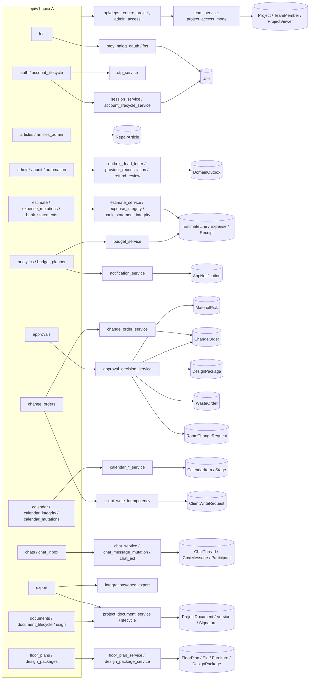
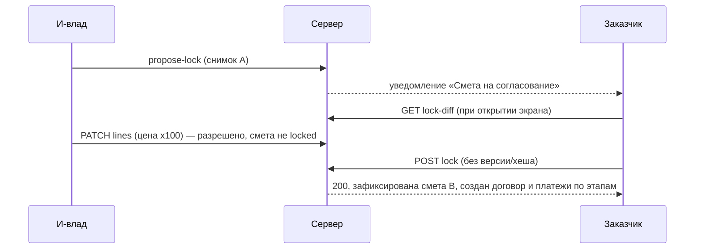
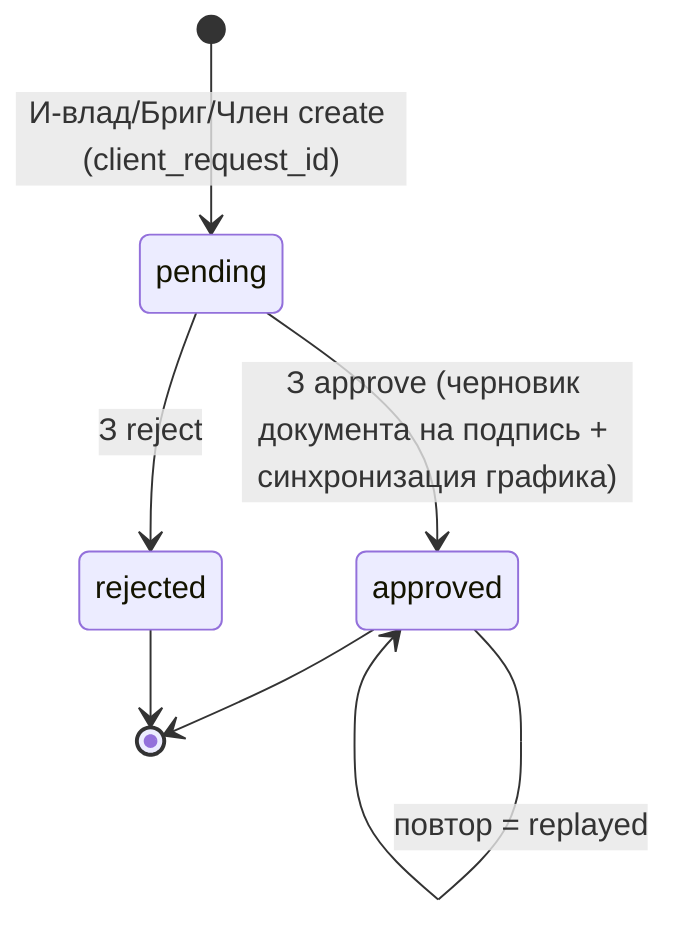
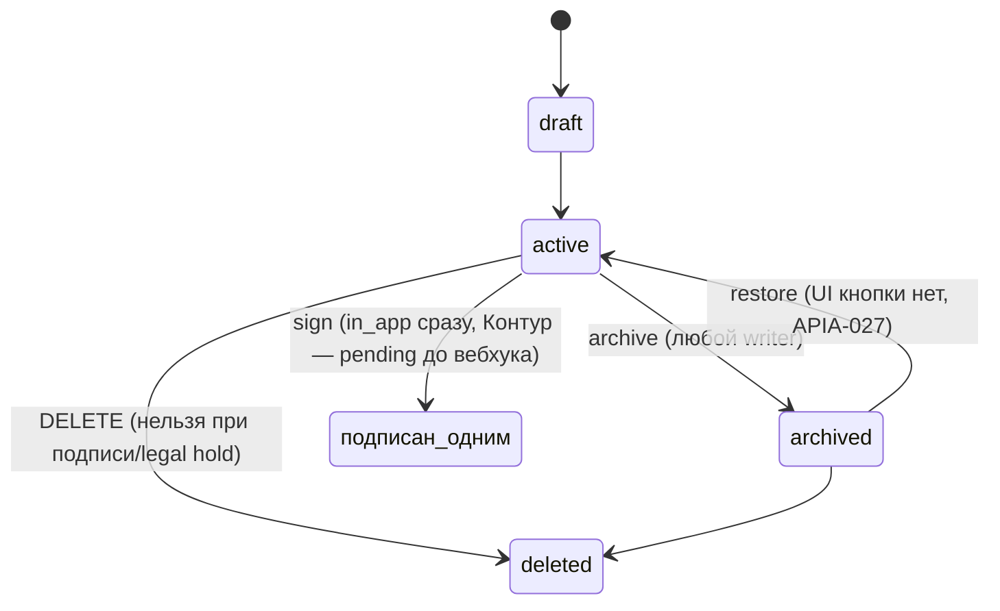
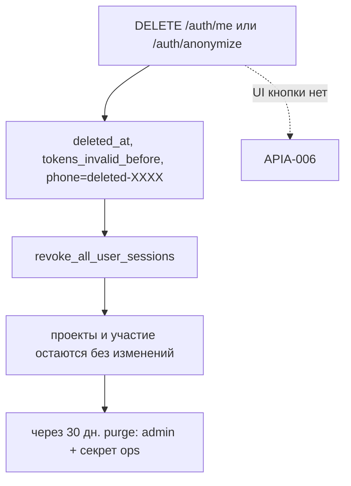

# Срез 11 — перепись backend-эндпоинтов, часть A (`account_lifecycle` … `fns`)

Дата аудита: 2026-09-30. Репозиторий `/Users/petr/renova`, коммит основания `717c3474`. Продуктовый код не менялся.

**Метод.** (1) Чтение всех 32 файлов `backend/app/api/v1/*.py` от `account_lifecycle.py` до `fns.py` и их сервисов. (2) Реальная таблица маршрутов, снятая из работающего `api_router` (а не из декораторов): 164 пары «метод + путь» в срезе — это важно, потому что `router.py` вырезает часть маршрутов и подменяет их «каноническими» (см. 1.1). (3) Автоматическая сверка с мобильным клиентом: все литералы `/api/v1/...` из `apps/mobile` сопоставлены с таблицей маршрутов (сырые данные: 465 вхождений). (4) Автоматический поиск покрытия по путям в `backend/tests` (по grep пути — грубая оценка, не покрытие строк). (5) 30 in-process проб (ASGI-клиент + `dependency_overrides`, SQLite `:memory:`, по образцу `backend/tests/test_floor_plan_acl_and_replay.py`; скрипт лежит вне репозитория и не коммитится). (6) Прогон существующих тестов среза: `pytest tests -k "calendar or floor_plan or estimate or approval or admin or article or bank or change_order or chat or design or document or esign or export or fns or account or analytics or budget_planner"` → **332 passed, 5 skipped, 2 failed** (см. APIA-031). Живой backend :8100 не трогался.

Пометка «ВЕРИФ.: да (P##)» = воспроизведено пробой P## этого аудита; «да (код)» = однозначно следует из кода с указанной строкой; «нет» = гипотеза.

Обозначения ролей: **З** — заказчик (`project.customer_id`); **И-влад** — главный исполнитель (`project.contractor_id`); **Бриг** — foreman команды И-влад; **Член** — member команды; **Набл-К** — участник команды с ролью `viewer` (только чтение); **Гость** — запись в `project_viewers`; **Технадзор** — активное назначение `ProjectTechnicalSupervisorAssignment`; **Адм** — прошедший `require_admin_user`.

---

## 1. Инвентарь среза

### 1.1 Как собирается роутер (`backend/app/api/v1/router.py`)

`api_router` (префикс `/api/v1`) подключает роутеры в определённом порядке, а функция `_remove_replaced_routes` (`router.py:44`) **физически вырезает** из «старых» роутеров те пары (метод, путь), которые заменены «каноническими» роутерами. Из-за этого в файлах остаётся мёртвый код — обработчики, которые никогда не вызываются, но выглядят рабочими (в том числе небезопасные).

| Вырезаемый набор (`router.py`) | Строка | Из какого роутера | Что вырезано | Заменяет | Оставшийся мёртвый обработчик |
|---|---|---|---|---|---|
| `_DOCUMENT_LIFECYCLE_ROUTES` | 85–90 | `documents.py` | sign / archive / restore / DELETE / legal-hold | `document_lifecycle.py` | `documents.py:297,380,484,505,523` |
| `_ACCOUNT_LIFECYCLE_ROUTES` + `_OTP_AUTH_ROUTES` | 107–109 | `auth.py` | anonymize, DELETE /me, revoke-all, purge, sms/send, sms/verify | `account_lifecycle.py`, `otp_auth.py` | `auth.py:62,71,104,120,263,274` |
| `_EXPENSE_MUTATION_ROUTES` | 96–97 | `os.py` | PATCH/DELETE `/os/expenses/{id}` | `expense_mutations.py` | (вне среза) |
| `_BANK_STATEMENT_ROUTES` + `_WARRANTY_MUTATION_ROUTES` | 160–162 | `export.py` | import/confirm выписки, POST warranty-claims | `bank_statements.py`, `warranty.py` | `export.py:446,736,780` |

Порядок подключения календаря (`router.py:142–144`): `calendar_integrity` → `calendar_mutations` → `calendar`. **`calendar_detail.py` не подключён вообще** (0 упоминаний в `router.py` и в остальном `app/`) — см. APIA-010.

Общая авторизация:
- `get_current_user` (`api/deps.py:90`): Bearer JWT (или `X-User-Id` только в профилях `allow_header_user_id`), 401 для удалённого аккаунта (`account_deleted`) и отозванных токенов (`session_revoked`).
- `require_project(db, project_id, user, write)` (`api/deps.py:112`): 404 «Проект не найден» если проекта нет; `team_service.can_access_project` (`services/team_service.py:509`) → `project_access_mode` (`team_service.py:472`); **для чтения дополнительный фолбэк «активный технадзор»** (`deps.py:126`); 403 «Нет доступа»; 404 «Проект в корзине». `write=True` закрыт для Гость и Набл-К.
- `require_admin_user` (`api/admin_access.py:38`): роль `contractor` **и** (в staging/production) явный id в `ADMIN_USER_IDS`; **в development/test без списка админом является ЛЮБОЙ подрядчик** (`admin_access.py:18-35`, проба P22).
- `require_chat_access` (`services/chat_acl.py:15`): тред обязан принадлежать `project_id` из пути (404 `chat_not_found`), затем `require_project`, а для операций с `allow_participant=True` допускается приглашённый участник именно этого треда.
- Капабилити команды (`team_service.py:518 require_capability`): `field_write` (owner/foreman/member), `escalate` и `schedule` (owner/foreman), `estimate_lock` (только owner). **В эндпоинтах среза используется не капабилити, а глобальная роль `user.role == contractor`** — поэтому «Член» проходит туда, куда по модели капабилити не должен (APIA-033).

### 1.2 Файлы среза

| Файл | Строк | Эндпоинтов (в рантайме) | Главные сервисы / модели |
|---|---|---|---|
| `account_lifecycle.py` | 98 | 4 | `account_lifecycle_service`, `account_purge_guard`, `session_service`; User |
| `activity.py` | 13 | 1 | `activity_service` |
| `admin.py` | 219 | 5 (+ вложенные) | `release_health_service`, `capacity_runtime_service`, `staging_readiness`; Project, User, AuditLog |
| `admin_outbox_dead_letters.py` | 146 | 6 | `outbox_dead_letter_service`; DomainOutbox |
| `admin_provider_reconciliations.py` | 74 | 3 | `provider_reconciliation_admin_service` |
| `admin_subscription_refunds.py` | 155 | 5 | `subscription_refund_review_service` |
| `analytics.py` | 218 | 10 | `budget_service`, `notification_service`, `email_stub`; EstimateLine, Room, Receipt, MaterialPick, WasteOrder, Expense, BudgetAlertSent |
| `approvals.py` | 281 | 3 | `approval_decision_service` → `material_pick_service`, `change_order_service`, `design_package_service`, `room_change_service`, `waste_order_service` |
| `articles.py` / `articles_admin.py` | 62 / 111 | 3 / 4 | RepairArticle, `data/repair_articles.py` |
| `audit.py` | 30 | 1 | AuditLog |
| `auth.py` | 291 | 8 живых (+6 мёртвых) | `session_service`, `chat_service.ensure_profile_code`, `fns.status_npd`, `otp_service` |
| `automation_worker.py` | 66 | 2 | `automation_reminders_worker`, `runtime_topology` |
| `bank_statements.py` | 113 | 2 | `bank_statement_integrity`, `integrations/bank_import` |
| `budget_planner.py` | 81 | 3 | `budget_planner_service`, `room_service` |
| `calendar.py` | 98 | 4 | `calendar_service`, `calendar_import_service`, `stage_service` |
| `calendar_detail.py` | 30 | **0 (не подключён)** | — |
| `calendar_integrity.py` | 187 | 4 | `calendar_integrity_service`; CalendarItem, User.ics_token (добавляется монкипатчем `models/calendar.py:22`) |
| `calendar_mutations.py` | 134 | 4 (PUT+PATCH) | `calendar_mutation_service` |
| `change_orders.py` | 179 | 4 | `change_order_service`, `change_order_create_service`, `client_write_idempotency` |
| `chat_inbox.py` | 57 | 2 | `chat_service`, `chat_participant_service` |
| `chats.py` | 428 | 15 | `chat_service`, `chat_message_mutation`, `chat_acl`, `chat_participant_service` |
| `checklist_templates.py` | 32 | 3 | ChecklistTemplate, ChecklistTemplateVersion |
| `design_packages.py` | 189 | 6 | `design_package_service` |
| `document_lifecycle.py` | 273 | 5 | `document_lifecycle_service`, `document_state_lifecycle_service` |
| `documents.py` | 580 | 6 живых (+5 мёртвых) | `project_document_service`, `document_ocr_service`, `storage_service` |
| `esign.py` | 306 | 5 | `project_document_service.complete_external_signature`, `esign.registry` |
| `estimate.py` | 247 | 9 | `estimate_service` |
| `expense_mutations.py` | 112 | 2 | `expense_integrity_service` |
| `export.py` | 829 | 21 живой (+3 мёртвых) | `pdf_helper`, `integrations/onec_export`, `contract_document_service`, `digest_lite_service` |
| `floor_plans.py` | 216 | 7 | `floor_plan_service` |
| `fns.py` | 246 | 7 | `fns` (npd, receipt_verify), `moy_nalog_oauth` |

### 1.3 Все эндпоинты среза (164 пары метод+путь)

Колонки: «Доступ» — зависимость авторизации и роли; «Проверка принадлежности проекту» — где именно привязывается объект к `project_id` (это и есть защита от класса IDOR «путь содержит project_id, а дочерний объект берётся только по своему id»); «Идемпотентность» — только для мутаций; «Клиент» — файл:строка вызова в `apps/mobile` либо **ОРФАН**; «Тест» — число тест-файлов в `backend/tests`, упоминающих путь (грубо, по grep).

Обозначение `require_project(read)` = `require_project(write=False)`; `require_project(write=True)` для краткости `RW`.

#### account_lifecycle.py

| # | file:line | Метод путь | Доступ (зависимость / роли) | Проверка принадлежности проекту | Модель запроса | Идемпотентность (для создающих) | Клиент | Тест |
|---|---|---|---|---|---|---|---|---|
| 1 | `account_lifecycle.py:32` | **POST** `/auth/anonymize` | JWT, любая роль (сам себе) | —: user = токен | resp: {ok,soft_deleted,...} | по состоянию (already_deleted) | `lib/api/auth.ts:15` | 1 |
| 2 | `account_lifecycle.py:41` | **DELETE** `/auth/me` | JWT (сам себе) | — | resp: то же | по состоянию | `lib/api/auth.ts:13` | 2 |
| 3 | `account_lifecycle.py:49` | **POST** `/auth/sessions/revoke-all` | JWT | — | resp {ok,revoked,access_invalidated} | естественная | `lib/api/auth.ts:17` | 1 |
| 4 | `account_lifecycle.py:69` | **POST** `/auth/admin/purge-deleted-accounts` | require_admin_user + заголовок X-Account-Purge-Secret | — | AccountPurgeRequest{confirm=PURGE_DELETED_ACCOUNTS, older_than_days 30..3650} | естественная | n/a: ops-скрипт (нет UI — ок) | 1 |

#### activity.py

| # | file:line | Метод путь | Доступ (зависимость / роли) | Проверка принадлежности проекту | Модель запроса | Идемпотентность (для создающих) | Клиент | Тест |
|---|---|---|---|---|---|---|---|---|
| 1 | `activity.py:10` | **GET** `/projects/{project_id}/activity` | JWT | require_project(read) | query kind/work_type/room_id | — | `lib/api/os.ts:47` | нет |

#### admin.py

| # | file:line | Метод путь | Доступ (зависимость / роли) | Проверка принадлежности проекту | Модель запроса | Идемпотентность (для создающих) | Клиент | Тест |
|---|---|---|---|---|---|---|---|---|
| 1 | `admin.py:14` | **GET** `/admin/stats` | require_admin_user (роль contractor + ADMIN_USER_IDS; в dev без списка — ЛЮБОЙ подрядчик) | — (платформенные данные) | — | — | `lib/api/admin.ts:101` | 1 |
| 2 | `admin.py:25` | **GET** `/admin/projects-chart` | require_admin_user | фильтр Project.contractor_id==user.id (не платформенный срез, вопреки префиксу /admin) | — | — | `lib/api/admin.ts:100` | 1 |
| 3 | `admin.py:51` | **GET** `/admin/revenue-chart` | require_admin_user | фильтр Project.contractor_id==user.id (не платформенный срез, вопреки префиксу /admin) | — | — | `lib/api/admin.ts:76` | 1 |
| 4 | `admin.py:83` | **GET** `/admin/release-health` | require_admin_user (роль contractor + ADMIN_USER_IDS; в dev без списка — ЛЮБОЙ подрядчик) | — (платформенные данные) | — | — | `lib/api/admin.ts:77` | 2 |
| 5 | `admin.py:207` | **GET** `/admin/h0-readiness` | require_admin_user (роль contractor + ADMIN_USER_IDS; в dev без списка — ЛЮБОЙ подрядчик) | — (платформенные данные) | — | — | `lib/api/admin.ts:86` | 2 |

#### admin_outbox_dead_letters.py

| # | file:line | Метод путь | Доступ (зависимость / роли) | Проверка принадлежности проекту | Модель запроса | Идемпотентность (для создающих) | Клиент | Тест |
|---|---|---|---|---|---|---|---|---|
| 1 | `admin_outbox_dead_letters.py:44` | **GET** `/admin/outbox/dead-letters` | require_admin_user | — | — | — | `lib/api/admin.ts:110` | 2 |
| 2 | `admin_outbox_dead_letters.py:61` | **GET** `/admin/outbox/dead-letters/{outbox_id}` | require_admin_user | — | — | — | `lib/api/admin.ts:50` | 2 |
| 3 | `admin_outbox_dead_letters.py:77` | **POST** `/admin/outbox/dead-letters/{outbox_id}/claim` | require_admin_user | — | claim_token (release/replay) | claim-токен + 409 | `lib/api/admin.ts:50` (deadLetterPath) | 2 |
| 4 | `admin_outbox_dead_letters.py:93` | **POST** `/admin/outbox/dead-letters/{outbox_id}/release` | require_admin_user | — | claim_token (release/replay) | claim-токен + 409 | `lib/api/admin.ts:50` | 2 |
| 5 | `admin_outbox_dead_letters.py:111` | **POST** `/admin/outbox/dead-letters/{outbox_id}/replay` | require_admin_user | — | claim_token (release/replay) | claim-токен + 409 | `lib/api/admin.ts:50` | 2 |
| 6 | `admin_outbox_dead_letters.py:130` | **GET** `/admin/outbox/dead-letters/{outbox_id}/history` | require_admin_user | — | — | — | `lib/api/admin.ts:138` | 1 |

#### admin_provider_reconciliations.py

| # | file:line | Метод путь | Доступ (зависимость / роли) | Проверка принадлежности проекту | Модель запроса | Идемпотентность (для создающих) | Клиент | Тест |
|---|---|---|---|---|---|---|---|---|
| 1 | `admin_provider_reconciliations.py:32` | **GET** `/admin/provider-reconciliations` | require_admin_user | — | — | — | **ОРФАН** | 2 |
| 2 | `admin_provider_reconciliations.py:53` | **GET** `/admin/provider-reconciliations/{reconciliation_id}` | require_admin_user | — | — | — | **ОРФАН** | 2 |
| 3 | `admin_provider_reconciliations.py:65` | **POST** `/admin/provider-reconciliations/{reconciliation_id}/requeue` | require_admin_user | — | — | состояние (409) | **ОРФАН** | 2 |

#### admin_subscription_refunds.py

| # | file:line | Метод путь | Доступ (зависимость / роли) | Проверка принадлежности проекту | Модель запроса | Идемпотентность (для создающих) | Клиент | Тест |
|---|---|---|---|---|---|---|---|---|
| 1 | `admin_subscription_refunds.py:54` | **GET** `/admin/subscription-refunds/reviews` | require_admin_user | — | — | — | **ОРФАН** | 1 |
| 2 | `admin_subscription_refunds.py:76` | **GET** `/admin/subscription-refunds/reviews/{refund_id}` | require_admin_user | — | — | — | **ОРФАН** | 1 |
| 3 | `admin_subscription_refunds.py:88` | **POST** `/admin/subscription-refunds/reviews/{refund_id}/claim` | require_admin_user | — | expected_version (оптимистичная блокировка), resolve: decision_key+action+note | decision_key + version | **ОРФАН** | 1 |
| 4 | `admin_subscription_refunds.py:110` | **POST** `/admin/subscription-refunds/reviews/{refund_id}/release` | require_admin_user | — | expected_version (оптимистичная блокировка), resolve: decision_key+action+note | decision_key + version | **ОРФАН** | 1 |
| 5 | `admin_subscription_refunds.py:132` | **POST** `/admin/subscription-refunds/reviews/{refund_id}/resolve` | require_admin_user | — | expected_version (оптимистичная блокировка), resolve: decision_key+action+note | decision_key + version | **ОРФАН** | 1 |

#### analytics.py

| # | file:line | Метод путь | Доступ (зависимость / роли) | Проверка принадлежности проекту | Модель запроса | Идемпотентность (для создающих) | Клиент | Тест |
|---|---|---|---|---|---|---|---|---|
| 1 | `analytics.py:12` | **GET** `/projects/analytics/contractor-summary` | JWT + user.role==contractor (403 иначе) | только Project.contractor_id==user.id (команда/foreman не видят) | — | — | `lib/api/projects.ts:33` | нет |
| 2 | `analytics.py:25` | **GET** `/projects/{project_id}/analytics` | JWT | require_project(read) | — | — | `lib/api/projects.ts:32` | 1 |
| 3 | `analytics.py:38` | **GET** `/projects/{project_id}/analytics/budget-alerts` | JWT | require_project(read); ПОБОЧНЫЕ ЭФФЕКТЫ в GET (уведомление+email+commit) | — | — | `lib/api/receipts.ts:114` | нет |
| 4 | `analytics.py:75` | **GET** `/projects/{project_id}/analytics/budget-room-lines/{room_id}` | JWT | require_project(read); room_id НЕ сверяется с project_id -> IDOR (APIA-002) | — | — | `lib/api/receipts.ts:115` | нет |
| 5 | `analytics.py:88` | **GET** `/projects/{project_id}/analytics/budget-breakdown` | JWT | require_project(read) | — | — | `lib/api/receipts.ts:119` | нет |
| 6 | `analytics.py:111` | **GET** `/projects/{project_id}/analytics/budget-category-alerts` | JWT | require_project(read) | — | — | `lib/api/receipts.ts:116` | нет |
| 7 | `analytics.py:135` | **GET** `/projects/{project_id}/analytics/budget-forecast` | JWT | require_project(read) | — | — | `lib/api/receipts.ts:117` | нет |
| 8 | `analytics.py:144` | **GET** `/projects/{project_id}/analytics/budget-scenario` | JWT | require_project(read) | — | — | `lib/api/receipts.ts:118` | нет |
| 9 | `analytics.py:154` | **GET** `/projects/{project_id}/analytics/expenses-summary` | JWT | require_project(read) | — | — | `lib/api/receipts.ts:113` | нет |
| 10 | `analytics.py:202` | **GET** `/projects/{project_id}/analytics/expenses.csv` | JWT | require_project(read) | — | — | `lib/exportExpensesCsv.ts:9` | нет |

#### approvals.py

| # | file:line | Метод путь | Доступ (зависимость / роли) | Проверка принадлежности проекту | Модель запроса | Идемпотентность (для создающих) | Клиент | Тест |
|---|---|---|---|---|---|---|---|---|
| 1 | `approvals.py:91` | **GET** `/projects/{project_id}/approvals` | JWT | require_project(read); пункты только для customer_id и для owner/foreman (room_change) | — | — | `lib/api/misc.ts:148` | нет |
| 2 | `approvals.py:246` | **POST** `/projects/{project_id}/approvals/{item_id}/approve` | JWT | require_project(write=True) + approval_decision_service (customer/executor по типу) | ApproveIn{type} | состояние (replayed) | `lib/api/misc.ts:153`, `lib/api/misc.ts:157` | 2 |
| 3 | `approvals.py:265` | **POST** `/projects/{project_id}/approvals/{item_id}/reject` | JWT | require_project(write=True) + сервис | RejectIn{type,reason<=1000} | состояние | `lib/api/misc.ts:164`, `lib/api/misc.ts:168` | нет |

#### articles.py

| # | file:line | Метод путь | Доступ (зависимость / роли) | Проверка принадлежности проекту | Модель запроса | Идемпотентность (для создающих) | Клиент | Тест |
|---|---|---|---|---|---|---|---|---|
| 1 | `articles.py:23` | **GET** `/articles` | нет (публично) | — | — | — | `lib/api/misc.ts:5` | нет |
| 2 | `articles.py:43` | **GET** `/articles/categories` | нет (публично) | — | — | — | **ОРФАН** | нет |
| 3 | `articles.py:48` | **GET** `/articles/{slug}` | нет (публично) | — | — | — | `lib/api/admin.ts:170`, `lib/api/misc.ts:6` | 1 |

#### articles_admin.py

| # | file:line | Метод путь | Доступ (зависимость / роли) | Проверка принадлежности проекту | Модель запроса | Идемпотентность (для создающих) | Клиент | Тест |
|---|---|---|---|---|---|---|---|---|
| 1 | `articles_admin.py:24` | **GET** `/articles/admin` | require_admin_user | — | — | — | `lib/api/admin.ts:170` | 1 |
| 2 | `articles_admin.py:43` | **DELETE** `/articles/admin/{slug}` | require_admin_user | — | — | replayed | `lib/api/admin.ts:173` | 1 |
| 3 | `articles_admin.py:61` | **POST** `/articles/admin` | require_admin_user | — | ArticleIn (slug<=160,category<=120,tags<=1000) | slug unique -> 409 (повтор после потери ответа = 409) | `lib/api/admin.ts:170`, `lib/api/admin.ts:171` | 1 |
| 4 | `articles_admin.py:83` | **PATCH** `/articles/admin/{slug}` | require_admin_user | — | ArticleIn целиком (нет поля published) | — | `lib/api/admin.ts:172` | 1 |

#### audit.py

| # | file:line | Метод путь | Доступ (зависимость / роли) | Проверка принадлежности проекту | Модель запроса | Идемпотентность (для создающих) | Клиент | Тест |
|---|---|---|---|---|---|---|---|---|
| 1 | `audit.py:12` | **GET** `/audit/logs` | require_admin_user | — (последние 100, без фильтров/пагинации) | — | — | `lib/api/admin.ts:151` | нет |

#### auth.py

| # | file:line | Метод путь | Доступ (зависимость / роли) | Проверка принадлежности проекту | Модель запроса | Идемпотентность (для создающих) | Клиент | Тест |
|---|---|---|---|---|---|---|---|---|
| 1 | `auth.py:52` | **GET** `/auth/export` | JWT | проекты только где customer_id/contractor_id==user (команда/гость не попадают) | — | — | `lib/api/auth.ts:14` | нет |
| 2 | `auth.py:94` | **POST** `/auth/ws-ticket` | JWT | — | — | — | `lib/wsAuthQuery.ts:18` | нет |
| 3 | `auth.py:162` | **POST** `/auth/register` | нет; _open_registration_allowed только development/test | — | RegisterRequest{phone,role,full_name,inn} | phone unique -> 409 | `lib/api/auth.ts:7` | 1 |
| 4 | `auth.py:193` | **GET** `/auth/me` | JWT | — | — | — | `lib/api/auth.ts:13` | 2 |
| 5 | `auth.py:204` | **POST** `/auth/demo` | нет; политика allow_demo_seed | — | DemoLoginRequest{role customer|contractor} | — | `lib/api/auth.ts:11` | 44 |
| 6 | `auth.py:220` | **POST** `/auth/demo/guest` | нет; политика allow_demo_seed | — | — | — | `lib/api/auth.ts:12` | 1 |
| 7 | `auth.py:233` | **POST** `/auth/refresh` | refresh-токен в теле | — | RefreshRequest | ротация | `lib/api/client.ts:341` | 1 |
| 8 | `auth.py:255` | **POST** `/auth/logout` | refresh-токен в теле (без JWT) | — | RefreshRequest | естественная | `lib/api/auth.ts:27` | нет |

#### automation_worker.py

| # | file:line | Метод путь | Доступ (зависимость / роли) | Проверка принадлежности проекту | Модель запроса | Идемпотентность (для создающих) | Клиент | Тест |
|---|---|---|---|---|---|---|---|---|
| 1 | `automation_worker.py:19` | **GET** `/automation/worker` | require_admin_user | — | — | — | **ОРФАН** | 1 |
| 2 | `automation_worker.py:41` | **POST** `/automation/worker/tick` | require_admin_user | — | — | нет (ручной тик) | **ОРФАН** | нет |

#### bank_statements.py

| # | file:line | Метод путь | Доступ (зависимость / роли) | Проверка принадлежности проекту | Модель запроса | Идемпотентность (для создающих) | Клиент | Тест |
|---|---|---|---|---|---|---|---|---|
| 1 | `bank_statements.py:40` | **POST** `/projects/{project_id}/import/bank-statement` | JWT | require_project(write=create_expenses) | BankStatementIn{csv_text<=2MB,create_expenses} | дедуп строк выписки (replayed); match_token подписан | `lib/api/os.ts:60` | 3 |
| 2 | `bank_statements.py:78` | **POST** `/projects/{project_id}/import/bank-statement/confirm` | JWT + role customer и user.id==project.customer_id | require_project(write=True) | BankConfirmIn{payment_ids<=100,match_token} | confirm replayed/blocked | `lib/api/os.ts:61` | 2 |

#### budget_planner.py

| # | file:line | Метод путь | Доступ (зависимость / роли) | Проверка принадлежности проекту | Модель запроса | Идемпотентность (для создающих) | Клиент | Тест |
|---|---|---|---|---|---|---|---|---|
| 1 | `budget_planner.py:26` | **GET** `/market/regions` | нет (публично) | — | — | — | `lib/api/market.ts:17` | нет |
| 2 | `budget_planner.py:31` | **POST** `/market/estimate` | нет (публично, без rate-limit на уровне роутера) | — | MarketEstimateIn (без ge/le) | — | `lib/api/market.ts:18` | нет |
| 3 | `budget_planner.py:49` | **POST** `/projects/{project_id}/budget/market-estimate` | JWT | require_project(read); при наличии комнат подменяет метрики из тела метриками rooms[0] (APIA-016) | MarketEstimateIn | — | `lib/api/market.ts:20` | нет |

#### calendar.py

| # | file:line | Метод путь | Доступ (зависимость / роли) | Проверка принадлежности проекту | Модель запроса | Идемпотентность (для создающих) | Клиент | Тест |
|---|---|---|---|---|---|---|---|---|
| 1 | `calendar.py:23` | **GET** `/projects/{project_id}/calendar` | JWT | require_project(read) | — | — | `lib/api/calendar.ts:13`, `lib/api/calendar.ts:21` | 1 |
| 2 | `calendar.py:32` | **PATCH** `/projects/{project_id}/calendar/stages` | JWT + user.role==contractor | require_project(write=True); stage_id привязан к project (stage_service.update_stage_dates) | StageDatesUpdate{stage_id,planned_start,planned_end} | абсолютные значения | `lib/api/calendar.ts:31`, `lib/api/calendar.ts:39` | 1 |
| 3 | `calendar.py:51` | **GET** `/projects/{project_id}/calendar.ics` | JWT (Bearer) | require_project(read) (дублируется require_project_dep) | — | — | `lib/exportIcalFile.ts:9` | нет |
| 4 | `calendar.py:76` | **POST** `/projects/{project_id}/calendar/import` | JWT | require_project(write=True) | IcalImportIn{content,client_request_id?} | хеш содержимого + client_request_id (409 calendar_import_conflict) | `lib/api/calendar.ts:53`, `lib/api/calendar.ts:61` | нет |

#### calendar_detail.py — НЕ ПОДКЛЮЧЁН в router.py, эндпоинтов в рантайме 0


#### calendar_integrity.py

| # | file:line | Метод путь | Доступ (зависимость / роли) | Проверка принадлежности проекту | Модель запроса | Идемпотентность (для создающих) | Клиент | Тест |
|---|---|---|---|---|---|---|---|---|
| 1 | `calendar_integrity.py:57` | **GET** `/calendar` | JWT | project_id? -> require_project(read); иначе visible_items (свои личные + публичные accessible) | query: project_id,from/to(4 алиаса),limit | — | **ОРФАН** | 3 |
| 2 | `calendar_integrity.py:93` | **GET** `/calendar/upcoming` | JWT | visible_items | — | — | **ОРФАН** | 1 |
| 3 | `calendar_integrity.py:146` | **GET** `/calendar/ics` | query token == User.ics_token (нет JWT) | по владельцу токена; токен НЕЛЬЗЯ получить ни одной ручкой (APIA-010) | — | — | **ОРФАН** | 1 |
| 4 | `calendar_integrity.py:168` | **POST** `/calendar/sync-stages/{project_id}` | JWT | require_project(write=True) | — | идемпотентна по построению | **ОРФАН** | 1 |

#### calendar_mutations.py

| # | file:line | Метод путь | Доступ (зависимость / роли) | Проверка принадлежности проекту | Модель запроса | Идемпотентность (для создающих) | Клиент | Тест |
|---|---|---|---|---|---|---|---|---|
| 1 | `calendar_mutations.py:62` | **POST** `/calendar` | JWT | _validate_link: can_access_project(write) для project/stage | CalendarItemCreateIn | НЕТ (replayed всегда False) | **ОРФАН** | 3 |
| 2 | `calendar_mutations.py:93` | **PUT** `/calendar/{item_id}` | JWT | только владелец item.user_id; stage-проекции запрещены | CalendarItemPatchIn | абсолютные значения | **ОРФАН** | 3 |
| 3 | `calendar_mutations.py:93` | **PATCH** `/calendar/{item_id}` | JWT | то же | CalendarItemPatchIn | то же | **ОРФАН** | 3 |
| 4 | `calendar_mutations.py:118` | **DELETE** `/calendar/{item_id}` | JWT | только владелец | — | 404 при повторе | **ОРФАН** | 3 |

#### change_orders.py

| # | file:line | Метод путь | Доступ (зависимость / роли) | Проверка принадлежности проекту | Модель запроса | Идемпотентность (для создающих) | Клиент | Тест |
|---|---|---|---|---|---|---|---|---|
| 1 | `change_orders.py:28` | **GET** `/projects/{project_id}/change-orders` | JWT | require_project(read) | — | — | `lib/api/estimate.ts:114`, `lib/api/estimate.ts:135` | 5 |
| 2 | `change_orders.py:35` | **POST** `/projects/{project_id}/change-orders` | JWT + user.role==contractor | require_project(write=True) (foreman/member тоже) | ChangeOrderCreate{title,amount>0,description,client_request_id} | ДА: replay_entity_id+commit_client_write | `lib/api/estimate.ts:110`, `lib/api/estimate.ts:114` | 5 |
| 3 | `change_orders.py:114` | **POST** `/projects/{project_id}/change-orders/{order_id}/approve` | JWT + user.role==customer | require_project(write=True); order_id в project_id (сервис) | — | состояние + replayed | `lib/api/estimate.ts:131`, `lib/api/estimate.ts:140` | 4 |
| 4 | `change_orders.py:153` | **POST** `/projects/{project_id}/change-orders/{order_id}/reject` | JWT + user.role==customer | require_project(write=True) | — | состояние + replayed | `lib/api/estimate.ts:146`, `lib/api/estimate.ts:152` | 1 |

#### chat_inbox.py

| # | file:line | Метод путь | Доступ (зависимость / роли) | Проверка принадлежности проекту | Модель запроса | Идемпотентность (для создающих) | Клиент | Тест |
|---|---|---|---|---|---|---|---|---|
| 1 | `chat_inbox.py:34` | **GET** `/chats/inbox` | JWT | Project.customer_id/contractor_id==user + участник треда; команда/гость/технадзор НЕ включены (APIA-009) | — | — | `lib/api/chats.ts:40` | 1 |
| 2 | `chat_inbox.py:47` | **GET** `/chats/unread-total` | JWT | то же | — | — | `lib/api/chats.ts:41` | нет |

#### chats.py

| # | file:line | Метод путь | Доступ (зависимость / роли) | Проверка принадлежности проекту | Модель запроса | Идемпотентность (для создающих) | Клиент | Тест |
|---|---|---|---|---|---|---|---|---|
| 1 | `chats.py:148` | **GET** `/projects/{project_id}/chats` | JWT | require_project(read) | — | — | `lib/api/chats.ts:39` | 2 |
| 2 | `chats.py:157` | **POST** `/projects/{project_id}/chats` | JWT | require_project(write=True) | ThreadCreate{title,topic,client_request_id?} | ДА (опц. client_request_id) | `lib/api/chats.ts:39`, `lib/api/chats.ts:47` | 2 |
| 3 | `chats.py:175` | **GET** `/projects/{project_id}/chats/unread-count` | JWT | require_project(read) | — | — | `lib/api/chats.ts:253` | 1 |
| 4 | `chats.py:182` | **GET** `/projects/{project_id}/chats/search` | JWT | require_project(read) (через require_project_dep); ищет по ВСЕМ тредам проекта, q без экранирования %/_ | — | — | `lib/api/chats.ts:254` | 1 |
| 5 | `chats.py:190` | **GET** `/projects/{project_id}/chats/{thread_id}.pdf` | JWT | require_chat_access: thread.project_id==path project (404) + require_project; участник треда допускается там где allow_participant (read, участник) | — | — | `lib/api/chats.ts:239` | 1 |
| 6 | `chats.py:209` | **PATCH** `/projects/{project_id}/chats/{thread_id}/state` | JWT | require_chat_access: thread.project_id==path project (404) + require_project; участник треда допускается там где allow_participant (read, участник) | ThreadState{is_pinned,is_archived} | абсолютные значения | `lib/api/chats.ts:63`, `lib/api/chats.ts:71` | нет |
| 7 | `chats.py:217` | **POST** `/projects/{project_id}/chats/{thread_id}/read` | JWT | require_chat_access: thread.project_id==path project (404) + require_project; участник треда допускается там где allow_participant (read, участник) | ReadBody{read_through_message_id} | курсор монотонный | `lib/api/chats.ts:221`, `lib/api/chats.ts:229` | нет |
| 8 | `chats.py:242` | **GET** `/projects/{project_id}/chats/{thread_id}` | JWT | require_chat_access: thread.project_id==path project (404) + require_project; участник треда допускается там где allow_participant (read, участник) | — | — | `lib/api/chats.ts:252`, `lib/api/chats.ts:253` | 2 |
| 9 | `chats.py:265` | **GET** `/projects/{project_id}/chats/{thread_id}/participants` | JWT | require_chat_access: thread.project_id==path project (404) + require_project; участник треда допускается там где allow_participant (read, участник) | — | — | **ОРФАН** | нет |
| 10 | `chats.py:273` | **POST** `/projects/{project_id}/chats/{thread_id}/invite` | JWT | require_chat_access: thread.project_id==path project (404) + require_project; участник треда допускается там где allow_participant (write, без участников) | InviteBody{phone|profile_code} | нет (естественно уникальный участник) | `lib/api/chats.ts:85` | нет |
| 11 | `chats.py:327` | **POST** `/projects/{project_id}/chats/{thread_id}/messages/{message_id}/confirm` | JWT | require_chat_access: thread.project_id==path project (404) + require_project; участник треда допускается там где allow_participant (write); message привязан к треду | — | состояние | `lib/api/chats.ts:259`, `lib/api/chats.ts:267` | нет |
| 12 | `chats.py:362` | **POST** `/projects/{project_id}/chats/{thread_id}/messages/{message_id}/react` | JWT | require_chat_access: thread.project_id==path project (404) + require_project; участник треда допускается там где allow_participant (read, участник) | ReactionBody{emoji,client_request_id?} | опц. client_request_id (без него toggle не идемпотентен) | `lib/api/chats.ts:107`, `lib/api/chats.ts:115` | нет |
| 13 | `chats.py:382` | **POST** `/projects/{project_id}/chats/{thread_id}/messages/{message_id}/pin` | JWT | require_chat_access: thread.project_id==path project (404) + require_project; участник треда допускается там где allow_participant (write) | query pin=bool | абсолютное | `lib/api/chats.ts:133`, `lib/api/chats.ts:141` | нет |
| 14 | `chats.py:402` | **POST** `/projects/{project_id}/chats/{thread_id}/messages/{message_id}/task` | JWT | require_chat_access: thread.project_id==path project (404) + require_project; участник треда допускается там где allow_participant (write) | TaskFromMessage{title,assignee_id,due_at,work_type,client_request_id?} | опц. client_request_id | `lib/api/chats.ts:162`, `lib/api/chats.ts:170` | нет |
| 15 | `chats.py:417` | **POST** `/projects/{project_id}/chats/{thread_id}/invoice` | JWT + role contractor | require_chat_access: thread.project_id==path project (404) + require_project; участник треда допускается там где allow_participant (write) | PaymentFromChat{title,amount>0,payment_type,client_request_id?} | опц. client_request_id | `lib/api/chats.ts:190`, `lib/api/chats.ts:198` | нет |

#### checklist_templates.py

| # | file:line | Метод путь | Доступ (зависимость / роли) | Проверка принадлежности проекту | Модель запроса | Идемпотентность (для создающих) | Клиент | Тест |
|---|---|---|---|---|---|---|---|---|
| 1 | `checklist_templates.py:16` | **GET** `/checklist-templates` | JWT | по user_id==user (свои) | — | — | `lib/api/admin.ts:178` | нет |
| 2 | `checklist_templates.py:21` | **POST** `/checklist-templates` | JWT | создаёт для user | TemplateIn{name,items} без ограничений | НЕТ | `lib/api/admin.ts:178`, `lib/api/admin.ts:179` | нет |
| 3 | `checklist_templates.py:29` | **GET** `/checklist-templates/{tpl_id}/versions` | JWT | НЕТ проверки владельца шаблона -> IDOR (APIA-003) | — | — | `lib/api/admin.ts:175` | нет |

#### design_packages.py

| # | file:line | Метод путь | Доступ (зависимость / роли) | Проверка принадлежности проекту | Модель запроса | Идемпотентность (для создающих) | Клиент | Тест |
|---|---|---|---|---|---|---|---|---|
| 1 | `design_packages.py:57` | **GET** `/projects/{project_id}/design-packages` | JWT | require_project(read) | — | — | `lib/api/design.ts:8` | 1 |
| 2 | `design_packages.py:72` | **POST** `/projects/{project_id}/design-packages` | JWT | require_project(write=True) + _is_executor (owner/foreman) | DesignIn{title,file_key,notes,client_request_id?} | ДА (опц.) | `lib/api/design.ts:18`, `lib/api/design.ts:26` | 1 |
| 3 | `design_packages.py:121` | **POST** `/projects/{project_id}/design-packages/{pkg_id}/submit` | JWT | require_project(write=True) + _validate_actor (owner/foreman); пакет по (id, project_id) | — | состояние (replayed) | `lib/api/design.ts:36`, `lib/api/design.ts:41` | нет |
| 4 | `design_packages.py:137` | **POST** `/projects/{project_id}/design-packages/{pkg_id}/approve` | JWT | require_project(write=True) + _validate_actor (customer_id проекта); пакет по (id, project_id) | — | состояние (replayed) | `lib/api/design.ts:51`, `lib/api/design.ts:56` | нет |
| 5 | `design_packages.py:153` | **POST** `/projects/{project_id}/design-packages/{pkg_id}/reject` | JWT | require_project(write=True) + _validate_actor (customer_id проекта); пакет по (id, project_id) | — | состояние (replayed) | **ОРФАН** | нет |
| 6 | `design_packages.py:169` | **GET** `/projects/{project_id}/design-packages/diff` | JWT | require_project(read) | query v1,v2 | — | `lib/api/design.ts:65` | нет |

#### document_lifecycle.py

| # | file:line | Метод путь | Доступ (зависимость / роли) | Проверка принадлежности проекту | Модель запроса | Идемпотентность (для создающих) | Клиент | Тест |
|---|---|---|---|---|---|---|---|---|
| 1 | `document_lifecycle.py:94` | **POST** `/projects/{project_id}/documents/{document_id}/sign` | JWT | require_project(write) с маскировкой 403/404 -> 404; документ по project_id | sign: DocumentSignIn; legal-hold: LegalHoldIn | sign: existing signature replay; остальные по состоянию | `lib/api/documents.ts:69`, `lib/api/documents.ts:77` | 3 |
| 2 | `document_lifecycle.py:140` | **POST** `/projects/{project_id}/documents/{document_id}/archive` | JWT | require_project(write) с маскировкой 403/404 -> 404; документ по project_id | sign: DocumentSignIn; legal-hold: LegalHoldIn | sign: existing signature replay; остальные по состоянию | `lib/api/documents.ts:118`, `lib/api/documents.ts:128` | 2 |
| 3 | `document_lifecycle.py:170` | **POST** `/projects/{project_id}/documents/{document_id}/restore` | JWT | require_project(write) с маскировкой 403/404 -> 404; документ по project_id | sign: DocumentSignIn; legal-hold: LegalHoldIn | sign: existing signature replay; остальные по состоянию | `lib/api/documents.ts:165` | 1 |
| 4 | `document_lifecycle.py:201` | **DELETE** `/projects/{project_id}/documents/{document_id}` | JWT | то же (write) | — | состояние (replayed) | `lib/api/documents.ts:174` | 4 |
| 5 | `document_lifecycle.py:234` | **POST** `/projects/{project_id}/documents/{document_id}/legal-hold` | JWT | require_project(write) с маскировкой 403/404 -> 404; документ по project_id | sign: DocumentSignIn; legal-hold: LegalHoldIn | sign: existing signature replay; остальные по состоянию | `lib/api/documents.ts:111` | 1 |

#### documents.py

| # | file:line | Метод путь | Доступ (зависимость / роли) | Проверка принадлежности проекту | Модель запроса | Идемпотентность (для создающих) | Клиент | Тест |
|---|---|---|---|---|---|---|---|---|
| 1 | `documents.py:63` | **GET** `/projects/{project_id}/documents` | JWT | require_project(read) (403/404 -> 404) | — | — | `lib/api/documents.ts:122`, `lib/api/documents.ts:15` | 3 |
| 2 | `documents.py:242` | **POST** `/projects/{project_id}/documents` | JWT | require_project(write=True); stage_id/payment_id сверяются с проектом; href/storage_key НЕ валидируются | DocumentCreateIn | НЕТ | `lib/api/documents.ts:122`, `lib/api/documents.ts:15` | 3 |
| 3 | `documents.py:271` | **POST** `/projects/{project_id}/documents/{document_id}/versions` | JWT | require_project(write=True); документ по project_id | DocumentVersionIn (href/storage_key не валидируются) | НЕТ | **ОРФАН** | нет |
| 4 | `documents.py:417` | **POST** `/projects/{project_id}/documents/upload` | JWT | require_project(write=True) | multipart file<=20MB (читается целиком в память до проверки размера) | НЕТ | `lib/api/documents.ts:149` | нет |
| 5 | `documents.py:545` | **GET** `/projects/{project_id}/documents/{document_id}/ocr` | JWT | require_project(read) | — | — | `lib/api/documents.ts:88` | нет |
| 6 | `documents.py:561` | **POST** `/projects/{project_id}/documents/{document_id}/ocr` | JWT | require_project(write=True) | OcrRunIn{apply_type} | нет | `lib/api/documents.ts:88`, `lib/api/documents.ts:99` | нет |

#### esign.py

| # | file:line | Метод путь | Доступ (зависимость / роли) | Проверка принадлежности проекту | Модель запроса | Идемпотентность (для создающих) | Клиент | Тест |
|---|---|---|---|---|---|---|---|---|
| 1 | `esign.py:217` | **GET** `/esign/health` | JWT (любая роль) | — раскрывает режимы/вебхук-URL любому пользователю | — | — | `lib/api/admin.ts:90` | 1 |
| 2 | `esign.py:248` | **GET** `/esign/providers` | JWT | — | — | — | `lib/api/documents.ts:18` | нет |
| 3 | `esign.py:253` | **POST** `/esign/webhooks/kontur` | заголовок X-Esign-Secret (hmac.compare_digest) | — | body:dict | дубликат внешнего id -> duplicate:true | n/a: вызывает провайдер | 2 |
| 4 | `esign.py:267` | **POST** `/esign/webhooks/goskey` | X-Esign-Secret | — | body:dict | как выше | n/a: вызывает провайдер | нет |
| 5 | `esign.py:281` | **POST** `/esign/dev/kontur/simulate` | нет; только development/test (иначе 404) | — | EsignWebhookIn | — | n/a: dev-инструмент | нет |

#### estimate.py

| # | file:line | Метод путь | Доступ (зависимость / роли) | Проверка принадлежности проекту | Модель запроса | Идемпотентность (для создающих) | Клиент | Тест |
|---|---|---|---|---|---|---|---|---|
| 1 | `estimate.py:58` | **PATCH** `/projects/{project_id}/estimate/lines/{line_id}` | JWT + role contractor | require_project(write=True); строка по (id, project_id) — IDOR закрыт (#375) | LinePatch (без ge/le) | абсолютные значения | `lib/api/estimate.ts:10`, `lib/api/estimate.ts:18` | 3 |
| 2 | `estimate.py:76` | **POST** `/projects/{project_id}/estimate/lines` | JWT + role contractor | require_project(write=True); room_id не валидируется (APIA-012) | LineCreate{...,client_request_id?} | ДА (опц.) | `lib/api/estimate.ts:38`, `lib/api/estimate.ts:46` | 2 |
| 3 | `estimate.py:108` | **POST** `/projects/{project_id}/estimate/import-csv` | JWT + role contractor | require_project(write=True) | EstimateCsvImport{csv_text<=500k} | НЕТ (APIA-011) | `lib/api/estimate.ts:172` | 3 |
| 4 | `estimate.py:127` | **GET** `/projects/{project_id}/estimate/materials-stats` | JWT | require_project(read) | — | — | `lib/api/estimate.ts:54` | 1 |
| 5 | `estimate.py:133` | **GET** `/projects/{project_id}/estimate/lock-diff` | JWT | require_project(read) | — | — | `lib/api/estimate.ts:67` | нет |
| 6 | `estimate.py:143` | **POST** `/projects/{project_id}/estimate/propose-lock` | JWT + role contractor | require_project(write=True) + только project.contractor_id (owner) | — | обновляет TTL | `lib/api/estimate.ts:87`, `lib/api/estimate.ts:94` | 1 |
| 7 | `estimate.py:173` | **POST** `/projects/{project_id}/estimate/lock` | JWT + role customer | require_project(write=True); service: locked_by==customer_id, нужен propose (TTL 14 дн.) | — | already_locked -> 409 | `lib/api/estimate.ts:72`, `lib/api/estimate.ts:79` | 1 |
| 8 | `estimate.py:202` | **POST** `/projects/{project_id}/estimate/reject-lock` | JWT + role customer | require_project(write=True) | EstimateProposalClearIn{reason} | 409 no_proposal | `lib/api/estimate.ts:181`, `lib/api/estimate.ts:188` | нет |
| 9 | `estimate.py:227` | **POST** `/projects/{project_id}/estimate/withdraw-lock` | JWT + role contractor | require_project(write=True); сервис: только owner | EstimateProposalClearIn | 409 no_proposal | `lib/api/estimate.ts:197`, `lib/api/estimate.ts:204` | нет |

#### expense_mutations.py

| # | file:line | Метод путь | Доступ (зависимость / роли) | Проверка принадлежности проекту | Модель запроса | Идемпотентность (для создающих) | Клиент | Тест |
|---|---|---|---|---|---|---|---|---|
| 1 | `expense_mutations.py:49` | **PATCH** `/projects/{project_id}/os/expenses/{expense_id}` | JWT | require_project(write=True); расход по (id, project_id) | ExpensePatch | replayed/changed | `lib/api/os.ts:38`, `lib/api/os.ts:39` | 1 |
| 2 | `expense_mutations.py:88` | **DELETE** `/projects/{project_id}/os/expenses/{expense_id}` | JWT | require_project(write=True) | — | replayed | `lib/api/os.ts:33`, `lib/api/os.ts:34` | 1 |

#### export.py

| # | file:line | Метод путь | Доступ (зависимость / роли) | Проверка принадлежности проекту | Модель запроса | Идемпотентность (для создающих) | Клиент | Тест |
|---|---|---|---|---|---|---|---|---|
| 1 | `export.py:51` | **GET** `/projects/{project_id}/estimate.pdf` | JWT | require_project(read) | — | — | `components/renova/DocumentsHub.tsx:192`, `components/screens/estimate/EstimateDocumentsLayer.tsx:44` | 1 |
| 2 | `export.py:63` | **GET** `/projects/{project_id}/stages/{stage_id}/acceptance.pdf` | JWT | require_project(read); stage.project_id==path (404) | — | — | `lib/api/stages.ts:262` | нет |
| 3 | `export.py:87` | **GET** `/projects/{project_id}/contract.pdf` | JWT | require_project(read) | — | — | косвенно: href из списка документов (без прямого вызова) | нет |
| 4 | `export.py:154` | **GET** `/projects/{project_id}/rooms/{room_id}/export.pdf` | JWT | require_project(read); room.project_id==path (404) | — | — | `lib/api/rooms.ts:95` | нет |
| 5 | `export.py:172` | **GET** `/projects/{project_id}/export.pdf` | JWT | require_project(read) | — | — | `components/renova/DocumentsHub.tsx:202`, `lib/api/os.ts:50` | нет |
| 6 | `export.py:185` | **GET** `/projects/{project_id}/estimate.csv` | JWT | require_project(read); без экранирования (APIA-007) | — | — | `lib/api/estimate.ts:167` | нет |
| 7 | `export.py:195` | **GET** `/projects/{project_id}/estimate.xlsx` | JWT | require_project(read); НДС 20% зашит (APIA-006) | — | — | `lib/api/estimate.ts:163` | нет |
| 8 | `export.py:217` | **GET** `/projects/{project_id}/rooms/{room_id}/audit.pdf` | JWT | require_project(read); room.project_id==path (404); query since без валидации -> 500 (APIA-018) | — | — | `lib/api/rooms.ts:99` | нет |
| 9 | `export.py:240` | **GET** `/projects/{project_id}/kpi-weekly.pdf` | JWT | require_project(read) | — | — | `lib/api/os.ts:51` | нет |
| 10 | `export.py:263` | **GET** `/projects/{project_id}/activity-dossier.pdf` | JWT | require_project(read) | — | — | `components/renova/DocumentsHub.tsx:447`, `lib/api/os.ts:48` | нет |
| 11 | `export.py:276` | **GET** `/projects/{project_id}/full-dossier.pdf` | JWT | require_project(read) | — | — | `components/renova/DocumentsHub.tsx:475`, `lib/api/os.ts:49` | нет |
| 12 | `export.py:293` | **GET** `/projects/{project_id}/export/1c-payments.csv` | JWT | require_project(read); GET создаёт ProjectDocument+activity при КАЖДОМ вызове, в т.ч. гостем/технадзором (APIA-005) | — | — | `lib/api/os.ts:54` | 1 |
| 13 | `export.py:313` | **GET** `/projects/{project_id}/export/1c-commerceml.xml` | JWT | require_project(read); GET создаёт ProjectDocument+activity при КАЖДОМ вызове, в т.ч. гостем/технадзором (APIA-005) | — | — | `lib/api/os.ts:56` | 1 |
| 14 | `export.py:333` | **GET** `/projects/{project_id}/export/1c-payments.xml` | JWT | require_project(read); GET создаёт ProjectDocument+activity при КАЖДОМ вызове, в т.ч. гостем/технадзором (APIA-005) | — | — | `lib/api/os.ts:55` | нет |
| 15 | `export.py:353` | **GET** `/projects/{project_id}/export/bank-register.csv` | JWT | require_project(read); GET создаёт ProjectDocument+activity при КАЖДОМ вызове, в т.ч. гостем/технадзором (APIA-005) | — | — | `lib/api/os.ts:57` | нет |
| 16 | `export.py:373` | **GET** `/projects/{project_id}/digest/weekly/preview` | JWT | require_project(read) | — | — | `lib/api/os.ts:58` | 1 |
| 17 | `export.py:389` | **POST** `/projects/{project_id}/digest/weekly` | JWT | require_project(write=True) (любой writer, вкл. member) | — | НЕТ (каждый вызов = уведомления+документ, APIA-014) | `lib/api/os.ts:59` | 2 |
| 18 | `export.py:519` | **GET** `/projects/{project_id}/warranty-claims` | JWT | require_project(read) | — | — | `lib/api/os.ts:67`, `lib/api/os.ts:77` | 2 |
| 19 | `export.py:550` | **POST** `/projects/{project_id}/warranty-claims/{issue_id}/close` | JWT + role customer и id==customer_id | require_project(write=True); issue.project_id==path | — | состояние | `lib/api/os.ts:78` | 1 |
| 20 | `export.py:687` | **GET** `/projects/{project_id}/closeout-checklist` | JWT | require_project(read) | — | — | `lib/api/os.ts:79` | 2 |
| 21 | `export.py:698` | **POST** `/projects/{project_id}/closeout` | JWT + role customer и id==customer_id | require_project(write=True) | — | повтор -> ok (архив уже true) | `lib/api/os.ts:80` | 1 |

#### floor_plans.py

| # | file:line | Метод путь | Доступ (зависимость / роли) | Проверка принадлежности проекту | Модель запроса | Идемпотентность (для создающих) | Клиент | Тест |
|---|---|---|---|---|---|---|---|---|
| 1 | `floor_plans.py:82` | **GET** `/projects/{project_id}/floor-plans` | JWT | require_project(read) | — | — | `lib/api/floor.ts:6` | 2 |
| 2 | `floor_plans.py:101` | **POST** `/projects/{project_id}/floor-plans` | JWT | require_project(write=True); image_key не валидируется (APIA-013) | PlanIn{name,floor_level,image_key,client_request_id?} | ДА (опц.) | `lib/api/floor.ts:15`, `lib/api/floor.ts:20` | 2 |
| 3 | `floor_plans.py:122` | **POST** `/projects/{project_id}/floor-plans/{plan_id}/pins` | JWT | require_project(write=True); plan/room привязаны к проекту (сервис) | PinIn | ДА (опц.) | `lib/api/floor.ts:34`, `lib/api/floor.ts:39` | 2 |
| 4 | `floor_plans.py:150` | **GET** `/projects/{project_id}/furniture` | JWT | require_project(read) | — | — | `lib/api/floor.ts:58` | 1 |
| 5 | `floor_plans.py:158` | **POST** `/projects/{project_id}/furniture` | JWT | require_project(write=True); room/plan сверяются с проектом | FurnitureIn | ДА (опц.) | `lib/api/floor.ts:69`, `lib/api/floor.ts:74` | 1 |
| 6 | `floor_plans.py:186` | **PATCH** `/projects/{project_id}/floor-plans/{plan_id}/pins/{pin_id}` | JWT | require_project(write=True); plan.project_id==path, pin по (id, plan_id) — IDOR закрыт (#377) | PinPatch (x/y без диапазона) | абсолютные | `lib/api/floor.ts:50`, `lib/api/floor.ts:54` | 1 |
| 7 | `floor_plans.py:209` | **PATCH** `/projects/{project_id}/furniture/{item_id}` | JWT | require_project(write=True); f.project_id==path | FurnitureMove | абсолютные | `lib/api/floor.ts:85`, `lib/api/floor.ts:89` | нет |

#### fns.py

| # | file:line | Метод путь | Доступ (зависимость / роли) | Проверка принадлежности проекту | Модель запроса | Идемпотентность (для создающих) | Клиент | Тест |
|---|---|---|---|---|---|---|---|---|
| 1 | `fns.py:41` | **GET** `/fns/health` | JWT (любая роль) | — | — | — | `lib/api/admin.ts:94` | нет |
| 2 | `fns.py:91` | **POST** `/fns/check-npd` | JWT (любая роль) | — | CheckNpdRequest{inn 12 цифр} | — | `lib/api/admin.ts:72` | нет |
| 3 | `fns.py:100` | **POST** `/fns/verify-me` | JWT (любая роль!) | — (ИНН не привязан к владельцу, APIA-008) | CheckNpdRequest | естественная | `lib/api/admin.ts:73` | нет |
| 4 | `fns.py:123` | **POST** `/fns/moy-nalog/link` | JWT | —: всегда 410 | — | — | `lib/api/admin.ts:55` | нет |
| 5 | `fns.py:134` | **POST** `/fns/moy-nalog/unlink` | JWT | — | — | — | `lib/api/admin.ts:56` | нет |
| 6 | `fns.py:172` | **POST** `/fns/moy-nalog/oauth/start` | JWT | — | — | — | `lib/api/admin.ts:59` | нет |
| 7 | `fns.py:212` | **POST** `/fns/moy-nalog/oauth/callback` | JWT | state привязан к user.id | {code,state,demo_complete} | state одноразовый | `lib/api/admin.ts:68` | 2 |

### 1.4 Специальные списки

**A. Эндпоинты без проверки доступа к проекту или с неполной привязкой объекта**

| Эндпоинт | Что не проверяется | ID |
|---|---|---|
| `GET /projects/{pid}/analytics/budget-room-lines/{room_id}` (`analytics.py:75`) | `room_id` не сверяется с `pid`: строки сметы чужой комнаты отдаются любому, у кого есть доступ к любому проекту | APIA-002 |
| `GET /checklist-templates/{tpl_id}/versions` (`checklist_templates.py:29`) | нет проверки, что шаблон принадлежит `user` | APIA-003 |
| `POST /projects/{pid}/estimate/lines` (`estimate.py:76`) | `room_id` не проверяется на принадлежность проекту | APIA-013 |
| `POST /projects/{pid}/documents`, `/versions` (`documents.py:242,271`) | `href` и `storage_key` принимаются как есть | APIA-029 |
| `POST /projects/{pid}/floor-plans` (`floor_plans.py:101`), `POST .../design-packages` | `image_key` / `file_key` не привязываются к проекту | APIA-029 |
| `GET /projects/{pid}/export/*` (1С, банк) | доступ есть у Гость и Технадзор (только чтение), но GET пишет в БД | APIA-016, APIA-017 |

Остальные эндпоинты с `project_id` в пути привязывают дочерний объект к проекту (`update_line`, `move_pin`, `transition_package`, `_get_document`, `require_chat_message`, `get_expense`, stage/room в export). Класс IDOR по floor_plans/estimate/stage dates закрыт.

Эндпоинты, не привязанные к проекту по замыслу: `admin*`, `audit`, `articles*`, `auth*`, `automation`, `market/*`, `esign/*`, `fns/*`, `checklist-templates`, `chats/inbox`, `calendar` (личный), `calendar/ics` (по токену).

**B. Создающие POST без идемпотентности**

| Эндпоинт | Последствие повтора | ID |
|---|---|---|
| `POST /projects/{pid}/estimate/import-csv` | дубли строк сметы (проба P16: 2 вызова → 2 «Plaster») | APIA-012 |
| `POST /projects/{pid}/documents`, `/documents/upload`, `/versions` | дубли документов и версий | APIA-029 |
| `POST /projects/{pid}/digest/weekly` | повторные push и документы «Дайджест» | APIA-030 |
| `POST /calendar` | ответ содержит `replayed`, но он всегда `False` | APIA-011 |
| `POST /checklist-templates` | дубли шаблонов | APIA-003 |
| `POST /articles/admin` | повтор после потери ответа даёт 409 | APIA-020 |
| `client_request_id` необязателен (клиент шлёт): `POST chats`, `react`, `task`, `invoice`, design-packages, floor-plans, pins, furniture, estimate/lines | без ключа повтор дублирует; для `react` без ключа повтор переключает реакцию обратно | справочно |

Идемпотентны: `change-orders` (обязательный replay-ledger), `chats/.../messages` (ключ обязателен), `calendar/import` (хеш + ключ), `bank-statement` (подписанный match_token), approvals/design/document transitions (по состоянию).

**C. Орфаны (backend есть, клиента нет)**

Прикладные: весь личный календарь `GET/POST /calendar`, `GET /calendar/upcoming`, `GET /calendar/ics`, `POST /calendar/sync-stages/{pid}`, `PUT/PATCH/DELETE /calendar/{id}` (8 пар); `POST .../documents/{id}/versions`; `POST .../design-packages/{id}/reject` (отклонение возможно только через хаб согласований); `GET .../chats/{tid}/participants`; `GET /articles/categories`.
Админские без UI: `automation/worker(+tick)`, `admin/provider-reconciliations*`, `admin/subscription-refunds/reviews*`.
Прочее: `esign/webhooks/*`, `dev/simulate`, `purge` — вызываются не клиентом (норма).

Клиентские функции без вызывающего UI (эндпоинт есть, кнопки нет): `restoreProjectDocument`, `deleteProjectDocument`, `createProjectDocument`, `pinFloorPlanRoom`, `updateStageDates`, `designDiff`, `unreadChats`, `getDocumentOcr`, `exportRoomAuditPdf`, `exportRoomPdf`, `projectMarketEstimate`, `checkNpd`, `getAnalytics`, `getContractorAnalytics`, `demoGuest`, `anonymizeMe`. Отсюда APIA-006, APIA-027, APIA-028.

**D. Вызовы клиента на несуществующие эндпоинты.** Не найдено: все 465 литералов сопоставились с маршрутами (`reports/{kind}.pdf` — шаблон, маршруты `daily|weekly|final.pdf` есть). Есть вызов существующего, но **всегда отвечающего 410** эндпоинта: `POST /fns/moy-nalog/link` (`ContractorProfileScreen.tsx:270`), APIA-026.

**E. Расхождения кодов ошибок**

| Ситуация | Где как | Замечание |
|---|---|---|
| Нет роли | `change_orders.py` голый `HTTPException(403)`; `estimate.py` строка на русском; `chats` строка-код; `approvals`/`design` `{code,message}` | клиент не может единообразно разбирать |
| Чужой проект | `require_project`: 404 «Проект не найден» для несуществующего, 403 «Нет доступа» для чужого; `documents` маскирует оба в 404 | оракул существования id проекта вне документов |
| Просроченный `match_token` выписки | `bank_statements.py:35` → **401** | клиент трактует 401 как протухший JWT, делает refresh и повтор (`client.ts:501`) |
| `proposal_stale` при `lock` | `estimate.py:173` не обрабатывает код → **200 ok:true** | APIA-005 |
| Пустое название треда `"  "` | `create_thread` бросает `ValueError` → **500** | APIA-015 |
| `since=garbage` в `audit.pdf` | `fromisoformat` → **500** | APIA-025 |
| Слишком большое число в `LinePatch` | **500** (переполнение) | APIA-018 |
| Ошибки подписи | неизвестные коды (`contract_has_no_content`, `external_signature_content_hash_required`) уходят как 400 с сырым кодом | `document_lifecycle.py:75` |
| Повтор `POST /articles/admin` | 409 `article_slug_conflict` вместо replay | APIA-020 |

**F. Места, где ошибка глотается**

| Место | Что происходит |
|---|---|
| `export.py:39` `_archive_and_respond` | сбой регистрации выгрузки в документах игнорируется, сессия не откатывается |
| `export.py:589` `close_warranty_claim` | сбой архивации документа гарантии игнорируется |
| `auth.py:140,177` (и мёртвые копии) | сбой проверки НПД в ФНС → `npd_verified=False` без сообщения и без ретрая |
| `analytics.py:189` | битый `room_ids_json` → пустой список, план этапа подменяется `payment_amount` |
| `documents.py:367` (мёртвый), `document_lifecycle.py` (узкий except) | мета подписи теряется молча |
| `admin.py release_health` | нет try/except: сбой одной проверки роняет всю ручку (500) |

### 1.5 Диаграмма зависимостей роутер → сервисы → модели



---

## 2. Матрица «кто что может»

Легенда: **Д** — да; **—** — нет; **чт** — только чтение; **М** — маска 404. Источник доступа: `project_access_mode` (`team_service.py:472`): З и И-влад = запись; Член и Бриг = запись; Набл-К = чтение; Гость = чтение; Технадзор = чтение через фолбэк `deps.py:126`.

| Действие (эндпоинт) | З | И-влад | Бриг | Член | Набл-К / Гость | Технадзор | Чужой | Где проверяется |
|---|---|---|---|---|---|---|---|---|
| Чтение проекта: analytics, calendar, estimate, documents, chats, floor-plans, exports | Д | Д | Д | Д | чт | чт (включая 1С/банк, APIA-017) | — | `deps.py:112` |
| Создать / править строку сметы, импорт CSV | — (role) | Д | Д | Д (нет капабилити, APIA-033) | — | — | — | `estimate.py:58,76,108` роль + RW |
| Предложить фиксацию сметы | — | Д (только owner) | — | — | — | — | — | `estimate.py:143` |
| Зафиксировать / отклонить смету | Д | — | — | — | — | — | — | `estimate.py:173,202` |
| Отозвать предложение | — | Д | — (сервис) | — (P17: 403) | — | — | — | `estimate.py:227` + сервис |
| Создать доп. работу | — | Д | Д | Д | — | — | — | `change_orders.py:35` |
| Согласовать / отклонить доп. работу | Д | — | — | — | — | — | — | `change_orders.py:114,153` |
| Хаб согласований: решить | Д (material, CO, waste, design) | Д (room_change) | Д (room_change) | — | — | — | — | `approval_decision_service` |
| Дизайн: создать / отправить | — | Д | Д | — | — | — | — | `design_package_service._is_executor` |
| Дизайн: согласовать / отклонить | Д | — | — | — | — | — | — | `_validate_actor` |
| Подписать / архивировать / legal-hold / удалить документ | Д | Д | Д | Д | — | — | М | `document_lifecycle.py:33` |
| Загрузить документ / версию | Д | Д | Д | Д | — | — | М | `documents.py` RW |
| Сдвинуть даты этапов (`calendar/stages`) | — (403) | Д | Д | Д (нарушает `schedule`, P30) | — | — | — | `calendar.py:32` |
| Импорт ICS | Д | Д | Д | Д | — | — | — | `calendar.py:76` RW |
| Личный календарь (`/calendar`) | Д | Д | Д | Д | чт (публичные) | — | — | `calendar_integrity_service.visible_items_query` |
| Чат: читать / писать | Д | Д | Д | Д | чт | чт | участник треда | `chat_acl.py:15` |
| Чат: счёт (invoice) | — | Д | Д | Д | — | — | — | `chats.py:418` |
| Чат: подтвердить платёж | Д | — | — | — | — | — | — | `chats.py:328` |
| Импорт выписки (parse) | Д | Д | Д | Д | чт | чт | — | `bank_statements.py:40` |
| Подтвердить оплаты по выписке | Д | — | — | — | — | — | — | `bank_statements.py:78` |
| Закрыть гарантию / завершить объект | Д | — | — | — | — | — | — | `export.py:550,698` |
| Push-дайджест (`digest/weekly`) | Д | Д | Д | Д | — | — | — | `export.py:390` RW |
| Админ-ручки | — | Д если в `ADMIN_USER_IDS` (dev: любой) | — | — | — | — | — | `admin_access.py:38` |
| Статьи: читать | публично | | | | | | | `articles.py` |
| ФНС `verify-me` | Д (любая роль, APIA-008) | Д | Д | Д | Д | Д | Д | `fns.py:100` |

---

## 3. Последовательности и состояния

### 3.1 Фиксация сметы (кто кого ждёт)

```mermaid
stateDiagram-v2
  [*] --> Черновик
  Черновик --> Предложена: И-влад propose-lock (нужны строки; TTL 14 дн.; уведомление З)
  Предложена --> Предложена: propose повторно (обновляет TTL и снимок)
  Предложена --> Черновик: З reject-lock / И-влад withdraw-lock
  Предложена --> Зафиксирована: З lock (проверок снимка НЕТ, APIA-004)
  Предложена --> Предложена: lock после 14 дн. = 200 ok:true, но estimate_locked_at=null (APIA-005)
  Черновик --> Зафиксирована: lock без исполнителя (нет contractor_id)
  Зафиксирована --> [*]: правки только через доп. работы
```



Что блокирует: `propose` нужен, если назначен исполнитель (`proposal_required`, 409). При отказе З состояние сбрасывается, уведомление И-влад. Таймаут: 14 дней, без автосброса и без уведомления.



### 3.2 Доп. работы



Отсутствует: отзыв/правка/срок жизни pending-доп. работы исполнителем (APIA-036). Конфликт финальных состояний → 409 `CHANGE_ORDER_FINAL_STATE_CONFLICT`.

### 3.3 Дизайн-пакет

```mermaid
stateDiagram-v2
  [*] --> published: create (И-влад/Бриг)
  published --> pending: submit (И-влад/Бриг)
  rejected --> pending: submit
  pending --> approved: З approve
  pending --> rejected: З reject (без причины через прямой эндпоинт; причина только через хаб)
  approved --> [*]
```



### 3.4 Документ и подпись



Модели «обе стороны обязаны подписать» нет: подпись любого одного writer'а достаточна; уведомляются только З и И-влад (Бриг из `_member_ids` убран, APIA-039). Провайдер недоступен → 501 `esign_provider_unavailable`; договор без содержимого → 400 `contract_has_no_content`.

### 3.5 Удаление аккаунта



### 3.6 Импорт банковской выписки

```mermaid
sequenceDiagram
  participant Кл as Клиент (З/И)
  participant С as Сервер
  Кл->>С: POST import/bank-statement {csv, create_expenses}
  С-->>Кл: matches + match_token (подписан project+user)
  Кл->>С: POST .../confirm {payment_ids, match_token} (только З)
  С-->>Кл: confirmed/replayed/blocked; просроченный токен → 401
```

---

## 4. Кнопки, функции, опции по экранам

Формат: подпись → обработчик (файл:строка) → API → серверная проверка → результат / ошибки.

| Экран | Подпись | Обработчик | API | Серверная проверка | Результат и ошибки |
|---|---|---|---|---|---|
| Смета З | Зафиксировать смету | `CustomerEstimateView.tsx:124` `lockEstimate` (при сбое сети кладёт в офлайн-очередь и выполнит позже) | `POST /estimate/lock` | роль customer, RW, proposal | success-алерт показывается и на ответ 200 с `estimate_locked_at:null` (APIA-005); дифф загружен один раз при монтировании (APIA-004) |
| Смета З | Отклонить предложение | `CustomerEstimateView.tsx:143` | `POST /estimate/reject-lock` | customer | 409 `no_proposal` |
| Смета И | Отправить на согласование / Отозвать предложение | `ContractorEstimateView.tsx:124,148` | `propose-lock`, `withdraw-lock` | contractor, owner | 400 `empty_estimate`, 409 |
| Смета И | Добавить строку / правка / Импорт CSV | `AddEstimateLineForm.tsx:94`, `ContractorEstimateView.tsx:56`, `EstimateDocumentsLayer.tsx:82` | `POST lines`, `PATCH lines/{id}`, `POST import-csv` | contractor, RW, смета не locked | 409 `estimate_locked`; отрицательные значения принимаются (APIA-018); повтор импорта дублирует (APIA-012) |
| Доп. работы | Согласовать / Отклонить | `EstimateChangesLayer.tsx:96,134` | `POST change-orders/{id}/approve|reject` | customer | 409 final state |
| Согласования | Согласовать / Отклонить | `app/approvals.tsx:57,120` | `POST approvals/{id}/approve|reject` | RW + сервис | 403 `approval_customer_required`, 409 |
| Дизайн | Согласовать / На соглас. | `DesignPackageList.tsx:126,147` | `design-packages/{id}/approve|submit` | actor по роли | кнопки «Отклонить» нет (APIA-035) |
| Документы | Подписать в приложении / через Контур | `DocumentsHub.tsx:680,690` | `POST documents/{id}/sign` | RW | 501 провайдер, 400 контракт без содержимого |
| Документы | В архив | `DocumentsHub.tsx:741` | `POST .../archive` | RW | обратного действия в UI нет (APIA-027) |
| Документы | Legal hold / Распознать тип (OCR) | `DocumentsHub.tsx:734,725` | `legal-hold`, `POST ocr` | RW | 409 при несовместимом состоянии |
| Документы | Загрузить документ | `DocumentsHub.tsx:755` | `documents/upload` | RW, 20 МБ | 413; файл читается в память целиком (APIA-041) |
| Документы | Выгрузка в 1С (CSV/XML), 1С CommerceML, Реестр для банка | `DocumentsHub.tsx:218–239` | `GET export/*` | RR | каждое нажатие плодит документ (APIA-016) |
| Документы | Смета для Excel (XLSX / CSV) | `DocumentsHub.tsx:583,587` | `estimate.xlsx`, `estimate.csv` | RR | НДС 20% зашит (APIA-006-в), CSV без экранирования (APIA-024) |
| Документы | Отправить дайджест | `DocumentsHub.tsx:256` | `POST digest/weekly` | RW | повтор спамит (APIA-030) |
| Документы | Гарантийное обращение / закрыть | `DocumentsHub.tsx:329,319` | `warranty-claims` / `.../close` | RW / customer | 403 `warranty_close_customer_only` |
| Документы | Завершить объект | `DocumentsHub.tsx:428` | `POST closeout` | customer | 409 `closeout_not_ready` |
| Документы | Экспорт данных | `DocumentsHub.tsx:485`, `ContractorProfileScreen.tsx:305` | `GET auth/export` | JWT | не включает проекты команды/гостя |
| Выписка | Импортировать / Подтвердить | `BankStatementImportSheet.tsx:98,141` | `import/bank-statement(+confirm)` | RW/customer | 401 при просроченном токене (см. 1.4E) |
| Чат | Подтвердить (в сообщении) | `ChatThreadView.tsx:541` | `.../confirm` | RW; для payment — customer | автор может подтвердить свой запрос (APIA-014) |
| Чат | Счёт / Задача из сообщения / Пригласить / Закрепить / Реакция | `ChatThreadView.tsx:630,738,707,525,511` | `invoice`, `task`, `invite`, `pin`, `react` | `require_chat_access` | реакция без ключа не идемпотентна |
| Профиль И | Проверить и сохранить НПД | `ContractorProfileScreen.tsx:228` | `POST fns/verify-me` | JWT | принимает любой ИНН (APIA-008) |
| Профиль И | Авторизовать «Мой налог» (OAuth) | `:242,252` | `oauth/start`, `oauth/callback` | state привязан к user | 503 не настроено |
| Профиль И | Включить флаг (без OAuth) | `:270` | `POST fns/moy-nalog/link` | — | всегда 410 (APIA-026) |
| Профиль | Выйти на всех устройствах | `:324`, `CustomerProfileScreen.tsx:140` | `sessions/revoke-all` | JWT | ок |
| Главная | (загрузка) бюджетные алерты | `OsHomeScreen.tsx:199` | `GET analytics/budget-alerts` | RR | 500 у З при превышении бюджета (APIA-001) |
| Статьи (админ) | Сохранить / Снять с публикации | `articles-admin.tsx:25,24,36` | `POST/PATCH/DELETE articles/admin` | admin | нет «Опубликовать» (APIA-020) |
| Чеклисты | Сохранить шаблон | `checklist-templates.tsx:41` | `POST checklist-templates` | JWT | без валидации |
| План | Создать планировку | `FloorPlanPanel.tsx:252` | `POST floor-plans` | RW | pins создать из UI нельзя (APIA-028) |

---

## 5. РЕЕСТР ДЕФЕКТОВ

Серьёзность: P0 деньги/данные/безопасность; P1 функция не работает или тупик; P2 неудобство/рассинхрон; P3 косметика.

| ID | Сер. | Тип | Доказательство (file:line + воспроизведение) | Кого затрагивает | Предложение | ВЕРИФ. |
|---|---|---|---|---|---|---|
| APIA-001 | P1 | не работает | `analytics.py:68` `cu.email`: у модели `User` нет `email` (нет в `entities.py`, `UserOut`). GET budget-alerts заказчиком при факт>план → `AttributeError` → 500; к этому моменту `ns.notify` уже закоммитил уведомление, `BudgetAlertSent` не записан → каждый опрос главной плодит уведомление. P27: коды [500,500,500], уведомлений 3; у подрядчика те же данные → 200. Теста на путь нет. Плюс GET с побочными эффектами | З | убрать email-ветку/добавить поле; вынести рассылку из GET в воркер; тест | да (P15,P27) |
| APIA-002 | P1 | нет ACL (IDOR) | `analytics.py:75-87`: `EstimateLine.room_id == room_id` без `project_id`. P01: З проекта A запросил `/projects/pa/.../budget-room-lines/rb` (комната проекта B) → 200 со строкой «SECRET B item», план/факт | все | `join Room where Room.project_id == project_id`, 404 иначе | да (P01) |
| APIA-003 | P1 | нет ACL (IDOR) | `checklist_templates.py:29-32`: версии по `tpl_id` без владельца. P02: заказчик прочитал версии чужого шаблона. Клиент: `ChecklistVersionList.tsx:10` | все | фильтр по `ChecklistTemplate.user_id == user.id`; валидация `TemplateIn` | да (P02) |
| APIA-004 | P1 | деньги / неверная логика | `estimate.py:173`+`estimate_service.py:256-295`: `lock` не сравнивает текущие строки с `estimate_propose_snapshot_json`; `_require_estimate_editable` (`estimate.py:52`) блокирует правки только после lock. P29: И правит цену после propose → З `lock` → 200, зафиксировано 199998 вместо 200. Дифф З грузится один раз (`CustomerEstimateView.tsx:52`); офлайн-очередь повторяет lock позже | З | блокировать правки в состоянии «предложена» или принимать `expected_hash` в `lock` | да (P29) |
| APIA-005 | P1 | неверный статус | `estimate.py:173-200` не обрабатывает `proposal_stale` (`estimate_service.py:281`). P29: ответ `200 {"ok":true,"estimate_locked_at":null,"contract":null}`; клиент показывает `alertEstimateLocked` (`CustomerEstimateView.tsx:125-128`) | З | вернуть 409 `proposal_stale` | да (P29) |
| APIA-006 | P1 | тупик / требование сторов | `DELETE /auth/me` без клиента; `anonymizeMe` (`lib/api/auth.ts:15`) нигде не вызывается; grep «Удалить аккаунт» пуст. Вдобавок при удалении проекты остаются (P25: `contractor_id` удалённого подрядчика сохранён) — проект «зависает» | все | UI удаления + проверка активных проектов/платежей, передача/закрытие | да (grep, P25) |
| APIA-006-в | P1 | нечестные данные | `export.py:196-214` `estimate.xlsx`: столбец «НДС» = сумма×0,2 и «итого»=сумма×1,2 зашиты; `Project.vat_rate` и договор дают «Без НДС». P07: XML содержит `<Data>40</Data>` при сумме 200 и `vat_rate=0`. Файл — SpreadsheetML `.xls` под именем «XLSX», значения не экранируются | З, И | брать `vat_rate`, экранировать, отдавать настоящий xlsx | да (P07) |
| APIA-007 | P2 | рассинхрон | `estimate.xlsx` без заголовков, «Obschee» транслитом | З, И | локализовать | да (P07) |
| APIA-008 | P1 | нечестные данные | `fns.py:100-113`: `verify-me` пишет `user.inn` и `npd_verified` для введённого ИНН без доказательства владения, роль не ограничена. P08: заказчик получил `npd_verified=True` с чужим ИНН. Тот же путь в `auth.py:140`, `:177` (регистрация с ИНН) | И, З | требовать подтверждение (Госуслуги/«Мой налог» OAuth), только для contractor | да (P08) |
| APIA-009 | P2 | рассинхрон | `chat_inbox.py:16-20` берёт только `customer_id/contractor_id`. P13: Член команды и Гость видят 1 тред в `/projects/{id}/chats`, а `/chats/inbox` пуст, `unread-total`=0 | Бриг, Член, Гость, Технадзор | использовать `project_access_mode` | да (P13) |
| APIA-010 | P2 | мёртвый код | `calendar_detail.py` не импортирован (`router.py`), P04: `GET /calendar/{id}` → 405 | все | подключить (после `calendar_integrity`) или удалить | да (P04) |
| APIA-011 | P2 | мёртвая функция | `User.ics_token` (`models/calendar.py:22`) нигде не выдаётся (нет ручки выпуска/сброса) → `GET /calendar/ics?token=` непригоден; `reminder_at`, `reminder_sent`, `recurrence` сохраняются, обработчика нет (grep `reminder_sent` только модель/сервис); `POST /calendar` возвращает `replayed:false` всегда; весь личный календарь без клиента | все | дописать или скрыть | да (код, grep) |
| APIA-012 | P2 | нет идемпотентности | `estimate.py:108` `import-csv` без ключа. P16: 2 вызова → 2 строки | И | ключ/хеш, как `calendar/import` | да (P16) |
| APIA-013 | P2 | нет ACL | `estimate_service.py:97` `prepare_line` не проверяет `room_id`. P20: `room_id="rb"` (чужой проект) и несуществующий → 200 (на PostgreSQL несуществующий даст FK-500 — гипотеза) | И | проверять принадлежность комнаты | да (P20) |
| APIA-014 | P2 | нет ACL / спуфинг | `chats.py:288-296`: клиент задаёт любой `message_type`. P05: `system`, `payment`, `invoice`, `confirm` приняты от подрядчика; автор `confirm` сам подтверждает (`chats.py:328`, 200). Участник-гость треда тоже может слать `system` | все в чате | белый список `text/photo/file`; запретить самоподтверждение | да (P05) |
| APIA-015 | P2 | не работает | `chat_service.py:238` `ValueError("empty_title")`; `ThreadCreate` min_length=1 пропускает `"   "`. P05: 500 | И, З | strip в схеме, 422 | да (P05) |
| APIA-016 | P2 | нет ACL / побочные эффекты | `export.py:16-40`: каждый GET 1С/банк создаёт `ProjectDocument`+activity. P07/P26: Гость 3 GET → 3 документа; дублей без дедупликации | Гость, Технадзор | не писать в GET или дедуп и `write=True` | да (P07,P26) |
| APIA-017 | P2 | нет ACL (наименьшие права) | `deps.py:126`: Технадзор читает всё. P28: `bank-register.csv`, `1c-payments.csv`, `budget-breakdown`, `chats` → 200 | З | ограничить фолбэк перечнем чтения | да (P28) |
| APIA-018 | P2 | нет валидации | `estimate.py:29` `LinePatch` без ge/le: P06 отрицательные принимаются, 1e308 → 500; `MarketEstimateIn` P10: отрицательная площадь → отрицательные суммы | И | `Field(ge=0, le=…)` | да (P06,P10) |
| APIA-019 | P2 | нечестные данные | `budget_planner.py:62-73`: если у проекта есть комнаты, метрики тела подменяются первой комнатой. P10: 500 м² → 9 728 против 160 000 у публичного `market/estimate` | З, И | использовать тело или сообщать об источнике | да (P10) |
| APIA-020 | P2 | неверный статус / тупик | `articles.py:47`: `get_article` не фильтрует `published` (P03: 200 с телом снятой статьи); список при отсутствии опубликованных возвращает статику (6 шт.); `ArticleIn` без `published`, поэтому PATCH не возвращает публикацию (P23: `published:false` остаётся) | админ, читатели | фильтр, поле/ручка публикации | да (P03,P23) |
| APIA-021 | P2 | рассинхрон | `articles_admin.py:14-21` slug≤160, category≤120, tags≤1000; модель `RepairArticle` (`entities.py:394-399`) slug 128, category 32, tags 255 — на PostgreSQL длинные значения → 500 (SQLite не проверяет) | админ | выровнять | нет (по схеме; PG не запускал) |
| APIA-022 | P2 | неверная логика | `stage_service.py:231-253`: P30 `end<start` → 200; `null` даты → 200, но не очищает; Член двигает даты (капабилити `schedule` нарушена); согласования З нет | З, И | валидация, капабилити | да (P30) |
| APIA-023 | P2 | безопасность | `calendar.py:56-65`: `SUMMARY` без экранирования. P21: название этапа с `\r\n` порождает лишний `VEVENT`; UID `renova-renova-…@app@app` | З | экранировать, поправить UID | да (P21) |
| APIA-024 | P2 | нечестные данные | `export.py:186-192` CSV без кавычек. P07: `A, with comma =SUM(A1)` разъезжается по столбцам; формулы не нейтрализованы | З, И | csv.writer, префикс `'` | да (P07) |
| APIA-025 | P3 | не работает | `export.py:230` `fromisoformat(since)`: P09 → 500 | все | 422 | да (P09) |
| APIA-026 | P2 | тупик UX | `ContractorProfileScreen.tsx:265-275` кнопка «Включить флаг (без OAuth)» → `fns.py:123` всегда 410 | И | убрать кнопку | да (код) |
| APIA-027 | P2 | тупик | `restoreProjectDocument`/`deleteProjectDocument` без вызовов в UI; «В архив» необратимо | З, И | добавить действия | да (grep) |
| APIA-028 | P2 | тупик | `pinFloorPlanRoom` без вызовов: пины создать нельзя, только двигать | И | UI | да (grep) |
| APIA-029 | P2 | нет ACL | `documents.py:242,271`: P12 приняты `href:"javascript:alert(1)"` и чужой `storage_key`; `image_key`/`file_key` тоже. Медиа-ACL привязывает по пути, но легаси-ключи разрешаются через ссылки (`document_media_acl.py:130`, `.limit(1)`) | все | валидировать префикс `documents/{pid}/`, схему URL | да (P12); эксплуатация нет |
| APIA-030 | P2 | нет идемпотентности | `export.py:390`: P17 Член → 200, 3 уведомления; каждый вызов = документ | З | лимит/ключ, звать Бриг | да (P17) |
| APIA-031 | P3 | тесты | `tests/test_esign_providers.py::test_sign_in_app_via_registry`, `tests/test_portal_sign.py::test_portal_sign_draft_document` падают: `contract_has_no_content` (`project_document_service.py:267`) — тесты устарели | CI | обновить | да (прогон) |
| APIA-032 | P3 | мёртвый код | см. 1.1: `documents.py`, `auth.py`, `export.py:780` (подтверждение оплат любым writer'ом без роли З) станут «живыми» при изменении наборов вырезания | разработка | удалить | да (код) |
| APIA-033 | P2 | нет ACL | `estimate.py`, `change_orders.py:35`, `calendar.py:36` проверяют глобальную роль, не капабилити; Член: P30 200. Админ в dev = любой подрядчик (P22: `/admin/stats`, `/audit/logs` → 200) | И | `require_capability` | да (P22,P30) |
| APIA-034 | P3 | раскрытие | `esign.py:217`, `fns.py:41`: любой пользователь видит режимы, вебхук-URL (P22) | все | admin-only | да (P22) |
| APIA-035 | P3 | рассинхрон | прямой `.../reject` без причины и без клиента; отказ только через хаб | З | добавить причину | да (код) |
| APIA-036 | P2 | тупик | нет ручки отзыва/правки pending-доп. работы и срока жизни (таблица маршрутов) | И | cancel/expire | да (код) |
| APIA-037 | P3 | нечестные данные | `analytics.py:138` прогноз = `spent / max(progress,1)%` | З | явная оценка | нет (арифметика) |
| APIA-038 | P3 | неверная логика | `chats.py:183`: `q="%"` вернул все (P24); поиск по архивным тредам | все | экранировать LIKE | да (P24) |
| APIA-039 | P3 | рассинхрон | `document_lifecycle_service._member_ids` без `foreman_id` (в удалённой версии был) | Бриг | вернуть | да (код) |
| APIA-040 | P3 | неполнота | `auth.py:53` экспорт только владельца/заказчика | Бриг, Гость | расширить | да (код) |
| APIA-041 | P2 | DoS | `documents.py:433` читает файл целиком до проверки 20 МБ | все | стриминг | нет |
| APIA-042 | P3 | рассинхрон | `bank_statements.py:35` 401 для просроченного токена → лишний refresh (`client.ts:501`) | З | 410/422 | да (код) |
| APIA-043 | P3 | расхождение | `admin.py:25,51`: charts фильтруют `contractor_id == user.id`, а не платформу | Адм | привести | да (код) |

---

## 6. Проверка и что не проверено

Тесты среза: 332 passed / 5 skipped / 2 failed (APIA-031). Пробы P01–P30 выполнены in-process.

Не проверено: поведение на PostgreSQL (APIA-021, FK в APIA-013), нагрузка (APIA-041), работа календарных клиентов с ICS, реальные провайдеры ФНС/Контур, разбор `approval_decision_service` для типов room_change/waste по строкам, живой backend (только чтение кода).
