# Срез 12 — перепись backend-эндпоинтов, часть B (`issue_transitions` … `ws`) + сервисы, воркеры, миграции, модели, конфигурация

Дата снимка: 2026-09-30. Репозиторий `/Users/petr/renova`, HEAD `ebfea1dc`. Продуктовый код не менялся.
Сокращения путей: `B/` = `backend/app/`, `M/` = `apps/mobile/`. Номера строк — на момент снимка.
Префикс дефектов среза: **APIB-###** (соседний срез 11 использует APIA-###; перекрёстные ссылки на дефекты срезов 01–10 даны в скобках, например `(STG-001)`).

## 0. Метод и границы проверки

1. **Код.** Прочитаны целиком 52 файла среза (`issue_transitions.py` … `ws.py`, ≈14 500 строк), связанные сервисы (`team_service`, `payment_service`, `outbox_service`, `automation_*`, `push_receipt_*`, `provider_reconciliation_*`, `document_media_acl`, `marketplace_conversion_service`, `waste_order_service`, `issue_service`, `notification_service` и др.), `core/{config,environment,runtime_policy,security,rate_limit,request_auth}.py`, `middleware/*`, `main.py`, `worker_main.py`.
2. **Реальная таблица маршрутов** снята с работающего приложения (`app.routes` → `_IncludedRouter.effective_route_contexts()`): 225 пар метод+путь среза (+2 WebSocket). Это важно: `router.py` вырезает «заменённые» обработчики (`_remove_replaced_routes`), поэтому часть кода в файлах среза — мёртвая (см. 1.2).
3. **Мобильный клиент.** Из `M/lib|app|components|store` выгружены все строковые литералы путей (294 шаблона) и сопоставлены с маршрутами. Клиентских вызовов несуществующих эндпоинтов не найдено (18 «несопоставленных» шаблонов — артефакты `${…}` в query-строке, проверены вручную).
4. **Тесты.** Колонка «HTTP-тест» получена grep-ом по `backend/tests` (точное совпадение пути; «≈» — совпадение по хвосту пути). Эвристика: **положительные срабатывания надёжны, отрицательные — нет** (многие тесты вызывают сервисы напрямую). Полный прогон: `1232 passed, 4 failed, 29 skipped` за 204 с (PG-тесты пропускаются без `POSTGRES_TEST_URL`).
5. **Пробы поведения** — in-process pytest (ASGI-клиент, временная SQLite, для Postgres-специфики — временная БД `audit12_scratch` на `renova-local-postgres-1`, накатанная `alembic upgrade head`; удалена по окончании). Скрипты лежат вне репозитория. Живой backend (`127.0.0.1:8100`) использовался только на чтение: `GET /health`, `GET /ready`, чтение метаданных БД (`alembic_version`, `domain_outbox`, `information_schema`) и `ps`. Ни одной записи в живую БД.
6. Пометка **«ВЕРИФИЦИРОВАНО: да»** = воспроизведено пробой или однозначно следует из прочитанного кода; **«да (код)»** — только чтением кода; **«нет (гипотеза)»** — не проверено.

Итоги реестра (раздел 5): см. таблицу «Сводка» в начале раздела.

---

## 1. Инвентарь среза

### 1.1 Как собирается роутер (`B/api/v1/router.py`)

Порядок `include_router` определяет, какой из дублирующихся обработчиков «выживает». Механизм: `_remove_replaced_routes(router, {(path, METHOD)…})` удаляет старые маршруты из исходного роутера **до** подключения; поверх подключается «canonical»-роутер. Для среза действуют следующие замены (устаревший код остаётся в файлах, но не исполняется):

| Заменяющий роутер | Заменяет в | Что именно | router.py |
|---|---|---|---|
| `marketplace_conversion_integrity` | `marketplace` | `POST /job-leads/{id}/convert` | :48-51 |
| `technical_supervision_schedule` | `project_work_schedule` | `POST …/work-schedules/{id}/reject` | :63-66 |
| `stage_mutations` | `stages_ext` | `POST /stages`, `…/start`, `…/ready`, `PATCH …/dates`, `…/rooms`, `…/work-type`, `…/depends`, `POST /dependencies/sync` | :67-77 |
| `portal_change_order_decisions`, `portal_acceptance_decisions` | `portal` | `…/change-orders/{id}/approve\|reject`, `…/work-acceptances/{id}/accept\|return` | :102-107 |
| `subscription_integrity` | `subscription` | `POST /subscription/checkout`, `/webhook` | :120-125 |
| `project_creation`, `stage_review_transitions`, `project_assignment_integrity` | `projects` | `POST /projects`, `/from-template`, `…/stages/{id}/submit\|reject`, `…/assign`, `…/contractor` | :132-140 |
| `technical_supervision_chat` | `chats` (не срез) | `POST …/chats/{id}/messages` | :156-159 |
| `payment_history`, `payment_checkout_integrity` | `payments` | `GET /projects/{id}/payments`, `POST …/yookassa-checkout` | :165-170 |
| `expense_mutations` (срез 11) | `os` | `PATCH\|DELETE …/os/expenses/{id}` | :113-115 |
| `otp_auth` (срез B) | `auth` (срез 11) | `/auth/sms/send`, `/auth/sms/verify` | :126-130 |

`ws.py` подключается отдельно в `B/main.py:208-211` (`app.include_router(ws.router)`), поэтому в `router.py` его нет. `work_types` подключается в `router.py:57`.

Порядок регистрации критичен для литеральных путей: `GET/PATCH /projects/{id}/stages/payment-plan` (`stage_mutations`) обязан стоять раньше `GET /projects/{id}/stages/{stage_id}` (`stages_ext`), иначе `payment-plan` разобрался бы как `stage_id` — сейчас это держится только порядком `include_router` (`router.py:75-77`), тестов на это нет.

### 1.2 Файлы среза, размер, число ручек, мёртвый код

Число эффективных ручек (после вырезания замен) / всего декоратор-определений в файле. Мёртвыми считаются определения, вырезанные `_remove_replaced_routes`.

| Файл | Строк | Эфф./опр. | Мёртвый код внутри файла |
|---|---|---|---|
| `issue_transitions.py` | 88 | 1/1 | — |
| `kpi_history.py` | 32 | 2/2 | — |
| `marketplace.py` | 551 | 13/14 | `convert_lead` :421-473 и `ConvertLeadIn` :46-48; `_can_access_lead` :124-127 не используется нигде |
| `marketplace_conversion_integrity.py` | 67 | 1/1 | (каноническая замена) |
| `material_price_sync.py` | 155 | 3/3 | — |
| `materials.py` | 497 | 7/7 | — |
| `media.py` | 145 | 3/3 | — |
| `notifications.py` | 98 | 9/9 | — |
| `ocr_worker.py` | 45 | 2/2 | — (см. APIB-052: очередь, которую он «дренирует», в штатном режиме не наполняется) |
| `os.py` | 469 | 23/25 | `patch_os_expense` :364-394, `delete_os_expense` :398-419 (заменены `expense_mutations`) |
| `otp_auth.py` | 153 | 2/2 | (каноническая замена) |
| `payment_checkout_integrity.py` | 286 | 1/1 | (каноническая замена) |
| `payment_disputes.py` | 127 | 2/2 | — |
| `payment_evidence.py` | 274 | 6/6 | — |
| `payment_history.py` | 34 | 1/1 | (каноническая замена) |
| `payments.py` | 474 | 4/6 | `list_payments` :89-101 и `yookassa_checkout` :381-474 (≈95 строк) |
| `portal.py` | 811 | 9/13 | `portal_accept_work` :365-462, `portal_return_work` :464-546, `portal_approve_change_order` :760-786, `portal_reject_change_order` :789-811 (≈220 строк, плюс классы `PortalAcceptIn`, `PortalChangeOrderIn`) |
| `portal_acceptance_decisions.py` | 130 | 2/2 | (каноническая замена) |
| `portal_change_order_decisions.py` | 99 | 2/2 | (каноническая замена) |
| `project_assignment_integrity.py` | 73 | 2/2 | (каноническая замена) |
| `project_checklists.py` | 40 | 4/4 | — |
| `project_creation.py` | 117 | 2/2 | (каноническая замена) |
| `project_participants.py` | 164 | 4/4 | функционально «мертворождённый» — APIB-006 |
| `project_work_schedule.py` | 174 | 8/9 | `reject_project_work_schedule` :134-146 |
| `projects.py` | 469 | 16/22 | `create_project` :179-195, `create_from_template` :209-226, `submit_stage` :333-343, `reject_stage` :346-354, `assign_contractor` :368-381, `link_contractor` :393-407; `accept_stage` :357-365 жив, но всегда отвечает 410 |
| `purchases.py` | 356 | 4/4 | — |
| `push.py` | 49 | 1/1 | — |
| `receipts.py` | 562 | 6/6 | — |
| `reports.py` | 87 | 6/6 | — |
| `rework_sla.py` | 75 | 2/2 | — |
| `room_requests.py` | 182 | 4/4 | — |
| `rooms.py` | 153 | 4/4 | — |
| `scratchpad.py` | 77 | 4/4 | — |
| `selections.py` | 300 | 6/6 | — |
| `stage_mutations.py` | 373 | 10/10 | — |
| `stage_reactions.py` | 68 | 3/3 | — |
| `stage_review_transitions.py` | 117 | 2/2 | — |
| `stages_ext.py` | 433 | 7/15 | `create_stage_route` :117-135, `start_stage`, `mark_ready`, `patch_dates`, `patch_stage_rooms`, `patch_work_type`, `patch_depends`, `sync_dependencies` (:243-270, :318-368, :393-400) — делегаты, вырезаны |
| `subscription.py` | 199 | 3/5 | `checkout` :59-85, `yookassa_webhook` :88-199 (≈140 строк) |
| `subscription_integrity.py` | 463 | 2/2 | (каноническая замена) |
| `teams.py` | 199 | 7/7 | — |
| `technical_supervision.py` | 203 | 4/4 | — |
| `technical_supervision_actions.py` | 53 | 1/1 | — |
| `technical_supervision_chat.py` | 73 | 1/1 | (каноническая замена) |
| `technical_supervision_schedule.py` | 39 | 1/1 | (каноническая замена) |
| `warranty.py` | 35 | 1/1 | (каноническая замена `export.py:warranty`) |
| `waste_orders.py` | 237 | 6/6 | — |
| `work_acceptances.py` | 251 | 5/5 | — |
| `work_orders.py` | 170 | 5/5 | — |
| `work_types.py` | 8 | 1/1 | — |
| `ws.py` | 143 | 2 WS | — |

Итого мёртвых обработчиков в файлах среза ≈ 32 определения, ≈ 900 строк (APIB-048).

### 1.3 Сервисы, воркеры, модели, конфигурация — что относится к срезу

| Слой | Файлы | Роль |
|---|---|---|
| Авторизация | `B/api/deps.py:56-119` (`resolve_user_id`, `get_current_user`, `require_project`), `B/services/team_service.py:472-552` (`project_access_mode`, `can_access_project`, `require_capability`), `B/services/technical_supervision_service.py` (read-fallback технадзора, `deps.py:88-97`), `B/api/admin_access.py` (admin) | Модель доступа: см. раздел 2 |
| Outbox | `B/services/outbox_service.py` (enqueue/lease/dispatch, 680 строк), `outbox_inline_dispatch.py`, `outbox_worker.py`, `outbox_dead_letter_service.py`, `client_write_idempotency.py`, `client_write_side_effects.py` | Транзакционная очередь событий (`domain_outbox` + `domain_outbox_leases`) |
| Воркеры | `B/worker_main.py`, `automation_reminders_worker.py`, `automation_engine.py`, `automation_reminder_outbox.py`, `push_receipt_worker.py`+`push_receipt_service.py`, `provider_reconciliation_worker.py`+`_handlers`+`_service`, `runtime_topology.py`, `document_ocr_worker.py` | см. 1.4 |
| Платежи | `payment_service.py`, `payment_checkout_service.py`, `payment_dispute_service.py`, `payment_evidence_service.py`, `payment_history_service.py`, `payment_reversal_service.py`, `yookassa_service.py`, `subscription_*` | |
| Портал | `portal_token_service.py` (HMAC, stdlib), `accept_orchestrator.py`, `work_acceptance_decision_service.py` | |
| Медиа | `document_media_acl.py`, `chat_media_acl.py`, `storage_service.py`, `storage_runtime.py` | |
| Прочее | `marketplace_conversion_service.py`, `project_assignment_service.py`, `project_create_service.py`, `purchase_service.py`, `material_pick_service.py`, `material_price_service.py`, `waste_order_service.py`, `issue_service.py`, `notification_service.py`, `stage_*_service.py`, `room_*_service.py`, `work_order_service.py`, `project_work_schedule_service.py`, `team_service.py`, `sms_service.py` | |
| Модели | `B/models/entities.py` (82 класса), `project_documents.py`, `project_participants.py`, `outbox_runtime.py`, `payment_evidence.py`, `technical_supervision.py`, `work_schedule.py`, `client_write_request.py`, … (`schema.sql` в каталоге — справочный) | |
| Миграции | `backend/alembic/versions/*.py` — 54 файла | см. 1.5 |
| Конфиг | `B/core/config.py`, `environment.py`, `runtime_policy.py`, `runtime_preflight.py`, `.env*.example`, `docker-compose*.yml` | см. 1.6 |

### 1.4 Фоновые воркеры и планировщики

Топология: **API-процесс** (`uvicorn app.main:app`) и **отдельный процесс `renova-worker`** (`python -m app.worker_main`, `backend/docker/renova-worker`, сервис `worker` в `docker-compose.yml:144-152`).

| Что | Где запускается | Интервал | Дедупликация / идемпотентность | При падении | При перезапуске |
|---|---|---|---|---|---|
| `outbox_worker_loop` — доставка `domain_outbox` (уведомления, activity, побочные эффекты приёмки, e-sign, SMS-приглашения) | `worker_main.py:97-101` | 15 с, пачка 50 | lease-таблица `domain_outbox_leases`: `locked_at/locked_by`, TTL 2 мин (`outbox_service.py:28`), owner-fenced завершение (`_release_success`), детерминированные дочерние события `enqueue_once` (uuid5) | исключение тика логируется, цикл продолжается (`outbox_worker.py:20-21`); повтор с экспоненциальной паузой 5 с…5 мин (`_retry_delay`), после **8** попыток строка «отравлена» (`poisoned`) и лежит вечно до ручного «dead-letter recovery» (админ-ручки среза 11) | брошенные lease протухают через 2 мин и подхватываются; события не теряются (они в БД) |
| `provider_reconciliation_worker_loop` — сверка с провайдерами (ЮKassa и т. п.) | `worker_main.py:102-105` | 30 с, пачка 25 | claim с owner-token (`ledger.claim_due`), `mark_retry` | ошибка обработчика → `mark_retry`, метрика `deferred` | claim по TTL |
| `automation_reminders_loop` — просрочки этапов подрядчику, «закупите материалы» заказчику, вывоз мусора | `worker_main.py:108-119` (если `AUTOMATION_REMINDERS_ENABLED`, по умолчанию `true`) | 900 с (минимум 60 с, `automation_reminders_worker.py:365`) | уведомление ставится в outbox с **детерминированным id** `uuid5(dedupe_key)`, ключ включает дату (`schedule-overdue:{stage}:{contractor}:{YYYY-MM-DD}`) → «один раз в сутки» и безопасно при нескольких репликах | `_record_fail`; после 3 подряд сбоев — e-mail ops (нужен `OPS_ALERT_EMAIL`+SMTP, иначе только метрика `not_configured`) | без состояния; метрики `_METRICS` процесс-локальны и сбрасываются |
| `push_receipt_worker_loop` — квитанции Expo | `worker_main.py:121-132` (если `PUSH_RECEIPT_WORKER_ENABLED`) | 60 с | fenced claim, `_release_retry/_release_cancelled` | тик логируется, цикл жив | claim по TTL |
| `worker_heartbeat_loop` | `worker_main.py:134-144` | — | ключ в Redis `renova:runtime:worker:*` | — | — |
| `dispatch_best_effort` (inline) | ≈ 30 мест после коммита бизнес-операции (`outbox_inline_dispatch.py:14-36`) | по событию | те же lease/fence | исключение логируется, `db.rollback()`, строки остаются воркеру | — |
| API-локально: `redis_subscriber_loop` (WS-мост) + `api_heartbeat_loop` | `main.py:89-121`, только при `REDIS_URL` | — | — | в staging/production падение heartbeat при старте — исключение | — |
| `ocr_worker_loop` | **нигде не запускается** (`document_ocr_worker.py:88-107`, не в `worker_main`) | — | — | — | — |
| Ручные тики админа: `POST /automation/worker/tick` (срез 11), `POST /ocr/worker/tick` (`ocr_worker.py:32`) | по запросу | — | тот же дедуп | 500 `automation_tick_failed` | — |

Наблюдения (подробнее в реестре): у `worker_main` нет задачи для OCR — в режиме `metadata` синхронная классификация выполняется в запросе, а `async` запрещён `validate_document_ocr_runtime`, поэтому мёртв не воркер, а ветка (APIB-052). **В текущем живом окружении процесса `renova-worker` нет** (`ps` показывает только `uvicorn` на 8100 и соседние копии), т. е. напоминания, квитанции push и сверка провайдеров не работают; outbox разгребается только inline (APIB-027). Сообщение `/health` `background_runtime: "renova-worker"` — константа и не отражает наличия воркера (`main.py:215-224`).

Автоматизации, которые срабатывают **не** от воркера: SLA доработки — клиент подрядчика при открытии экрана «Работы» вызывает `POST /rework-sla/check` (`rework_sla.py:25`); в воркерном скане (`automation_engine.scan_project_reminders`) SLA доработки нет (APIB-053).

### 1.5 Миграции Alembic

* **Голова одна:** `x01materialneeds01` (`alembic heads`, `alembic branches` пусты). Файлов 54, цепочка линейная.
* Цепочка целиком накатывается на пустой Postgres 17 без ошибок (проверено на `audit12_scratch`). На SQLite миграции **не проходят** (`i9j0k1l2m3n4_chat_enhancements.py:52` — `ALTER … ADD CONSTRAINT` в SQLite не поддержан). Следовательно два разных источника схемы: SQLite-разработка = `Base.metadata.create_all` + `db/sqlite_compat.py`; Postgres = Alembic (`B/db/session.py:34-64`).
* Проверка версии БД (`assert_database_at_head`) включена **только** для staging/production (`session.py:40-52`). В development при `ALLOW_CREATE_ALL=false` (как в `docker-compose.yml:26` и в живом процессе) схема просто не проверяется.
* **Живая dev-БД отстаёт от кода**: `alembic_version = w25calendarimport01`, голова кода `x01materialneeds01`; таблицы `material_needs_generation_results` нет (APIB-014).
* **Дрейф «модели ↔ схема после Alembic»** (`alembic.autogenerate.compare_metadata`, Postgres, 47 расхождений; добавляемых таблиц/колонок нет — все колонки моделей присутствуют в миграциях):
  * 3 внешних ключа есть в моделях и **отсутствуют** в миграционной схеме: `receipts.stage_id → stages.id`, `receipts.room_id → rooms.id`, `material_picks.analog_of_id → material_picks.id`;
  * ≈ 30 колонок `NOT NULL` в моделях, но `NULL`-able в БД (`material_picks.status/qty/unit/price/qty_delivered/created_at/updated_at`, `purchase_items.qty/unit/unit_price`, `purchases.total_amount/created_at/updated_at`, `work_orders.budget_planned/budget_spent`, `work_acceptances.status/created_at`, `domain_outbox.attempts/created_at`, `created_at` ещё в 12 таблицах);
  * индексы: нет `ix_material_picks_stage_id`, `ix_material_picks_work_type`, `ix_project_viewers_project_id`, `ix_work_acceptances_status`; лишние в БД `ix_projects_trashed_at`, `ix_receipts_payment_id`; уникальность `contractor_profiles.user_id`/`side_effect_deliveries.outbox_id` реализована constraint+index вместо unique index (функционально эквивалентно).
  Регрессионного теста на паритет нет (`test_database_revision_guard.py` проверяет только номер ревизии) — APIB-039.

### 1.6 Модели: внешние ключи, каскады, висячие ссылки

Из `Base.metadata` (после импорта всех `app.models.*`):

* **43 колонки `*_id`/`*_by` без внешнего ключа** (висячие ссылки возможны): `material_picks.stage_id`, `purchase_items.room_id/stage_id`, `expenses.material_pick_id/purchase_id`, `purchases.receipt_id`, `project_issues.assignee_id`, `activity_events.room_id/user_id`, `work_acceptances.requested_by/accepted_by`, `payment_events.actor_user_id`, `checklist_template_versions.template_id`, `scratchpad_lines.promoted_id`, `projects.estimate_lock_proposed_by`, `project_documents.current_version_id/created_by`, `document_versions.created_by`, `document_signatures.signer_user_id`, `client_write_requests.project_id/entity_id`, `ical_import_results.project_id`, `material_needs_generation_results.project_id`, `audit_logs.user_id` и т. д.
* **65 FK без `ON DELETE`** (по умолчанию NO ACTION): 60 из них — на `users` (создатель/исполнитель/участник; физическое удаление пользователя невозможно — работает анонимизация), плюс `job_lead_quotes.lead_id`, `lead_messages.lead_id`, `contractor_portfolio_photos.profile_id`, `team_members.team_id`, `team_invites.team_id`, `subscription_refunds.checkout_id`, `receipts.room_id/stage_id` (в модели), `material_picks.analog_of_id`. В Postgres из связей на `projects/stages/rooms/payments` без каскада осталась только `project_documents.project_id`.
* Деньги (`Payment.amount`, `Receipt.amount`, `Expense.amount`, `Purchase.total_amount`, `MaterialPick.price`, `WorkOrder.budget_*`, `Project.budget_*`) хранятся как **Float** (`entities.py:230` и др.) — APIB-041.
* `ProjectParticipant`/`ProjectParticipantScope` (`models/project_participants.py`) заполняются API, но **не читаются** ни одной проверкой доступа (APIB-006).

### 1.7 Конфигурация, различающаяся между dev и prod

| Настройка | Dev (по умолчанию) | Staging/prod | Что будет при неверной prod-конфигурации |
|---|---|---|---|
| `ENVIRONMENT` | **по умолчанию `development`** (`config.py:14`) | `staging`/`production` | Забыли переменную → приложение стартует как development: включены `X-User-Id` без токена, `/auth/demo`, `create_all`, слабый `SECRET_KEY`, CORS `*`, вебхуки без IP/секрета, любой подрядчик — администратор (APIB-002) |
| `AUTH_ALLOW_HEADER_USER_ID` | `true` | `true` → **ошибка старта** (`environment.py:194-197`) | если `ENVIRONMENT` верен — старт падает (безопасно) |
| `ALLOW_DEMO_SEED`, `ALLOW_CREATE_ALL` | `true` | `true` → ошибка старта | то же |
| `SECRET_KEY` | `dev-secret-change-me` | <32 байт/дефолт → ошибка старта | при dev-профиле — токены подделываются известным ключом |
| `DATABASE_URL` | SQLite | SQLite → ошибка старта | — |
| `PUBLIC_BASE_URL` | `http://127.0.0.1:8100` | localhost/не-https → ошибка | portal/return-URL ведут на localhost |
| `REDIS_URL` | необязателен (OTP и rate-limit в памяти процесса) | обязателен | без Redis лимиты×числу реплик (только в dev) |
| `TWILIO_*` | необязательны (SMS «preview») | все три обязательны | — |
| `ADMIN_USER_IDS` | пусто → **любой contractor = admin** (`admin_access.py:21-38`) | обязателен непустой без дублей | в dev-профиле: любой подрядчик читает/ревьюит платёжные доказательства (`payment_evidence.py:78-87,253`) и запускает админ-тики |
| `CORS_ALLOWED_ORIGINS` | пусто → `*` | пусто → только `PUBLIC_BASE_URL` | — |
| `YOOKASSA_WEBHOOK_SECRET` | не нужен | staging/prod: без него вебхук отвечает 503 | реальная ЮKassa не умеет слать произвольный заголовок `X-Webhook-Secret` (`subscription_integrity.py:343-347`) — нужна прокси-вставка (APIB-037) |
| `RATE_LIMIT_RPM` | 120, но в dev/test поднимается до **400** (`middleware/rate_limit.py:38-40`) | 120 | 429 не воспроизводятся до релиза (APIB-038) |
| `DOCUMENT_OCR_MODE` | `metadata` | `sync/async/stub/demo` → ошибка старта | — |
| `*_PROVIDER_MODE` (`payment/fiscal/npd/sms/push`) | `off` | `off\|simulated\|real` (`providers/registry.py:41`) | «off» тихо отключает интеграцию |
| `AUTOMATION_REMINDERS_ENABLED`, `PUSH_RECEIPT_WORKER_ENABLED` | `true` | `true` | без процесса `renova-worker` не действуют вообще |
| `ALLOW_ACCOUNT_PURGE` | `false` | `false` | — |

Живой процесс (по `ps eww`): `ENVIRONMENT=development`, Postgres `renova@127.0.0.1:5433`, `REDIS_URL=redis://127.0.0.1:6380/0`, S3=MinIO `127.0.0.1:9000`, `ADMIN_USER_IDS` пусто, `AUTH_ALLOW_HEADER_USER_ID=true`, `ALLOW_DEMO_SEED=true`, `AUTOMATION_REMINDERS_ENABLED=true` — но воркер не запущен.

### 1.8 Все эндпоинты среза (225 HTTP + 2 WebSocket)

Условные обозначения колонок:
* **Авторизация / роли** — `JWT` = `Depends(get_current_user)`; `проект:read|write` = `require_project(write=…)` (`deps.py:79-104`; `read` допускает владельца, ведущего подрядчика, любого члена его команды (в т. ч. `viewer`), гостя (`project_viewers`) и активного технадзорщика; `write` — владельца, ведущего подрядчика и команду с ролью `owner/foreman/member`; гость, `viewer` команды и технадзор писать через общий гейт не могут); `only customer|contractor` = глобальная роль пользователя (`UserRole` имеет ровно два значения); `owner-only` = `user.id == project.customer_id`; `cap:X` = `team_service.require_capability`/`supervision.require_capability`; `admin` = `require_admin_user`.
* **Принадлежность дочернего объекта** — как проверяется, что объект из пути принадлежит `project_id` из пути. «НЕТ» = IDOR-класс (объект берётся только по своему id).
* **Идемпотентность создающих POST** — «Да (необязателен)» = поддерживается `client_request_id`, но клиент вправе его не слать → без ключа повтор создаёт дубль.
* **Мобильный клиент** — первый найденный вызов; **ОРФАН** = нет вызова в `M/`.
* **HTTP-тест** — см. раздел 0, п. 4.


#### `issue_transitions.py`

| Метод и путь | Функция:строка | Авторизация / роли | Принадлежность дочернего объекта | Идемпотентность создающих POST | Мобильный клиент | HTTP-тест |
|---|---|---|---|---|---|---|
| `POST /projects/{project_id}/issues/{issue_id}/transition` | `transition_issue`:18 | JWT; проект:write | issue.project_id==path (L28) | n/a (не создаёт/по состоянию) | lib/api/issues.ts:42 | ≈test_acceptance_canon.py |

#### `kpi_history.py`

| Метод и путь | Функция:строка | Авторизация / роли | Принадлежность дочернего объекта | Идемпотентность создающих POST | Мобильный клиент | HTTP-тест |
|---|---|---|---|---|---|---|
| `GET /projects/{project_id}/kpi-history` | `history`:12 | JWT; проект:read | project_id из пути | — | lib/api/os.ts:52 | нет HTTP-теста |
| `POST /projects/{project_id}/kpi-snapshot` | `snapshot`:24 | JWT; проект:write | project_id из пути | НЕТ (каждый вызов — новая строка) | lib/api/os.ts:53 | нет HTTP-теста |

#### `marketplace.py`

| Метод и путь | Функция:строка | Авторизация / роли | Принадлежность дочернего объекта | Идемпотентность создающих POST | Мобильный клиент | HTTP-тест |
|---|---|---|---|---|---|---|
| `GET /contractors/match` | `match_contractors`:345 | JWT | — (не проектный ресурс) | — | lib/api/market.ts:29 | нет HTTP-теста |
| `GET /contractors/me/profile` | `get_my_profile`:170 | JWT; only contractor | — (не проектный ресурс) | — | lib/api/market.ts:24 | нет HTTP-теста |
| `GET /contractors/{profile_id}/portfolio` | `portfolio`:379 | JWT | — (не проектный ресурс) | — | lib/api/market.ts:30 | нет HTTP-теста |
| `GET /contractors` | `list_contractors`:136 | JWT | — (не проектный ресурс) | — | lib/api/market.ts:21 | нет HTTP-теста |
| `GET /job-leads/{lead_id}/messages` | `lead_messages`:476 | JWT | — (не проектный ресурс) | — | lib/api/market.ts:58 | нет HTTP-теста |
| `GET /job-leads` | `list_leads`:227 | JWT | — (не проектный ресурс) | — | lib/pushLinks.ts:13 | test_job_lead_w140.py, test_job_lead_quote_price_acl.py |
| `POST /contractors/profile` | `upsert_profile`:205 | JWT; only contractor | — (не проектный ресурс) | upsert по user | lib/api/market.ts:28 | нет HTTP-теста |
| `POST /contractors/{profile_id}/portfolio` | `add_portfolio`:401 | JWT; only contractor | — (не проектный ресурс) | НЕТ | lib/api/market.ts:30 | нет HTTP-теста |
| `POST /job-leads/{lead_id}/auto-assign` | `auto_assign`:515 | JWT; only customer | — (не проектный ресурс) | n/a (не создаёт/по состоянию) | lib/api/market.ts:60 | нет HTTP-теста |
| `POST /job-leads/{lead_id}/messages` | `post_lead_msg`:498 | JWT | — (не проектный ресурс) | НЕТ | lib/api/market.ts:58 | нет HTTP-теста |
| `POST /job-leads/{lead_id}/quotes/{quote_id}/accept` | `accept_quote`:315 | JWT; only customer | lead.customer_id==user; quote.lead_id==lead (L326,331) | n/a (не создаёт/по состоянию) | lib/api/market.ts:55 | test_job_lead_quote_price_acl.py |
| `POST /job-leads/{lead_id}/quote` | `quote_lead`:275 | JWT; only contractor | lead открыт (не project) | upsert по (lead,contractor) | lib/api/market.ts:53 | test_job_lead_quote_price_acl.py |
| `POST /job-leads` | `create_lead`:260 | JWT; only customer | — (не проектный ресурс) | НЕТ | lib/pushLinks.ts:13 | test_job_lead_w140.py, test_job_lead_quote_price_acl.py |

#### `marketplace_conversion_integrity.py`

| Метод и путь | Функция:строка | Авторизация / роли | Принадлежность дочернего объекта | Идемпотентность создающих POST | Мобильный клиент | HTTP-тест |
|---|---|---|---|---|---|---|
| `POST /job-leads/{lead_id}/convert` | `convert_lead`:48 | JWT | — (не проектный ресурс) | Да (marketplace-lead:{id}) | lib/api/market.ts:57 | test_project_participant_hardening.py, test_project_participant_management.py |

#### `material_price_sync.py`

| Метод и путь | Функция:строка | Авторизация / роли | Принадлежность дочернего объекта | Идемпотентность создающих POST | Мобильный клиент | HTTP-тест |
|---|---|---|---|---|---|---|
| `GET /projects/{project_id}/material-picks/{pick_id}/price-truth` | `get_price_truth`:79 | JWT; проект:read | pick по (project_id,pick_id) в сервисе | — | lib/api/materials.ts:74 | нет HTTP-теста |
| `PATCH /projects/{project_id}/material-picks/{pick_id}/price` | `set_manual_price`:98 | JWT; проект:write | то же | n/a (не создаёт/по состоянию) | lib/api/materials.ts:79 | нет HTTP-теста |
| `POST /projects/{project_id}/material-picks/{pick_id}/sync-price` | `sync_price`:123 | JWT; проект:write | то же | n/a (не создаёт/по состоянию) | lib/api/materials.ts:83 | test_material_price_provenance_integrity.py |

#### `materials.py`

| Метод и путь | Функция:строка | Авторизация / роли | Принадлежность дочернего объекта | Идемпотентность создающих POST | Мобильный клиент | HTTP-тест |
|---|---|---|---|---|---|---|
| `GET /projects/{project_id}/material-picks` | `list_picks`:283 | JWT; проект:read | project_id из пути | — | lib/api/materials.ts:16 | test_w66_controls.py |
| `PATCH /projects/{project_id}/material-picks/{pick_id}/supply` | `update_supply`:321 | JWT; проект:write | get_pick(project_id,pick_id) | n/a (не создаёт/по состоянию) | lib/api/materials.ts:69 | нет HTTP-теста |
| `POST /projects/{project_id}/material-picks/{pick_id}/analog` | `add_analog`:475 | JWT; проект:write | get_pick(project_id,pick_id) (L484) | Да (необязателен) | **ОРФАН** | нет HTTP-теста |
| `POST /projects/{project_id}/material-picks/{pick_id}/approve` | `approve_pick`:435 | JWT; проект:write; only customer | то же | n/a (не создаёт/по состоянию) | lib/api/materials.ts:40 | ≈test_co_draft_document.py, test_w66_controls.py |
| `POST /projects/{project_id}/material-picks/{pick_id}/reject` | `reject_pick`:454 | JWT; проект:write; only customer | то же | n/a (не создаёт/по состоянию) | lib/api/materials.ts:53 | ≈test_stage_review_atomicity.py, test_portal_change_order_scope.py |
| `POST /projects/{project_id}/material-picks/{pick_id}/submit` | `submit_pick`:418 | JWT; проект:write | transition_pick(project_id,…) | n/a (не создаёт/по состоянию) | lib/api/materials.ts:28 | test_w66_controls.py |
| `POST /projects/{project_id}/material-picks` | `create_pick`:301 | JWT; проект:write | room_id/analog_of_id проверяются в prepare_pick | Да (необязателен) | lib/api/materials.ts:16 | test_w66_controls.py |

#### `media.py`

| Метод и путь | Функция:строка | Авторизация / роли | Принадлежность дочернего объекта | Идемпотентность создающих POST | Мобильный клиент | HTTP-тест |
|---|---|---|---|---|---|---|
| `GET /media/presign/{file_path:path}` | `presign_media`:74 | JWT вручную (`_user_from_auth`): без проверки `deleted_at`/`tokens_invalid_before` | то же | — | **ОРФАН** | нет HTTP-теста |
| `GET /media/{file_path:path}` | `get_media`:99 | JWT вручную (`_user_from_auth`): без проверки `deleted_at`/`tokens_invalid_before` | ключ→проект/тред (document_media_acl) | — | lib/api/admin.ts:145 | test_project_media_acl.py |
| `POST /media/upload-url` | `upload_url`:52 | JWT | assert_project_media_write_access | n/a (не создаёт/по состоянию) | lib/api/admin.ts:145 | test_project_media_acl.py |

#### `notifications.py`

| Метод и путь | Функция:строка | Авторизация / роли | Принадлежность дочернего объекта | Идемпотентность создающих POST | Мобильный клиент | HTTP-тест |
|---|---|---|---|---|---|---|
| `GET /notifications/approval-digest` | `approval_digest`:75 | JWT | — (не проектный ресурс) | — | lib/api/notifications.ts:65 | test_cross_domain_notify.py |
| `GET /notifications/reaction-digest` | `reaction_digest`:58 | JWT | — (не проектный ресурс) | — | lib/api/notifications.ts:51 | нет HTTP-теста |
| `GET /notifications/unread-count` | `unread_count`:13 | JWT | — (не проектный ресурс) | — | lib/api/notifications.ts:54 | нет HTTP-теста |
| `GET /notifications` | `my_notifications`:18 | JWT | — (не проектный ресурс) | — | lib/pushLinks.ts:74 | test_outbox_dead_letter_operations_integrity.py, test_jwt_auth.py |
| `POST /notifications/mark-all-read` | `mark_all`:24 | JWT | — (не проектный ресурс) | n/a (не создаёт/по состоянию) | lib/api/notifications.ts:45 | нет HTTP-теста |
| `POST /notifications/waste-reminders/check` | `waste_reminders`:91 | JWT | — (не проектный ресурс) | n/a (не создаёт/по состоянию) | **ОРФАН** | test_automation_reminders.py |
| `POST /notifications/{notification_id}/read` | `read_notification`:70 | JWT | notif.user_id==user | n/a (не создаёт/по состоянию) | lib/api/notifications.ts:58 | нет HTTP-теста |
| `POST /notifications/{notification_id}/snooze-until` | `snooze_until_notif`:45 | JWT | — (не проектный ресурс) | n/a (не создаёт/по состоянию) | lib/api/notifications.ts:34 | нет HTTP-теста |
| `POST /notifications/{notification_id}/snooze` | `snooze_notif`:32 | JWT | notif.user_id==user | n/a (не создаёт/по состоянию) | lib/api/notifications.ts:25 | нет HTTP-теста |

#### `ocr_worker.py`

| Метод и путь | Функция:строка | Авторизация / роли | Принадлежность дочернего объекта | Идемпотентность создающих POST | Мобильный клиент | HTTP-тест |
|---|---|---|---|---|---|---|
| `GET /ocr/worker` | `ocr_worker_status`:14 | JWT; admin | — (не проектный ресурс) | — | **ОРФАН** | нет HTTP-теста |
| `POST /ocr/worker/tick` | `ocr_worker_tick`:32 | JWT; admin | — (не проектный ресурс) | n/a (не создаёт/по состоянию) | lib/api/documents.ts:182 | нет HTTP-теста |

#### `os.py`

| Метод и путь | Функция:строка | Авторизация / роли | Принадлежность дочернего объекта | Идемпотентность создающих POST | Мобильный клиент | HTTP-тест |
|---|---|---|---|---|---|---|
| `GET /projects/{project_id}/acceptances/pending-count` | `acceptances_pending`:278 | JWT; проект:read | project_id из пути | — | **ОРФАН** | нет HTTP-теста |
| `GET /projects/{project_id}/acceptances` | `list_acceptances`:270 | JWT; проект:read | project_id из пути | — | **ОРФАН** | нет HTTP-теста |
| `GET /projects/{project_id}/budget-summary` | `budget_summary_hub`:319 | JWT; проект:read | project_id из пути | — | lib/api/os.ts:29 | нет HTTP-теста |
| `GET /projects/{project_id}/issues` | `list_issues`:95 | JWT; проект:read | project_id из пути | — | lib/api/issues.ts:23 | test_w69_product.py, test_issue_create_project_bind_issue474.py |
| `GET /projects/{project_id}/os/budget/lines` | `os_budget_lines`:332 | JWT; проект:read | project_id из пути | — | **ОРФАН** | нет HTTP-теста |
| `GET /projects/{project_id}/os/budget` | `os_budget`:310 | JWT; проект:read | project_id из пути | — | lib/api/os.ts:25 | test_w71_integrations.py, test_budget_sot_w45.py |
| `GET /projects/{project_id}/os/expenses` | `os_expenses`:346 | JWT; проект:read | project_id из пути | — | lib/api/os.ts:31 | нет HTTP-теста |
| `GET /projects/{project_id}/os/insights` | `os_insights`:452 | JWT; проект:read | project_id из пути | — | lib/api/os.ts:46 | нет HTTP-теста |
| `GET /projects/{project_id}/os/risks` | `project_risks`:49 | JWT; проект:read | project_id из пути | — | lib/api/os.ts:45 | нет HTTP-теста |
| `GET /projects/{project_id}/os/schedule` | `os_schedule`:424 | JWT; проект:read | project_id из пути | — | lib/api/calendar.ts:77 | нет HTTP-теста |
| `GET /projects/{project_id}/rooms/{room_id}/snapshot` | `room_snapshot`:461 | JWT; проект:read | L467 | — | lib/api/rooms.ts:84 | ≈test_jwt_auth.py, test_demo_seed_w47.py |
| `GET /projects/{project_id}/stages/{stage_id}/completion-check` | `completion_check`:442 | JWT; проект:read | L447 | — | lib/api/stages.ts:205 | нет HTTP-теста |
| `GET /projects/{project_id}/stages/{stage_id}/snapshot` | `work_snapshot`:431 | JWT; проект:read | L436 | — | lib/api/stages.ts:204 | ≈test_jwt_auth.py, test_demo_seed_w47.py |
| `GET /projects/{project_id}/stages/{stage_id}/workflow` | `stage_workflow`:69 | JWT; проект:read | L73 | — | lib/api/stages.ts:206 | helpers_flow.py |
| `GET /workflow-templates/{work_type}` | `workflow_template`:64 | без авторизации | — (не проектный ресурс) | — | lib/api/issues.ts:73 | нет HTTP-теста |
| `GET /workflow-templates` | `list_workflow_templates`:59 | без авторизации | — (не проектный ресурс) | — | **ОРФАН** | нет HTTP-теста |
| `POST /projects/{project_id}/acceptances/{acceptance_id}/accept` | `accept_work`:285 | JWT | project_id из пути | n/a (не создаёт/по состоянию) | **ОРФАН** | test_acceptance_canon.py |
| `POST /projects/{project_id}/acceptances/{acceptance_id}/return` | `return_work`:298 | JWT | project_id из пути | n/a (не создаёт/по состоянию) | **ОРФАН** | ≈test_w66_controls.py, test_acceptance_canon.py |
| `POST /projects/{project_id}/issues/{issue_id}/close` | `close_issue`:136 | JWT; проект:write; only customer; owner-only | L144 | n/a (не создаёт/по состоянию) | lib/api/issues.ts:56 | test_warranty_close_customer_w62.py, test_issue_close_project_bind_w63.py |
| `POST /projects/{project_id}/issues/{issue_id}/escalate` | `escalate_issue`:194 | JWT; проект:write; cap:escalate | L207 | n/a (не создаёт/по состоянию) | lib/api/issues.ts:33 | test_w69_product.py |
| `POST /projects/{project_id}/issues` | `create_issue`:102 | JWT; проект:write; cap:field_write | room/stage/floor_plan проверяются в сервисе; photo_key НЕ проверяется | Да (client_request_id, необязателен) | lib/api/issues.ts:23 | test_w69_product.py, test_issue_create_project_bind_issue474.py |
| `POST /projects/{project_id}/rooms/{room_id}/calc-materials` | `calc_room_materials`:244 | JWT; проект:read | room.project_id==path (L255) | n/a (не создаёт/по состоянию) | lib/api/rooms.ts:92 | нет HTTP-теста |
| `POST /projects/{project_id}/stages/{stage_id}/checklist/toggle` | `toggle_checklist`:79 | JWT; проект:write | stage.project_id==path (L89) | n/a (не создаёт/по состоянию) | lib/api/stages.ts:210 | helpers_flow.py |

#### `otp_auth.py`

| Метод и путь | Функция:строка | Авторизация / роли | Принадлежность дочернего объекта | Идемпотентность создающих POST | Мобильный клиент | HTTP-тест |
|---|---|---|---|---|---|---|
| `POST /auth/sms/send` | `send_code`:82 | без авторизации | — (не проектный ресурс) | n/a (не создаёт/по состоянию) | lib/api/auth.ts:8 | test_otp_redis_recovery_integrity.py, test_otp_auth_integrity.py |
| `POST /auth/sms/verify` | `verify_code`:100 | без авторизации | — (не проектный ресурс) | n/a (не создаёт/по состоянию) | lib/api/auth.ts:10 | test_otp_auth_integrity.py |

#### `payment_checkout_integrity.py`

| Метод и путь | Функция:строка | Авторизация / роли | Принадлежность дочернего объекта | Идемпотентность создающих POST | Мобильный клиент | HTTP-тест |
|---|---|---|---|---|---|---|
| `POST /projects/{project_id}/payments/{payment_id}/yookassa-checkout` | `yookassa_checkout`:109 | JWT; проект:write; only customer | payment.project_id==path (L126) | n/a (не создаёт/по состоянию) | lib/api/payments.ts:148 | test_portal_checkout_return.py, test_payment_checkout_resume_integrity.py |

#### `payment_disputes.py`

| Метод и путь | Функция:строка | Авторизация / роли | Принадлежность дочернего объекта | Идемпотентность создающих POST | Мобильный клиент | HTTP-тест |
|---|---|---|---|---|---|---|
| `POST /projects/{project_id}/payments/{payment_id}/dispute/resolve` | `resolve_payment_dispute`:98 | JWT; проект:write; only customer | то же | n/a (не создаёт/по состоянию) | lib/api/payments.ts:240 | test_payment_dispute_resolution_integrity.py |
| `POST /projects/{project_id}/payments/{payment_id}/dispute` | `dispute_payment`:66 | JWT; проект:write; only customer | service(project_id,payment_id) | n/a (не создаёт/по состоянию) | lib/api/payments.ts:228 | test_payment_dispute_integrity.py |

#### `payment_evidence.py`

| Метод и путь | Функция:строка | Авторизация / роли | Принадлежность дочернего объекта | Идемпотентность создающих POST | Мобильный клиент | HTTP-тест |
|---|---|---|---|---|---|---|
| `GET /projects/{project_id}/payments/{payment_id}/evidence/{evidence_id}/content` | `read_evidence_content`:221 | JWT | L231 | — | **ОРФАН** | нет HTTP-теста |
| `GET /projects/{project_id}/payments/{payment_id}/evidence` | `list_evidence`:202 | JWT | service | — | lib/api/payments.ts:180 | нет HTTP-теста |
| `POST /projects/{project_id}/payments/{payment_id}/evidence/upload-intent` | `create_upload_intent`:90 | JWT; проект:write | service | Да (обязателен, ≥16) | lib/api/payments.ts:191 | нет HTTP-теста |
| `POST /projects/{project_id}/payments/{payment_id}/evidence/{evidence_id}/review` | `review_evidence`:253 | JWT; admin | service (admin) | Да (обязателен) | **ОРФАН** | нет HTTP-теста |
| `POST /projects/{project_id}/payments/{payment_id}/evidence/{evidence_id}/submit` | `submit_evidence`:176 | JWT; проект:write | service | Да (обязателен) | lib/api/payments.ts:216 | ≈test_stage_review_atomicity.py, test_w66_controls.py |
| `PUT /projects/{project_id}/payments/{payment_id}/evidence/{evidence_id}/content` | `upload_evidence_content`:126 | JWT; проект:write; only customer | evidence.project_id/payment_id==path (L143) | n/a (не создаёт/по состоянию) | lib/api/payments.ts:45 (URL собирается в `upload_url`) | нет HTTP-теста |

#### `payment_history.py`

| Метод и путь | Функция:строка | Авторизация / роли | Принадлежность дочернего объекта | Идемпотентность создающих POST | Мобильный клиент | HTTP-тест |
|---|---|---|---|---|---|---|
| `GET /projects/{project_id}/payments` | `list_payments_with_history`:14 | JWT; проект:read | project_id из пути | — | lib/api/payments.ts:103 | test_portal_checkout_return.py, test_w69_product.py |

#### `payments.py`

| Метод и путь | Функция:строка | Авторизация / роли | Принадлежность дочернего объекта | Идемпотентность создающих POST | Мобильный клиент | HTTP-тест |
|---|---|---|---|---|---|---|
| `GET /projects/{project_id}/payment-requisites` | `project_payment_requisites`:104 | JWT; проект:read | project_id из пути | — | lib/api/payments.ts:111 | нет HTTP-теста |
| `GET /projects/{project_id}/stages/{stage_id}/payment-progress` | `stage_payment_progress`:62 | JWT; проект:read | stage.project_id==path (L72) | — | **ОРФАН** | test_w69_product.py |
| `POST /projects/{project_id}/payments/{payment_id}/confirm` | `confirm_payment`:276 | JWT; проект:write; only customer | get_payment + project_id==path (L289) | по состоянию (повтор = 409) | lib/api/payments.ts:162 | test_payment_post_commit_delivery_integrity.py, test_payment_notifications_api.py |
| `POST /projects/{project_id}/payments` | `create_payment`:140 | JWT; проект:write | stage_id: stage.project_id==path (L158,162) | Да (необязателен) | lib/api/payments.ts:103 | test_portal_checkout_return.py, test_w69_product.py |

#### `portal.py`

| Метод и путь | Функция:строка | Авторизация / роли | Принадлежность дочернего объекта | Идемпотентность создающих POST | Мобильный клиент | HTTP-тест |
|---|---|---|---|---|---|---|
| `GET /portal/projects/{project_id}/snapshot` | `portal_snapshot`:156 | JWT; проект:read | project_id из пути | — | lib/api/misc.ts:147 | test_jwt_auth.py, test_demo_seed_w47.py |
| `POST /auth/portal/session` | `portal_session`:33 | magic-token в теле | — (не проектный ресурс) | n/a (не создаёт/по состоянию) | lib/api/misc.ts:49 | test_jwt_auth.py, test_demo_seed_w47.py |
| `POST /portal/projects/{project_id}/documents/{document_id}/sign` | `portal_sign_document`:548 | magic-token в теле; only customer; owner-only | doc.project_id==path (L579) | n/a (не создаёт/по состоянию) | lib/api/misc.ts:55 | test_portal_sign.py |
| `POST /portal/projects/{project_id}/estimate/lock` | `portal_lock_estimate`:691 | magic-token в теле; проект:write; owner-only | project_id из пути | n/a (не создаёт/по состоянию) | lib/api/misc.ts:88 | ≈helpers_flow.py |
| `POST /portal/projects/{project_id}/estimate/reject` | `portal_reject_estimate`:722 | magic-token в теле; проект:write; owner-only | project_id из пути | n/a (не создаёт/по состоянию) | lib/api/misc.ts:94 | нет HTTP-теста |
| `POST /portal/projects/{project_id}/work-schedules/{schedule_id}/confirm` | `portal_confirm_schedule`:640 | magic-token в теле; проект:write | schedule.project_id==path (L658) | n/a (не создаёт/по состоянию) | lib/api/misc.ts:75 | test_portal_schedule_closeout_w60.py |
| `POST /portal/projects/{project_id}/work-schedules/{schedule_id}/reject` | `portal_reject_schedule`:663 | magic-token в теле; проект:write | L680 | n/a (не создаёт/по состоянию) | lib/api/misc.ts:82 | ≈test_stage_review_atomicity.py, test_portal_change_order_scope.py |
| `POST /projects/{project_id}/portal-link` | `create_customer_portal_link`:125 | JWT; проект:write | project_id из пути | нет (stateless) | lib/api/misc.ts:37 | test_demo_seed_w47.py |
| `POST /projects/{project_id}/viewers/{viewer_user_id}/portal-link` | `create_viewer_portal_link`:78 | JWT; проект:write; owner-only | ProjectViewer(project_id,viewer_user_id) (L94) | нет (stateless) | lib/api/misc.ts:20 | test_demo_seed_w47.py |

#### `portal_acceptance_decisions.py`

| Метод и путь | Функция:строка | Авторизация / роли | Принадлежность дочернего объекта | Идемпотентность создающих POST | Мобильный клиент | HTTP-тест |
|---|---|---|---|---|---|---|
| `POST /portal/projects/{project_id}/work-acceptances/{acceptance_id}/accept` | `portal_accept_work`:48 | magic-token в теле | service(project,acceptance_id) | n/a (не создаёт/по состоянию) | lib/api/misc.ts:61 | test_portal_accept.py |
| `POST /portal/projects/{project_id}/work-acceptances/{acceptance_id}/return` | `portal_return_work`:90 | magic-token в теле | service | n/a (не создаёт/по состоянию) | lib/api/misc.ts:68 | test_w66_controls.py |

#### `portal_change_order_decisions.py`

| Метод и путь | Функция:строка | Авторизация / роли | Принадлежность дочернего объекта | Идемпотентность создающих POST | Мобильный клиент | HTTP-тест |
|---|---|---|---|---|---|---|
| `POST /portal/projects/{project_id}/change-orders/{order_id}/approve` | `portal_approve_change_order`:44 | magic-token в теле | service(project_id,order_id) | n/a (не создаёт/по состоянию) | lib/api/misc.ts:100 | test_portal_change_order_scope.py |
| `POST /portal/projects/{project_id}/change-orders/{order_id}/reject` | `portal_reject_change_order`:73 | magic-token в теле | service | n/a (не создаёт/по состоянию) | lib/api/misc.ts:106 | test_portal_change_order_scope.py |

#### `project_assignment_integrity.py`

| Метод и путь | Функция:строка | Авторизация / роли | Принадлежность дочернего объекта | Идемпотентность создающих POST | Мобильный клиент | HTTP-тест |
|---|---|---|---|---|---|---|
| `POST /projects/{project_id}/assign` | `assign_contractor`:41 | JWT; only contractor | project_id из пути | n/a (не создаёт/по состоянию) | lib/api/projects.ts:31 | test_w73_integrations.py, test_automation_reminder_dedupe_integrity.py |
| `POST /projects/{project_id}/contractor` | `link_contractor`:57 | JWT; only customer | project_id из пути | n/a (не создаёт/по состоянию) | lib/api/misc.ts:11 | test_closeout_customer_w61.py, test_project_participant_management.py |

#### `project_checklists.py`

| Метод и путь | Функция:строка | Авторизация / роли | Принадлежность дочернего объекта | Идемпотентность создающих POST | Мобильный клиент | HTTP-тест |
|---|---|---|---|---|---|---|
| `GET /projects/{project_id}/checklist-templates/{tpl_id}/diff` | `tpl_diff`:35 | JWT; проект:read | НЕТ: tpl_id не привязан к project_id (L37) — IDOR | — | **ОРФАН** | нет HTTP-теста |
| `GET /projects/{project_id}/checklist-templates/{tpl_id}/versions` | `tpl_versions`:29 | JWT; проект:read | НЕТ: tpl_id не привязан к project_id (L31) — IDOR | — | lib/api/admin.ts:174 | нет HTTP-теста |
| `GET /projects/{project_id}/checklist-templates` | `list_tpl`:16 | JWT; проект:read | project_id из пути | — | lib/api/admin.ts:176 | нет HTTP-теста |
| `POST /projects/{project_id}/checklist-templates` | `save_tpl`:21 | JWT; проект:write | project_id из пути | НЕТ | lib/api/admin.ts:176 | нет HTTP-теста |

#### `project_creation.py`

| Метод и путь | Функция:строка | Авторизация / роли | Принадлежность дочернего объекта | Идемпотентность создающих POST | Мобильный клиент | HTTP-тест |
|---|---|---|---|---|---|---|
| `POST /projects/from-template` | `create_from_template`:97 | JWT; only customer | — (не проектный ресурс) | Да (необязателен; клиент не шлёт) | lib/api/projects.ts:26 | test_w69_product.py, test_project_create_atomicity.py |
| `POST /projects` | `create_project`:68 | JWT; only customer | — (не проектный ресурс) | Да (необязателен; мобильный клиент не шлёт) | lib/api/projects.ts:5 | test_portal_checkout_return.py, test_w73_integrations.py |

#### `project_participants.py`

| Метод и путь | Функция:строка | Авторизация / роли | Принадлежность дочернего объекта | Идемпотентность создающих POST | Мобильный клиент | HTTP-тест |
|---|---|---|---|---|---|---|
| `DELETE /projects/{project_id}/participants/{participant_id}` | `remove_participant`:152 | JWT | service | n/a (не создаёт/по состоянию) | **ОРФАН** | test_project_participant_management.py |
| `GET /projects/{project_id}/participants` | `list_participants`:108 | JWT | project_id из пути | — | **ОРФАН** | test_project_participant_management.py |
| `PATCH /projects/{project_id}/participants/{participant_id}/scopes` | `replace_participant_scopes`:136 | JWT | service(project_id,participant_id) | n/a (не создаёт/по состоянию) | **ОРФАН** | test_project_participant_management.py |
| `POST /projects/{project_id}/participants` | `add_participant`:118 | JWT | project_id из пути | по состоянию (created flag) | **ОРФАН** | test_project_participant_management.py |

#### `project_work_schedule.py`

| Метод и путь | Функция:строка | Авторизация / роли | Принадлежность дочернего объекта | Идемпотентность создающих POST | Мобильный клиент | HTTP-тест |
|---|---|---|---|---|---|---|
| `GET /projects/{project_id}/work-schedules/active` | `get_project_active_work_schedule`:49 | JWT; проект:read | project_id из пути | — | lib/api/workSchedule.ts:73 | нет HTTP-теста |
| `GET /projects/{project_id}/work-schedules/{schedule_id}` | `get_project_work_schedule`:76 | JWT; проект:read | get_schedule(project_id,schedule_id) | — | lib/api/workSchedule.ts:73 | test_acceptance_canon.py, test_work_schedule_acl_and_replay.py |
| `GET /projects/{project_id}/work-schedules` | `list_project_work_schedules`:39 | JWT; проект:read | project_id из пути | — | lib/api/workSchedule.ts:66 | test_w66_controls.py, test_acceptance_canon.py |
| `POST /projects/{project_id}/work-schedules/{schedule_id}/confirm` | `confirm_project_work_schedule`:120 | JWT; проект:write | project_id из пути | n/a (не создаёт/по состоянию) | lib/api/workSchedule.ts:140 | test_schedule_closeout_w46.py |
| `POST /projects/{project_id}/work-schedules/{schedule_id}/items/{item_id}/status` | `update_project_work_schedule_item_status`:149 | JWT; проект:write | item.schedule_id/project_id (L163) | n/a (не создаёт/по состоянию) | lib/api/workSchedule.ts:187 | test_acceptance_canon.py |
| `POST /projects/{project_id}/work-schedules/{schedule_id}/submit` | `submit_project_work_schedule`:105 | JWT; проект:write | project_id из пути | n/a (не создаёт/по состоянию) | lib/api/workSchedule.ts:120 | test_work_schedule_acl_and_replay.py, test_schedule_closeout_w46.py |
| `POST /projects/{project_id}/work-schedules` | `create_project_work_schedule`:59 | JWT; проект:write | project_id из пути | Да (необязателен) | lib/api/workSchedule.ts:66 | test_w66_controls.py, test_acceptance_canon.py |
| `PUT /projects/{project_id}/work-schedules/{schedule_id}` | `update_project_work_schedule`:90 | JWT; проект:write | project_id из пути | n/a (не создаёт/по состоянию) | lib/api/workSchedule.ts:73 | test_acceptance_canon.py, test_work_schedule_acl_and_replay.py |

#### `projects.py`

| Метод и путь | Функция:строка | Авторизация / роли | Принадлежность дочернего объекта | Идемпотентность создающих POST | Мобильный клиент | HTTP-тест |
|---|---|---|---|---|---|---|
| `DELETE /projects/trash/empty` | `empty_trash`:265 | JWT; only customer | — (не проектный ресурс) | n/a (не создаёт/по состоянию) | lib/api/projects.ts:19 | test_project_lifecycle.py |
| `DELETE /projects/{project_id}/viewers/{viewer_user_id}` | `remove_viewer`:460 | JWT; проект:write; owner-only | delete по (project_id,user_id) | n/a (не создаёт/по состоянию) | lib/api/misc.ts:12 | нет HTTP-теста |
| `DELETE /projects/{project_id}` | `purge_project`:275 | JWT | project_id из пути | n/a (не создаёт/по состоянию) | lib/api/projects.ts:17 | test_w69_product.py, test_project_lifecycle.py |
| `GET /projects/templates` | `list_templates`:203 | JWT | — (не проектный ресурс) | — | lib/api/projects.ts:23 | test_w69_product.py |
| `GET /projects/{project_id}/contract-gate` | `get_contract_gate`:453 | JWT; проект:read | project_id из пути | — | lib/api/projects.ts:36 | test_contract_gate.py, test_estimate_lock.py |
| `GET /projects/{project_id}/dashboard` | `dashboard`:302 | JWT; проект:read | project_id из пути | — | lib/api/projects.ts:30 | test_dashboard_read_integrity.py, test_w76_integrations.py |
| `GET /projects/{project_id}/viewers` | `list_viewers`:410 | JWT; проект:read; owner-only | project_id из пути | — | lib/api/misc.ts:7 | ≈test_project_viewer_idempotency.py |
| `GET /projects/{project_id}` | `get_project`:296 | JWT; проект:read | project_id из пути | — | lib/api/projects.ts:17 | test_w69_product.py, test_project_lifecycle.py |
| `GET /projects` | `list_projects`:157 | JWT | — (не проектный ресурс) | — | lib/api/projects.ts:5 | test_portal_checkout_return.py, test_w73_integrations.py |
| `PATCH /projects/{project_id}` | `patch_project`:288 | JWT; проект:write | project_id из пути | n/a (не создаёт/по состоянию) | lib/api/projects.ts:17 | test_w69_product.py, test_project_lifecycle.py |
| `POST /projects/{project_id}/archive` | `archive_project`:229 | JWT | project_id из пути | n/a (не создаёт/по состоянию) | lib/api/projects.ts:9 | test_project_lifecycle.py |
| `POST /projects/{project_id}/restore` | `restore_project`:256 | JWT | project_id из пути | n/a (не создаёт/по состоянию) | lib/api/projects.ts:15 | test_project_lifecycle.py |
| `POST /projects/{project_id}/stages/{stage_id}/accept` | `accept_stage`:357 | JWT; проект:write | project_id из пути | n/a (не создаёт/по состоянию) | **ОРФАН** | test_acceptance_canon.py, test_w72_integrations.py |
| `POST /projects/{project_id}/trash` | `trash_project`:247 | JWT | project_id из пути | n/a (не создаёт/по состоянию) | lib/api/projects.ts:13 | test_project_lifecycle.py |
| `POST /projects/{project_id}/unarchive` | `unarchive_project`:238 | JWT | project_id из пути | n/a (не создаёт/по состоянию) | lib/api/projects.ts:11 | test_project_lifecycle.py |
| `POST /projects/{project_id}/viewers` | `share_viewer`:421 | JWT; проект:write; owner-only | project_id из пути | unique(project,user) | lib/api/misc.ts:7 | ≈test_project_viewer_idempotency.py |

#### `purchases.py`

| Метод и путь | Функция:строка | Авторизация / роли | Принадлежность дочернего объекта | Идемпотентность создающих POST | Мобильный клиент | HTTP-тест |
|---|---|---|---|---|---|---|
| `GET /projects/{project_id}/purchases` | `list_purchases`:68 | JWT; проект:read | project_id из пути | — | lib/api/materials.ts:84 | нет HTTP-теста |
| `POST /projects/{project_id}/material-needs/from-estimate` | `generate_needs`:331 | JWT; проект:write | project_id из пути | Да (необязателен) | lib/api/materials.ts:138 | нет HTTP-теста |
| `POST /projects/{project_id}/purchases/{purchase_id}/status` | `update_purchase_status`:254 | JWT; проект:write | Purchase.project_id==path (service L277) | n/a (не создаёт/по состоянию) | lib/api/materials.ts:114 | ≈test_acceptance_canon.py |
| `POST /projects/{project_id}/purchases` | `create_purchase`:79 | JWT; проект:write | project_id из пути | Да (необязателен) | lib/api/materials.ts:84 | нет HTTP-теста |

#### `push.py`

| Метод и путь | Функция:строка | Авторизация / роли | Принадлежность дочернего объекта | Идемпотентность создающих POST | Мобильный клиент | HTTP-тест |
|---|---|---|---|---|---|---|
| `POST /push/register` | `register_token`:23 | JWT | — (не проектный ресурс) | upsert по токену | lib/api/auth.ts:38 | нет HTTP-теста |

#### `receipts.py`

| Метод и путь | Функция:строка | Авторизация / роли | Принадлежность дочернего объекта | Идемпотентность создающих POST | Мобильный клиент | HTTP-тест |
|---|---|---|---|---|---|---|
| `DELETE /projects/{project_id}/receipts/{receipt_id}` | `delete_receipt`:415 | JWT; проект:write | то же | n/a (не создаёт/по состоянию) | lib/api/receipts.ts:30 | test_e2e_flow.py |
| `GET /projects/{project_id}/receipts` | `list_receipts`:457 | JWT; проект:read | project_id из пути | — | lib/api/receipts.ts:108 | нет HTTP-теста |
| `PATCH /projects/{project_id}/receipts/{receipt_id}` | `patch_receipt`:376 | JWT; проект:write | service(project_id,receipt_id) | n/a (не создаёт/по состоянию) | lib/api/receipts.ts:30 | test_e2e_flow.py |
| `POST /projects/{project_id}/receipts/manual` | `manual_receipt`:274 | JWT; проект:write | project_id из пути | Да (необязателен) | lib/api/receipts.ts:30 | нет HTTP-теста |
| `POST /projects/{project_id}/receipts/scan` | `scan_receipt`:174 | JWT; проект:write | project_id из пути | Да (необязателен) | lib/api/receipts.ts:59 | test_e2e_flow.py |
| `POST /projects/{project_id}/receipts/{receipt_id}/reverify` | `reverify_receipt`:496 | JWT; проект:write | то же | n/a (не создаёт/по состоянию) | lib/api/receipts.ts:122 | нет HTTP-теста |

#### `reports.py`

| Метод и путь | Функция:строка | Авторизация / роли | Принадлежность дочернего объекта | Идемпотентность создающих POST | Мобильный клиент | HTTP-тест |
|---|---|---|---|---|---|---|
| `GET /projects/{project_id}/reports/daily.pdf` | `report_daily_pdf`:35 | JWT; проект:read | project_id из пути | — | lib/reports/reportPdf.ts:16 | нет HTTP-теста |
| `GET /projects/{project_id}/reports/daily` | `report_daily`:16 | JWT; проект:read | project_id из пути | — | lib/api/os.ts:41 | нет HTTP-теста |
| `GET /projects/{project_id}/reports/final.pdf` | `report_final_pdf`:69 | JWT; проект:read | project_id из пути | — | lib/reports/reportPdf.ts:16 | нет HTTP-теста |
| `GET /projects/{project_id}/reports/final` | `report_final`:29 | JWT; проект:read | project_id из пути | — | lib/api/os.ts:43 | test_budget_facts_purchase_items_eager.py |
| `GET /projects/{project_id}/reports/weekly.pdf` | `report_weekly_pdf`:54 | JWT; проект:read | project_id из пути | — | lib/reports/reportPdf.ts:16 | нет HTTP-теста |
| `GET /projects/{project_id}/reports/weekly` | `report_weekly`:23 | JWT; проект:read | project_id из пути | — | lib/api/os.ts:42 | нет HTTP-теста |

#### `rework_sla.py`

| Метод и путь | Функция:строка | Авторизация / роли | Принадлежность дочернего объекта | Идемпотентность создающих POST | Мобильный клиент | HTTP-тест |
|---|---|---|---|---|---|---|
| `POST /projects/{project_id}/rework-sla/check` | `check_rework_sla`:25 | JWT; проект:write | project_id из пути | n/a (не создаёт/по состоянию) | lib/api/stages.ts:277 | нет HTTP-теста |
| `POST /projects/{project_id}/rework-sla/extend` | `extend_rework_sla`:64 | JWT; проект:write | stage.project_id==path (L70) | n/a (не создаёт/по состоянию) | lib/api/stages.ts:276 | нет HTTP-теста |

#### `room_requests.py`

| Метод и путь | Функция:строка | Авторизация / роли | Принадлежность дочернего объекта | Идемпотентность создающих POST | Мобильный клиент | HTTP-тест |
|---|---|---|---|---|---|---|
| `GET /projects/{project_id}/room-change-requests` | `list_requests`:69 | JWT; проект:read | project_id из пути | — | lib/api/rooms.ts:102 | нет HTTP-теста |
| `POST /projects/{project_id}/room-change-requests/{req_id}/approve` | `approve_request`:153 | JWT | service(project,request_id) | n/a (не создаёт/по состоянию) | lib/api/rooms.ts:119 | ≈test_co_draft_document.py, test_w66_controls.py |
| `POST /projects/{project_id}/room-change-requests/{req_id}/reject` | `reject_request`:169 | JWT | то же | n/a (не создаёт/по состоянию) | lib/api/rooms.ts:129 | ≈test_stage_review_atomicity.py, test_portal_change_order_scope.py |
| `POST /projects/{project_id}/room-change-requests` | `create_request`:95 | JWT; проект:write | project_id из пути | Да (необязателен) | lib/api/rooms.ts:102 | нет HTTP-теста |

#### `rooms.py`

| Метод и путь | Функция:строка | Авторизация / роли | Принадлежность дочернего объекта | Идемпотентность создающих POST | Мобильный клиент | HTTP-тест |
|---|---|---|---|---|---|---|
| `GET /projects/{project_id}/rooms/{room_id}/change-log` | `room_change_log`:90 | JWT; проект:read | room.project_id==path (L100) | — | lib/api/rooms.ts:90 | нет HTTP-теста |
| `GET /projects/{project_id}/rooms` | `list_rooms`:51 | JWT; проект:read | project_id из пути | — | lib/api/rooms.ts:54 | ≈test_stage_mutation_integrity.py |
| `PATCH /projects/{project_id}/rooms/{room_id}` | `update_room`:66 | JWT; проект:write | service(project,room_id) | n/a (не создаёт/по состоянию) | lib/api/rooms.ts:57 | нет HTTP-теста |
| `POST /projects/{project_id}/rooms` | `create_room_route`:135 | JWT; проект:write | project_id из пути | Да (необязателен) | lib/api/rooms.ts:54 | ≈test_stage_mutation_integrity.py |

#### `scratchpad.py`

| Метод и путь | Функция:строка | Авторизация / роли | Принадлежность дочернего объекта | Идемпотентность создающих POST | Мобильный клиент | HTTP-тест |
|---|---|---|---|---|---|---|
| `DELETE /projects/{project_id}/scratchpad/{line_id}` | `delete_scratchpad_line`:64 | JWT; проект:write | L73 | n/a (не создаёт/по состоянию) | lib/api/scratchpad.ts:31 | нет HTTP-теста |
| `GET /projects/{project_id}/scratchpad` | `list_scratchpad`:25 | JWT; проект:read | project_id из пути | — | lib/api/scratchpad.ts:8 | нет HTTP-теста |
| `PATCH /projects/{project_id}/scratchpad/{line_id}` | `patch_scratchpad_line`:47 | JWT; проект:write | line.project_id==path (L57) | n/a (не создаёт/по состоянию) | lib/api/scratchpad.ts:31 | нет HTTP-теста |
| `POST /projects/{project_id}/scratchpad` | `create_scratchpad_line`:31 | JWT; проект:write | project_id из пути | НЕТ | lib/api/scratchpad.ts:8 | нет HTTP-теста |

#### `selections.py`

| Метод и путь | Функция:строка | Авторизация / роли | Принадлежность дочернего объекта | Идемпотентность создающих POST | Мобильный клиент | HTTP-тест |
|---|---|---|---|---|---|---|
| `GET /projects/{project_id}/selections/pending-count` | `selections_pending_count`:92 | JWT; проект:read | project_id из пути | — | lib/api/selections.ts:52 | нет HTTP-теста |
| `GET /projects/{project_id}/selections` | `list_selections`:107 | JWT; проект:read | project_id из пути | — | lib/api/selections.ts:70 | нет HTTP-теста |
| `POST /projects/{project_id}/selections/{selection_id}/approve` | `approve_selection`:239 | JWT; проект:write; only customer | L247 | n/a (не создаёт/по состоянию) | lib/api/selections.ts:95 | ≈test_co_draft_document.py, test_w66_controls.py |
| `POST /projects/{project_id}/selections/{selection_id}/propose` | `propose_selection`:207 | JWT; проект:write | row.project_id==path (L214) | n/a (не создаёт/по состоянию) | lib/api/selections.ts:83 | нет HTTP-теста |
| `POST /projects/{project_id}/selections/{selection_id}/reject` | `reject_selection`:280 | JWT; проект:write; only customer | L288 | n/a (не создаёт/по состоянию) | lib/api/selections.ts:108 | ≈test_stage_review_atomicity.py, test_portal_change_order_scope.py |
| `POST /projects/{project_id}/selections` | `create_selection`:128 | JWT; проект:write | project_id из пути | Да (необязателен) | lib/api/selections.ts:70 | нет HTTP-теста |

#### `stage_mutations.py`

| Метод и путь | Функция:строка | Авторизация / роли | Принадлежность дочернего объекта | Идемпотентность создающих POST | Мобильный клиент | HTTP-тест |
|---|---|---|---|---|---|---|
| `GET /projects/{project_id}/stages/payment-plan` | `get_payment_plan`:180 | JWT; проект:read | project_id из пути | — | lib/api/stages.ts:268 | нет HTTP-теста |
| `PATCH /projects/{project_id}/stages/payment-plan` | `update_payment_plan`:219 | JWT; проект:write | project_id из пути | n/a (не создаёт/по состоянию) | lib/api/stages.ts:268 | нет HTTP-теста |
| `PATCH /projects/{project_id}/stages/{stage_id}/dates` | `update_dates`:261 | JWT; проект:write | service(project_id,stage_id) | n/a (не создаёт/по состоянию) | **ОРФАН** | test_stage_mutation_integrity.py |
| `PATCH /projects/{project_id}/stages/{stage_id}/depends` | `update_dependency`:334 | JWT; проект:write | project_id из пути | n/a (не создаёт/по состоянию) | lib/api/stages.ts:234 | test_stage_mutation_integrity.py |
| `PATCH /projects/{project_id}/stages/{stage_id}/rooms` | `update_rooms`:286 | JWT; проект:write | project_id из пути | n/a (не создаёт/по состоянию) | lib/api/stages.ts:222 | test_stage_mutation_integrity.py |
| `PATCH /projects/{project_id}/stages/{stage_id}/work-type` | `update_work_type`:310 | JWT; проект:write | project_id из пути | n/a (не создаёт/по состоянию) | lib/api/stages.ts:246 | test_stage_mutation_integrity.py |
| `POST /projects/{project_id}/dependencies/sync` | `sync_dependencies`:358 | JWT; проект:write | project_id из пути | n/a (не создаёт/по состоянию) | lib/api/issues.ts:67 | test_stage_mutation_integrity.py |
| `POST /projects/{project_id}/stages/{stage_id}/ready` | `mark_ready`:133 | JWT; проект:write | project_id из пути | n/a (не создаёт/по состоянию) | lib/api/stages.ts:61 | test_stage_mutation_integrity.py |
| `POST /projects/{project_id}/stages/{stage_id}/start` | `start_stage`:103 | JWT; проект:write | project_id из пути | n/a (не создаёт/по состоянию) | lib/api/stages.ts:167 | test_contract_gate.py, test_stage_mutation_integrity.py |
| `POST /projects/{project_id}/stages` | `create_stage`:78 | JWT; проект:write | project_id из пути | Да (необязателен) | lib/api/stages.ts:188 | test_document_project_ref_acl.py, test_stage_mutation_integrity.py |

#### `stage_reactions.py`

| Метод и путь | Функция:строка | Авторизация / роли | Принадлежность дочернего объекта | Идемпотентность создающих POST | Мобильный клиент | HTTP-тест |
|---|---|---|---|---|---|---|
| `GET /projects/{project_id}/stages/{stage_id}/comments/{comment_id}/react` | `get_reacts`:53 | JWT; проект:read | project_id из пути | — | lib/api/stages.ts:255 | test_stage_reaction_project_bind_issue451.py |
| `GET /projects/{project_id}/stages/{stage_id}/reaction-counts` | `reaction_counts`:59 | JWT; проект:read | project_id из пути | — | lib/api/stages.ts:254 | test_stage_reaction_project_bind_issue451.py |
| `POST /projects/{project_id}/stages/{stage_id}/comments/{comment_id}/react` | `react`:40 | JWT; проект:read | stage+comment scoped (L15-30) | n/a (не создаёт/по состоянию) | lib/api/stages.ts:255 | test_stage_reaction_project_bind_issue451.py |

#### `stage_review_transitions.py`

| Метод и путь | Функция:строка | Авторизация / роли | Принадлежность дочернего объекта | Идемпотентность создающих POST | Мобильный клиент | HTTP-тест |
|---|---|---|---|---|---|---|
| `POST /projects/{project_id}/stages/{stage_id}/reject` | `reject_stage`:74 | JWT; проект:read; cap:quality_review | project_id из пути | n/a (не создаёт/по состоянию) | lib/api/technicalSupervision.ts:117 | test_stage_review_atomicity.py |
| `POST /projects/{project_id}/stages/{stage_id}/submit` | `submit_stage`:44 | JWT; проект:write | project_id из пути | n/a (не создаёт/по состоянию) | **ОРФАН** | test_stage_review_atomicity.py |

#### `stages_ext.py`

| Метод и путь | Функция:строка | Авторизация / роли | Принадлежность дочернего объекта | Идемпотентность создающих POST | Мобильный клиент | HTTP-тест |
|---|---|---|---|---|---|---|
| `GET /projects/{project_id}/dependencies` | `list_project_dependencies`:401 | JWT; проект:read | project_id из пути | — | lib/api/issues.ts:64 | нет HTTP-теста |
| `GET /projects/{project_id}/plan` | `project_plan`:282 | JWT; проект:read | project_id из пути | — | lib/api/stages.ts:17 | нет HTTP-теста |
| `GET /projects/{project_id}/stages/{stage_id}/blocked` | `stage_blocked`:370 | JWT; проект:read | L376 | — | lib/api/stages.ts:218 | нет HTTP-теста |
| `GET /projects/{project_id}/stages/{stage_id}/photos/{photo_id}` | `get_photo`:219 | JWT; проект:read | stage.photos | — | **ОРФАН** | нет HTTP-теста |
| `GET /projects/{project_id}/stages/{stage_id}` | `stage_detail`:138 | JWT; проект:read | stage.project_id==path (L146) | — | lib/api/stages.ts:20 | нет HTTP-теста |
| `POST /projects/{project_id}/stages/{stage_id}/comments` | `add_comment`:159 | JWT; проект:write | L166 | Да (необязателен) | lib/api/stages.ts:27 | test_stage_comment_idempotency_398.py |
| `POST /projects/{project_id}/stages/{stage_id}/photos` | `add_photo`:191 | JWT; проект:write | stage ok; storage_key/image_url НЕ проверяются | НЕТ | lib/api/stages.ts:40 | нет HTTP-теста |

#### `subscription.py`

| Метод и путь | Функция:строка | Авторизация / роли | Принадлежность дочернего объекта | Идемпотентность создающих POST | Мобильный клиент | HTTP-тест |
|---|---|---|---|---|---|---|
| `GET /subscription/me` | `my_sub`:41 | JWT | — (не проектный ресурс) | — | lib/api/admin.ts:167 | test_subscription_trial.py, test_subscription_refund_integrity.py |
| `GET /subscription/yookassa/health` | `yookassa_health_probe`:33 | JWT | — (не проектный ресурс) | — | lib/api/admin.ts:99 | нет HTTP-теста |
| `POST /subscription/start-trial` | `start_pro_trial`:46 | JWT; only contractor | — (не проектный ресурс) | n/a (не создаёт/по состоянию) | lib/api/admin.ts:168 | test_subscription_trial.py, test_subscription_refund_integrity.py |

#### `subscription_integrity.py`

| Метод и путь | Функция:строка | Авторизация / роли | Принадлежность дочернего объекта | Идемпотентность создающих POST | Мобильный клиент | HTTP-тест |
|---|---|---|---|---|---|---|
| `POST /subscription/checkout` | `checkout`:190 | JWT; only contractor | — (не проектный ресурс) | get_or_create_checkout | lib/api/admin.ts:169 | test_subscription_refund_review_workflow.py, test_subscription_refund_integrity.py |
| `POST /subscription/webhook` | `yookassa_webhook`:334 | без авторизации | — (не проектный ресурс) | n/a (не создаёт/по состоянию) | **ОРФАН** | test_subscription_refund_review_workflow.py, test_subscription_refund_integrity.py |

#### `teams.py`

| Метод и путь | Функция:строка | Авторизация / роли | Принадлежность дочернего объекта | Идемпотентность создающих POST | Мобильный клиент | HTTP-тест |
|---|---|---|---|---|---|---|
| `GET /teams/me` | `my_team`:63 | JWT | — (не проектный ресурс) | — | lib/api/admin.ts:152 | нет HTTP-теста |
| `PATCH /teams/member-role` | `member_role`:171 | JWT | — (не проектный ресурс) | n/a (не создаёт/по состоянию) | lib/api/admin.ts:74 | нет HTTP-теста |
| `POST /teams/invite-link` | `invite_link`:146 | JWT | — (не проектный ресурс) | нет (новый токен) | lib/api/admin.ts:149 | test_subscription_trial.py |
| `POST /teams/invite-sms` | `invite_sms`:98 | JWT | — (не проектный ресурс) | нет (новый токен) | **ОРФАН** | нет HTTP-теста |
| `POST /teams/invite` | `invite`:128 | JWT | — (не проектный ресурс) | n/a (не создаёт/по состоянию) | lib/api/admin.ts:150 | нет HTTP-теста |
| `POST /teams/join` | `join`:192 | JWT | — (не проектный ресурс) | n/a (не создаёт/по состоянию) | lib/api/admin.ts:75 | нет HTTP-теста |
| `POST /teams` | `create_team`:80 | JWT | — (не проектный ресурс) | create_or_get | lib/api/admin.ts:153 | нет HTTP-теста |

#### `technical_supervision.py`

| Метод и путь | Функция:строка | Авторизация / роли | Принадлежность дочернего объекта | Идемпотентность создающих POST | Мобильный клиент | HTTP-тест |
|---|---|---|---|---|---|---|
| `DELETE /projects/{project_id}/technical-supervision` | `delete_technical_supervision`:184 | JWT; проект:write; owner-only | project_id из пути | n/a (не создаёт/по состоянию) | lib/api/technicalSupervision.ts:66 | нет HTTP-теста |
| `GET /projects/{project_id}/technical-supervision/history` | `get_technical_supervision_history`:135 | JWT; проект:read; owner-only | project_id из пути | — | lib/api/technicalSupervision.ts:72 | нет HTTP-теста |
| `GET /projects/{project_id}/technical-supervision` | `get_technical_supervision`:118 | JWT; проект:read | project_id из пути | — | lib/api/technicalSupervision.ts:66 | нет HTTP-теста |
| `PUT /projects/{project_id}/technical-supervision` | `put_technical_supervision`:152 | JWT; проект:write; owner-only | project_id из пути | n/a (не создаёт/по состоянию) | lib/api/technicalSupervision.ts:66 | нет HTTP-теста |

#### `technical_supervision_actions.py`

| Метод и путь | Функция:строка | Авторизация / роли | Принадлежность дочернего объекта | Идемпотентность создающих POST | Мобильный клиент | HTTP-тест |
|---|---|---|---|---|---|---|
| `POST /projects/{project_id}/technical-supervision/issues` | `create_technical_quality_issue`:31 | JWT; проект:read | project_id из пути | НЕТ | lib/api/technicalSupervision.ts:106 | нет HTTP-теста |

#### `technical_supervision_chat.py`

| Метод и путь | Функция:строка | Авторизация / роли | Принадлежность дочернего объекта | Идемпотентность создающих POST | Мобильный клиент | HTTP-тест |
|---|---|---|---|---|---|---|
| `POST /projects/{project_id}/chats/{thread_id}/messages` | `post_operational_message`:18 | JWT; cap:communication | project_id из пути | Да (необязателен) | lib/api/chats.ts:294 | нет HTTP-теста |

#### `technical_supervision_schedule.py`

| Метод и путь | Функция:строка | Авторизация / роли | Принадлежность дочернего объекта | Идемпотентность создающих POST | Мобильный клиент | HTTP-тест |
|---|---|---|---|---|---|---|
| `POST /projects/{project_id}/work-schedules/{schedule_id}/reject` | `reject_project_work_schedule`:17 | JWT; проект:read | project_id из пути | n/a (не создаёт/по состоянию) | lib/api/workSchedule.ts:161 | ≈test_stage_review_atomicity.py, test_portal_change_order_scope.py |

#### `warranty.py`

| Метод и путь | Функция:строка | Авторизация / роли | Принадлежность дочернего объекта | Идемпотентность создающих POST | Мобильный клиент | HTTP-тест |
|---|---|---|---|---|---|---|
| `POST /projects/{project_id}/warranty-claims` | `create_warranty_claim`:26 | JWT; проект:write | project_id из пути | Да (обязателен) | lib/api/os.ts:66 | test_w73_integrations.py, test_warranty_claim_atomicity.py |

#### `waste_orders.py`

| Метод и путь | Функция:строка | Авторизация / роли | Принадлежность дочернего объекта | Идемпотентность создающих POST | Мобильный клиент | HTTP-тест |
|---|---|---|---|---|---|---|
| `GET /projects/{project_id}/waste-orders` | `list_waste`:60 | JWT; проект:read | project_id из пути | — | lib/api/floor.ts:93 | нет HTTP-теста |
| `POST /projects/{project_id}/waste-orders/{order_id}/approve` | `approve_waste`:192 | JWT | project_id из пути | n/a (не создаёт/по состоянию) | lib/api/floor.ts:137 | ≈test_co_draft_document.py, test_w66_controls.py |
| `POST /projects/{project_id}/waste-orders/{order_id}/complete` | `complete_waste`:224 | JWT | project_id из пути | n/a (не создаёт/по состоянию) | lib/api/floor.ts:147 | нет HTTP-теста |
| `POST /projects/{project_id}/waste-orders/{order_id}/reject` | `reject_waste`:208 | JWT | project_id из пути | n/a (не создаёт/по состоянию) | **ОРФАН** | ≈test_stage_review_atomicity.py, test_portal_change_order_scope.py |
| `POST /projects/{project_id}/waste-orders/{order_id}/request` | `request_waste`:176 | JWT | WasteOrder.project_id==path (service L311) | n/a (не создаёт/по состоянию) | lib/api/floor.ts:122 | нет HTTP-теста |
| `POST /projects/{project_id}/waste-orders` | `create_waste`:75 | JWT; проект:write | project_id из пути | Да (необязателен) | lib/api/floor.ts:93 | нет HTTP-теста |

#### `work_acceptances.py`

| Метод и путь | Функция:строка | Авторизация / роли | Принадлежность дочернего объекта | Идемпотентность создающих POST | Мобильный клиент | HTTP-тест |
|---|---|---|---|---|---|---|
| `GET /projects/{project_id}/work-acceptances/pending-count` | `acceptances_pending_count`:122 | JWT; проект:read | project_id из пути | — | lib/api/workAcceptances.ts:28 | нет HTTP-теста |
| `GET /projects/{project_id}/work-acceptances` | `list_acceptances`:134 | JWT; проект:read | project_id из пути | — | lib/api/stages.ts:9 | test_w66_controls.py, test_acceptance_canon.py |
| `POST /projects/{project_id}/work-acceptances/{acceptance_id}/accept` | `accept_work`:180 | JWT; проект:write | service(project,acceptance_id) | n/a (не создаёт/по состоянию) | lib/api/stages.ts:149 | test_acceptance_canon.py, test_e2e_flow.py |
| `POST /projects/{project_id}/work-acceptances/{acceptance_id}/return` | `return_work`:216 | JWT; проект:write | service | n/a (не создаёт/по состоянию) | lib/api/stages.ts:115 | test_acceptance_canon.py |
| `POST /projects/{project_id}/work-acceptances` | `request_acceptance`:153 | JWT; проект:write | project_id из пути | по состоянию (replayed) | lib/api/stages.ts:9 | test_w66_controls.py, test_acceptance_canon.py |

#### `work_orders.py`

| Метод и путь | Функция:строка | Авторизация / роли | Принадлежность дочернего объекта | Идемпотентность создающих POST | Мобильный клиент | HTTP-тест |
|---|---|---|---|---|---|---|
| `GET /projects/{project_id}/work-orders/{work_order_id}` | `get_work_order`:100 | JWT; проект:read | L104 | — | lib/api/workOrders.ts:31 | нет HTTP-теста |
| `GET /projects/{project_id}/work-orders` | `list_work_orders`:65 | JWT; проект:read | project_id из пути | — | lib/api/workOrders.ts:20 | test_acceptance_canon.py |
| `PATCH /projects/{project_id}/work-orders/{work_order_id}` | `patch_work_order`:109 | JWT; проект:write | L113 | n/a (не создаёт/по состоянию) | lib/api/workOrders.ts:31 | нет HTTP-теста |
| `POST /projects/{project_id}/work-orders/{work_order_id}/transition` | `transition_work_order`:139 | JWT; проект:write | L143 | n/a (не создаёт/по состоянию) | lib/api/workOrders.ts:88 | test_acceptance_canon.py |
| `POST /projects/{project_id}/work-orders` | `create_work_order`:71 | JWT; проект:write | project_id из пути | Да (необязателен) | lib/api/workOrders.ts:20 | test_acceptance_canon.py |

#### `work_types.py`

| Метод и путь | Функция:строка | Авторизация / роли | Принадлежность дочернего объекта | Идемпотентность создающих POST | Мобильный клиент | HTTP-тест |
|---|---|---|---|---|---|---|
| `GET /work-types` | `list_work_types`:4 | без авторизации | — (не проектный ресурс) | — | market.ts:16 | нет HTTP-теста |

#### `ws.py`

| Метод и путь | Функция:строка | Авторизация / роли | Принадлежность дочернего объекта | Идемпотентность | Мобильный клиент | HTTP-тест |
|---|---|---|---|---|---|---|
| `WS /ws/chats/{thread_id}` | `chat_ws`:64 | ticket (120 с, реюзабельный) или `?token=` JWT; без проверки отзыва/удаления; доступ: участник треда либо любой `project_access_mode != none` (в т.ч. гость) | тред→проект (`_can_access_thread`:44) | — | lib/useChatWebSocket.ts:36 | test_ws_ticket*.py (только ticket) |
| `WS /ws/inbox/{user_id}` | `inbox_ws`:88 | то же; `uid == user_id` | user_id из пути == sub | — | lib/useInboxWebSocket.ts | test_ws_redis_bridge.py |


### 1.9 Обязательные списки

**(1) Эндпоинты без проверки принадлежности к проекту**

* *Публичные (без JWT)*: `GET /workflow-templates`, `GET /workflow-templates/{work_type}`, `GET /work-types` (статические справочники — допустимо); `POST /auth/sms/send`, `POST /auth/sms/verify` (лимиты `otp_abuse_service`, ключ по IP); `POST /auth/portal/session`; `POST /portal/projects/{id}/…` (7 write-ручек, магический токен в теле — сверяется `claims.project_id == путь`); `POST /subscription/webhook` (IP + секрет, см. APIB-037).
* *Не проектные ресурсы (ACL по пользователю/ключу)*: `marketplace` (13), `notifications` (9), `push` (1), `teams` (7), `subscription` (3 + checkout), `media` (по ключу), `ocr_worker` (админ), `ws`.
* *Проектные ручки, где идентификатор дочернего объекта **не сверяется** с проектом из пути (IDOR-класс)*: **`GET …/checklist-templates/{tpl_id}/versions` и `/diff`** (`project_checklists.py:29-40`, APIB-017). Дополнительно **не привязываются к проекту ключи файлов и внешние ссылки**, которые кладёт клиент: `photo_key` (`os.py`, `technical_supervision_actions.py:28`), `storage_key`/`image_url` (`stages_ext.add_photo`), `image_key` (`marketplace.add_portfolio`) — APIB-018; `scratchpad.promoted_id` — существование объекта не проверяется.
* *Проверено и в порядке* (объект берётся вместе с `project_id` или сверяется): `issues` (`os.py:144,207`, `issue_transitions.py:28`), `stages` (`os.py:73,89,436,447`, `stage_reactions.py:15-37`, `stages_ext.py:146…`), `rooms` (`os.py:255,467`, `rooms.py:100`), `os/expenses` (`os.py:374,407`), `payments` (`payments.py:72,158,289`, `payment_checkout_integrity.py:126`, `payment_evidence.py:143,231`), `receipts`/`purchases`/`waste`/`room-change-requests`/`participants`/`materials`/`price-sync` (через сервисы с `project_id`), `selections` (`selections.py:214,247,288`), `scratchpad` (`:57,73`), `work_orders` (`:104,113,143`), `work_schedules` (`get_schedule(project_id, …)`, item — `:163`), `portal` (`portal.py:399,499,579,658`; остальные — сервис).

**(2) Создающие POST без идемпотентности** (нет `client_request_id` вообще): `POST /job-leads`, `/job-leads/{id}/messages`, `/contractors/{id}/portfolio`, `/projects/{id}/scratchpad`, `/projects/{id}/kpi-snapshot`, `/projects/{id}/checklist-templates`, `/projects/{id}/stages/{id}/photos`, `/projects/{id}/technical-supervision/issues`, `/teams/invite-link`, `/teams/invite-sms`, `/projects/{id}/portal-link` и `/viewers/{uid}/portal-link` (stateless), `POST /notifications/{id}/snooze*` (безопасно повторять).
Ключ **поддерживается сервером, но необязателен и клиентом не отправляется**: `POST /projects` и `/projects/from-template` (`M/lib/api/projects.ts:3-30`) — APIB-031. Ключ поддерживается и шлётся клиентом: `payments` (`CreatePaymentForm.tsx:88`), `material-picks`, `purchases`, `material-needs/from-estimate`, `receipts/scan|manual`, `rooms`, `room-change-requests`, `selections`, `stages` (create), `stages/{id}/comments`, `waste-orders`, `work-orders`, `work-schedules`, `issues`, `warranty-claims`, `payment evidence` (обязателен), `chats/{id}/messages`. Безопасны по состоянию (повтор не создаёт дубль): `work-acceptances`, `payments/{id}/confirm|dispute|yookassa-checkout`, `participants` (флаг `created`), `subscription/checkout`, `job-leads/{id}/convert`, upsert-ручки профиля/КП.

**(3) Орфаны (нет вызова в `M/`)** — 26, список в APIB-049; из них функционально значимые: `payment_evidence` `review` и `GET …/content` (APIB-011), `project_participants` (APIB-006), `waste-orders/{id}/reject` и `material-picks/{id}/reject|analog` (APIB-050), `rework-sla` (клиент есть только для `extend`), `stage_payment_progress`.

**(4) Клиент на несуществующие эндпоинты**: не найдено. Сопоставлено 294 клиентских пути; 18, не найденных автоматически, — артефакты шаблонов (`/contractors${city…}`, `/reports/{}.pdf` и т. п.) и вручную сведены к существующим ручкам. Не проверялось совпадение HTTP-метода и схемы тела для каждой пары (только наличие пути).

**(5) Проглоченные ошибки** — APIB-058 (`portal.py:178-185,457-459,611-614`, `otp_auth.py:128-133`, `ws.py:106-123`, `audit.py:24`). По замыслу «глотает» и оставляет повтор воркеру `payments._attempt_durable_inline_delivery` (`payments.py:26-49`) и `outbox_inline_dispatch.dispatch_best_effort` — здесь ошибка логируется и `rollback` выполняется, это не дефект.


---

## 2. Матрица «кто что может»

### 2.1 Роли и как они вычисляются

В `UserRole` всего два значения — `customer` и `contractor` (`B/models/entities.py:15-17`). Все остальные роли — производные от связи с конкретным проектом (`B/services/team_service.py:472-488 project_access_mode`):

| Обозначение | Кто | Как определяется |
|---|---|---|
| **C** | Заказчик-владелец | `project.customer_id == user.id` → режим `owner`, запись разрешена |
| **L** | Ведущий подрядчик | `project.contractor_id == user.id` → режим `contractor`, запись разрешена; он же «owner» своей команды (`team_role_for_project`:495-506) |
| **F / M / V** | Члены команды ведущего: прораб / участник / наблюдатель | `TeamMember` в команде, чей `owner_id == project.contractor_id` (`project_team_membership`:441-459); `V` = только чтение. **Членство общекомандное: доступ ко всем объектам ведущего** |
| **G** | Гость | запись в `project_viewers` (`is_project_guest`); всегда read-only |
| **T** | Технадзор | активное назначение (`technical_supervision_service.is_active_supervisor`); в `require_project` — **только read-fallback** (`deps.py:88-97`), явные права — через `capability` |
| **A** | Админ платформы | `require_admin_user`: contractor + (prod: id в `ADMIN_USER_IDS`; dev при пустом списке — **любой contractor**, `admin_access.py:21-38`). К проектам доступа **не даёт** |
| **P** | Держатель magic-link | токен в теле/URL; для write-роутов портала — только `user_id == project.customer_id` и scope; при обмене `/auth/portal/session` превращается в полноценный JWT пользователя (APIB-001) |

Общий гейт `require_project(write=…)` (`B/api/deps.py:79-104`): 404 «Проект не найден», 403 «Нет доступа», 404 «Проект в корзине» (проверка корзины идёт **после** проверки доступа). `write=True` пропускает C, L, F, M; отсекает V, G, T.

Символы: ✔ разрешено; ✖ запрещено (403/404); ⚠ разрешено, но по смыслу не должно (ссылка на дефект); «·» неприменимо; «R» только чтение.

### 2.2 Матрица (по эффективным ручкам среза)

| # | Действие (ручка) | C | L | F | M | V | G | T | A | Где проверяется |
|---|---|---|---|---|---|---|---|---|---|---|
| 1 | Читать данные проекта (любой `GET` под `/projects/{id}`) | ✔ | ✔ | ✔ | ✔ | ✔ | ✔ | ✔ | ✖ | `deps.py:79-104` |
| 2 | Любая запись через общий гейт (`write=True`) | ✔ | ✔ | ✔ | ✔ | ✖ | ✖ | ✖ | ✖ | `team_service.py:509-515` |
| 3 | Создать проект / из шаблона | ✔ | ✖ | ✖ | ✖ | ✖ | ✖ | ✖ | ✖ | `project_creation.py:74,103` (только роль customer) |
| 4 | Самоназначиться `POST /assign` | ✖ | ✔⚠ | ✖ | ✖ | ✖ | ✖ | ✖ | ✖ | `project_assignment_integrity.py:47`; сервис `project_assignment_service.py:75-86` (self-claim по id без согласия заказчика — APIB-045), Pro-лимит `:98-104` |
| 5 | Назначить подрядчика `POST /contractor` | ✔ | ✖ | ✖ | ✖ | ✖ | ✖ | ✖ | ✖ | `project_assignment_integrity.py:64` |
| 6 | `PATCH /projects/{id}` (имя, адрес, даты, НДС, **customer_budget**) | ✔ | ⚠ | ⚠ | ⚠ | ✖ | ✖ | ✖ | ✖ | `projects.py:288-293` (роль не проверяется — APIB-009) |
| 7 | Видеть `customer_budget` в `ProjectOut` | ✔ | ⚠ | ⚠ | ⚠ | ⚠ | ⚠ | ⚠ | ✖ | `projects.py:51` (APIB-009) |
| 8 | archive / unarchive / trash / restore / purge | ✔ | ✖ | ✖ | ✖ | ✖ | ✖ | ✖ | ✖ | `project_service` (владелец), `projects.py:229-285`; `empty_trash` — `projects.py:267-270` |
| 9 | Гости: список / добавить / убрать | ✔ | ✖ | ✖ | ✖ | ✖ | ✖ | ✖ | ✖ | `projects.py:415,426,465` |
| 10 | Выдать magic-link портала | ✔ (себе и гостю) | ⚠ (**за заказчика**) | ✖ | ✖ | ✖ | ✖ | ✖ | ✖ | `portal.py:88,136-144` (APIB-001) |
| 11 | Участники проекта (`/participants`) | ✔ | ✖ | ✖ | ✖ | ✖ | ✖ | ✖ | ✖ | `project_participants.py:81`; эффекта на доступ нет (APIB-006) |
| 12 | Назначить/снять технадзор, читать историю | ✔ | ✖ | ✖ | ✖ | ✖ | ✖ | ✖ | ✖ | `technical_supervision.py:160,192,142` |
| 13 | Замечание технадзора / сообщение в чат / отклонить график | ✖ | ✖ | ✖ | ✖ | ✖ | ✖ | ✔ (cap) | ✖ | `technical_supervision_actions.py`, `technical_supervision_chat.py:33-46`, `technical_supervision_schedule.py` |
| 14 | Создать этап, менять даты/комнаты/тип/зависимости | ✔ (только без подрядчика) | ✔ | ✔ | ✖ | ✖ | ✖ | ✖ | ✖ | `stage_mutation_service.py:65-79` |
| 15 | Старт этапа / «готов к приёмке» / submit | ✔ (только без подрядчика) | ✔ | **✖** | ✖ | ✖ | ✖ | ✖ | ✖ | `stage_mutation_service.py:90-94`, `stage_review_service.py:103-107`: только `contractor_id` или `stage.assignee_id`; assignee API не выставляется (APIB-007) |
| 16 | Вернуть этап на доработку `…/stages/{id}/reject` | ✔ | ✖ | ✖ | ✖ | ✖ | ✖ | ✔ (cap `quality_review`) | ✖ | `stage_review_transitions.py:82-88`, `stage_review_service.py:110-120` |
| 17 | Принять / вернуть работу (`work-acceptances/{id}/accept\|return`) | ✔ | ✖ | ✖ | ✖ | ✖ | ✖ | ✖ | ✖ | `work_acceptance_decision_service` (`acceptance_decision_customer_only`); портал — `portal_acceptance_decisions.py:43-44` |
| 18 | Запросить приёмку `POST /work-acceptances` | ✔ (self-managed) | ✔ | ✖ | ✖ | ✖ | ✖ | ✖ | ✖ | `work_acceptance_decision_service.py:107-132` → `stage_review_service._require_submit_actor`:103-107 (только исполнитель этапа) |
| 19 | Комментарий к этапу / фото этапа / чек-лист | ✔ | ✔ | ✔ | ✔ | ✖ | ✖ | ✖ | ✖ | `stages_ext.py:169,196`, `os.py:87` |
| 20 | Реакция на комментарий | ✔ | ✔ | ✔ | ✔ | ⚠ | ⚠ | ⚠ | ✖ | `stage_reactions.py:41` — `require_project_dep()` **без write** (APIB-021) |
| 21 | План оплаты этапов `PATCH /stages/payment-plan` | ✔ | ⚠ | ⚠ | ⚠ | ✖ | ✖ | ✖ | ✖ | `stage_mutations.py:236` (STG-001, APIB-008) |
| 22 | SLA доработки `rework-sla/check` / `/extend` | ✔ | ✔/⚠ | ✔/⚠ | ✔/⚠ | ✖ | ✖ | ✖ | ✖ | `rework_sla.py:32,68` (APIB-013) |
| 23 | Создать замечание | ✔ | ✔ | ✔ | ✔ | ✖ | ✖ | ✖ | ✖ | `os.py:110-111` (`field_write`) |
| 24 | Смена статуса замечания | ✔ (fixed→closed/open, closed→open) | ✔ (open→in_progress/fixed) | ✔ | ✔ | ✖ | ✖ | ✖ | ✖ | `issue_service.py:28-40` — по **глобальной** роли, не по роли в проекте |
| 25 | `issues/{id}/close` | ✔ (→closed; гарантия — только владелец) | ✔ (→fixed) | ✔ | ✔ | ✖ | ✖ | ✖ | ✖ | `os.py:142-155` |
| 26 | Эскалация замечания | ✔ | ✔ | ✔ | ✖ | ✖ | ✖ | ✖ | ✖ | `os.py:204-205` (`escalate`) |
| 27 | Создать счёт (`POST /payments`) | ✔ (advance/final) | ✔ (stage/material) | ✔ | ⚠ (stage/material) | ✖ | ✖ | ✖ | ✖ | `payments.py:147-151` |
| 28 | Подтвердить оплату `…/confirm` | ✔ | ✖ | ✖ | ✖ | ✖ | ✖ | ✖ | ✖ | `payments.py:285-286`; блокировки: этап должен быть принят (`payment_service.py:259-264`) |
| 29 | ЮKassa checkout | ✔ | ✖ | ✖ | ✖ | ✖ | ✖ | ✖ | ✖ | `payment_checkout_integrity.py:122-123` |
| 30 | Оспорить оплату / отозвать спор | ✔ | ✖ | ✖ | ✖ | ✖ | ✖ | ✖ | ✖ | `payment_disputes.py:78-79,110-111` (у исполнителя нет способа ответить — APIB-011) |
| 31 | Доказательство перевода: intent / PUT / submit | ✔ | ✖ | ✖ | ✖ | ✖ | ✖ | ✖ | ✖ | `payment_evidence.py:136,86` + сервис (`customer_required`) |
| 32 | Доказательство: читать / ревью | ✔ читать | ✖ | ✖ | ✖ | ✖ | ✖ | ✖ | ✔ читать+ревью | `payment_evidence.py:78-87,259` (ревью только админ; исполнитель-получатель не видит и не подтверждает — APIB-011) |
| 33 | Реквизиты исполнителя `GET /payment-requisites` | ✔ | ✔ | ✔ | ✔ | ⚠ | ⚠ | ⚠ | ✖ | `payments.py:104-137` (APIB-024) |
| 34 | Чек: создать/править/удалить/reverify | ✔ | ⚠ | ⚠ | ⚠ | ✖ | ✖ | ✖ | ✖ | `receipts.py:174-440`; нет автора (APIB-022) |
| 35 | Закупка: создать / менять статус (в т. ч. `paid`) | ✔ | ⚠ | ⚠ | ⚠ | ✖ | ✖ | ✖ | ✖ | `purchases.py:80,254-324` (APIB-010) |
| 36 | Материал: создать / analog / submit | ✔ | ✔ | ✔ | ✔ | ✖ | ✖ | ✖ | ✖ | `materials.py:301-320,418-432,475-497` |
| 37 | Материал: approve / reject | ✔ | ✖ | ✖ | ✖ | ✖ | ✖ | ✖ | ✖ | `materials.py:443,463` (роль customer) |
| 38 | Материал: источник/ответственность | ✔ | ✔ | ✖ | ✖ | ✖ | ✖ | ✖ | ✖ | `materials.py:19-30 _require_supply_principal` |
| 39 | Цена материала: ручная / синхронизация с сайтом | ✔ | ⚠ | ⚠ | ⚠ | ✖ | ✖ | ✖ | ✖ | `material_price_sync.py:107,131` (роль не проверяется) |
| 40 | Подбор (selection): create / propose | ✔ | ✔ | ✔ | ✔ | ✖ | ✖ | ✖ | ✖ | `selections.py:129-246` |
| 41 | Подбор: approve / reject | ✔ | ✖ | ✖ | ✖ | ✖ | ✖ | ✖ | ✖ | `selections.py:246,287` |
| 42 | Комната: правка напрямую | ✔ (только без подрядчика) | ✔ | ✔ | ✔ | ✖ | ✖ | ✖ | ✖ | `room_mutation_service.py:45-53` (`room_direct_editor_forbidden`) |
| 43 | Запрос на изменение комнаты: создать / решить | ✔ создать | ✔ решить | ✔ решить | ✖ | ✖ | ✖ | ✖ | ✖ | `room_change_service.py:77-78` (создаёт только заказчик), `:34-37,274` (решают `owner/foreman` команды) |
| 44 | Вывоз мусора: create | ✔ | ✔ | ✔ | ✔ | ✖ | ✖ | ✖ | ✖ | `waste_orders.py:82` |
| 45 | Вывоз: request / complete | ✖ (⚠ тупик без подрядчика) | ✔ | ✔ | ✖ | ✖ | ✖ | ✖ | ✖ | `waste_order_service.py:37-55` (APIB-012) |
| 46 | Вывоз: approve / reject | ✔ | ✖ | ✖ | ✖ | ✖ | ✖ | ✖ | ✖ | там же |
| 47 | Наряды (work orders): create / patch / transition | ✔ | ✔ | ✔ | ✔ | ✖ | ✖ | ✖ | ✖ | `work_orders.py`; accept — только customer (`only_customer_can_accept_work_order`) |
| 48 | График работ: create / update / submit | ✔ (без подрядчика) | ✔ | ✔ | ✖ | ✖ | ✖ | ✖ | ✖ | `project_work_schedule_service.py:33-43 can_manage_schedule` |
| 49 | График: confirm / reject | ✔ | ✖ | ✖ | ✖ | ✖ | ✖ | ✔ (reject, cap) | ✖ | сервис + `technical_supervision_schedule.py` |
| 50 | Отчёты, KPI, планы, снимки | ✔ R | ✔ R | ✔ R | ✔ R | ✔ R | ✔ R | ✔ R | ✖ | `reports.py`, `kpi_history.py:14` |
| 51 | `kpi-snapshot`, `scratchpad`, checklist-templates (запись) | ✔ | ✔ | ✔ | ✔ | ✖ | ✖ | ✖ | ✖ | `write=True` |
| 52 | Профиль исполнителя / КП / портфолио | ✖ | ✔ | ✖ | ✖ | ✖ | ✖ | ✖ | ✖ | `marketplace.py:177,211,283,409` (роль contractor; профиль/портфолио — по `user_id`) |
| 53 | Заявка: создать / принять КП / авто-назначить | ✔ | ✖ | ✖ | ✖ | ✖ | ✖ | ✖ | ✖ | `marketplace.py:266,323,521` |
| 54 | Заявка: конвертировать в проект | ✔ (владелец) | ✔ (назначенный) | ✖ | ✖ | ✖ | ✖ | ✖ | ✖ | `marketplace_conversion_service.py:44-53` (без Pro-лимита — APIB-003) |
| 55 | Команда: создать / приглашения / роли / join | ✖ | ✔ (owner) | ✖ | ✖ | ✖ | ✖ | ✖ | ✖ | `teams.py:58-61 _require_contractor`; `team_owner_only` в сервисе; удаление участника **отсутствует** (APIB-005) |
| 56 | Подписка: trial / checkout | ✖ | ✔ | ✔ | ✔ | ✔ | ✖ | ✖ | ✖ | `subscription.py:49,61`, `subscription_integrity.py` (любой contractor) |
| 57 | Уведомления (свои), push-регистрация | ✔ | ✔ | ✔ | ✔ | ✔ | ✔ | ✔ | ✔ | `notification_service` по `user.id`; `push.py` |
| 58 | `POST /notifications/waste-reminders/check` | ⚠ | ⚠ | ⚠ | ⚠ | ⚠ | ⚠ | ⚠ | ⚠ | `notifications.py:91-98` — любой аутентифицированный запускает глобальный скан (COM-022) |
| 59 | Загрузка медиа (`upload-url`) | ✔ | ✔ | ✔ | ✔ | ✖ | ✖ | ✖ | ✖ | `document_media_acl.py:98-112` |
| 60 | Чтение медиа по ключу | ✔ | ✔ | ✔ | ✔ | ✔ | ✔ | ✔ | ✖ | ACL по ключу; **аутентификация без проверки отзыва/удаления** (APIB-015) |
| 61 | OCR-очередь: статус / тик | ✖ | ⚠ (dev) | ✖ | ✖ | ✖ | ✖ | ✖ | ✔ | `ocr_worker.py:15,33` |
| 62 | WS чата: подписка и **рассылка** | ✔ | ✔ | ✔ | ✔ | ✔ | ⚠ | ⚠ | ✖ | `ws.py:44-84`: доступ = участник треда или любой доступ к проекту; любой подписчик вещает всем (APIB-035) |
| 63 | Портал по magic-link: приёмка / смета / график / подпись / доп. работы | ✔ (владелец токена) | ✖ | ✖ | ✖ | ✖ | ✖ | ✖ | ✖ | `portal_*_decisions.py`, `portal.py:548-757`: `user.id == project.customer_id and role == customer` + scope `accept_stage\|sign_document` |

Примечание к строкам 22, 34, 35, 39: «⚠» означает, что у ручки нет ролевой проверки сверх `write=True`, поэтому любой из L/F/M выполняет действие, которое по бизнес-смыслу принадлежит заказчику или должно быть двусторонним.


---

## 3. Последовательности и состояния

### 3.1 Как решается доступ к проекту (общий гейт всех `/projects/{id}/…` ручек)

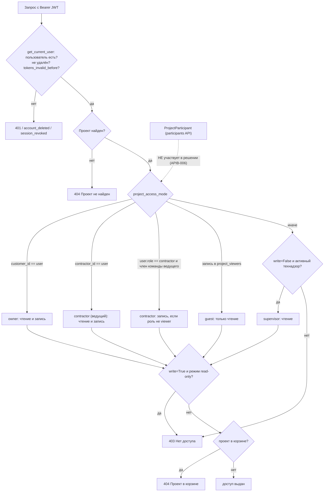

### 3.2 Топология фоновой обработки и outbox

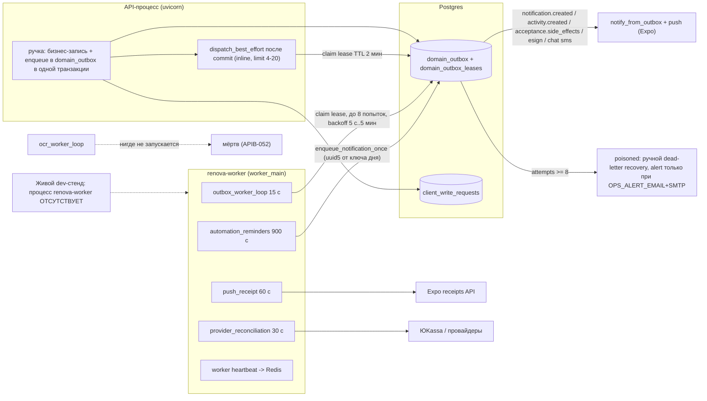

Что это значит для ожиданий пользователей: уведомления, инициированные действием (оплата, приёмка, замечание), доставляются inline «по возможности» и добираются воркером; **периодические** (просрочка этапа, «закупите материалы», вывоз мусора завтра, квитанции push) существуют только при работающем `renova-worker` — в живом dev его нет (APIB-027).

### 3.3 Жизненный цикл записи outbox

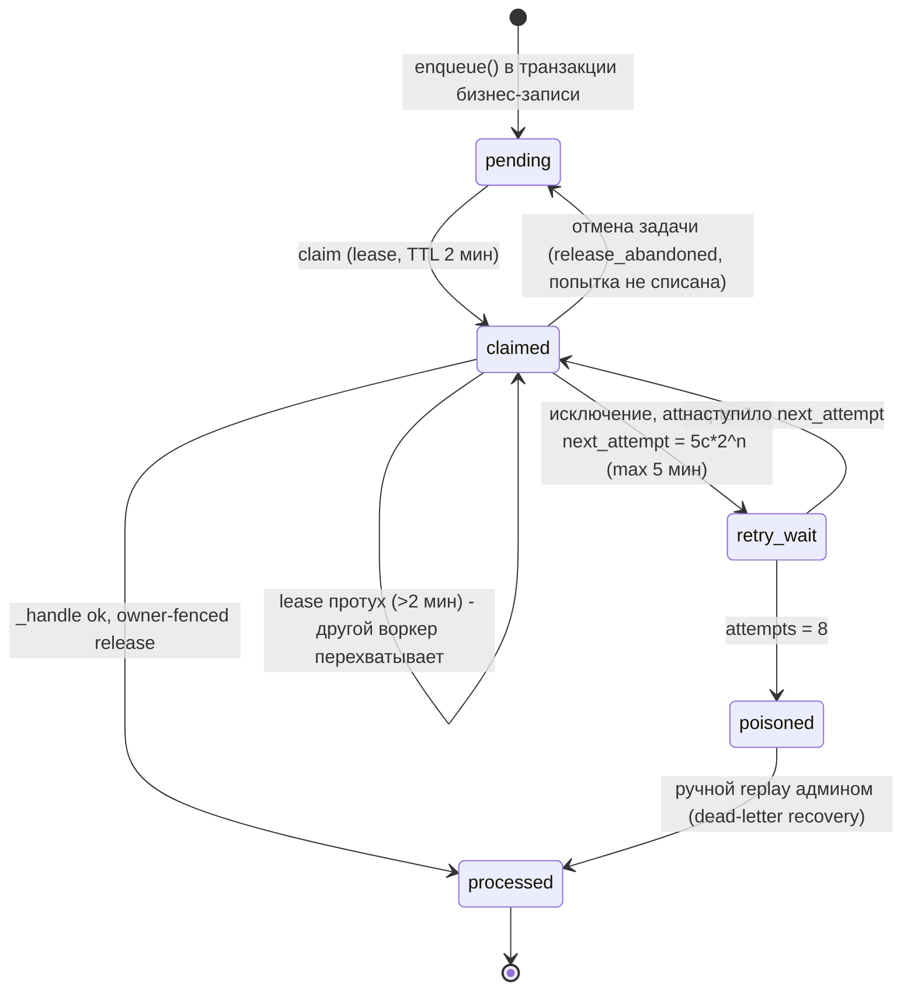

При переполнении/зависании: `poisoned` не удаляется и не эскалируется пользователю; статус виден только в `release-health` и e-mail ops (если настроен).

### 3.4 Платёж (`Payment.status`) — кто инициирует и кто ждёт

```mermaid
stateDiagram-v2
    [*] --> pending: create_payment (заказчик: advance/final; исполнитель: stage/material)
    pending --> paid_unverified: заказчик POST confirm с transfer_ack=true БЕЗ чека
    pending --> confirmed: заказчик POST confirm с прикреплённым чеком (Receipt.payment_id)
    pending --> processing: заказчик POST yookassa-checkout (создан платёж у провайдера)
    processing --> confirmed: webhook / повторный checkout: провайдер succeeded
    processing --> cancelled: провайдер canceled
    paid_unverified --> confirmed: ТОЛЬКО админ платформы: evidence review (клиента нет)
    confirmed --> disputed: заказчик оспаривает (reason >= 10 симв.)
    paid_unverified --> disputed: заказчик оспаривает
    disputed --> confirmed: заказчик отзывает спор (возврат к исходному статусу)
    disputed --> paid_unverified: то же
    confirmed --> refunded: провайдер refund.succeeded (только ЮKassa)
    note right of pending
        Блокирует переход: для payment_type=stage нужен stage.customer_accepted_at
        (иначе 409 «Сначала примите этап» и событие PaymentBlocked)
    end note
    note right of paid_unverified
        Исполнитель-получатель не может подтвердить получение,
        не видит доказательство (APIB-011). Отказа/таймаута нет:
        статус висит, пока админ не сделает review.
    end note
```

Что происходит при отказе/таймауте: **таймаутов нет ни у одного шага**. Спор открывает и закрывает один и тот же заказчик (`payment_disputes.py:78,110`); у исполнителя нет ручки «оспорить/ответить».

### 3.5 Заявка маркетплейса (`JobLead`) и порядок ожиданий

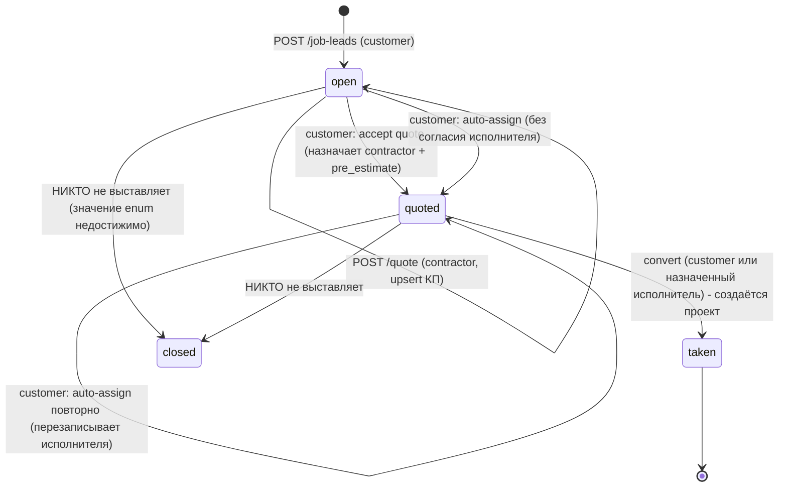

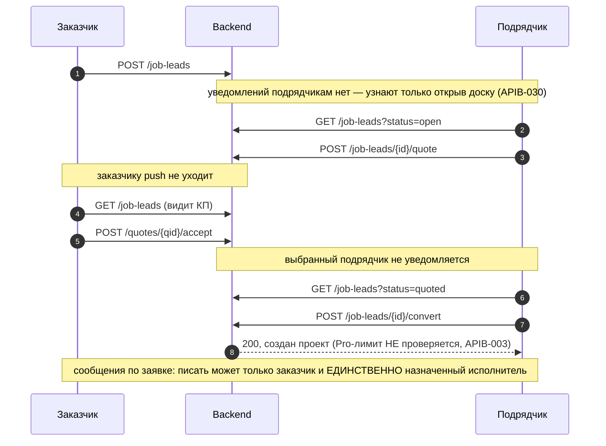

### 3.6 Портал по magic-link — фактическая последовательность и дыра

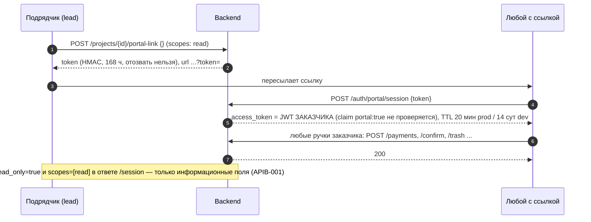

### 3.7 Замечание (`ProjectIssue.status`) и роли

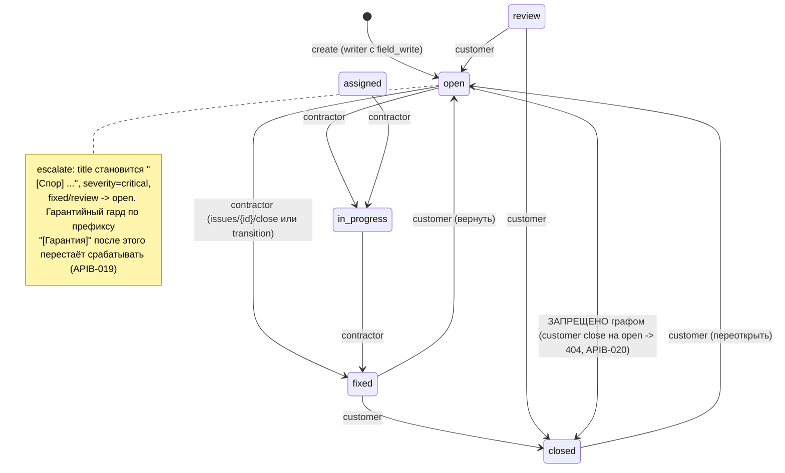

### 3.8 Вывоз мусора (`WasteOrder`)

```mermaid
stateDiagram-v2
    [*] --> draft: create (любой writer; в UI кнопка только у подрядчика)
    draft --> requested: request - только исполнитель (lead / owner|foreman команды)
    requested --> scheduled: approve - только заказчик
    requested --> cancelled: reject - только заказчик (в UI кнопки нет, APIB-050)
    scheduled --> done: complete - только исполнитель
    done --> [*]
    cancelled --> [*]
    draft --> draft: проект без подрядчика - переход невозможен никем (APIB-012)
```

### 3.9 Материал, подбор, закупка

```mermaid
stateDiagram-v2
    direction LR
    state "MaterialPick" as MP {
        [*] --> mp_draft
        mp_draft --> mp_pending: submit (writer)
        mp_pending --> mp_approved: approve (customer)
        mp_pending --> mp_draft: reject (customer; UI-вызова нет)
        mp_approved --> mp_purchased: закупка включает позицию
    }
    state "SelectionItem" as SI {
        [*] --> s_draft
        s_draft --> s_proposed: propose (writer)
        s_proposed --> s_approved: approve (customer) + создаёт MaterialPick qty=1 шт
        s_proposed --> s_rejected: reject (customer), автор НЕ уведомляется
        s_rejected --> s_proposed: propose повторно (правки нет)
    }
    state "Purchase" as PU {
        [*] --> p_draft
        p_draft --> p_approved
        p_approved --> p_ordered
        p_ordered --> p_paid: любой writer! - попадает в budget_spent (APIB-010)
        p_paid --> p_delivered
        p_delivered --> p_returned
        p_ordered --> p_cancelled
    }
```

### 3.10 Приёмка этапа и оплата (граница среза)

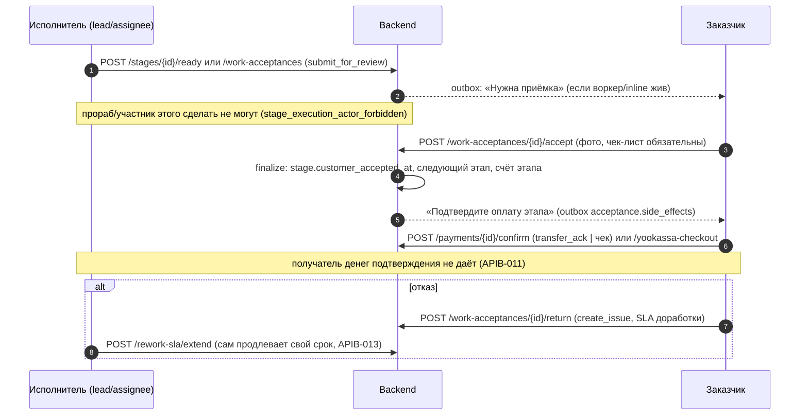

### 3.11 Что происходит при старте с неверным `ENVIRONMENT`

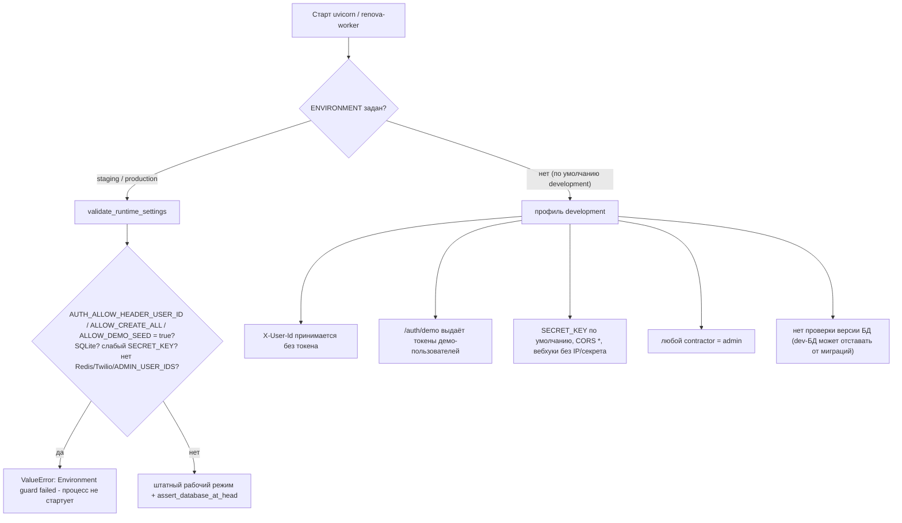

---

## 4. Кнопки, функции и опции по экранам (только те, что вызывают ручки среза)

Формат: **подпись кнопки** (экран:строка) → обработчик → вызов API → серверная проверка → результат/ошибки. Экранная логика в целом описана срезами 09–10; здесь — стык «кнопка ↔ ручка».

### 4.1 Платёж (`M/components/renova/PaymentDetailSheet.tsx`, `CreatePaymentForm.tsx`, `PaymentEvidenceSheet.tsx`)

| Кнопка (роль) | Обработчик | API | Серверная проверка | Результат / ошибки |
|---|---|---|---|---|
| **«Выставить счёт»** (`CreatePaymentForm.tsx:219`) | `createPayment` с `requestIdRef` (:88) | `POST /projects/{id}/payments` | `payments.py:147-151`: заказчик — только advance/final, исполнитель — stage/material; `stage_id` принадлежит проекту (:158-163); идемпотентно по `client_request_id` | 200; 403 «Заказчик создаёт аванс/финал» / «Исполнитель создаёт оплату этапа/материалов»; 404 «Этап проекта не найден»; 422 «Укажите amount или percent», «У этапа не задана сумма оплаты». Границ суммы/длины нет (APIB-023) |
| **«Оплатить картой (ЮKassa)»** (:570, заказчик) | `payWithCard` (:325) | `POST …/payments/{pid}/yookassa-checkout` | `payment_checkout_integrity.py:121-163`: `write` + роль customer, платёж проекта, статус pending/processing, этап принят, сверка снимка провайдера | 200 `confirmation_url`; 409 `payment_not_checkoutable`, «Сначала примите этап»; 502 `yookassa_unavailable`; 503 «ЮKassa не настроена»/«нужны ключи» |
| **«Перевести (СБП / реквизиты)»** (:571) → **«Скопировать реквизиты»**, **«Открыть СБП / банк»** | `setStep('transfer')`, загрузка реквизитов (:140) | `GET …/payment-requisites` | только чтение проекта (виден любому читателю, APIB-024) | 200 `payment_requisites`; при пустых реквизитах баннер «Реквизиты не заполнены» |
| **«Я перевёл — дальше»** → **«Я оплатил — подтвердить»** (:578,584) | `setTransferAck(true)`, `confirm` (:408) | `POST …/payments/{pid}/confirm {transfer_ack}` | `payments.py:284-327` + `payment_service.py:209-319`: только customer; этап принят; нужен чек или `transfer_ack`; переход `pending → paid_unverified\|confirmed` условным UPDATE | 200 статус `paid_unverified` (без чека) или `confirmed` (с чеком); 409 «Сначала отметьте перевод или прикрепите чек…», «Сначала примите этап…», «Платёж уже обработан» (повтор не даёт replay — APIB-056) |
| **«Прикрепить чек»** (:572,585) | `openReceipt` | `POST …/receipts/scan` или `/manual` с `payment_id` | `receipts.py:174-372`: writer; `_resolve_payment_id` — платёж проекта в статусе pending (409 «К счёту уже нельзя прикрепить чек») | 200 `verified/verification_status`; ручной чек не «ФНС» |
| **«Оспорить оплату» → «Подтвердить спор»** (:599,595) | `submitDispute` (:477) | `POST …/dispute {reason}` | `payment_disputes.py:77-95`: writer+customer; статус confirmed/paid_unverified; reason 10–1000 | 200 `disputed`; 403 `payment_dispute_customer_required`; 409 `payment_dispute_*`; 422 |
| **«Отозвать спор» → «Подтвердить отзыв спора»** (:611,607) | `submitResolution` (:530) | `POST …/dispute/resolve {note}` | то же, note 10–1000; возврат к исходному статусу | 200; 409 `payment_dispute_source_status_invalid` |
| Загрузка доказательства перевода (`PaymentEvidenceSheet.tsx:165-177`) | intent → PUT `upload_url` → submit | `POST …/evidence/upload-intent`, `PUT …/evidence/{id}/content`, `POST …/evidence/{id}/submit` | customer; `client_request_id ≥16`; MIME/размер; SHA-256 фиксируется при submit | после submit платёж ждёт **админ-ревью**; в приложении ни просмотра решения, ни кнопки ревью (APIB-011) |

### 4.2 Заявки маркетплейса и команда

| Кнопка (роль) | Экран:строка | API | Серверная проверка | Результат / ошибки |
|---|---|---|---|---|
| **«+ Заявка»** (заказчик) | `JobLeadsBoard.tsx:330` → `createJobLead` | `POST /job-leads` | `marketplace.py:266` only customer; `area_sqm>0`, `budget_hint>0`, `title≤255` | 200 `{id,status}`; идемпотентности нет — двойное нажатие = две заявки (APIB-031) |
| **«КП»** (исполнитель) | `:299` → `quoteJobLead` | `POST /job-leads/{id}/quote` | only contractor; заявка `open\|quoted`; занята другим → 409 `lead_already_assigned` | upsert КП; после конверсии (`status=taken`) повторное КП → 404 `lead_not_open`; после выбора КП (`quoted`) назначенный исполнитель может изменить свою цену, а `lead.pre_estimate` останется старым |
| **«Принять · N ₽»** (заказчик) | `:180` → `acceptJobLeadQuote` | `POST /job-leads/{id}/quotes/{qid}/accept` | only customer; заявка своя; уже назначена → 409; quote.lead_id == lead | назначает исполнителя, `status=quoted`; исполнитель не уведомляется |
| **«Авто-исполнитель»** (заказчик) | `:208` → `autoAssignLead` | `POST /job-leads/{id}/auto-assign` | only customer; `open\|quoted`; берёт `ranked[0]` видимых профилей | назначает без согласия исполнителя и без КП; 404 `no_contractors` (APIB-029) |
| **«→ Проект»** | `:235` → `convertJobLead` (+ `leadConversionRecovery`) | `POST /job-leads/{id}/convert` | `marketplace_conversion_service.py`: владелец или назначенный исполнитель; `quoted\|taken`; replay по `marketplace-lead:{id}` | 200 `{project_id}`; 409 `lead_not_ready_for_conversion`, `lead_has_no_contractor`; Pro-лимит не применяется (APIB-003) |
| **«Отправить»** в чате заявки | `LeadChat.tsx:19` → `postLeadMessage` | `POST /job-leads/{id}/messages` | заказчик-владелец или назначенный исполнитель, иначе 404 | 200; идемпотентности нет |
| **«Копировать» / «Поделиться» / «Обновить QR»** (подрядчик) | `team-qr.tsx:90-111` → `createTeamInviteLink` | `POST /teams/invite-link {role}` | only contractor; роль `member\|viewer\|foreman`; токен не привязан к человеку | `renova://team/join/{token}`, 72 ч; отозвать нельзя |
| **«Сканировать invite»** (новый исполнитель) | `team-qr.tsx:113-123` → `joinTeam` | `POST /teams/join {token}` | only contractor | член команды; после этого получает доступ ко всем объектам ведущего (APIB-005/044) |
| Смена роли участника | `admin.ts:74` `setMemberRole` | `PATCH /teams/member-role` | владелец команды; роль из `{member,viewer,foreman}` | 403 `team_role_change_forbidden`; **удалить участника нельзя** |

### 4.3 Работы, материалы, вывоз, закупки

| Кнопка (роль) | Экран:строка | API | Серверная проверка | Результат / ошибки |
|---|---|---|---|---|
| **«Рассчитать материалы»** (writer) | `RoomDetailScreen.tsx:260-273` → `calcRoomMaterials` | `POST /projects/{id}/rooms/{rid}/calc-materials` | `os.py:253-256` read-доступ + комната проекта | **500** для любой роли (`AttributeError: 'Room' has no attribute 'floor_sq_m'`) — APIB-004 |
| **«+ Материал»** (только исполнитель в UI) | `MaterialPickList.tsx:339` | `POST /projects/{id}/material-picks` | writer; идемпотентно по `client_request_id` | 200 `replayed`; в UI заказчик создать материал не может, хотя API позволяет |
| **«На согласование»** (исполнитель, draft) | `MaterialPickList.tsx:269`, `MaterialPickDetailSheet.tsx:225` | `POST …/material-picks/{id}/submit` | writer; переход draft→pending | 409 `material_pick_transition_*` |
| **«Согласовать»** (заказчик, pending) | `:243`, `:216` | `POST …/approve` | `materials.py:443` role customer | 403 для остальных; кнопки «Отклонить» **нет** (клиентская функция `rejectMaterialPick` не вызывается) |
| **«Сохранить источник»** / **«↻ цена»** | `MaterialPickList.tsx:205,216` | `PATCH …/supply`, `POST …/sync-price` | supply: заказчик или ведущий подрядчик; price: любой writer | 409/422 `material_*`; SSRF-защита URL поставщика (`material_price_sync.py:59-76`) |
| **«+ Контейнер 8 м³»** (только исполнитель) | `WasteOrderList.tsx:96` | `POST /waste-orders {volume 8, price 4500}` | writer | цена/объём зашиты в клиенте (EST-016) |
| **«Заказать»** (исполнитель, draft) | `:55` | `POST …/waste-orders/{id}/request` | только исполнитель (lead или owner/foreman команды) | 403 `waste_order_actor_forbidden` |
| **«Согласовать»** (заказчик, requested) | `:62` | `POST …/approve` | только заказчик | статус `scheduled`; «Отклонить» в UI нет (ручка `reject` — ОРФАН) |
| **«Вывезено»** (исполнитель, scheduled) | `:88` | `POST …/complete` | только исполнитель | `done` |
| Кнопки закупки: следующий шаг / отмена | `PurchaseList.tsx:55,65` | `POST …/purchases/{id}/status` | **только writer** — роль не проверяется | любой участник команды/заказчик двигает статус, `paid\|delivered` пересчитывают `budget_spent` (APIB-010) |

### 4.4 Уведомления, портал, проект

| Кнопка | Экран | API | Проверка | Результат |
|---|---|---|---|---|
| **«Все прочит.»** | `NotificationCenter.tsx:51,57` | `POST /notifications/mark-all-read` | по `user.id` | помечает **не более 50** непрочитанных (APIB-026) |
| «Отложить» / «Отложить до …» | `NotificationCenter.tsx:42`, `SnoozeUntilPicker.tsx:17` | `POST /notifications/{id}/snooze`, `/snooze-until` | по `user.id` | `snooze-until` с `+03:00` → 500 на Postgres (APIB-033) |
| «Поделиться ссылкой» портала | `PortalSharePanel` (срез 09) | `POST /projects/{id}/portal-link` / `/viewers/{uid}/portal-link` | заказчик или ведущий подрядчик (за заказчика!) | токен 168 ч; выдаёт JWT заказчика (APIB-001) |
| «Продлить срок доработки» | `ReworkSlaWidget.tsx` → `extendReworkSla` | `POST /rework-sla/extend?stage_id&days` | writer, без роли/лимита | +1…7 дней, неограниченно (APIB-013) |


---

## 5. Реестр дефектов

**Сводка:** всего **60** — P0: **2**, P1: **12**, P2: **34**, P3: **12**. Верифицировано пробой/кодом («да…») — все, кроме APIB-037 (гипотеза), APIB-014, 032, 038 (частично).

**Топ-5 по критичности:** APIB-001 (magic-link = полный JWT заказчика, в т. ч. выдаваемый подрядчиком), APIB-002 (забытая `ENVIRONMENT` = обход аутентификации), APIB-008/009/010 (подрядчик и участник команды правят план оплат, бюджет заказчика и проводят закупки в факт без участия заказчика), APIB-003 (конверсия заявки мимо Pro-лимита), APIB-004 (кнопка «Рассчитать материалы» всегда 500).

Типы: не работает / тупик / рассинхрон UI↔backend / нет ACL / неверный статус / нечестные данные / мёртвый код / затык UX (+ уточнения: приватность, идемпотентность, конфигурация, дрейф схемы). «Кого затрагивает» — роль по разделу 2.

| ID | Сер. | Тип | Доказательство (file:line + как воспроизвести) | Кого затрагивает | Предложение исправления | Верифицировано |
|---|---|---|---|---|---|---|
| **APIB-001** | P0 | нет ACL | `B/api/v1/portal.py:57-64` `/auth/portal/session` выпускает полноценный access JWT пользователя (`create_access_token(user.id, {portal: True, project_id})`); claim `portal` нигде не читается (`B/api/deps.py:56-119`, `B/core/security.py:59-75`). `portal.py:136-153`: подрядчик выдаёт magic-link **за `customer_id`**. ПРОБА (in-process): подрядчик `POST /projects/{id}/portal-link {}` (scopes=[read]) -> `POST /auth/portal/session` -> `GET /auth/me` = заказчик -> `POST /payments` (advance) 200 -> `POST …/confirm` 200 (`paid_unverified`) -> `POST …/trash` 200. TTL такого JWT: 20160 мин в dev, <=20 мин в staging/prod (`security.py:17-25`); саму ссылку можно обменивать повторно 168 ч. | заказчик (жертва), подрядчик (нарушитель), любой держатель ссылки | Отдельный `typ=portal` с узкими scope; `get_current_user` отвергает не-`access` токены на обычных ручках; не давать подрядчику выпускать ссылку от имени заказчика (ссылка = свой `user_id` либо отдельный portal-principal); ссылка с nonce и отзывом. (Пересекается с DOC-001.) | да (проба) |
| **APIB-002** | P0 | нет ACL / конфигурация | `B/core/config.py:14` `environment` по умолчанию `development`; `B/core/environment.py:44-55` профиль dev разрешает `X-User-Id` без токена (`B/api/deps.py:70-79`), demo-логин, `create_all`, слабый `SECRET_KEY`; `B/main.py:159-171` CORS `*`; `B/services/yookassa_service.py:108-110` вебхуки без IP-проверки не в production; `B/api/admin_access.py:34-38` любой подрядчик = админ. Нет fail-closed по косвенным признакам (Postgres URL, https `PUBLIC_BASE_URL`, `.env.production`). Забытая `ENVIRONMENT` в prod = `curl -H 'X-User-Id: <uuid>'` от имени любого пользователя. Production-профиль защищён проверками (`environment.py:190-260`) — но только если переменная задана. | все роли (полный обход аутентификации) | Сделать `ENVIRONMENT` обязательной (нет значения — ошибка старта) либо по умолчанию `production`; при `development` + нелокальный `PUBLIC_BASE_URL`/не-SQLite БД — отказ; в `docker/renova-api` явно задавать профиль. | да (код; профиль dev проверен тестами `test_environment_guards.py`) |
| **APIB-003** | P1 | нет ACL / неверный статус | `B/services/marketplace_conversion_service.py:36-128` не проверяет лимит бесплатных объектов, тогда как `B/services/project_assignment_service.py:98-104` возвращает `subscription_required`. ПРОБА: подрядчик без Pro с 1 объектом: `POST /projects/{id}/assign` -> 402; `POST /job-leads/{id}/convert` -> 200, создан 2-й объект с его `contractor_id`. Аналогично `auto-assign` (`marketplace.py:515-551`) не считает лимит. | исполнитель (обход paywall), платформа (выручка) | Вынести проверку `contractor_free_project_limit`/`is_pro` в общий сервис и вызывать из `convert`, `accept_quote`. | да (проба) |
| **APIB-004** | P1 | не работает | `B/api/v1/os.py:257` берёт `room.floor_sq_m/wall_sq_m/perimeter_m`, у `Room` таких атрибутов нет (`B/models/entities.py:117-136`; метрики считает `room_service.room_detail`, `room_service.py:436-461`). ПРОБА: заказчик и гость -> `POST /projects/{id}/rooms/{rid}/calc-materials` -> 500 `AttributeError`. Кнопка «Рассчитать материалы» (`M/components/screens/RoomDetailScreen.tsx:260-273`). Теста нет. (Совпадает с EST-009.) | заказчик, исполнитель | Считать метрики через `calc_room_metrics(...)`; добавить HTTP-тест; заодно не писать activity-событие из ручки с `write=False`. | да (проба) |
| **APIB-005** | P1 | тупик | `B/api/v1/teams.py` — 7 ручек, ни одной «удалить участника / выйти / отозвать приглашение»; `B/services/team_service.py:25` роли только `member\|viewer\|foreman`. ПРОБА: `DELETE /teams/me` -> 405, `DELETE /teams/members/{id}` -> 404, `POST /teams/leave` -> 404, `PATCH /teams/member-role` с `role=removed` -> 403. Бывший сотрудник остаётся в команде навсегда и сохраняет доступ ко всем объектам ведущего (см. APIB-044); максимум — понизить до `viewer` (он всё равно читает платёжные реквизиты и бюджет). | исполнитель-владелец команды, заказчики его объектов | `DELETE /teams/members/{user_id}`, `POST /teams/leave`, отзыв инвайта (`TeamInvite`), при удалении — отзыв сессий/ws. | да (проба) |
| **APIB-006** | P1 | не работает / мёртвая функция | `B/api/v1/project_participants.py:118-133` добавляет подрядчика-«участника» со scope-ами, но `B/services/team_service.py:472-488` (`project_access_mode`) и `can_access_project` не читают `ProjectParticipant`. ПРОБА: заказчик добавил участника (200) -> тот `GET /projects/{id}` -> 403, `GET …/rooms` -> 403. Клиента в `M/` нет (ОРФАН, 4 ручки). (Совпадает с ROLE-008, MKT-011.) | заказчик, второй подрядчик | Либо подключить участников к `project_access_mode`/scope-проверкам, либо убрать API до готовности. | да (проба) |
| **APIB-007** | P1 | тупик | Прораб/участник бригады не видят этапов и не могут их запускать: `B/api/v1/projects.py:22-31` (`_filter_stages_for_user` оставляет этапы с `assignee_id == user` или ведущего) используется в `GET /projects/{id}`, `GET /plan` (`stages_ext.py:282-316`), dashboard; `B/services/stage_mutation_service.py:90-94` и `stage_review_service.py:103-107` — старт/«готов» только у `contractor_id`/`assignee`; `Stage.assignee_id` ни одна ручка не выставляет. ПРОБА: прораб `GET /projects/{id}` -> `stages: 0` (владелец видит 8), `GET /plan` -> 0, `POST …/start` -> 403 `stage_execution_actor_forbidden`; при этом `PATCH …/dates` и `POST /issues` -> 200. (Совпадает с STG-005.) | прораб, участник команды | Ручка назначения исполнителя этапа; видимость этапов членам команды по умолчанию; `_executor_ids` включать owner/foreman. | да (проба) |
| **APIB-008** | P1 | нет ACL | `B/api/v1/stage_mutations.py:219-258` `PATCH /projects/{id}/stages/payment-plan` требует только `write=True`. ПРОБА: подрядчик выставил сумму 9 999 999 на один этап (`distributed` вырос с 154 537,73 до 10 146 809,84); участник команды (`member`) — тоже. Сумма этапа далее база для `percent`-счетов (`payments.py:167-177`) и `payment_expected_on_accept`. Нет блокировки после подписи договора/старта/подтверждённых платежей, нет сверки с бюджетом. (Совпадает с STG-001.) | заказчик (деньги) | Только владелец; либо предложение исполнителя с подтверждением заказчика; запрет после старта этапа/наличия платежей. | да (проба) |
| **APIB-009** | P1 | нет ACL / утечка | `B/api/v1/projects.py:288-293` `PATCH /projects/{id}` — любой writer; `B/services/project_profile_service.py:11-38` разрешает `customer_budget`, `vat_rate`, `name`, даты. `projects.py:51` отдаёт `customer_budget` всем ролям. ПРОБА: заказчик задал 500 000; подрядчик `GET` -> `customer_budget: 500000.0`; подрядчик `PATCH {customer_budget:1, vat_rate:20, name:'HACK by contractor'}` -> 200; `member` — `name` 200. (Совпадает с ROLE-001/004.) | заказчик | `customer_budget` — только владельцу (не сериализовать остальным); PATCH профиля — владельцу, либо поле-ACL. | да (проба) |
| **APIB-010** | P1 | нет ACL / нечестные данные | `B/api/v1/purchases.py:254-324` и `B/services/purchase_service.py:266-331`: `actor_id` используется только для уведомлений, роль не проверяется; `paid\|delivered` пересчитывают `budget_spent` (`purchase_service.py:306-314`). Цену позиции подрядчик тоже подтверждает сам (`material_price_sync.py:98-120`, без роли). ПРОБА: подрядчик создал материал (цена 1000×10), сам подтвердил цену и отправил на согласование; заказчик утвердил выбор; подрядчик создал закупку и провёл `ordered -> paid -> delivered`: `budget_spent` 0 -> 10 000 без чека/платежа/участия заказчика. (Совпадает с EST-012.) | заказчик (бюджет) | Разделить права: `paid` — подтверждается заказчиком/чеком; цена после согласования не редактируется исполнителем без переутверждения; роль в `transition_status`. | да (проба) |
| **APIB-011** | P1 | тупик | Ручной перевод: `paid_unverified -> confirmed` только через `review_evidence` (`B/api/v1/payment_evidence.py:253-275`, `require_admin_user`); чтение доказательства — заказчик или админ (`:78-87`). В `M/` нет вызова `…/evidence/{id}/review` и `GET …/evidence/{id}/content` (ОРФАН); список `GET …/evidence` клиент вызывает (`payments.ts:180`), но показать/просмотреть решение админа негде. Получатель денег (исполнитель) не может ни подтвердить, ни увидеть доказательство, ни ответить на спор (`payment_disputes.py:78,110` — только заказчик); таймаутов нет. В dev маскируется: любой подрядчик = админ (`admin_access.py:34-38`). (Совпадает с MNY-009.) | исполнитель (не может получить подтверждение), заказчик, админ платформы | Дать исполнителю подтверждение получения/оспаривание; UI ревью или автоматический срок; таймаут-эскалация. | да (код + сопоставление с клиентом; сквозной прогон не делался) |
| **APIB-012** | P1 | тупик | `B/services/waste_order_service.py:37-55`: `requested/done` — только исполнитель (`contractor_id` или owner\|foreman), `scheduled/cancelled` — только заказчик. В проекте без подрядчика (self-managed) никто не может перевести `draft -> requested`. ПРОБА: заказчик без подрядчика: create -> `draft`; `request` -> 403 `waste_order_actor_forbidden`; `approve`/`complete` -> 409. В UI кнопки создания есть только у подрядчика (`M/components/renova/WasteOrderList.tsx:55`). (Совпадает с EST-015.) | заказчик без подрядчика | Для self-managed проектов заказчик выступает исполнителем (как в `is_self_managed_customer`). | да (проба) |
| **APIB-013** | P1 | нет ACL | `B/api/v1/rework_sla.py:64-75` `POST /rework-sla/extend`: любой writer (в первую очередь подрядчик, чей срок), без лимита числа продлений, без проверки `needs_rework`, без уведомления заказчика. ПРОБА: три вызова подряд `days=7` -> дедлайн +7, +14, +21 сут. (Совпадает с REP-31.) | заказчик (гарантия сроков доработки) | Продление — только заказчиком или по его согласию; лимит; событие в ленту/уведомление. | да (проба) |
| **APIB-014** | P1 | рассинхрон окружения | Живая dev-БД `renova@127.0.0.1:5433`: `alembic_version = w25calendarimport01`, голова кода `x01materialneeds01` (файл миграции создан сегодня); таблицы `material_needs_generation_results` нет (проверено SQL по `information_schema`). Проверка версии БД включена только для staging/production (`B/db/session.py:40-52`), а `ALLOW_CREATE_ALL=false` — схема не создаётся и не проверяется. Следствие по коду (`B/services/purchase_service.py:457-471`): `POST /projects/{id}/material-needs/from-estimate` на живом стенде даст 500 (POST на живую БД не отправлялся). | все на dev-стенде; разработчики | Проверка ревизии (хотя бы warning) и в development; `alembic upgrade head` в `dev-runtime` перед стартом API. | частично (состояние БД — да; отказ ручки — по коду) |
| **APIB-015** | P2 | нет ACL | `B/api/v1/media.py:38-49` `_user_from_auth` берёт только `resolve_user_id` и `select(User)`: не проверяет `deleted_at` и `tokens_invalid_before` (в отличие от `deps.py:107-119`). То же для WS: `B/core/request_auth.py:20-33`, `B/api/v1/ws.py:24-41`. ПРОБА: токен после `tokens_invalid_before` -> `/auth/me` 401 `session_revoked`, `/media/project-media/{pid}/…` -> 404 (аутентификацию прошёл, отработал ACL); удалённый аккаунт: `/auth/me` 401 `account_deleted`, `/media/…` -> 404. | владельцы аккаунтов (отозванные/удалённые сессии продолжают читать файлы и слушать чат) | Использовать общий `get_current_user` (или общую функцию проверки эпохи токена) в media и WS. | да (проба) |
| **APIB-016** | P2 | нет ACL / кэш | `B/api/v1/media.py:140-144`: для `project-media/*` и legacy-ключей ответ отдаётся с `Cache-Control: public, max-age=86400, s-maxage=604800` без `Vary: Authorization`, хотя доступ по проекту. Общий кэш/CDN может отдать файл без авторизации. Сценарий с CDN не воспроизводился. | все проекты, где включён CDN/прокси-кэш | `private, no-store` для всех проектных ключей (как для `documents/*`). | да (код) |
| **APIB-017** | P2 | нет ACL (IDOR) | `B/api/v1/project_checklists.py:29-40` `tpl_versions/tpl_diff` фильтруют `ChecklistTemplateVersion.template_id == tpl_id`, не сверяя шаблон с `project_id` (у `checklist_template_versions.template_id` нет FK). ПРОБА: заказчик-2 из **своего** проекта читает `name`+`items` шаблона проекта заказчика-1 (200). Ручки обновления шаблона нет — версии/diff всегда содержат единственную версию 1 (мёртвая функция). (Глобальные шаблоны — APIA-003.) | заказчики/подрядчики (чужие шаблоны) | Сверять `template.project_id == project_id`; FK; либо убрать versions/diff. | да (проба) |
| **APIB-018** | P2 | нет ACL / целостность | Ключи файлов и URL принимаются без привязки к проекту: `B/api/v1/os.py:31-41,117` (`photo_key`), `B/services/stage_service.py:118-133` (`storage_key`+`image_url`), `B/api/v1/marketplace.py:401-418` (`image_key` как query). `B/services/document_media_acl.py:99-133`: ключ legacy-типа резолвится по **первой** найденной ссылке (`limit(1)` без ORDER BY, порядок Stage→FloorPlan→Design→Issue), поэтому «присвоив» чужой ключ своему проекту можно перехватить права на файл (нужно знать 128-битный ключ). ПРОБА: issue с `photo_key=documents/<чужой uuid>/secret.pdf` -> 200 и `photo_url`; фото этапа с `storage_key=project-media/<чужой>/f.jpg` + `image_url=https://evil.example/x.png` -> 200, внешний URL отдаётся в карточке этапа. | все проекты (перехват/подмена файлов), пользователи (внешние URL в интерфейсе) | Валидировать префикс ключа `project-media/{project_id}/` при записи; запретить внешние `image_url`; детерминированный резолв legacy-ключей. | да (принимаются); эксплуатация чтения — гипотеза |
| **APIB-019** | P2 | неверный статус / обход | `B/api/v1/os.py:212-213` `escalate` дописывает префикс «[Спор] » к заголовку; гард гарантийных обращений проверяет `title.startswith('[Гарантия]')` (`issue_transitions.py:30`, `os.py:146,151`) и после эскалации перестаёт срабатывать. ПРОБА: `POST …/issues/{warranty}/transition fixed` подрядчиком -> 409 `warranty_transition_separate`; после `escalate` тот же вызов -> 200. Признак типа хранится строковым префиксом заголовка, который пользователь может подделать или сломать. | заказчик (гарантийный контур) | Отдельное поле `kind`/`is_warranty`; запрет `escalate` для гарантийных. | да (проба) |
| **APIB-020** | P2 | затык UX | `B/api/v1/os.py:150-155` + `B/services/issue_service.py:323-336`: `update_issue_status` возвращает `None` при недопустимом переходе, ручка отвечает голым 404 без кода. ПРОБА: заказчик `POST …/issues/{id}/close` на замечании `open` -> 404 `{detail:'Not Found'}`; повторный `close` подрядчиком (`fixed -> fixed`) — тоже 404. Каноническая `/transition` даёт понятные 403/409. | заказчик, подрядчик | Вернуть 409 с кодом `invalid_issue_transition`; перевести клиент на `/transition`. | да (проба) |
| **APIB-021** | P2 | нет ACL (запись через чтение) | (а) `B/api/v1/stage_reactions.py:41` `react` под `require_project_dep()` без `write` — гость/наблюдатель ставит реакцию и шлёт уведомление автору комментария; `reaction: str` без ограничения (колонка `String(8)`, `entities.py:543` -> на Postgres длинная реакция даст 500, не проверено). ПРОБА: гость `react` с 300 эмодзи -> 200. (б) `B/api/v1/notifications.py:91-98` `POST /waste-reminders/check` — любой аутентифицированный (гость) запускает глобальный скан (COM-022). (в) `GET`-ручки с записью в БД: `os.py:332-343` (`os_budget_lines`: sync+refresh+commit), `os.py:346-353` (`os_expenses`), `os.py:69-76` (`stage_workflow` -> `ensure_stage_checklist`). | гость, наблюдатель, технадзор | `write=True` для реакций; убрать запись из GET; админ-тик — только админу. | да (проба: а, б; код: в) |
| **APIB-022** | P2 | нет ACL | `B/services/receipt_integrity_service.py:184-207` и `B/api/v1/receipts.py:415-455`: удаление/правка чека и расхода доступны любому writer; у `Receipt` нет автора (`B/models/entities.py:257-275`), единственный замок — подтверждённый платёж. ПРОБА: заказчик создал ручной расход 1000; подрядчик `DELETE …/receipts/{id}` -> 200, `ledger_removed: 1000`. | заказчик (учёт), подрядчик | Хранить `created_by`; правка/удаление — автором или владельцем; журнал удалений. | да (проба) |
| **APIB-023** | P2 | нет валидации / деньги | `B/schemas/project.py:128-136` `PaymentCreate`: `title` без длины, `amount` без верхней границы; `B/api/v1/payments.py:140-268` не сверяет счёт с `stage.payment_amount`/бюджетом/уже выставленным. ПРОБА (SQLite): подрядчик выставил счёт на этап в 50× суммы этапа (200) и на `1e300` (200). ПРОБА (Postgres 17): `title` из 400 символов -> 500 `StringDataRightTruncationError` (`payments.title VARCHAR(255)`). | заказчик, подрядчик | `max_length`, `le`, сверка с остатком по этапу; серверный отказ 422. | да (проба) |
| **APIB-024** | P2 | приватность | `B/api/v1/payments.py:104-137` `GET /payment-requisites` под `write=False`: реквизиты (`payment_requisites`) и телефон исполнителя отдаются любому читателю проекта. ПРОБА: гость (`/auth/demo/guest`) получил `СБП: +7…, Банк: …`; team-`viewer` — 200. | исполнитель (реквизиты), заказчик | Отдавать реквизиты только владельцу (плательщику) и самому исполнителю. | да (проба) |
| **APIB-025** | P2 | нечестные данные | `B/api/v1/payments.py:76-77` `stage_payment_progress` считает `pending` только для `status == 'pending'` и `confirmed` только для `confirmed` — `paid_unverified`/`processing` выпадают. ПРОБА: платёж 1000 в `paid_unverified` -> `pending: 0, confirmed: 0, remaining: 7726.89` (остаток завышен на 1000). | заказчик, исполнитель | Считать по всем «живым» статусам (pending, processing, paid_unverified) с раздельными полями. | да (проба) |
| **APIB-026** | P2 | нечестные данные | `B/services/notification_service.py:167-173` `list_for_user(...).limit(50)`; `unread-count` (`notifications.py:13-16`) и `mark-all-read` (`:24-30`) работают по этой выборке. ПРОБА: 120 непрочитанных -> `unread-count: 50`; `mark-all-read` -> `count: 50`; после него счётчик снова 50. Отложенные (`snoozed_until` в будущем) скрыты и из счётчика, и из «прочитать все». | все роли (значок непрочитанных, «Все прочит.») | `SELECT count(*)` и `UPDATE … WHERE read=false`; счётчик «50+». | да (проба) |
| **APIB-027** | P2 | рассинхрон окружения | Живой dev: `ps` — только `uvicorn app.main:app` (8100 и соседние), процесса `python -m app.worker_main` нет; `docker-compose.yml:144-152` запускает воркер отдельным сервисом. Без него не работают `automation_reminders` (просрочка/«закупите»/вывоз), `push_receipt`, `provider_reconciliation` (ЮKassa), ретраи outbox. `GET /health` всегда пишет `background_runtime: renova-worker` (`B/main.py:215-224`) и не проверяет heartbeat; `/ready` тоже (`main.py:227-250`). | все (нет напоминаний/сверки/ретраев на стенде) | `/ready` с проверкой heartbeat воркера; `npm run dev` стартует воркер; предупреждение при старте API без воркера. | да (ps, /health) |
| **APIB-028** | P2 | неверный статус | `B/services/automation_reminders_worker.py:319-323` `select(Project)` без фильтра `trashed_at/is_archived/status`, затем `db.refresh(project, ['stages'])` на каждый проект (N+1, все проекты каждые 15 мин); `B/services/automation_engine.py:279-310` шлёт «Просрочка работы» подрядчику каждый день для любого не завершённого этапа с `planned_end < today`. ПРОБА: проект в корзине+архиве, у этапов `planned_end` в прошлом -> `run_automation_reminder_tick()` -> `reminders_enqueued: 8`. | подрядчик (спам по закрытым объектам), нагрузка на БД | Фильтр активных проектов и этапов в `planned/active/review`; курсорная выборка. | да (проба) |
| **APIB-029** | P2 | нет ACL / неверный статус | `B/api/v1/marketplace.py:515-551` `auto-assign`: назначает `ranked[0]` без КП и без согласия исполнителя, перезаписывает уже выбранного (`accept_quote`) и не сбрасывает `pre_estimate`; ни исполнитель, ни прежний выбранный не уведомляются. ПРОБА: без КП и профилей заявка получила исполнителя (единственный видимый профиль) и статус `quoted`. | заказчик, исполнитель (назначение без согласия) | Назначение — только по принятому КП; подтверждение исполнителем; уведомления. | да (проба) |
| **APIB-030** | P2 | тупик ожидания | `B/api/v1/marketplace.py` и `marketplace_conversion_service.py` не содержат ни `notify`, ни `outbox`, ни `push` (кроме inline-dispatch конверсии): новая заявка не доходит до подрядчиков, КП — до заказчика, выбор — до исполнителя, сообщения по заявке — никому. Значение `JobLeadStatus.closed` (`entities.py:805-809`) не присваивается нигде: заявку нельзя закрыть/отозвать, исполнитель не может отказаться. `_can_access_lead` (`marketplace.py:124`) не используется. `GET /job-leads` ограничен 50 без пагинации (:248). | заказчик, исполнитель | Уведомления на каждый шаг; действия «закрыть заявку», «отказаться»; пагинация. | да (grep + код) |
| **APIB-031** | P2 | идемпотентность | Создающие POST без ключа: `POST /projects` и `/from-template` — сервер поддерживает `client_request_id`, но мобильный клиент его не шлёт (`M/lib/api/projects.ts:3-30`, ROLE-022); `POST /job-leads` (`marketplace.py:260-272`), `POST /scratchpad` (`scratchpad.py:31-44`), `POST /technical-supervision/issues`, `POST /kpi-snapshot`, `POST /checklist-templates`, `POST /stages/{id}/photos`, `POST /job-leads/{id}/messages`. ПРОБА: два одинаковых `POST /projects` -> 2 разных объекта; две заявки; две строки scratchpad. | заказчик (дубли объектов/заявок при ретрае и оффлайн-очереди) | Сделать `client_request_id` обязательным для создающих ручек либо ключ по (user, payload-hash, окно). | да (проба) |
| **APIB-032** | P2 | рассинхрон / гонка | `B/api/v1/selections.py:239-300`: `approve` проверяет статус без блокировки строки, затем создаёт `MaterialPick` (`B/services/selection_service.py:15-38`, `qty=1, unit='шт'`, связи selection→pick нет) — двойное нажатие/два устройства = два материала; `approve/reject` не уведомляют автора предложения (только `propose` уведомляет заказчика); отклонённый подбор нельзя править (нет PATCH), только заново «propose». | заказчик, исполнитель | `SELECT … FOR UPDATE`, `selection_id` в `MaterialPick`, уведомление автору, PATCH для draft/rejected. | частично (код; гонку не воспроизводил) |
| **APIB-034** | P2 | нет валидации | Поля без `max_length` при ограниченных колонках: `IssueIn.title` (`os.py:31-41`, `project_issues.title VARCHAR(255)`), `TIn.name/items` (`project_checklists.py:12-14`), `PaymentCreate.title`. ПРОБА (Postgres): `POST /issues` c `title` из 300 символов -> 500 (`StringDataRightTruncationError`). | все роли | Pydantic `max_length` в соответствии с колонками; тест на паритет схем. | да (проба) |
| **APIB-035** | P2 | нет ACL / DoS | `B/api/v1/ws.py:75-82`: любые полученные тексты ретранслируются всем подписчикам треда без проверки формата/размера/прав; доступ к треду получает и гость (`_can_access_thread`:44-60 — `mode != 'none'`). ПРОБА: гость отправил произвольный JSON -> заказчик получил его дословно. Клиент на любое событие делает `reload()` (`M/components/renova/chat/ChatThreadView.tsx:377-385`), поэтому поддельные тексты не рисуются, но гость может гонять перезагрузки и «typing». Rate-limit middleware на WebSocket не действует; токен принимается в query (`ws.py:33-41`), ticket реюзабельный 120 с; права проверяются только при подключении. | участники чатов (нагрузка/подмена typing) | Клиентские кадры не рассылать (только серверные события) либо схема+лимит+только участники с правом записи; повторная проверка прав; отказ от `?token=`. | да (проба) |
| **APIB-036** | P2 | нет ACL | `B/services/portal_token_service.py:16-59`: подписанный HMAC-токен без `jti`, без списка отзыва и без учёта `tokens_invalid_before`; 168 ч; нет ручки отзыва (в эффективной таблице маршрутов нет ни одного `*revoke*`/`DELETE` для портала; единственный `revoke-all` — `/auth/sessions/revoke-all` — на portal-токены не влияет). URL `…/portal?token=` содержит токен (`portal_url`:57-59), а `payment_checkout_integrity.py:76-81` кладёт **токен в return_url**, который уходит провайдеру платежей. ПРОБА: `expires_hours=168`, `url` с `token=`. (Совпадает с DOC-022.) | заказчик/гость (утечка ссылки = 7 суток доступа) | Одноразовый обмен код→сессия, `jti` + таблица отзыва, короткий TTL, `return_url` без токена. | да (проба/код) |
| **APIB-037** | P2 | рассинхрон конфигурации (гипотеза) | `B/api/v1/subscription_integrity.py:334-352` и `B/services/yookassa_service.py:108-125`: в production вебхук требует `X-Webhook-Secret` (ЮKassa произвольные заголовки не шлёт) и IP из allowlist по `request.client.host`; `backend/docker/renova-api` запускает `uvicorn` без `--proxy-headers/--forwarded-allow-ips`, за балансировщиком `client.host` — адрес LB. Итог: реальные уведомления ЮKassa могут получать 401/403 -> платежи остаются в `processing`, восстанавливаются только повторным checkout. Не проверено — зависит от топологии. | заказчик/исполнитель (оплата картой, подписка) | Документировать обязательную вставку заголовка прокси; проверять подпись/IP через `X-Forwarded-For` доверенного прокси; smoke-проверка вебхука в staging. | нет (гипотеза) |
| **APIB-038** | P2 | рассинхрон конфигурации | `B/middleware/rate_limit.py:38-40`: в dev/test лимит `max(rate_limit_rpm, 400)`, в prod 120 — 429 не воспроизводятся до релиза. Ключ квоты — `user:{uid}` из JWT (`B/core/request_auth.py:34-44`): все устройства/вкладки одного пользователя делят 120 запросов/мин; анонимные запросы (вход по SMS, `/auth/refresh` с просроченным access, вебхуки) считаются по IP, а за балансировщиком все делят одно ведро (гипотеза). Оценка трафика приложения по коду (не измерение): холодный старт ≈ 8–10 запросов; экран «Бюджет» `useOsBudgetScreen.ts:26` = 7 параллельных + `hub` + закупки ≈ 9; `ProjectAnalyticsPanel.tsx:60` = 7; после мутаций `useProjectDataReload` перечитывает данные; фоновые опросы: inbox 25/60 с, чат 15 с. Одно устройство укладывается (≈ 20–60 rpm при активной работе), два устройства/вкладки или пачка e2e — нет; клиент реагирует паузой 3–60 с (`M/lib/api/client.ts:111-160`) и баннером «данные устарели». | все роли (в prod), команда разработки (dev не воспроизводит) | Одинаковый лимит в dev и prod (хотя бы staging); отдельные квоты для чтения/записи/логина; ключ анонимов из доверенного `X-Forwarded-For`. | частично (расчёт по коду, замера на живом трафике нет) |
| **APIB-039** | P2 | дрейф схемы | `compare_metadata` (Postgres после `alembic upgrade head`, 47 расхождений): FK `receipts.stage_id`, `receipts.room_id`, `material_picks.analog_of_id` есть в моделях (и на SQLite через `create_all`), но **отсутствуют** в миграционной схеме; ≈ 30 колонок `NOT NULL` в моделях, `NULL`-able в БД (`material_picks.status/qty/price`, `purchases.total_amount`, `domain_outbox.attempts`, `created_at` в 12 таблицах); нет 4 индексов, 2 лишних. Разработка на SQLite (`create_all`) и прод на Alembic видят разные схемы; миграции на SQLite не проходят (`i9j0k1l2m3n4_chat_enhancements.py:52`). Теста паритета нет. | команда разработки, эксплуатация | Миграция-выравнивание; CI-тест `compare_metadata == []` на Postgres. | да (compare_metadata) |
| **APIB-040** | P2 | модели без FK / каскадов | 43 колонки `*_id/*_by` без внешнего ключа, среди них `material_picks.stage_id`, `purchase_items.room_id/stage_id`, `expenses.material_pick_id/purchase_id`, `purchases.receipt_id`, `project_issues.assignee_id`, `activity_events.room_id`, `work_acceptances.requested_by/accepted_by`, `payment_events.actor_user_id`, `checklist_template_versions.template_id`, `scratchpad_lines.promoted_id`; 65 FK без `ON DELETE` (60 — на `users`; в Postgres из связей на `projects/stages/rooms/payments` без каскада только `project_documents.project_id`). После purge проекта/удаления комнаты остаются висячие ссылки; `scratchpad.promoted_id` вообще не проверяется. | данные всех ролей (целостность), эксплуатация | FK + `ON DELETE SET NULL/CASCADE` там, где владелец известен; чистка сирот. | да (metadata) |
| **APIB-041** | P2 | нечестные данные | Деньги хранятся `Float`: `Payment.amount` (`B/models/entities.py:230`), `Receipt.amount`, `Expense.amount`, `Purchase.total_amount`, `MaterialPick.price/qty`, `WorkOrder.budget_*`, `Project.budget_*`; суммы складываются и округляются `round(…, 2)` в коде (пример `payments.py:176`), Decimal используется только на границе ЮKassa. Накопление погрешностей в бюджете/факте. | все роли (суммы) | `Numeric(14,2)` + Decimal в сервисах; миграция данных. | да (модель) |
| **APIB-042** | P2 | приватность | `B/api/v1/marketplace.py:136-165` `GET /contractors` отдаёт любому аутентифицированному `user_id` и `name = full_name or phone` (при пустом имени наружу уходит **телефон**); `GET /contractors/{profile_id}/portfolio` (:379-398) — без проверки `visible`. | исполнитель | Не подставлять телефон в публичный `name`; проверять `visible` для портфолио. | да (код + проба списка) |
| **APIB-043** | P2 | приватность | `B/api/v1/projects.py:421-450` `share_viewer`: поиск `User.phone == phone` без нормализации и без `deleted_at`; ответ 404 «Пользователь не найден» отличается от 200 -> перебор зарегистрированных телефонов и кодов профиля любым заказчиком; согласие гостя не требуется, он сразу видит платежи/реквизиты (APIB-024). | пользователи (энумерация), гости | Приглашение с подтверждением гостя, одинаковый ответ на найдено/не найдено. | да (код) |
| **APIB-044** | P2 | нет ACL | `B/services/team_service.py:441-459`: членство `TeamMember` общекомандное — доступ ко **всем** объектам ведущего подрядчика, без привязки к проектам; роли `member/foreman` получают денежные ручки (счёт заказчику, план оплат, чеки, закупки, SLA — APIB-008/010/013/022/023). ПРОБА: `member` создал счёт заказчику (200), изменил `payment-plan` (200), `PATCH` проекта (200), продлил SLA (200); `viewer` — 403 на запись, 200 на реквизиты. | заказчик, ведущий подрядчик | Членство в разрезе проекта (scope) и capability на денежные действия. | да (проба) |
| **APIB-045** | P2 | нет ACL | `B/services/project_assignment_service.py:75-86` (`is_self_claim`): любой подрядчик по `project_id` самоназначается на неназначенный проект без подтверждения заказчика (`POST /projects/{id}/assign`), заказчик не уведомляется (в сервисе нет notify); тем же путём подрядчик получает доступ к данным объекта. Защита — только неугадываемость UUID и Pro-лимит. | заказчик | Приглашение с токеном или подтверждение заказчиком. | да (код + проба фикстурой) |
| **APIB-046** | P2 | приватность | `B/api/v1/push.py` — только `register`; ни выхода из аккаунта (`auth.logout` не трогает `PushToken`, grep), ни удаления токена; регистрация того же токена другим пользователем переписывает владельца (`push.py:40-44`). До этого уведомления прежнего пользователя приходят на устройство нового. | пользователи на общем устройстве | Удалять `PushToken` при logout/revoke-all/удалении аккаунта; `DELETE /push/token`. | да (код) |
| **APIB-047** | P2 | нечестные данные | `M/lib/mediaUpload.ts:10-14`: при `upload_url == null` (S3 не настроен, `storage_service.presigned_put` -> `None`, `storage_service.py:307-311`) функция возвращает `key` **без загрузки файла**; используется в `FloorPlanPanel.tsx:156,251` и `DesignPackageList.tsx:61` — запись ссылается на несуществующий файл. На живом стенде S3 (MinIO) настроен; в dev без MinIO — тихая потеря. | заказчик/исполнитель (планы этажей, дизайн-пакеты) | При `upload_url == null` — серверная загрузка или явная ошибка. | да (код) |
| **APIB-050** | P2 | затык UX | Ручки без UI-вызова: `POST …/waste-orders/{id}/reject` (клиентской функции нет), `POST …/material-picks/{id}/reject` (`M/lib/api/materials.ts:50` определена, компонентами не вызывается), `…/material-picks/{id}/analog`. Заказчик не может отклонить заявку на вывоз и материал на согласовании — только «Согласовать» (`WasteOrderList.tsx:62`, `MaterialPickList.tsx:243`). | заказчик | Добавить кнопки «Отклонить» с причиной. | да (код + grep) |
| **APIB-053** | P2 | рассинхрон процесса | `B/api/v1/rework_sla.py:25-61`: напоминание о SLA доработки создаётся только когда клиент подрядчика открывает экран и зовёт `POST /rework-sla/check` (метод с побочным эффектом; ключ дедупа — этап+дата дедлайна); воркерный скан `automation_engine.scan_project_reminders` SLA не содержит; получатель — только ведущий (не команда). Если подрядчик не открывает приложение — напоминаний нет. | заказчик (срок доработки), подрядчик | Перенести в воркер (`scan_project_reminders`), получателями сделать исполнителей этапа. | да (код) |
| **APIB-033** | P3 | не работает (500 на вводе) | (а) `GET …/material-picks?status=bogus` и `GET …/selections?status=bogus` -> 500 на Postgres (`invalid input value for enum`), на SQLite 200 (`materials.py:295-296`, `selections.py:121-122`); (б) `GET …/reports/daily?day=garbage` -> 500 `ValueError` (`reports.py:19`); (в) `POST /notifications/{id}/snooze-until` с `+03:00` -> 500 на Postgres (`notifications.py:45-56`, aware-datetime в `timestamp without time zone`). У `job-leads?status=` корректный 422 (`marketplace.py:245-247`) — образец. | клиент API | Валидация enum/дат на входе (422). | да (проба на Postgres) |
| **APIB-048** | P3 | мёртвый код | ≈ 32 определения (≈ 900 строк) вырезаны `_remove_replaced_routes` и не исполняются: `portal.py:365-546,760-811`, `marketplace.py:421-473`, `os.py:285-307` (через canonical) и `363-419`, `payments.py:89-101,381-474`, `projects.py:179-226,333-354,368-407`, `stages_ext.py:117-135,243-270,318-368,393-400`, `subscription.py:59-199`; `projects.accept_stage` (:357) всегда отвечает 410. Правки в мёртвых копиях вводят в заблуждение (легко «починить» не тот обработчик). | разработчики | Удалить вырезанные обработчики, оставить re-export при необходимости. | да (сравнение файлов и `app.routes`) |
| **APIB-049** | P3 | орфаны | 26 ручек среза без вызова в `M/`: `os` (`acceptances`, `acceptances/pending-count`, `acceptances/{id}/accept\|return` — дубли `work-acceptances`; `os/budget/lines`; `workflow-templates`), `project_participants` (4), `projects.accept_stage` (410), `stage_review_transitions.submit`, `stage_mutations.update_dates` (клиент ставит даты иначе), `stages_ext.get_photo`, `payments.stage_payment_progress`, `payment_evidence` (`GET …/evidence/{id}/content`, `review`), `project_checklists.tpl_diff`, `materials.add_analog`, `media/presign`, `notifications/waste-reminders/check`, `ocr/worker`, `teams/invite-sms`, `waste_orders/{id}/reject`, `subscription/webhook` (серверный вход, ожидаемо). Клиентских вызовов несуществующих ручек нет. | разработчики | Удалить или подключить; для платёжных (`review`) — решение по APIB-011. | да (сопоставление) |
| **APIB-051** | P3 | тесты | Полный прогон `pytest tests`: 1232 passed, **4 failed**, 29 skipped (204 с). Стали неактуальны после запрета подписи договора без содержания (`B/services/project_document_service.py:267-268` `contract_has_no_content`): `test_portal_sign.py::test_portal_sign_draft_document`, `test_esign_providers.py::test_sign_in_app_via_registry`. Ещё два падают только в общем прогоне и проходят изолированно (зависимость от порядка/утечка `settings`): `test_outbox_dead_letter_operations_integrity.py::test_http_api_is_admin_only_and_does_not_leak_payload`, `test_platform_admin_operations_integrity.py::test_automation_worker_status_is_allowlist_only_in_staging`. По grep 104 из 225 эффективных ручек не имеют HTTP-теста (сервисные тесты есть у части) — в т. ч. `teams`, `technical-supervision`, `waste-orders`, `payment-plan`, `rework-sla`, `checklist-templates`, `push`, `reports`, `notifications`. | команда разработки | Обновить тесты (положить содержимое в договор), изолировать `settings`; добавить HTTP-тесты на перечисленные группы. | да (прогон) |
| **APIB-052** | P3 | мёртвый код | `B/services/document_ocr_worker.py:88-107` `ocr_worker_loop` не запускается `worker_main`; ветка `mode == 'async'` в `documents.py:472-475` недостижима (`validate_document_ocr_runtime` отвергает `async`, `document_ocr_runtime.py:7-24`); `ocr_worker.py:26` возвращает `background_worker_enabled: False` константой; админ-ручки `/ocr/worker*` дренируют очередь, которая в режиме `metadata` не наполняется (`enqueue_and_run` выполняет разбор синхронно). | разработчики | Удалить `ocr_worker_loop`, `async`-ветку и админ-ручки либо реализовать реальный OCR-воркер. | да (код) |
| **APIB-054** | P3 | надёжность / аудит | `B/middleware/audit.py:11-25`: на каждый POST/PATCH/PUT/DELETE после ответа открывается **вторая** сессия БД (пул 5+10, `session.py:14-23`) и пишется `AuditLog`; исключения глотаются (`except Exception: pass`) — потеря записи аудита без следа; чтения платёжных доказательств и вебхуки не попадают в аудит осмысленно. | эксплуатация, безопасность | Писать аудит в той же сессии/через outbox, логировать сбои. | да (код) |
| **APIB-055** | P3 | затык UX | `B/api/v1/teams.py:98-125` `invite-sms`: `phone` используется только для отправки SMS, токен не привязан к номеру — ссылку может активировать кто угодно; в SMS уходит схема `renova://…` (не кликабельна в ряде клиентов); клиента нет (ОРФАН). `send_sms` при `sms_provider_mode=off` возвращает `link`, но инвайт создаётся всё равно. | исполнитель-владелец команды | Привязать инвайт к номеру или убрать ручку. | да (код) |
| **APIB-056** | P3 | идемпотентность | `B/api/v1/payments.py:325-327`: повтор `POST …/confirm` после успеха (потерян ответ) даёт 409 «Платёж уже обработан», а не replay (в отличие от `yookassa-checkout`/`dispute`, где есть `replayed`). | заказчик | Возвращать текущее состояние платежа с `replayed: true`. | да (код) |
| **APIB-057** | P3 | рассинхрон / архитектура | `B/services/notification_service.py:76-83` `notify()` вызывает `db.commit()` внутри вызывающей операции (`purchases.py:311`, `selections.py:224`, `stage_reactions.py:49`, `materials.py:_deliver_transition` и др.) — транзакция вызывающего фиксируется раньше времени, а не через outbox. | разработчики | Единый путь: outbox для всех уведомлений. | да (код) |
| **APIB-058** | P3 | проглоченные ошибки | `B/api/v1/portal.py:178-185` (`pending_work_schedule` — `except Exception: None`; на Postgres оставляет транзакцию в failed-состоянии), `portal.py:457-459` (`dispatch_pending` в `except: pass` без `rollback`), `portal.py:611-614`, `B/api/v1/otp_auth.py:128-133` (проверка НПД: любая ошибка = «не самозанятый», без лога), `B/api/v1/ws.py:106-123` (`_redis_publish`: новое соединение на каждое сообщение, ошибки глотаются), `B/middleware/audit.py:24`. | разработчики | Логировать и откатывать; не глотать в путях с транзакцией. | да (код) |
| **APIB-059** | P3 | нечестные данные | `B/api/v1/marketplace.py:275-312` `quote_lead`: назначенный исполнитель может изменить свою цену уже после выбора КП (`status=quoted`), а `lead.pre_estimate` остаётся прежним (`accept_quote` копирует его один раз, :334); заказчик видит расхождение только в списке КП. | заказчик | Блокировать правку КП после выбора либо синхронизировать `pre_estimate` с подтверждением. | да (код) |
| **APIB-060** | P3 | нет валидации | Числовые поля без границ: `WorkOrderCreate.budget_planned: float = 0` и `WorkOrderPatch.budget_planned` допускают отрицательные значения (`B/api/v1/work_orders.py:24,58`); `PaymentCreate.amount` — без `le`; `WasteIn.volume_m3` — без `le`; `LeadIn.area_sqm/budget_hint` — без `le`. | все роли | `ge/le` и `allow_inf_nan=False`. | да (код) |


---

## 6. Что не удалось проверить, ограничения и как воспроизвести

**Не проверялось (гипотезы и пробелы):**

1. **Прод-топология** (APIB-037, APIB-038): поведение вебхука ЮKassa за балансировщиком, ключ квоты для анонимов и реальное значение IP клиента — нужен стенд staging с проксёй. Реальные лимиты не мерялись на живом трафике: живой backend общий, в dev лимит 400/мин, а запись/массовые GET в общую демо-базу запрещены; поэтому оценка по коду.
2. **Живой POST на `material-needs/from-estimate`** (APIB-014): отказ выведен из отсутствия таблицы и кода, сам запрос на живой сервер не отправлялся.
3. **Сквозной прогон ручного перевода до `confirmed`** (APIB-011): цепочка подтверждена чтением кода и сопоставлением с клиентом, а не e2e.
4. **Перехват файла по чужому legacy-ключу** (APIB-018): принятие ключей проверено, чтение чужого файла — нет (нужен известный ключ).
5. **Гонки** (двойной `approve` подбора, APIB-032; конкурентные `assign`) — только код; PG-тесты на конкурентность (`*_postgres_*`) в этом прогоне пропущены (`POSTGRES_TEST_URL` не задан).
6. **CDN/общий кэш** (APIB-016) — только заголовки в коде.
7. `technical_supervision*`, `work_schedule` (кроме роутов), `room_change_service`, `work_order_service`, `accept_orchestrator` — читались точечно (ACL/статусы); внутренние инварианты (замки, откаты) не аудировались: у них есть собственные тесты (`test_*_integrity*.py`, `test_*_postgres_*`).
8. Совпадение HTTP-метода и формы тела у пар «клиент ↔ ручка» не сверялось.

**Пробы (вне репозитория, `scratchpad`):** `test_p01…p12` (SQLite, ASGI-клиент) и `pg/test_pg1.py` (Postgres `audit12_scratch`). Что и где воспроизводится:

| Проба | Что делает | Дефекты |
|---|---|---|
| p01 | подрядчик → `portal-link` → `/auth/portal/session` → действия заказчика | APIB-001 |
| p02 | `PATCH project`, `payment-plan`, `rework extend`, гость: react/waste-reminders/calc | 008, 009, 013, 021, 004 |
| p03 | 500 на calc-materials, фильтры, замечания/гарантия, ключи файлов, participants, foreman | 004, 019, 020, 018, 006, 007, 005 |
| p04 | отозванный/удалённый токен на media, IDOR шаблонов, чеки, суммы, реквизиты гостю, дубли | 015, 017, 022, 023, 024, 031 |
| p05_ws | гость рассылает кадры в чат | 035 |
| p06 | конверсия заявки мимо Pro-лимита, список заявок, auto-assign | 003, 029 |
| p07 | напоминания по проекту в корзине; `payment-progress` | 028, 025 |
| p08 | 120 уведомлений: счётчик и «прочитать все»; TTL portal-JWT | 026, 001, 036 |
| p09 | проект без подрядчика: вывоз мусора | 012 |
| p10 | подрядчик проводит закупку `paid` → `budget_spent` | 010 |
| p11 | права `member`/`viewer` команды | 044 |
| p12 | прораб: старт этапа, даты, замечания | 007 |
| pg1 (Postgres) | `status=bogus`, `snooze-until +03:00`, длинные заголовки | 033, 034, 023 |

Схема `audit12_scratch` создана на `renova-local-postgres-1` только для этих проверок и удалена по окончании работы.

**Рекомендованный порядок исправлений:** APIB-001 → 002 → 008/009/010 (деньги и ACL команды) → 003 → 004 → 007/005/044 (команда) → 011/012 → 014/027 (окружение) → остальное по реестру.
