# 14. Живой обход UI (заказчик и исполнитель)

Дата обхода: 2026-09-30. Среда: Expo web `http://localhost:8081` (отдельный origin, чтобы не трогать сессию основной вкладки на `127.0.0.1:8081`), backend `127.0.0.1:8100`, демо-объект «Демо-квартира, ул. Пример 12». Вход — автодемо (заказчик `+70000000001`), смена роли — через Профиль → «← Выбор роли» → «Исполнитель» → «Продолжить» → выбор объекта (демо-исполнитель `+70000000002`). Всё ниже — только то, что наблюдалось. Скриншоты не прикладываются.

Ограничения метода: окно браузера было скрыто, скриншоты недоступны; экраны читались через DOM (текст, aria-метки, перехват `fetch` со статусом >= 400, консоль). Синтетические клики (`element.click()`) срабатывали на большинстве кнопок; там, где реакции не видно, это отмечено как «не увидел реакции», без утверждения, что кнопка сломана. 429 за весь обход не встретились.

## 1. Сводка

- Пройдено экранов и состояний: заказчик — около 30, исполнитель — около 30, включая прямые заходы по URL (список в разделе 2).
- Дефектов в реестре: 27 (P0 — 2, P1 — 4, P2 — 14, P3 — 7).
- Главное:
  1. Клик по «Админ: панель», «Админ: статистика», «Подписка Про» в Профиле (обе роли) роняет экран: `Maximum update depth exceeded`, белый экран. В ряде случаев вкладка браузера зависала целиком (скрипт не отвечал 45 с, вкладку пришлось закрывать).
  2. Тот же цикл рендера на «Шаблоны чеклиста» (Профиль) и «В черновик» (FAB «+»). При прямом заходе по URL (`/reports`, `/guide`, `/portfolio`, `/job-leads`, `/conflicts`, `/budget-planner`, `/manager-dashboard`, `/approvals`, `/quality-control`) экраны открываются нормально: ломается именно переход изнутри приложения.
  3. Админские пункты профиля видны и заказчику, и исполнителю (демо-заказчик их видит).
  4. Деньги: «Экономия 185 938 ₽» и «отклонение -100%» при факте 0 ₽; «Материалы (факт) 25 105 ₽» рядом с «Факт 0 ₽ / Нет данных о расходах»; на «Управленческой сводке» главный риск «+18407733 ₽ к смете» при «Перерасход: 0 ₽»; «Прогноз: 100 ₽» после расхода в 1 ₽.
  5. Профиль заказчика при открытии даёт 403 на `/api/v1/teams/me` и `/api/v1/contractors/me/profile`.

## 2. Обход по экранам

Формат: роль, путь, что работает, что нет, доказательства.

### 2.0 Старт приложения (обе роли)

- Путь: открыть `/` без сессии в этом origin.
- Работает: автодемо-вход (`/auth/me` 401 → `/auth/refresh` → `/auth/demo` 200 → проекты → дашборд), главная в итоге грузится.
- Не работает: первые секунды виден экран «Не удалось загрузить главную» с кнопкой «Повторить» (при том что все запросы затем идут 200 и сама главная появляется без нажатия). См. UI-013.
- Доказательства: `GET /api/v1/auth/me` → 401 два раза на холодной загрузке (в первой попытке `POST /auth/refresh` → 200, но следующий `/auth/me` снова 401); в консоли две ошибки «Failed to load resource 401». После перезагрузки страницы сессия в этом origin заново перелогинивается демо-входом.

### 2.1 Заказчик — Главная (`/`)

- Работает: заголовок объекта, оценка 93 «Хорошо», очередь дел («Ждём оплату · 2 сч. · 91 361 ₽ выставлено», кнопка «Счета»), сводка (Сроки 11.2 %, Материалы 7 к закупке, Качество 1 приёмка). Все запросы 200.
- Замечено: «1 этап(ов) ждут ответа заказчика» (заглушка вместо склонения) — экран самого заказчика; блок «Заявки и новые объекты →» у заказчика; в сводке «Сроки 11.2 %» у заказчика против «Сроки 0 %» у исполнителя в тот же момент; ниже дублируется заголовок «Сроки →».
- «Системы: 3 требуют внимания · подробнее» — реакции на клик не увидел (UI-024).

### 2.2 Заказчик — меню-гамбургер «Ещё»

Пункты: Сроки, Документы проекта, Входящие (бейдж 5, позже 4), История проекта. Ненормально: бейдж на иконке-гамбургере «5» плавает 4/5/6 между переходами без видимых действий (UI-020).

- «Сроки» (`/calendar`): работает; «План-график и задачи · развернуть» раскрывает блок; внутри «План работ ещё не создан» + кнопка «Создать план-график из этапов» при том, что ниже в списке «Работы» уже есть «Укладка плитки в ванной · Опубликовано», а этапы выстроены в календарь; счётчики «Сегодня/Просрочено/7 дн/Продления» все 0 (UI-021). Пояснение про `.ics`: «не live-синхронизация».
- «Документы проекта» (`/documents`): работает; показывает индекс, экспорты («Полный отчёт проекта», «Смета PDF/CSV/Excel», «Еженедельный KPI-отчёт»). Сырые английские статусы: «OCR: LOCAL», «Kontur: OFF · UNAVAILABLE», «Подпись: IN_APP / LOCAL» (UI-014). Подпись «Учёт RU — W67: 1С/банк — файлы для ручного импорта, не live API» — внутренний код спринта в интерфейсе (UI-015).
- «Входящие» (`/inbox`): работает; «4 задачи»: Приёмка этапов, Электрика — этап 2 (45 000 ₽), Аванс 30 % (46 361 ₽), Зафиксировать смету (22 поз.). «Офлайн-очередь пуста» при онлайне.
- «История проекта» (`/activity`): работает; заголовок экрана «Архив ремонта», в хлебных крошках «Документы»; даты сырым ISO (`2026-09-30 → 2026-10-02`), запись расхода как «АУДИТ тестовый расход | 1.0».

### 2.3 Заказчик — Сообщения (`/chat`)

- Работает: список чатов (Общий чат объекта, Ванная: плитка и сантехника, Согласование сметы, Оплата этапа «Электрика», Работа: …), фильтр по объекту, «Создать чат», вкладка «Архив». Отправка сообщения в чат — работает (сообщение «АУДИТ: тестовое сообщение» видно и исполнителю).
- Замечено: у двух чатов статус/превью «Новый чат»; действие FAB «Сообщение → Создать чат» открыло существующий «Общий чат объекта» вместо нового диалога (UI-018).
- Внутри чата: «+ Участник», «Настройки», «Документ», «Закрепить чат» — модальные окна «Настройки чата» и «Пригласить в чат» подтвердились в DOM; «Документ» и «Закрепить чат» реакции не показали (не подтверждено). Поле «Тема чата», «Поиск в чате…», кнопки 📷 и 📎.
- В ответе-цитате сообщение исполнителя дублируется в DOM («Исполнитель | Завтра с 10:00…» два раза) — наблюдение, визуально не проверено.

### 2.4 Заказчик — Объект

- «Комнаты» (`/object?tab=rooms`): три комнаты (Ванная 3.96 м², Гостиная 13.02, Спальня 10.5), «В архив», «Расходы по комнате →», «+ Комната». Блок «Этапы × комнаты: Пока нет привязок этапов к комнатам. → Настроить в «Ремонт»».
- Карточка комнаты (`/room/:id`): работает; «0/8 работ · 0 %», бюджет 90 881 ₽ / 0 ₽, «Этапы ремонта» перечисляют все 8 этапов для одной комнаты, включая «Завершение проекта»; «Схема · tap/drag розетки (0/2)», «2.2м 1.8м» — английские `tap/drag` (UI-016); кнопка «Принять» на этапе «Подготовка» в карточке комнаты.
- «Смета»: 185 938 ₽ (Работы 113 630 ₽ (12) · Материалы 72 308 ₽ (10)); редактор 22 поз. по комнатам; кнопки «Отправить смету на согласование» и «+ Строка сметы» видны заказчику; подсказка «Согласуйте доп. работы во вкладке «Изменения»» — вкладки «Изменения» в навигации Объект/Ремонт/Бюджет не обнаружено (UI-019).
- «Все» → «План»: «план этажа ещё не загружен», «+ Загрузить план»; «Данные»: пояснение для исполнителя «Исполнитель: уточняйте параметры с заказчиком…» показано заказчику, поля редактируются (у исполнителя те же поля read-only — корректно). Кнопка «Дальше: Комнаты →» замыкает цикл вкладок.

### 2.5 Заказчик — Ремонт

- «Этапы»: 8 этапов, у всех «—» вместо даты старта и дата окончания сырым ISO («— · 2026-10-02 · 7 727 ₽»); у «Подготовка» статус «Ждёт приёмки». Фильтры: Все/Активные/Сегодня/Просрочено/Приёмка/Ещё фильтры; «+ Работа»; подсказка «Долгое нажатие — выбрать для массовой сдачи» на веб-версии, где долгого нажатия нет.
- «Приёмка» (`/repair?tab=control`): показывает «Решение у заказчика — 1 у заказчика — откройте этап или дождитесь решения» и кнопку «Открыть этап» ЗАКАЗЧИКУ (то есть тому, чьё это решение); ведущий бейдж вкладки «1», счётчик «Приёмка 0» в том же экране (UI-005, UI-022).
- Карточка этапа (`/stage/:id`): статус «На приёмке · Ожидает приёмку · 0 %», «Исполнитель отметил готовность», при этом все 4 пункта чеклиста не отмечены, «0 Помещения», «0 Открытые работы», «Нет «до»», «1 Фото» и «Нужны фото результата…» одновременно (UI-023). Кнопки «Принять этап», «Вернуть на доработку», «Акт приёмки (PDF)», «Добавить пункт» — НЕ нажимались (изменение демо-состояния/оплаты).
- «Все» → «Материалы»: «10 Нужно купить / 0 Доступно», «Не хватает: 10 · Согласовано: 3 · открытых закупок: 1», строки «Черновик … На согласование», единицы `7.92 kg`, «4 точка» (UI-017); «Потребности 9+», «Закупки 1», «Чеки». На главной и во Входящих у исполнителя «7 поз.»/«7 к закупке», на экране 10.
- «Подбор»: пусто «Подбор пуст», у заказчика кнопка «Предложить позицию» (действие исполнителя) — при этом текст «исполнитель предлагает → заказчик согласует. Лимит — allowance» (UI-016).

### 2.6 Заказчик — Бюджет

- «План–факт» (сводка): «В пределах плана»; «Факт 0 ₽ · Экономия 185 938 ₽ · План 185 938 ₽ · отклонение -100 % · маржа 185 938 ₽»; «Прогноз 185 938 ₽ · Остаток 185 938 ₽» (UI-001). «Электрика — этап 2» в ожидающих оплатах, а этапа «Электрика» нет в списке 8 этапов (UI-025). Подпись вкладки «План–факт», заголовок в контенте «Сводка».
- «Оплаты»: «Выставить счёт» и «Импорт выписки» — действия исполнителя/бухгалтера, у заказчика видны; два счёта «Ожидает оплаты».
- «Все» → «Расходы»: пусто; «+ Расход без чека» открывает форму; создание расхода 1 ₽ «АУДИТ тестовый расход» сработало; в списке подпись «Чек · Материалы» и статус «Не проверен» у расхода БЕЗ чека (UI-011); после сохранения всплывает «Открыть расходы» на экране расходов; названия комнат в форме дублируются в DOM («Гостиная, Гостиная, Спальня, Спальня…»).
- «Все» → «Отклонения»: сначала пустой экран ~3 с, затем данные; «Материалы (факт) 25 105 ₽» при «Факт 0 ₽», «Нет данных о расходах»; жаргон «Площадки · циклы», «budget_spent», «unified» (UI-002, UI-016).
- «Отчёты» (`/reports`, прямой заход): «Расходы 1 ₽ · Подтверждено 1 ₽» в то время как в списке расходов тот же расход «Не проверен» (UI-011); «Экономия 185 937 ₽ при факте 1 ₽».

### 2.7 Заказчик — FAB «+» (Быстрые действия)

- «Расход» → «Скан чека» / «Вручную» (ведёт в Бюджет → Расходы): работает.
- «Работа» → форма «Новая работа» (категория, тип, комната, даты, бюджет, «Заполнение / Калькулятор», «Черновик / Опубликовать / Отмена»): работает; кнопка «Черновик» создала «АУДИТ работа», тост «Работа создана. Появится в графике» (для черновика, UI-026). Плейсхолдеры дат «2026-07-06/2026-07-10» — заведомо прошедшие; формат «YYYY-MM-DD» вводится руками (UI-016).
- «В черновик» («Записать мысль») — ПАДАЕТ: `Uncaught Error: Maximum update depth exceeded`, белый экран (UI-003). Путь в коде: `OsQuickFab` → `pushOsNav('/scratchpad')`.
- «Сообщение» → «Создать чат» / «Все чаты»: см. 2.3.

### 2.8 Заказчик — Поиск, профиль, выбор проекта, уведомления

- Поиск (иконка лупы): открывает окно «Поиск по проекту…»; запрос «плитк» вернул только чаты и сообщения (Чат «…создан» дважды), НЕ вернул строки сметы «Укладка плитки»; запрос «Керамогранит» — пусто (материалы/смета не индексируются); запрос «зzzzq» — пустое окно без сообщения «ничего не найдено» (UI-009). В коде лупа отрисована только под `role === 'contractor'`, но у демо-заказчика она присутствует (aria «Поиск») — расхождение с кодом не выяснялось.
- Профиль (`/profile`): работает; на входе 403 `GET /api/v1/teams/me` и 403 `GET /api/v1/contractors/me/profile` (UI-004). Содержимое одинаково у обеих ролей: «Реквизиты для оплаты: Заказчик увидит эти данные при переводе» (для заказчика — обращено к нему же), «Бригада / Создать бригаду», «НПД и данные», «Авторизовать «Мой налог»», «Админ: статистика/панель/статьи», «Подписка Про», «Журнал аудита», «Шаблоны чеклиста», «Экспорт данных», «Выйти на всех устройствах» (не нажималась), «Помощь», «Заявки». В «Нижняя панель» пункт называется «Деньги», в панели навигации «Бюджет».
- «← Выбор роли»: `/onboarding/role` — «Заказчик / Исполнитель / Продолжить»; подсказка на экране «После входа: «Ещё» → «← Выбор роли»» неверна, кнопка находится в Профиле, в меню «Ещё» её нет (UI-012).
- Выбор проекта (иконка «Проект: …»): окно «Объекты» с вкладками «Объекты / Архив / Корзина», «Данные объекта», «Новый проект»; «Архив пуст», «Корзина пуста». «Новый проект» — нажать не удалось (кнопка не найдена по тексту), не проверено.
- Уведомления: отдельного экрана-колокольчика нет; роль колокольчика играют «Входящие» (Ещё → Входящие, бейдж).

### 2.9 Заказчик — переходы, которые падают

- «Профиль → Админ: панель» — белый экран, `Maximum update depth exceeded`, стек `linkTo` ← `replace` ← эффект (UI-002).
- «Профиль → Админ: статистика» и «Профиль → Подписка Про» — вкладка браузера перестала отвечать (скрипт `javascript_exec` завис на 45 с; вкладку пришлось закрыть). Причину зависания не изолировал; воспроизводилось сразу после клика (UI-002).
- «Профиль → Шаблоны чеклиста» — `Maximum update depth exceeded`, страница пуста (UI-002).

### 2.10 Исполнитель — вход и Главная

- Вход: см. выше, работает; после выбора объекта попадает на «/» (не на отдельную главную исполнителя).
- Главная исполнителя визуально та же, что у заказчика: «Ждём оплату · 2 сч. · Счета», «Заявки и новые объекты», «1 этап(ов) ждут ответа заказчика», «Системы: 4 требуют внимания» (у заказчика 3). Формулировки не адаптированы под роль (UI-006).
- Заявки (`/job-leads`): «Активных заявок пока нет» (нет выхода, кроме «Главная»).

### 2.11 Исполнитель — вкладки

- Сообщения: видит мои тестовые сообщения и чат «Работа: АУДИТ работа» от ЧЕРНОВИКА заказчика (UI-026); бейдж непрочитанных «1».
- Объект: те же вкладки Комнаты/Смета/План/Данные; «Данные» — поля read-only (корректно), но остался баннер «Профиль объекта редактирует заказчик».
- Ремонт: добавляются кнопка «+ Этап» (только исполнитель). «Приёмка»: «Решение у заказчика — 1 у заказчика — откройте этап или дождитесь решения» (для исполнителя это уместно; тот же текст показан заказчику). В «Подбор» «Предложить позицию» → форма «Название / SKU», «Цена, ₽», «Лимит (allowance), ₽» → «Сохранить» создала «АУДИТ плитка · Общее · Другое · 1 000 ₽ / лимит 2 000 ₽ · Черновик · На согласование» (категория «Плитка» не выставилась и осталась «Другое» — на карточке видно «Другое»). «Материалы»: «Чеки | 1» — исполнитель видит чек заказчика.
- Бюджет: те же вкладки. «Отклонения»: расход заказчика показан как «Вы · 📄» (автор — не исполнитель) (UI-008); «Прогноз: 100 ₽» при факте 1 ₽ и плане 185 938 ₽ (UI-001). «Оплаты»: «Выставить счёт», «Импорт выписки».
- Входящие (`/inbox`, роль исполнителя): «1 непрочитанных · 5 задач» (склонение); «Ждём приёмку заказчика», «Ждём оплату заказчика ×2», «Работы ждут действия», «Материалы к заказу 7 поз.». Переходы: «Работы ждут действия» → `/work-order/:id` (карточка «Укладка плитки в ванной · Опубликовано», «Сохранить описание»); «Материалы к заказу» → Ремонт → Материалы; «Ждём оплату заказчика» → Бюджет → Оплаты. Работают.
- Карточка этапа (исполнитель): «Исполнитель отметил готовность» при 0 %/чеклист не отмечен; вместо «Принять этап» — «Открыть приёмку →».
- Профиль исполнителя: без 403, содержимое совпадает с заказчиком; «Админ: панель» — тот же сбой (UI-002).
- Портфель (`/portfolio`, прямой заход): «Итого 1 из 1 объекта… Экономия · -185 937 ₽ (-100 %)» при том, что потрачено 1 ₽ из 185 938 ₽ (UI-001).
- «Управленческая сводка» (`/manager-dashboard`): «Главный риск: Риск перерасхода — +18407733 ₽ к смете» при «Перерасход: 0 ₽» и «отклонение -100 %»; «Подбор: АУДИТ плитка | other» (сырая категория) (UI-007).
- Прочие прямые заходы: `/guide` (статьи; «Доп. работы (change order)»), `/conflicts` (очередь синхронизации пуста), `/budget-planner` (справочный расчёт, форма), `/approvals` («Только просмотр — решает заказчик», пусто), `/quality-control` (пусто), `/portal` («Портал недоступен — нужна действующая ссылка»), `/contractor-wizard` («Не найдено — маршрут устарел», хотя маршрут упомянут в дереве `app/`).
- `/work-acceptance` при сессии исполнителя перенаправил на `/repair?tab=control` и показал интерфейс решения заказчика («Принять / Вернуть», шкала оценки 1–10), тогда как обычный переход на эту же вкладку показывает «Решение у заказчика» без кнопок (UI-010). Кнопки «Принять/Вернуть» не нажимались.

## 3. Реестр дефектов

Серьёзность: P0 — блокирует работу/падает приложение; P1 — неверные данные или отсутствует контроль доступа; P2 — заметная путаница/ошибка; P3 — косметика/тексты.

| ID | Сер. | Тип | Роль | Описание | Как воспроизвести |
|---|---|---|---|---|---|
| UI-001 | P1 | Фиктивные значения | обе | «Экономия 185 938 ₽ / отклонение -100 % / маржа 185 938 ₽» при факте 0 ₽ (или 1 ₽); в портфеле «Экономия -185 937 ₽ (-100 %)»; «Прогноз 100 ₽» у исполнителя после расхода в 1 ₽ при прогнозе 185 938 ₽ у заказчика | Бюджет → План–факт; Бюджет → Все → Отклонения; `/portfolio`; `/reports` |
| UI-002 | P0 | Падение | обе | «Админ: панель», «Шаблоны чеклиста», «Подписка Про», «Админ: статистика» в Профиле: `Maximum update depth exceeded` (стек `linkTo`/`replace`), белый экран; на «Подписка Про» и «Админ: статистика» вкладка зависла | Профиль → нажать пункт |
| UI-003 | P0 | Падение | обе | FAB «+» → «В черновик»: `Maximum update depth exceeded`, белый экран. Прямой заход на `/scratchpad` не проверялся, остальные одноуровневые маршруты по URL открываются | Любой экран → «+» → «В черновик» |
| UI-004 | P2 | Ошибка API | заказчик | `403 GET /api/v1/teams/me` и `403 GET /api/v1/contractors/me/profile` при открытии Профиля заказчика | Заказчик → Профиль |
| UI-005 | P2 | Контент по роли | заказчик | Вкладка «Приёмка» показывает заказчику «Решение у заказчика … дождитесь решения» — текст для исполнителя; счётчики «Приёмка 0» при бейдже «1» | Заказчик → Ремонт → Приёмка |
| UI-006 | P2 | Контент по роли | обе | Главная исполнителя идентична главной заказчика: «Ждём оплату · Счета», «1 этап(ов) ждут ответа заказчика»; «Сроки» 11.2 % (заказчик) против 0 % (исполнитель) | Сравнить `/` под ролями |
| UI-007 | P1 | Неверные данные | исполнитель | «Главный риск … +18407733 ₽ к смете» (без разделителей) при «Перерасход: 0 ₽»; «Подбор: … | other» | `/manager-dashboard` |
| UI-008 | P2 | Данные/приватность | исполнитель | Расход, созданный заказчиком, показан исполнителю как «Вы»; исполнитель видит чеки и расходы заказчика («Чеки | 1») | Заказчик создаёт расход → Исполнитель: Бюджет → Отклонения, Ремонт → Материалы |
| UI-009 | P2 | Поиск | заказчик | Поиск не находит строки сметы/материалы («Керамогранит», «Укладка плитки»), только чаты; пустой результат без текста «ничего не найдено»; в результатах дубли «Чат … создан» | Лупа → «Керамогранит» / «плитк» / «зzzzq» |
| UI-010 | P1 | Права/роль | исполнитель | `/work-acceptance` под исполнителем перенаправляет на `/repair?tab=control` и рисует «Принять / Вернуть / Оценка 1–10», тогда как обычный переход даёт «Решение у заказчика» без кнопок. Действие не выполнялось | Исполнитель → `/work-acceptance` (прямой заход) |
| UI-011 | P2 | Терминология/статус | заказчик | Ручной расход «без чека» помечен «Чек · Материалы», статус «Не проверен», а в отчёте «Подтверждено 1 ₽» | Бюджет → Расходы → «+ Расход без чека»; затем `/reports` |
| UI-012 | P3 | Подсказка | обе | Экран выбора роли: «Ещё → ← Выбор роли» — в меню «Ещё» такого пункта нет (он в Профиле) | `/onboarding/role` |
| UI-013 | P2 | Старт | обе | На холодном старте несколько секунд «Не удалось загрузить главную / Повторить»; 2× `401 /auth/me`, refresh 401 или 200, затем перелогин демо | Открыть `/` в новом origin |
| UI-014 | P3 | Сырые значения | заказчик | «OCR: LOCAL», «Kontur: OFF · UNAVAILABLE», «Подпись: IN_APP / LOCAL» | Ещё → Документы проекта |
| UI-015 | P3 | Внутренний жаргон | обе | «W67: 1С/банк…», «budget_spent», «unified», «Площадки · циклы», «Лимит — allowance», «Название / SKU» | Документы проекта; Бюджет → Отклонения; Ремонт → Подбор |
| UI-016 | P3 | Локализация/формат | обе | Английские «tap/drag», «kg», «diagonal», «change order»; плейсхолдеры дат в прошлом «2026-07-06»; даты сырым ISO на Ремонте/Истории; «— · 2026-10-02» без даты старта; «1 операций», «1 непрочитанных», «1 этап(ов)», «4 точка» | Комната, Материалы, Ремонт → Этапы, Документы, FAB → Работа |
| UI-017 | P3 | Формат | заказчик | «7.92 kg», «4 точка» и др. в потребностях материалов | Ремонт → Все → Материалы |
| UI-018 | P2 | Навигация | заказчик | «Создать чат» (FAB → Сообщение) открывает существующий «Общий чат объекта» | «+» → Сообщение → Создать чат |
| UI-019 | P2 | Битая ссылка в тексте | заказчик | Подсказка «Согласуйте доп. работы во вкладке «Изменения»» — такой вкладки нет в Объекте/Ремонте/Бюджете | Объект → Смета |
| UI-020 | P3 | Счётчик | обе | Бейдж на «Ещё» меняется 5→4→6 без действий пользователя; счётчик вкладки «Приёмка» 1 против «Приёмка 0» внутри | Ходить по вкладкам |
| UI-021 | P2 | Противоречие | заказчик | «План работ ещё не создан / Создать план-график» при наличии этапов в календаре и опубликованной работы; счётчики 0 | Ещё → Сроки → «План-график и задачи · развернуть» |
| UI-022 | P2 | Контент по роли | заказчик | Кнопки «Выставить счёт», «Импорт выписки», «Предложить позицию», «Отправить смету на согласование», «+ Строка сметы» видны заказчику; реквизит-блок «Заказчик увидит эти данные» показан заказчику | Бюджет → Оплаты; Ремонт → Подбор; Объект → Смета; Профиль |
| UI-023 | P2 | Противоречие | обе | Этап «Подготовка»: «Исполнитель отметил готовность» при 0 % и пустом чеклисте; «1 Фото» и «Нужны фото результата», «Нет «до»» одновременно | Ремонт → Этапы → Подготовка |
| UI-024 | P3 | Нет реакции | обе | «Системы: N требуют внимания · подробнее» и «Документ»/«Закрепить чат» в чате — реакции не увидел | Главная, чат |
| UI-025 | P2 | Данные | заказчик | «Электрика — этап 2 · 45 000 ₽» в оплатах при отсутствии этапа «Электрика» в этапах | Бюджет → Оплаты; Ремонт → Этапы |
| UI-026 | P2 | Данные | исполнитель | Работа, сохранённая заказчиком как «Черновик», сразу создала чат «Работа: АУДИТ работа», видимый исполнителю; тост «Появится в графике» для черновика | Заказчик: «+» → Работа → Черновик; Исполнитель: Сообщения |
| UI-027 | P1 | Доступ | обе | Админские пункты («Админ: статистика/панель/статьи», «Журнал аудита», «Экспорт данных») показаны обычному демо-заказчику/исполнителю | Профиль |

## 4. Навигация, которую прошли (Mermaid)

```mermaid
flowchart TD
    START["/ (автодемо)"] --> HOME["Главная"]
    HOME --> CHAT["Сообщения"]
    HOME --> OBJ["Объект"]
    HOME --> REP["Ремонт"]
    HOME --> BUD["Бюджет"]
    HOME --> MENU["Ещё"]
    HOME --> FAB["FAB +"]
    HOME --> PROF["Профиль"]
    HOME --> PICK["Выбор проекта"]
    HOME --> SRCH["Поиск"]
    HOME --> LEADS["/job-leads (Заявки)"]
    HOME --> REPCTRL["Ремонт → Приёмка"]

    CHAT --> CHATROOM["/chat/:id"]
    OBJ --> ROOMS["Комнаты"]
    OBJ --> EST["Смета"]
    OBJ --> PLAN["План"]
    OBJ --> DATA["Данные"]
    ROOMS --> ROOM["/room/:id"]
    REP --> WORKS["Этапы"]
    REP --> CTRL["Приёмка"]
    REP --> MATS["Материалы"]
    REP --> SEL["Подбор"]
    WORKS --> STAGE["/stage/:id"]
    BUD --> SUMM["План-факт"]
    BUD --> PAY["Оплаты"]
    BUD --> EXP["Расходы"]
    BUD --> DEV["Отклонения"]

    MENU --> CAL["/calendar"]
    MENU --> DOCS["/documents"]
    MENU --> INBOX["/inbox"]
    MENU --> ACT["/activity"]
    INBOX --> WO["/work-order/:id"]
    INBOX --> MATS
    INBOX --> PAY

    FAB --> FEXP["Расход"]
    FAB --> FWORK["Работа (форма)"]
    FAB --> FDRAFT["В черновик"]
    FAB --> FMSG["Сообщение"]
    FEXP --> EXP
    FMSG --> CHATROOM
    FDRAFT -.->|"падение: Maximum update depth"| CRASH1["белый экран"]

    PROF --> ROLE["/onboarding/role"]
    ROLE --> PROJ["/onboarding/project"]
    PROJ --> HOME
    PROF -.->|"Админ: панель / Шаблоны чеклиста"| CRASH2["белый экран"]
    PROF -.->|"Подписка Про / Админ: статистика"| HANG["зависание вкладки"]

    PICK --> ARCH["Архив / Корзина"]
    SRCH --> SRES["результаты (только чаты)"]

    URL["прямые URL"] --> REPORTS["/reports"]
    URL --> GUIDE["/guide"]
    URL --> PORT["/portfolio"]
    URL --> MGR["/manager-dashboard"]
    URL --> APPR["/approvals"]
    URL --> QC["/quality-control"]
    URL --> CONF["/conflicts"]
    URL --> PLNR["/budget-planner"]
    URL --> PORTAL["/portal (недоступен)"]
    URL --> WACC["/work-acceptance → /repair?tab=control"]
    URL --> CW["/contractor-wizard (не найдено)"]
```

## 5. Побочные следы обхода

Созданы тестовые сущности с префиксом «АУДИТ» в демо-проекте: расход «АУДИТ тестовый расход» (1 ₽), черновик работы «АУДИТ работа» (и чат к нему), сообщение «АУДИТ: тестовое сообщение» в «Общем чате объекта», позиция подбора «АУДИТ плитка» (черновик). Они влияют на цифры «Факт 1 ₽» в разделе после разбора. Ничего не удалялось, «Принять этап» и «Вернуть» не нажимались.
