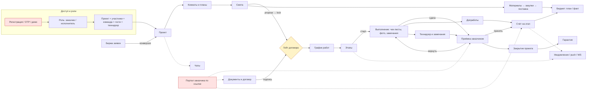
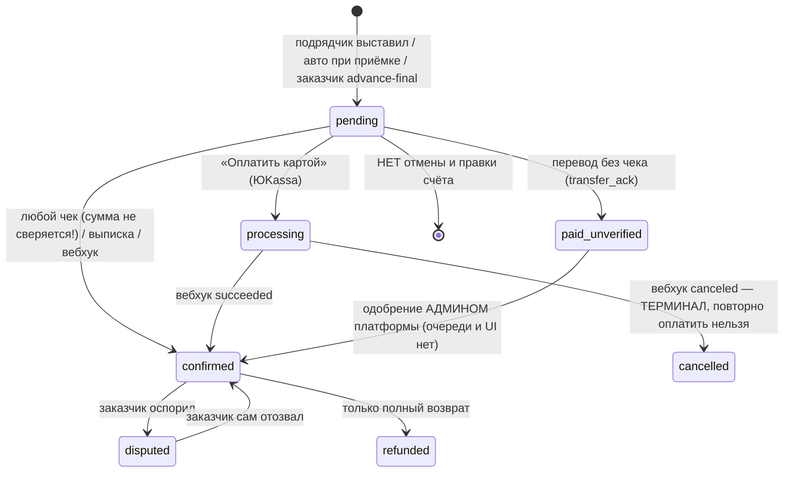
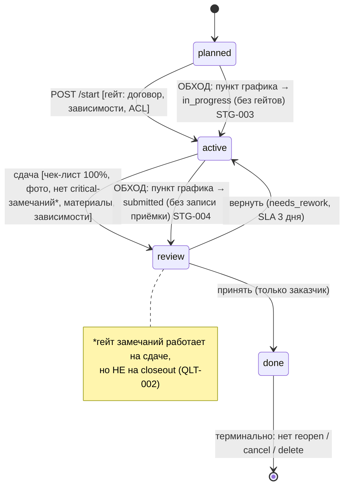

# Renova — карта проекта и реестр слабых мест

**Дата аудита:** 2026-09-30 · **Срез кода:** `main` на момент аудита · **Метод:** 14 независимых аудиторов (агентов), чтение кода + существующие тесты + in-process пробы на изолированной БД + живой обход UI и API-сценарий.
**Продуктовый код в ходе аудита не менялся.** Каждый срез — отдельный документ в этой папке; здесь — сводка, сквозные схемы и план.

> Утверждения помечены «проба» (воспроизведено запуском), «код» (однозначно из исходника) или «гипотеза». Числа ниже — по реестрам срезов; одна и та же проблема часто найдена несколькими срезами независимо (это усиливает уверенность, но и завышает сумму).

---

## 0. Состав и цифры

| # | Срез | Документ | P0 | P1 | P2 | P3 |
|---|---|---|---|---|---|---|
| 01 | Роли, доступ, онбординг, создание проекта | [01](01-roles-access-onboarding.md) | 2 | 11 | 16 | 4 |
| 02 | Этапы, график, календарь, приёмка | [02](02-stages-schedule-acceptance.md) | 1 | 9 | 14 | 6 |
| 03 | Деньги: счета, оплаты, допработы, бюджет | [03](03-money-payments-budget.md) | 2 | 15 | 16 | 3 |
| 04 | Смета, материалы, закупки, наряды | [04](04-estimate-materials-procurement.md) | 1 | 17 | 14 | 5 |
| 05 | Документы, договор, подпись, портал, медиа | [05](05-documents-esign-portal-media.md) | 5 | 10 | 13 | 5 |
| 06 | Чаты, уведомления, push, WebSocket | [06](06-communications-notifications.md) | 0 | 10 | 20 | 12 |
| 07 | Технадзор, замечания, гарантия, комнаты | [07](07-quality-supervision-rooms.md) | 1 | 5 | 14 | 3 |
| 08 | Биржа, исполнитель, команды, отчёты | [08](08-marketplace-contractor-teams.md) | 0 | 17 | 20 | 3 |
| 09 | Перепись экранов и кнопок (карта навигации) | [09](09-screen-census-routes.md) | 6 | 40 | 104 | 65 |
| 10 | Компоненты, формы, состояния, офлайн, сессия | [10](10-components-forms-states-offline.md) | 0 | 11 | 13 | 6 |
| 11 | Backend-эндпоинты A (164 пары метод+путь) | [11](11-backend-endpoints-a.md) | 0 | 7 | 25 | 11 |
| 12 | Backend-эндпоинты B (225 ручек), воркеры, миграции, конфиг | [12](12-backend-endpoints-b-services.md) | 2 | 12 | 34 | 12 |
| 13 | Сквозной сценарий через API (167 шагов, 530 вызовов) | [13](13-live-journey-api.md) + [скрипт](journey-script-13.py) | 2 | 9 | 17 | 3 |
| 14 | Живой обход UI в браузере (≈60 экранов, 2 роли) | [14](14-live-ui-walk.md) | 2 | 4 | 14 | 7 |
| | **Итого записей (с дублями между срезами)** | | **24** | **177** | **334** | **145** |

Охват: 84 backend-роутера, ~390 эффективных ручек, 465 вызовов мобильного клиента, 74 файла маршрутов, 272 компонента. Где именно **не** смотрели — раздел 9.

**Что важно понять сразу.** Приложение в целом «собрано» и большая часть счастливого пути работает (в сквозном сценарии 113 из 167 шагов OK). Но у него системная проблема **доверия к клиенту и ролям**: многие критичные действия защищены только «есть право записи в проект», а не «ты — именно та сторона, которой это можно». Из-за этого исполнитель может делать то, что должен согласовывать заказчик (деньги, договор, бюджет), — и наоборот, часть законных действий заказчика в приложении невозможна (тупики).

---

## 1. Карта разделов и связей



Красным — зоны, где найдены P0 (доступ и портал). Жёлтым — гейт договора (P0: снимается подписью одной стороны).

---

## 2. Кто есть в системе и что фактически может (сводка из срезов 01, 12)

| Роль | Как определяется | Должен уметь | Фактические отклонения |
|---|---|---|---|
| Заказчик (owner) | `role=customer`, владелец проекта | создать проект, выбрать исполнителя, согласовать смету и график, принять этап, оплатить, оспорить | не может заменить/снять исполнителя (ROLE-003); в приложении нет кнопок «принять/вернуть» этап в части путей (STG-004); нельзя вернуть этап после автоприёмки |
| Исполнитель-лид | `project.contractor_id` | вести смету и график, выполнять этапы, выставлять счета, сдавать | **сам меняет бюджет/НДС/название** (ROLE-004), **сам выставляет суммы этапов** (STG-001/MNY-001), **сам занимает чужой проект** (JRN-001), **сам проводит закупку в «оплачено»** (EST-012), **выпускает токен портала за заказчика** (DOC-002) |
| Команда исполнителя (owner/foreman/member/viewer) | `TeamMember` | работа по своим правам | `member` получает те же права, что лид (ROLE-004, APIB-008); прораб не видит этапы (STG-005); нет удаления участника (MKT-012) |
| Гость (viewer) | `ProjectViewer` | только чтение | видит `customer_budget` (ROLE-001); может ставить реакции (QLT) |
| Технадзор | назначается заказчиком | замечания, проверка приёмки | создаёт замечания, но не может их вести (transition/close → 403) (QLT); не получает уведомлений (COM-005) |
| Участник multi-contractor | `ProjectParticipant` | доступ по scope | **403 на любой проект** — функция фактически выключена (ROLE-008) |
| Гость по ссылке портала | токен портала | ограниченные действия по scope | получает **полный JWT заказчика**, scope не проверяется (DOC-001, INB-02, APIB-001) |
| Админ платформы | allowlist | ops | при незаданном `ENVIRONMENT` **любой исполнитель = админ** (APIB-002, MKT-015) |

Полная матрица «роли × 40+ действий с file:line» — в [01](01-roles-access-onboarding.md) §2 и [12](12-backend-endpoints-b-services.md) (63 действия).

---

## 3. Сквозной жизненный цикл: кто кого ждёт

Ниже — реально пройденный путь (срез 13) с отметками, **кто чего ждёт** и где путь ломается. Красные ID — дефекты.

```mermaid
sequenceDiagram
  autonumber
  participant C as Заказчик
  participant S as Система
  participant K as Исполнитель
  participant T as Технадзор
  C->>S: Регистрация, создание проекта
  Note over C,S: Проект без исполнителя. Любой исполнитель может занять его сам (JRN-001, ROLE-002)
  C->>S: Подключить исполнителя (нужен публичный профиль исполнителя — скрытое условие JRN-010)
  K->>S: Смета: строки, расчёт материалов
  Note over K,S: «Рассчитать материалы» = 500 (EST-009). Отрицательные количества принимаются (EST-004)
  K->>S: propose-lock
  C->>S: lock (фиксация сметы)
  Note over C,S: Просроченное предложение → 200 без фиксации, UI пишет «зафиксировано» (EST-002)
  S->>S: Появляется договор только после lock (JRN-012)
  K->>S: Подписывает договор
  Note over S: Гейт «договор подписан» снят ОДНОЙ подписью любой стороны (DOC-003, JRN-002)
  K->>S: График работ: create → submit
  C->>S: Подтверждение графика
  Note over C,S: Подтверждённый график терминален: править, пересогласовать, отозвать нельзя (STG-007)
  K->>S: Старт этапа
  Note over K,S: Обход: смена статуса пункта графика меняет этап без гейтов (STG-003)
  K->>S: Работа: чек-лист, фото, замечания
  T->>S: Замечания (создаёт; закрыть не может — QLT)
  Note over S: Открытые замечания НЕ блокируют приёмку и closeout (QLT-002)
  K->>S: Сдать этап (work-acceptance)
  C->>S: Принять / вернуть
  Note over C,S: В приложении вернуть/принять доступно не на всех путях (STG-004); SLA доработки исполнитель продлевает сам (STG-002)
  S->>C: Счёт на этап (авто, только если нет других счетов)
  C->>S: Оплатить (карта / перевод / чек / выписка)
  Note over C,S: Чек на 1 ₽ засчитан как доказательство оплаты 5000 ₽ (MNY-002). Платёж по этапу не попадает в budget_spent (JRN-006)
  K->>S: Допработы (change order)
  C->>S: Согласовать
  Note over C,S: Первый approve = 500 (JRN-004). Документ допработ создаётся пустым и не подписывается (DOC-006, JRN-005)
  C->>S: Закрытие проекта (closeout)
  Note over C,S: closeout требует ноль неоплаченных → приходится «подтверждать» неоплаченное (JRN-008)
  C->>S: Гарантийное обращение
  Note over C,K: Нет ответа исполнителя, нет повторного открытия, нет уведомления о закрытии (QLT-004)
```

### 3.1 Таблица ожиданий (кто кого блокирует)

| Шаг | Инициатор | Ждёт подтверждения от | Что блокируется, пока ждут | Что при отказе / таймауте | Проблемы |
|---|---|---|---|---|---|
| Подключение исполнителя | заказчик | исполнитель (публичный профиль) | смета, договор, график | нет «отказа» и «замены» | ROLE-003, JRN-001/010, ROLE-006 (кнопка «Подключить» шлёт не тот id → 404) |
| Фиксация сметы | исполнитель (propose) | заказчик (lock) | договор, график, старт | срок 14 дней; просрочка → тихий 200 | EST-002/003, APIA-004/005 |
| Договор | исполнитель / заказчик | обе стороны (должно быть) | старт этапов | — | DOC-003/4/5 (реально хватает одной подписи любого) |
| График работ | исполнитель | заказчик | старт, даты этапов | reject → правка; после confirm терминален | STG-007 |
| Сдача этапа | исполнитель | заказчик (принять/вернуть) | следующий этап, счёт | вернуть → доработка, SLA 3 дня, ничего не срабатывает при просрочке | STG-002/014/015 |
| Счёт на этап | автоматически / подрядчик | заказчик (оплата) | закрытие проекта | нельзя отменить/править | MNY-006/007/008 |
| Оплата переводом | заказчик | админ платформы (paid_unverified) | попадание в факт бюджета | **нет очереди/экрана админа** | MNY-009/015 |
| Допработы | исполнитель | заказчик (approve) | оплата допработ | документ пустой | JRN-004/005, MNY-020 (не связаны со счётом и этапом) |
| Закупка | исполнитель / заказчик | обе стороны (должно быть) | материалы на объекте | — | EST-012 (любой участник ставит «оплачено») |
| Замечание | технадзор / заказчик | исполнитель (fixed) → заказчик (closed) | приёмка (должно) | не блокирует | QLT-002/003 |
| Гарантия | заказчик | исполнитель | — | нет ответа | QLT-004 |

### 3.2 Деньги: жизненный цикл счёта (срез 03)



### 3.3 Этап работ (срез 02)



---

## 4. Системные корневые причины

Большинство из 680 записей — проявления ограниченного числа причин. Чинить по причинам эффективнее, чем по симптомам.

| # | Корневая причина | Что это даёт | Ключевые ID |
|---|---|---|---|
| R1 | **Авторизация = «есть write-доступ», без проверки роли-стороны.** Нет разделения «заказчик решает / исполнитель исполняет» | исполнитель меняет бюджет, суммы этапов, статусы закупки, участвует в согласованиях за заказчика | ROLE-004, STG-001, MNY-001, EST-012, REP-09, OBJ-03, APIB-008/9/10 |
| R2 | **Портал: токен ≡ полный пользователь.** Claim `portal` не читается, scope не проверяется; исполнитель может выпустить токен за заказчика | эскалация прав: приёмка, подпись, оплата, корзина проекта | DOC-001/2, INB-01/2, BUD-40, APIB-001 |
| R3 | **Гейт договора проверяет наличие подписи, а не «подписан обеими»,** не сверяет тип документа и версию | «нет работ без договора» — фикция; тесты закрепляют неверное поведение | DOC-003/4/5, INB-03, JRN-002 |
| R4 | **Деньги: нет ограничений и обратных операций.** Чек не сверяется с суммой; счёт нельзя отменить; сумма счетов на этап не ограничена; `paid_unverified` без выхода | потеря/накрутка денег, тупики закрытия | MNY-002/006/007/008/009/015, JRN-006/008 |
| R5 | **Опасные значения по умолчанию.** `ENVIRONMENT=development` по умолчанию: вход по `X-User-Id`, демо, слабый секрет, любой исполнитель = админ | при забытой переменной прод открыт | APIB-002, MKT-015 |
| R6 | **Смета «живая» после фиксации:** комнаты и предложения обходят замок | цена договора растёт без согласия (43 035 → 326 209 ₽ в пробе) | EST-001, QLT-001, EST-002/3 |
| R7 | **Машины состояний с дырами:** обходные пути в обход гейтов, терминальные состояния без выхода, отсутствие SLA-действий | тупики, «зависшие» этапы/графики/счета | STG-003/4/7/8/9/14/15, MNY-009, QLT-003 |
| R8 | **Клиент: офлайн, сессия и кэш.** 26 записывающих вызовов имеют «мёртвую» ветку очереди; refresh-токен ротируется только в памяти; нет глобального 401; кэш не инвалидируется после мутаций; `Alert.alert` на web — пустая функция | потерянные записи, внезапные разлогины, устаревший экран, невидимые ошибки | CMP-001/2/3/4/7, SCR-001 |
| R9 | **Уведомления не доходят до людей.** Центр уведомлений не подключён; push без роли; получатели только заказчик и лид | команда, технадзор, гости «не в курсе»; тап по push ведёт не туда | COM-001/2/5/20 |
| R10 | **Приложение честно показывает не то, что есть:** фиктивные деньги/нули/экономия, админ-пункты у всех, экраны одной роли у другой | потеря доверия, риск неверных решений | UI-001/7/10/27, CMP-013 |
| R11 | **Кластер «500 по одной причине»:** пустое поле/атрибут в стандартном пути | «Рассчитать материалы» всегда 500; budget-alerts 500 после commit; первый approve допработ 500 | EST-009/JRN-003, APIA-001, JRN-004 |
| R12 | **Функции-призраки:** реализованы на сервере/в UI, но не связаны (участники multi-contractor, in-app уведомления, календарь, `calc-engine` не импортируется, 45 неиспользуемых модулей, 32 определения мёртвых роутов) | ложное ощущение готовности | ROLE-008, COM-001, EST-030, APIA-* |

---

## 5. Реестр P0 (уникальные, после дедупликации)

| # | Проблема | Где подтверждено | Влияние |
|---|---|---|---|
| P0-1 | Токен портала = полный JWT пользователя; scope не проверяется | DOC-001, INB-02, APIB-001 | любая «ссылка только чтение» открывает всё |
| P0-2 | Исполнитель выпускает портал-токен за заказчика со scope приёмки/подписи/оплаты; кнопка включает права по умолчанию | DOC-002, INB-01, BUD-40 | исполнитель подписывает и принимает за заказчика |
| P0-3 | Гейт договора снимается одной подписью любой стороны / любым файлом типа `contract` / подмена версии после подписи | DOC-003/4/5, INB-03, JRN-002 | работы без договора; тесты закрепляют баг |
| P0-4 | `PATCH /stages/payment-plan` доступен исполнителю без лимита и согласия | STG-001, MNY-001 | сумма становится счётом заказчику |
| P0-5 | Чек на 1 ₽ как «доказательство» оплаты счёта на 5000 ₽ | MNY-002 | обход `paid_unverified` и ревью |
| P0-6 | `PATCH /projects/{id}` без проверки роли (бюджет, НДС, название) | ROLE-004, OBJ-03, APIB-008 | исполнитель правит лимит заказчика |
| P0-7 | `customer_budget` (приватный лимит) виден исполнителю, команде, гостям | ROLE-001 | утечка позиции заказчика в переговорах |
| P0-8 | Purge проекта каскадно удаляет подтверждённые платежи (защита только для legal-hold документов) | ROLE-005 | необратимая потеря финансовых данных |
| P0-9 | Смета переписывается после фиксации правкой комнат | EST-001, QLT-001 | цена договора меняется без согласия |
| P0-10 | Любой участник ставит закупке `paid/delivered` (даже `draft→delivered`), растёт `budget_spent` | REP-09, EST-012, APIB-010 | расход без чека и без заказчика |
| P0-11 | Самозахват проекта любым исполнителем; снять/заменить нельзя | JRN-001, ROLE-002/3 | заказчик теряет контроль над проектом |
| P0-12 | `ENVIRONMENT` по умолчанию `development` | APIB-002 | забытая переменная = открытый прод |
| P0-13 | Падение «Maximum update depth»: «Админ: панель», «Шаблоны чеклиста», «Подписка Про», «Админ: статистика», FAB «В черновик» | UI-002/3 | белый экран, зависание вкладки |

---

## 6. Самые заметные P1 по зонам

**Тупики (функция невозможна для нужной роли):** заказчик не может принять/вернуть этап на части путей и подрядчик не может пересдать (STG-004); подтверждённый график нельзя править (STG-007); `paid_unverified` без выхода (MNY-009/015); счёт нельзя отменить (MNY-006); замечание без исполнителя нельзя закрыть (QLT-003); гарантия без ответа (QLT-004); нельзя отозвать отклик/отказаться от заявки/закрыть её (MKT-005/6); заказчик не может добавить комнату после подключения исполнителя (QLT-007); нет удаления аккаунта в UI (ROLE-016); участник команды не удаляется (MKT-012).

**Сломано (ошибка при обычном действии):** «Рассчитать материалы» — всегда 500 (EST-009); первый approve допработ — 500 (JRN-004); `budget-alerts` — 500 и повторное уведомление (APIA-001); документ допработ не подписывается (DOC-006); «Подключить» в каталоге всегда 404 — шлёт id профиля вместо id пользователя (ROLE-006); фото в чате не рисуются — 401 (COM-003); PDF/видео из чата → 500 (COM-004).

**Неверные данные / деньги:** платёж по этапу не попадает в `budget_spent` (JRN-006); «Экономия 185 938 ₽» при факте 0 (UI-001); три несовместимых определения «факта материалов» (EST-007); калькулятор существует в четырёх расходящихся копиях (краска: 11,23 л против 4,91 л) (EST-030); запятая как десятичный разделитель даёт неверные размеры и суммы (EST-008, CMP-013); выписка теряет знак суммы (MNY-022).

**Доступ:** две оставшиеся IDOR — `analytics/budget-room-lines/{room_id}` и `checklist-templates/{id}/versions` (APIA-002/3, MNY-017, EST-021); `fns/verify-me` присваивает «НПД подтверждён» любому по любому ИНН (APIA-008); участник команды правит план оплат, бюджет, название (APIB-008/9); чат принимает любой `message_type` (спуфинг system/payment).

**Маркетплейс:** цена конкурента снова утекает (авто-назначение после принятия отклика) (MKT-001/2); конверсия теряет цену/бюджет/описание и создаёт «комнату 4×3» (MKT-007); конверсия обходит Pro-лимит (MKT-008, APIB-003); «сохранить реквизиты» затирает специализации и город (MKT-003).

**Клиент (надёжность):** офлайн-очередь «мертва» для 26 вызовов (CMP-001); повтор из очереди без обновления токена блокирует задание (CMP-007); `createProject` без `client_request_id` → дубль проекта при «Повторить» (CMP-005); гость портала получает 401 (CMP-009); `Alert.alert` на web ничего не делает — теряются ошибки и подтверждения в 39 файлах (SCR-001).

**Инфраструктура:** живая dev-БД отставала от кода (исправлено при аудите, миграции применены); процесса воркера на стенде нет — напоминания, push-квитанции, сверка провайдеров не работают (APIB-027); схема после `alembic upgrade head` расходится с моделями в 47 местах (APIB-039); два теста устарели относительно верного охранника `contract_has_no_content` (падают: `test_sign_in_app_via_registry`, `test_portal_sign_draft_document`) — при этом второй воспроизводит реальный баг допработ (DOC-006).

---

## 7. План исправлений волнами

Принцип: **сначала закрыть возможность вреда** (безопасность и деньги), потом тупики жизненного цикла, потом надёжность клиента, потом коммуникации и полировку. Внутри волны задачи по непересекающимся файлам идут параллельно (один агент = одна задача); каждую волну завершает регрессия: прогон `journey-script-13.py` (167 шагов) и живой обход UI-14.

### Волна 0 — «закрыть дыры» (немедленно)
| Задача | Файлы (основные) | Закрывает | Зависимости |
|---|---|---|---|
| 0-A Портал: токен ограничен своим scope; исполнитель не выпускает токен за заказчика; безопасные значения кнопки «Портал заказчику» | `portal.py`, `deps.py`, `security.py`, `DocumentsHub.tsx`, `PortalSharePanel.tsx` | P0-1, P0-2 | до 0-D (общий `deps.py`) |
| 0-B Ролевые проверки: `patch_project`, `payment-plan`, статус закупки, скрыть `customer_budget` | `projects.py`, `project_profile_service.py`, `stage_mutations.py`, `purchases.py` | P0-4, P0-6, P0-7, P0-10 | — |
| 0-C Гейт договора: обе стороны, тип, фиксация версии; исправить тесты, закрепляющие баг | `project_document_service.py`, `documents.py`, `document_lifecycle.py`, тесты | P0-3 | решение по допработам (документ допработ) |
| 0-D Безопасная конфигурация: обязательный `ENVIRONMENT`, fail-closed для `X-User-Id`/demo/админа | `config.py`, `environment.py`, `deps.py` | P0-12 | после 0-A |
| 0-E Purge: не удалять подтверждённые платежи/подписанные договоры; корзина не сбрасывает архив | `project_service.py`, `entities.py` (FK) + миграция | P0-8 | — |
| 0-F Самозахват проекта: акцепт заказчика; возможность заменить/снять исполнителя | `project_assignment_service.py`, `project_participant_service.py`, UI | P0-11 | **нужно продуктовое решение** |
| 0-G Падения «Maximum update depth» на маршрутах профиля/FAB | `AppCatchAllScreen.tsx`, `(contractor)/[tool].tsx`, `app/[slug].tsx`, навигация | P0-13 | — |
| 0-H Замок сметы для комнат | `room_service.py`, `room_mutation_service.py`, `room_change_service.py` | P0-9 | — |

### Волна 1 — деньги и смета (после 0-B, 0-C)
Чек ↔ сумма счёта (MNY-002); ограничения суммы счетов на этап; отмена/правка счёта (MNY-006/7/8); очередь и экран для `paid_unverified` + подтверждение/оспаривание исполнителем (MNY-009/15); попадание платежей этапов в `budget_spent` (JRN-006); `closeout` без «подтверждения неоплаченного» (JRN-008); допработы: пустой договор, связь со счётом и этапом, 500 при первом approve (DOC-006, MNY-020, JRN-004); «Рассчитать материалы» 500 (EST-009); `budget-alerts` 500 (APIA-001); propose/lock: снимок и просрочка (EST-002/3); отрицательные количества (EST-004); единый калькулятор и подключение `calc-engine` в CI (EST-030).

### Волна 2 — жизненный цикл и состояния
Обходы гейтов через график (STG-003/4); пересогласование подтверждённого графика (STG-007); блокировка обходов `calendar PATCH` и `.ics` (STG-008/9); прораб видит и стартует этапы (STG-005); отмена этапа и снятие зависимости (STG-010); действия по просроченному SLA и ожиданию приёмки (STG-014/15); кнопки «принять/вернуть/пересдать» на всех путях (STG-004); замечания блокируют приёмку и closeout (QLT-002); закрытие замечания без исполнителя (QLT-003); гарантия: ответ исполнителя, повторное открытие, уведомление (QLT-004); участники multi-contractor (ROLE-008); удаление участника команды (MKT-012).

### Волна 3 — надёжность клиента
Живая офлайн-очередь для 26 вызовов (CMP-001); сохранение ротации refresh-токена и глобальный 401 (CMP-002/3); обновление токена при повторе из очереди (CMP-007); инвалидация кэша после мутаций (CMP-004); `Alert.alert` на web (SCR-001); стабильные ключи идемпотентности для `createProject`/`createRoom` (CMP-005/6); разбор чисел с запятой (CMP-013/EST-008); гость портала (CMP-009); кнопки баннера не вызывают `demoLogin` в проде (CMP-008).

### Волна 4 — коммуникации
Подключить центр уведомлений (COM-001); роль в push и корректные ссылки для исполнителя (COM-002/20); получатели: команда, технадзор, гости (COM-005); фото/PDF/видео в чате (COM-003/4); проекты из корзины в inbox (COM-007); отвязка push-токена при выходе (COM-017); события без уведомления (назначение исполнителя, календарь, неоплаченные счета) (COM-021).

### Волна 5 — биржа и профиль исполнителя
Утечка цены при авто-назначении (MKT-001/2); конверсия: перенос цены/бюджета/описания, Pro-лимит (MKT-007/8); профиль не затирается (MKT-003/4); отзыв отклика, отказ, отмена и закрытие заявки, уведомления (MKT-005/6/10); «Подключить» из каталога (ROLE-006); ссылка вступления в бригаду и QR (ROLE-009/10).

### Волна 6 — честность интерфейса и полировка
Фиктивные деньги на бюджетных экранах (UI-001/7); админские пункты только админу (UI-027); экраны, адаптированные под роль (UI-010, SCR-007); пустые состояния по всем экранам; 195 записей переписи экранов (P2/P3 пакетами по разделам); 45 неиспользуемых модулей и мёртвые роуты; a11y и токены дизайн-системы.

### Волна 7 — инфраструктура и качество
Процесс воркера и мониторинг (APIB-027); расхождение схемы и моделей в 47 местах (APIB-039); миграции применяются при деплое; устаревшие тесты (`contract_has_no_content`) — переписать вместе с продуктовым исправлением DOC-006; включить сквозной сценарий 13 как CI-регрессию.

**Рекомендуемое распараллеливание:** волна 0 — до 6 агентов одновременно (0-A→0-D последовательно); волны 1–3 — по 4–6; каждая волна = отдельный набор коммитов в `main` с тестами и обновлением этого реестра (закрытые ID вычёркиваются).

---

## 8. Как перепроверять
1. `python docs/audit-map/journey-script-13.py` (через pytest по явному пути) — 167 шагов; число «ТУПИК/ОШИБКА» должно падать от волны к волне.
2. Живой обход UI (см. [14](14-live-ui-walk.md)) — экраны с белым экраном, 403/500 в консоли.
3. Диф переписи маршрутов ([09](09-screen-census-routes.md)) — недостижимые экраны и кнопки-заглушки.
4. Реестры срезов — каждый ID имеет file:line и способ воспроизведения.

## 9. Что не проверено (честно)
- Реальные внешние системы: ЮKassa, ФНС/«Мой налог», Контур/Госключ, Expo push, S3/MinIO как боевое хранилище.
- Поведение на PostgreSQL под конкуренцией (гонки, блокировки) — только частично (часть PG-тестов пропущена без `POSTGRES_TEST_URL`).
- Мобильные нативные сценарии (iOS/Android): клавиатура, размеры касаний, холодный старт по push, лимиты AsyncStorage — смотрели по коду и на web.
- Роль технадзора в мобильном приложении вживую, портальный путь целиком, `auto-assign` маркетплейса, OCR/файлы.
- Нагрузка: rate limit 120 rpm (в dev 400) сопоставлен с трафиком только по коду.
- Часть записей помечена «гипотеза» в своих срезах (напр. ROLE-017, EST-037, COM-031/036/040).
